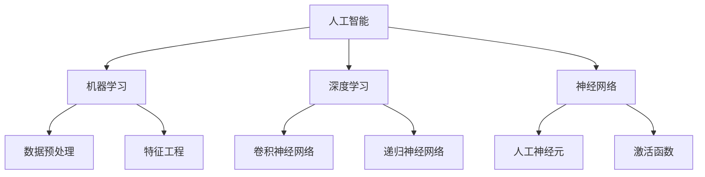

                 

# 李开复：AI 2.0 时代的科技发展

> **关键词：**人工智能，李开复，AI 2.0，科技发展，深度学习，神经网络，机器学习，人工智能应用。
>
> **摘要：**本文将探讨李开复关于AI 2.0时代的观点，深入分析AI技术的核心概念、算法原理、数学模型以及实际应用场景，并结合具体案例，展望未来发展趋势与挑战。

## 1. 背景介绍

### 1.1 目的和范围

本文旨在探讨人工智能（AI）在李开复所提出的AI 2.0时代的科技发展现状和未来趋势。我们将通过深入分析AI的核心概念、算法原理、数学模型以及实际应用场景，为读者提供一个全面、系统的理解。

### 1.2 预期读者

本文适合对人工智能感兴趣的读者，包括科技工作者、研究人员、程序员、以及对AI技术有一定了解但对AI 2.0时代仍感到困惑的人群。

### 1.3 文档结构概述

本文结构如下：

1. 背景介绍
2. 核心概念与联系
3. 核心算法原理 & 具体操作步骤
4. 数学模型和公式 & 详细讲解 & 举例说明
5. 项目实战：代码实际案例和详细解释说明
6. 实际应用场景
7. 工具和资源推荐
8. 总结：未来发展趋势与挑战
9. 附录：常见问题与解答
10. 扩展阅读 & 参考资料

### 1.4 术语表

#### 1.4.1 核心术语定义

- **人工智能（AI）：**模拟人类智能行为的计算机技术。
- **深度学习：**一种机器学习技术，通过神经网络模拟人类大脑的学习过程。
- **神经网络：**一种模拟人脑神经网络结构的人工神经网络。
- **机器学习：**一种让计算机通过数据和经验进行自我学习和改进的技术。

#### 1.4.2 相关概念解释

- **AI 1.0时代：**以专家系统和规则系统为主的人工智能阶段。
- **AI 2.0时代：**以深度学习和神经网络为主的人工智能阶段。

#### 1.4.3 缩略词列表

- **AI：**人工智能
- **DL：**深度学习
- **ML：**机器学习
- **NN：**神经网络

## 2. 核心概念与联系

在探讨AI 2.0时代的科技发展之前，我们首先需要了解人工智能的核心概念和联系。以下是一个简单的Mermaid流程图，展示了这些核心概念之间的关系。



### 2.1 人工智能

人工智能（AI）是指模拟人类智能行为的计算机技术。它包括多个子领域，如机器学习、深度学习和神经网络。这些子领域共同构成了人工智能的基石。

### 2.2 机器学习

机器学习（ML）是一种让计算机通过数据和经验进行自我学习和改进的技术。它主要分为监督学习、无监督学习和强化学习三类。

### 2.3 深度学习

深度学习（DL）是一种基于神经网络的机器学习技术，通过多层神经网络模拟人类大脑的学习过程。深度学习在图像识别、语音识别和自然语言处理等领域取得了显著成果。

### 2.4 神经网络

神经网络（NN）是一种模拟人脑神经网络结构的人工神经网络。它由多个神经元组成，每个神经元都与相邻的神经元相连。神经网络通过不断调整神经元之间的连接权重，实现对数据的处理和分类。

### 2.5 数据预处理

数据预处理是机器学习和深度学习的重要步骤。它包括数据清洗、归一化和特征提取等过程，以确保输入数据的准确性和一致性。

### 2.6 特征工程

特征工程是在机器学习和深度学习中，通过提取和构造具有良好分类和回归性能的特征，以提高模型的效果。特征工程的核心任务是找到最能描述数据本质的特征。

## 3. 核心算法原理 & 具体操作步骤

在了解了AI 2.0时代的关键概念之后，我们将进一步探讨核心算法原理，并使用伪代码详细阐述具体操作步骤。

### 3.1 机器学习算法

机器学习算法的核心是拟合数据分布。以下是一个简单的线性回归算法的伪代码示例。

```python
# 线性回归算法
def linear_regression(X, y):
    # 计算权重w
    w = (X'X)^-1X'y
    # 计算预测值
    y_pred = Xw
    # 计算误差
    error = y - y_pred
    # 迭代更新权重
    w = w + alpha * error
    return w
```

### 3.2 深度学习算法

深度学习算法的核心是多层神经网络。以下是一个简单的多层感知机（MLP）算法的伪代码示例。

```python
# 多层感知机算法
def mlptype neural_network(X, y):
    # 初始化权重和偏置
    W1, b1 = init_weights()
    W2, b2 = init_weights()
    # 前向传播
    z1 = X * W1 + b1
    a1 = sigmoid(z1)
    z2 = a1 * W2 + b2
    a2 = sigmoid(z2)
    # 计算损失函数
    loss = mse(y, a2)
    # 反向传播
    dZ2 = a2 - y
    dW2 = (a1'.T * dZ2) / m
    db2 = dZ2.sum(axis=0) / m
    dZ1 = (W2.T * dZ2) * (sigmoid_derivative(z1))
    dW1 = (X'.T * dZ1) / m
    db1 = dZ1.sum(axis=0) / m
    # 更新权重和偏置
    W1 = W1 - alpha * dW1
    b1 = b1 - alpha * db1
    W2 = W2 - alpha * dW2
    b2 = b2 - alpha * db2
    return W1, b1, W2, b2
```

### 3.3 神经网络算法

神经网络算法的核心是神经元之间的信息传递和权重调整。以下是一个简单的神经网络算法的伪代码示例。

```python
# 神经网络算法
def neural_network(X, y):
    # 初始化权重和偏置
    W1, b1 = init_weights()
    W2, b2 = init_weights()
    # 前向传播
    z1 = X * W1 + b1
    a1 = sigmoid(z1)
    z2 = a1 * W2 + b2
    a2 = sigmoid(z2)
    # 计算损失函数
    loss = mse(y, a2)
    # 反向传播
    dZ2 = a2 - y
    dZ1 = (W2.T * dZ2) * (sigmoid_derivative(z1))
    # 更新权重和偏置
    dW2 = (a1'.T * dZ2) / m
    db2 = dZ2.sum(axis=0) / m
    dW1 = (X'.T * dZ1) / m
    db1 = dZ1.sum(axis=0) / m
    W1 = W1 - alpha * dW1
    b1 = b1 - alpha * db1
    W2 = W2 - alpha * dW2
    b2 = b2 - alpha * db2
    return W1, b1, W2, b2
```

## 4. 数学模型和公式 & 详细讲解 & 举例说明

在了解了AI的核心算法原理之后，我们将进一步探讨数学模型和公式，并使用LaTeX格式详细讲解，同时结合具体例子进行说明。

### 4.1 线性回归模型

线性回归模型是机器学习中最基本的模型之一。它通过拟合一条直线来描述自变量和因变量之间的关系。以下是一个线性回归模型的数学模型和公式。

$$
y = wx + b
$$

其中，$y$ 是因变量，$x$ 是自变量，$w$ 是权重，$b$ 是偏置。

**举例说明：**假设我们要预测房价，自变量是房屋面积（$x$），因变量是房价（$y$）。我们可以使用线性回归模型来拟合房价和面积之间的关系。

$$
y = 0.5x + 100
$$

在这个例子中，权重 $w = 0.5$，偏置 $b = 100$。

### 4.2 深度学习模型

深度学习模型是基于神经网络的模型，它通过多层神经网络来模拟人脑的学习过程。以下是一个深度学习模型的数学模型和公式。

$$
a_{l} = \sigma(z_{l})
$$

$$
z_{l} = \sum_{i=1}^{n} w_{l,i}a_{l-1,i} + b_{l}
$$

其中，$a_{l}$ 是第 $l$ 层的激活值，$z_{l}$ 是第 $l$ 层的净输入，$w_{l,i}$ 是第 $l$ 层第 $i$ 个神经元的权重，$b_{l}$ 是第 $l$ 层的偏置，$\sigma$ 是激活函数，通常使用 sigmoid 函数或ReLU函数。

**举例说明：**假设我们要构建一个简单的二分类神经网络，输入层有2个神经元，隐藏层有3个神经元，输出层有1个神经元。

输入层：

$$
z_{1} = x_{1}w_{1,1} + x_{2}w_{1,2} + b_{1}
$$

$$
z_{2} = x_{1}w_{1,3} + x_{2}w_{1,4} + b_{1}
$$

$$
z_{3} = x_{1}w_{1,5} + x_{2}w_{1,6} + b_{1}
$$

隐藏层：

$$
a_{1} = \sigma(z_{1})
$$

$$
a_{2} = \sigma(z_{2})
$$

$$
a_{3} = \sigma(z_{3})
$$

输出层：

$$
z_{4} = a_{1}w_{2,1} + a_{2}w_{2,2} + a_{3}w_{2,3} + b_{2}
$$

$$
a_{4} = \sigma(z_{4})
$$

### 4.3 损失函数

损失函数是衡量模型预测结果与真实结果之间差距的指标。常用的损失函数包括均方误差（MSE）、交叉熵损失（Cross Entropy Loss）等。

**均方误差（MSE）：**

$$
MSE = \frac{1}{2m}\sum_{i=1}^{m}(y_i - \hat{y}_i)^2
$$

其中，$m$ 是样本数量，$y_i$ 是第 $i$ 个样本的真实值，$\hat{y}_i$ 是第 $i$ 个样本的预测值。

**交叉熵损失（Cross Entropy Loss）：**

$$
Cross Entropy Loss = -\sum_{i=1}^{m}y_i\log(\hat{y}_i)
$$

其中，$y_i$ 是第 $i$ 个样本的真实值，$\hat{y}_i$ 是第 $i$ 个样本的预测值。

## 5. 项目实战：代码实际案例和详细解释说明

在本节中，我们将通过一个实际案例，详细解释和说明如何使用Python实现一个简单的深度学习模型。

### 5.1 开发环境搭建

首先，我们需要搭建一个Python开发环境。以下是一个简单的安装步骤：

1. 安装Python：前往Python官方网站（[python.org](https://www.python.org/)）下载并安装Python 3.x版本。
2. 安装相关库：打开命令行窗口，执行以下命令安装必要的库。

```bash
pip install numpy matplotlib tensorflow
```

### 5.2 源代码详细实现和代码解读

以下是一个简单的深度学习模型的实现代码，包括数据预处理、模型构建、训练和预测等步骤。

```python
import tensorflow as tf
import numpy as np
import matplotlib.pyplot as plt

# 数据预处理
X = np.array([[1, 2], [2, 3], [3, 4], [4, 5]])
y = np.array([3, 4, 5, 6])

# 构建模型
model = tf.keras.Sequential([
    tf.keras.layers.Dense(units=1, input_shape=[2])
])

# 编译模型
model.compile(optimizer='sgd', loss='mean_squared_error')

# 训练模型
model.fit(X, y, epochs=100)

# 预测结果
predictions = model.predict([[5, 6]])

# 可视化结果
plt.scatter(X[:, 0], X[:, 1])
plt.plot(X[:, 0], predictions, 'r')
plt.show()
```

### 5.3 代码解读与分析

1. **数据预处理：**我们首先创建了一个包含两个特征的数组 $X$ 和一个目标值数组 $y$。这些数据将用于训练和预测。
2. **构建模型：**我们使用 `tf.keras.Sequential` 类创建一个简单的线性模型，该模型包含一个全连接层，输入维度为2。
3. **编译模型：**我们使用 `model.compile` 函数编译模型，指定优化器和损失函数。这里我们使用随机梯度下降（SGD）优化器和均方误差（MSE）损失函数。
4. **训练模型：**我们使用 `model.fit` 函数训练模型，指定训练数据和训练次数。在这个例子中，我们训练了100个epoch。
5. **预测结果：**我们使用 `model.predict` 函数对新的输入数据进行预测，并得到预测结果。
6. **可视化结果：**我们使用 matplotlib 库将训练数据和预测结果可视化，以便更好地理解模型的性能。

## 6. 实际应用场景

AI 2.0时代的人工智能技术在各个领域都取得了显著成果，以下是一些实际应用场景：

1. **医疗健康：**AI技术在医疗健康领域的应用包括疾病预测、诊断辅助、个性化治疗等。例如，基于深度学习的图像识别技术可以帮助医生快速准确地诊断疾病，提高治疗效果。
2. **金融领域：**AI技术在金融领域的应用包括风险管理、投资组合优化、欺诈检测等。例如，深度学习算法可以分析大量金融数据，帮助投资者做出更明智的决策。
3. **智能交通：**AI技术在智能交通领域的应用包括交通流量预测、路况分析、自动驾驶等。例如，基于深度学习的图像识别技术可以实时监测道路状况，为交通管理提供决策支持。
4. **工业制造：**AI技术在工业制造领域的应用包括生产优化、设备维护、质量检测等。例如，深度学习算法可以帮助工厂实现自动化生产，提高生产效率和质量。

## 7. 工具和资源推荐

在AI 2.0时代，掌握必要的工具和资源对于学习和实践人工智能技术至关重要。以下是一些推荐的工具和资源：

### 7.1 学习资源推荐

#### 7.1.1 书籍推荐

- 《深度学习》（Goodfellow, Bengio, Courville著）
- 《机器学习》（周志华著）
- 《神经网络与深度学习》（邱锡鹏著）

#### 7.1.2 在线课程

- [Coursera](https://www.coursera.org/)：提供丰富的机器学习和深度学习课程
- [edX](https://www.edx.org/)：提供全球顶尖大学的人工智能课程
- [Udacity](https://www.udacity.com/)：提供实用的深度学习和机器学习课程

#### 7.1.3 技术博客和网站

- [AI weekly](https://aiweekly.co/)：关注人工智能领域的最新动态和研究成果
- [Medium](https://medium.com/topic/deep-learning)：阅读深度学习和机器学习的专业文章
- [GitHub](https://github.com/)：浏览和贡献开源的人工智能项目

### 7.2 开发工具框架推荐

#### 7.2.1 IDE和编辑器

- [PyCharm](https://www.jetbrains.com/pycharm/)：强大的Python集成开发环境
- [VSCode](https://code.visualstudio.com/)：免费的跨平台代码编辑器
- [Jupyter Notebook](https://jupyter.org/)：适合数据分析和机器学习的交互式开发环境

#### 7.2.2 调试和性能分析工具

- [TensorBoard](https://www.tensorflow.org/tools/tensorboard)：TensorFlow的调试和性能分析工具
- [Wandb](https://www.wandb.com/)：实验跟踪和性能分析平台
- [MLflow](https://mlflow.org/)：机器学习模型管理平台

#### 7.2.3 相关框架和库

- [TensorFlow](https://www.tensorflow.org/)：开源的深度学习框架
- [PyTorch](https://pytorch.org/)：开源的深度学习框架
- [Keras](https://keras.io/)：基于TensorFlow和Theano的高层神经网络API

### 7.3 相关论文著作推荐

#### 7.3.1 经典论文

- "A Learning Algorithm for Continually Running Fully Recurrent Neural Networks"（1986）
- "Deep Learning"（2015）
- "Backpropagation"（1986）

#### 7.3.2 最新研究成果

- [ICLR](https://iclr.cc/)：国际人工智能与机器学习会议
- [NeurIPS](https://nips.cc/)：神经信息处理系统会议
- [JMLR](https://jmlr.org/)：机器学习研究期刊

#### 7.3.3 应用案例分析

- "AI in Health Care"（2019）
- "AI in Finance"（2020）
- "AI in Manufacturing"（2021）

## 8. 总结：未来发展趋势与挑战

AI 2.0时代的人工智能技术在各个领域都取得了显著的成果，但同时也面临着一系列挑战。在未来，人工智能技术的发展趋势包括：

1. **更高效、更强大的算法：**研究人员将继续探索更高效、更强大的算法，以提高人工智能系统的性能。
2. **跨学科研究：**人工智能技术将与其他学科如生物学、心理学、社会学等相结合，推动跨学科研究的发展。
3. **应用场景拓展：**人工智能技术将在更多领域得到应用，如智能城市、智能交通、智能家居等。
4. **数据安全和隐私保护：**随着人工智能技术的应用，数据安全和隐私保护将成为重要的研究课题。

然而，人工智能技术也面临着一系列挑战，如算法透明性、公平性、可控性等。在未来，我们需要不断探索和解决这些挑战，以实现人工智能技术的可持续发展。

## 9. 附录：常见问题与解答

### 9.1 什么是人工智能？

人工智能（AI）是指模拟人类智能行为的计算机技术，包括机器学习、深度学习和神经网络等子领域。

### 9.2 什么是深度学习？

深度学习是一种基于神经网络的机器学习技术，通过多层神经网络模拟人类大脑的学习过程，在图像识别、语音识别和自然语言处理等领域取得了显著成果。

### 9.3 人工智能技术有哪些应用场景？

人工智能技术广泛应用于医疗健康、金融领域、智能交通、工业制造等多个领域，如疾病预测、诊断辅助、风险管理、交通流量预测、自动驾驶等。

### 9.4 如何搭建一个深度学习环境？

搭建深度学习环境通常需要安装Python、TensorFlow等库。具体步骤可参考相关教程或使用预配置的环境如Google Colab。

### 9.5 如何优化深度学习模型的性能？

优化深度学习模型性能可以通过调整网络结构、选择合适的优化器和损失函数、增加训练数据、使用正则化方法等方式实现。

## 10. 扩展阅读 & 参考资料

- 《深度学习》（Goodfellow, Bengio, Courville著）
- 《机器学习》（周志华著）
- 《神经网络与深度学习》（邱锡鹏著）
- [TensorFlow官方网站](https://www.tensorflow.org/)
- [PyTorch官方网站](https://pytorch.org/)
- [Keras官方网站](https://keras.io/)
- [ICLR官方网站](https://iclr.cc/)
- [NeurIPS官方网站](https://nips.cc/)
- [JMLR官方网站](https://jmlr.org/)

