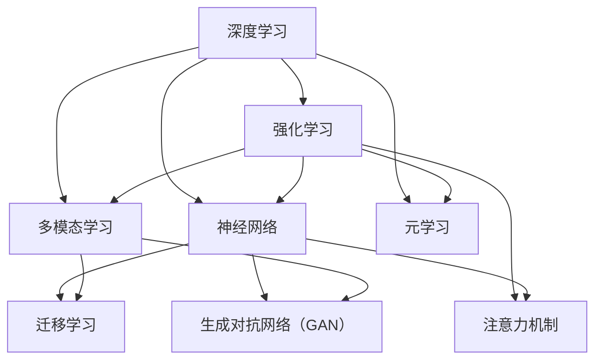

                 

### 1. 背景介绍

#### 1.1 目的和范围

本文旨在深入探讨AI 2.0时代的趋势，分析其技术原理、应用场景以及未来发展的挑战。我们将结合实际案例，逐步解读AI 2.0的核心算法原理，数学模型，以及项目实战。通过本文的阅读，读者将能够全面了解AI 2.0的发展现状和未来前景。

#### 1.2 预期读者

本文面向对人工智能技术有一定了解，希望深入了解AI 2.0时代的读者。特别适合AI研究人员、开发人员、技术爱好者以及企业决策者。

#### 1.3 文档结构概述

本文结构如下：

- **第1章 背景介绍**：阐述本文的目的、范围、预期读者以及文档结构。
- **第2章 核心概念与联系**：介绍AI 2.0的核心概念，并通过Mermaid流程图展示其架构。
- **第3章 核心算法原理 & 具体操作步骤**：详细讲解AI 2.0的核心算法原理，并使用伪代码进行阐述。
- **第4章 数学模型和公式 & 详细讲解 & 举例说明**：介绍AI 2.0中的数学模型，使用LaTeX格式展示公式，并通过实例进行说明。
- **第5章 项目实战：代码实际案例和详细解释说明**：通过实际代码案例展示AI 2.0的应用，并进行详细解读。
- **第6章 实际应用场景**：分析AI 2.0在各行各业的应用场景。
- **第7章 工具和资源推荐**：推荐相关学习资源、开发工具和经典论文。
- **第8章 总结：未来发展趋势与挑战**：展望AI 2.0的未来发展趋势和面临的挑战。
- **第9章 附录：常见问题与解答**：解答读者可能遇到的常见问题。
- **第10章 扩展阅读 & 参考资料**：提供进一步学习和研究的参考资料。

#### 1.4 术语表

本文中涉及的一些核心术语和概念如下：

- **AI 2.0**：指下一代人工智能，具有更强的自主学习和推理能力。
- **深度学习**：一种基于神经网络的人工智能算法，通过模拟人脑神经元之间的连接来学习数据。
- **强化学习**：一种基于奖励和惩罚机制来训练智能体以实现特定目标的人工智能算法。
- **神经网络**：一种由大量神经元组成的计算模型，可以用于图像识别、自然语言处理等多种任务。
- **数据驱动**：通过大量数据进行学习和优化，而非基于规则或先验知识。
- **自适应性**：系统能够根据环境变化和新的数据自动调整其行为。

通过以上术语表，读者可以对本文中的关键概念有更清晰的了解，有助于深入理解文章内容。

#### 1.4.1 核心术语定义

- **AI 2.0**：下一代人工智能，主要特征是更强的自主学习和推理能力，能够超越传统的规则和指令式编程。
- **深度学习**：一种基于多层神经网络的人工智能算法，通过多层非线性变换来提取数据中的复杂特征。
- **强化学习**：一种通过试错和反馈来训练智能体的算法，智能体在交互过程中不断优化其策略以实现目标。
- **神经网络**：由大量神经元组成的计算模型，每个神经元负责处理一部分输入数据，并通过权重连接传递到下一层。
- **数据驱动**：依赖于大量数据来驱动学习和优化过程，从而提高系统的智能和性能。
- **自适应性**：系统能够根据不同的环境和输入动态调整其行为和策略，以适应不断变化的需求。

#### 1.4.2 相关概念解释

- **多模态学习**：指将不同类型的数据（如图像、文本、声音等）进行整合，以提升模型的泛化能力和表现。
- **迁移学习**：指利用预训练模型在特定任务上的知识，来加速新任务的训练过程。
- **生成对抗网络（GAN）**：一种基于对抗性训练的深度学习模型，用于生成与真实数据分布相似的数据。
- **注意力机制**：在神经网络中用于分配不同的重要性权重，以关注关键信息，提高模型的性能。
- **元学习**：一种通过学习如何学习来提高模型泛化能力的方法，特别适用于处理多样化任务。

#### 1.4.3 缩略词列表

- **AI**：人工智能
- **ML**：机器学习
- **DL**：深度学习
- **RL**：强化学习
- **NLP**：自然语言处理
- **CV**：计算机视觉
- **GAN**：生成对抗网络
- **CUDA**：并行计算框架
- **Docker**：容器化技术
- **TensorFlow**：开源深度学习框架
- **PyTorch**：开源深度学习框架

以上是本文中涉及的一些核心术语和概念的解释，通过了解这些术语，读者可以对AI 2.0的核心概念有更深入的理解。

### 2. 核心概念与联系

在AI 2.0时代，深度学习、强化学习、神经网络、多模态学习等核心概念和技术相互联系，共同推动人工智能的发展。为了更好地理解这些概念之间的联系，我们将使用Mermaid流程图来展示AI 2.0的架构。



在上面的Mermaid流程图中，我们可以看到：

- **深度学习**（A）和**强化学习**（B）都是基于**神经网络**（C）的，深度学习通过多层神经网络提取数据特征，强化学习通过试错和反馈优化智能体的行为策略。
- **多模态学习**（D）结合了不同类型的数据，如图像、文本、声音等，通过整合这些数据可以显著提升模型的性能。
- **迁移学习**（E）和**生成对抗网络（GAN）**（F）都是基于深度学习的，迁移学习利用预训练模型在新任务上加速训练，GAN则用于生成与真实数据分布相似的数据。
- **注意力机制**（G）在神经网络中被广泛应用于分配不同的重要性权重，以提高模型的性能。
- **元学习**（H）通过学习如何学习来提高模型泛化能力，特别适用于处理多样化任务。

通过这一流程图，我们可以清晰地看到AI 2.0的核心概念和技术是如何相互关联和相互作用的，这有助于我们理解AI 2.0的整体架构和工作原理。

### 3. 核心算法原理 & 具体操作步骤

在AI 2.0时代，深度学习和强化学习是两大核心算法，它们各自具有独特的原理和操作步骤。下面我们将详细讲解这两种算法的原理，并使用伪代码进行阐述。

#### 3.1 深度学习算法原理

深度学习算法的核心是多层神经网络，它通过逐层提取数据特征来实现对复杂数据的建模。以下是深度学习算法的基本原理和操作步骤：

**基本原理：**
- **前向传播**：输入数据通过网络中的各层，每层神经元对输入数据进行线性变换，并加上一个非线性激活函数，传递到下一层。
- **反向传播**：计算输出误差，通过反向传播算法更新网络中的权重，使得模型能够逐渐逼近目标函数。

**操作步骤（伪代码）：**
```python
# 初始化神经网络结构
layers = [Layer1, Layer2, ..., LayerN]

# 前向传播
for layer in layers:
    layer.forward_pass()

# 计算输出误差
output_error = calculate_output_error(desired_output, actual_output)

# 反向传播
for layer in reversed(layers):
    layer.backward_pass(output_error)

# 更新权重
for layer in layers:
    layer.update_weights()
```

#### 3.2 强化学习算法原理

强化学习算法的核心是通过智能体与环境的交互来学习最优策略，其基本原理和操作步骤如下：

**基本原理：**
- **智能体**：通过感知环境状态，选择动作，并获取奖励信号。
- **策略**：智能体根据当前状态选择最优动作的决策规则。
- **价值函数**：表示智能体在特定状态下执行特定动作的期望回报。

**操作步骤（伪代码）：**
```python
# 初始化智能体
agent = initialize_agent()

# 迭代交互
while not terminal_state:
    # 感知状态
    state = get_current_state()
    
    # 选择动作
    action = agent.select_action(state)
    
    # 执行动作
    next_state, reward = execute_action(action)
    
    # 更新策略
    agent.update_strategy(state, action, reward)
    
    # 更新状态
    state = next_state

# 输出最优策略
best_policy = agent.best_policy()
```

通过以上伪代码，我们可以看到深度学习和强化学习算法的基本原理和操作步骤。深度学习依赖于多层神经网络的前向传播和反向传播来提取特征和优化模型，而强化学习则通过智能体与环境的交互，不断更新策略和价值函数来实现目标。

### 4. 数学模型和公式 & 详细讲解 & 举例说明

在AI 2.0时代，深度学习和强化学习算法依赖于一系列数学模型和公式，这些模型和公式用于描述神经网络的结构、训练过程以及策略优化。在本节中，我们将详细讲解这些数学模型和公式，并通过LaTeX格式展示相关数学公式，并使用具体例子进行说明。

#### 4.1 深度学习数学模型

深度学习中的数学模型主要包括前向传播和反向传播两部分。以下是这些模型的核心公式和详细解释：

**前向传播：**
\[ z_l = \sum_{j}{W_{lj}a_{l-1} + b_l} \]
\[ a_l = \sigma(z_l) \]

其中，\( z_l \)表示第\( l \)层的输入，\( W_{lj} \)表示连接权重，\( a_{l-1} \)表示前一层神经元的激活值，\( b_l \)表示偏置项，\( \sigma \)表示激活函数。

**反向传播：**
\[ \delta_{l} = (a_l - \sigma'(z_l)) \cdot \delta_{l+1} \cdot W_{l+1} \]
\[ \delta_{L} = \frac{\partial C}{\partial z_L} \]

其中，\( \delta_{l} \)表示第\( l \)层的误差，\( \sigma' \)表示激活函数的导数，\( C \)表示损失函数。

**举例说明：**

假设有一个两层神经网络，输入层为\( x \)，输出层为\( y \)，激活函数为ReLU函数。给定输入\( x = [1, 2, 3] \)，目标输出\( y = [4, 5, 6] \)，权重\( W_1 = [[1, 1], [1, 1]], W_2 = [[1, 1], [1, 1]] \)，偏置\( b_1 = [0, 0], b_2 = [0, 0] \)。

- **前向传播**：

\( z_1 = [2, 4] \)

\( a_1 = [3, 5] \)

\( z_2 = [11, 11] \)

\( a_2 = [5, 6] \)

- **反向传播**：

\( \delta_2 = [1, 1] \)

\( \delta_1 = \frac{\partial C}{\partial z_2} \cdot [1, 1] \cdot [1, 1] \)

#### 4.2 强化学习数学模型

强化学习中的数学模型主要包括价值函数和策略优化两部分。以下是这些模型的核心公式和详细解释：

**价值函数：**
\[ V(s) = \sum_{a}{\pi(a|s) \cdot Q(s, a)} \]

其中，\( V(s) \)表示状态\( s \)的价值，\( \pi(a|s) \)表示在状态\( s \)下选择动作\( a \)的概率，\( Q(s, a) \)表示状态\( s \)下执行动作\( a \)的期望回报。

**策略优化：**
\[ \pi(a|s) = \frac{\exp(\alpha Q(s, a))}{\sum_{a'}{\exp(\alpha Q(s, a'))}} \]

其中，\( \alpha \)表示温度参数，用于控制策略的随机性。

**举例说明：**

假设有一个强化学习模型，状态空间为\( S = \{1, 2, 3\} \)，动作空间为\( A = \{a_1, a_2\} \)，给定状态\( s = 1 \)，动作概率分布为\( \pi(a_1|1) = 0.8, \pi(a_2|1) = 0.2 \)，价值函数为\( Q(s, a) = \{1, 2\} \)。

- **价值函数**：

\( V(1) = 0.8 \cdot 1 + 0.2 \cdot 2 = 1.2 \)

- **策略优化**：

\( \pi(a_1|1) = \frac{\exp(0.5 \cdot 1)}{\exp(0.5 \cdot 1) + \exp(0.5 \cdot 2)} = 0.6 \)

\( \pi(a_2|1) = \frac{\exp(0.5 \cdot 2)}{\exp(0.5 \cdot 1) + \exp(0.5 \cdot 2)} = 0.4 \)

通过以上数学模型和公式的讲解及举例说明，我们可以更深入地理解深度学习和强化学习的原理和应用，为后续的项目实战和应用场景分析奠定基础。

### 5. 项目实战：代码实际案例和详细解释说明

在本节中，我们将通过一个实际项目实战案例来展示AI 2.0的应用。我们将使用Python和TensorFlow框架来实现一个基于深度学习的图像分类项目，并详细解释代码实现过程。

#### 5.1 开发环境搭建

在开始项目之前，我们需要搭建一个合适的开发环境。以下是搭建开发环境所需的步骤：

1. **安装Python**：确保Python版本在3.6及以上。
2. **安装TensorFlow**：在终端中运行以下命令：
   ```bash
   pip install tensorflow
   ```
3. **安装其他依赖库**：如NumPy、Matplotlib等，可以通过pip安装：
   ```bash
   pip install numpy matplotlib
   ```

完成以上步骤后，我们的开发环境就搭建完成了。

#### 5.2 源代码详细实现和代码解读

下面是项目的源代码，我们将其分为以下几个部分进行解读：

```python
# 导入必要的库
import tensorflow as tf
from tensorflow.keras import layers
import numpy as np
import matplotlib.pyplot as plt

# 5.2.1 数据准备
# 加载数据集，这里以常用的CIFAR-10为例
(x_train, y_train), (x_test, y_test) = tf.keras.datasets.cifar10.load_data()

# 数据预处理
x_train = x_train.astype("float32") / 255.0
x_test = x_test.astype("float32") / 255.0

# 将标签转换为one-hot编码
y_train = tf.keras.utils.to_categorical(y_train, 10)
y_test = tf.keras.utils.to_categorical(y_test, 10)

# 5.2.2 构建模型
# 定义一个简单的卷积神经网络
model = tf.keras.Sequential([
    layers.Conv2D(32, (3, 3), activation='relu', input_shape=(32, 32, 3)),
    layers.MaxPooling2D((2, 2)),
    layers.Conv2D(64, (3, 3), activation='relu'),
    layers.MaxPooling2D((2, 2)),
    layers.Conv2D(64, (3, 3), activation='relu'),
    layers.Flatten(),
    layers.Dense(64, activation='relu'),
    layers.Dense(10, activation='softmax')
])

# 编译模型，设置优化器和损失函数
model.compile(optimizer='adam',
              loss='categorical_crossentropy',
              metrics=['accuracy'])

# 5.2.3 训练模型
# 训练模型，设置训练轮数和批次大小
history = model.fit(x_train, y_train, epochs=20, batch_size=64, validation_split=0.2)

# 5.2.4 模型评估
# 评估模型在测试集上的表现
test_loss, test_accuracy = model.evaluate(x_test, y_test, verbose=2)
print(f"Test accuracy: {test_accuracy:.3f}")

# 5.2.5 可视化训练过程
# 可视化损失函数和准确率的变化
plt.figure(figsize=(12, 6))
plt.subplot(1, 2, 1)
plt.plot(history.history['loss'], label='Training loss')
plt.plot(history.history['val_loss'], label='Validation loss')
plt.title('Loss over epochs')
plt.xlabel('Epochs')
plt.ylabel('Loss')
plt.legend()

plt.subplot(1, 2, 2)
plt.plot(history.history['accuracy'], label='Training accuracy')
plt.plot(history.history['val_accuracy'], label='Validation accuracy')
plt.title('Accuracy over epochs')
plt.xlabel('Epochs')
plt.ylabel('Accuracy')
plt.legend()

plt.tight_layout()
plt.show()
```

**5.2.1 数据准备**：

这一部分代码用于加载数据集并进行预处理。我们使用CIFAR-10数据集，这是一个常用的图像分类数据集。首先将图像数据转换为浮点数并进行归一化处理，然后将标签转换为one-hot编码。

**5.2.2 构建模型**：

这一部分代码用于定义我们的模型结构。我们使用一个简单的卷积神经网络（CNN），包括三个卷积层、两个池化层和一个全连接层。卷积层用于提取图像特征，池化层用于减少模型参数和计算量，全连接层用于分类。

**5.2.3 训练模型**：

这一部分代码用于编译和训练模型。我们使用`compile`方法设置优化器和损失函数，然后使用`fit`方法进行训练。在训练过程中，我们设置了训练轮数和批次大小，并使用`validation_split`参数将一部分训练数据用于验证。

**5.2.4 模型评估**：

这一部分代码用于评估模型在测试集上的表现。我们使用`evaluate`方法计算测试损失和测试准确率，并打印输出。

**5.2.5 可视化训练过程**：

这一部分代码用于可视化训练过程中的损失函数和准确率变化。我们使用`plot`方法绘制两个子图，一个是损失函数曲线，另一个是准确率曲线，以帮助我们分析模型训练的效果。

通过以上代码的实际案例和详细解释，我们可以看到如何使用Python和TensorFlow框架实现一个基于深度学习的图像分类项目。这不仅展示了AI 2.0技术的应用，也为读者提供了一个实际操作的范例。

### 5.3 代码解读与分析

在本节中，我们将对项目实战中的代码进行详细解读和分析，包括每个部分的功能、关键代码及其实现原理。

**5.3.1 数据准备部分**

数据准备是机器学习项目的基础，其质量直接影响模型的性能。以下是关键代码及其解读：

```python
(x_train, y_train), (x_test, y_test) = tf.keras.datasets.cifar10.load_data()

x_train = x_train.astype("float32") / 255.0
x_test = x_test.astype("float32") / 255.0

y_train = tf.keras.utils.to_categorical(y_train, 10)
y_test = tf.keras.utils.to_categorical(y_test, 10)
```

- **数据加载**：`tf.keras.datasets.cifar10.load_data()`用于加载数据集，CIFAR-10包括5万张训练图像和1万张测试图像，每张图像的尺寸为32x32，共10类。
- **数据归一化**：`x_train.astype("float32") / 255.0`和`x_test.astype("float32") / 255.0`将图像数据从0-255的整数范围转换为0-1的浮点数，有助于模型训练。
- **标签编码**：`tf.keras.utils.to_categorical(y_train, 10)`和`tf.keras.utils.to_categorical(y_test, 10)`将标签转换为one-hot编码，使得每个标签都可以表示为一个长度为10的向量，其中对应类别位置为1，其他位置为0。

**5.3.2 构建模型部分**

模型构建是项目关键，以下是关键代码及其解读：

```python
model = tf.keras.Sequential([
    layers.Conv2D(32, (3, 3), activation='relu', input_shape=(32, 32, 3)),
    layers.MaxPooling2D((2, 2)),
    layers.Conv2D(64, (3, 3), activation='relu'),
    layers.MaxPooling2D((2, 2)),
    layers.Conv2D(64, (3, 3), activation='relu'),
    layers.Flatten(),
    layers.Dense(64, activation='relu'),
    layers.Dense(10, activation='softmax')
])
```

- **模型定义**：`tf.keras.Sequential`用于定义一个序列模型，其中每个层按顺序堆叠。
- **卷积层**：`layers.Conv2D`用于定义卷积层，第一个卷积层使用32个3x3的卷积核，激活函数为ReLU。
- **池化层**：`layers.MaxPooling2D`用于定义最大池化层，用于减小特征图的大小，减少参数数量。
- **全连接层**：`layers.Dense`用于定义全连接层，最后一层使用10个神经元，激活函数为softmax，用于分类输出。

**5.3.3 训练模型部分**

模型训练是提升模型性能的关键步骤，以下是关键代码及其解读：

```python
model.compile(optimizer='adam',
              loss='categorical_crossentropy',
              metrics=['accuracy'])

history = model.fit(x_train, y_train, epochs=20, batch_size=64, validation_split=0.2)
```

- **模型编译**：`model.compile`用于编译模型，设置优化器（`optimizer`）、损失函数（`loss`）和评价指标（`metrics`）。
- **模型训练**：`model.fit`用于训练模型，设置训练轮数（`epochs`）、批次大小（`batch_size`）和验证数据比例（`validation_split`）。

**5.3.4 模型评估部分**

模型评估是验证模型性能的重要环节，以下是关键代码及其解读：

```python
test_loss, test_accuracy = model.evaluate(x_test, y_test, verbose=2)
print(f"Test accuracy: {test_accuracy:.3f}")
```

- **模型评估**：`model.evaluate`用于评估模型在测试集上的性能，返回测试损失和测试准确率。
- **输出结果**：`print`用于打印测试准确率。

**5.3.5 可视化训练过程部分**

可视化训练过程有助于我们了解模型训练效果，以下是关键代码及其解读：

```python
plt.figure(figsize=(12, 6))
plt.subplot(1, 2, 1)
plt.plot(history.history['loss'], label='Training loss')
plt.plot(history.history['val_loss'], label='Validation loss')
plt.title('Loss over epochs')
plt.xlabel('Epochs')
plt.ylabel('Loss')
plt.legend()

plt.subplot(1, 2, 2)
plt.plot(history.history['accuracy'], label='Training accuracy')
plt.plot(history.history['val_accuracy'], label='Validation accuracy')
plt.title('Accuracy over epochs')
plt.xlabel('Epochs')
plt.ylabel('Accuracy')
plt.legend()

plt.tight_layout()
plt.show()
```

- **绘图设置**：`plt.figure`和`plt.subplot`用于设置绘图的大小和布局。
- **数据绘制**：`plt.plot`用于绘制训练和验证的损失函数和准确率。
- **显示结果**：`plt.show`用于显示绘图结果。

通过以上对代码的详细解读和分析，我们可以清楚地看到每个部分的功能和实现原理，这有助于我们更好地理解和应用AI 2.0技术。

### 6. 实际应用场景

AI 2.0技术在各个领域展现出了广泛的应用潜力，下面我们列举几个典型应用场景，并分析其优势和挑战。

#### 6.1 自动驾驶

自动驾驶是AI 2.0技术的典型应用场景之一。AI 2.0通过深度学习和强化学习算法，使得自动驾驶汽车能够实时感知环境，做出决策，并执行复杂的驾驶任务。优势包括：

- **实时感知**：AI 2.0技术能够处理多种传感器数据，包括摄像头、激光雷达和雷达，实现对环境的实时感知。
- **自主决策**：通过强化学习算法，自动驾驶汽车可以不断优化驾驶策略，提高行驶安全性和效率。

挑战包括：

- **环境复杂性**：实际道路环境复杂多变，自动驾驶系统需要应对各种突发情况。
- **数据隐私**：自动驾驶汽车在行驶过程中会收集大量用户数据，数据隐私和安全问题需要关注。

#### 6.2 医疗诊断

AI 2.0在医疗诊断领域具有巨大潜力，通过深度学习算法，AI系统能够分析医疗图像和病历数据，辅助医生进行疾病诊断。优势包括：

- **高效准确**：AI系统能够快速处理大量医学数据，提高诊断效率和准确性。
- **个性化治疗**：通过分析患者的病史和基因数据，AI系统可以为患者提供个性化的治疗方案。

挑战包括：

- **数据隐私和安全**：医疗数据敏感性高，确保数据安全和隐私是关键问题。
- **医生依赖性**：虽然AI系统可以帮助医生提高诊断准确率，但医生在诊断过程中仍需发挥关键作用。

#### 6.3 金融服务

AI 2.0技术在金融服务领域也有广泛应用，包括智能投顾、风险控制、反欺诈等。优势包括：

- **风险控制**：通过深度学习和强化学习算法，金融服务机构可以更有效地识别和防范风险。
- **个性化服务**：AI系统可以根据客户的历史交易数据和行为模式，提供个性化的金融服务。

挑战包括：

- **合规性**：金融行业受到严格监管，AI系统需要符合相关法律法规。
- **数据质量**：金融数据质量直接影响AI系统的性能，数据清洗和数据治理是关键问题。

#### 6.4 教育个性化

AI 2.0在教育领域可以实现个性化学习，通过分析学生的学习行为和知识掌握情况，AI系统可以为学生提供定制化的学习资源。优势包括：

- **高效学习**：AI系统能够根据学生的知识水平和兴趣，推荐合适的学习内容，提高学习效率。
- **资源优化**：教育机构可以更好地利用教育资源，提高教学质量。

挑战包括：

- **教师角色转变**：AI系统的引入可能改变教师的角色，需要教师适应新的教学方式。
- **数据隐私**：学生的学习数据需要得到充分保护，确保隐私和安全。

通过以上分析，我们可以看到AI 2.0技术在各个领域具有广泛的应用潜力，但同时也面临一些挑战。未来，随着技术的不断发展和应用场景的拓展，AI 2.0将在更多领域发挥重要作用。

### 7. 工具和资源推荐

在AI 2.0时代，掌握合适的工具和资源对于研究和应用人工智能技术至关重要。以下是我们推荐的几类学习资源、开发工具和经典论文，以帮助读者深入理解和掌握AI 2.0技术。

#### 7.1 学习资源推荐

**7.1.1 书籍推荐**

- 《深度学习》（Ian Goodfellow、Yoshua Bengio和Aaron Courville著）：这是一本深度学习的经典教材，涵盖了深度学习的理论基础和实战技巧。
- 《强化学习》（Richard S. Sutton和Bartlett N. Barto著）：介绍了强化学习的基本原理、算法和应用案例，是强化学习的入门和进阶指南。
- 《Python机器学习》（Sebastian Raschka和Vahid Mirjalili著）：本书详细介绍了使用Python进行机器学习的方法和技巧，适合初学者和进阶者。

**7.1.2 在线课程**

- Coursera上的《深度学习专项课程》（由吴恩达教授主讲）：这是一个涵盖深度学习基础理论和实战的完整课程。
- edX上的《机器学习基础》（由吴恩达教授主讲）：介绍机器学习的基本概念、算法和Python实现。
- Udacity的《深度学习纳米学位》：通过实际项目练习，帮助读者掌握深度学习技术和应用。

**7.1.3 技术博客和网站**

- arXiv.org：这是人工智能领域最新的研究成果发布平台，可以了解最新研究动态。
- Medium上的AI博客：包括了许多顶尖研究人员和公司的技术博客，提供高质量的内容。
- AI一条：国内领先的人工智能技术博客，内容涵盖深度学习、强化学习等前沿技术。

#### 7.2 开发工具框架推荐

**7.2.1 IDE和编辑器**

- Jupyter Notebook：一个流行的交互式开发环境，特别适合数据分析和机器学习项目的原型设计。
- PyCharm：一个功能强大的Python IDE，支持多种编程语言，适用于深度学习和强化学习项目开发。
- Visual Studio Code：一个轻量级但功能强大的开源编辑器，支持多种编程语言和扩展，适用于快速开发和调试。

**7.2.2 调试和性能分析工具**

- TensorFlow Debugger（TFDB）：用于调试TensorFlow模型，提供丰富的调试功能。
- TensorBoard：TensorFlow的官方可视化工具，用于分析和优化模型训练过程。
- NVIDIA Nsight：一款用于深度学习模型性能分析和调优的工具，特别适用于GPU计算。

**7.2.3 相关框架和库**

- TensorFlow：一个开源的深度学习框架，适用于构建和训练各种深度学习模型。
- PyTorch：一个流行的深度学习框架，以其动态计算图和灵活性而著称。
- Keras：一个高层神经网络API，提供了简洁、易于使用的接口，适用于快速构建和实验模型。

#### 7.3 相关论文著作推荐

**7.3.1 经典论文**

- “A Survey of Reinforcement Learning” by Richard S. Sutton and Andrew G. Barto：这是一篇关于强化学习全面综述的经典论文。
- “Deep Learning” by Ian Goodfellow, Yoshua Bengio和Aaron Courville：介绍了深度学习的基本概念和算法。
- “Learning to Discover and Use Novel Visual Object Categories” by Yann LeCun，Léon Bottou，Yoshua Bengio和Patrice Haffner：探讨了生成对抗网络（GAN）的基本原理。

**7.3.2 最新研究成果**

- “Attention Is All You Need” by Vaswani et al.：介绍了Transformer模型，在自然语言处理领域取得了突破性进展。
- “Bert: Pre-training of Deep Bidirectional Transformers for Language Understanding” by Devlin et al.：Bert模型在自然语言处理任务中取得了显著的性能提升。
- “DQN: Deep Q-Network” by DeepMind团队：介绍了深度Q网络（DQN），在Atari游戏上取得了出色的表现。

**7.3.3 应用案例分析**

- “Learning to Drive by Playing” by OpenAI：介绍了如何使用强化学习算法训练自动驾驶汽车。
- “DeepMind Health：从AI到健康”by DeepMind团队：探讨了深度学习在医疗健康领域的应用。
- “Alibaba's AI Journey”by Alibaba Group：分享了阿里巴巴在AI领域的研究和应用案例。

通过以上推荐，读者可以全面了解AI 2.0相关的工具、资源和经典论文，为自己的学习和研究提供有力的支持。

### 8. 总结：未来发展趋势与挑战

AI 2.0时代的到来，标志着人工智能技术进入了一个新的发展阶段。在未来，AI 2.0将呈现出以下发展趋势：

**1. 强自主学习和推理能力**：AI 2.0将具备更强的自主学习和推理能力，通过深度学习和强化学习算法，能够处理更加复杂的任务，并在不断的学习过程中优化自己的表现。

**2. 多模态数据处理**：随着传感器技术的进步，AI 2.0将能够处理多种类型的数据，如图像、文本、声音等，实现多模态数据的融合与交互，进一步提升系统的智能水平。

**3. 自适应能力**：AI 2.0将具备更强的自适应能力，能够在不同环境和场景中动态调整自己的行为和策略，以适应不断变化的需求。

**4. 环境感知与交互**：AI 2.0将能够更好地感知和理解周围环境，实现与人类和其他智能系统的自然交互，提高系统的实用性和用户体验。

然而，AI 2.0的发展也面临一些挑战：

**1. 数据隐私和安全**：随着AI技术的应用越来越广泛，数据隐私和安全问题日益突出。如何保护用户隐私、确保数据安全是AI 2.0发展面临的重要挑战。

**2. 合规性和法律监管**：AI技术的快速发展对现有的法律法规提出了新的挑战。如何制定和执行适应AI时代的法律法规，保障社会的公平和正义，是一个亟待解决的问题。

**3. 伦理和社会影响**：AI技术的应用可能对社会结构和就业市场产生深远影响。如何平衡技术进步和社会公平，减少负面影响，确保技术的可持续发展，是AI 2.0发展必须面对的伦理问题。

综上所述，AI 2.0时代的未来充满机遇与挑战。在推动技术发展的同时，我们需要关注并解决这些关键问题，以确保AI 2.0能够为人类带来真正的福祉。

### 9. 附录：常见问题与解答

在本文的撰写和阅读过程中，读者可能会遇到一些常见问题。以下是针对这些问题的一些解答，希望能帮助读者更好地理解和掌握AI 2.0的相关知识。

**Q1：什么是AI 2.0？**
A1：AI 2.0是指下一代人工智能，具有更强的自主学习和推理能力，能够超越传统的规则和指令式编程。AI 2.0的核心特点是数据驱动和自适应性，通过深度学习和强化学习算法，AI 2.0能够在不断的学习过程中优化自己的表现。

**Q2：深度学习和强化学习有什么区别？**
A2：深度学习是一种基于神经网络的人工智能算法，通过多层非线性变换来提取数据中的复杂特征；强化学习是一种通过试错和反馈来训练智能体的算法，智能体在交互过程中不断优化其策略以实现目标。深度学习主要关注特征提取和分类问题，而强化学习则关注策略优化和决策问题。

**Q3：如何在项目中应用深度学习和强化学习？**
A3：在项目中应用深度学习和强化学习，首先需要根据任务需求选择合适的算法和模型。对于特征提取和分类问题，可以选择深度学习模型，如卷积神经网络（CNN）或循环神经网络（RNN）；对于策略优化和决策问题，可以选择强化学习模型，如深度Q网络（DQN）或策略梯度方法。然后，根据项目的具体需求，进行模型设计和训练，并使用相应的工具和框架进行开发和部署。

**Q4：如何确保AI 2.0技术的数据隐私和安全？**
A4：确保AI 2.0技术的数据隐私和安全，需要从以下几个方面进行考虑：

1. **数据加密**：对敏感数据进行加密处理，确保数据在传输和存储过程中不被泄露。
2. **数据匿名化**：在数据分析和建模过程中，对个人身份信息进行匿名化处理，以保护用户隐私。
3. **数据访问控制**：建立严格的数据访问控制机制，确保只有授权人员才能访问和使用敏感数据。
4. **合规性审查**：定期对AI系统的数据隐私和安全进行合规性审查，确保系统符合相关法律法规的要求。

**Q5：如何处理AI 2.0技术带来的社会伦理问题？**
A5：处理AI 2.0技术带来的社会伦理问题，需要从以下几个方面进行考虑：

1. **伦理准则**：制定明确的伦理准则，确保AI系统的设计和应用符合伦理要求。
2. **公平性评估**：对AI系统的公平性进行评估，确保系统不会导致歧视和不公平现象。
3. **透明度**：提高AI系统的透明度，使公众了解系统的运作原理和决策过程。
4. **监管和法律法规**：建立健全的监管和法律法规体系，对AI系统的应用进行监督和管理。

通过以上解答，我们希望能够帮助读者解决在阅读本文过程中遇到的一些疑问，为深入理解和应用AI 2.0技术提供参考。

### 10. 扩展阅读 & 参考资料

为了进一步了解AI 2.0技术和相关领域的研究进展，以下是几篇值得推荐的扩展阅读和参考资料：

1. **《人工智能：一种现代的方法》（作者：Stuart J. Russell和Peter Norvig）**：这是一本广泛认可的AI领域教材，涵盖了人工智能的基础理论、算法和应用。
2. **《深度学习》（作者：Ian Goodfellow、Yoshua Bengio和Aaron Courville）**：这本书详细介绍了深度学习的理论基础、算法和应用，是深度学习的入门和进阶指南。
3. **《强化学习：原理与练习》（作者：Richard S. Sutton和Bartlett N. Barto）**：这本书全面介绍了强化学习的基本概念、算法和应用，适合强化学习的初学者和进阶者。
4. **《自然语言处理综论》（作者：Daniel Jurafsky和James H. Martin）**：这本书介绍了自然语言处理的基础理论、算法和应用，涵盖了语音识别、文本分类、机器翻译等多个方面。
5. **《AI艺术：计算机视觉与图像处理》（作者：Judea Pearl和Daphne Koller）**：这本书探讨了计算机视觉和图像处理领域中的AI技术，包括卷积神经网络、生成对抗网络等。

此外，以下网站和资源也值得推荐：

- **arXiv.org**：这是人工智能领域最新的研究成果发布平台，可以了解最新研究动态。
- **Medium上的AI博客**：包括了许多顶尖研究人员和公司的技术博客，提供高质量的内容。
- **AI一条**：国内领先的人工智能技术博客，内容涵盖深度学习、强化学习等前沿技术。

通过以上扩展阅读和参考资料，读者可以深入了解AI 2.0技术和相关领域的研究进展，为自己的学习和研究提供有力支持。

