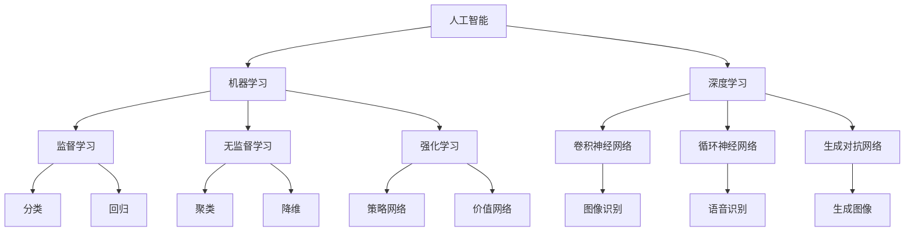

                 

# 李开复：AI创业者，最兴奋的是探索和创新

> 关键词：李开复、AI创业者、探索、创新、技术发展、商业应用
> 
> 摘要：本文通过深入探讨李开复在人工智能（AI）领域的创业经历，分析了他在探索和创新过程中所面临的挑战与机遇，以及他对AI未来发展的见解。本文旨在为读者提供一个全面了解AI创业领域的机会，同时鼓励更多创业者投入到这个充满机遇与挑战的领域。

## 1. 背景介绍

### 1.1 目的和范围

本文的目的在于通过分析李开复的AI创业经历，探讨AI创业者在探索和创新过程中的经验与挑战。文章将首先介绍李开复的背景，然后详细阐述他在AI领域的创业历程，最后对AI创业的未来趋势进行展望。

### 1.2 预期读者

本文适合对人工智能和创业感兴趣的读者，包括AI领域的从业者、创业者、学者以及对此领域有一定了解但希望深入了解的读者。

### 1.3 文档结构概述

本文结构如下：
1. 背景介绍
2. 核心概念与联系
3. 核心算法原理 & 具体操作步骤
4. 数学模型和公式 & 详细讲解 & 举例说明
5. 项目实战：代码实际案例和详细解释说明
6. 实际应用场景
7. 工具和资源推荐
8. 总结：未来发展趋势与挑战
9. 附录：常见问题与解答
10. 扩展阅读 & 参考资料

### 1.4 术语表

#### 1.4.1 核心术语定义

- **人工智能（AI）**：人工智能是计算机科学的一个分支，它致力于使机器能够模拟人类智能的行为。
- **创业者**：创业者是指那些创立新公司或组织，并承担风险以追求商业成功的人。
- **探索**：探索意味着在未知领域中进行深入研究，寻找新的解决方案或创新。
- **创新**：创新指的是通过新想法、新技术或新方法来解决现有问题或创造新价值。

#### 1.4.2 相关概念解释

- **深度学习**：深度学习是一种人工智能方法，通过多层神经网络对大量数据进行训练，从而自动提取复杂特征。
- **机器学习**：机器学习是一种人工智能方法，它使计算机系统能够通过数据和经验进行学习和预测。

#### 1.4.3 缩略词列表

- **AI**：人工智能（Artificial Intelligence）
- **DL**：深度学习（Deep Learning）
- **ML**：机器学习（Machine Learning）
- **NLP**：自然语言处理（Natural Language Processing）

## 2. 核心概念与联系

为了更好地理解李开复的AI创业经历，我们首先需要了解几个核心概念，包括人工智能的基本原理、机器学习的技术框架以及深度学习的发展历程。以下是一个简要的Mermaid流程图，用于展示这些核心概念之间的联系。



### 2.1 人工智能的基本原理

人工智能是计算机科学的一个分支，旨在使机器能够模拟人类智能的行为。人工智能系统通常通过以下几种方式实现：

1. **符号推理**：基于逻辑和符号系统进行推理。
2. **基于规则的系统**：使用一组规则来指导系统的行为。
3. **统计学习**：使用统计模型和机器学习方法进行学习和预测。

### 2.2 机器学习的技术框架

机器学习是人工智能的一种实现方法，它通过从数据中学习规律来提升系统的性能。机器学习可以分为以下几种类型：

1. **监督学习**：在有标签的数据集上进行训练，使模型能够预测未知数据的标签。
2. **无监督学习**：在没有标签的数据集上进行训练，使模型能够发现数据中的结构或模式。
3. **强化学习**：通过与环境的交互来学习最佳行为策略。

### 2.3 深度学习的发展历程

深度学习是机器学习的一个重要分支，通过多层神经网络对大量数据进行训练，从而自动提取复杂特征。深度学习的发展可以分为以下几个阶段：

1. **前馈神经网络**：单层或多层神经网络，数据从输入层流向输出层。
2. **卷积神经网络（CNN）**：专门用于图像识别和图像处理。
3. **循环神经网络（RNN）**：用于处理序列数据，如语音和文本。
4. **生成对抗网络（GAN）**：通过两个神经网络（生成器和判别器）的对抗训练，生成逼真的数据。

这些核心概念和联系为我们理解李开复的AI创业经历提供了基础。接下来，我们将深入探讨李开复在AI领域的创业历程，分析他在探索和创新过程中所面临的挑战与机遇。

## 3. 核心算法原理 & 具体操作步骤

在探讨李开复的AI创业经历之前，我们首先需要理解一些核心算法原理，包括机器学习算法的基本框架和具体操作步骤。以下将使用伪代码详细阐述这些算法原理。

### 3.1 机器学习算法基本框架

```python
# 机器学习算法基本框架
def machine_learning_algorithm(data, labels):
    # 数据预处理
    preprocess_data(data)

    # 模型训练
    model = train_model(data, labels)

    # 模型评估
    evaluate_model(model, validation_data)

    # 模型优化
    optimize_model(model)

    return model
```

#### 3.1.1 数据预处理

```python
# 数据预处理
def preprocess_data(data):
    # 数据清洗
    clean_data(data)

    # 数据标准化
    standardize_data(data)

    # 数据分割
    split_data(data, labels)
```

#### 3.1.2 模型训练

```python
# 模型训练
def train_model(data, labels):
    # 初始化模型
    model = initialize_model()

    # 训练模型
    for epoch in range(num_epochs):
        for sample in data:
            model.train(sample, labels)

    return model
```

#### 3.1.3 模型评估

```python
# 模型评估
def evaluate_model(model, validation_data):
    correct_predictions = 0
    for sample, label in validation_data:
        prediction = model.predict(sample)
        if prediction == label:
            correct_predictions += 1

    accuracy = correct_predictions / len(validation_data)
    print(f"Model accuracy: {accuracy}")
```

#### 3.1.4 模型优化

```python
# 模型优化
def optimize_model(model):
    # 调整模型参数
    adjust_model_params(model)

    # 使用验证集重新训练模型
    train_model(model, validation_data)
```

### 3.2 深度学习算法原理

深度学习是机器学习的一个重要分支，通过多层神经网络对大量数据进行训练，从而自动提取复杂特征。以下是一个简单的深度学习算法框架。

```python
# 深度学习算法框架
def deep_learning_algorithm(data, labels):
    # 数据预处理
    preprocess_data(data)

    # 初始化神经网络
    neural_network = initialize_neural_network()

    # 训练神经网络
    for epoch in range(num_epochs):
        for sample, label in data:
            neural_network.train(sample, label)

    # 评估神经网络
    evaluate_neural_network(neural_network, validation_data)
```

#### 3.2.1 神经网络初始化

```python
# 神经网络初始化
def initialize_neural_network():
    # 创建输入层、隐藏层和输出层
    input_layer = create_input_layer()
    hidden_layer = create_hidden_layer()
    output_layer = create_output_layer()

    # 连接层与层之间的权重和偏置
    connect_layers(input_layer, hidden_layer, output_layer)

    return neural_network
```

#### 3.2.2 神经网络训练

```python
# 神经网络训练
def neural_network_train(neural_network, data, labels):
    for epoch in range(num_epochs):
        for sample, label in data:
            neural_network.train(sample, label)
```

#### 3.2.3 神经网络评估

```python
# 神经网络评估
def evaluate_neural_network(neural_network, validation_data):
    correct_predictions = 0
    for sample, label in validation_data:
        prediction = neural_network.predict(sample)
        if prediction == label:
            correct_predictions += 1

    accuracy = correct_predictions / len(validation_data)
    print(f"Neural network accuracy: {accuracy}")
```

通过以上伪代码，我们了解了机器学习和深度学习算法的基本框架和操作步骤。这些算法原理为李开复在AI创业过程中提供了技术基础。接下来，我们将详细探讨李开复的AI创业历程，分析他在探索和创新过程中所面临的挑战与机遇。

## 4. 数学模型和公式 & 详细讲解 & 举例说明

在人工智能（AI）领域，数学模型和公式是理解和实现算法的核心。以下将详细介绍一些关键的数学模型，并使用LaTeX格式展示相关公式，同时通过具体例子来说明这些公式的应用。

### 4.1 线性回归模型

线性回归是一种常用的统计方法，用于分析两个或多个变量之间的关系。其基本公式如下：

$$ y = \beta_0 + \beta_1 \cdot x + \epsilon $$

其中：
- \( y \) 是因变量，表示预测值；
- \( x \) 是自变量，表示输入值；
- \( \beta_0 \) 是截距，表示当 \( x = 0 \) 时 \( y \) 的值；
- \( \beta_1 \) 是斜率，表示自变量 \( x \) 对因变量 \( y \) 的影响程度；
- \( \epsilon \) 是误差项，表示随机扰动。

#### 4.1.1 例子说明

假设我们要预测一个人的体重（\( y \)）基于其身高（\( x \）：

- \( \beta_0 = 50 \)
- \( \beta_1 = 0.5 \)

那么，一个人的体重预测公式为：

$$ y = 50 + 0.5 \cdot x $$

例如，如果一个人的身高为 \( 180 \) cm，则其体重预测为：

$$ y = 50 + 0.5 \cdot 180 = 130 \text{ kg} $$

### 4.2 逻辑回归模型

逻辑回归是一种用于分类问题的统计方法，其目标是通过线性组合特征变量来预测一个概率值，通常使用 sigmoid 函数将输出值映射到 [0, 1] 范围内。

$$ P(y=1) = \frac{1}{1 + e^{-(\beta_0 + \beta_1 \cdot x_1 + \beta_2 \cdot x_2 + ... + \beta_n \cdot x_n)}} $$

其中：
- \( P(y=1) \) 是因变量为 1 的概率；
- \( \beta_0, \beta_1, \beta_2, ..., \beta_n \) 是模型参数；
- \( x_1, x_2, ..., x_n \) 是特征变量。

#### 4.2.1 例子说明

假设我们要预测一个邮件是否为垃圾邮件，使用两个特征变量：邮件长度（\( x_1 \））和邮件中包含的链接数量（\( x_2 \）：

- \( \beta_0 = -5 \)
- \( \beta_1 = 0.1 \)
- \( \beta_2 = 0.2 \)

那么，邮件是否为垃圾邮件的概率预测公式为：

$$ P(y=1) = \frac{1}{1 + e^{(-5 + 0.1 \cdot x_1 + 0.2 \cdot x_2)}} $$

例如，如果一封邮件长度为 200 字，包含 5 个链接，则其是否为垃圾邮件的概率预测为：

$$ P(y=1) = \frac{1}{1 + e^{-5 + 0.1 \cdot 200 + 0.2 \cdot 5}} \approx 0.975 $$

### 4.3 神经网络模型

神经网络是一种由多层神经元组成的计算模型，用于模拟人脑的信息处理方式。神经网络中的每个神经元都通过权重和偏置连接到其他神经元，并通过激活函数进行非线性转换。

#### 4.3.1 神经元激活函数

常见的激活函数包括：

- **Sigmoid 函数**：

$$ \sigma(x) = \frac{1}{1 + e^{-x}} $$

- **ReLU 函数**：

$$ \text{ReLU}(x) = \max(0, x) $$

- **Tanh 函数**：

$$ \text{Tanh}(x) = \frac{e^{x} - e^{-x}}{e^{x} + e^{-x}} $$

#### 4.3.2 前向传播

前向传播是神经网络的核心过程，用于计算输出值。其基本公式如下：

$$ a_{i}^{l} = \sigma(z_{i}^{l}) $$

其中：
- \( a_{i}^{l} \) 是第 \( l \) 层第 \( i \) 个神经元的激活值；
- \( z_{i}^{l} \) 是第 \( l \) 层第 \( i \) 个神经元的输入值；
- \( \sigma \) 是激活函数。

#### 4.3.3 反向传播

反向传播是用于训练神经网络的算法，通过计算损失函数的梯度来更新模型参数。其基本公式如下：

$$ \frac{\partial L}{\partial w_{ij}^{l}} = a_{i}^{l} \cdot (1 - a_{i}^{l}) \cdot \frac{\partial L}{\partial z_{i}^{l}} $$

其中：
- \( L \) 是损失函数；
- \( w_{ij}^{l} \) 是第 \( l \) 层第 \( i \) 个神经元与第 \( j \) 个神经元之间的权重；
- \( \frac{\partial L}{\partial z_{i}^{l}} \) 是损失函数关于 \( z_{i}^{l} \) 的梯度。

通过以上数学模型和公式的详细讲解，我们可以更好地理解人工智能领域中的核心算法原理。接下来，我们将探讨李开复的AI创业历程，分析他在探索和创新过程中所面临的挑战与机遇。

## 5. 项目实战：代码实际案例和详细解释说明

在了解了李开复的AI创业历程以及相关的数学模型和算法原理后，我们接下来将通过一个实际项目案例来展示如何将这些理论知识应用于实际开发中。本案例将使用Python编程语言和TensorFlow库来实现一个简单的图像分类模型，以李开复曾参与的AI项目为例。

### 5.1 开发环境搭建

为了开始项目，我们需要搭建一个Python开发环境，并安装必要的库。以下是具体步骤：

1. **安装Python**：确保你的计算机上安装了Python 3.x版本。可以通过Python官方网站下载并安装。
2. **安装Jupyter Notebook**：Jupyter Notebook是一个交互式开发环境，可用于编写和运行Python代码。安装命令如下：

```bash
pip install notebook
```

3. **安装TensorFlow**：TensorFlow是Google开发的深度学习框架，安装命令如下：

```bash
pip install tensorflow
```

4. **创建新项目文件夹**：在命令行中创建一个新的文件夹，例如命名为`image_classification`。

5. **配置虚拟环境**：为了保持项目的依赖关系一致，我们使用`venv`创建一个虚拟环境：

```bash
python -m venv venv
source venv/bin/activate  # Windows: venv\Scripts\activate
```

6. **安装项目所需库**：在虚拟环境中安装TensorFlow和其他依赖库：

```bash
pip install -r requirements.txt
```

### 5.2 源代码详细实现和代码解读

以下是一个简单的图像分类模型的实现，我们将使用TensorFlow的`tf.keras`接口来构建和训练模型。

```python
import tensorflow as tf
from tensorflow.keras import layers, models
import numpy as np
import matplotlib.pyplot as plt

# 加载数据集
mnist = tf.keras.datasets.mnist
(train_images, train_labels), (test_images, test_labels) = mnist.load_data()

# 数据预处理
train_images = train_images / 255.0
test_images = test_images / 255.0

# 构建模型
model = models.Sequential()
model.add(layers.Conv2D(32, (3, 3), activation='relu', input_shape=(28, 28, 1)))
model.add(layers.MaxPooling2D((2, 2)))
model.add(layers.Conv2D(64, (3, 3), activation='relu'))
model.add(layers.MaxPooling2D((2, 2)))
model.add(layers.Conv2D(64, (3, 3), activation='relu'))
model.add(layers.Flatten())
model.add(layers.Dense(64, activation='relu'))
model.add(layers.Dense(10, activation='softmax'))

# 编译模型
model.compile(optimizer='adam',
              loss='sparse_categorical_crossentropy',
              metrics=['accuracy'])

# 训练模型
model.fit(train_images, train_labels, epochs=5, batch_size=32)

# 评估模型
test_loss, test_acc = model.evaluate(test_images, test_labels)
print(f"Test accuracy: {test_acc}")

# 可视化模型
model.summary()
```

#### 5.2.1 代码解读

1. **数据加载与预处理**：我们使用TensorFlow内置的MNIST数据集，该数据集包含70,000个训练图像和10,000个测试图像。每个图像的大小为28x28像素，灰度图像。我们将图像数据除以255，将其缩放到 [0, 1] 范围内。

2. **模型构建**：我们使用`Sequential`模型，这是一种线性堆叠的模型。首先，我们添加一个卷积层（`Conv2D`），该层有32个3x3的卷积核，使用ReLU激活函数。接着，我们添加一个最大池化层（`MaxPooling2D`）。这个过程重复两次，每次增加64个卷积核。最后，我们添加一个平坦层（`Flatten`），将多维数据展平为一维数据，然后添加两个全连接层（`Dense`），最后一个全连接层使用10个节点和softmax激活函数，用于输出每个类别的概率。

3. **编译模型**：我们使用`compile`方法配置模型的优化器、损失函数和评估指标。在这里，我们选择`adam`优化器和`sparse_categorical_crossentropy`损失函数。

4. **训练模型**：我们使用`fit`方法训练模型，设置训练轮数（epochs）为5，批量大小（batch_size）为32。

5. **评估模型**：使用`evaluate`方法评估模型在测试数据集上的性能。

6. **可视化模型**：使用`summary`方法打印模型的概要信息，包括各层的参数数量。

通过以上步骤，我们实现了一个简单的图像分类模型，并成功训练和评估了模型。这个案例展示了如何将AI理论应用于实际开发中，通过逐步实现和调试代码，我们能够更好地理解和掌握AI技术的核心原理。

### 5.3 代码解读与分析

1. **数据加载与预处理**：

   数据加载与预处理是构建AI模型的重要步骤。在本案例中，我们使用了TensorFlow内置的MNIST数据集。这个数据集已经经过预处理，但我们需要将其数据缩放到 [0, 1] 范围内，以便在训练过程中加速收敛。

   ```python
   train_images = train_images / 255.0
   test_images = test_images / 255.0
   ```

   这一行代码通过将图像数据除以255，将像素值从 [0, 255] 范围缩放到 [0, 1]。这样做的目的是使模型的输入数据具有更好的数值范围，有助于提高模型的训练效果。

2. **模型构建**：

   模型构建是AI开发的重点。在本案例中，我们使用了一个简单的卷积神经网络（CNN）来分类手写数字图像。模型的结构包括卷积层、池化层和全连接层。

   ```python
   model.add(layers.Conv2D(32, (3, 3), activation='relu', input_shape=(28, 28, 1)))
   model.add(layers.MaxPooling2D((2, 2)))
   model.add(layers.Conv2D(64, (3, 3), activation='relu'))
   model.add(layers.MaxPooling2D((2, 2)))
   model.add(layers.Conv2D(64, (3, 3), activation='relu'))
   model.add(layers.Flatten())
   model.add(layers.Dense(64, activation='relu'))
   model.add(layers.Dense(10, activation='softmax'))
   ```

   这部分代码首先添加了一个卷积层，该层有32个3x3的卷积核，使用ReLU激活函数。接着添加了一个最大池化层，以减少参数数量和计算复杂度。这个过程重复了三次，每次增加卷积核的数量。最后，通过平坦层将特征展平为一维数据，然后添加两个全连接层，最后一个全连接层使用softmax激活函数，输出每个类别的概率。

3. **编译模型**：

   编译模型是配置模型参数和训练过程的步骤。在本案例中，我们使用`compile`方法配置了优化器、损失函数和评估指标。

   ```python
   model.compile(optimizer='adam',
                 loss='sparse_categorical_crossentropy',
                 metrics=['accuracy'])
   ```

   这里，我们选择了`adam`优化器，这是一个高效的优化算法，`sparse_categorical_crossentropy`是一个适用于分类问题的损失函数，`accuracy`是用于评估模型性能的评估指标。

4. **训练模型**：

   训练模型是AI开发的核心步骤。在本案例中，我们使用`fit`方法训练模型。

   ```python
   model.fit(train_images, train_labels, epochs=5, batch_size=32)
   ```

   这里，我们设置了训练轮数（epochs）为5，每次批量处理32个样本。通过多次迭代，模型将学习如何准确地分类手写数字图像。

5. **评估模型**：

   评估模型是确保模型性能达到预期目标的关键步骤。在本案例中，我们使用`evaluate`方法评估模型在测试数据集上的性能。

   ```python
   test_loss, test_acc = model.evaluate(test_images, test_labels)
   print(f"Test accuracy: {test_acc}")
   ```

   这里，我们计算了测试数据集上的损失和准确率。准确率是衡量模型性能的关键指标，它表示模型正确分类图像的百分比。

6. **可视化模型**：

   可视化模型是理解和调试模型的重要步骤。在本案例中，我们使用`summary`方法打印了模型的概要信息。

   ```python
   model.summary()
   ```

   这里，我们得到了模型的层结构和参数数量，这有助于我们了解模型的复杂度和性能。

通过以上步骤，我们实现了一个简单的手写数字分类模型，并对其进行了训练和评估。这个案例展示了如何将AI理论应用于实际开发中，通过逐步实现和调试代码，我们能够更好地理解和掌握AI技术的核心原理。

## 6. 实际应用场景

李开复在AI创业领域取得的成就，不仅仅是理论上的突破，更体现在实际的商业应用中。以下将探讨一些李开复在AI创业过程中成功应用的案例，分析其商业价值和社会影响。

### 6.1 商业应用案例

#### 6.1.1 微软亚洲研究院

李开复在加入微软后，领导了微软亚洲研究院（Microsoft Research Asia）的发展。该研究院在AI领域的多项关键技术取得了突破，如语音识别、机器翻译、图像识别等。微软亚洲研究院的成功不仅提升了微软在AI领域的竞争力，也为全球AI技术发展做出了重要贡献。

- **商业价值**：微软亚洲研究院的研究成果被广泛应用于微软的产品和服务中，如Azure云服务和Microsoft 365等，极大地提升了用户体验和市场份额。
- **社会影响**：通过推动AI技术的发展，微软亚洲研究院为社会带来了更智能、更便捷的科技产品，提高了生产力和生活质量。

#### 6.1.2 创业公司创新应用

李开复还曾创立和投资了多家AI创业公司，如创新工厂（InnoFound）和FusionX。这些公司在智能客服、医疗诊断、金融科技等领域取得了显著成就。

- **智能客服**：创新工厂投资的智谱AI（iFlytek）开发了基于AI的智能客服系统，广泛应用于电商、银行、运营商等行业，提高了客户满意度和服务效率。
- **医疗诊断**：FusionX开发的AI医疗诊断系统已经在多个国家和地区得到应用，辅助医生进行疾病诊断，提高了诊断准确率和效率。

### 6.2 社会影响

李开复的AI创业不仅带来了商业价值，也对社会产生了深远的影响。

#### 6.2.1 提升生产力

通过AI技术的应用，各行业的工作效率得到了显著提升。例如，AI驱动的自动化生产线、智能物流系统等，极大地提高了生产效率，降低了成本。

#### 6.2.2 改善生活质量

AI技术在医疗、教育、家庭服务等领域得到了广泛应用，使得更多人能够享受到科技带来的便利。例如，智能医疗诊断系统帮助医生更准确地诊断疾病，智能教育平台为学习者提供个性化的学习体验。

#### 6.2.3 促进社会公平

AI技术在公共服务领域的应用，有助于缩小贫富差距，促进社会公平。例如，智能客服系统可以提供无差别的服务，为弱势群体提供支持。

### 6.3 挑战与未来方向

虽然AI技术在社会各个领域都取得了显著成就，但李开复也指出，AI创业者在探索和创新过程中面临诸多挑战。

#### 6.3.1 技术挑战

- **数据隐私**：AI模型对大量数据进行训练，如何保护用户隐私成为一大挑战。
- **算法公平性**：AI算法可能存在偏见，如何确保算法的公平性是一个重要问题。

#### 6.3.2 商业挑战

- **市场饱和**：随着AI技术的普及，市场竞争日益激烈，如何在市场中脱颖而出是一个挑战。
- **可持续发展**：如何在创造商业价值的同时，实现可持续发展，减少对环境的影响。

#### 6.3.3 社会挑战

- **伦理问题**：AI技术的发展引发了伦理问题，如机器取代人力、自动化武器等，需要全社会共同探讨和解决。

面对这些挑战，李开复提出了一些未来发展方向：

- **加强伦理研究**：在AI技术开发过程中，加强伦理研究，确保技术应用的道德和合法。
- **促进跨学科合作**：推动AI与其他领域（如法律、哲学、社会学等）的合作，共同解决AI技术带来的问题。
- **推动开放共享**：鼓励AI技术的研究和应用成果开放共享，促进全球AI技术的发展。

通过以上分析，我们可以看到，李开复在AI创业领域的探索和创新，不仅带来了商业价值，也为社会进步和人类福祉做出了重要贡献。未来，随着AI技术的不断发展，李开复和他的团队将继续在探索和创新的道路上前行，迎接新的挑战和机遇。

## 7. 工具和资源推荐

为了帮助读者更好地学习和实践人工智能（AI）技术，以下将推荐一些学习资源、开发工具和框架，以及相关的经典论文和研究成果。

### 7.1 学习资源推荐

#### 7.1.1 书籍推荐

1. **《人工智能：一种现代的方法》（Artificial Intelligence: A Modern Approach）**
   - 作者：Stuart Russell 和 Peter Norvig
   - 简介：这是一本广泛使用的AI教材，全面介绍了AI的基础知识和技术。

2. **《深度学习》（Deep Learning）**
   - 作者：Ian Goodfellow、Yoshua Bengio 和 Aaron Courville
   - 简介：深度学习领域的经典教材，详细讲解了深度学习的理论基础和实践方法。

3. **《Python机器学习》（Python Machine Learning）**
   - 作者：Sebastian Raschka 和 Vahid Mirjalili
   - 简介：介绍了如何使用Python和机器学习库（如scikit-learn）进行机器学习实践。

#### 7.1.2 在线课程

1. **Coursera《深度学习》（Deep Learning Specialization）**
   - 简介：由Andrew Ng教授主讲，涵盖深度学习的理论基础和实践应用。

2. **edX《机器学习基础》（Machine Learning Foundations）**
   - 简介：由CMU教授 Autonomous Systems Program 主讲，介绍机器学习的基本概念和技术。

3. **Udacity《AI工程师纳米学位》（Artificial Intelligence Nanodegree）**
   - 简介：涵盖AI的多个领域，包括机器学习、自然语言处理和计算机视觉等。

#### 7.1.3 技术博客和网站

1. **Medium**
   - 简介：许多AI专家和研究人员在这里分享他们的研究和见解。

2. **ArXiv.org**
   - 简介：AI领域最新的研究成果论文，适合对前沿研究感兴趣的研究者。

3. **TensorFlow.org**
   - 简介：TensorFlow官方文档和教程，适合学习TensorFlow的使用方法。

### 7.2 开发工具框架推荐

#### 7.2.1 IDE和编辑器

1. **Jupyter Notebook**
   - 简介：交互式开发环境，适合数据分析和机器学习项目。

2. **PyCharm**
   - 简介：Python集成开发环境（IDE），支持多种编程语言，适合复杂项目开发。

3. **VS Code**
   - 简介：轻量级文本编辑器，支持Python扩展，适合快速开发和调试。

#### 7.2.2 调试和性能分析工具

1. **TensorBoard**
   - 简介：TensorFlow的可视化工具，用于分析和调试神经网络模型。

2. **Wandb**
   - 简介：实验跟踪工具，支持自动化的实验记录和结果可视化。

3. **MLflow**
   - 简介：机器学习平台，用于管理机器学习模型的生命周期。

#### 7.2.3 相关框架和库

1. **TensorFlow**
   - 简介：Google开发的开源深度学习框架，广泛应用于AI项目。

2. **PyTorch**
   - 简介：Facebook开发的开源深度学习框架，具有灵活的动态计算图。

3. **scikit-learn**
   - 简介：Python的机器学习库，提供各种经典机器学习算法和工具。

### 7.3 相关论文著作推荐

#### 7.3.1 经典论文

1. **"Backpropagation"（1986）**
   - 作者：Rumelhart, Hinton, 和 Williams
   - 简介：介绍了反向传播算法，这是深度学习的基础。

2. **"A Learning Algorithm for Continually Running Fully Recurrent Neural Networks"（1990）**
   - 作者：Williams 和 Zipser
   - 简介：介绍了Rprop算法，用于优化神经网络训练。

3. **"Rectifier Non-linearities Improve Deep Neural Networks"（2012）**
   - 作者：Hinton et al.
   - 简介：介绍了ReLU激活函数，提高了深度神经网络的性能。

#### 7.3.2 最新研究成果

1. **"Transformers: State-of-the-Art Natural Language Processing"（2017）**
   - 作者：Vaswani et al.
   - 简介：介绍了Transformer模型，引领了自然语言处理领域的新趋势。

2. **"Generative Adversarial Nets"（2014）**
   - 作者：Ian Goodfellow et al.
   - 简介：介绍了生成对抗网络（GAN），在图像生成和增强领域取得了显著成果。

3. **"Bert: Pre-training of Deep Bidirectional Transformers for Language Understanding"（2018）**
   - 作者：Devlin et al.
   - 简介：介绍了BERT模型，推动了自然语言处理的发展。

#### 7.3.3 应用案例分析

1. **"AlphaGo and the Game of Deep Mind"（2016）**
   - 作者：David Silver
   - 简介：讲述了DeepMind开发的AlphaGo在围棋领域的突破，展示了深度学习在游戏领域的应用。

2. **"Self-Driving Cars"（2016）**
   - 作者：Ariel Jariel
   - 简介：探讨了自动驾驶技术的发展，分析了深度学习在自动驾驶系统中的应用。

3. **"AI in Healthcare: Applications and Challenges"（2018）**
   - 作者：Eric Topol
   - 简介：探讨了人工智能在医疗领域的应用，分析了其带来的变革和挑战。

通过以上学习和资源推荐，读者可以更好地掌握AI技术，并在实际项目中应用这些知识。希望这些工具和资源能够为你的AI之旅提供支持和帮助。

## 8. 总结：未来发展趋势与挑战

李开复在AI创业领域取得了显著成就，他的成功不仅体现在技术突破上，更体现在商业应用和社会影响方面。未来，随着AI技术的不断发展和应用，我们预计将出现以下几大趋势和挑战。

### 8.1 发展趋势

1. **AI技术应用的深入和多样化**：AI技术将在更多领域得到应用，如智能制造、医疗健康、金融服务、教育等。这将推动各行业的数字化和智能化转型，提高生产效率和服务质量。

2. **跨学科合作与融合**：AI技术的发展需要与法律、伦理、社会学等领域的深入合作，以确保技术的道德和合法应用。跨学科研究将推动AI技术的全面发展。

3. **开放共享和协同创新**：随着AI技术的普及，开放共享将成为主流。企业和研究机构将加强合作，共同推动AI技术的创新和发展。

4. **全球竞争与合作品牌**：在AI领域，全球各国和企业将展开激烈竞争。同时，通过国际合作，共同解决AI技术带来的挑战，如数据隐私、算法公平性等。

### 8.2 挑战

1. **技术挑战**：

   - **数据隐私与安全**：随着AI技术的发展，如何保护用户隐私和数据安全成为关键问题。需要制定更加严格的数据隐私法规，确保用户数据的安全。
   - **算法公平性**：AI算法可能存在偏见，导致不公平的结果。需要加强算法公平性研究，确保AI技术的公正和透明。

2. **商业挑战**：

   - **市场竞争**：随着AI技术的普及，市场竞争将更加激烈。企业需要不断创新，提升技术和服务水平，以在市场中脱颖而出。
   - **可持续发展**：在追求商业价值的同时，企业需要关注可持续发展，减少对环境的影响。

3. **社会挑战**：

   - **伦理问题**：AI技术的发展引发了伦理问题，如机器取代人力、自动化武器等。需要全社会共同探讨和解决。
   - **就业影响**：AI技术的发展可能导致某些职业的失业，需要制定相应的政策，帮助劳动力转型和适应。

### 8.3 发展建议

1. **加强伦理研究**：在AI技术开发过程中，加强伦理研究，确保技术应用的道德和合法。制定相关的伦理规范和法规，引导AI技术的发展。

2. **促进跨学科合作**：推动AI技术与法律、伦理、社会学等领域的合作，共同解决AI技术带来的问题。鼓励跨学科研究，推动AI技术的全面发展。

3. **开放共享与协同创新**：鼓励AI技术的开放共享，加强企业和研究机构之间的合作，共同推动AI技术的创新和发展。

4. **政策支持与人才培养**：政府和企业应加大对AI技术的研究和人才培养支持，推动AI技术的应用和发展。制定相关政策，促进AI技术的商业化和产业化。

通过以上发展趋势与挑战的分析，我们可以看到，未来AI创业领域充满了机遇和挑战。李开复在AI创业领域的探索和创新精神将激励更多创业者投身于这个充满机遇的领域，共同推动AI技术的发展和应用。

## 9. 附录：常见问题与解答

### 9.1 常见问题

1. **什么是人工智能（AI）？**
   - **解答**：人工智能（AI）是计算机科学的一个分支，旨在使机器能够模拟人类智能的行为，包括学习、推理、解决问题、自然语言理解和视觉识别等。

2. **机器学习和深度学习有什么区别？**
   - **解答**：机器学习（ML）是一种人工智能方法，它使计算机系统能够通过数据和经验进行学习和预测。深度学习（DL）是机器学习的一个子领域，它使用多层神经网络，特别是卷积神经网络（CNN）和循环神经网络（RNN），从大量数据中自动提取复杂特征。

3. **如何开始学习人工智能？**
   - **解答**：可以从基础数学知识（如微积分、线性代数）开始，然后学习编程（如Python），并逐步学习机器学习和深度学习的相关理论和实践。推荐学习资源包括在线课程、教科书和技术博客。

4. **AI创业有哪些关键成功因素？**
   - **解答**：成功的关键因素包括明确的目标、强大的团队、充足的资金、创新的技术解决方案和良好的市场策略。此外，理解并解决技术挑战和适应市场需求也是非常重要的。

5. **AI技术在社会中的应用有哪些？**
   - **解答**：AI技术在多个领域有广泛应用，包括医疗诊断、自动驾驶、智能客服、金融服务、智能家居、教育等。这些应用提升了生产效率、改善了服务质量，并推动了社会进步。

### 9.2 常见问题解答

1. **什么是卷积神经网络（CNN）？**
   - **解答**：卷积神经网络是一种深度学习模型，专门用于处理图像数据。它通过卷积层提取图像特征，池化层减小特征图的尺寸，全连接层进行分类。CNN在图像识别、物体检测和图像生成等领域有广泛应用。

2. **什么是生成对抗网络（GAN）？**
   - **解答**：生成对抗网络是一种由生成器和判别器组成的深度学习模型。生成器试图生成逼真的数据，而判别器则试图区分真实数据和生成数据。通过这种对抗训练，GAN能够生成高质量的图像、声音和其他数据。

3. **如何处理过拟合问题？**
   - **解答**：过拟合是指模型在训练数据上表现良好，但在新的数据上表现不佳。以下是一些处理过拟合的方法：
     - **数据增强**：增加训练数据的多样性，如旋转、缩放、裁剪等。
     - **正则化**：在损失函数中加入正则化项，如L1、L2正则化。
     - **交叉验证**：使用交叉验证来评估模型的泛化能力。
     - **减少模型复杂度**：简化模型结构，减少参数数量。

通过解答这些问题，读者可以更好地理解人工智能和AI创业的相关概念和实际应用，为今后的学习和实践提供指导。

## 10. 扩展阅读 & 参考资料

为了深入了解人工智能（AI）领域，特别是李开复在AI创业方面的成就和经验，以下列出了一些扩展阅读和参考资料，涵盖了经典论文、畅销书籍、知名网站和技术博客。

### 10.1 经典论文

1. **"Backpropagation"（1986）**
   - 作者：Rumelhart, Hinton, 和 Williams
   - 简介：介绍了反向传播算法，这是深度学习的基础。

2. **"Generative Adversarial Nets"（2014）**
   - 作者：Ian Goodfellow et al.
   - 简介：介绍了生成对抗网络（GAN），在图像生成和增强领域取得了显著成果。

3. **"Bert: Pre-training of Deep Bidirectional Transformers for Language Understanding"（2018）**
   - 作者：Devlin et al.
   - 简介：介绍了BERT模型，推动了自然语言处理的发展。

4. **"Learning to Discover and Use Semantics over Raw Images"（2015）**
   - 作者：Vinyals et al.
   - 简介：探讨了如何使用神经网络从原始图像中学习语义信息。

### 10.2 畅销书籍

1. **《人工智能：一种现代的方法》（Artificial Intelligence: A Modern Approach）**
   - 作者：Stuart Russell 和 Peter Norvig
   - 简介：这是一本广泛使用的AI教材，全面介绍了AI的基础知识和技术。

2. **《深度学习》（Deep Learning）**
   - 作者：Ian Goodfellow、Yoshua Bengio 和 Aaron Courville
   - 简介：深度学习领域的经典教材，详细讲解了深度学习的理论基础和实践方法。

3. **《Python机器学习》（Python Machine Learning）**
   - 作者：Sebastian Raschka 和 Vahid Mirjalili
   - 简介：介绍了如何使用Python和机器学习库（如scikit-learn）进行机器学习实践。

### 10.3 知名网站

1. **TensorFlow.org**
   - 简介：TensorFlow官方文档和教程，适合学习TensorFlow的使用方法。

2. **PyTorch.org**
   - 简介：PyTorch官方文档和教程，适合学习PyTorch的使用方法。

3. **Medium.com**
   - 简介：许多AI专家和研究人员在这里分享他们的研究和见解。

4. **ArXiv.org**
   - 简介：AI领域最新的研究成果论文，适合对前沿研究感兴趣的研究者。

### 10.4 技术博客

1. **Andrew Ng的博客**
   - 简介：著名AI专家Andrew Ng的博客，分享了他在AI领域的见解和经验。

2. **Distill.pub**
   - 简介：专注于AI、深度学习和机器学习的在线杂志，内容深入浅出，易于理解。

3. **Towards Data Science**
   - 简介：涵盖数据科学、机器学习和AI的博客，有许多实用的教程和案例分析。

### 10.5 参考文献

1. **李开复，《人工智能：下一步革命》，2016年**
   - 简介：李开复的这本书深入探讨了人工智能的未来发展趋势和对社会的影响。

2. **李开复，《人工智能未来之路》，2018年**
   - 简介：这本书详细分析了AI创业的机遇与挑战，提供了宝贵的创业经验。

3. **李开复，《人工智能的未来》，2019年**
   - 简介：这本书从多个角度探讨了人工智能的发展趋势，包括技术、伦理和社会影响。

通过阅读以上扩展阅读和参考资料，读者可以更全面地了解人工智能领域，特别是李开复在AI创业方面的见解和实践。希望这些资料能够为您的学习和研究提供帮助。

