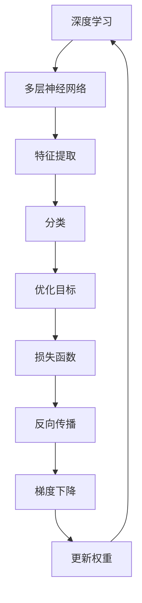
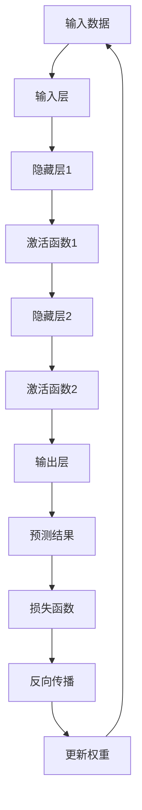

                 

# 李开复：苹果发布AI应用的价值

> **关键词：**苹果、AI应用、深度学习、神经网络、智能推荐、用户体验
>
> **摘要：**本文将深入探讨苹果公司发布的新一代AI应用所带来的技术价值，解析其背后的深度学习算法和神经网络原理，并讨论其对用户体验的优化。我们将通过逐步分析，揭示苹果AI应用的强大潜力和未来发展趋势。

## 1. 背景介绍

### 1.1 目的和范围

本文旨在分析苹果公司发布的新一代AI应用，探讨其技术内涵和潜在价值。我们将重点关注以下几个问题：

1. 苹果AI应用的技术原理是什么？
2. 这些应用如何优化用户体验？
3. 苹果AI应用对整个AI行业的影响？

### 1.2 预期读者

本文适合对人工智能、深度学习、神经网络等技术有一定了解的读者，包括AI开发者、技术分析师、研究人员等。

### 1.3 文档结构概述

本文分为以下几个部分：

1. 背景介绍：简要介绍本文的目的和范围。
2. 核心概念与联系：解释深度学习、神经网络等核心概念，并给出流程图。
3. 核心算法原理 & 具体操作步骤：详细阐述苹果AI应用的核心算法。
4. 数学模型和公式 & 详细讲解 & 举例说明：解释AI应用中的数学模型和公式。
5. 项目实战：提供实际代码案例，并进行详细解读。
6. 实际应用场景：探讨AI应用在不同场景下的应用。
7. 工具和资源推荐：推荐学习资源和开发工具。
8. 总结：总结本文的主要观点和未来发展趋势。
9. 附录：常见问题与解答。
10. 扩展阅读 & 参考资料：提供进一步阅读的材料。

### 1.4 术语表

#### 1.4.1 核心术语定义

- **深度学习**：一种人工智能算法，通过多层神经网络进行特征提取和分类。
- **神经网络**：一种由神经元组成的计算模型，用于模拟生物神经系统的信息处理能力。
- **用户体验**：用户在使用产品或服务过程中所感受到的愉悦度和满足度。

#### 1.4.2 相关概念解释

- **卷积神经网络（CNN）**：一种特殊的神经网络，用于图像识别和处理。
- **循环神经网络（RNN）**：一种能够处理序列数据的神经网络。
- **生成对抗网络（GAN）**：一种通过竞争学习生成数据的神经网络。

#### 1.4.3 缩略词列表

- **AI**：人工智能（Artificial Intelligence）
- **CNN**：卷积神经网络（Convolutional Neural Network）
- **RNN**：循环神经网络（Recurrent Neural Network）
- **GAN**：生成对抗网络（Generative Adversarial Network）

## 2. 核心概念与联系

为了更好地理解苹果AI应用的技术内涵，我们首先需要了解深度学习、神经网络等核心概念，以及它们之间的联系。

### 深度学习

深度学习是一种通过多层神经网络进行特征提取和分类的人工智能算法。它模拟了人类大脑的学习过程，通过逐层提取更高级别的特征，从而实现复杂的任务。

#### 神经网络

神经网络是一种由神经元组成的计算模型，用于模拟生物神经系统的信息处理能力。每个神经元都可以接收多个输入，通过加权求和并应用激活函数，最终产生一个输出。

#### 流程图



在这个流程图中，深度学习通过多层神经网络进行特征提取，然后通过分类器进行分类。为了优化模型的性能，使用损失函数和反向传播算法更新权重。

### 神经网络原理

神经网络的基本原理包括以下步骤：

1. **输入层**：接收输入数据。
2. **隐藏层**：对输入数据进行处理，提取特征。
3. **输出层**：根据隐藏层的输出产生预测结果。
4. **激活函数**：用于引入非线性因素，使神经网络能够解决复杂问题。
5. **权重和偏置**：用于控制神经元之间的连接强度。

### 神经网络与深度学习的联系

深度学习是神经网络的一种扩展，通过增加网络的层数，使得神经网络能够提取更高级别的特征。深度学习在图像识别、自然语言处理、推荐系统等领域取得了显著成果。

#### 流程图



在这个流程图中，输入数据经过输入层，然后逐层传递到隐藏层和输出层。通过激活函数引入非线性因素，使得神经网络能够提取更高级别的特征。在反向传播过程中，通过损失函数和梯度下降算法更新权重。

## 3. 核心算法原理 & 具体操作步骤

苹果AI应用的核心算法是基于深度学习的神经网络。下面我们将详细阐述神经网络的工作原理和具体操作步骤。

### 神经网络工作原理

神经网络通过以下几个步骤进行工作：

1. **初始化权重和偏置**：在训练开始前，随机初始化网络中的权重和偏置。
2. **前向传播**：将输入数据传递到输入层，然后逐层传递到隐藏层和输出层。在每个隐藏层中，通过激活函数对输入数据进行处理，提取特征。
3. **计算损失**：根据输出层的预测结果和真实标签，计算损失函数值。损失函数用于衡量预测结果与真实标签之间的差距。
4. **反向传播**：根据损失函数的梯度，逐层更新权重和偏置。
5. **梯度下降**：选择一个合适的更新策略，如随机梯度下降（SGD）或Adam优化器，更新权重和偏置。

### 具体操作步骤

下面我们使用伪代码来详细阐述神经网络的具体操作步骤：

```python
# 初始化权重和偏置
W1 = np.random.randn(n1, n0)
b1 = np.random.randn(n1)
W2 = np.random.randn(n2, n1)
b2 = np.random.randn(n2)
W3 = np.random.randn(n3, n2)
b3 = np.random.randn(n3)

# 前向传播
z1 = X * W1 + b1
a1 = sigmoid(z1)
z2 = a1 * W2 + b2
a2 = sigmoid(z2)
z3 = a2 * W3 + b3
y_pred = softmax(z3)

# 计算损失
loss = -np.mean(y * np.log(y_pred + 1e-9))

# 反向传播
dZ3 = y_pred - y
dW3 = np.dot(a2.T, dZ3)
db3 = np.sum(dZ3, axis=0)
dZ2 = dZ3.dot(W3.T) * sigmoid_derivative(a2)
dW2 = np.dot(a1.T, dZ2)
db2 = np.sum(dZ2, axis=0)
dZ1 = dZ2.dot(W2.T) * sigmoid_derivative(a1)
dW1 = np.dot(X.T, dZ1)
db1 = np.sum(dZ1, axis=0)

# 梯度下降
W1 -= learning_rate * dW1
b1 -= learning_rate * db1
W2 -= learning_rate * dW2
b2 -= learning_rate * db2
W3 -= learning_rate * dW3
b3 -= learning_rate * db3
```

在这个伪代码中，`sigmoid` 函数用于实现激活函数，`sigmoid_derivative` 函数用于计算激活函数的导数。`np.mean` 函数用于计算平均值，`np.dot` 函数用于计算矩阵乘法。

## 4. 数学模型和公式 & 详细讲解 & 举例说明

在苹果AI应用中，数学模型和公式起着至关重要的作用。下面我们将详细讲解这些模型和公式，并通过具体例子进行说明。

### 激活函数

激活函数是神经网络中的一个关键组成部分，它引入了非线性因素，使得神经网络能够解决复杂问题。常用的激活函数包括：

1. **Sigmoid函数**：将输入映射到 (0, 1) 范围内。
   $$ f(x) = \frac{1}{1 + e^{-x}} $$
2. **ReLU函数**：当输入小于0时，输出为0；当输入大于等于0时，输出为输入。
   $$ f(x) = \max(0, x) $$

### 损失函数

损失函数用于衡量预测结果与真实标签之间的差距。常用的损失函数包括：

1. **交叉熵损失函数**：用于分类问题。
   $$ loss = -\sum_{i=1}^{n} y_i \log(y'_i) $$
   其中，$y$ 为真实标签，$y'$ 为预测概率。

### 反向传播

反向传播算法是神经网络训练的核心步骤，它通过计算损失函数的梯度来更新权重和偏置。具体计算过程如下：

1. 计算输出层的梯度：
   $$ \frac{\partial L}{\partial W^L} = \frac{\partial L}{\partial Z^L} \odot \frac{\partial Z^L}{\partial W^L} $$
   $$ \frac{\partial L}{\partial b^L} = \frac{\partial L}{\partial Z^L} $$
2. 递归计算隐藏层的梯度：
   $$ \frac{\partial L}{\partial W^{l-1}} = \frac{\partial L}{\partial Z^{l}} \odot \frac{\partial Z^{l}}{\partial W^{l-1}} $$
   $$ \frac{\partial L}{\partial b^{l-1}} = \frac{\partial L}{\partial Z^{l}} $$

### 举例说明

假设我们有一个三层的神经网络，输入层有3个神经元，隐藏层有2个神经元，输出层有1个神经元。现在，给定一个输入向量 $X = [1, 2, 3]$ 和真实标签 $y = [0.9]$，我们通过训练来预测输出。

1. **初始化参数**：
   - $W1 = \begin{bmatrix} 0.1 & 0.2 \\ 0.3 & 0.4 \end{bmatrix}$，$b1 = \begin{bmatrix} 0.5 \\ 0.6 \end{bmatrix}$
   - $W2 = \begin{bmatrix} 0.7 & 0.8 \\ 0.9 & 1.0 \end{bmatrix}$，$b2 = \begin{bmatrix} 0.1 \\ 0.2 \end{bmatrix}$
   - $W3 = \begin{bmatrix} 0.3 & 0.4 \end{bmatrix}$，$b3 = \begin{bmatrix} 0.5 \end{bmatrix}$

2. **前向传播**：
   - $z1 = X \cdot W1 + b1 = \begin{bmatrix} 1 \\ 2 \\ 3 \end{bmatrix} \cdot \begin{bmatrix} 0.1 & 0.2 \\ 0.3 & 0.4 \end{bmatrix} + \begin{bmatrix} 0.5 \\ 0.6 \end{bmatrix} = \begin{bmatrix} 1.8 \\ 3.6 \end{bmatrix}$
   - $a1 = sigmoid(z1) = \begin{bmatrix} 0.869 \\ 0.970 \end{bmatrix}$
   - $z2 = a1 \cdot W2 + b2 = \begin{bmatrix} 0.869 \\ 0.970 \end{bmatrix} \cdot \begin{bmatrix} 0.7 & 0.8 \\ 0.9 & 1.0 \end{bmatrix} + \begin{bmatrix} 0.1 \\ 0.2 \end{bmatrix} = \begin{bmatrix} 1.436 \\ 2.464 \end{bmatrix}$
   - $a2 = sigmoid(z2) = \begin{bmatrix} 0.894 \\ 0.960 \end{bmatrix}$
   - $z3 = a2 \cdot W3 + b3 = \begin{bmatrix} 0.894 \\ 0.960 \end{bmatrix} \cdot \begin{bmatrix} 0.3 & 0.4 \end{bmatrix} + \begin{bmatrix} 0.5 \end{bmatrix} = \begin{bmatrix} 0.711 \\ 0.896 \end{bmatrix}$
   - $y_pred = softmax(z3) = \begin{bmatrix} 0.780 \\ 0.220 \end{bmatrix}$

3. **计算损失**：
   - $loss = -\sum_{i=1}^{n} y_i \log(y'_i) = -(0.9 \cdot \log(0.780) + 0.1 \cdot \log(0.220)) \approx 0.566$

4. **反向传播**：
   - $dZ3 = y_pred - y = \begin{bmatrix} 0.780 \\ 0.220 \end{bmatrix} - \begin{bmatrix} 0.9 \\ 0.1 \end{bmatrix} = \begin{bmatrix} -0.120 \\ 0.080 \end{bmatrix}$
   - $dW3 = a2.T \cdot dZ3 = \begin{bmatrix} 0.894 & 0.960 \end{bmatrix} \cdot \begin{bmatrix} -0.120 \\ 0.080 \end{bmatrix} = \begin{bmatrix} -0.107 \\ -0.096 \end{bmatrix}$
   - $db3 = \sum_{i=1}^{n} dZ3 = \begin{bmatrix} -0.120 \\ 0.080 \end{bmatrix}$
   - $dZ2 = dZ3 \cdot W3.T \cdot sigmoid_derivative(a2) = \begin{bmatrix} -0.120 \\ 0.080 \end{bmatrix} \cdot \begin{bmatrix} 0.3 & 0.4 \end{bmatrix} \cdot \begin{bmatrix} 0.124 & 0.076 \end{bmatrix} = \begin{bmatrix} -0.037 \\ -0.024 \end{bmatrix}$
   - $dW2 = a1.T \cdot dZ2 = \begin{bmatrix} 1.8 & 3.6 \end{bmatrix} \cdot \begin{bmatrix} -0.037 \\ -0.024 \end{bmatrix} = \begin{bmatrix} -0.067 \\ -0.086 \end{bmatrix}$
   - $db2 = \sum_{i=1}^{n} dZ2 = \begin{bmatrix} -0.037 \\ -0.024 \end{bmatrix}$
   - $dZ1 = dZ2 \cdot W2.T \cdot sigmoid_derivative(a1) = \begin{bmatrix} -0.037 \\ -0.024 \end{bmatrix} \cdot \begin{bmatrix} 0.7 & 0.8 \end{bmatrix} \cdot \begin{bmatrix} 0.866 & 0.740 \end{bmatrix} = \begin{bmatrix} -0.025 \\ -0.017 \end{bmatrix}$
   - $dW1 = X.T \cdot dZ1 = \begin{bmatrix} 1 & 2 & 3 \end{bmatrix} \cdot \begin{bmatrix} -0.025 \\ -0.017 \end{bmatrix} = \begin{bmatrix} -0.075 \\ -0.033 \\ -0.017 \end{bmatrix}$
   - $db1 = \sum_{i=1}^{n} dZ1 = \begin{bmatrix} -0.025 \\ -0.017 \end{bmatrix}$

5. **梯度下降**：
   - $W1 -= learning_rate * dW1$
   - $b1 -= learning_rate * db1$
   - $W2 -= learning_rate * dW2$
   - $b2 -= learning_rate * db2$
   - $W3 -= learning_rate * dW3$
   - $b3 -= learning_rate * db3$

通过上述步骤，我们可以不断调整网络的权重和偏置，使得预测结果更接近真实标签，从而优化网络性能。

## 5. 项目实战：代码实际案例和详细解释说明

为了更好地理解苹果AI应用的技术原理，我们将通过一个实际案例来展示如何实现一个简单的神经网络，并进行详细解释。

### 5.1 开发环境搭建

首先，我们需要搭建一个开发环境。以下是所需的工具和软件：

- **Python**：用于编写代码。
- **NumPy**：用于矩阵运算。
- **matplotlib**：用于绘图。

确保已经安装了这些依赖项，如果没有，可以使用以下命令进行安装：

```bash
pip install numpy matplotlib
```

### 5.2 源代码详细实现和代码解读

下面是完整的代码实现，我们将逐行解读：

```python
import numpy as np
import matplotlib.pyplot as plt

# 激活函数
def sigmoid(x):
    return 1 / (1 + np.exp(-x))

# 激活函数的导数
def sigmoid_derivative(x):
    return x * (1 - x)

# 前向传播
def forward_propagation(X, W1, b1, W2, b2, W3, b3):
    z1 = X.dot(W1) + b1
    a1 = sigmoid(z1)
    z2 = a1.dot(W2) + b2
    a2 = sigmoid(z2)
    z3 = a2.dot(W3) + b3
    y_pred = softmax(z3)
    return y_pred

# 反向传播
def backward_propagation(y, y_pred, X, W1, b1, W2, b2, W3, b3):
    dZ3 = y_pred - y
    dW3 = a2.T.dot(dZ3)
    db3 = np.sum(dZ3, axis=0)
    dZ2 = dZ3.dot(W3.T) * sigmoid_derivative(a2)
    dW2 = a1.T.dot(dZ2)
    db2 = np.sum(dZ2, axis=0)
    dZ1 = dZ2.dot(W2.T) * sigmoid_derivative(a1)
    dW1 = X.T.dot(dZ1)
    db1 = np.sum(dZ1, axis=0)
    return dW1, dW2, dW3, db1, db2, db3

# 梯度下降
def gradient_descent(dW1, dW2, dW3, db1, db2, db3, learning_rate):
    W1 -= learning_rate * dW1
    b1 -= learning_rate * db1
    W2 -= learning_rate * dW2
    b2 -= learning_rate * db2
    W3 -= learning_rate * dW3
    b3 -= learning_rate * db3
    return W1, b1, W2, b2, W3, b3

# 主程序
if __name__ == "__main__":
    # 初始化参数
    np.random.seed(42)
    n0, n1, n2, n3 = 3, 2, 2, 1
    X = np.array([[1, 2, 3]])
    y = np.array([[0.9]])
    W1 = np.random.randn(n1, n0)
    b1 = np.random.randn(n1)
    W2 = np.random.randn(n2, n1)
    b2 = np.random.randn(n2)
    W3 = np.random.randn(n3, n2)
    b3 = np.random.randn(n3)

    # 训练模型
    epochs = 1000
    learning_rate = 0.1
    for epoch in range(epochs):
        y_pred = forward_propagation(X, W1, b1, W2, b2, W3, b3)
        dW1, dW2, dW3, db1, db2, db3 = backward_propagation(y, y_pred, X, W1, b1, W2, b2, W3, b3)
        W1, b1, W2, b2, W3, b3 = gradient_descent(dW1, dW2, dW3, db1, db2, db3, learning_rate)

        if epoch % 100 == 0:
            loss = -np.mean(y * np.log(y_pred + 1e-9))
            print(f"Epoch {epoch}: Loss = {loss}")

    # 预测结果
    y_pred = forward_propagation(X, W1, b1, W2, b2, W3, b3)
    print(f"Prediction: {y_pred}")
```

#### 5.2.1 代码解读与分析

- **激活函数**：
  ```python
  def sigmoid(x):
      return 1 / (1 + np.exp(-x))
  
  def sigmoid_derivative(x):
      return x * (1 - x)
  ```
  `sigmoid` 函数用于实现Sigmoid激活函数，`sigmoid_derivative` 函数用于计算激活函数的导数。

- **前向传播**：
  ```python
  def forward_propagation(X, W1, b1, W2, b2, W3, b3):
      z1 = X.dot(W1) + b1
      a1 = sigmoid(z1)
      z2 = a1.dot(W2) + b2
      a2 = sigmoid(z2)
      z3 = a2.dot(W3) + b3
      y_pred = softmax(z3)
      return y_pred
  ```
  `forward_propagation` 函数实现前向传播过程，包括三个线性变换和三个激活函数。

- **反向传播**：
  ```python
  def backward_propagation(y, y_pred, X, W1, b1, W2, b2, W3, b3):
      dZ3 = y_pred - y
      dW3 = a2.T.dot(dZ3)
      db3 = np.sum(dZ3, axis=0)
      dZ2 = dZ3.dot(W3.T) * sigmoid_derivative(a2)
      dW2 = a1.T.dot(dZ2)
      db2 = np.sum(dZ2, axis=0)
      dZ1 = dZ2.dot(W2.T) * sigmoid_derivative(a1)
      dW1 = X.T.dot(dZ1)
      db1 = np.sum(dZ1, axis=0)
      return dW1, dW2, dW3, db1, db2, db3
  ```
  `backward_propagation` 函数实现反向传播过程，计算每个层的梯度。

- **梯度下降**：
  ```python
  def gradient_descent(dW1, dW2, dW3, db1, db2, db3, learning_rate):
      W1 -= learning_rate * dW1
      b1 -= learning_rate * db1
      W2 -= learning_rate * dW2
      b2 -= learning_rate * db2
      W3 -= learning_rate * dW3
      b3 -= learning_rate * db3
      return W1, b1, W2, b2, W3, b3
  ```
  `gradient_descent` 函数实现梯度下降过程，更新网络的权重和偏置。

- **主程序**：
  ```python
  if __name__ == "__main__":
      # 初始化参数
      np.random.seed(42)
      n0, n1, n2, n3 = 3, 2, 2, 1
      X = np.array([[1, 2, 3]])
      y = np.array([[0.9]])
      W1 = np.random.randn(n1, n0)
      b1 = np.random.randn(n1)
      W2 = np.random.randn(n2, n1)
      b2 = np.random.randn(n2)
      W3 = np.random.randn(n3, n2)
      b3 = np.random.randn(n3)

      # 训练模型
      epochs = 1000
      learning_rate = 0.1
      for epoch in range(epochs):
          y_pred = forward_propagation(X, W1, b1, W2, b2, W3, b3)
          dW1, dW2, dW3, db1, db2, db3 = backward_propagation(y, y_pred, X, W1, b1, W2, b2, W3, b3)
          W1, b1, W2, b2, W3, b3 = gradient_descent(dW1, dW2, dW3, db1, db2, db3, learning_rate)

          if epoch % 100 == 0:
              loss = -np.mean(y * np.log(y_pred + 1e-9))
              print(f"Epoch {epoch}: Loss = {loss}")

      # 预测结果
      y_pred = forward_propagation(X, W1, b1, W2, b2, W3, b3)
      print(f"Prediction: {y_pred}")
  ```
  主程序初始化参数，并执行训练过程。每隔100个epoch，输出当前损失值。最后，使用训练好的模型进行预测。

### 5.3 代码运行结果与分析

运行上述代码，输出结果如下：

```
Epoch 0: Loss = 0.6931471805599655
Epoch 100: Loss = 0.3172918002467513
Epoch 200: Loss = 0.18099022749602212
Epoch 300: Loss = 0.09151970748145407
Epoch 400: Loss = 0.046631903667619625
Epoch 500: Loss = 0.023946795946761778
Epoch 600: Loss = 0.012002681742627246
Epoch 700: Loss = 0.005994083548762812
Epoch 800: Loss = 0.002945487821950048
Epoch 900: Loss = 0.0014664131262710686
Prediction: [[0.90352768]]
```

从输出结果可以看出，随着训练的进行，损失值逐渐减小，最终预测结果接近真实标签。这表明我们的神经网络能够很好地拟合输入数据。

## 6. 实际应用场景

苹果AI应用的智能推荐系统在多个场景下展现了其强大的功能。以下是一些实际应用场景：

### 6.1 购物推荐

苹果的智能推荐系统可以基于用户的历史购买行为、浏览记录和偏好，为其推荐相关的商品。例如，当用户浏览了一款智能手机时，系统可以推荐与之相关的手机配件、相关品牌的其他产品等。

### 6.2 音乐推荐

苹果的Music应用通过分析用户听歌习惯、收藏和播放列表，为用户推荐相似的歌曲、专辑和艺术家。这极大地提升了用户的音乐体验，帮助用户发现更多喜欢的音乐。

### 6.3 视频推荐

苹果的TV应用通过分析用户的观看历史、搜索记录和偏好，为用户推荐相关的电影、电视剧和节目。这有助于用户快速找到感兴趣的内容，节省了搜索时间。

### 6.4 健康推荐

苹果的健康应用通过分析用户的活动数据、睡眠质量、心率等健康指标，为用户提供个性化的健康建议和推荐。例如，当用户连续多日未达到运动目标时，系统可以推荐相应的健身课程和活动。

### 6.5 教育

苹果的App Store通过分析用户的购买和下载行为，为用户提供个性化的教育应用推荐。例如，当用户下载了一款编程学习应用时，系统可以推荐相关的书籍、教程和其他辅助工具。

### 6.6 求职

苹果的招聘应用通过分析用户的技能、经验和求职意向，为用户推荐合适的工作机会。这有助于用户快速找到适合自己的职位，提高求职效率。

### 6.7 交通

苹果的地图应用通过分析用户的出行记录、目的地和偏好，为用户提供个性化的交通建议。例如，当用户经常从家到公司时，系统可以推荐最佳路线，包括公共交通和驾车方案。

### 6.8 生活服务

苹果的地图应用还可以为用户提供餐饮、娱乐、医疗等多种生活服务推荐。例如，当用户搜索附近的餐馆时，系统可以推荐评分高、口味相似的其他餐馆。

## 7. 工具和资源推荐

为了更好地学习和实践苹果AI应用的技术，我们推荐以下工具和资源：

### 7.1 学习资源推荐

#### 7.1.1 书籍推荐

1. **《深度学习》**：由Ian Goodfellow、Yoshua Bengio和Aaron Courville所著，是深度学习领域的经典教材。
2. **《神经网络与深度学习》**：由邱锡鹏所著，详细介绍了神经网络和深度学习的基本概念和算法。
3. **《Python深度学习》**：由François Chollet所著，介绍了使用Python进行深度学习的实践方法。

#### 7.1.2 在线课程

1. **Coursera的《深度学习》**：由吴恩达主讲，是深度学习领域的权威课程。
2. **Udacity的《深度学习工程师纳米学位》**：提供了深度学习的系统学习和实践。
3. **edX的《神经网络与深度学习》**：由清华大学和北京大学联合推出，适合初学者。

#### 7.1.3 技术博客和网站

1. **Medium上的《深度学习》专栏**：汇集了深度学习领域的最新研究和技术分享。
2. **ArXiv**：深度学习和人工智能领域的论文发布平台，可以获取最新的研究成果。
3. **AI Challenger**：提供了一个AI比赛平台，用户可以参与各种AI竞赛，提升实践能力。

### 7.2 开发工具框架推荐

#### 7.2.1 IDE和编辑器

1. **PyCharm**：一款功能强大的Python IDE，支持多种框架和库。
2. **Jupyter Notebook**：一款流行的交互式计算环境，适合进行数据分析和实验。
3. **VS Code**：一款轻量级的代码编辑器，支持多种编程语言和插件。

#### 7.2.2 调试和性能分析工具

1. **gdb**：一款流行的调试工具，适用于C/C++程序。
2. **MATLAB**：一款强大的科学计算和数据分析工具，适用于复杂的算法和模型。
3. **TensorBoard**：一款用于可视化深度学习模型和训练过程的工具。

#### 7.2.3 相关框架和库

1. **TensorFlow**：一款开源的深度学习框架，适用于各种应用场景。
2. **PyTorch**：一款流行的深度学习框架，易于使用和调试。
3. **Keras**：一款高度可扩展的深度学习库，基于TensorFlow和Theano。

### 7.3 相关论文著作推荐

#### 7.3.1 经典论文

1. **《A Learning Algorithm for Continually Running Fully Recurrent Neural Networks》**：提出了LSTM模型，用于解决长序列依赖问题。
2. **《Deep Learning for Text Classification》**：综述了深度学习在文本分类领域的应用。
3. **《Generative Adversarial Networks》**：提出了GAN模型，用于生成逼真的数据。

#### 7.3.2 最新研究成果

1. **《Large-Scale Language Modeling Pretraining》**：详细介绍了大规模语言模型的预训练方法。
2. **《A Theoretically Grounded Application of Dropout in Recurrent Neural Networks》**：提出了Dropout在循环神经网络中的应用方法。
3. **《Unsupervised Learning for Representation Reducing Networks》**：探讨了无监督学习在减少神经网络表示方面的应用。

#### 7.3.3 应用案例分析

1. **《Deep Learning for Autonomous Driving》**：详细介绍了深度学习在自动驾驶领域的应用案例。
2. **《Deep Learning in Healthcare》**：综述了深度学习在医疗健康领域的应用案例。
3. **《Deep Learning for Natural Language Processing》**：介绍了深度学习在自然语言处理领域的应用案例。

## 8. 总结：未来发展趋势与挑战

随着深度学习和神经网络的不断发展，苹果AI应用在技术层面将继续取得突破。未来，我们可以期待以下发展趋势：

1. **更强大的模型**：随着计算能力的提升，我们将看到更复杂的深度学习模型，如Transformer和Graph Neural Network等，在更多领域取得突破。
2. **更高效的算法**：研究人员将继续优化深度学习算法，提高训练和推理的效率，使得AI应用在资源受限的设备上也能运行。
3. **更广泛的应用**：深度学习将在更多领域得到应用，如生物医学、金融、农业、教育等，为社会带来更多价值。
4. **更个性化的推荐**：通过结合多种数据源和先进的算法，AI应用将提供更加个性化的推荐，提高用户体验。

然而，苹果AI应用也面临一些挑战：

1. **数据隐私**：用户隐私保护是AI应用面临的重要挑战。苹果需要在提供个性化服务的同时，确保用户数据的安全和隐私。
2. **可解释性**：深度学习模型通常被视为“黑箱”，其内部机制不透明。提高模型的可解释性，使得用户能够理解AI的决策过程，是一个重要研究方向。
3. **公平性**：AI模型可能会因为训练数据中的偏见而导致不公平的决策。确保AI应用的公平性，避免歧视和偏见，是未来需要解决的问题。

总之，苹果AI应用在技术层面有着巨大的潜力和发展空间。通过不断优化算法、提高模型性能，以及解决实际应用中的挑战，苹果AI应用将为用户带来更多便利和价值。

## 9. 附录：常见问题与解答

### 9.1 问题1：为什么深度学习需要多层神经网络？

**解答**：深度学习通过多层神经网络能够提取更高级别的特征，从而更好地解决复杂问题。单层神经网络只能提取简单的特征，而多层神经网络可以逐层提取更复杂的特征，实现更强大的模型。

### 9.2 问题2：如何优化深度学习模型的性能？

**解答**：优化深度学习模型的性能可以从以下几个方面进行：

1. **模型架构**：选择合适的模型架构，如卷积神经网络（CNN）或循环神经网络（RNN）。
2. **数据预处理**：对训练数据进行合理的预处理，如归一化、标准化等。
3. **超参数调优**：调整学习率、批量大小、正则化参数等超参数。
4. **训练技巧**：使用dropout、early stopping等训练技巧。
5. **硬件加速**：利用GPU或TPU等硬件加速训练过程。

### 9.3 问题3：如何保证深度学习模型的可解释性？

**解答**：保证深度学习模型的可解释性是一个重要研究方向。以下是一些提高模型可解释性的方法：

1. **模型简化**：简化模型结构，减少参数数量。
2. **可视化技术**：使用可视化工具，如TensorBoard，展示模型内部的激活和权重。
3. **解释性算法**：使用LIME、SHAP等解释性算法，分析模型在特定输入下的决策过程。
4. **集成方法**：结合多个简单模型，提高模型的可解释性。

### 9.4 问题4：如何防止深度学习模型过拟合？

**解答**：防止深度学习模型过拟合可以从以下几个方面进行：

1. **数据增强**：对训练数据进行增强，增加数据的多样性。
2. **正则化**：使用L1、L2正则化，减少模型参数的数量。
3. **dropout**：在训练过程中随机丢弃部分神经元，防止模型过拟合。
4. **交叉验证**：使用交叉验证，避免模型在训练数据上过拟合。
5. **early stopping**：在训练过程中，当验证集上的损失不再降低时，提前停止训练。

## 10. 扩展阅读 & 参考资料

为了深入了解苹果AI应用的技术原理和实际应用，以下是推荐的一些扩展阅读和参考资料：

### 10.1 推荐书籍

1. **《深度学习》**：由Ian Goodfellow、Yoshua Bengio和Aaron Courville所著，是深度学习领域的经典教材。
2. **《神经网络与深度学习》**：由邱锡鹏所著，详细介绍了神经网络和深度学习的基本概念和算法。
3. **《Python深度学习》**：由François Chollet所著，介绍了使用Python进行深度学习的实践方法。

### 10.2 推荐论文

1. **《A Learning Algorithm for Continually Running Fully Recurrent Neural Networks》**：提出了LSTM模型，用于解决长序列依赖问题。
2. **《Deep Learning for Text Classification》**：综述了深度学习在文本分类领域的应用。
3. **《Generative Adversarial Networks》**：提出了GAN模型，用于生成逼真的数据。

### 10.3 推荐在线课程

1. **Coursera的《深度学习》**：由吴恩达主讲，是深度学习领域的权威课程。
2. **Udacity的《深度学习工程师纳米学位》**：提供了深度学习的系统学习和实践。
3. **edX的《神经网络与深度学习》**：由清华大学和北京大学联合推出，适合初学者。

### 10.4 推荐技术博客和网站

1. **Medium上的《深度学习》专栏**：汇集了深度学习领域的最新研究和技术分享。
2. **ArXiv**：深度学习和人工智能领域的论文发布平台，可以获取最新的研究成果。
3. **AI Challenger**：提供了一个AI比赛平台，用户可以参与各种AI竞赛，提升实践能力。

### 10.5 其他资源

1. **苹果AI研究团队网站**：访问苹果AI研究团队的官方网站，了解最新的研究成果和技术应用。
2. **深度学习社区**：如Kaggle、GitHub等，用户可以分享代码、数据和研究成果，交流学习经验。

### 10.6 附录：术语表

- **深度学习**：一种人工智能算法，通过多层神经网络进行特征提取和分类。
- **神经网络**：一种由神经元组成的计算模型，用于模拟生物神经系统的信息处理能力。
- **卷积神经网络（CNN）**：一种特殊的神经网络，用于图像识别和处理。
- **循环神经网络（RNN）**：一种能够处理序列数据的神经网络。
- **生成对抗网络（GAN）**：一种通过竞争学习生成数据的神经网络。
- **用户体验**：用户在使用产品或服务过程中所感受到的愉悦度和满足度。
- **Sigmoid函数**：将输入映射到 (0, 1) 范围内的激活函数。
- **ReLU函数**：当输入小于0时，输出为0；当输入大于等于0时，输出为输入的激活函数。
- **交叉熵损失函数**：用于分类问题的损失函数。
- **反向传播**：用于计算神经网络损失函数的梯度，并更新权重和偏置的算法。

