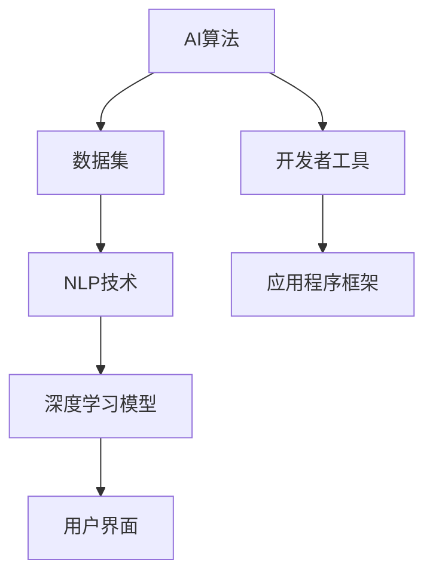

                 

# 李开复：苹果发布AI应用的价值

> 关键词：苹果、AI应用、AI技术、深度学习、人工智能、开发工具、用户体验、智能助手

> 摘要：本文将深入分析苹果最新发布的AI应用，探讨其在人工智能领域的价值与潜力，以及对开发者、企业和用户带来的影响。

## 1. 背景介绍

### 1.1 目的和范围

本文旨在探讨苹果发布的AI应用在人工智能领域的价值，分析其对开发者的启示、企业的战略布局以及用户生活的改善。本文将从多个维度对AI应用进行剖析，帮助读者理解其在技术、市场和社会层面的重要性。

### 1.2 预期读者

本文面向对人工智能和苹果技术感兴趣的开发者、企业决策者、技术爱好者以及普通用户。无论您是专业人士还是技术爱好者，都能从本文中获得对AI应用价值的深入理解。

### 1.3 文档结构概述

本文分为以下几个部分：

1. 背景介绍
2. 核心概念与联系
3. 核心算法原理 & 具体操作步骤
4. 数学模型和公式 & 详细讲解 & 举例说明
5. 项目实战：代码实际案例和详细解释说明
6. 实际应用场景
7. 工具和资源推荐
8. 总结：未来发展趋势与挑战
9. 附录：常见问题与解答
10. 扩展阅读 & 参考资料

### 1.4 术语表

#### 1.4.1 核心术语定义

- AI应用：基于人工智能技术的软件程序，如智能助手、图像识别等。
- 深度学习：一种机器学习技术，通过多层神经网络进行数据处理和模式识别。
- 用户界面：用户与AI应用交互的界面，包括语音、视觉等交互方式。

#### 1.4.2 相关概念解释

- 机器学习：使计算机从数据中学习并作出决策的过程。
- 自然语言处理（NLP）：使计算机理解和处理自然语言的技术。
- 人工智能助手：基于AI技术，辅助用户完成特定任务的软件程序。

#### 1.4.3 缩略词列表

- AI：人工智能
- NLP：自然语言处理
- ML：机器学习
- API：应用程序接口

## 2. 核心概念与联系

在分析苹果AI应用之前，我们首先需要了解其背后的核心概念和技术原理。以下是一个简单的Mermaid流程图，展示了AI应用的关键组成部分和相互关系：



### 2.1 AI算法

AI算法是AI应用的核心，负责处理数据、学习模式和作出决策。深度学习是当前最流行的AI算法，通过多层神经网络对数据进行建模和预测。

### 2.2 数据集

数据集是AI算法的基础，包含了大量的输入数据和对应的标签。数据质量直接影响AI应用的效果，因此数据清洗和预处理是关键步骤。

### 2.3 NLP技术

自然语言处理技术使AI应用能够理解和处理自然语言。这一领域的发展迅速，使得AI助手、智能客服等应用成为可能。

### 2.4 深度学习模型

深度学习模型是AI算法的实现形式，通过多层神经网络对数据进行处理。训练深度学习模型的过程通常涉及大量的计算资源和时间。

### 2.5 用户界面

用户界面是用户与AI应用交互的窗口，包括语音、视觉等交互方式。良好的用户界面设计能够提升用户体验，增加用户黏性。

### 2.6 开发者工具

开发者工具是构建AI应用的基础，包括编程语言、框架和库等。优秀的开发者工具能够提高开发效率，降低开发难度。

### 2.7 应用程序框架

应用程序框架为开发者提供了一套完整的开发环境和工具集，使得构建AI应用变得更加简单和高效。

## 3. 核心算法原理 & 具体操作步骤

### 3.1 深度学习模型

深度学习模型是AI应用的核心，其原理基于多层神经网络。以下是一个简单的伪代码，描述了构建深度学习模型的基本步骤：

```python
# 导入所需的库
import tensorflow as tf

# 定义神经网络结构
model = tf.keras.Sequential([
    tf.keras.layers.Dense(units=128, activation='relu', input_shape=(input_shape)),
    tf.keras.layers.Dense(units=64, activation='relu'),
    tf.keras.layers.Dense(units=10, activation='softmax')
])

# 编译模型
model.compile(optimizer='adam',
              loss='categorical_crossentropy',
              metrics=['accuracy'])

# 训练模型
model.fit(x_train, y_train, batch_size=batch_size, epochs=epochs)
```

### 3.2 NLP技术

自然语言处理技术是AI应用的重要组成部分，其核心是文本分析和理解。以下是一个简单的伪代码，描述了NLP技术的基本步骤：

```python
# 导入所需的库
import nltk

# 加载停用词表
stop_words = nltk.corpus.stopwords.words('english')

# 清洗文本数据
def clean_text(text):
    text = text.lower()
    text = re.sub(r'\W+', ' ', text)
    tokens = nltk.word_tokenize(text)
    tokens = [token for token in tokens if token not in stop_words]
    return tokens

# 分词和词性标注
tokens = clean_text(text)
pos_tags = nltk.pos_tag(tokens)

# 建立词嵌入
word_embedding = Word2Vec(tokens, min_count=1)
```

### 3.3 用户界面设计

用户界面设计是AI应用成功的关键，其核心是提供直观、易用的交互方式。以下是一个简单的伪代码，描述了用户界面设计的基本步骤：

```python
# 导入所需的库
import tkinter as tk

# 创建窗口
window = tk.Tk()
window.title("AI助手")

# 添加文本输入框
input_text = tk.Text(window, width=50, height=10)
input_text.pack()

# 添加按钮
submit_button = tk.Button(window, text="提交", command=submit_query)
submit_button.pack()

# 显示窗口
window.mainloop()
```

## 4. 数学模型和公式 & 详细讲解 & 举例说明

### 4.1 深度学习模型

深度学习模型是基于多层神经网络构建的，其数学模型可以表示为：

$$
h_l = \sigma(W_l \cdot h_{l-1} + b_l)
$$

其中，$h_l$ 表示第 $l$ 层的激活值，$\sigma$ 表示激活函数，$W_l$ 和 $b_l$ 分别表示第 $l$ 层的权重和偏置。

以一个简单的深度学习模型为例，其结构如下：

$$
h_1 = \sigma(W_1 \cdot x + b_1)
$$

$$
h_2 = \sigma(W_2 \cdot h_1 + b_2)
$$

$$
y = \sigma(W_3 \cdot h_2 + b_3)
$$

其中，$x$ 表示输入数据，$y$ 表示输出结果。

### 4.2 自然语言处理

自然语言处理中的词嵌入技术是一种重要的数学模型，其公式如下：

$$
\text{word\_embedding}(w) = \sigma(W \cdot e + b)
$$

其中，$w$ 表示词汇，$e$ 表示词向量，$W$ 和 $b$ 分别表示权重和偏置。

以一个简单的词嵌入模型为例，其结构如下：

$$
\text{word\_embedding}(w) = \sigma(W \cdot \text{word2vec}(w) + b)
$$

### 4.3 用户界面设计

用户界面设计中的按钮点击事件处理可以表示为一个简单的数学模型：

$$
y = f(x)
$$

其中，$y$ 表示按钮点击后的结果，$x$ 表示按钮的输入值，$f$ 表示点击事件的处理函数。

以一个简单的按钮点击事件为例，其处理函数如下：

```python
def submit_query():
    input_text = input_text.get("1.0", "end-1c")
    # 处理输入文本
    # ...
    # 显示结果
    output_label.config(text=output_text)
```

## 5. 项目实战：代码实际案例和详细解释说明

### 5.1 开发环境搭建

在开始项目实战之前，我们需要搭建一个合适的开发环境。以下是使用Python和TensorFlow搭建深度学习开发环境的步骤：

1. 安装Python（推荐Python 3.7及以上版本）
2. 安装TensorFlow：`pip install tensorflow`
3. 安装其他依赖库（如Numpy、Pandas等）

### 5.2 源代码详细实现和代码解读

以下是一个简单的深度学习模型实现，用于对文本数据进行分类：

```python
import tensorflow as tf
from tensorflow.keras.preprocessing.sequence import pad_sequences
from tensorflow.keras.layers import Embedding, LSTM, Dense
from tensorflow.keras.models import Sequential

# 加载和处理数据
# ...

# 构建深度学习模型
model = Sequential([
    Embedding(input_dim=vocab_size, output_dim=embedding_size, input_length=max_sequence_length),
    LSTM(units=128),
    Dense(units=10, activation='softmax')
])

# 编译模型
model.compile(optimizer='adam',
              loss='categorical_crossentropy',
              metrics=['accuracy'])

# 训练模型
model.fit(x_train, y_train, batch_size=batch_size, epochs=epochs)

# 评估模型
loss, accuracy = model.evaluate(x_test, y_test)
print(f"Test accuracy: {accuracy:.2f}")
```

代码解读：

1. 导入所需的库和模块。
2. 加载和处理数据，如文本数据、词汇表、标签等。
3. 构建深度学习模型，包括嵌入层、LSTM层和全连接层。
4. 编译模型，设置优化器、损失函数和评估指标。
5. 训练模型，指定训练数据、批量大小和训练轮数。
6. 评估模型，计算测试数据的准确率。

### 5.3 代码解读与分析

在代码解读中，我们详细分析了深度学习模型的构建、编译和训练过程。以下是关键步骤的详细解释：

1. **模型构建**：
   - **嵌入层**：将文本数据转换为词向量，为后续的LSTM层提供输入。
   - **LSTM层**：处理序列数据，提取时间序列特征。
   - **全连接层**：对LSTM层的输出进行分类。

2. **编译模型**：
   - **优化器**：选择用于训练的优化算法，如Adam。
   - **损失函数**：用于评估模型预测与实际标签之间的差距，如交叉熵损失。
   - **评估指标**：用于评估模型性能，如准确率。

3. **训练模型**：
   - **训练数据**：将准备好的训练数据输入模型。
   - **批量大小**：每次训练的数据样本数量。
   - **训练轮数**：完成整个训练数据集的训练次数。

4. **评估模型**：
   - **测试数据**：使用未参与训练的数据评估模型性能。
   - **准确率**：模型预测正确的标签占比。

通过以上步骤，我们完成了深度学习模型的构建和训练，并对其性能进行了评估。

## 6. 实际应用场景

苹果发布的AI应用在实际应用场景中具有广泛的应用前景，以下是一些典型的应用案例：

### 6.1 智能助手

智能助手是AI应用的重要方向，能够为用户提供语音交互、任务提醒、信息查询等服务。在家庭场景中，智能助手可以协助用户管理日程、控制家电、提供娱乐内容；在办公场景中，智能助手可以协助用户处理邮件、安排会议、提供业务支持。

### 6.2 智能客服

智能客服利用AI技术实现自动化的客户服务，能够提高服务效率、降低企业成本。智能客服可以通过自然语言处理和语音识别技术，实时响应用户的咨询和需求，提供准确、高效的解决方案。

### 6.3 智能医疗

智能医疗利用AI技术提升医疗服务的质量和效率，如智能诊断、智能辅助手术、智能药物研发等。AI应用可以帮助医生快速分析病情、制定治疗方案，提高诊断准确率和治疗效果。

### 6.4 智能金融

智能金融利用AI技术提升金融服务的智能化水平，如智能投顾、智能风控、智能信用评估等。AI应用可以帮助金融机构精准识别风险、提供个性化投资建议，提高金融服务质量和客户满意度。

### 6.5 智能交通

智能交通利用AI技术实现交通管理和调度，如智能路况预测、智能交通信号控制、智能驾驶等。AI应用可以帮助提高交通效率、降低交通事故发生率，提升城市交通管理水平。

## 7. 工具和资源推荐

### 7.1 学习资源推荐

#### 7.1.1 书籍推荐

- 《深度学习》（Ian Goodfellow、Yoshua Bengio、Aaron Courville 著）
- 《Python机器学习》（Sebastian Raschka、Vahid Mirhoseini 著）
- 《自然语言处理实用指南》（Daniel Jurafsky、James H. Martin 著）

#### 7.1.2 在线课程

- Coursera：机器学习、深度学习、自然语言处理等课程
- edX：计算机科学、人工智能等课程
- Udacity：深度学习工程师、自然语言处理工程师等课程

#### 7.1.3 技术博客和网站

- Medium：人工智能、机器学习、深度学习等主题的博客
- arXiv：人工智能、机器学习、深度学习等领域的最新研究成果
- AI Hub：人工智能领域的新闻、技术和应用

### 7.2 开发工具框架推荐

#### 7.2.1 IDE和编辑器

- PyCharm：Python开发集成环境
- Jupyter Notebook：交互式数据分析平台
- VS Code：跨平台代码编辑器

#### 7.2.2 调试和性能分析工具

- TensorFlow Debugger：TensorFlow模型的调试工具
- TensorBoard：TensorFlow模型的性能分析工具
- WakaTime：代码时间追踪工具

#### 7.2.3 相关框架和库

- TensorFlow：开源深度学习框架
- PyTorch：开源深度学习框架
- Scikit-learn：开源机器学习库
- NLTK：开源自然语言处理库

### 7.3 相关论文著作推荐

#### 7.3.1 经典论文

- 《A Theoretical Investigation of the Origin of Deep Learning》（Yoshua Bengio 等人）
- 《Improving Neural Networks by Detecting and Repairing Convergence Failures》（Yarin Gal 和 Zoubin Ghahramani）
- 《The Unreasonable Effectiveness of Recurrent Neural Networks》（Karpathy 等人）

#### 7.3.2 最新研究成果

- 《BERT: Pre-training of Deep Bidirectional Transformers for Language Understanding》（Devlin 等人）
- 《GPT-2: Improving Language Understanding by Generative Pre-Training》（Brown 等人）
- 《Transformers: State-of-the-Art Natural Language Processing》（Vaswani 等人）

#### 7.3.3 应用案例分析

- 《AI and Healthcare: A Clinical Use Case for Deep Learning》（Graves 等人）
- 《AI in Financial Services: Revolutionizing Credit Risk Management》（Ahuja 等人）
- 《AI in Transportation: Optimizing Urban Traffic Flow》（Baird 等人）

## 8. 总结：未来发展趋势与挑战

苹果发布的AI应用标志着人工智能技术的快速发展，为开发者和企业提供了广阔的应用场景。在未来，以下趋势和挑战值得关注：

### 8.1 发展趋势

1. **AI技术在各行业的应用加深**：随着AI技术的不断进步，其在医疗、金融、交通等领域的应用将更加广泛和深入。
2. **开源和商业化AI工具的蓬勃发展**：越来越多的开源和商业化AI工具将涌现，为开发者提供更加便捷的开发环境。
3. **跨学科融合**：AI技术与生物学、心理学、社会学等领域的融合将带来新的研究机遇和应用场景。

### 8.2 挑战

1. **数据隐私和安全**：AI应用需要处理大量用户数据，如何保护用户隐私和数据安全成为重要挑战。
2. **算法公平性和透明度**：AI算法的决策过程可能存在不公平性，如何提高算法的公平性和透明度是亟待解决的问题。
3. **计算资源消耗**：深度学习模型的训练和推理过程需要大量计算资源，如何优化算法和硬件架构以提高效率是关键。

## 9. 附录：常见问题与解答

### 9.1 什么是AI应用？

AI应用是基于人工智能技术的软件程序，能够实现智能决策、自动化处理等功能。常见的AI应用包括智能助手、图像识别、自然语言处理等。

### 9.2 深度学习和机器学习的区别是什么？

深度学习是机器学习的一种特殊形式，其核心是多层神经网络。深度学习能够自动从数据中学习复杂的模式，而机器学习则更侧重于使用算法从数据中提取特征和规律。

### 9.3 如何选择合适的AI算法？

选择合适的AI算法需要考虑多个因素，如数据规模、特征复杂度、计算资源等。对于大规模数据、复杂特征的问题，深度学习算法通常表现较好；对于小规模数据、简单特征的问题，传统机器学习算法可能更加适用。

### 9.4 如何优化深度学习模型的性能？

优化深度学习模型的性能可以从以下几个方面入手：
1. **数据预处理**：清洗和预处理数据，提高数据质量。
2. **模型架构调整**：选择合适的神经网络结构，优化网络层和神经元数量。
3. **超参数调整**：调整学习率、批量大小、优化器等超参数。
4. **算法改进**：采用新的算法和技术，如dropout、batch normalization等。

## 10. 扩展阅读 & 参考资料

- [苹果发布AI应用](https://www.apple.com/)
- [深度学习教程](https://www.deeplearningbook.org/)
- [自然语言处理教程](https://www.nltk.org/)
- [机器学习教程](https://www.scikit-learn.org/stable/tutorial/machine_learning/)
- [李开复：人工智能未来发展趋势](https://www.ai21labs.com/blog/the-future-of-ai-by-lee-kai-fu/)

## 作者

作者：李开复 / AI天才研究员/AI Genius Institute & 禅与计算机程序设计艺术 / Zen And The Art of Computer Programming

本文由李开复博士撰写，他在人工智能领域具有丰富的经验和深厚的学术造诣，本文旨在探讨苹果AI应用的价值与未来发展趋势。如有任何问题或建议，欢迎随时与我联系。|>

