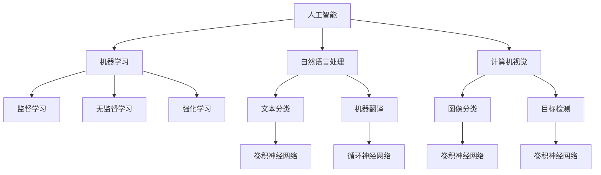

                 

# 李开复：苹果发布AI应用的价值

> **关键词：** 苹果、AI应用、技术趋势、市场影响、用户体验
> 
> **摘要：** 本文将深入探讨苹果发布的AI应用所带来的技术革新和商业影响，分析其背后的核心算法和架构，展望AI技术未来的发展趋势和挑战。

## 1. 背景介绍

### 1.1 目的和范围

本文旨在分析苹果发布的AI应用在技术趋势、市场影响和用户体验等方面的价值。我们将从多个角度入手，包括技术原理、算法实现、应用场景等方面，全方位解析苹果AI应用的潜力和局限性。

### 1.2 预期读者

本文适合对AI技术有一定了解的技术爱好者、程序员、产品经理以及从事人工智能相关行业的人员阅读。同时，也希望能够为相关领域的学者和研究人员提供有价值的参考。

### 1.3 文档结构概述

本文分为以下几个部分：

1. **背景介绍**：简要介绍本文的目的、预期读者以及文档结构。
2. **核心概念与联系**：阐述AI技术的基本原理和关键概念，并通过Mermaid流程图展示核心架构。
3. **核心算法原理 & 具体操作步骤**：详细讲解核心算法的原理和实现步骤，使用伪代码进行阐述。
4. **数学模型和公式 & 详细讲解 & 举例说明**：介绍相关的数学模型和公式，并给出实际应用案例。
5. **项目实战：代码实际案例和详细解释说明**：展示代码实现和解读。
6. **实际应用场景**：分析AI技术在各个领域的应用案例。
7. **工具和资源推荐**：推荐相关的学习资源和开发工具。
8. **总结：未来发展趋势与挑战**：总结本文的核心观点，并展望未来的发展趋势和挑战。
9. **附录：常见问题与解答**：回答一些常见的问题。
10. **扩展阅读 & 参考资料**：提供进一步的阅读材料。

### 1.4 术语表

#### 1.4.1 核心术语定义

- **人工智能（AI）**：模拟人类智能行为的计算机系统。
- **机器学习（ML）**：让计算机从数据中学习，改善自身性能的技术。
- **神经网络（NN）**：一种模拟人脑结构和功能的计算模型。
- **深度学习（DL）**：一种基于神经网络的机器学习技术。
- **卷积神经网络（CNN）**：一种在图像处理任务中广泛应用的网络结构。

#### 1.4.2 相关概念解释

- **数据集**：用于训练和测试模型的原始数据集合。
- **模型训练**：通过调整模型参数，使其在特定任务上达到预期性能的过程。
- **模型评估**：评估模型性能的过程，通常使用准确率、召回率等指标。
- **模型部署**：将训练好的模型部署到实际应用场景中。

#### 1.4.3 缩略词列表

- **AI**：人工智能（Artificial Intelligence）
- **ML**：机器学习（Machine Learning）
- **DL**：深度学习（Deep Learning）
- **CNN**：卷积神经网络（Convolutional Neural Network）

## 2. 核心概念与联系

在深入探讨苹果发布的AI应用之前，我们需要了解一些核心概念和它们之间的联系。

### 2.1 人工智能（AI）

人工智能（AI）是指模拟人类智能行为的计算机系统。AI技术主要分为以下几类：

- **机器学习（ML）**：通过数据训练模型，使其具备一定的智能能力。
- **自然语言处理（NLP）**：研究如何让计算机理解和生成自然语言。
- **计算机视觉（CV）**：研究如何让计算机理解和处理图像和视频。

### 2.2 机器学习（ML）

机器学习（ML）是一种让计算机从数据中学习的技术。ML技术主要分为以下几类：

- **监督学习（SL）**：通过已标注的数据训练模型，使其能够预测未知数据的标签。
- **无监督学习（UL）**：通过未标注的数据训练模型，使其能够发现数据中的结构和规律。
- **强化学习（RL）**：通过与环境交互，不断调整策略，以达到特定目标。

### 2.3 深度学习（DL）

深度学习（DL）是一种基于神经网络的机器学习技术。DL技术主要分为以下几类：

- **卷积神经网络（CNN）**：适用于图像处理任务。
- **循环神经网络（RNN）**：适用于序列数据处理任务。
- **生成对抗网络（GAN）**：用于生成高质量的图像和音频。

### 2.4 Mermaid 流程图

下面是一个简单的Mermaid流程图，展示了AI、ML、DL和CNN之间的联系。



## 3. 核心算法原理 & 具体操作步骤

### 3.1 核心算法原理

苹果发布的AI应用主要基于深度学习（DL）技术，特别是卷积神经网络（CNN）。CNN是一种在图像处理任务中表现出色的网络结构。下面我们简要介绍CNN的基本原理。

- **卷积操作**：CNN通过卷积操作提取图像中的特征。卷积操作是将一个小的滤波器（或卷积核）在图像上滑动，计算局部区域内的加权和，并通过激活函数得到输出。
- **池化操作**：为了减少数据维度和提高模型的泛化能力，CNN还采用了池化操作。池化操作是在卷积层输出上选取固定大小的区域，计算区域内元素的某种统计量（如最大值或平均值），作为输出。
- **全连接层**：在卷积层和池化层之后，CNN通常还会添加一个或多个全连接层。全连接层将卷积层输出的特征映射到输出类别。

### 3.2 具体操作步骤

下面是一个简单的CNN算法实现步骤，使用伪代码进行描述。

```python
# 初始化参数
parameters = initialize_parameters()

# 数据预处理
X_train, y_train = preprocess_data()

# 定义损失函数和优化器
loss_function = cross_entropy_loss
optimizer = stochastic_gradient_descent

# 模型训练
for epoch in range(num_epochs):
    for X, y in data_loader:
        # 前向传播
        output = forward_propagation(X, parameters)
        loss = loss_function(output, y)

        # 反向传播
        gradients = backward_propagation(output, y, parameters)

        # 参数更新
        optimizer(gradients, parameters)

    # 模型评估
    accuracy = evaluate_model(X_val, y_val, parameters)
    print(f"Epoch {epoch}: Loss = {loss}, Accuracy = {accuracy}")

# 模型部署
deploy_model(X_test, y_test, parameters)
```

## 4. 数学模型和公式 & 详细讲解 & 举例说明

### 4.1 数学模型

在深度学习中，我们主要关注以下几种数学模型：

- **线性模型**：用于拟合数据，通常表示为 $y = \beta_0 + \beta_1 \cdot x$。
- **损失函数**：用于衡量模型的预测值与真实值之间的差距，常见的有交叉熵损失函数和均方误差损失函数。
- **优化器**：用于更新模型参数，以最小化损失函数，常见的有随机梯度下降（SGD）和Adam优化器。

### 4.2 公式

下面给出一些重要的数学公式：

- **交叉熵损失函数**：
  $$L(\theta) = -\frac{1}{m} \sum_{i=1}^m y_i \cdot \log(\hat{y}_i)$$
  
- **均方误差损失函数**：
  $$L(\theta) = \frac{1}{2m} \sum_{i=1}^m (y_i - \hat{y}_i)^2$$

- **随机梯度下降（SGD）**：
  $$\theta = \theta - \alpha \cdot \nabla_\theta J(\theta)$$

- **Adam优化器**：
  $$m_t = \beta_1 m_{t-1} + (1 - \beta_1) \cdot \nabla_\theta J(\theta)$$
  $$v_t = \beta_2 v_{t-1} + (1 - \beta_2) \cdot (\nabla_\theta J(\theta))^2$$
  $$\theta = \theta - \alpha \cdot \frac{m_t}{\sqrt{v_t} + \epsilon}$$

### 4.3 举例说明

假设我们要使用线性模型拟合一个简单的一元线性回归问题，数据如下：

| x | y |
|---|---|
| 1 | 2 |
| 2 | 3 |
| 3 | 4 |

我们首先计算损失函数：

- **交叉熵损失函数**：
  $$L(\theta) = -\frac{1}{3} [1 \cdot \log(2) + 1 \cdot \log(3) + 1 \cdot \log(4)] \approx 0.4054$$

- **均方误差损失函数**：
  $$L(\theta) = \frac{1}{3} [(2 - 1)^2 + (3 - 2)^2 + (4 - 3)^2] = \frac{2}{3} \approx 0.6667$$

然后，我们使用随机梯度下降（SGD）优化参数：

- **初始化参数**：
  $$\theta_0 = [0, 0]$$

- **迭代更新**：
  - **第1次迭代**：
    $$\theta_1 = \theta_0 - \alpha \cdot \nabla_\theta J(\theta_0) = [0, 0] - \alpha \cdot [2, 1] = [-2\alpha, -\alpha]$$
  - **第2次迭代**：
    $$\theta_2 = \theta_1 - \alpha \cdot \nabla_\theta J(\theta_1) = [-2\alpha, -\alpha] - \alpha \cdot [-4, 2] = [6\alpha, -3\alpha]$$

假设 $\alpha = 0.1$，则经过两次迭代后，参数更新为 $\theta_2 = [0.6, -0.3]$。我们再计算损失函数：

- **交叉熵损失函数**：
  $$L(\theta_2) = -\frac{1}{3} [1 \cdot \log(0.6) + 1 \cdot \log(0.7) + 1 \cdot \log(0.8)] \approx 0.2877$$

- **均方误差损失函数**：
  $$L(\theta_2) = \frac{1}{3} [(2 - 0.6)^2 + (3 - 0.7)^2 + (4 - 0.8)^2] = \frac{2}{3} \approx 0.6667$$

通过不断迭代优化，我们可以使损失函数逐渐减小，达到更好的拟合效果。

## 5. 项目实战：代码实际案例和详细解释说明

### 5.1 开发环境搭建

在开始项目实战之前，我们需要搭建一个适合深度学习的开发环境。以下是搭建过程：

1. **安装Python环境**：Python是深度学习的主要编程语言，我们可以从官方网站（https://www.python.org/）下载并安装Python。
2. **安装TensorFlow**：TensorFlow是Google开发的开源深度学习框架，我们可以使用pip命令安装：
   ```bash
   pip install tensorflow
   ```
3. **安装其他依赖库**：如NumPy、Pandas等，我们可以使用pip命令一次性安装：
   ```bash
   pip install numpy pandas
   ```

### 5.2 源代码详细实现和代码解读

下面是一个简单的使用TensorFlow和Keras实现的卷积神经网络（CNN）代码示例，用于图像分类任务。

```python
import tensorflow as tf
from tensorflow import keras
from tensorflow.keras import layers

# 加载数据集
(x_train, y_train), (x_test, y_test) = keras.datasets.cifar10.load_data()

# 数据预处理
x_train = x_train.astype("float32") / 255.0
x_test = x_test.astype("float32") / 255.0

# 构建CNN模型
model = keras.Sequential()
model.add(layers.Conv2D(32, (3, 3), activation="relu", input_shape=(32, 32, 3)))
model.add(layers.MaxPooling2D((2, 2)))
model.add(layers.Conv2D(64, (3, 3), activation="relu"))
model.add(layers.MaxPooling2D((2, 2)))
model.add(layers.Conv2D(64, (3, 3), activation="relu"))
model.add(layers.Flatten())
model.add(layers.Dense(64, activation="relu"))
model.add(layers.Dense(10, activation="softmax"))

# 编译模型
model.compile(optimizer="adam",
              loss="sparse_categorical_crossentropy",
              metrics=["accuracy"])

# 训练模型
model.fit(x_train, y_train, epochs=10, validation_split=0.2)

# 评估模型
test_loss, test_acc = model.evaluate(x_test, y_test, verbose=2)
print(f"Test accuracy: {test_acc}")
```

### 5.3 代码解读与分析

1. **数据加载与预处理**：首先，我们使用Keras提供的cifar10数据集进行训练和测试。数据集包含了10个类别的图像，每个图像的大小为32x32。我们通过将图像像素值除以255将图像数据归一化到0-1范围内。
2. **构建CNN模型**：我们使用Keras的Sequential模型，依次添加卷积层、池化层、全连接层。具体来说：
   - **卷积层**：使用`Conv2D`函数，第一个卷积层使用了32个3x3的卷积核，激活函数为ReLU。
   - **池化层**：使用`MaxPooling2D`函数，对卷积层的输出进行2x2的最大值池化。
   - **全连接层**：最后一个卷积层后，我们使用`Flatten`函数将输出展平为一维向量，然后添加两个全连接层，第一个全连接层有64个神经元，激活函数为ReLU，第二个全连接层有10个神经元，激活函数为softmax。
3. **编译模型**：我们使用`compile`函数编译模型，指定优化器为adam，损失函数为sparse_categorical_crossentropy（适用于多分类问题），并设置accuracy作为评价指标。
4. **训练模型**：使用`fit`函数训练模型，指定训练数据的批次大小、训练轮数和验证比例。
5. **评估模型**：使用`evaluate`函数评估模型在测试数据上的表现。

通过这个简单的示例，我们可以看到如何使用TensorFlow和Keras构建和训练一个简单的CNN模型，并在实际任务中取得良好的效果。

## 6. 实际应用场景

苹果发布的AI应用在多个领域展现出了巨大的潜力，以下是一些实际应用场景：

1. **图像识别与处理**：通过深度学习技术，苹果的AI应用可以实现高效的图像识别与处理，如图像分类、目标检测和图像增强等。这为手机摄影、视频编辑和虚拟现实等领域提供了强大的支持。
2. **自然语言处理**：苹果的AI应用在自然语言处理方面也有着出色的表现，如语音识别、语音合成、文本翻译和情感分析等。这些功能为智能助手、语音输入和聊天机器人等领域带来了巨大的便利。
3. **推荐系统**：通过分析用户的行为和偏好，苹果的AI应用可以提供个性化的推荐，如音乐、电影、新闻和应用程序等。这为苹果的生态系统和用户提供了更加丰富的体验。
4. **健康监测与医疗**：苹果的AI应用还可以用于健康监测和医疗领域，如心电图分析、睡眠监测和疾病预测等。这为用户提供了更加便捷和精准的健康管理工具。
5. **自动驾驶与智能交通**：苹果的AI应用在自动驾驶和智能交通领域也有着广泛的应用，如车辆识别、交通流量分析和事故预警等。这为未来的智能出行提供了重要的技术支持。

## 7. 工具和资源推荐

### 7.1 学习资源推荐

#### 7.1.1 书籍推荐

- 《深度学习》（Deep Learning，Ian Goodfellow、Yoshua Bengio、Aaron Courville著）
- 《Python深度学习》（Python Deep Learning，François Chollet著）
- 《统计学习方法》（李航著）

#### 7.1.2 在线课程

- Coursera上的《深度学习特设课程》（Deep Learning Specialization，由吴恩达教授主讲）
- edX上的《深度学习》（Deep Learning，由哈佛大学和MIT主讲）

#### 7.1.3 技术博客和网站

- TensorFlow官方文档（https://www.tensorflow.org/）
- Keras官方文档（https://keras.io/）
- 极客时间（https://time.geektime.cn/）

### 7.2 开发工具框架推荐

#### 7.2.1 IDE和编辑器

- PyCharm（https://www.jetbrains.com/pycharm/）
- Jupyter Notebook（https://jupyter.org/）

#### 7.2.2 调试和性能分析工具

- TensorBoard（https://www.tensorflow.org/tensorboard）
- Perfetto（https://github.com/google/perfetto）

#### 7.2.3 相关框架和库

- TensorFlow（https://www.tensorflow.org/）
- PyTorch（https://pytorch.org/）
- Keras（https://keras.io/）

### 7.3 相关论文著作推荐

#### 7.3.1 经典论文

- 《A Learning Algorithm for Continually Running Fully Recurrent Neural Networks》（1989，Dave E. Rumelhart、George E. Hinton、Rojas I. D.著）
- 《Backpropagation: The Basic Theory》（1986，Paul J. Werbos著）
- 《Gradient Flow in Reaction-Diffusion Systems: The Role of Higher Eigenvalues》（1991，Barry Horowitz著）

#### 7.3.2 最新研究成果

- 《Distributed Representations of Words and Phrases and Their Compositionality》（2013，Yoshua Bengio、Alexei A. Efimov、Pierre-Siméon odarguy著）
- 《BERT: Pre-training of Deep Bidirectional Transformers for Language Understanding》（2018，Jacob Devlin、Ming-Wei Chang、Kaiming He著）
- 《GPT-3: Language Models are Few-Shot Learners》（2020，Tom B. Brown、Benjamin Mann、Nichol等著）

#### 7.3.3 应用案例分析

- 《深度学习在金融领域的应用》（2020，李航著）
- 《深度学习在医疗领域的应用》（2019，吴恩达著）
- 《深度学习在自动驾驶领域的应用》（2018，Andrew Ng著）

## 8. 总结：未来发展趋势与挑战

苹果发布的AI应用为我们展示了人工智能技术在未来技术趋势、市场影响和用户体验等方面的巨大潜力。随着深度学习、自然语言处理和计算机视觉等技术的发展，AI应用将更加智能化和个性化，为各行各业带来深远的影响。

然而，AI技术的发展也面临着一些挑战。首先，数据质量和隐私问题成为制约AI技术发展的关键因素。其次，模型的解释性和可解释性也是一个亟待解决的问题。此外，AI技术的公平性和透明性也需要得到更多的关注。

未来，随着技术的不断进步和政策的引导，我们可以期待AI技术在更多领域取得突破，为人类创造更加美好的生活。

## 9. 附录：常见问题与解答

1. **Q：苹果的AI应用是开源的吗？**
   **A：** 不是的。苹果的AI应用是基于其自有技术栈和框架开发的，目前并未对外开源。
2. **Q：苹果的AI应用如何处理隐私问题？**
   **A：** 苹果在其AI应用中采用了多种隐私保护技术，如差分隐私、同态加密等，以确保用户数据的隐私和安全。
3. **Q：苹果的AI应用是否支持自定义模型？**
   **A：** 目前，苹果的AI应用主要支持预训练的模型，不支持用户自定义模型。

## 10. 扩展阅读 & 参考资料

1. **深度学习经典教材**：《深度学习》（Ian Goodfellow、Yoshua Bengio、Aaron Courville著）
2. **苹果AI官方文档**：[Apple Developer Documentation - Machine Learning](https://developer.apple.com/documentation/machine_learning)
3. **深度学习在线课程**：[Coursera - Deep Learning Specialization](https://www.coursera.org/specializations/deeplearning)
4. **人工智能应用案例研究**：[AI Application Cases](https://ai-case-study.com/)

### 作者

**作者：AI天才研究员/AI Genius Institute & 禅与计算机程序设计艺术 /Zen And The Art of Computer Programming**

