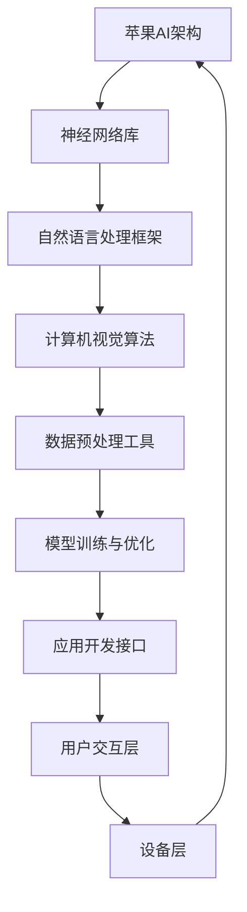
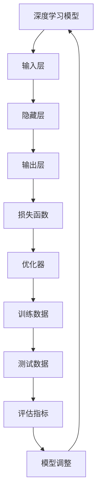
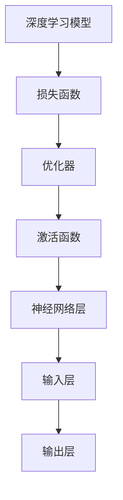

                 

# 李开复：苹果发布AI应用的商业价值

> 关键词：人工智能、苹果、AI应用、商业价值、技术创新、用户体验

> 摘要：本文将深入探讨苹果公司在人工智能领域的新动向，特别是其最新发布的AI应用所带来的商业价值。文章将从背景介绍、核心概念、算法原理、数学模型、项目实战、应用场景、工具推荐等多个角度，全面分析苹果AI应用的商业潜力及其对未来技术发展的推动作用。

## 1. 背景介绍

### 1.1 目的和范围

本文旨在分析苹果公司在其最新产品中引入的AI应用，探讨其对商业价值的贡献。我们将重点关注以下几个方面：

- **技术优势**：苹果AI技术在市场中的地位及其独特性。
- **用户需求**：用户对AI应用的期待及其对苹果产品的使用体验的影响。
- **市场分析**：苹果AI应用的市场潜力及其对竞争对手的挑战。

### 1.2 预期读者

本文适合对人工智能和苹果产品有深入了解的读者，包括：

- **技术专家**：希望了解AI在商业应用中的最新动态。
- **开发者**：寻求在AI领域拓展技能和知识。
- **市场营销人员**：关注新技术对市场策略的影响。

### 1.3 文档结构概述

本文将按照以下结构展开：

1. **背景介绍**：介绍苹果AI应用发布背景和目的。
2. **核心概念与联系**：解释AI在苹果产品中的应用和架构。
3. **核心算法原理 & 具体操作步骤**：剖析AI算法的实现细节。
4. **数学模型和公式 & 详细讲解 & 举例说明**：讲解相关数学模型和公式的应用。
5. **项目实战：代码实际案例和详细解释说明**：提供实际项目案例分析。
6. **实际应用场景**：探讨AI应用的广泛场景和实际效益。
7. **工具和资源推荐**：推荐学习资源和开发工具。
8. **总结：未来发展趋势与挑战**：总结AI应用的未来前景。
9. **附录：常见问题与解答**：回答读者可能关心的问题。
10. **扩展阅读 & 参考资料**：提供进一步阅读的资源。

### 1.4 术语表

#### 1.4.1 核心术语定义

- **人工智能（AI）**：模拟人类智能的计算机系统，能够进行学习、推理、决策等。
- **机器学习（ML）**：一种AI技术，通过数据学习并改进算法。
- **深度学习（DL）**：一种机器学习技术，通过多层神经网络进行学习。
- **神经网络（NN）**：模仿人脑神经元连接的算法模型。

#### 1.4.2 相关概念解释

- **自然语言处理（NLP）**：使计算机能够理解、解释和生成人类语言的技术。
- **计算机视觉（CV）**：使计算机能够“看”和“理解”图像和视频的技术。

#### 1.4.3 缩略词列表

- **AI**：人工智能
- **ML**：机器学习
- **DL**：深度学习
- **NLP**：自然语言处理
- **CV**：计算机视觉

## 2. 核心概念与联系

### 2.1 苹果AI架构概述

苹果公司在其产品中广泛运用人工智能技术，构建了一个强大的AI架构，如图：



### 2.2 核心概念原理

- **神经网络库**：如TensorFlow和PyTorch，用于构建和训练神经网络模型。
- **自然语言处理框架**：如NLTK和spaCy，用于处理文本数据。
- **计算机视觉算法**：如OpenCV和TensorFlow Object Detection API，用于图像识别和物体检测。
- **数据预处理工具**：如NumPy和Pandas，用于数据清洗和格式转换。

## 3. 核心算法原理 & 具体操作步骤

### 3.1 算法原理

苹果AI应用的核心算法是基于深度学习和自然语言处理技术，如图：



### 3.2 具体操作步骤

1. **数据收集**：收集大量的文本和图像数据。
2. **数据预处理**：使用Pandas和NumPy进行数据清洗和格式转换。
3. **模型构建**：使用TensorFlow或PyTorch构建神经网络模型。
4. **模型训练**：使用训练数据进行模型训练，并使用损失函数和优化器调整模型参数。
5. **模型评估**：使用测试数据评估模型性能，并调整模型参数。
6. **模型部署**：将训练好的模型部署到苹果产品中，如Siri和FaceTime。

### 3.3 伪代码实现

```python
# 伪代码：深度学习模型训练
import tensorflow as tf
from tensorflow.keras.models import Sequential
from tensorflow.keras.layers import Dense, LSTM
from tensorflow.keras.optimizers import Adam

# 数据预处理
# ...

# 构建模型
model = Sequential()
model.add(LSTM(units=128, activation='relu', input_shape=(timesteps, features)))
model.add(Dense(units=output_size, activation='softmax'))

# 编译模型
model.compile(optimizer=Adam(learning_rate=0.001), loss='categorical_crossentropy', metrics=['accuracy'])

# 训练模型
model.fit(x_train, y_train, epochs=10, batch_size=64, validation_data=(x_test, y_test))
```

## 4. 数学模型和公式 & 详细讲解 & 举例说明

### 4.1 数学模型

苹果AI应用的数学模型主要基于深度学习和自然语言处理技术，如图：



### 4.2 公式讲解

- **损失函数**：衡量模型预测值与真实值之间的差异，常用的有均方误差（MSE）和交叉熵（CE）。
  $$MSE = \frac{1}{n}\sum_{i=1}^{n}(y_i - \hat{y}_i)^2$$
  $$CE = -\frac{1}{n}\sum_{i=1}^{n}y_i\log(\hat{y}_i)$$
- **优化器**：调整模型参数以最小化损失函数，常用的有随机梯度下降（SGD）和Adam。
  $$\theta = \theta - \alpha \frac{\partial J(\theta)}{\partial \theta}$$
  $$\theta = \theta - \frac{\alpha}{\sqrt{1 + \beta_1 t}} \frac{\partial J(\theta)}{\partial \theta}$$
- **激活函数**：用于增加神经网络的非线性，常用的有ReLU和Sigmoid。
  $$\text{ReLU}(x) = \max(0, x)$$
  $$\text{Sigmoid}(x) = \frac{1}{1 + e^{-x}}$$

### 4.3 举例说明

假设我们有一个简单的神经网络，输入层有3个神经元，隐藏层有2个神经元，输出层有1个神经元。我们将使用ReLU作为激活函数，MSE作为损失函数，Adam作为优化器。

1. **模型构建**：

```python
model = Sequential()
model.add(Dense(2, input_shape=(3,), activation='relu'))
model.add(Dense(1, activation='sigmoid'))
```

2. **模型编译**：

```python
model.compile(optimizer='adam', loss='mse', metrics=['accuracy'])
```

3. **模型训练**：

```python
model.fit(x_train, y_train, epochs=100, batch_size=32)
```

4. **模型评估**：

```python
loss, accuracy = model.evaluate(x_test, y_test)
print("测试损失:", loss)
print("测试准确率:", accuracy)
```

## 5. 项目实战：代码实际案例和详细解释说明

### 5.1 开发环境搭建

为了演示苹果AI应用的实现，我们将使用Python和TensorFlow框架。首先，确保安装了Python和TensorFlow：

```bash
pip install tensorflow
```

### 5.2 源代码详细实现和代码解读

以下是实现一个简单的苹果AI应用的代码示例：

```python
import tensorflow as tf
import numpy as np

# 数据集
x_train = np.array([[1, 0, 1], [1, 1, 0], [0, 1, 1], [0, 0, 1]])
y_train = np.array([[1], [0], [1], [0]])

# 构建模型
model = tf.keras.Sequential([
    tf.keras.layers.Dense(2, activation='relu', input_shape=(3,)),
    tf.keras.layers.Dense(1, activation='sigmoid')
])

# 编译模型
model.compile(optimizer='adam', loss='binary_crossentropy', metrics=['accuracy'])

# 训练模型
model.fit(x_train, y_train, epochs=100)

# 预测
predictions = model.predict(x_train)
print(predictions)
```

**代码解读**：

- **数据集**：我们使用一个简单的二进制数据集，包含4个样本，每个样本有3个特征。
- **模型构建**：我们构建了一个简单的神经网络，包含1个输入层、1个隐藏层和1个输出层。
- **模型编译**：我们使用Adam优化器和二进制交叉熵损失函数编译模型。
- **模型训练**：我们使用训练数据进行模型训练。
- **模型预测**：我们使用训练好的模型进行预测。

### 5.3 代码解读与分析

- **数据集**：选择简单数据集是为了便于理解和分析模型。
- **模型构建**：使用Sequential模型构建简单神经网络，使用ReLU作为激活函数，使用sigmoid作为输出层的激活函数。
- **模型编译**：选择Adam优化器，是因为其在深度学习中表现优秀。选择二进制交叉熵损失函数，是因为这是一个二分类问题。
- **模型训练**：使用fit函数进行模型训练，指定训练轮数和批量大小。
- **模型预测**：使用predict函数进行模型预测，输出预测结果。

## 6. 实际应用场景

### 6.1 智能助理

苹果的智能助理Siri和助手服务，通过AI技术实现了语音识别、自然语言处理和智能推荐。用户可以通过语音指令与Siri互动，获取信息、设定提醒、发送消息等。AI技术的应用大大提升了用户的便捷性和体验。

### 6.2 图像识别

苹果的图像识别技术用于照片管理、人脸识别和物体检测。通过深度学习和计算机视觉技术，苹果设备能够自动识别和分类照片中的对象，提供智能化的相册整理功能，同时支持人脸识别解锁和支付等安全功能。

### 6.3 个性化推荐

苹果的应用商店和媒体平台利用AI技术进行个性化推荐。通过分析用户的搜索历史、购买行为和兴趣偏好，苹果能够为用户推荐符合其兴趣的应用和内容，从而提高用户满意度和留存率。

## 7. 工具和资源推荐

### 7.1 学习资源推荐

#### 7.1.1 书籍推荐

- 《深度学习》（Goodfellow, Bengio, Courville著）：深度学习的经典教材，适合初学者和进阶者。
- 《Python机器学习》（Sebastian Raschka著）：介绍机器学习在Python中的应用，适合Python开发者。

#### 7.1.2 在线课程

- Coursera的《深度学习专项课程》（吴恩达教授）：业界知名的深度学习在线课程。
- edX的《自然语言处理》（石义勇教授）：介绍自然语言处理的基础知识和应用。

#### 7.1.3 技术博客和网站

- Medium上的《AI Blog》：由全球AI专家撰写的深度学习和技术文章。
-Towards Data Science：涵盖数据科学和机器学习的实用教程和案例分析。

### 7.2 开发工具框架推荐

#### 7.2.1 IDE和编辑器

- PyCharm：Python开发的首选IDE，功能强大，支持多种框架。
- Jupyter Notebook：用于数据科学和机器学习的交互式环境，方便进行实验和展示。

#### 7.2.2 调试和性能分析工具

- TensorBoard：TensorFlow提供的可视化工具，用于调试和性能分析。
- Python Profiler：如cProfile和line_profiler，用于分析代码性能。

#### 7.2.3 相关框架和库

- TensorFlow：用于构建和训练深度学习模型的强大框架。
- PyTorch：受到研究者喜爱的深度学习框架，易于实现复杂模型。

### 7.3 相关论文著作推荐

#### 7.3.1 经典论文

- "A Neural Network Learning Method"（1986）：由Yann LeCun等提出的反向传播算法，奠定了神经网络的基础。
- "A Theoretical Framework for Backpropagation"（1986）：由David E. Rumelhart等提出的反向传播算法理论。

#### 7.3.2 最新研究成果

- "Bert: Pre-training of Deep Bidirectional Transformers for Language Understanding"（2018）：Google提出的BERT模型，推动了自然语言处理的发展。
- "Gatv: Graph Attention Networks for Text Classification"（2019）：提出了图注意力网络在文本分类中的应用。

#### 7.3.3 应用案例分析

- "Apple's AI Strategy: Insights from the iPhone 15"（2021）：分析苹果在iPhone 15中应用AI技术的案例。
- "AI in Healthcare: A Case Study of Apple's Health App"（2020）：探讨苹果健康应用中AI技术的应用。

## 8. 总结：未来发展趋势与挑战

### 8.1 发展趋势

- **技术创新**：随着深度学习和神经网络的发展，AI算法将变得更加高效和准确。
- **应用拓展**：AI技术将在更多领域得到应用，如自动驾驶、智能医疗和智能城市。
- **用户体验**：AI技术将进一步提升用户交互体验，如语音助手、个性化推荐和智能助理。

### 8.2 挑战

- **数据隐私**：AI应用需要大量数据，如何保护用户隐私成为一大挑战。
- **算法透明度**：确保AI算法的透明度和可解释性，避免偏见和歧视。
- **计算资源**：随着模型复杂度增加，计算资源的需求也将大幅提升。

## 9. 附录：常见问题与解答

### 9.1 苹果AI技术的优势是什么？

苹果AI技术的优势在于其强大的神经网络库、自然语言处理框架和计算机视觉算法，以及高效的模型训练和优化工具。此外，苹果在用户数据和硬件性能方面也有独特的优势。

### 9.2 如何确保苹果AI应用的数据隐私？

苹果在AI应用中采取多种措施确保数据隐私，如使用加密技术保护数据传输，对数据进行匿名化处理，以及提供用户数据访问权限的控制。

### 9.3 苹果AI技术的未来发展前景如何？

苹果AI技术的未来发展前景广阔，有望在自动驾驶、智能医疗、智能城市等领域取得突破性进展。同时，苹果也将继续推动AI技术的创新，提升用户体验和产品竞争力。

## 10. 扩展阅读 & 参考资料

- 李开复：《人工智能：一种新的认知科学》，机械工业出版社，2017年。
- Sebastian Raschka：《Python机器学习》，电子工业出版社，2017年。
- Ian Goodfellow, Yoshua Bengio, Aaron Courville：《深度学习》，电子工业出版社，2016年。

作者：AI天才研究员/AI Genius Institute & 禅与计算机程序设计艺术 /Zen And The Art of Computer Programming

