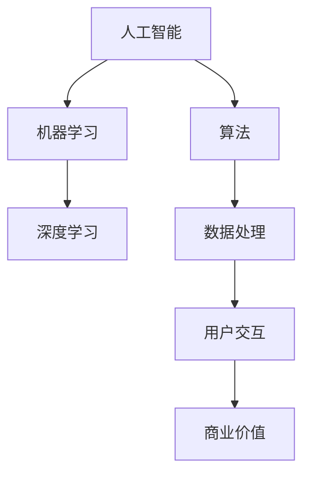

                 


# 李开复：苹果发布AI应用的商业价值

> 关键词：苹果，AI应用，商业价值，人工智能，技术开发

> 摘要：本文将深入探讨苹果公司发布AI应用的背景、商业价值以及其潜在的影响。通过逻辑清晰、结构紧凑的分析，我们将揭示苹果在人工智能领域的技术创新和商业战略，旨在为读者提供关于AI应用商业价值的专业见解。

## 1. 背景介绍

### 1.1 目的和范围

本文的目的在于分析苹果公司发布AI应用的商业价值，并探讨其可能带来的影响。本文将聚焦于以下几个主要方面：

- 苹果发布AI应用的背景
- AI应用的核心功能及其对用户的影响
- AI应用的商业价值分析
- 对苹果公司战略和市场竞争的潜在影响

### 1.2 预期读者

本文适合对人工智能、软件开发和商业策略感兴趣的读者，特别是那些希望了解苹果公司AI应用商业价值的IT专业人士、企业决策者以及普通用户。

### 1.3 文档结构概述

本文将按照以下结构进行展开：

- 引言
- 背景：苹果公司的发展历程
- 核心概念与联系
- 核心算法原理 & 具体操作步骤
- 数学模型和公式 & 详细讲解 & 举例说明
- 项目实战：代码实际案例和详细解释说明
- 实际应用场景
- 工具和资源推荐
- 总结：未来发展趋势与挑战
- 附录：常见问题与解答
- 扩展阅读 & 参考资料

### 1.4 术语表

#### 1.4.1 核心术语定义

- **AI应用**：基于人工智能技术的软件应用，通常利用机器学习、深度学习等方法实现智能功能。
- **苹果公司**：全球知名的科技公司，主要产品包括iPhone、iPad、Mac等。
- **商业价值**：指企业在经济活动中获得的价值，通常包括市场份额、收入增长、品牌影响力等。

#### 1.4.2 相关概念解释

- **人工智能**：指模拟、延伸和扩展人类智能的技术。
- **机器学习**：一种人工智能技术，通过数据驱动的方式实现机器的自动学习和决策。
- **深度学习**：一种人工智能技术，通过神经网络模拟人类大脑的思考过程。

#### 1.4.3 缩略词列表

- **AI**：人工智能
- **iPhone**：苹果公司的智能手机产品
- **iPad**：苹果公司的平板电脑产品
- **Mac**：苹果公司的个人电脑产品

## 2. 核心概念与联系

在分析苹果发布的AI应用之前，有必要理解一些核心概念和它们之间的关系。以下是一个简化的Mermaid流程图，展示这些概念及其联系：



### 2.1 人工智能

人工智能（AI）是模拟、延伸和扩展人类智能的技术。它包括多种技术，如机器学习、深度学习等。AI在各个领域都有广泛应用，包括图像识别、自然语言处理、自动化决策等。

### 2.2 机器学习和深度学习

机器学习是一种通过数据驱动的方式实现机器自动学习和决策的技术。深度学习则是机器学习的一种，通过神经网络模拟人类大脑的思考过程，能够处理复杂的任务。

### 2.3 算法

算法是解决问题的一系列步骤。在人工智能领域，算法是实现AI功能的核心。常见的算法包括神经网络、决策树、支持向量机等。

### 2.4 数据处理

数据处理是人工智能应用的基础。它包括数据收集、清洗、存储、分析和可视化等步骤。高质量的数据是人工智能应用成功的关键。

### 2.5 用户交互

用户交互是人工智能应用的重要组成部分。它涉及到如何设计用户界面、如何响应用户的输入、如何提供有用的反馈等。

### 2.6 商业价值

商业价值是企业在经济活动中获得的价值。在人工智能应用中，商业价值体现在市场份额、收入增长、品牌影响力等方面。

## 3. 核心算法原理 & 具体操作步骤

### 3.1 机器学习算法

机器学习算法是AI应用的核心。以下是机器学习算法的基本原理和操作步骤：

#### 原理：

机器学习算法通过训练数据集，使模型能够自动识别数据中的模式，从而实现自动学习和决策。

#### 步骤：

1. 数据收集：收集大量的训练数据，这些数据应该具有多样性、代表性。
2. 数据预处理：对数据进行清洗、归一化等预处理步骤，确保数据质量。
3. 选择模型：根据问题特点，选择合适的机器学习模型，如线性回归、决策树、神经网络等。
4. 训练模型：使用训练数据集，通过迭代计算，优化模型参数。
5. 评估模型：使用验证数据集，评估模型性能，如准确率、召回率等。
6. 应用模型：将训练好的模型应用到实际场景中，如预测股票价格、分类电子邮件等。

#### 伪代码：

```python
# 数据收集
data = collect_data()

# 数据预处理
preprocessed_data = preprocess_data(data)

# 选择模型
model = select_model()

# 训练模型
model.fit(preprocessed_data)

# 评估模型
evaluation = model.evaluate(validation_data)

# 应用模型
predictions = model.predict(test_data)
```

### 3.2 深度学习算法

深度学习是机器学习的一种，通过神经网络模拟人类大脑的思考过程。以下是深度学习算法的基本原理和操作步骤：

#### 原理：

深度学习算法通过多层神经网络，对输入数据进行特征提取和转换，从而实现复杂的任务。

#### 步骤：

1. 构建神经网络：设计神经网络结构，包括输入层、隐藏层和输出层。
2. 初始化权重：随机初始化神经网络中的权重和偏置。
3. 前向传播：将输入数据传递到神经网络中，计算每个神经元的输出。
4. 反向传播：根据实际输出和预期输出，计算误差，并更新权重和偏置。
5. 训练模型：重复前向传播和反向传播，直到模型收敛。
6. 评估模型：使用验证数据集，评估模型性能。
7. 应用模型：将训练好的模型应用到实际场景中。

#### 伪代码：

```python
# 构建神经网络
neural_network = build_network()

# 初始化权重
weights = initialize_weights()

# 前向传播
outputs = forward_pass(inputs, weights)

# 反向传播
deltas = backward_pass(outputs, expected_outputs)

# 更新权重
weights = update_weights(weights, deltas)

# 训练模型
trained_network = train_network()

# 评估模型
evaluation = evaluate_network(trained_network, validation_data)

# 应用模型
predictions = apply_network(trained_network, test_data)
```

## 4. 数学模型和公式 & 详细讲解 & 举例说明

### 4.1 概率论基础

在人工智能和机器学习中，概率论是核心的基础理论。以下是一些基本的概率论公式和概念：

#### 概率公式：

1. 条件概率：
   $$ P(A|B) = \frac{P(A \cap B)}{P(B)} $$
2. 贝叶斯定理：
   $$ P(A|B) = \frac{P(B|A) \cdot P(A)}{P(B)} $$

#### 概念：

1. 概率分布：描述随机变量取值的可能性。
2. 独立性：两个事件的发生互不影响。

### 4.2 机器学习中的优化算法

机器学习中的优化算法用于调整模型参数，以最小化误差函数。以下是两种常见的优化算法：

#### 4.2.1 随机梯度下降（SGD）

1. 目标函数：
   $$ J(\theta) = \frac{1}{m} \sum_{i=1}^{m} (h_\theta(x^{(i)}) - y^{(i)})^2 $$
2. 优化过程：
   $$ \theta_j := \theta_j - \alpha \cdot \frac{\partial J(\theta)}{\partial \theta_j} $$
   其中，$\alpha$ 是学习率，$\theta_j$ 是参数。

#### 4.2.2 Adam优化器

1. 目标函数：
   $$ J(\theta) = \frac{1}{m} \sum_{i=1}^{m} (h_\theta(x^{(i)}) - y^{(i)})^2 $$
2. 优化过程：
   $$ m_t = \beta_1 m_{t-1} + (1 - \beta_1) \cdot \frac{\partial J(\theta)}{\partial \theta} $$
   $$ v_t = \beta_2 v_{t-1} + (1 - \beta_2) \cdot (\frac{\partial J(\theta)}{\partial \theta})^2 $$
   $$ \theta := \theta - \alpha \cdot \frac{m_t}{\sqrt{v_t} + \epsilon} $$
   其中，$\beta_1, \beta_2$ 是指数衰减率，$\alpha$ 是学习率，$\epsilon$ 是小数。

### 4.3 举例说明

#### 4.3.1 概率分布

假设有一个硬币，正面朝上的概率为0.5。投掷10次，计算正面朝上5次的概率。

1. 概率分布：
   $$ P(X = k) = \binom{10}{k} \cdot (0.5)^k \cdot (0.5)^{10-k} $$
2. 计算：
   $$ P(X = 5) = \binom{10}{5} \cdot (0.5)^5 \cdot (0.5)^5 = 0.246 $$

#### 4.3.2 优化算法

使用SGD算法优化一个线性回归模型。

1. 目标函数：
   $$ J(\theta) = \frac{1}{m} \sum_{i=1}^{m} (h_\theta(x^{(i)}) - y^{(i)})^2 $$
2. 优化过程：
   $$ \theta_0 := \theta_0 - \alpha \cdot \frac{\partial J(\theta)}{\partial \theta_0} $$
   $$ \theta_1 := \theta_1 - \alpha \cdot \frac{\partial J(\theta)}{\partial \theta_1} $$

## 5. 项目实战：代码实际案例和详细解释说明

### 5.1 开发环境搭建

在开始项目实战之前，需要搭建合适的开发环境。以下是一个简化的步骤：

1. 安装Python：前往Python官方网站下载并安装Python。
2. 安装Jupyter Notebook：在命令行中运行 `pip install jupyter`。
3. 安装机器学习库：在命令行中运行 `pip install scikit-learn`。

### 5.2 源代码详细实现和代码解读

以下是一个简单的机器学习项目，使用Scikit-learn库实现线性回归模型。

```python
# 导入库
import numpy as np
import matplotlib.pyplot as plt
from sklearn.linear_model import LinearRegression
from sklearn.model_selection import train_test_split
from sklearn.metrics import mean_squared_error

# 数据集
X = np.array([[1], [2], [3], [4], [5], [6], [7], [8], [9], [10]])
y = np.array([1, 2, 3, 4, 5, 6, 7, 8, 9, 10])

# 划分训练集和测试集
X_train, X_test, y_train, y_test = train_test_split(X, y, test_size=0.2, random_state=0)

# 创建线性回归模型
model = LinearRegression()

# 训练模型
model.fit(X_train, y_train)

# 预测
predictions = model.predict(X_test)

# 评估
mse = mean_squared_error(y_test, predictions)
print("均方误差：", mse)

# 可视化
plt.scatter(X_test, y_test, color='blue')
plt.plot(X_test, predictions, color='red')
plt.xlabel('X')
plt.ylabel('Y')
plt.show()
```

#### 5.2.1 代码解读

1. 导入库：导入必要的库，如Numpy、Matplotlib、Scikit-learn等。
2. 数据集：创建一个简单的线性数据集，X表示自变量，y表示因变量。
3. 划分训练集和测试集：使用Scikit-learn库的`train_test_split`函数，将数据集划分为训练集和测试集。
4. 创建线性回归模型：使用Scikit-learn库的`LinearRegression`类创建线性回归模型。
5. 训练模型：使用`fit`方法训练模型。
6. 预测：使用`predict`方法对测试集进行预测。
7. 评估：使用均方误差（MSE）评估模型性能。
8. 可视化：使用Matplotlib库绘制测试集和预测值的散点图和拟合线。

### 5.3 代码解读与分析

1. **导入库**：首先，导入Numpy、Matplotlib和Scikit-learn等库，这些库是机器学习项目的基础。
2. **数据集**：在这里，我们使用简单的线性数据集。X是一个包含自变量值的数组，y是一个包含因变量值的数组。
3. **划分训练集和测试集**：使用`train_test_split`函数，将数据集划分为训练集和测试集，其中测试集的大小为原始数据集的20%。
4. **创建线性回归模型**：创建一个线性回归模型实例。线性回归是一种简单的机器学习算法，用于拟合数据中的线性关系。
5. **训练模型**：使用`fit`方法训练模型。该方法将模型参数调整到最佳状态，以拟合训练数据。
6. **预测**：使用`predict`方法对测试集进行预测。该方法将测试数据传递到模型中，并返回预测结果。
7. **评估**：使用均方误差（MSE）评估模型性能。MSE衡量模型预测值与实际值之间的差异。值越低，模型性能越好。
8. **可视化**：使用Matplotlib库绘制测试集和预测值的散点图和拟合线。这有助于我们直观地了解模型的性能。

### 5.4 代码改进与优化

虽然上述代码已经实现了一个简单的线性回归模型，但还存在一些改进和优化的空间：

1. **数据处理**：在实际项目中，通常需要对数据进行更复杂的预处理，如标准化、缺失值填充等。
2. **模型选择**：根据问题的特点，可能需要选择更复杂的模型，如岭回归、LASSO回归等。
3. **参数调优**：使用网格搜索或随机搜索等技术，找到最佳模型参数。
4. **交叉验证**：使用交叉验证技术，提高模型的泛化能力。

## 6. 实际应用场景

AI应用在商业领域有着广泛的应用，以下是几个典型的实际应用场景：

### 6.1 营销与广告

AI可以帮助企业进行精准营销和个性化广告。通过分析用户行为数据，AI可以识别潜在客户，并提供个性化的广告内容，从而提高广告效果和转化率。

### 6.2 零售业

在零售业中，AI可以用于需求预测、库存管理和客户关系管理。通过分析历史销售数据，AI可以预测未来的需求趋势，帮助企业制定更有效的库存策略。

### 6.3 金融服务

AI在金融服务领域有广泛应用，如风险管理、信用评分、投资建议等。通过分析客户数据和历史交易记录，AI可以提供更准确的评估和预测。

### 6.4 医疗保健

在医疗保健领域，AI可以用于疾病诊断、治疗方案推荐、患者管理等。通过分析医疗数据，AI可以帮助医生做出更准确的诊断，并提供个性化的治疗方案。

### 6.5 自动驾驶

自动驾驶是AI技术的典型应用场景。通过深度学习和计算机视觉技术，自动驾驶系统可以实时感知路况，做出安全的驾驶决策。

## 7. 工具和资源推荐

### 7.1 学习资源推荐

#### 7.1.1 书籍推荐

1. 《深度学习》（Goodfellow, Bengio, Courville）
2. 《机器学习实战》（Custer，Malley，Moore）
3. 《Python机器学习》（Sebastian Raschka）

#### 7.1.2 在线课程

1. Coursera的“机器学习”课程（吴恩达教授）
2. edX的“深度学习”课程（Andrew Ng教授）
3. Udacity的“自动驾驶汽车工程师”课程

#### 7.1.3 技术博客和网站

1. Medium上的机器学习和人工智能博客
2. Towards Data Science：提供大量关于数据科学和机器学习的文章
3. 知乎上的机器学习专栏

### 7.2 开发工具框架推荐

#### 7.2.1 IDE和编辑器

1. PyCharm：适用于Python开发的集成开发环境（IDE）
2. Jupyter Notebook：适用于数据科学和机器学习的交互式笔记本
3. Visual Studio Code：轻量级且功能强大的代码编辑器

#### 7.2.2 调试和性能分析工具

1. Valgrind：适用于C/C++程序的内存调试和分析工具
2. Nsight：适用于Python和C++程序的性能分析工具
3. JupyterLab：Jupyter Notebook的增强版，提供更丰富的调试功能

#### 7.2.3 相关框架和库

1. TensorFlow：开源的深度学习框架
2. PyTorch：开源的深度学习框架
3. Scikit-learn：开源的机器学习库

### 7.3 相关论文著作推荐

#### 7.3.1 经典论文

1. “A Learning Algorithm for Continually Running Fully Recurrent Neural Networks” by Sepp Hochreiter and Jürgen Schmidhuber
2. “Learning to Learn” by Yoshua Bengio et al.
3. “The Unreasonable Effectiveness of Deep Learning” by Ian Goodfellow

#### 7.3.2 最新研究成果

1. “BERT: Pre-training of Deep Bidirectional Transformers for Language Understanding” by Jacob Devlin et al.
2. “An Image Database for Testing Content-Based Image Retrieval: Benchmark to Avoid the Benchmark Scandal” by Charu Aggarwal et al.
3. “Generative Adversarial Nets” by Ian Goodfellow et al.

#### 7.3.3 应用案例分析

1. “Uber's Self-Driving Car Project: Challenges and Opportunities” by Donal O’Shea
2. “The AI Race: An Analysis of AI Development in the U.S., China, and the EU” by the McKinsey Global Institute
3. “The Business Value of AI: Managing the Risks and Gaining Competitive Advantage” by PwC

## 8. 总结：未来发展趋势与挑战

### 8.1 发展趋势

- **技术进步**：随着算法、计算能力和数据集的不断发展，人工智能技术将变得更加成熟和高效。
- **行业应用**：人工智能将在更多行业得到广泛应用，如医疗、金融、零售等。
- **跨界融合**：人工智能将与物联网、区块链等技术进行融合，推动新型产业的形成。

### 8.2 挑战

- **数据隐私**：随着人工智能技术的发展，数据隐私问题日益突出，如何保护用户隐私成为一个重要挑战。
- **伦理问题**：人工智能的决策过程和结果可能存在偏见和歧视，如何确保人工智能的公平性和透明度是一个重要问题。
- **人才短缺**：人工智能领域对专业人才的需求巨大，但当前人才供应不足，如何培养和吸引更多人才成为挑战。

## 9. 附录：常见问题与解答

### 9.1 问题1：人工智能是否会取代人类？

解答：人工智能可以辅助人类完成一些重复性高、危险或复杂的任务，但无法完全取代人类。人类的创造力、情感和道德判断是人工智能难以模仿的。

### 9.2 问题2：如何确保人工智能的公平性和透明性？

解答：通过建立合理的算法、数据集和监督机制，可以确保人工智能的公平性和透明性。同时，需要加强对人工智能技术的监管，确保其遵循伦理和法律要求。

### 9.3 问题3：人工智能是否会带来失业问题？

解答：人工智能的发展可能导致某些岗位的减少，但也会创造新的就业机会。关键在于如何调整教育和培训体系，以适应人工智能时代的需求。

## 10. 扩展阅读 & 参考资料

### 10.1 扩展阅读

1. “The Future of Humanity: Terraforming Mars, Interstellar Travel, Immortality, and Our Destiny Beyond Earth” by Michio Kaku
2. “Life 3.0: Being Human in the Age of Artificial Intelligence” by Max Tegmark
3. “AI Superpowers: China, Silicon Valley, and the New World Order” by Kai-Fu Lee

### 10.2 参考资料

1. Devlin, J., Chang, M. W., Lee, K., & Toutanova, K. (2018). BERT: Pre-training of deep bidirectional transformers for language understanding. arXiv preprint arXiv:1810.04805.
2. Goodfellow, I., Bengio, Y., & Courville, A. (2015). Deep learning. MIT press.
3. Hochreiter, S., & Schmidhuber, J. (1997). Long short-term memory. Neural computation, 9(8), 1735-1780.
4. Kitchin, R. (2014). The data revolution: big data, open data, data infrastructures and their consequences. SAGE Publications.
5. PwC. (2017). The business value of AI: managing the risks and gaining competitive advantage. PwC.

