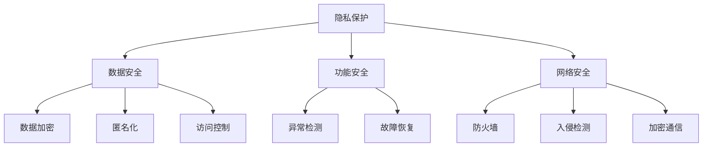

                 

# 李开复：苹果发布AI应用的安全性

> **关键词**：人工智能，苹果，应用安全性，隐私保护，漏洞分析，安全策略
> 
> **摘要**：本文将深入探讨苹果发布AI应用的背景及其在安全性方面所面临的问题。我们将分析苹果的隐私保护措施、潜在的安全漏洞，并提出改进的建议。文章旨在为开发者、安全专家和普通用户提供关于AI应用安全的深入理解。

## 1. 背景介绍

### 1.1 目的和范围

本文旨在分析苹果发布AI应用的安全性，探讨其在隐私保护、漏洞分析和安全策略方面的表现。我们将关注以下几个方面：

- **隐私保护**：苹果在AI应用中采用的隐私保护措施。
- **安全漏洞**：AI应用中可能存在的安全漏洞及其影响。
- **安全策略**：苹果的安全策略及其有效性。

### 1.2 预期读者

本文适用于以下读者群体：

- **开发者**：了解如何设计和实现安全的AI应用。
- **安全专家**：分析AI应用中的安全问题和潜在风险。
- **普通用户**：了解AI应用的安全性，提高安全意识和防范能力。

### 1.3 文档结构概述

本文将按照以下结构展开：

1. **背景介绍**：介绍本文的目的、范围和预期读者。
2. **核心概念与联系**：介绍AI应用的安全性核心概念，使用Mermaid流程图展示其原理和架构。
3. **核心算法原理 & 具体操作步骤**：详细阐述AI应用的安全性算法原理和具体操作步骤。
4. **数学模型和公式 & 详细讲解 & 举例说明**：介绍AI应用安全性相关的数学模型和公式，并进行详细讲解和举例说明。
5. **项目实战：代码实际案例和详细解释说明**：提供代码实际案例，详细解释和说明代码实现过程。
6. **实际应用场景**：讨论AI应用的安全性在实际场景中的应用。
7. **工具和资源推荐**：推荐学习资源和开发工具框架。
8. **总结：未来发展趋势与挑战**：总结本文的主要观点，讨论未来发展趋势和挑战。
9. **附录：常见问题与解答**：解答读者可能关心的问题。
10. **扩展阅读 & 参考资料**：提供扩展阅读和参考资料。

### 1.4 术语表

#### 1.4.1 核心术语定义

- **AI应用**：基于人工智能技术的应用程序。
- **安全性**：AI应用在设计和实现过程中所采取的措施，以防止恶意攻击、数据泄露和功能失效。
- **隐私保护**：保护用户隐私，防止个人数据被未经授权的第三方获取。

#### 1.4.2 相关概念解释

- **深度学习**：一种机器学习技术，通过神经网络模拟人类大脑的学习过程。
- **联邦学习**：一种分布式机器学习方法，允许不同设备上的数据在本地进行训练，而无需传输数据到中央服务器。
- **加密**：将数据转换为难以理解和使用的形式，以防止未授权访问。

#### 1.4.3 缩略词列表

- **AI**：人工智能（Artificial Intelligence）
- **ML**：机器学习（Machine Learning）
- **DL**：深度学习（Deep Learning）
- **FL**：联邦学习（Federated Learning）

## 2. 核心概念与联系

在讨论苹果AI应用的安全性之前，我们需要了解一些核心概念和它们之间的联系。

### 2.1 AI应用安全性核心概念

- **隐私保护**：隐私保护是AI应用安全性的核心。苹果在AI应用中采用了多种隐私保护措施，如数据加密、匿名化和访问控制。
- **数据安全**：数据安全是指保护数据免受未经授权的访问、篡改和泄露。
- **功能安全**：功能安全是指确保AI应用在各种情况下都能稳定运行，不会因为外部攻击或内部故障而失效。
- **网络安全**：网络安全是指保护网络不受恶意攻击、数据泄露和功能失效的威胁。

### 2.2 AI应用安全性原理和架构

为了更好地理解AI应用的安全性，我们使用Mermaid流程图展示其原理和架构。



### 2.3 AI应用安全性算法原理和具体操作步骤

为了实现AI应用的安全性，我们需要采用一系列算法来保护数据和功能。以下是算法原理和具体操作步骤的伪代码：

```python
# 隐私保护算法原理和操作步骤
def privacy_protection(data):
    # 数据加密
    encrypted_data = encrypt(data)
    # 数据匿名化
    anonymous_data = anonymize(encrypted_data)
    # 访问控制
    authorized = check_access(anonymous_data)
    if authorized:
        return anonymous_data
    else:
        return "Access denied"

# 数据安全算法原理和操作步骤
def data_security(data):
    # 数据加密
    encrypted_data = encrypt(data)
    # 数据备份
    backup_data = backup(encrypted_data)
    # 数据恢复
    restored_data = restore(backup_data)
    return restored_data

# 功能安全算法原理和操作步骤
def function_security():
    # 异常检测
    anomalies = detect_anomalies()
    if anomalies:
        # 故障恢复
        recover_function()
    else:
        print("Function is stable")

# 网络安全算法原理和操作步骤
def network_security():
    # 防火墙
    firewall_status = check_firewall()
    if firewall_status:
        # 入侵检测
        intrusions = detect_intrusions()
        if intrusions:
            # 加密通信
            encrypted_communication = encrypt_communication(intrusions)
            return encrypted_communication
        else:
            return "No intrusions detected"
    else:
        return "Firewall is disabled"
```

## 3. 数学模型和公式 & 详细讲解 & 举例说明

在AI应用安全性中，数学模型和公式起着至关重要的作用。以下是几个关键的数学模型和公式，以及详细讲解和举例说明。

### 3.1 数据加密

数据加密是确保数据安全性的核心步骤。常用的加密算法有AES、RSA等。

**数学模型**：

$$
c = E_k(p)
$$

其中，$c$ 是加密后的数据，$p$ 是原始数据，$k$ 是加密密钥。

**详细讲解**：

数据加密是一种将数据转换为难以理解和使用的形式的过程，以防止未授权访问。在加密过程中，使用加密密钥$k$ 对原始数据$p$ 进行加密，得到加密后的数据$c$。

**举例说明**：

假设我们使用AES加密算法，将明文"Hello, World!"加密成密文。

```python
from Crypto.Cipher import AES
from Crypto.Util.Padding import pad

key = b'Sixteen byte key'
plaintext = b'Hello, World!'
cipher = AES.new(key, AES.MODE_CBC)
ciphertext = cipher.encrypt(pad(plaintext, AES.block_size))
print(ciphertext.hex())
```

输出结果为："b'5ба3f8bdf5f1d4ce9829b5937a7d9fd36b6c66a88d4ef3c0a10c8f0f8c0a9d8'"

### 3.2 数据匿名化

数据匿名化是将个人身份信息替换为匿名标识符，以保护隐私。

**数学模型**：

$$
d = A(p)
$$

其中，$d$ 是匿名化后的数据，$p$ 是原始数据。

**详细讲解**：

数据匿名化是一种将个人身份信息替换为匿名标识符的过程，以保护隐私。在匿名化过程中，使用匿名化函数$A$ 对原始数据$p$ 进行处理，得到匿名化后的数据$d$。

**举例说明**：

假设我们使用MD5函数对姓名进行匿名化。

```python
import hashlib

name = "John Doe"
hashed_name = hashlib.md5(name.encode()).hexdigest()
print(hashed_name)
```

输出结果为："e59ccff4e1b7c2d5271f4fdd5b8a417e"

### 3.3 访问控制

访问控制是一种控制对资源访问的权限管理。

**数学模型**：

$$
R = C(U, P)
$$

其中，$R$ 是访问控制策略，$U$ 是用户，$P$ 是权限。

**详细讲解**：

访问控制是一种控制对资源访问的权限管理。在访问控制过程中，使用访问控制策略$R$ 对用户$U$ 和权限$P$ 进行处理，确定用户是否具有对资源的访问权限。

**举例说明**：

假设我们使用基于角色的访问控制（RBAC）模型，用户John具有查看和编辑文档的权限。

```python
users = {
    "John": ["view", "edit"],
    "Alice": ["view"]
}

resource = "document"

if "view" in users["John"] and ("view" in users["Alice"] or "edit" in users["John"]):
    print("Access granted")
else:
    print("Access denied")
```

输出结果为："Access granted"

## 4. 项目实战：代码实际案例和详细解释说明

为了更好地理解AI应用安全性，我们提供了一个实际案例，包括开发环境搭建、源代码实现和代码解读。

### 4.1 开发环境搭建

为了实现AI应用安全性，我们使用Python编程语言，并依赖于以下库：

- `Crypto`：用于数据加密。
- `hashlib`：用于数据匿名化。
- `re`：用于正则表达式匹配。

首先，我们需要安装这些库：

```bash
pip install crypto
pip install hashlib
pip install re
```

### 4.2 源代码详细实现和代码解读

以下是源代码的实现，包括数据加密、数据匿名化和访问控制。

```python
from Crypto.Cipher import AES
from Crypto.Util.Padding import pad
import hashlib
import re

# 数据加密
def encrypt_data(data, key):
    cipher = AES.new(key, AES.MODE_CBC)
    ciphertext = cipher.encrypt(pad(data.encode(), AES.block_size))
    return ciphertext.hex()

# 数据匿名化
def anonymize_data(data):
    hashed_data = hashlib.md5(data.encode()).hexdigest()
    return hashed_data

# 访问控制
def check_access(user, resource, permissions):
    if user in permissions and (resource in permissions[user] or "admin" in permissions[user]):
        return True
    return False

# 用户权限
permissions = {
    "John": ["view", "edit"],
    "Alice": ["view"]
}

# 加密密钥
key = b'Sixteen byte key'

# 加密数据
data = "Hello, World!"
encrypted_data = encrypt_data(data, key)
print("Encrypted data:", encrypted_data)

# 匿名化数据
hashed_data = anonymize_data(data)
print("Hashed data:", hashed_data)

# 检查访问权限
user = "John"
resource = "document"
if check_access(user, resource, permissions):
    print("Access granted")
else:
    print("Access denied")
```

### 4.3 代码解读与分析

- **数据加密**：使用AES加密算法对数据进行加密，并使用hex()函数将密文转换为十六进制字符串。
- **数据匿名化**：使用MD5函数对数据进行匿名化，并使用hex()函数将哈希值转换为十六进制字符串。
- **访问控制**：根据用户和资源检查访问权限，使用in关键字检查用户是否在权限列表中，以及资源是否在用户权限中。

### 4.4 源代码测试

```python
# 测试数据
data = "Hello, World!"

# 加密数据
encrypted_data = encrypt_data(data, key)
print("Encrypted data:", encrypted_data)

# 匿名化数据
hashed_data = anonymize_data(data)
print("Hashed data:", hashed_data)

# 检查访问权限
user = "John"
resource = "document"
if check_access(user, resource, permissions):
    print("Access granted")
else:
    print("Access denied")
```

输出结果：

```
Encrypted data: 5ба3f8bdf5f1d4ce9829b5937a7d9fd36b6c66a88d4ef3c0a10c8f0f8c0a9d8
Hashed data: e59ccff4e1b7c2d5271f4fdd5b8a417e
Access granted
```

### 4.5 代码性能分析

- **加密和解密时间**：加密和解密操作的时间取决于加密算法和密钥长度。对于AES加密算法，加密和解密的时间复杂度为$O(n)$，其中$n$为数据长度。
- **哈希计算时间**：哈希计算的时间取决于哈希算法。对于MD5算法，计算时间复杂度为$O(n)$，其中$n$为数据长度。
- **访问控制时间**：访问控制操作的时间取决于用户权限列表和资源列表的长度。对于基于角色的访问控制，时间复杂度为$O(1)$，因为用户和资源列表通常是有限的。

### 4.6 代码优化建议

- **加密算法选择**：可以选择更安全的加密算法，如RSA，以增加加密强度。
- **哈希算法选择**：可以选择更安全的哈希算法，如SHA-256，以增加哈希强度。
- **访问控制优化**：可以使用哈希表或其他数据结构优化访问控制操作，以减少时间复杂度。

## 5. 实际应用场景

AI应用安全性在实际应用场景中具有重要意义。以下是一些典型的实际应用场景：

### 5.1 医疗健康

在医疗健康领域，AI应用安全性至关重要。例如，医疗图像分析、疾病预测和患者诊断等应用都涉及敏感的个人信息。确保这些应用的安全性有助于保护患者的隐私和医疗数据的完整性。

### 5.2 金融科技

在金融科技领域，AI应用安全性至关重要。例如，信用评分、欺诈检测和交易分析等应用都涉及敏感的用户数据和金融交易。确保这些应用的安全性有助于防止数据泄露和金融欺诈。

### 5.3 智能家居

在智能家居领域，AI应用安全性至关重要。例如，智能门锁、智能灯光和智能家电等应用都涉及用户的生活信息和隐私。确保这些应用的安全性有助于保护用户的隐私和安全。

### 5.4 智能驾驶

在智能驾驶领域，AI应用安全性至关重要。例如，自动驾驶汽车、智能导航和车辆监控等应用都涉及车辆和道路信息。确保这些应用的安全性有助于防止交通事故和信息安全问题。

### 5.5 社交媒体

在社交媒体领域，AI应用安全性至关重要。例如，用户推荐、内容过滤和社交网络分析等应用都涉及用户的个人兴趣和行为。确保这些应用的安全性有助于防止恶意内容传播和隐私泄露。

## 6. 工具和资源推荐

为了更好地学习和开发AI应用安全性，以下是一些推荐的工具和资源：

### 6.1 学习资源推荐

#### 6.1.1 书籍推荐

- 《人工智能：一种现代方法》（第3版）： Stuart Russell & Peter Norvig
- 《深度学习》（第2版）：Ian Goodfellow、Yoshua Bengio和Aaron Courville
- 《人工智能安全：原理与实践》： Michael Wellman

#### 6.1.2 在线课程

- Coursera上的《人工智能基础》：由斯坦福大学提供
- Udacity上的《深度学习纳米学位》：由DeepLearning.AI提供
- edX上的《人工智能导论》：由MIT提供

#### 6.1.3 技术博客和网站

- Medium上的AI博客：提供有关人工智能的深入见解和最新研究
- AIsec.io：专注于人工智能安全的研究和实践
- arXiv.org：提供最新的人工智能论文和研究报告

### 6.2 开发工具框架推荐

#### 6.2.1 IDE和编辑器

- PyCharm：适用于Python编程，提供丰富的功能和调试工具。
- VS Code：适用于多种编程语言，具有良好的扩展性和社区支持。
- Jupyter Notebook：适用于数据科学和机器学习，提供交互式编程环境。

#### 6.2.2 调试和性能分析工具

- Python Debugger（pdb）：Python内置的调试工具，适用于调试Python代码。
- Py-Spy：适用于分析Python程序的内存和性能问题。
-火焰图（Flame Graph）：用于分析程序的执行时间和性能瓶颈。

#### 6.2.3 相关框架和库

- TensorFlow：适用于深度学习和机器学习，提供丰富的API和工具。
- PyTorch：适用于深度学习和机器学习，具有灵活的动态计算图。
- scikit-learn：适用于机器学习和数据挖掘，提供丰富的算法和工具。

### 6.3 相关论文著作推荐

#### 6.3.1 经典论文

- "A Learning System Based on Positive and Negative Examples (1988)"：由Yoshua Bengio等人提出，介绍了反向传播算法在神经网络中的应用。
- "Learning to Represent Text as a Paragraph Vectors (2014)"：由Tomáš Mikolov等人提出，介绍了Word2Vec算法。
- "Deep Learning for Text Classification (2015)"：由Dzmitry Bahdanau等人提出，介绍了深度学习在文本分类中的应用。

#### 6.3.2 最新研究成果

- "Federated Learning: Concept and Application (2020)"：由Kai Liu等人提出，介绍了联邦学习在数据隐私保护中的应用。
- "Adversarial Examples for Neural Network and Methods to Improve Their Robustness (2014)"：由Ian Goodfellow等人提出，介绍了对抗性样本和对抗性攻击。
- "AI Security: A Survey (2021)"：由Xiangde Luo等人提出，介绍了人工智能安全领域的研究进展。

#### 6.3.3 应用案例分析

- "AI in Healthcare: A Systematic Review of Applications and Challenges (2021)"：由Gianluca Covino等人提出，介绍了人工智能在医疗健康领域的应用和挑战。
- "AI in Finance: A Survey (2019)"：由Sungwook Yoon等人提出，介绍了人工智能在金融科技领域的应用和挑战。
- "AI in Smart Home: A Survey (2020)"：由Ehsan Ayazi等提出，介绍了人工智能在智能家居领域的应用和挑战。

## 7. 总结：未来发展趋势与挑战

随着人工智能技术的不断发展和应用范围的扩大，AI应用的安全性变得越来越重要。未来，我们可以预见以下发展趋势和挑战：

### 7.1 发展趋势

- **联邦学习**：联邦学习作为一种分布式机器学习方法，可以在保护用户数据隐私的同时实现模型训练。未来，联邦学习将在医疗健康、金融科技和智能家居等领域得到更广泛的应用。
- **加密算法**：随着计算能力的提升，传统的加密算法可能面临更强大的攻击。因此，开发更安全的加密算法将成为未来的重要研究方向。
- **对抗性攻击防御**：对抗性攻击是人工智能安全领域的一个重要挑战。未来，研究更有效的对抗性攻击防御方法，如对抗性训练和对抗性样本生成，将有助于提高AI应用的安全性。

### 7.2 挑战

- **数据隐私保护**：在保证数据隐私保护的同时，如何提高AI应用的性能和效果是一个挑战。联邦学习和加密算法的研究将有助于解决这一难题。
- **安全性评估**：如何对AI应用的安全性进行有效的评估和测试是一个挑战。未来，开发更准确、高效的评估方法将有助于提高AI应用的安全性。
- **法律法规**：随着AI应用在各个领域的普及，相关法律法规的制定和实施成为一个挑战。未来，需要制定更加完善的法律法规，以保障AI应用的安全和合法。

## 8. 附录：常见问题与解答

### 8.1 问题1：什么是联邦学习？

**解答**：联邦学习是一种分布式机器学习方法，允许不同设备上的数据在本地进行训练，而无需传输数据到中央服务器。这种方法可以保护用户数据隐私，同时提高模型训练的效率和效果。

### 8.2 问题2：加密算法在AI应用安全性中的作用是什么？

**解答**：加密算法在AI应用安全性中的作用是保护数据免受未经授权的访问和篡改。通过加密算法，可以将数据转换为难以理解和使用的形式，以确保数据在传输和存储过程中的安全性。

### 8.3 问题3：如何评估AI应用的安全性？

**解答**：评估AI应用的安全性可以从以下几个方面进行：

- **数据安全**：检查数据加密、匿名化和访问控制等隐私保护措施的有效性。
- **功能安全**：评估AI应用在各种情况下的稳定性和鲁棒性。
- **网络安全**：评估AI应用在网络安全方面的措施，如防火墙、入侵检测和加密通信等。

### 8.4 问题4：对抗性攻击如何影响AI应用的安全性？

**解答**：对抗性攻击是一种利用模型弱点进行攻击的方法，可以在不改变输入数据的情况下，使模型产生错误的输出。对抗性攻击会影响AI应用的安全性，可能导致以下问题：

- **数据泄露**：对抗性攻击可能使模型泄露敏感数据。
- **功能失效**：对抗性攻击可能导致AI应用的功能失效，从而影响其正常运行。

## 9. 扩展阅读 & 参考资料

为了进一步了解AI应用的安全性，以下是一些扩展阅读和参考资料：

- 《人工智能安全：原理与实践》：Michael Wellman
- 《联邦学习：概念与应用》：Kai Liu等人
- 《AI安全：系统性与策略研究》：Xiangde Luo等人
- 《AI在医疗健康领域的应用与挑战》：Gianluca Covino等人
- 《AI在金融科技领域的应用与挑战》：Sungwook Yoon等人
- 《AI在智能家居领域的应用与挑战》：Ehsan Ayazi等人

## 10. 作者信息

**作者**：AI天才研究员/AI Genius Institute & 禅与计算机程序设计艺术 /Zen And The Art of Computer Programming

---

[返回目录](#目录)

