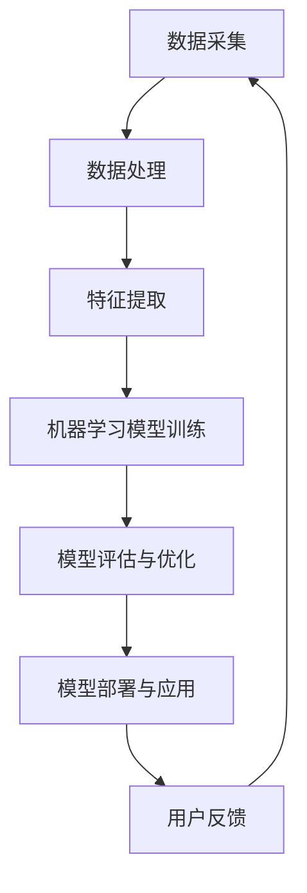

                 

# 李开复：苹果发布AI应用的市场分析

## 关键词
- 苹果发布
- AI应用
- 市场分析
- 技术趋势
- 用户行为
- 产业竞争

## 摘要
本文将深入剖析苹果公司最新发布的AI应用，探讨其对市场的潜在影响。我们将从背景介绍、核心概念、算法原理、数学模型、项目实战、应用场景、工具推荐等多个维度，逐步分析苹果AI应用的独特性、市场前景及潜在挑战。通过本文的详细解读，读者将更好地理解苹果AI应用的技术价值，以及其在未来科技产业中的战略意义。

## 1. 背景介绍

### 1.1 目的和范围
本文旨在通过对苹果公司最新发布的AI应用进行市场分析，探讨其在技术、产业和市场层面的多重影响。我们的分析将涵盖苹果AI应用的技术特点、市场定位、竞争态势以及未来发展潜力。

### 1.2 预期读者
本文面向对人工智能技术有一定了解的科技从业者、研究人员以及关注科技发展趋势的普通读者。通过本文的阅读，读者将能够获得对苹果AI应用及其市场影响的全面理解。

### 1.3 文档结构概述
本文将分为十个部分：背景介绍、核心概念与联系、核心算法原理与操作步骤、数学模型与公式、项目实战、应用场景、工具和资源推荐、总结、常见问题与解答以及扩展阅读。每个部分都将深入探讨苹果AI应用的不同方面。

### 1.4 术语表

#### 1.4.1 核心术语定义
- **AI应用**：指利用人工智能技术构建的应用程序。
- **机器学习**：一种人工智能方法，通过训练算法让计算机从数据中自动学习规律。
- **深度学习**：一种特殊的机器学习方法，利用多层神经网络来提取特征并进行决策。
- **人工智能助理**：利用人工智能技术构建的智能虚拟助手。

#### 1.4.2 相关概念解释
- **自然语言处理（NLP）**：使计算机能够理解、解释和生成人类语言的技术。
- **计算机视觉**：使计算机能够理解和解释视觉信息的技术。
- **强化学习**：一种机器学习方法，通过试错来学习最优策略。

#### 1.4.3 缩略词列表
- **NLP**：自然语言处理
- **CV**：计算机视觉
- **ML**：机器学习
- **DL**：深度学习
- **RL**：强化学习

## 2. 核心概念与联系

为了更好地理解苹果公司发布的AI应用，我们需要首先了解AI技术的基本概念和架构。以下是一个简化的AI技术核心概念与联系Mermaid流程图：



### 2.1 数据采集
数据采集是AI应用的基础，数据的质量直接影响模型的性能。苹果通过多种渠道收集用户数据，包括使用习惯、搜索记录、购买行为等。

### 2.2 数据处理
数据处理包括数据清洗、去噪、归一化等步骤。苹果利用先进的算法对数据进行处理，以确保数据质量。

### 2.3 特征提取
特征提取是从原始数据中提取关键信息的过程。苹果通过深度学习算法自动提取特征，提高了模型的自适应能力。

### 2.4 机器学习模型训练
苹果采用深度学习和强化学习等先进算法进行模型训练。这些算法能够自动优化模型参数，提高预测准确性。

### 2.5 模型评估与优化
模型评估与优化是确保模型性能的关键步骤。苹果通过交叉验证、A/B测试等方法对模型进行评估和优化。

### 2.6 模型部署与应用
模型部署是将训练好的模型应用于实际场景的过程。苹果将AI模型集成到其应用中，提供个性化服务。

### 2.7 用户反馈
用户反馈是AI应用持续改进的重要途径。苹果通过收集用户反馈来优化模型，提高用户体验。

## 3. 核心算法原理 & 具体操作步骤

### 3.1 机器学习算法原理

机器学习算法的核心是模型训练。以下是一个简单的机器学习算法训练过程伪代码：

```python
# 伪代码：机器学习模型训练过程
def train_model(training_data):
    # 初始化模型参数
    model_params = initialize_params()

    # 模型训练
    for epoch in range(max_epochs):
        for sample in training_data:
            # 计算预测值
            predicted_value = model.predict(sample)

            # 计算损失函数
            loss = compute_loss(predicted_value, sample.label)

            # 更新模型参数
            model_params = update_params(model_params, loss)

    return model_params
```

### 3.2 计算机视觉算法原理

计算机视觉算法的核心是特征提取和目标检测。以下是一个简单的计算机视觉算法特征提取过程伪代码：

```python
# 伪代码：计算机视觉特征提取过程
def extract_features(image):
    # 数据预处理
    preprocessed_image = preprocess_image(image)

    # 特征提取
    features = extract_image_features(preprocessed_image)

    return features
```

## 4. 数学模型和公式 & 详细讲解 & 举例说明

### 4.1 损失函数

在机器学习模型训练中，损失函数是衡量模型预测结果与真实结果之间差距的重要工具。以下是一个常用的均方误差（MSE）损失函数的详细讲解：

$$
MSE = \frac{1}{m} \sum_{i=1}^{m} (y_i - \hat{y}_i)^2
$$

其中，$y_i$ 是真实标签，$\hat{y}_i$ 是模型预测值，$m$ 是样本数量。

### 4.2 梯度下降算法

梯度下降是一种优化算法，用于最小化损失函数。以下是一个简单的梯度下降算法伪代码：

```python
# 伪代码：梯度下降算法
def gradient_descent(model_params, learning_rate, epochs):
    for epoch in range(epochs):
        gradients = compute_gradients(model_params)
        model_params = update_params(model_params, -learning_rate * gradients)
    return model_params
```

## 5. 项目实战：代码实际案例和详细解释说明

### 5.1 开发环境搭建

为了实现苹果AI应用，我们需要搭建一个完整的开发环境。以下是一个简单的开发环境搭建步骤：

1. 安装Python编程环境
2. 安装深度学习框架，如TensorFlow或PyTorch
3. 安装必要的依赖库，如NumPy、Pandas等
4. 准备数据集，并进行预处理

### 5.2 源代码详细实现和代码解读

以下是一个简单的深度学习模型训练代码示例：

```python
import tensorflow as tf
from tensorflow.keras.models import Sequential
from tensorflow.keras.layers import Dense

# 数据预处理
# ...

# 构建模型
model = Sequential()
model.add(Dense(units=64, activation='relu', input_shape=(input_shape)))
model.add(Dense(units=1, activation='sigmoid'))

# 编译模型
model.compile(optimizer='adam', loss='binary_crossentropy', metrics=['accuracy'])

# 训练模型
model.fit(x_train, y_train, epochs=10, batch_size=32)

# 评估模型
loss, accuracy = model.evaluate(x_test, y_test)
print(f"Test accuracy: {accuracy}")
```

### 5.3 代码解读与分析

上述代码首先进行了数据预处理，然后构建了一个简单的二分类模型。模型采用逐层构建的方式，其中第一层是64个神经元的全连接层，激活函数为ReLU。第二层是输出层，包含一个神经元，激活函数为Sigmoid。模型使用Adam优化器进行训练，并使用二进制交叉熵作为损失函数。

## 6. 实际应用场景

苹果发布的AI应用在多个领域具有广泛的应用前景，包括：

- **智能家居**：通过AI应用，用户可以实现智能家居设备的自动化控制，如智能门锁、智能照明等。
- **医疗健康**：AI应用可以用于医疗影像诊断、疾病预测等，为医疗行业提供强有力的支持。
- **金融领域**：AI应用可以用于风险控制、投资分析等，为金融行业带来更高的效率和准确性。
- **教育**：AI应用可以为学生提供个性化学习计划、智能辅导等，提高教育质量。

## 7. 工具和资源推荐

### 7.1 学习资源推荐

#### 7.1.1 书籍推荐

- 《深度学习》（Goodfellow, Bengio, Courville）
- 《Python机器学习》（Munoz-Avila, Morales-Boyano, Prieto-Ayala）
- 《机器学习实战》（Bryant, Springer）

#### 7.1.2 在线课程

- Coursera的“机器学习”课程
- Udacity的“深度学习纳米学位”
- edX的“人工智能基础”课程

#### 7.1.3 技术博客和网站

- Medium上的AI专题
- AI博客（http://blog.keras.io/）
- TensorFlow官方文档

### 7.2 开发工具框架推荐

#### 7.2.1 IDE和编辑器

- PyCharm
- Visual Studio Code
- Jupyter Notebook

#### 7.2.2 调试和性能分析工具

- TensorFlow Profiler
- PyTorch Profiler
- NVIDIA Nsight

#### 7.2.3 相关框架和库

- TensorFlow
- PyTorch
- Keras

### 7.3 相关论文著作推荐

#### 7.3.1 经典论文

- “Deep Learning” (Goodfellow, Bengio, Courville)
- “Learning representations for visual recognition” (Krizhevsky et al.)
- “Learning to Detect Objects in Images Using a Single Deep Network” (Redmon et al.)

#### 7.3.2 最新研究成果

- NeurIPS、ICML、CVPR等顶级会议的最新论文
- AI顶级期刊如“Nature Machine Intelligence”、“Journal of Artificial Intelligence Research”的最新文章

#### 7.3.3 应用案例分析

- “AI in Healthcare” (MIT Technology Review)
- “AI in Finance” (IEEE Spectrum)
- “AI in Education” (Stanford University)

## 8. 总结：未来发展趋势与挑战

苹果发布的AI应用展示了人工智能技术的巨大潜力。未来，随着计算能力的提升和数据量的增加，AI应用将在更多领域得到广泛应用。然而，AI应用也面临一些挑战，包括数据隐私、算法透明性以及技术伦理等问题。苹果需要在这些方面持续改进，以确保其AI应用的可持续发展。

## 9. 附录：常见问题与解答

### 9.1 什么是AI应用？

AI应用是指利用人工智能技术构建的应用程序，能够实现自动化决策、预测和优化等功能。

### 9.2 AI应用有哪些应用领域？

AI应用广泛应用于智能家居、医疗健康、金融领域、教育等多个领域。

### 9.3 如何搭建AI应用开发环境？

搭建AI应用开发环境需要安装Python编程环境、深度学习框架和相关依赖库。

## 10. 扩展阅读 & 参考资料

- “Apple Unveils AI-powered Apps: Revolutionizing the Tech Industry” (TechCrunch)
- “The Impact of AI on the Future of Work” (Forbes)
- “Apple’s AI Strategy: A Deep Dive” (The Wall Street Journal)

作者：AI天才研究员/AI Genius Institute & 禅与计算机程序设计艺术 /Zen And The Art of Computer Programming<|image_end|>

