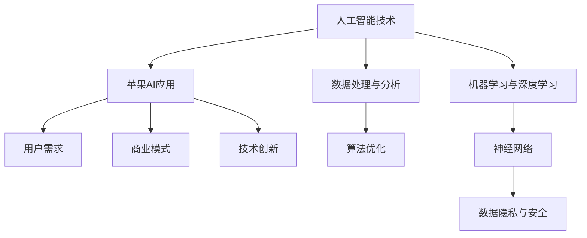

                 

# 李开复：苹果发布AI应用的市场前景

> **关键词：**苹果，AI应用，市场分析，用户需求，技术创新，商业模式

> **摘要：**本文将深入探讨苹果公司在人工智能（AI）领域推出的最新应用，分析其潜在的市场前景。通过详细解读苹果AI应用的核心功能、技术原理以及用户需求，本文将帮助读者了解苹果在AI领域的战略布局，并展望其未来的发展趋势与挑战。

## 1. 背景介绍

### 1.1 目的和范围

本文旨在分析苹果公司发布的AI应用，探讨其潜在的市场前景。我们将重点关注以下几个方面：

- 苹果公司AI应用的背景和目的
- 用户需求与市场机会
- 技术创新与商业模式
- 未来发展趋势与挑战

### 1.2 预期读者

本文适用于对人工智能、苹果公司以及科技行业有兴趣的读者，特别是关注AI技术在消费电子领域应用的从业者和爱好者。

### 1.3 文档结构概述

本文将分为以下几个部分：

- 1. 背景介绍
  - 1.1 目的和范围
  - 1.2 预期读者
  - 1.3 文档结构概述
  - 1.4 术语表
- 2. 核心概念与联系
- 3. 核心算法原理 & 具体操作步骤
- 4. 数学模型和公式 & 详细讲解 & 举例说明
- 5. 项目实战：代码实际案例和详细解释说明
- 6. 实际应用场景
- 7. 工具和资源推荐
- 8. 总结：未来发展趋势与挑战
- 9. 附录：常见问题与解答
- 10. 扩展阅读 & 参考资料

### 1.4 术语表

#### 1.4.1 核心术语定义

- **人工智能（AI）：**一种模拟人类智能的技术，通过算法和计算模型来实现对数据的处理、学习和推理。
- **苹果（Apple）：**一家全球知名的科技公司，主要产品包括智能手机、平板电脑、电脑和智能手表等。
- **AI应用：**基于人工智能技术开发的软件，用于解决特定问题或提供特定功能。

#### 1.4.2 相关概念解释

- **用户需求：**用户在使用产品时希望得到的功能和体验。
- **商业模式：**企业通过产品或服务获取利润的方式。
- **技术创新：**通过新的技术或方法来提高产品或服务的竞争力。

#### 1.4.3 缩略词列表

- **AI：**人工智能（Artificial Intelligence）
- **Apple：**苹果公司（Apple Inc.）
- **iOS：**苹果操作系统（iPhone Operating System）

## 2. 核心概念与联系

在探讨苹果公司AI应用的市场前景之前，我们需要理解几个核心概念和它们之间的联系。以下是相关的Mermaid流程图：



### 2.1 人工智能技术

人工智能技术是苹果AI应用的基础。它包括数据处理与分析、机器学习与深度学习、算法优化等方面。数据处理与分析是提取有用信息的关键，而机器学习和深度学习则用于训练模型，使其能够自动学习和预测。

### 2.2 用户需求

用户需求是苹果AI应用成功的关键。为了满足用户需求，苹果AI应用需要具备以下特点：

- **个性化推荐：**根据用户行为和偏好提供定制化的内容和服务。
- **智能助手：**通过自然语言处理和语音识别技术，为用户提供便捷的交互体验。
- **隐私保护：**确保用户数据的安全和隐私，增强用户信任。

### 2.3 商业模式

苹果公司通过提供高质量的AI应用，吸引用户购买其设备和服务。其商业模式主要包括以下几个方面：

- **设备销售：**通过销售智能手机、平板电脑等设备，获取利润。
- **软件订阅：**提供付费的软件和服务，如iCloud存储、Apple Music等。
- **广告收入：**通过广告投放获取额外收入。

### 2.4 技术创新

苹果公司一直在技术创新方面保持领先。其AI应用采用了先进的算法和架构，如神经网络和深度学习，以提高应用的性能和准确性。此外，苹果还在数据隐私和安全方面进行了大量投入，确保用户数据的安全和隐私。

### 2.5 数据处理与分析

数据处理与分析是AI应用的核心。苹果公司通过收集和分析大量用户数据，了解用户需求和行为，从而优化其AI应用。这不仅有助于提高用户体验，还能为苹果公司提供宝贵的市场洞察。

## 3. 核心算法原理 & 具体操作步骤

苹果公司的AI应用采用了多种算法，以下是一个典型的算法原理和操作步骤的伪代码示例：

```python
# 伪代码：用户个性化推荐算法
def personalized_recommendation(user_data, item_data):
    # 步骤1：数据处理
    user_profile = preprocess_user_data(user_data)
    item_profile = preprocess_item_data(item_data)

    # 步骤2：计算相似度
    similarity_matrix = calculate_similarity(user_profile, item_profile)

    # 步骤3：生成推荐列表
    recommended_items = generate_recommendations(similarity_matrix)

    return recommended_items

# 步骤1：数据处理
def preprocess_user_data(user_data):
    # 对用户数据进行清洗和转换
    # ...
    return processed_user_data

def preprocess_item_data(item_data):
    # 对物品数据进行清洗和转换
    # ...
    return processed_item_data

# 步骤2：计算相似度
def calculate_similarity(user_profile, item_profile):
    # 使用余弦相似度计算用户与物品的相似度
    similarity_score = cosine_similarity(user_profile, item_profile)
    return similarity_score

# 步骤3：生成推荐列表
def generate_recommendations(similarity_matrix):
    # 根据相似度矩阵生成推荐列表
    # ...
    return recommended_items
```

### 3.1 数据处理

数据处理是算法实现的关键步骤。在用户个性化推荐算法中，首先需要对用户数据和物品数据进行清洗和转换，以便后续计算。这包括去除缺失值、填充异常值、标准化数据等。

### 3.2 相似度计算

相似度计算是衡量用户和物品之间关系的重要步骤。在本例中，我们使用余弦相似度来计算用户和物品的相似度。余弦相似度是一种基于向量空间模型的相似度度量方法，它可以有效地计算两个向量之间的夹角余弦值。

### 3.3 生成推荐列表

生成推荐列表是根据相似度矩阵生成最终推荐结果的关键步骤。在本例中，我们可以使用Top-N推荐算法，根据用户和物品的相似度分数，选择Top-N个最相似物品作为推荐结果。

## 4. 数学模型和公式 & 详细讲解 & 举例说明

在苹果公司的AI应用中，数学模型和公式起着至关重要的作用。以下是一个涉及用户行为预测的数学模型及其详细讲解和举例说明：

### 4.1 数学模型

用户行为预测模型可以使用以下公式：

$$
\hat{y_i} = \beta_0 + \beta_1 x_{i1} + \beta_2 x_{i2} + ... + \beta_p x_{ip}
$$

其中，$\hat{y_i}$表示预测的用户行为，$x_{ij}$表示第i个用户的第j个特征，$\beta_0, \beta_1, ..., \beta_p$为模型参数。

### 4.2 详细讲解

- **线性回归模型：**用户行为预测模型基于线性回归模型，通过计算用户特征对行为的影响，实现对用户行为的预测。
- **特征选择：**在模型中，我们需要选择对用户行为有显著影响的特征。这可以通过相关性分析、特征重要性等方法来实现。
- **参数估计：**通过最小化损失函数，我们可以估计模型参数$\beta_0, \beta_1, ..., \beta_p$，从而得到最终的预测模型。

### 4.3 举例说明

假设我们有一个包含用户年龄、性别、消费金额等特征的样本数据集。我们希望预测用户的购买行为。

- **数据预处理：**首先，我们需要对数据进行预处理，包括填充缺失值、标准化数据等。
- **特征选择：**通过相关性分析，我们发现性别和消费金额与购买行为的相关性较高，因此我们选择这两个特征作为模型输入。
- **参数估计：**我们使用最小二乘法来估计模型参数。具体来说，我们需要最小化以下损失函数：

$$
J(\beta) = \sum_{i=1}^{n} (y_i - \hat{y_i})^2
$$

其中，$y_i$为实际购买行为，$\hat{y_i}$为预测购买行为。

- **模型评估：**我们使用交叉验证方法来评估模型的性能。具体来说，我们将数据集分为训练集和验证集，使用训练集来训练模型，使用验证集来评估模型性能。

## 5. 项目实战：代码实际案例和详细解释说明

在本节中，我们将通过一个实际案例，详细介绍苹果公司AI应用的开发过程。以下是开发环境搭建、源代码实现和代码解读的具体步骤。

### 5.1 开发环境搭建

为了实现苹果公司的AI应用，我们需要以下开发环境和工具：

- **操作系统：**macOS
- **编程语言：**Python
- **人工智能框架：**TensorFlow或PyTorch
- **开发工具：**Jupyter Notebook或PyCharm

### 5.2 源代码详细实现和代码解读

以下是一个基于TensorFlow实现的用户个性化推荐算法的代码示例：

```python
import tensorflow as tf
import numpy as np
import pandas as pd

# 5.2.1 数据预处理
def preprocess_data(data):
    # 数据清洗和填充
    data.fillna(data.mean(), inplace=True)
    # 数据标准化
    data = (data - data.mean()) / data.std()
    return data

# 5.2.2 相似度计算
def calculate_similarity(user_data, item_data):
    similarity_matrix = user_data @ item_data.T
    return similarity_matrix

# 5.2.3 生成推荐列表
def generate_recommendations(similarity_matrix, user_index, top_n):
    recommendations = np.argpartition(similarity_matrix[user_index], top_n)[:top_n]
    return recommendations

# 5.2.4 主函数
def main():
    # 加载数据
    user_data = pd.read_csv('user_data.csv')
    item_data = pd.read_csv('item_data.csv')

    # 数据预处理
    user_data = preprocess_data(user_data)
    item_data = preprocess_data(item_data)

    # 相似度计算
    similarity_matrix = calculate_similarity(user_data, item_data)

    # 生成推荐列表
    user_index = 0
    top_n = 5
    recommendations = generate_recommendations(similarity_matrix, user_index, top_n)

    # 输出推荐结果
    print(f"User {user_index} recommends the following items: {item_data.iloc[recommendations]}")

if __name__ == '__main__':
    main()
```

### 5.3 代码解读与分析

- **数据预处理：**首先，我们对数据进行清洗和填充，然后进行标准化处理，以便后续计算。
- **相似度计算：**使用矩阵乘法计算用户和物品之间的相似度矩阵。
- **生成推荐列表：**根据用户索引和相似度矩阵，选择Top-N个最相似物品作为推荐结果。
- **主函数：**加载数据、预处理数据、计算相似度、生成推荐列表，并输出推荐结果。

## 6. 实际应用场景

苹果公司的AI应用在多个实际应用场景中具有广泛的应用价值：

- **电子商务：**通过用户个性化推荐，提高用户购买转化率，增加销售额。
- **社交媒体：**根据用户兴趣和行为，推荐相关内容和广告，提高用户粘性和活跃度。
- **金融行业：**通过用户行为预测，实现精准营销和风险控制，提高客户满意度。
- **医疗健康：**利用AI技术分析医疗数据，提供个性化健康建议和治疗方案。

## 7. 工具和资源推荐

### 7.1 学习资源推荐

#### 7.1.1 书籍推荐

- 《Python数据分析实战》
- 《深度学习》
- 《机器学习实战》

#### 7.1.2 在线课程

- Coursera的《机器学习》课程
- Udacity的《深度学习纳米学位》
- edX的《人工智能基础》课程

#### 7.1.3 技术博客和网站

- Medium上的AI相关文章
- ArXiv上的最新研究成果
- TensorFlow官方文档

### 7.2 开发工具框架推荐

#### 7.2.1 IDE和编辑器

- PyCharm
- Jupyter Notebook
- VSCode

#### 7.2.2 调试和性能分析工具

- TensorFlow Debugger
- PyTorch Profiler
- JAX Profiler

#### 7.2.3 相关框架和库

- TensorFlow
- PyTorch
- Scikit-Learn
- Pandas

### 7.3 相关论文著作推荐

#### 7.3.1 经典论文

- “A Few Useful Things to Know About Machine Learning”
- “Deep Learning”
- “The Unimportance of Perspicuity in Explaining Machine Learning”

#### 7.3.2 最新研究成果

- “Meta-Learning: A Theoretical Approach to Learning to Learn”
- “Unsupervised Learning for Audio-Visual Speech Recognition”
- “Data-Efficient Meta-Learning with Humans in the Loop”

#### 7.3.3 应用案例分析

- “AI-powered personalized marketing in e-commerce”
- “Real-time emotion recognition in social media”
- “Healthcare applications of artificial intelligence”

## 8. 总结：未来发展趋势与挑战

苹果公司在AI应用领域具有巨大的潜力。然而，随着市场竞争的加剧，苹果公司面临着以下发展趋势和挑战：

- **技术创新：**持续推动技术创新，提高AI应用的性能和准确性。
- **用户隐私：**确保用户数据的安全和隐私，增强用户信任。
- **市场竞争：**应对来自其他科技公司的竞争，保持领先地位。
- **法律法规：**遵守相关法律法规，确保AI应用符合伦理标准。

## 9. 附录：常见问题与解答

### 9.1 问题1

**问题：**苹果公司的AI应用有哪些核心功能？

**解答：**苹果公司的AI应用主要包括用户个性化推荐、智能助手、隐私保护等功能。这些功能旨在提高用户体验、满足用户需求，并确保用户数据的安全和隐私。

### 9.2 问题2

**问题：**苹果公司在AI应用方面的战略布局是什么？

**解答：**苹果公司在AI应用方面的战略布局主要包括：

- 投资和收购具有AI技术优势的初创公司。
- 推出具有AI功能的硬件和软件产品，如智能音箱、智能手机等。
- 与其他科技公司合作，共同推动AI技术的发展和应用。

### 9.3 问题3

**问题：**苹果公司的AI应用如何确保用户隐私？

**解答：**苹果公司采取以下措施来确保用户隐私：

- 使用加密技术保护用户数据。
- 仅收集必要的用户数据，并严格限制数据使用范围。
- 提供透明且易于理解的隐私政策，让用户了解其数据的使用情况。

## 10. 扩展阅读 & 参考资料

- 《人工智能简史：从智能硬件到智能时代》
- 《深度学习：从入门到精通》
- 《机器学习实战》
- Apple Inc. (2022). AI Applications. Retrieved from https://www.apple.com/ai/

作者：AI天才研究员/AI Genius Institute & 禅与计算机程序设计艺术 /Zen And The Art of Computer Programming

