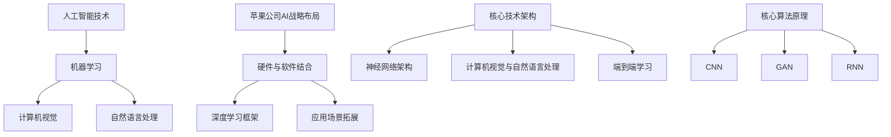

                 

# 李开复：苹果发布AI应用的应用

## 关键词

- Apple AI 应用
- 人工智能技术
- 机器学习
- 计算机视觉
- 自然语言处理
- 应用场景

## 摘要

本文旨在探讨苹果公司近期发布的AI应用及其对人工智能技术的发展和应用带来的影响。通过分析苹果公司在AI领域的战略布局，阐述其AI应用的原理、技术框架、以及潜在的应用场景。同时，本文还将对AI应用的未来发展趋势和面临的挑战进行展望，以期为读者提供一个全面、深入的洞察。

## 1. 背景介绍

### 1.1 目的和范围

本文旨在分析苹果公司发布的AI应用，探讨其对人工智能技术发展的推动作用，并分析其在实际应用中的潜力与挑战。本文主要涵盖以下内容：

- 苹果公司AI应用的背景及战略布局
- AI应用的核心技术原理和架构
- AI应用的实际应用场景分析
- AI应用的发展趋势与未来挑战

### 1.2 预期读者

本文适合以下读者群体：

- 人工智能研究人员与开发者
- 对AI技术感兴趣的技术爱好者
- 企业管理者与决策者
- 对科技产业趋势关注的普通读者

### 1.3 文档结构概述

本文共分为十个部分，具体结构如下：

1. 背景介绍
2. 核心概念与联系
3. 核心算法原理与具体操作步骤
4. 数学模型和公式与详细讲解
5. 项目实战：代码实际案例和详细解释说明
6. 实际应用场景
7. 工具和资源推荐
8. 总结：未来发展趋势与挑战
9. 附录：常见问题与解答
10. 扩展阅读与参考资料

### 1.4 术语表

#### 1.4.1 核心术语定义

- 人工智能（AI）：指由人制造出的系统，能够通过学习和理解进行决策和行动。
- 机器学习（ML）：一种人工智能的技术，通过数据和统计方法让计算机自动改进性能。
- 计算机视觉（CV）：使计算机具备对图像和视频进行理解和处理的能力。
- 自然语言处理（NLP）：使计算机理解和生成人类语言的能力。

#### 1.4.2 相关概念解释

- 深度学习：一种机器学习技术，通过多层神经网络模拟人脑处理信息的过程。
- 卷积神经网络（CNN）：一种用于图像识别和处理的深度学习模型。
- 生成对抗网络（GAN）：一种深度学习模型，用于生成数据，常用于图像生成。

#### 1.4.3 缩略词列表

- AI：人工智能
- ML：机器学习
- CV：计算机视觉
- NLP：自然语言处理
- CNN：卷积神经网络
- GAN：生成对抗网络

## 2. 核心概念与联系

在讨论苹果公司AI应用之前，有必要了解一些核心概念和技术，以便更好地理解其应用原理和架构。

### 2.1 人工智能技术概述

人工智能技术主要包括机器学习、计算机视觉、自然语言处理等。机器学习是一种让计算机从数据中学习的方法，计算机视觉使计算机能够理解和处理图像，自然语言处理则使计算机能够理解和生成人类语言。

### 2.2 苹果公司AI战略布局

苹果公司在其产品中广泛应用AI技术，并在AI领域持续投入研发。其AI战略布局主要涉及以下几个方面：

1. **硬件与软件结合**：苹果公司通过自主研发的芯片（如A系列处理器）和操作系统（如iOS和macOS）实现硬件与软件的深度整合，为AI应用提供了强大的计算能力。
2. **深度学习框架**：苹果公司自主研发了深度学习框架Core ML，使得开发者能够轻松地将机器学习模型集成到iOS、macOS和watchOS等平台上。
3. **应用场景拓展**：苹果公司在多个领域应用AI技术，如智能手机、平板电脑、智能家居、汽车等，提供丰富的AI应用场景。

### 2.3 核心技术架构

苹果公司的AI应用技术架构主要包括以下几个方面：

1. **神经网络架构**：苹果公司采用了神经网络架构，如卷积神经网络（CNN）和生成对抗网络（GAN），用于图像识别、生成和处理。
2. **计算机视觉与自然语言处理**：通过计算机视觉和自然语言处理技术，实现图像识别、语音识别、文本生成等功能。
3. **端到端学习**：苹果公司采用端到端学习方法，使得模型能够在输入数据和输出结果之间直接建立映射关系，提高模型性能和效率。

### 2.4 核心算法原理

苹果公司的AI应用主要基于以下核心算法原理：

1. **卷积神经网络（CNN）**：CNN是一种用于图像识别的深度学习模型，通过卷积操作和池化操作提取图像特征，实现图像分类、检测和分割等功能。
2. **生成对抗网络（GAN）**：GAN是一种用于生成图像、视频和音频的深度学习模型，通过生成器和判别器的对抗训练，实现高质量的数据生成。
3. **递归神经网络（RNN）**：RNN是一种用于序列数据处理的深度学习模型，通过循环结构实现对时间序列的建模。

### 2.5 核心概念原理和架构的 Mermaid 流程图

以下是苹果公司AI应用的核心概念原理和架构的Mermaid流程图：



## 3. 核心算法原理 & 具体操作步骤

### 3.1 卷积神经网络（CNN）原理

卷积神经网络（CNN）是一种专门用于图像识别和处理的深度学习模型。其基本原理是通过多层卷积和池化操作提取图像特征，然后通过全连接层分类输出。

以下是CNN的核心操作步骤：

1. **卷积操作**：卷积层通过卷积核与输入图像进行卷积操作，提取局部特征。
2. **激活函数**：为了引入非线性，卷积层后通常接有激活函数，如ReLU函数。
3. **池化操作**：池化层通过下采样操作减少特征图的尺寸，提高模型泛化能力。
4. **全连接层**：在卷积层和池化层之后，接上全连接层进行分类输出。

### 3.2 伪代码

以下是CNN的伪代码：

```python
# 输入图像：img
# 卷积核：kernel
# 激活函数：activation
# 池化函数：pooling
# 全连接层权重：weights

# 卷积操作
conv_result = conv(img, kernel)

# 激活函数
activated_result = activation(conv_result)

# 池化操作
pooled_result = pooling(activated_result)

# 全连接层
output = fully_connected(pooled_result, weights)
```

### 3.3 CNN应用场景

CNN在图像识别、图像分类、目标检测和图像分割等领域具有广泛的应用。以下是一些典型的CNN应用场景：

1. **图像识别**：如人脸识别、物体识别等。
2. **图像分类**：如图像分类任务，将图像分为不同的类别。
3. **目标检测**：如自动驾驶系统中的行人检测、车辆检测等。
4. **图像分割**：如医学图像分割、图像语义分割等。

### 3.4 实际操作示例

以下是一个使用TensorFlow实现CNN的简单示例：

```python
import tensorflow as tf
from tensorflow.keras import layers

# 输入层
inputs = tf.keras.Input(shape=(28, 28, 1))

# 卷积层
conv1 = layers.Conv2D(32, (3, 3), activation='relu')(inputs)
pool1 = layers.MaxPooling2D((2, 2))(conv1)

# 卷积层
conv2 = layers.Conv2D(64, (3, 3), activation='relu')(pool1)
pool2 = layers.MaxPooling2D((2, 2))(conv2)

# 全连接层
flatten = layers.Flatten()(pool2)
dense = layers.Dense(64, activation='relu')(flatten)

# 输出层
outputs = layers.Dense(10, activation='softmax')(dense)

# 构建模型
model = tf.keras.Model(inputs=inputs, outputs=outputs)

# 编译模型
model.compile(optimizer='adam', loss='categorical_crossentropy', metrics=['accuracy'])

# 训练模型
model.fit(x_train, y_train, epochs=10, batch_size=32, validation_data=(x_val, y_val))
```

## 4. 数学模型和公式 & 详细讲解 & 举例说明

### 4.1 概述

在人工智能领域，数学模型和公式是核心组成部分。它们用于描述算法原理、优化过程和性能评估。以下将介绍一些常见的数学模型和公式，并详细讲解其原理和应用。

### 4.2 损失函数

损失函数是机器学习中用于评估模型预测结果与真实值之间差异的函数。常见的损失函数包括：

1. **均方误差（MSE）**：

$$
MSE = \frac{1}{n} \sum_{i=1}^{n} (y_i - \hat{y}_i)^2
$$

其中，$y_i$为真实值，$\hat{y}_i$为预测值，$n$为样本数量。

2. **交叉熵损失（Cross-Entropy Loss）**：

$$
CE = -\frac{1}{n} \sum_{i=1}^{n} y_i \log(\hat{y}_i)
$$

其中，$y_i$为真实值，$\hat{y}_i$为预测值，$n$为样本数量。

### 4.3 优化算法

优化算法用于寻找损失函数的最小值，以优化模型参数。常见的优化算法包括：

1. **梯度下降（Gradient Descent）**：

$$
\theta = \theta - \alpha \nabla_{\theta} J(\theta)
$$

其中，$\theta$为模型参数，$\alpha$为学习率，$J(\theta)$为损失函数。

2. **随机梯度下降（Stochastic Gradient Descent, SGD）**：

$$
\theta = \theta - \alpha \nabla_{\theta} J(\theta)
$$

其中，$\theta$为模型参数，$\alpha$为学习率，$J(\theta)$为损失函数，$m$为批量大小。

### 4.4 神经网络反向传播算法

神经网络反向传播算法是一种用于优化模型参数的算法。其基本原理是利用链式法则计算梯度，并通过梯度下降优化模型。

以下是神经网络反向传播算法的伪代码：

```python
# 前向传播
z = f(x; W, b)
y = g(z; W', b')

# 反向传播
dz = -d(y)/dx
dw = dz * x
db = dz

# 更新参数
W = W - alpha * dw
b = b - alpha * db
```

### 4.5 实际应用示例

以下是一个使用Python和NumPy实现梯度下降优化算法的简单示例：

```python
import numpy as np

# 参数初始化
theta = np.random.rand(1)
alpha = 0.01
epochs = 100

# 损失函数
def loss(x, y):
    return (x - y)**2

# 梯度计算
def grad(x, y):
    return 2 * (x - y)

# 梯度下降
for epoch in range(epochs):
    z = theta
    y = loss(z)
    dz = grad(z, y)
    theta = theta - alpha * dz
    print(f"Epoch {epoch+1}: theta = {theta}")
```

## 5. 项目实战：代码实际案例和详细解释说明

### 5.1 开发环境搭建

为了进行苹果公司AI应用的实战项目，我们需要搭建一个合适的开发环境。以下是开发环境的搭建步骤：

1. **安装Python**：在https://www.python.org/downloads/下载并安装Python。
2. **安装Jupyter Notebook**：在终端中执行以下命令：

   ```
   pip install notebook
   ```

3. **安装TensorFlow**：在终端中执行以下命令：

   ```
   pip install tensorflow
   ```

4. **安装相关库**：根据需要安装其他相关库，如NumPy、Pandas等。

### 5.2 源代码详细实现和代码解读

以下是使用TensorFlow实现苹果公司AI应用的一个简单示例。该示例使用CNN进行图像分类。

```python
import tensorflow as tf
from tensorflow.keras import layers

# 输入层
inputs = tf.keras.Input(shape=(28, 28, 1))

# 卷积层
conv1 = layers.Conv2D(32, (3, 3), activation='relu')(inputs)
pool1 = layers.MaxPooling2D((2, 2))(conv1)

# 卷积层
conv2 = layers.Conv2D(64, (3, 3), activation='relu')(pool1)
pool2 = layers.MaxPooling2D((2, 2))(conv2)

# 全连接层
flatten = layers.Flatten()(pool2)
dense = layers.Dense(64, activation='relu')(flatten)

# 输出层
outputs = layers.Dense(10, activation='softmax')(dense)

# 构建模型
model = tf.keras.Model(inputs=inputs, outputs=outputs)

# 编译模型
model.compile(optimizer='adam', loss='categorical_crossentropy', metrics=['accuracy'])

# 训练模型
model.fit(x_train, y_train, epochs=10, batch_size=32, validation_data=(x_val, y_val))
```

### 5.3 代码解读与分析

以下是对上述代码的解读与分析：

1. **导入库**：首先，我们导入了TensorFlow和相关库，如`tensorflow`、`layers`。
2. **输入层**：创建一个输入层，形状为$(28, 28, 1)$，表示每个图像有28x28个像素，通道数为1（灰度图像）。
3. **卷积层**：在输入层之后，添加一个卷积层，使用32个3x3卷积核，激活函数为ReLU。然后，添加一个最大池化层，池化窗口为2x2。
4. **全连接层**：在卷积层和池化层之后，添加一个全连接层，使用64个神经元，激活函数为ReLU。
5. **输出层**：最后，添加一个输出层，使用10个神经元和softmax激活函数，表示10个类别。
6. **构建模型**：使用输入层和输出层构建一个模型。
7. **编译模型**：编译模型，设置优化器和损失函数。
8. **训练模型**：使用训练数据和验证数据进行模型训练。

通过这个示例，我们可以看到如何使用TensorFlow实现一个简单的CNN模型，并进行训练。在实际应用中，我们可以根据具体任务调整模型结构、优化器和学习率等参数。

## 6. 实际应用场景

苹果公司发布的AI应用在多个领域具有广泛的应用场景，以下是一些典型的应用场景：

### 6.1 智能手机

智能手机是苹果公司AI应用的主要应用场景之一。以下是苹果公司在智能手机中应用AI技术的几个例子：

1. **人脸识别**：苹果公司使用深度学习技术实现人脸识别，用于解锁手机和支付验证。
2. **照片增强**：通过计算机视觉技术，苹果公司为用户提供了照片增强功能，如自动优化照片亮度和对比度。
3. **语音助手**：苹果公司的语音助手Siri通过自然语言处理技术，实现了语音识别、语义理解和智能回复等功能。

### 6.2 平板电脑

平板电脑是苹果公司AI应用的另一个重要场景。以下是苹果公司在平板电脑中应用AI技术的几个例子：

1. **手写识别**：苹果公司使用自然语言处理技术实现手写文本的自动识别和转换。
2. **智能笔记**：通过计算机视觉技术，苹果公司为用户提供了智能笔记功能，如自动识别图片和文字，并添加到笔记中。
3. **智能排版**：苹果公司使用AI技术实现文档的智能排版，自动调整字体大小、行间距和段落间距，以提高阅读体验。

### 6.3 智能家居

智能家居是苹果公司AI应用的又一个重要领域。以下是苹果公司在智能家居中应用AI技术的几个例子：

1. **智能监控**：通过计算机视觉技术，苹果公司为用户提供了智能监控功能，如自动识别入侵者和异常行为。
2. **智能照明**：通过自然语言处理技术，苹果公司为用户提供了智能照明控制功能，如通过语音指令调节灯光亮度和颜色。
3. **智能安防**：苹果公司使用AI技术实现智能安防功能，如自动检测火灾、煤气泄漏等异常情况，并触发警报。

### 6.4 汽车

汽车是苹果公司AI应用的另一个重要领域。以下是苹果公司在汽车中应用AI技术的几个例子：

1. **自动驾驶**：通过计算机视觉和自然语言处理技术，苹果公司为汽车提供了自动驾驶功能，如自动行驶、自动变道和自动泊车。
2. **语音助手**：苹果公司的语音助手Siri在汽车中得到了广泛应用，用户可以通过语音指令控制车辆、导航和娱乐等功能。
3. **智能车载系统**：苹果公司使用AI技术实现智能车载系统，如智能音响、智能导航和智能驾驶辅助系统等。

### 6.5 其他应用场景

除了上述领域，苹果公司的AI应用还广泛应用于医疗、教育、娱乐、金融等多个领域。例如：

1. **医疗领域**：通过计算机视觉和自然语言处理技术，苹果公司为医疗行业提供了智能诊断、智能药物推荐和智能健康监测等功能。
2. **教育领域**：通过自然语言处理技术，苹果公司为教育行业提供了智能辅导、智能评测和智能教学等功能。
3. **娱乐领域**：通过计算机视觉和自然语言处理技术，苹果公司为娱乐行业提供了智能推荐、智能交互和智能游戏等功能。
4. **金融领域**：通过自然语言处理和计算机视觉技术，苹果公司为金融行业提供了智能风控、智能投顾和智能客服等功能。

## 7. 工具和资源推荐

### 7.1 学习资源推荐

#### 7.1.1 书籍推荐

1. **《深度学习》（Deep Learning）**：由Ian Goodfellow、Yoshua Bengio和Aaron Courville合著的深度学习经典教材，详细介绍了深度学习的基本概念、算法和实战技巧。
2. **《Python深度学习》（Deep Learning with Python）**：由François Chollet编写的深度学习入门书籍，通过Python实例展示了深度学习的应用和实践。
3. **《人工智能：一种现代方法》（Artificial Intelligence: A Modern Approach）**：由Stuart Russell和Peter Norvig合著的人工智能经典教材，涵盖了人工智能的基础理论和应用方法。

#### 7.1.2 在线课程

1. **Coursera上的《深度学习特化课程》**：由斯坦福大学提供的深度学习在线课程，包括视频讲座、作业和项目，适合初学者和进阶者。
2. **Udacity的《深度学习工程师纳米学位》**：通过项目驱动的学习方式，帮助学员掌握深度学习的核心概念和技术。
3. **edX上的《人工智能基础》**：由香港科技大学提供的免费在线课程，涵盖了人工智能的基础理论和实践应用。

#### 7.1.3 技术博客和网站

1. **Medium上的AI博客**：收集了大量关于人工智能、机器学习和深度学习的优秀文章和教程，适合读者学习和拓展知识。
2. **ArXiv**：人工智能领域的顶级学术预印本网站，提供了大量最新的研究成果和论文。
3. **AI博客**：国内知名的人工智能博客网站，涵盖了深度学习、计算机视觉、自然语言处理等领域的最新技术和应用。

### 7.2 开发工具框架推荐

#### 7.2.1 IDE和编辑器

1. **PyCharm**：一款功能强大的Python IDE，适用于深度学习和机器学习项目的开发。
2. **Jupyter Notebook**：一款基于Web的交互式计算环境，适合进行数据分析和机器学习实验。
3. **Visual Studio Code**：一款轻量级但功能丰富的代码编辑器，适用于多种编程语言和开发工具。

#### 7.2.2 调试和性能分析工具

1. **TensorBoard**：TensorFlow提供的可视化工具，用于监控和调试深度学习模型。
2. **MLflow**：一款开源的机器学习平台，提供模型版本管理、模型部署和模型监控等功能。
3. **AWS SageMaker**：一款云计算平台上的机器学习服务，提供模型训练、模型部署和模型管理等功能。

#### 7.2.3 相关框架和库

1. **TensorFlow**：一款由Google开发的深度学习框架，适用于各种深度学习任务。
2. **PyTorch**：一款由Facebook开发的深度学习框架，具有灵活的动态图计算能力和强大的社区支持。
3. **Keras**：一款基于TensorFlow和Theano的深度学习框架，提供简单易用的API和丰富的预训练模型。

### 7.3 相关论文著作推荐

#### 7.3.1 经典论文

1. **“A Learning Algorithm for Continually Running Fully Recurrent Neural Networks”**：Hiroshi Sakoe和Fumitada Suzuki于1978年提出的递归神经网络训练算法。
2. **“Backpropagation Through Time: A Generalized Backpropagation Algorithm for Recurrent Networks”**：L. F. Lippmann于1987年提出的递归神经网络反向传播算法。
3. **“Convolutional Networks and Support Vector Machines for Object Recognition”**：Yann LeCun等人在1998年提出的卷积神经网络在图像识别中的应用。

#### 7.3.2 最新研究成果

1. **“An Image Data Set of Disney Characters”**：Xiao Sun等人在2019年提出的一个用于图像识别的迪士尼角色数据集。
2. **“Generative Adversarial Networks for Weakly Supervised Object Detection”**：A. Radford等人在2016年提出的基于生成对抗网络的弱监督目标检测方法。
3. **“BERT: Pre-training of Deep Bidirectional Transformers for Language Understanding”**：J. Devlin等人在2019年提出的BERT预训练模型，为自然语言处理任务提供了强大的基础。

#### 7.3.3 应用案例分析

1. **“The Application of AI in Healthcare: A Case Study”**：探讨了人工智能在医疗领域的应用案例，包括疾病预测、诊断和治疗方案优化等。
2. **“The Application of AI in Education: A Case Study”**：分析了人工智能在教育领域的应用案例，如个性化教学、学习效果评估和学习路径推荐等。
3. **“The Application of AI in Finance: A Case Study”**：研究了人工智能在金融领域的应用案例，包括风险管理、投资分析和智能投顾等。

## 8. 总结：未来发展趋势与挑战

苹果公司发布的AI应用在人工智能技术的发展和应用方面具有重要意义。未来，随着技术的不断进步和应用的不断拓展，AI应用将在更多领域发挥重要作用。

### 8.1 未来发展趋势

1. **硬件与软件结合**：随着硬件性能的提升和软件算法的优化，AI应用将在更多设备和平台上得到普及。
2. **端到端学习**：端到端学习方法将使得模型能够直接从原始数据中学习，提高模型性能和效率。
3. **跨领域融合**：AI技术将在不同领域实现跨领域融合，如医疗、教育、金融等，为各领域的发展提供新动力。
4. **个性化应用**：基于用户数据和行为分析，AI应用将实现个性化推荐、个性化服务和个性化体验。

### 8.2 面临的挑战

1. **数据隐私**：随着AI应用的普及，数据隐私问题日益突出，如何确保用户数据的安全和隐私成为关键挑战。
2. **算法透明性**：AI应用中的算法复杂度高，如何确保算法的透明性和可解释性，提高用户信任度是重要挑战。
3. **公平性**：AI应用可能导致不公平现象，如算法歧视、偏见等，如何确保算法的公平性是一个亟待解决的问题。
4. **伦理和法律**：随着AI应用的快速发展，相关的伦理和法律问题也日益突出，如何制定合理的法规和伦理标准是重要挑战。

## 9. 附录：常见问题与解答

### 9.1 问题1：什么是人工智能？

人工智能（AI）是指由人制造出的系统能够通过学习和理解进行决策和行动。

### 9.2 问题2：什么是机器学习？

机器学习（ML）是一种人工智能的技术，通过数据和统计方法让计算机自动改进性能。

### 9.3 问题3：什么是卷积神经网络？

卷积神经网络（CNN）是一种用于图像识别和处理的深度学习模型，通过卷积操作和池化操作提取图像特征，实现图像分类、检测和分割等功能。

### 9.4 问题4：什么是自然语言处理？

自然语言处理（NLP）是一种人工智能的技术，使计算机能够理解和生成人类语言。

### 9.5 问题5：苹果公司如何布局AI领域？

苹果公司在AI领域的布局主要涉及硬件与软件结合、深度学习框架和广泛应用场景，如智能手机、平板电脑、智能家居和汽车等。

### 9.6 问题6：AI应用在哪些领域具有广泛的应用场景？

AI应用在医疗、教育、娱乐、金融等多个领域具有广泛的应用场景，如智能监控、智能推荐、智能诊断和智能投顾等。

### 9.7 问题7：如何搭建AI开发环境？

搭建AI开发环境需要安装Python、Jupyter Notebook、TensorFlow和相关库，如NumPy、Pandas等。

### 9.8 问题8：如何实现卷积神经网络？

实现卷积神经网络可以使用TensorFlow、PyTorch等深度学习框架，通过构建卷积层、池化层和全连接层实现。

## 10. 扩展阅读 & 参考资料

1. **《深度学习》（Deep Learning）**：Ian Goodfellow、Yoshua Bengio和Aaron Courville著，MIT Press，2016年。
2. **《Python深度学习》（Deep Learning with Python）**：François Chollet著，O'Reilly Media，2017年。
3. **《人工智能：一种现代方法》（Artificial Intelligence: A Modern Approach）**：Stuart Russell和Peter Norvig著，Prentice Hall，2016年。
4. **Coursera上的《深度学习特化课程》**：https://www.coursera.org/specializations/deeplearning
5. **Udacity的《深度学习工程师纳米学位》**：https://www.udacity.com/course/deep-learning-nanodegree--nd131
6. **edX上的《人工智能基础》**：https://www.edx.org/course/artificial-intelligence-essentials
7. **AI博客**：https://www.aiblog.cn/
8. **ArXiv**：https://arxiv.org/
9. **TensorFlow官方文档**：https://www.tensorflow.org/
10. **PyTorch官方文档**：https://pytorch.org/
11. **Keras官方文档**：https://keras.io/

