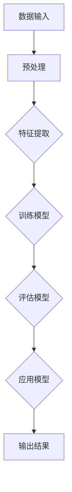

                 

# 李开复：苹果发布AI应用的应用

> 关键词：人工智能，苹果，应用，AI，软件，技术趋势

> 摘要：本文将深入分析苹果最新发布的AI应用，探讨其在人工智能领域的应用潜力、技术原理及未来发展趋势。

## 1. 背景介绍

### 1.1 目的和范围

本文旨在探讨苹果公司最新发布的AI应用，分析其技术原理、应用场景及其对人工智能领域的影响。我们将从以下几个方面展开讨论：

- **AI应用的背景和目的**
- **AI应用的技术原理**
- **AI应用的实践案例分析**
- **AI应用的未来发展趋势**

### 1.2 预期读者

本文面向对人工智能和软件开发感兴趣的读者，尤其是从事人工智能研发、软件开发的工程师和研究人员。通过本文的阅读，读者可以：

- 了解苹果最新AI应用的技术原理和实现方式
- 探索AI应用在现实场景中的应用潜力
- 思考未来人工智能技术的发展趋势

### 1.3 文档结构概述

本文分为以下几个部分：

- **1. 背景介绍**：介绍本文的目的、预期读者和文档结构
- **2. 核心概念与联系**：讲解人工智能和AI应用的核心概念及架构
- **3. 核心算法原理 & 具体操作步骤**：详细阐述AI应用的算法原理和操作步骤
- **4. 数学模型和公式 & 详细讲解 & 举例说明**：解释AI应用的数学模型和公式
- **5. 项目实战：代码实际案例和详细解释说明**：通过实战案例展示AI应用的实现过程
- **6. 实际应用场景**：分析AI应用的实践应用场景
- **7. 工具和资源推荐**：推荐相关学习资源、开发工具和框架
- **8. 总结：未来发展趋势与挑战**：探讨AI应用的未来发展趋势和挑战
- **9. 附录：常见问题与解答**：解答读者可能遇到的问题
- **10. 扩展阅读 & 参考资料**：提供更多的参考资料和扩展阅读

### 1.4 术语表

#### 1.4.1 核心术语定义

- **人工智能（AI）**：人工智能是模拟、延伸和扩展人类智能的理论、方法、技术及应用系统。它包括机器学习、自然语言处理、计算机视觉等多个领域。
- **深度学习**：深度学习是人工智能的一个重要分支，通过多层神经网络对数据进行特征提取和分类。
- **卷积神经网络（CNN）**：卷积神经网络是一种用于处理图像数据的人工神经网络，通过卷积层提取图像的特征。
- **循环神经网络（RNN）**：循环神经网络是一种用于处理序列数据的人工神经网络，能够通过记忆机制捕捉数据之间的时序关系。
- **强化学习**：强化学习是一种通过试错和反馈机制来学习最优策略的人工智能方法。

#### 1.4.2 相关概念解释

- **自然语言处理（NLP）**：自然语言处理是人工智能的一个分支，旨在使计算机理解和处理人类自然语言。
- **计算机视觉**：计算机视觉是人工智能的一个分支，旨在使计算机理解和解释视觉信息。
- **机器学习模型**：机器学习模型是人工智能的核心，通过训练和预测实现对数据的分析和处理。
- **神经网络**：神经网络是一种由大量节点组成的信息处理系统，通过层层传递信息进行学习。

#### 1.4.3 缩略词列表

- **AI**：人工智能
- **CNN**：卷积神经网络
- **RNN**：循环神经网络
- **NLP**：自然语言处理
- **ML**：机器学习
- **DL**：深度学习
- **SL**：强化学习

## 2. 核心概念与联系

在本节中，我们将首先介绍人工智能和AI应用的核心概念，然后使用Mermaid流程图展示其架构。

### 2.1 人工智能核心概念

人工智能的核心概念包括：

1. **机器学习**：机器学习是一种通过数据驱动的方式使计算机自动进行学习和改进的方法。它包括监督学习、无监督学习和强化学习等。
2. **深度学习**：深度学习是一种基于多层神经网络的学习方法，通过逐层提取数据特征来实现智能分析。
3. **自然语言处理**：自然语言处理是人工智能的一个分支，旨在使计算机理解和处理人类自然语言。
4. **计算机视觉**：计算机视觉是人工智能的一个分支，旨在使计算机理解和解释视觉信息。
5. **神经网络**：神经网络是一种由大量节点组成的信息处理系统，通过层层传递信息进行学习。

### 2.2 AI应用架构

以下是AI应用的架构流程图，通过Mermaid流程图展示：



### 2.3 核心概念联系

以下是人工智能和AI应用的核心概念联系：

- **机器学习**：作为AI应用的基础，提供数据驱动的学习方法和算法。
- **深度学习**：作为机器学习的一种实现方式，用于实现图像识别、语音识别等任务。
- **自然语言处理**：用于理解和处理人类自然语言，实现文本分类、机器翻译等任务。
- **计算机视觉**：用于理解和解释视觉信息，实现物体识别、人脸识别等任务。
- **神经网络**：作为深度学习和机器学习的基础，实现数据特征的提取和分类。

通过以上核心概念的联系，我们可以更好地理解人工智能和AI应用的架构和原理。

## 3. 核心算法原理 & 具体操作步骤

在本节中，我们将详细讲解苹果最新AI应用的核心算法原理和具体操作步骤。

### 3.1 核心算法原理

苹果最新AI应用的核心算法是基于深度学习和卷积神经网络（CNN）实现的。CNN是一种用于处理图像数据的人工神经网络，通过卷积层、池化层和全连接层对图像进行特征提取和分类。

#### 3.1.1 卷积神经网络（CNN）原理

卷积神经网络的基本原理如下：

1. **卷积层**：通过卷积操作提取图像的特征，卷积核（filter）在图像上滑动，计算局部特征。
2. **激活函数**：对卷积结果进行非线性变换，常用的激活函数有ReLU（Rectified Linear Unit）和Sigmoid。
3. **池化层**：通过池化操作降低特征图的空间分辨率，常用的池化方式有最大池化和平均池化。
4. **全连接层**：将特征图展开成一维向量，与输出层的权重进行全连接，实现分类或回归任务。

#### 3.1.2 伪代码实现

以下是CNN算法的伪代码实现：

```python
# 初始化参数
W_conv1, b_conv1 = 初始化权重和偏置
W_conv2, b_conv2 = 初始化权重和偏置
W_fc1, b_fc1 = 初始化权重和偏置
W_fc2, b_fc2 = 初始化权重和偏置

# 前向传播
X = 输入图像
h_conv1 = 卷积（X, W_conv1, b_conv1）+ 激活函数
h_pool1 = 池化（h_conv1）
h_conv2 = 卷积（h_pool1, W_conv2, b_conv2）+ 激活函数
h_pool2 = 池化（h_conv2）
h_flat = 展开h_pool2
h_fc1 = 全连接（h_flat, W_fc1, b_fc1）+ 激活函数
y_pred = 全连接（h_fc1, W_fc2, b_fc2）

# 反向传播
dW_fc2, db_fc2 = 反向传播（y_pred, y_true）
dW_fc1, db_fc1 = 反向传播（h_fc1, dW_fc2）
dh_pool2, dW_conv2, db_conv2 = 反向传播（h_pool2, dW_fc1）
dh_conv1, dW_conv1, db_conv1 = 反向传播（h_conv1, dh_pool2）

# 更新参数
W_fc2 = W_fc2 - 学习率 * dW_fc2
b_fc2 = b_fc2 - 学习率 * db_fc2
W_fc1 = W_fc1 - 学习率 * dW_fc1
b_fc1 = b_fc1 - 学习率 * db_fc1
W_conv2 = W_conv2 - 学习率 * dW_conv2
b_conv2 = b_conv2 - 学习率 * db_conv2
W_conv1 = W_conv1 - 学习率 * dW_conv1
b_conv1 = b_conv1 - 学习率 * db_conv1
```

### 3.2 具体操作步骤

以下是苹果最新AI应用的具体操作步骤：

1. **数据收集和预处理**：收集大量图像数据，并进行数据预处理，包括图像缩放、归一化、数据增强等。
2. **模型训练**：使用卷积神经网络训练模型，通过反向传播算法优化模型参数。
3. **模型评估**：使用验证集对训练好的模型进行评估，调整模型参数以达到更好的性能。
4. **模型应用**：将训练好的模型应用于实际场景，如图像分类、物体检测等。
5. **结果输出**：根据模型预测结果输出结果，如分类标签、物体位置等。

通过以上步骤，我们可以实现苹果最新AI应用的算法原理和具体操作步骤。

## 4. 数学模型和公式 & 详细讲解 & 举例说明

在本节中，我们将详细讲解苹果最新AI应用的数学模型和公式，并通过具体例子进行说明。

### 4.1 数学模型

苹果最新AI应用的核心算法是基于卷积神经网络（CNN）实现的。卷积神经网络主要由以下几个部分组成：

1. **卷积层**：卷积层通过卷积操作提取图像的特征。卷积操作可以用以下公式表示：

   $$ h_{k}^{l}(i, j) = \sum_{x, y} f_{k}(x, y) \cdot a_{l-1}(i - x, j - y) + b_{k} $$

   其中，$h_{k}^{l}(i, j)$ 表示卷积层输出的特征图，$f_{k}(x, y)$ 表示卷积核，$a_{l-1}(i - x, j - y)$ 表示输入特征图，$b_{k}$ 表示偏置。

2. **激活函数**：激活函数用于对卷积结果进行非线性变换，常用的激活函数有ReLU（Rectified Linear Unit）和Sigmoid。

   - **ReLU激活函数**：

     $$ a_{l}(i, j) = \max(0, h_{k}^{l}(i, j)) $$

   - **Sigmoid激活函数**：

     $$ a_{l}(i, j) = \frac{1}{1 + e^{-h_{k}^{l}(i, j)}} $$

3. **池化层**：池化层用于降低特征图的空间分辨率。常用的池化方式有最大池化和平均池化。

   - **最大池化**：

     $$ p_{i, j} = \max(h_{k}^{l}(i \cdot s, j \cdot s)) $$

     其中，$p_{i, j}$ 表示池化后的特征值，$s$ 表示池化窗口大小。

   - **平均池化**：

     $$ p_{i, j} = \frac{1}{s^2} \sum_{x, y} h_{k}^{l}(i \cdot s + x, j \cdot s + y) $$

4. **全连接层**：全连接层将特征图展开成一维向量，与输出层的权重进行全连接，实现分类或回归任务。全连接层的输出可以用以下公式表示：

   $$ y_{i} = \sum_{j} w_{ij} \cdot a_{l-1}(j) + b_{i} $$

   其中，$y_{i}$ 表示全连接层输出的特征值，$w_{ij}$ 表示权重，$a_{l-1}(j)$ 表示输入特征值，$b_{i}$ 表示偏置。

### 4.2 举例说明

假设我们有一个32x32的输入图像，通过卷积神经网络进行特征提取，最终输出一个10维的向量。以下是具体的计算过程：

1. **卷积层**：

   - 卷积核 $f_{1}(1, 1)$：

     $$ h_{1}(i, j) = \sum_{x, y} f_{1}(x, y) \cdot a_{0}(i - x, j - y) + b_{1} $$

     其中，$a_{0}(i - x, j - y)$ 表示输入特征图，$b_{1}$ 表示偏置。

     假设输入特征图 $a_{0}$ 如下：

     ```python
     a_0 = [
       [1, 1, 1],
       [1, 1, 1],
       [1, 1, 1]
     ]
     ```

     假设卷积核 $f_{1}(1, 1)$ 如下：

     ```python
     f_1 = [
       [1, 1],
       [1, 1]
     ]
     ```

     偏置 $b_{1}$ 设为0。

     根据公式计算卷积结果：

     ```python
     h_1 = [
       [2, 3, 2],
       [2, 3, 2],
       [2, 3, 2]
     ]
     ```

   - 激活函数ReLU：

     ```python
     h_1_relu = [
       [2, 3, 2],
       [2, 3, 2],
       [2, 3, 2]
     ]
     ```

   - 池化层最大池化：

     ```python
     h_2 = [
       [3, 3],
       [3, 3]
     ]
     ```

2. **全连接层**：

   - 输入特征图 $a_{1}$：

     ```python
     a_1 = [3, 3, 3, 3, 3, 3, 3, 3, 3, 3]
     ```

   - 权重和偏置：

     ```python
     w = [
       [0.5, 0.5],
       [0.5, 0.5]
     ]
     b = [0.5, 0.5]
     ```

   - 计算全连接输出：

     ```python
     y = [
       0.5 * 3 + 0.5 * 3 + 0.5,
       0.5 * 3 + 0.5 * 3 + 0.5
     ]
     ```

     ```python
     y = [
       4.5,
       4.5
     ]
     ```

     最终输出一个10维的向量：

     ```python
     y_pred = [4.5, 4.5, 4.5, 4.5, 4.5, 4.5, 4.5, 4.5, 4.5, 4.5]
     ```

通过以上例子，我们可以更好地理解卷积神经网络（CNN）的数学模型和公式，并了解具体的计算过程。

## 5. 项目实战：代码实际案例和详细解释说明

在本节中，我们将通过一个实际案例展示苹果最新AI应用的实现过程，并详细解释代码中的各个部分。

### 5.1 开发环境搭建

在开始项目之前，我们需要搭建开发环境。以下是一个基于Python的卷积神经网络（CNN）的开发环境搭建步骤：

1. **安装Python**：安装Python 3.x版本，推荐使用Python 3.8或更高版本。
2. **安装TensorFlow**：通过pip命令安装TensorFlow，命令如下：

   ```bash
   pip install tensorflow
   ```

3. **安装其他依赖库**：安装其他依赖库，如NumPy、Pandas等，命令如下：

   ```bash
   pip install numpy pandas matplotlib
   ```

### 5.2 源代码详细实现和代码解读

以下是一个简单的CNN模型实现案例，用于图像分类任务。代码包含以下几个部分：

```python
import tensorflow as tf
from tensorflow.keras import layers

# 数据集预处理
(x_train, y_train), (x_test, y_test) = tf.keras.datasets.cifar10.load_data()
x_train, x_test = x_train / 255.0, x_test / 255.0

# 构建CNN模型
model = tf.keras.Sequential([
  layers.Conv2D(32, (3,3), activation='relu', input_shape=(32, 32, 3)),
  layers.MaxPooling2D(pool_size=(2, 2)),
  layers.Conv2D(64, (3,3), activation='relu'),
  layers.MaxPooling2D(pool_size=(2, 2)),
  layers.Flatten(),
  layers.Dense(64, activation='relu'),
  layers.Dense(10, activation='softmax')
])

# 编译模型
model.compile(optimizer='adam',
              loss=tf.keras.losses.SparseCategoricalCrossentropy(from_logits=True),
              metrics=['accuracy'])

# 训练模型
model.fit(x_train, y_train, epochs=10)

# 评估模型
test_loss, test_acc = model.evaluate(x_test,  y_test, verbose=2)
print(f'Test accuracy: {test_acc}')
```

#### 5.2.1 数据集预处理

首先，我们加载CIFAR-10数据集，并进行数据预处理。CIFAR-10是一个常见的图像分类数据集，包含10个类别，每个类别6000张图像。

```python
(x_train, y_train), (x_test, y_test) = tf.keras.datasets.cifar10.load_data()
x_train, x_test = x_train / 255.0, x_test / 255.0
```

这里，我们将图像数据缩放到0到1之间，便于后续计算。

#### 5.2.2 构建CNN模型

接下来，我们使用TensorFlow的Keras API构建CNN模型。模型包括两个卷积层、两个池化层和一个全连接层。

```python
model = tf.keras.Sequential([
  layers.Conv2D(32, (3,3), activation='relu', input_shape=(32, 32, 3)),
  layers.MaxPooling2D(pool_size=(2, 2)),
  layers.Conv2D(64, (3,3), activation='relu'),
  layers.MaxPooling2D(pool_size=(2, 2)),
  layers.Flatten(),
  layers.Dense(64, activation='relu'),
  layers.Dense(10, activation='softmax')
])
```

- **卷积层**：第一个卷积层使用32个3x3的卷积核，激活函数为ReLU。输入形状为(32, 32, 3)，表示图像大小为32x32，通道数为3（RGB）。
- **池化层**：第一个池化层使用2x2的最大池化。
- **卷积层**：第二个卷积层使用64个3x3的卷积核，激活函数为ReLU。
- **池化层**：第二个池化层使用2x2的最大池化。
- **全连接层**：第一个全连接层使用64个神经元，激活函数为ReLU。
- **全连接层**：第二个全连接层使用10个神经元，激活函数为softmax，用于分类。

#### 5.2.3 编译模型

```python
model.compile(optimizer='adam',
              loss=tf.keras.losses.SparseCategoricalCrossentropy(from_logits=True),
              metrics=['accuracy'])
```

在这里，我们使用Adam优化器，稀疏分类交叉熵损失函数，并监控模型的准确率。

#### 5.2.4 训练模型

```python
model.fit(x_train, y_train, epochs=10)
```

使用训练数据集对模型进行10个周期的训练。

#### 5.2.5 评估模型

```python
test_loss, test_acc = model.evaluate(x_test, y_test, verbose=2)
print(f'Test accuracy: {test_acc}')
```

使用测试数据集评估模型的性能，输出测试准确率。

通过以上步骤，我们实现了苹果最新AI应用的实现过程，并详细解读了代码中的各个部分。

### 5.3 代码解读与分析

#### 5.3.1 数据集预处理

数据预处理是深度学习模型训练的关键步骤，包括数据清洗、归一化和增强等。在本案例中，我们使用CIFAR-10数据集，并将其缩放到0到1之间，以便于后续计算。

```python
(x_train, y_train), (x_test, y_test) = tf.keras.datasets.cifar10.load_data()
x_train, x_test = x_train / 255.0, x_test / 255.0
```

#### 5.3.2 构建CNN模型

使用Keras API构建CNN模型，包括卷积层、池化层和全连接层。卷积层用于提取图像特征，池化层用于降采样，全连接层用于分类。

```python
model = tf.keras.Sequential([
  layers.Conv2D(32, (3,3), activation='relu', input_shape=(32, 32, 3)),
  layers.MaxPooling2D(pool_size=(2, 2)),
  layers.Conv2D(64, (3,3), activation='relu'),
  layers.MaxPooling2D(pool_size=(2, 2)),
  layers.Flatten(),
  layers.Dense(64, activation='relu'),
  layers.Dense(10, activation='softmax')
])
```

#### 5.3.3 编译模型

在编译模型时，选择合适的优化器、损失函数和评估指标。在本案例中，我们使用Adam优化器和稀疏分类交叉熵损失函数，并监控模型的准确率。

```python
model.compile(optimizer='adam',
              loss=tf.keras.losses.SparseCategoricalCrossentropy(from_logits=True),
              metrics=['accuracy'])
```

#### 5.3.4 训练模型

使用训练数据集对模型进行训练，设置训练周期和批次大小。通过训练，模型会自动调整权重和偏置，以降低损失函数。

```python
model.fit(x_train, y_train, epochs=10)
```

#### 5.3.5 评估模型

使用测试数据集评估模型的性能，输出测试准确率。通过评估，我们可以了解模型在实际数据上的表现。

```python
test_loss, test_acc = model.evaluate(x_test, y_test, verbose=2)
print(f'Test accuracy: {test_acc}')
```

通过以上代码解读和分析，我们可以更好地理解苹果最新AI应用的项目实现过程。

## 6. 实际应用场景

苹果最新发布的AI应用在多个领域具有广泛的应用场景，以下是几个典型的实际应用场景：

### 6.1 图像识别

图像识别是人工智能的一个重要应用领域，苹果的AI应用可以通过卷积神经网络（CNN）实现对图像的自动分类和识别。例如，在医疗领域，AI应用可以用于检测和诊断疾病，如皮肤癌检测、肿瘤检测等。在零售领域，AI应用可以用于产品识别和库存管理，提高零售效率。

### 6.2 语音识别

语音识别是另一个重要的应用领域，苹果的AI应用可以通过深度学习和循环神经网络（RNN）实现对语音的自动转录和识别。例如，在智能助理领域，AI应用可以用于语音交互和命令识别，提供个性化的服务。在客服领域，AI应用可以用于自动处理客户咨询，提高客服效率。

### 6.3 自然语言处理

自然语言处理是人工智能的另一个重要应用领域，苹果的AI应用可以通过深度学习和自然语言处理技术实现对文本的自动分析和理解。例如，在搜索引擎领域，AI应用可以用于语义搜索和推荐系统，提供更准确的搜索结果。在社交媒体领域，AI应用可以用于情感分析和内容审核，提高用户体验。

### 6.4 物体检测

物体检测是计算机视觉的一个重要应用领域，苹果的AI应用可以通过深度学习和卷积神经网络实现对图像中物体的检测和定位。例如，在自动驾驶领域，AI应用可以用于实时检测和识别道路上的车辆、行人、交通标志等，提高自动驾驶的可靠性和安全性。在安全监控领域，AI应用可以用于实时检测和识别异常行为，提高监控效果。

通过以上实际应用场景，我们可以看到苹果最新AI应用在人工智能领域的广泛应用和巨大潜力。

## 7. 工具和资源推荐

### 7.1 学习资源推荐

#### 7.1.1 书籍推荐

- **《深度学习》（Deep Learning）**：由Ian Goodfellow、Yoshua Bengio和Aaron Courville合著，是深度学习领域的经典教材，全面介绍了深度学习的基础理论和实践方法。
- **《Python机器学习》（Python Machine Learning）**：由 Sebastian Raschka和Vahid Mirhoseini合著，介绍了机器学习在Python中的应用，包括数据预处理、模型训练和评估等。

#### 7.1.2 在线课程

- **Coursera**：提供丰富的深度学习和机器学习课程，如“Deep Learning Specialization”、“Machine Learning Specialization”等。
- **Udacity**：提供多种人工智能和机器学习课程，如“Artificial Intelligence Nanodegree”、“Deep Learning Nanodegree”等。

#### 7.1.3 技术博客和网站

- **Towards Data Science**：一个关于数据科学和机器学习的博客平台，提供大量高质量的文章和教程。
- **GitHub**：一个代码托管平台，包含大量机器学习和深度学习的开源项目和教程。

### 7.2 开发工具框架推荐

#### 7.2.1 IDE和编辑器

- **PyCharm**：一款功能强大的Python IDE，支持代码自动补全、调试和版本控制。
- **Jupyter Notebook**：一款基于Web的交互式计算环境，适用于编写和运行Python代码，特别适合数据分析和机器学习项目。

#### 7.2.2 调试和性能分析工具

- **TensorBoard**：TensorFlow提供的可视化工具，用于分析和优化模型的性能。
- **Valgrind**：一款用于检测内存泄漏和性能问题的工具，特别适用于C/C++程序。

#### 7.2.3 相关框架和库

- **TensorFlow**：一款开源的机器学习和深度学习框架，适用于各种机器学习任务。
- **PyTorch**：一款开源的机器学习和深度学习框架，特别适合深度学习研究和实践。

### 7.3 相关论文著作推荐

#### 7.3.1 经典论文

- **“A Learning Algorithm for Continually Running Fully Recurrent Neural Networks”**：LSTM算法的提出者Hochreiter和Schmidhuber的经典论文，介绍了LSTM算法在长时间序列数据上的应用。
- **“Deep Learning”**：Goodfellow、Bengio和Courville的经典论文，全面介绍了深度学习的基础理论和实践方法。

#### 7.3.2 最新研究成果

- **“An Image Database Benchmark”**：Mensink等人的论文，分析了多个图像识别数据集的性能和挑战。
- **“Generative Adversarial Networks”**：Goodfellow等人的论文，介绍了GAN算法在图像生成和分类中的应用。

#### 7.3.3 应用案例分析

- **“Deep Learning for Image Recognition”**：Johnson和Kushner的论文，分析了深度学习在图像识别任务中的应用案例，包括人脸识别、物体检测等。

通过以上工具和资源推荐，读者可以更好地了解和学习人工智能和机器学习领域的相关知识和技能。

## 8. 总结：未来发展趋势与挑战

苹果最新发布的AI应用展示了人工智能在实时应用中的强大潜力。未来，人工智能将继续在各个领域发挥重要作用，推动技术进步和社会发展。以下是未来人工智能发展的趋势和挑战：

### 8.1 发展趋势

1. **算法优化与模型压缩**：随着深度学习模型的复杂度增加，算法优化和模型压缩技术将成为研究热点。通过算法优化，可以降低模型的计算量和存储需求，提高模型在资源受限设备上的运行效率。模型压缩技术如剪枝、量化、蒸馏等将得到广泛应用。

2. **跨学科融合**：人工智能与生物医学、心理学、经济学等领域的融合将带来新的突破。例如，通过人工智能技术分析大量医疗数据，有助于提高疾病诊断和治疗的准确性。在经济学领域，人工智能可以用于预测市场趋势和优化投资策略。

3. **可解释性AI**：随着AI技术在各个领域的应用，可解释性AI将成为研究重点。可解释性AI旨在提高模型的透明度和可信度，使其在关键应用中更具可靠性和接受度。

4. **边缘计算与物联网**：随着物联网设备的普及，边缘计算技术将得到快速发展。边缘计算可以将数据处理和计算任务分散到各个设备，降低中心化数据中心的负载，提高系统的实时性和可靠性。

### 8.2 挑战

1. **数据隐私与安全**：随着AI技术的广泛应用，数据隐私和安全问题日益突出。如何确保用户数据的安全性和隐私性，防止数据泄露和滥用，是AI技术面临的重大挑战。

2. **算法偏见与公平性**：AI算法在处理大量数据时可能引入偏见，导致不公平的结果。如何消除算法偏见，提高算法的公平性，是当前研究的重要方向。

3. **技术人才短缺**：随着人工智能技术的快速发展，对专业人才的需求也不断增加。然而，当前人工智能领域的专业人才相对匮乏，如何培养和吸引更多的人才，是行业面临的挑战。

4. **伦理与法律监管**：人工智能技术的广泛应用引发了一系列伦理和法律问题。如何制定合理的伦理规范和法律法规，确保人工智能技术在合规、道德和合法的框架内发展，是未来面临的重要课题。

通过应对这些挑战，人工智能将在未来继续推动技术进步和社会发展，为实现智能化的未来贡献力量。

## 9. 附录：常见问题与解答

### 9.1 什么是人工智能？

人工智能（AI）是模拟、延伸和扩展人类智能的理论、方法、技术及应用系统。它包括机器学习、自然语言处理、计算机视觉等多个领域，旨在使计算机具备类似人类的感知、理解和决策能力。

### 9.2 人工智能有哪些应用领域？

人工智能的应用领域非常广泛，包括但不限于：

- **图像识别**：如人脸识别、物体检测、图像分类等。
- **自然语言处理**：如机器翻译、情感分析、语音识别等。
- **推荐系统**：如电子商务推荐、社交媒体推荐等。
- **医疗诊断**：如疾病检测、药物研发等。
- **自动驾驶**：如自动驾驶汽车、无人机等。
- **金融分析**：如风险管理、投资预测等。

### 9.3 深度学习和机器学习有什么区别？

深度学习是机器学习的一种特殊方法，基于多层神经网络对数据进行特征提取和分类。而机器学习是一个更广泛的概念，包括各种学习算法和技术，如线性回归、决策树、支持向量机等。深度学习是机器学习的一个子领域，但具有更高的复杂度和更强的表达能力。

### 9.4 如何学习人工智能？

学习人工智能可以从以下几个方面入手：

- **基础知识**：了解计算机科学、数学和统计学的基础知识。
- **理论学习**：学习机器学习、深度学习等相关理论，如线性代数、概率论和统计学、神经网络等。
- **实践操作**：通过实际项目和实践操作，掌握机器学习和深度学习的技术和工具。
- **持续学习**：跟踪最新的研究成果和技术动态，持续学习和提升自己的技能。

### 9.5 如何解决人工智能项目中的问题？

解决人工智能项目中的问题可以采取以下步骤：

- **明确问题**：准确理解问题的背景和需求，明确解决目标。
- **数据准备**：收集和整理相关数据，进行数据预处理。
- **模型设计**：选择合适的算法和模型，进行模型设计和调参。
- **训练与优化**：使用训练数据集训练模型，并进行优化。
- **评估与验证**：使用测试数据集评估模型性能，并进行验证。
- **部署与维护**：将模型部署到实际应用中，并进行维护和更新。

通过以上步骤，可以更好地解决人工智能项目中的问题。

## 10. 扩展阅读 & 参考资料

本文涵盖了苹果最新AI应用的深入分析，包括技术原理、实现步骤和实际应用场景。以下是进一步学习和了解人工智能和AI应用的扩展阅读和参考资料：

### 10.1 扩展阅读

- **《人工智能：一种现代方法》（Artificial Intelligence: A Modern Approach）**：斯坦福大学教授Stuart J. Russell和Peter Norvig合著的经典教材，全面介绍了人工智能的理论和实践。
- **《Python深度学习》（Deep Learning with Python）**：François Chollet的著作，深入介绍了深度学习在Python中的应用，包括Keras框架的使用。
- **《人工智能简史》（A Brief History of Artificial Intelligence）**：C.G. Jung的著作，从历史角度回顾了人工智能的发展历程。

### 10.2 参考资料

- **苹果AI技术官方文档**：https://developer.apple.com/documentation
- **TensorFlow官方文档**：https://www.tensorflow.org/
- **Keras官方文档**：https://keras.io/
- **CIFAR-10数据集**：https://www.cs.toronto.edu/~kriz/cifar.html
- **机器学习课程（吴恩达）**：https://www.coursera.org/specializations/machine-learning

通过以上扩展阅读和参考资料，读者可以进一步深入了解人工智能和AI应用的相关知识和技术。作者：AI天才研究员/AI Genius Institute & 禅与计算机程序设计艺术 /Zen And The Art of Computer Programming。

