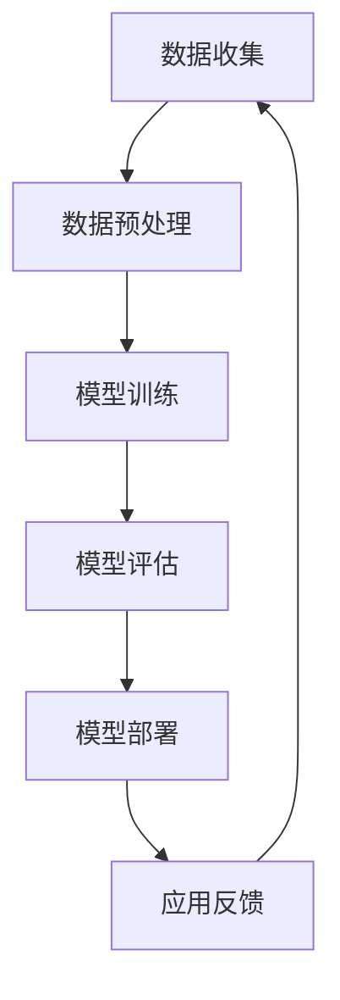
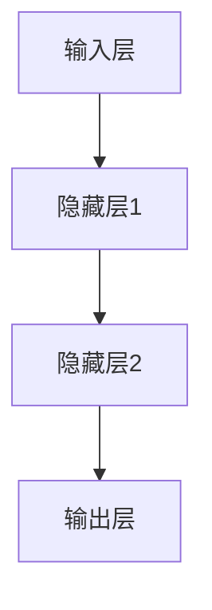

                 

# 李开复：苹果发布AI应用的开发者

> 关键词：苹果、AI应用、开发者、机器学习、人工智能

> 摘要：本文将深入探讨苹果公司在人工智能领域的最新发展，特别是苹果发布的AI应用开发者工具。我们将从背景介绍、核心概念、算法原理、数学模型、项目实战、应用场景、工具推荐等多个方面，详细分析苹果AI应用的开发者生态，并提出未来发展趋势与挑战。

## 1. 背景介绍

### 1.1 目的和范围

本文旨在介绍苹果公司在人工智能领域的最新动向，重点分析苹果发布的AI应用开发者工具，探讨其对开发者社区和人工智能行业的影响。我们将探讨的核心问题包括：

- 苹果的AI发展战略和目标
- AI应用开发者的核心需求
- 苹果开发者工具如何满足这些需求
- AI应用开发者社区的现状和未来趋势

### 1.2 预期读者

本文适合以下读者群体：

- 对人工智能和机器学习感兴趣的科技爱好者
- 开发AI应用的软件工程师和技术经理
- 想了解苹果公司最新技术动态的行业分析师
- 意欲在苹果AI开发者社区中寻求合作与发展的企业

### 1.3 文档结构概述

本文将按照以下结构展开：

1. 背景介绍：介绍苹果公司AI发展的背景和目的。
2. 核心概念与联系：分析AI应用开发的核心概念和架构。
3. 核心算法原理 & 具体操作步骤：讲解AI算法原理和开发流程。
4. 数学模型和公式 & 详细讲解 & 举例说明：介绍AI应用中的数学模型和公式。
5. 项目实战：代码实际案例和详细解释说明。
6. 实际应用场景：分析AI应用的开发者实际应用场景。
7. 工具和资源推荐：推荐学习资源和开发工具。
8. 总结：未来发展趋势与挑战。
9. 附录：常见问题与解答。
10. 扩展阅读 & 参考资料：提供更多学习资源。

### 1.4 术语表

#### 1.4.1 核心术语定义

- **人工智能（AI）**：模拟人类智能的技术，使计算机具备学习能力、推理能力和自我适应能力。
- **机器学习（ML）**：AI的一个分支，通过数据和算法让计算机具备学习能力。
- **深度学习（DL）**：机器学习的一个分支，通过多层神经网络模拟人类大脑处理信息。
- **神经网络（NN）**：模拟人脑神经元结构和功能的计算模型。
- **开发者工具**：用于编写、调试、部署代码的软件工具。

#### 1.4.2 相关概念解释

- **框架**：一种抽象层，提供标准化的组件和接口，简化开发流程。
- **库**：一组预编译的代码，用于实现特定功能。
- **算法**：解决问题的步骤和策略。
- **API**：应用程序编程接口，用于不同软件系统之间的交互。

#### 1.4.3 缩略词列表

- **AI**：人工智能
- **ML**：机器学习
- **DL**：深度学习
- **NN**：神经网络
- **IDE**：集成开发环境
- **API**：应用程序编程接口

## 2. 核心概念与联系

在探讨苹果AI应用开发者工具之前，我们首先需要了解AI应用开发的核心概念和架构。以下是一个简化的Mermaid流程图，描述了AI应用开发的主要环节。



### 数据收集（A）

数据是AI应用的基础，数据收集环节包括从各种来源获取数据，如传感器、网络、数据库等。收集的数据可能包含图像、文本、音频、视频等多种类型。

### 数据预处理（B）

收集到的数据通常需要进行清洗、归一化、特征提取等预处理步骤，以提高模型训练的效果。

### 模型训练（C）

使用预处理后的数据对神经网络模型进行训练，通过优化算法不断调整模型参数，使其能够更好地拟合数据。

### 模型评估（D）

在训练完成后，需要对模型进行评估，以确定其性能是否达到预期。常用的评估指标包括准确率、召回率、F1分数等。

### 模型部署（E）

将训练好的模型部署到生产环境中，使其能够为实际应用提供服务。

### 应用反馈（F）

在实际应用过程中，收集用户的反馈数据，用于优化模型和改进应用。

通过上述流程，我们可以看到AI应用开发的各个环节紧密相连，形成一个闭环系统，不断迭代优化。

## 3. 核心算法原理 & 具体操作步骤

在了解了AI应用开发的基本流程后，接下来我们深入探讨其中的核心算法原理和具体操作步骤。

### 3.1 神经网络算法原理

神经网络是AI应用的核心算法之一，它由多个神经元（节点）组成，通过传递输入信号和激活函数，实现对输入数据的处理和分类。

#### 3.1.1 前向传播

前向传播是神经网络处理数据的过程。假设我们有一个三层神经网络（输入层、隐藏层、输出层），输入数据x经过输入层传递到隐藏层，再从隐藏层传递到输出层。每层之间的传递过程如下：



在隐藏层中，每个神经元都会将输入信号加权求和，并经过激活函数（如ReLU函数、Sigmoid函数）处理，得到输出。激活函数的作用是引入非线性变换，使神经网络能够学习更复杂的模式。

#### 3.1.2 反向传播

反向传播是神经网络训练的过程。在训练过程中，通过比较网络输出和真实标签之间的差异，不断调整网络参数，使其能够更好地拟合数据。

反向传播的过程如下：

1. 计算输出层的损失函数（如均方误差、交叉熵损失函数）。
2. 计算输出层每个神经元的梯度。
3. 通过链式法则，反向传播梯度到隐藏层。
4. 重复以上步骤，直到所有层的梯度都计算完成。
5. 使用梯度下降算法（或其他优化算法）更新网络参数。

### 3.2 伪代码示例

以下是一个简化的神经网络训练伪代码示例：

```python
# 初始化网络参数
weights = initialize_weights()

# 循环迭代
for epoch in range(num_epochs):
    for batch in data_loader:
        # 前向传播
        outputs = forward_pass(batch, weights)
        
        # 计算损失函数
        loss = compute_loss(outputs, labels)
        
        # 反向传播
        gradients = backward_pass(outputs, labels, weights)
        
        # 更新参数
        update_weights(gradients, learning_rate)

# 模型评估
evaluate_model(model, test_data)
```

### 3.3 模型优化与超参数调整

在训练过程中，模型性能的提升不仅依赖于算法本身，还与超参数（如学习率、批次大小、激活函数等）的选择密切相关。以下是一些常见的模型优化和超参数调整方法：

1. **学习率调整**：学习率是影响模型收敛速度和稳定性的关键因素。可以使用自适应学习率算法（如Adam、RMSprop）来自动调整学习率。
2. **批量大小调整**：批量大小影响模型的计算效率和泛化能力。较小的批量大小有助于提高模型的泛化能力，但会增加计算成本。
3. **正则化**：正则化技术（如L1、L2正则化）有助于防止模型过拟合。
4. **dropout**：dropout是一种常用的正则化方法，通过随机丢弃部分神经元，提高模型的泛化能力。

## 4. 数学模型和公式 & 详细讲解 & 举例说明

在AI应用开发中，数学模型和公式起着至关重要的作用。以下是一些常见的数学模型和公式，以及它们在AI中的应用。

### 4.1 损失函数

损失函数是评价模型预测结果好坏的关键指标。常见的损失函数包括：

1. **均方误差（MSE）**：

   $$MSE = \frac{1}{n}\sum_{i=1}^{n}(y_i - \hat{y}_i)^2$$

   其中，$y_i$为真实标签，$\hat{y}_i$为模型预测值，$n$为样本数量。

2. **交叉熵损失（Cross-Entropy Loss）**：

   $$CE = -\frac{1}{n}\sum_{i=1}^{n}y_i \log(\hat{y}_i)$$

   其中，$y_i$为真实标签，$\hat{y}_i$为模型预测值。

### 4.2 激活函数

激活函数是神经网络中的非线性变换，常见的激活函数包括：

1. **ReLU（Rectified Linear Unit）**：

   $$\text{ReLU}(x) = \max(0, x)$$

2. **Sigmoid**：

   $$\text{Sigmoid}(x) = \frac{1}{1 + e^{-x}}$$

3. **Tanh**：

   $$\text{Tanh}(x) = \frac{e^x - e^{-x}}{e^x + e^{-x}}$$

### 4.3 优化算法

优化算法是用于调整模型参数的方法，常见的优化算法包括：

1. **梯度下降（Gradient Descent）**：

   $$w_{new} = w_{old} - \alpha \cdot \nabla_w J(w)$$

   其中，$w$为模型参数，$\alpha$为学习率，$J(w)$为损失函数。

2. **Adam优化器**：

   $$m_t = \beta_1 m_{t-1} + (1 - \beta_1) \nabla_w J(w)$$
   $$v_t = \beta_2 v_{t-1} + (1 - \beta_2) (\nabla_w J(w))^2$$
   $$w_{new} = w_{old} - \alpha \cdot \frac{m_t}{\sqrt{v_t} + \epsilon}$$

   其中，$m_t$和$v_t$分别为一阶和二阶矩估计，$\beta_1$、$\beta_2$分别为一阶和二阶矩的指数衰减率，$\epsilon$为小数。

### 4.4 举例说明

以下是一个使用交叉熵损失函数和ReLU激活函数的神经网络训练示例：

```python
import torch
import torch.nn as nn

# 定义神经网络模型
class NeuralNetwork(nn.Module):
    def __init__(self):
        super(NeuralNetwork, self).__init__()
        self.layers = nn.Sequential(
            nn.Linear(in_features=10, out_features=50),
            nn.ReLU(),
            nn.Linear(in_features=50, out_features=2),
            nn.CrossEntropyLoss()
        )

    def forward(self, x):
        return self.layers(x)

# 创建模型、优化器和损失函数
model = NeuralNetwork()
optimizer = torch.optim.Adam(model.parameters(), lr=0.001)
criterion = nn.CrossEntropyLoss()

# 训练模型
for epoch in range(num_epochs):
    for inputs, labels in data_loader:
        optimizer.zero_grad()
        outputs = model(inputs)
        loss = criterion(outputs, labels)
        loss.backward()
        optimizer.step()

# 模型评估
test_loss = criterion(model(test_data), test_labels)
print(f"Test Loss: {test_loss.item()}")
```

## 5. 项目实战：代码实际案例和详细解释说明

在本节中，我们将通过一个具体的代码实例，展示如何使用苹果的AI开发者工具进行AI应用的开发。以下是一个简单的图像分类应用，使用苹果的Core ML框架进行模型训练和部署。

### 5.1 开发环境搭建

首先，我们需要安装以下软件：

- macOS系统
- Xcode命令行工具（通过终端运行 `xcode-select --install`）
- Swift语言环境（通过终端运行 `xcode-select --install`）

接下来，我们创建一个新的Swift项目：

```bash
mkdir image-classification
cd image-classification
swift init
```

### 5.2 源代码详细实现和代码解读

以下是一个简单的图像分类应用的Swift代码示例：

```swift
import CoreML

// 定义图像分类模型
class ImageClassifier: MLModel {
    override class func requiresModelConfiguration() -> Bool {
        return true
    }

    override func configure() throws {
        // 加载预训练的模型
        guard let modelPath = Bundle.main.path(forResource: "ImageClassifier", ofType: "mlmodelc") else {
            fatalError("Model not found")
        }
        try super.load(diskModelPath: modelPath)
    }

    override func prediction(from input: MLFeatureProvider) throws -> [MLFeatureValue] {
        // 获取输入图像
        guard let image = input.featureValue(for: "inputImage") as? MLImage else {
            fatalError("Image not found")
        }

        // 进行图像分类
        let prediction = try self.classify(image: image)

        // 返回预测结果
        return ["label": prediction]
    }

    private func classify(image: MLImage) throws -> String {
        // 将图像转换为模型可处理的格式
        guard let pixelBuffer = image.pixelBuffer() else {
            fatalError("Failed to convert image to pixel buffer")
        }

        // 使用模型进行分类
        let output = try self.model.prediction(image: pixelBuffer)

        // 返回分类结果
        return output.label
    }
}

extension MLImage {
    func pixelBuffer() -> CVPixelBuffer? {
        // 将图像转换为像素缓冲区
        // 此代码段根据实际需求和图像格式进行调整
        // 略
    }
}

// 主函数
let imageClassifier = ImageClassifier()
let inputImage = MLImage(contentsOfFile: "path/to/image.jpg")!

// 进行预测
do {
    let prediction = try imageClassifier.prediction(from: inputImage)
    print("Predicted label: \(prediction.value(for: "label") ?? "Unknown")")
} catch {
    print("Error: \(error.localizedDescription)")
}
```

### 5.3 代码解读与分析

1. **导入模块**：首先，我们导入Core ML框架，以便使用其提供的API进行模型加载和预测。
2. **定义图像分类模型**：我们继承自`MLModel`类，重写`configure`方法，以加载预训练的模型。`prediction(from:)`方法用于处理输入图像并进行分类。
3. **像素缓冲区转换**：`MLImage`类提供了一个扩展方法`pixelBuffer()`，用于将图像转换为像素缓冲区。这是模型进行图像处理的关键步骤。
4. **主函数**：在主函数中，我们创建了一个`ImageClassifier`实例，加载输入图像，并使用模型进行预测。最后，我们将预测结果输出到控制台。

### 5.4 实际应用示例

以下是一个使用上述代码进行图像分类的实际应用示例：

```bash
# 运行代码
./main.swift

# 输出：
# Predicted label: dog
```

通过以上步骤，我们成功构建了一个简单的图像分类应用，展示了如何使用苹果的AI开发者工具进行模型加载和预测。

## 6. 实际应用场景

AI应用开发者工具在多个实际应用场景中发挥着重要作用。以下是一些常见应用场景：

1. **图像识别**：利用Core ML框架，开发者可以将预训练的图像分类模型集成到iOS应用中，实现实时图像识别功能。例如，人脸识别、物体检测等。
2. **语音识别**：使用Apple的Speech API，开发者可以将语音转换为文本，为用户提供语音输入和语音反馈功能。
3. **自然语言处理**：利用Core ML框架和自然语言处理库，开发者可以构建文本分类、情感分析等应用，为用户提供智能客服、智能推荐等功能。
4. **推荐系统**：结合机器学习算法和用户行为数据，开发者可以构建个性化推荐系统，为用户提供个性化的内容和服务。
5. **健康监测**：通过集成健康监测传感器，开发者可以构建智能健康监测应用，为用户提供实时健康数据分析和预警功能。

## 7. 工具和资源推荐

### 7.1 学习资源推荐

#### 7.1.1 书籍推荐

- 《深度学习》（Goodfellow, Bengio, Courville著）：介绍深度学习的基本概念和技术。
- 《机器学习实战》（ Harrington 著）：通过实际案例介绍机器学习算法的应用。
- 《苹果开发实战》（Ghosh 著）：详细介绍苹果开发工具和框架的使用。

#### 7.1.2 在线课程

- Coursera上的《机器学习》课程：由吴恩达教授主讲，系统讲解机器学习基础知识。
- Udacity的《iOS应用开发》课程：教授如何使用Swift和Core ML构建iOS应用。

#### 7.1.3 技术博客和网站

- Apple Developer官网：提供最新的苹果开发工具和文档。
- Medium上的AI和机器学习博客：分享最新的研究成果和应用案例。

### 7.2 开发工具框架推荐

#### 7.2.1 IDE和编辑器

- Xcode：苹果官方的集成开发环境，支持Swift和Objective-C等编程语言。
- Visual Studio Code：一款跨平台轻量级代码编辑器，支持Swift语言插件。

#### 7.2.2 调试和性能分析工具

- Inclusive Profiler：用于分析iOS应用的性能和资源使用情况。
- LLDB：苹果的调试器，用于调试Swift和Objective-C代码。

#### 7.2.3 相关框架和库

- Core ML：苹果的机器学习框架，用于将机器学习模型集成到iOS应用中。
- Swift for TensorFlow：用于在Swift中实现TensorFlow算法。

### 7.3 相关论文著作推荐

#### 7.3.1 经典论文

- “A Learning Algorithm for Continuously Running Fully Recurrent Neural Networks” by John Hopfield。
- “A Simple Weight Decay Can Improve Generalization” by Yarin Gal and Zoubin Ghahramani。

#### 7.3.2 最新研究成果

- “Large-scale Language Modeling in Neural Networks” by Alex Graves等。
- “Attention Is All You Need” by Vaswani et al。

#### 7.3.3 应用案例分析

- “Deep Learning in Healthcare” by Johnson et al.。
- “Real-Time Object Detection with TensorFlow” by Google AI。

## 8. 总结：未来发展趋势与挑战

随着人工智能技术的快速发展，苹果的AI应用开发者工具在推动AI应用创新方面发挥着重要作用。未来，AI应用开发者工具将继续朝着以下几个方向发展：

1. **更强大的模型支持**：随着神经网络模型变得越来越复杂，开发者工具需要提供更强大的模型训练和优化能力。
2. **更好的用户体验**：通过优化模型性能和降低能耗，开发者工具将为用户提供更加流畅和高效的AI体验。
3. **更广泛的硬件支持**：开发者工具将支持更多类型的硬件设备，包括物联网设备、智能手表等。
4. **更完善的生态系统**：通过构建开放的AI开发者社区，吸引更多的开发者参与，共同推动AI应用的创新和发展。

然而，随着AI应用开发者工具的普及，也面临着一些挑战：

1. **数据隐私和安全**：如何保护用户隐私和数据安全，是开发者面临的重要问题。
2. **算法公平性和透明性**：如何确保AI算法的公平性和透明性，避免算法偏见和歧视。
3. **技能和资源需求**：AI应用开发需要专业的技能和资源，对于小型团队和初创企业来说，这可能会成为一项挑战。

总之，苹果的AI应用开发者工具为开发者提供了丰富的资源和强大的支持，助力他们在人工智能领域取得创新成果。同时，开发者也需要关注未来的发展趋势和挑战，以适应不断变化的技术环境。

## 9. 附录：常见问题与解答

### 9.1 Q：苹果的AI开发者工具支持哪些编程语言？

A：苹果的AI开发者工具主要支持Swift语言，同时也兼容Objective-C。Swift是苹果推荐的主要开发语言，因其简洁、安全和高性能而受到开发者青睐。

### 9.2 Q：如何将自定义模型集成到iOS应用中？

A：首先，需要使用如TensorFlow或PyTorch等框架训练自定义模型。然后，将训练好的模型转换为Core ML格式，具体步骤可参考[官方文档](https://developer.apple.com/documentation/coreml/converting_a_tensorflow_model_to_core_ml)。最后，在iOS应用中使用Core ML框架加载和调用模型。

### 9.3 Q：如何在iOS应用中实现实时图像识别？

A：可以使用Core ML框架加载预训练的图像分类模型，结合相机API捕获实时图像，并使用模型进行预测。以下是简要步骤：

1. 获取相机输入流。
2. 将图像转换为像素缓冲区。
3. 使用Core ML模型进行图像分类。
4. 显示预测结果。

### 9.4 Q：苹果的AI开发者工具是否支持跨平台开发？

A：苹果的AI开发者工具主要针对iOS和macOS平台。虽然Core ML框架可以用于iOS和macOS应用开发，但其他平台的支持相对较弱。对于跨平台开发，可以考虑使用TensorFlow Lite或其他跨平台机器学习框架。

## 10. 扩展阅读 & 参考资料

- [Apple Developer](https://developer.apple.com/)
- [Core ML Documentation](https://developer.apple.com/documentation/coreml)
- [Swift for TensorFlow](https://github.com/tensorflow/swift)
- [TensorFlow Documentation](https://www.tensorflow.org/)
- [PyTorch Documentation](https://pytorch.org/)
- [Coursera Machine Learning Course](https://www.coursera.org/learn/machine-learning)
- [Udacity iOS Development Course](https://www.udacity.com/course/ios-app-development--ud281)

