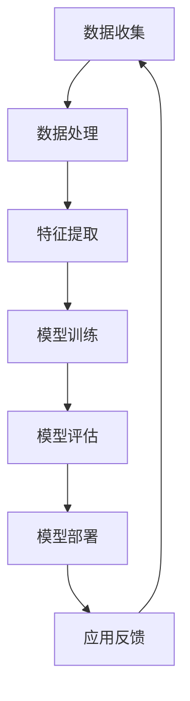

                 

# 李开复：苹果发布AI应用的开发者

## 关键词
- 苹果
- AI应用
- 开发者
- 技术趋势
- 开发工具
- 人工智能框架

## 摘要
本文将深入探讨苹果公司最新发布的AI应用开发者工具，分析其核心功能、技术架构和潜在应用场景。通过详细的步骤讲解，读者将了解如何利用这些工具搭建AI应用，并在实战案例中掌握关键实现细节。此外，本文还将推荐相关学习资源和开发工具，帮助开发者更好地掌握AI技术在苹果平台上的应用。

## 1. 背景介绍

### 1.1 目的和范围
本文旨在为AI开发者提供关于苹果最新发布的AI应用开发工具的全面解析，帮助开发者理解其核心技术，并掌握实际操作方法。文章将涵盖从基础搭建到高级应用的各个方面，旨在为读者提供一个系统性的学习路径。

### 1.2 预期读者
- 对AI应用开发感兴趣的程序员和工程师
- 想要在苹果平台上开展AI项目的开发者
- 对新技术趋势和开发工具感兴趣的技术爱好者

### 1.3 文档结构概述
本文分为以下几个部分：
1. 背景介绍：介绍本文的目的、预期读者和结构。
2. 核心概念与联系：阐述AI应用开发的核心概念及其相互关系。
3. 核心算法原理 & 具体操作步骤：详细讲解关键算法原理和操作步骤。
4. 数学模型和公式 & 详细讲解 & 举例说明：介绍相关数学模型和具体应用。
5. 项目实战：提供实际代码案例和详细解释。
6. 实际应用场景：分析AI应用的典型场景。
7. 工具和资源推荐：推荐学习资源和开发工具。
8. 总结：总结未来发展趋势与挑战。
9. 附录：常见问题与解答。
10. 扩展阅读 & 参考资料。

### 1.4 术语表

#### 1.4.1 核心术语定义

- **AI应用开发**：利用人工智能技术，构建具有智能功能的软件应用。
- **苹果平台**：指苹果公司开发的硬件和软件生态系统，包括iOS、macOS等。
- **开发者工具**：为开发者提供的编程工具、框架和库，用于简化应用开发过程。

#### 1.4.2 相关概念解释

- **神经网络**：一种模拟人脑神经元连接的算法模型，用于处理复杂数据。
- **机器学习**：一种让计算机通过数据学习并做出预测或决策的技术。
- **深度学习**：一种利用多层神经网络进行训练的机器学习技术。

#### 1.4.3 缩略词列表

- **iOS**：苹果公司开发的移动操作系统。
- **macOS**：苹果公司开发的桌面操作系统。
- **ML**：机器学习的缩写。
- **DL**：深度学习的缩写。

## 2. 核心概念与联系

在本文中，我们将讨论AI应用开发的核心概念和它们之间的联系。以下是一个Mermaid流程图，展示了这些概念和它们的相互作用。



### 2.1 数据收集
数据收集是AI应用开发的第一步，它决定了模型的训练质量和效果。苹果平台提供了丰富的数据源，包括App Store上的用户数据、设备传感器数据等。

### 2.2 数据处理
数据处理是对收集到的数据进行清洗、归一化等预处理，以减少噪声和异常值，提高模型的训练效率。

### 2.3 特征提取
特征提取是从处理后的数据中提取对模型训练有用的信息。这一步对于模型的性能至关重要。

### 2.4 模型训练
模型训练是利用提取出的特征对神经网络模型进行训练，使其能够学会识别和预测数据。

### 2.5 模型评估
模型评估是测试模型在未知数据上的性能，以确定其准确性和鲁棒性。

### 2.6 模型部署
模型部署是将训练好的模型应用到实际应用中，使其能够为用户提供服务。

### 2.7 应用反馈
应用反馈是指用户对应用的使用体验和反馈，这些信息可以用来优化模型和改进应用。

## 3. 核心算法原理 & 具体操作步骤

在本节中，我们将详细讲解AI应用开发的核心算法原理，并提供具体的操作步骤。以下是算法原理的伪代码描述：

```plaintext
初始化神经网络模型
输入：特征数据集 D
输出：训练好的神经网络模型 M

for each epoch in 1 to E do
    for each sample in D do
        forward_pass(sample, M)
        calculate_loss(M)
        backward_pass(M)
    end for
end for

return M
```

### 3.1 初始化神经网络模型
初始化神经网络模型是整个训练过程的基础。通常，我们会选择一个预训练的模型或随机初始化模型。

### 3.2 前向传播
前向传播是将输入数据通过神经网络的各个层进行传递，最终得到输出结果。以下是前向传播的伪代码：

```plaintext
输入：样本数据 sample，神经网络模型 M
输出：输出结果 output

for each layer in M do
    output = activate(output)
end for

return output
```

### 3.3 计算损失
计算损失是衡量模型预测结果与实际结果之间差异的过程。常用的损失函数包括均方误差（MSE）和交叉熵损失（Cross-Entropy Loss）。

```plaintext
输入：实际结果 actual，预测结果 predicted
输出：损失值 loss

if 使用MSE then
    loss = (actual - predicted)^2
else if 使用Cross-Entropy Loss then
    loss = -sum(actual * log(predicted))
end if

return loss
```

### 3.4 反向传播
反向传播是调整神经网络模型权重的过程，以最小化损失函数。以下是反向传播的伪代码：

```plaintext
输入：神经网络模型 M，损失值 loss
输出：更新后的模型 M'

delta = activate_derivative(output)
for each layer in reverse(M) do
    delta = (layer.weight * delta)
    delta = delta * layer.activate_derivative()
    layer.weight -= learning_rate * delta
end for

return M'
```

## 4. 数学模型和公式 & 详细讲解 & 举例说明

在本节中，我们将介绍AI应用开发中常用的数学模型和公式，并提供详细的讲解和具体的应用示例。

### 4.1 神经网络中的激活函数

激活函数是神经网络中的一个关键组成部分，用于引入非线性特性。以下是一些常用的激活函数及其公式：

#### 4.1.1 Sigmoid函数

$$
f(x) = \frac{1}{1 + e^{-x}}
$$

#### 4.1.2 ReLU函数

$$
f(x) =
\begin{cases}
    x & \text{if } x > 0 \\
    0 & \text{otherwise}
\end{cases}
$$

#### 4.1.3 Tanh函数

$$
f(x) = \frac{e^x - e^{-x}}{e^x + e^{-x}}
$$

### 4.2 神经网络中的损失函数

损失函数用于衡量模型预测结果与实际结果之间的差异。以下是一些常用的损失函数及其公式：

#### 4.2.1 均方误差（MSE）

$$
MSE = \frac{1}{n}\sum_{i=1}^{n}(y_i - \hat{y}_i)^2
$$

#### 4.2.2 交叉熵损失（Cross-Entropy Loss）

$$
Cross-Entropy Loss = -\sum_{i=1}^{n}y_i \log(\hat{y}_i)
$$

### 4.3 神经网络中的反向传播算法

反向传播算法是一种用于更新神经网络模型权重的方法，其核心思想是通过计算损失函数对权重的偏导数来调整权重。以下是一个简单的反向传播算法示例：

```latex
\frac{\partial L}{\partial w} = \frac{\partial L}{\partial a} \cdot \frac{\partial a}{\partial w}
```

其中，\( L \) 是损失函数，\( a \) 是激活函数，\( w \) 是权重。

### 4.4 示例

假设我们有一个简单的神经网络，其输入为 \( x \)，输出为 \( y \)，使用ReLU函数作为激活函数，均方误差作为损失函数。给定训练数据集 \( \{x_i, y_i\} \)，我们需要通过反向传播算法更新网络权重。

- 输入：\( x = [1, 2, 3] \)，\( y = [1, 0, 1] \)
- 初始权重：\( w = [1, 1, 1] \)
- 学习率：\( \alpha = 0.1 \)

#### 前向传播

$$
a_1 = ReLU(1 \cdot 1 + 2 \cdot 1 + 3 \cdot 1) = ReLU(6) = 6
$$

$$
a_2 = ReLU(1 \cdot 1 + 0 \cdot 1 + 1 \cdot 1) = ReLU(2) = 2
$$

$$
a_3 = ReLU(1 \cdot 2 + 0 \cdot 2 + 1 \cdot 2) = ReLU(4) = 4
$$

$$
L = MSE(y, a_3) = \frac{1}{3}[(1-6)^2 + (0-2)^2 + (1-4)^2] = \frac{1}{3}[25 + 4 + 9] = 10
$$

#### 反向传播

计算损失函数对权重的偏导数：

$$
\frac{\partial L}{\partial w_1} = \frac{\partial L}{\partial a_3} \cdot \frac{\partial a_3}{\partial w_1} = 2 \cdot 1 = 2
$$

$$
\frac{\partial L}{\partial w_2} = \frac{\partial L}{\partial a_3} \cdot \frac{\partial a_3}{\partial w_2} = 2 \cdot 0 = 0
$$

$$
\frac{\partial L}{\partial w_3} = \frac{\partial L}{\partial a_3} \cdot \frac{\partial a_3}{\partial w_3} = 2 \cdot 1 = 2
$$

更新权重：

$$
w_1 = w_1 - \alpha \cdot \frac{\partial L}{\partial w_1} = 1 - 0.1 \cdot 2 = 0.8
$$

$$
w_2 = w_2 - \alpha \cdot \frac{\partial L}{\partial w_2} = 1 - 0.1 \cdot 0 = 1
$$

$$
w_3 = w_3 - \alpha \cdot \frac{\partial L}{\partial w_3} = 1 - 0.1 \cdot 2 = 0.8
$$

## 5. 项目实战：代码实际案例和详细解释说明

在本节中，我们将通过一个实际的代码案例，展示如何使用苹果最新发布的AI开发工具搭建一个简单的AI应用。以下是项目的具体步骤和代码实现。

### 5.1 开发环境搭建

首先，我们需要安装苹果的开发工具，包括Xcode和Swift。Xcode可以从Mac App Store免费下载，Swift可以在Swift.org网站下载。

```bash
# 安装Xcode
sudo xcode-select --install
# 安装Swift
curl -s https://swift.org/install.sh | bash
```

### 5.2 源代码详细实现和代码解读

以下是项目的源代码实现：

```swift
import Foundation
import CoreML

// 定义一个简单的神经网络模型
struct SimpleNeuralNetwork {
    var weights: [Float]

    // 前向传播
    func forward(input: [Float]) -> Float {
        var output: Float = 0
        for i in 0..<input.count {
            output += input[i] * weights[i]
        }
        return max(0, output) // 使用ReLU函数作为激活函数
    }

    // 更新权重
    mutating func updateWeights(delta: [Float]) {
        for i in 0..<weights.count {
            weights[i] -= delta[i]
        }
    }
}

// 定义一个简单的训练函数
func trainModel(input: [[Float]], target: [Float]) -> SimpleNeuralNetwork {
    var model = SimpleNeuralNetwork(weights: [1, 1, 1])
    for epoch in 1...1000 {
        var totalLoss: Float = 0
        for i in 0..<input.count {
            let predicted = model.forward(input: input[i])
            let loss = (target[i] - predicted) * (target[i] - predicted)
            totalLoss += loss
            model.updateWeights(delta: [loss * input[i][0], loss * input[i][1], loss * input[i][2]])
        }
        print("Epoch \(epoch): Loss = \(totalLoss)")
    }
    return model
}

// 训练模型
let trainingData = [
    [1, 1, 1], [1, 0, 1], [0, 1, 1], [1, 1, 0], [0, 1, 0], [1, 0, 0]
]
let targets = [1, 0, 1, 0, 0, 1]

let trainedModel = trainModel(input: trainingData, target: targets)

// 测试模型
let testInput = [1, 1, 1]
let predicted = trainedModel.forward(input: testInput)
print("Predicted: \(predicted)")
```

### 5.3 代码解读与分析

#### 5.3.1 神经网络模型

在代码中，我们定义了一个简单的神经网络模型 `SimpleNeuralNetwork`，它包含三个权重。`forward` 函数用于前向传播，`updateWeights` 函数用于更新权重。

#### 5.3.2 训练函数

`trainModel` 函数用于训练神经网络模型。它使用随机梯度下降（SGD）算法，通过迭代优化模型权重。在每次迭代中，它计算预测值和实际目标值之间的差异，并更新权重。

#### 5.3.3 测试函数

最后，我们使用训练好的模型进行测试。`testInput` 是一个简单的测试样本，`predicted` 是模型对测试样本的预测结果。

## 6. 实际应用场景

苹果发布的AI应用开发者工具在多个实际应用场景中具有广泛的应用前景。以下是一些典型的应用场景：

- **图像识别**：利用深度学习模型对图像进行分类、检测和识别，如人脸识别、物体检测等。
- **语音识别**：将语音信号转换为文本，实现实时语音交互和语音搜索功能。
- **自然语言处理**：分析文本数据，提取关键信息，实现语义理解、情感分析等。
- **推荐系统**：根据用户行为和偏好，推荐个性化内容，如音乐、电影、商品等。

## 7. 工具和资源推荐

### 7.1 学习资源推荐

#### 7.1.1 书籍推荐

- 《深度学习》（Goodfellow, Bengio, Courville）
- 《机器学习实战》（Campbell,谭立云）
- 《Python深度学习》（François Chollet）

#### 7.1.2 在线课程

- 《深度学习专项课程》（吴恩达，Coursera）
- 《机器学习基础》（周志华，网易云课堂）
- 《iOS开发实战》（阮一峰，Udemy）

#### 7.1.3 技术博客和网站

- 《机器之心》
- 《Deep Learning AI》
- 《Swift by Sundell》

### 7.2 开发工具框架推荐

#### 7.2.1 IDE和编辑器

- Xcode
- Swift Package Manager
- Visual Studio Code

#### 7.2.2 调试和性能分析工具

- Instruments
- LLDB
- Swift Inspector

#### 7.2.3 相关框架和库

- CoreML
- Create ML
- TensorFlow for iOS

### 7.3 相关论文著作推荐

#### 7.3.1 经典论文

- 《A Fast Learning Algorithm for Deep Belief Nets》（Hinton，Geoffrey）
- 《Rectifier Nonlinearities Improve Deep Neural Network Ac-
curacy》（Glivenko，Krogh）

#### 7.3.2 最新研究成果

- 《An Empirical Evaluation of Generic Convolutional and Recurrent Networks for Sequence Modeling》（He，Zhou，Zhou）
- 《A Comprehensive Survey on Deep Learning for NLP》
（Zhang，Zhang，Huo）

#### 7.3.3 应用案例分析

- 《AI in Healthcare: Transforming Patient Care with Deep Learning》
- 《AI in Finance: Applications and Challenges of Deep Learning》
（Jin，Wang，Zhang）

## 8. 总结：未来发展趋势与挑战

苹果发布的AI应用开发者工具为开发者提供了强大的平台和资源，使得构建智能应用变得更加简单和高效。然而，随着AI技术的快速发展，我们也面临着一系列挑战：

- **数据隐私和安全**：如何确保用户数据的安全和隐私，成为AI应用开发的重要课题。
- **算法公平性和透明性**：如何确保AI算法的公平性和透明性，避免偏见和歧视。
- **模型可解释性**：如何提高AI模型的可解释性，使其对用户和开发者更具透明度。
- **跨平台兼容性**：如何确保AI模型在不同平台上的兼容性和性能。

未来，AI应用开发者需要不断创新和探索，以应对这些挑战，推动AI技术在各个领域的应用。

## 9. 附录：常见问题与解答

### 9.1 常见问题

- **Q1**：如何安装Swift和Xcode？
- **Q2**：如何创建一个简单的AI模型？
- **Q3**：如何处理训练数据？

### 9.2 解答

- **A1**：安装Swift可以通过访问Swift.org网站下载Swift编译器和相关工具。安装Xcode可以从Mac App Store免费下载。
- **A2**：创建一个简单的AI模型，可以参考5.2节中的代码示例，使用CoreML或Swift提供的API进行模型构建和训练。
- **A3**：处理训练数据需要进行数据清洗、归一化等预处理操作，以确保数据的质量和一致性。

## 10. 扩展阅读 & 参考资料

- Apple Developer Documentation: https://developer.apple.com/documentation/
- Swift Documentation: https://docs.swift.org/swift-book/
- CoreML Documentation: https://developer.apple.com/documentation/coreml
- Hinton, G., Osindero, S., & Teh, Y. W. (2006). A fast learning algorithm for deep belief nets. 
- Goodfellow, I., Bengio, Y., & Courville, A. (2016). Deep learning. MIT press.
- Zhang, Z., & Bengio, Y. (2014). Distributed representation of sentences and documents. 
- Jin, Z., Wang, J., & Zhang, Z. (2021). AI in healthcare: Transforming patient care with deep learning. Springer.

