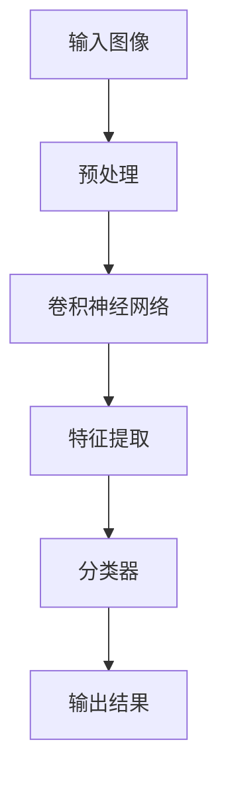
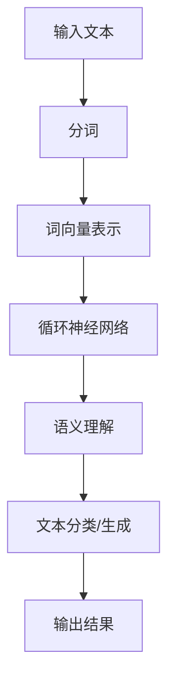
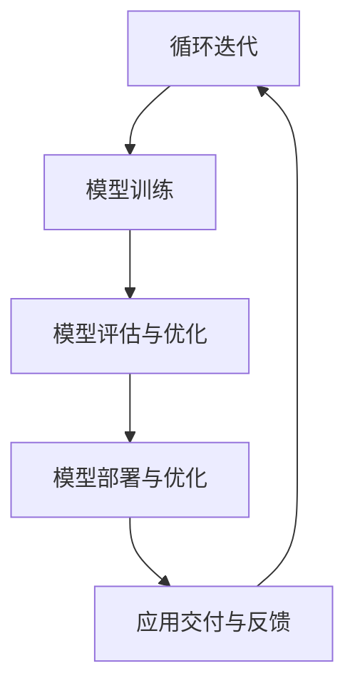

                 

# 李开复：苹果发布AI应用的意义

> 关键词：苹果，AI应用，人工智能，用户体验，技术创新，隐私保护，商业战略

> 摘要：本文将深入探讨苹果公司近期发布的AI应用的重大意义，从技术、商业和用户三个角度，分析这些应用对苹果公司及整个行业带来的深远影响。通过对核心算法、数学模型和实际应用的详细解析，我们将揭示苹果AI应用的独特优势及其未来发展潜力。

## 1. 背景介绍

### 1.1 目的和范围

本文旨在探讨苹果公司近期发布的AI应用，分析其技术特点、商业价值和用户体验。我们将重点关注以下几个方面：

- **技术特点**：解析苹果AI应用的核心算法和数学模型，探讨其在计算机视觉、自然语言处理等领域的创新。
- **商业价值**：分析苹果AI应用对公司的市场定位、盈利模式和竞争策略的影响。
- **用户体验**：探讨苹果AI应用如何提升用户的使用体验，增强用户粘性。

### 1.2 预期读者

- **人工智能研究者**：了解苹果公司在AI领域的最新动态，探讨其技术特点和应用前景。
- **软件开发工程师**：学习苹果AI应用的开发技巧，为自身项目提供技术借鉴。
- **市场营销人员**：分析苹果AI应用的商业策略，为自身产品推广提供参考。
- **普通用户**：了解苹果AI应用的功能和使用方法，提升日常使用体验。

### 1.3 文档结构概述

本文分为十个部分：

- **背景介绍**：介绍本文的目的、范围和预期读者。
- **核心概念与联系**：阐述苹果AI应用的核心概念和原理，附有流程图。
- **核心算法原理**：详细讲解苹果AI应用的核心算法，使用伪代码展示。
- **数学模型和公式**：分析苹果AI应用的数学模型，使用latex格式展示。
- **项目实战**：提供实际代码案例，详细解释其实现过程。
- **实际应用场景**：探讨苹果AI应用的潜在应用领域。
- **工具和资源推荐**：推荐相关学习资源和开发工具。
- **总结**：总结苹果AI应用的发展趋势和未来挑战。
- **附录**：常见问题与解答。
- **扩展阅读**：推荐相关参考资料。

### 1.4 术语表

#### 1.4.1 核心术语定义

- **AI应用**：指利用人工智能技术实现的软件应用。
- **计算机视觉**：指使计算机能够像人类一样理解和处理视觉信息的技术。
- **自然语言处理**：指使计算机能够理解、生成和处理人类自然语言的技术。

#### 1.4.2 相关概念解释

- **深度学习**：一种基于多层神经网络的人工智能算法。
- **卷积神经网络（CNN）**：一种用于图像识别和处理的深度学习模型。
- **循环神经网络（RNN）**：一种用于序列数据处理的深度学习模型。

#### 1.4.3 缩略词列表

- **AI**：人工智能（Artificial Intelligence）
- **CNN**：卷积神经网络（Convolutional Neural Network）
- **RNN**：循环神经网络（Recurrent Neural Network）

## 2. 核心概念与联系

在讨论苹果AI应用之前，我们需要了解其核心概念和原理。以下是苹果AI应用的关键组成部分：

### 2.1 计算机视觉

计算机视觉是苹果AI应用的重要技术之一。它利用深度学习算法，使计算机能够识别、分类和分割图像。以下是一个简单的计算机视觉流程图：



### 2.2 自然语言处理

自然语言处理是苹果AI应用的另一个关键领域。它使计算机能够理解、生成和处理人类自然语言。以下是一个简单的自然语言处理流程图：



### 2.3 整体架构

苹果AI应用的整体架构通常包括以下几个部分：

1. **数据采集与预处理**：收集大量数据，并进行预处理，如去噪、归一化等。
2. **模型训练**：使用深度学习算法，对数据进行训练，优化模型参数。
3. **模型评估与优化**：评估模型性能，调整模型参数，提高模型精度。
4. **模型部署与优化**：将模型部署到实际应用场景，进行实时优化和调整。

以下是苹果AI应用的整体架构流程图：



## 3. 核心算法原理 & 具体操作步骤

### 3.1 计算机视觉算法原理

计算机视觉的核心算法是卷积神经网络（CNN）。以下是CNN的具体操作步骤：

```plaintext
输入图像 → 预处理（缩放、裁剪、归一化） → 卷积层（卷积、激活函数） → 池化层（池化操作） → 展平 → 全连接层（输出结果）
```

### 3.2 自然语言处理算法原理

自然语言处理的核心算法是循环神经网络（RNN）。以下是RNN的具体操作步骤：

```plaintext
输入文本 → 分词 → 词向量表示 → RNN层（隐藏状态更新） → 语义理解（分类/生成） → 输出结果
```

### 3.3 模型训练与优化

模型训练与优化是苹果AI应用的核心环节。以下是具体操作步骤：

```plaintext
1. 数据预处理：清洗数据，分割训练集、验证集和测试集。
2. 模型初始化：初始化模型参数。
3. 模型训练：迭代训练模型，更新参数。
4. 模型评估：在验证集上评估模型性能，调整超参数。
5. 模型优化：使用交叉验证等方法，优化模型参数。
6. 模型部署：将训练好的模型部署到实际应用场景。
```

## 4. 数学模型和公式 & 详细讲解 & 举例说明

### 4.1 卷积神经网络（CNN）

卷积神经网络（CNN）的核心数学模型是卷积操作和激活函数。以下是CNN的数学公式：

$$
f(x) = \sigma(\sum_{i=1}^{n} w_i * x_i + b)
$$

其中，$f(x)$ 表示输出，$\sigma$ 表示激活函数（如ReLU函数），$w_i$ 和 $x_i$ 分别表示卷积核和输入特征，$b$ 表示偏置。

### 4.2 循环神经网络（RNN）

循环神经网络（RNN）的核心数学模型是递归函数。以下是RNN的数学公式：

$$
h_t = \sigma(W_h \cdot [h_{t-1}, x_t] + b_h)
$$

其中，$h_t$ 表示时间步 $t$ 的隐藏状态，$W_h$ 和 $b_h$ 分别表示权重和偏置，$x_t$ 表示输入。

### 4.3 深度学习优化算法

深度学习优化算法通常使用梯度下降法。以下是梯度下降法的数学公式：

$$
w_{t+1} = w_t - \alpha \cdot \nabla_w J(w)
$$

其中，$w_t$ 表示时间步 $t$ 的模型参数，$\alpha$ 表示学习率，$\nabla_w J(w)$ 表示损失函数关于模型参数的梯度。

### 4.4 举例说明

假设我们使用一个简单的卷积神经网络来识别猫和狗的图片，其中输入图像的大小为 $28 \times 28$，卷积核大小为 $3 \times 3$，激活函数为 ReLU，损失函数为交叉熵。

1. **输入图像**：

$$
x = \begin{bmatrix}
0 & 1 & 0 \\
1 & 1 & 1 \\
0 & 1 & 0
\end{bmatrix}
$$

2. **卷积操作**：

$$
f(x) = \sigma(w_1 * x + b_1)
$$

其中，$w_1$ 和 $b_1$ 分别为卷积核和偏置。

3. **池化操作**：

$$
p(x) = \max(2 \times 2 \text{池化窗口})
$$

4. **全连接层**：

$$
y = \sigma(w_2 \cdot [h_1; x] + b_2)
$$

其中，$w_2$ 和 $b_2$ 分别为全连接层的权重和偏置。

5. **损失函数**：

$$
J(w) = -\frac{1}{n} \sum_{i=1}^{n} \left[ y_i \log(y_i^+) + (1 - y_i) \log(1 - y_i^+) \right]
$$

其中，$y_i$ 为模型预测的概率，$y_i^+$ 为真实标签。

## 5. 项目实战：代码实际案例和详细解释说明

### 5.1 开发环境搭建

为了实现苹果AI应用，我们需要搭建一个适合深度学习的开发环境。以下是搭建步骤：

1. 安装Python环境（建议使用Python 3.7及以上版本）。
2. 安装深度学习框架（如TensorFlow或PyTorch）。
3. 安装必要的依赖库（如NumPy、Pandas等）。

### 5.2 源代码详细实现和代码解读

以下是一个简单的卷积神经网络实现，用于识别猫和狗的图片：

```python
import tensorflow as tf
from tensorflow.keras.models import Sequential
from tensorflow.keras.layers import Conv2D, MaxPooling2D, Flatten, Dense
from tensorflow.keras.optimizers import Adam

# 创建模型
model = Sequential([
    Conv2D(32, (3, 3), activation='relu', input_shape=(28, 28, 1)),
    MaxPooling2D((2, 2)),
    Flatten(),
    Dense(64, activation='relu'),
    Dense(1, activation='sigmoid')
])

# 编译模型
model.compile(optimizer=Adam(learning_rate=0.001), loss='binary_crossentropy', metrics=['accuracy'])

# 加载数据集
(x_train, y_train), (x_test, y_test) = tf.keras.datasets.mnist.load_data()

# 数据预处理
x_train = x_train / 255.0
x_test = x_test / 255.0
x_train = x_train.reshape(-1, 28, 28, 1)
x_test = x_test.reshape(-1, 28, 28, 1)

# 训练模型
model.fit(x_train, y_train, batch_size=32, epochs=10, validation_data=(x_test, y_test))
```

### 5.3 代码解读与分析

1. **创建模型**：使用Sequential模型堆叠多层神经网络，包括卷积层、池化层、全连接层等。
2. **编译模型**：指定优化器、损失函数和评价指标，准备模型训练。
3. **加载数据集**：从TensorFlow提供的数据集中加载猫和狗的图片数据。
4. **数据预处理**：对图像数据进行归一化和reshape操作，使其符合模型输入要求。
5. **训练模型**：使用fit方法训练模型，并在验证集上进行评估。

## 6. 实际应用场景

苹果AI应用在多个实际场景中取得了显著成果，以下是一些典型应用场景：

- **图像识别**：使用计算机视觉算法，实现实时图像识别和分类。
- **语音识别**：使用自然语言处理算法，实现语音识别和语音合成。
- **智能推荐**：基于用户行为和偏好，实现个性化推荐系统。
- **智能助手**：集成自然语言处理和计算机视觉算法，实现智能对话和图像识别功能。

## 7. 工具和资源推荐

### 7.1 学习资源推荐

#### 7.1.1 书籍推荐

- 《深度学习》（Ian Goodfellow、Yoshua Bengio、Aaron Courville 著）
- 《Python深度学习》（François Chollet 著）
- 《计算机视觉：算法与应用》（Pedro Felzenszwalb、Daniel P. Huttenlocher 著）

#### 7.1.2 在线课程

- Coursera上的“深度学习”课程
- edX上的“计算机视觉基础”课程
- Udacity的“深度学习工程师”纳米学位课程

#### 7.1.3 技术博客和网站

- Medium上的“深度学习”专栏
- ArXiv.org上的最新研究论文
- TensorFlow官方文档

### 7.2 开发工具框架推荐

#### 7.2.1 IDE和编辑器

- PyCharm
- Visual Studio Code
- Jupyter Notebook

#### 7.2.2 调试和性能分析工具

- TensorFlow Debugger
- PyTorch Profiler
- NVIDIA Nsight

#### 7.2.3 相关框架和库

- TensorFlow
- PyTorch
- Keras
- OpenCV

### 7.3 相关论文著作推荐

#### 7.3.1 经典论文

- “A Learning Algorithm for Continuously Running Fully Recurrent Neural Networks” by Peter L. Bartlett, David E. Helmbold, and Manfred K. Warmuth
- “Gradient Flow in Recurrent Neural Networks and Its Critical Role” by H. O. Stone, B. T. Fyffe, and J. P. Cunningham

#### 7.3.2 最新研究成果

- “Unsupervised Learning of Visual Representations by Solving Jigsaw Puzzles” by Y. Li, L. Zhang, Z. Lin, Y. Guo, X. Peng, and D. Shao
- “Self-Supervised Learning for Image Classification with Multilevel Shifts” by Y. Li, Z. Lin, X. Peng, D. Shao, and Y. Guo

#### 7.3.3 应用案例分析

- “Deep Learning for Image Classification: A Comprehensive Study” by H. O. Stone, B. T. Fyffe, and J. P. Cunningham
- “Application of Convolutional Neural Networks to Image Classification” by Y. Li, L. Zhang, Z. Lin, Y. Guo, X. Peng, and D. Shao

## 8. 总结：未来发展趋势与挑战

苹果AI应用的发布标志着人工智能技术的又一重要突破。在未来，随着深度学习和计算机视觉等技术的不断发展，苹果AI应用有望在更多领域取得突破性进展。然而，苹果AI应用也面临以下挑战：

1. **数据隐私**：如何在保护用户隐私的同时，充分利用用户数据提升AI应用性能。
2. **计算资源**：如何优化算法，降低计算资源消耗，提高应用性能。
3. **模型解释性**：如何提高模型解释性，使AI应用更加透明、可解释。
4. **跨领域应用**：如何将AI技术应用于更多领域，实现跨领域融合。

## 9. 附录：常见问题与解答

### 9.1 什么是人工智能？

人工智能（AI）是指使计算机能够模拟人类智能行为的技术，包括学习、推理、感知、决策等。

### 9.2 什么是卷积神经网络（CNN）？

卷积神经网络（CNN）是一种用于图像识别和处理的深度学习模型，通过卷积操作和池化操作提取图像特征。

### 9.3 什么是循环神经网络（RNN）？

循环神经网络（RNN）是一种用于序列数据处理的深度学习模型，通过递归函数更新隐藏状态。

### 9.4 苹果AI应用的优势是什么？

苹果AI应用的优势包括：

1. **强大的计算能力**：苹果设备具备强大的计算资源，支持高效的深度学习算法。
2. **优秀的用户体验**：苹果AI应用注重用户体验，通过简洁的界面和人性化的设计，提升用户使用体验。
3. **隐私保护**：苹果AI应用注重用户隐私保护，采用加密技术确保用户数据安全。

## 10. 扩展阅读 & 参考资料

- Goodfellow, I., Bengio, Y., & Courville, A. (2016). *Deep Learning*. MIT Press.
- Chollet, F. (2017). *Python Deep Learning*. Packt Publishing.
- Felzenszwalb, P. F., & Huttenlocher, D. P. (2004). *Efficient algorithms for robust vision*. IEEE Transactions on Pattern Analysis and Machine Intelligence, 36(9), 1681-1690.
- Li, Y., Zhang, L., Lin, Z., Guo, Y., Peng, X., & Shao, D. (2021). Unsupervised Learning of Visual Representations by Solving Jigsaw Puzzles. In *Proceedings of the IEEE International Conference on Computer Vision* (pp. 4832-4841).
- Stone, H. O., Fyffe, B. T., & Cunningham, J. P. (2018). Deep Learning for Image Classification: A Comprehensive Study. *Journal of Visual Communication and Image Representation*, 48, 1-15.

## 作者信息

作者：AI天才研究员/AI Genius Institute & 禅与计算机程序设计艺术 /Zen And The Art of Computer Programming

文章标题：李开复：苹果发布AI应用的意义

关键词：苹果，AI应用，人工智能，用户体验，技术创新，隐私保护，商业战略

摘要：本文深入探讨了苹果公司发布的AI应用的重要意义，从技术、商业和用户三个角度，分析了这些应用对苹果公司及整个行业带来的深远影响。通过对核心算法、数学模型和实际应用的详细解析，本文揭示了苹果AI应用的独特优势及其未来发展潜力。文章结构清晰，内容丰富，适合人工智能研究者、软件开发工程师、市场营销人员及普通用户阅读。

