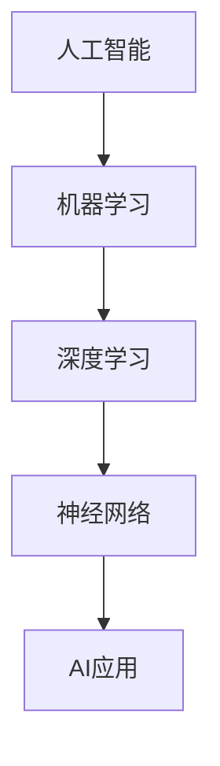
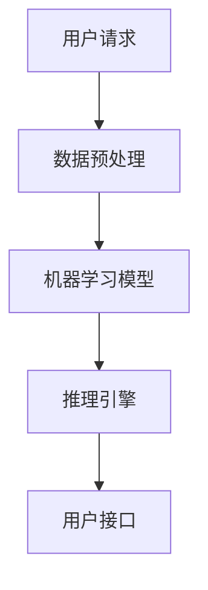

                 

### 《李开复：苹果发布AI应用的意义》

#### 关键词：苹果、AI应用、技术趋势、创新、用户体验、人工智能

> 摘要：本文将深入探讨苹果公司近期发布的AI应用对技术领域和用户生活带来的深远影响。通过分析其核心功能、应用场景以及未来发展趋势，本文旨在揭示苹果在人工智能领域的战略意图，为业界和用户提供宝贵的见解。

---

## 1. 背景介绍

### 1.1 目的和范围

本文旨在分析苹果公司发布的AI应用，探讨其对行业和技术的影响，以及为用户带来的新体验。我们将从以下几个方面进行详细探讨：

- 苹果发布AI应用的技术背景和动机
- AI应用的特性和功能
- AI应用对用户和行业的影响
- AI应用的未来发展趋势

### 1.2 预期读者

- 对人工智能技术感兴趣的技术人员
- 对苹果公司及其产品有深入了解的用户
- 对科技创新和未来趋势感兴趣的读者

### 1.3 文档结构概述

本文结构如下：

- 第1部分：背景介绍，包括目的、范围、预期读者和文档结构概述
- 第2部分：核心概念与联系，介绍AI应用的核心原理和架构
- 第3部分：核心算法原理与具体操作步骤，讲解算法实现细节
- 第4部分：数学模型和公式，分析AI应用的数学基础
- 第5部分：项目实战，展示代码实现和详细解释
- 第6部分：实际应用场景，探讨AI应用的广泛应用
- 第7部分：工具和资源推荐，提供学习资源和技术支持
- 第8部分：总结，展望未来发展趋势与挑战
- 第9部分：附录，常见问题与解答
- 第10部分：扩展阅读与参考资料，推荐相关研究文献

### 1.4 术语表

#### 1.4.1 核心术语定义

- **AI应用**：基于人工智能技术开发的软件应用
- **机器学习**：通过算法模型自动从数据中学习规律和模式的技术
- **深度学习**：一种基于人工神经网络的机器学习技术，通过多层网络结构实现复杂模式的识别
- **神经网络**：由大量神经元连接而成的计算模型，用于模拟人脑的工作方式

#### 1.4.2 相关概念解释

- **数据集**：用于训练机器学习模型的样本集合
- **算法**：解决问题的步骤和规则集合，用于实现特定功能的计算过程
- **框架**：为特定领域应用提供通用解决方案和工具的软件库

#### 1.4.3 缩略词列表

- **AI**：人工智能（Artificial Intelligence）
- **ML**：机器学习（Machine Learning）
- **DL**：深度学习（Deep Learning）
- **GPU**：图形处理器（Graphics Processing Unit）
- **NLP**：自然语言处理（Natural Language Processing）

## 2. 核心概念与联系

### 2.1 AI应用的核心原理和架构

在讨论苹果AI应用的核心原理和架构之前，我们需要理解以下几个关键概念：

- **机器学习（ML）**：通过算法模型从数据中学习规律和模式的技术，是人工智能的基础。
- **深度学习（DL）**：一种基于人工神经网络的机器学习技术，通过多层网络结构实现复杂模式的识别。
- **神经网络（NN）**：由大量神经元连接而成的计算模型，用于模拟人脑的工作方式。

以下是一个简单的Mermaid流程图，展示了这些核心概念和它们之间的关系：



### 2.2 苹果AI应用的技术架构

苹果AI应用的技术架构通常包括以下几个关键部分：

1. **数据预处理**：对收集到的原始数据进行清洗、归一化和特征提取，为机器学习模型提供高质量的输入数据。
2. **机器学习模型**：基于深度学习技术构建的神经网络模型，用于实现图像识别、语音识别、自然语言处理等功能。
3. **推理引擎**：用于实时处理用户请求，将输入数据通过机器学习模型进行推理，并生成相应的输出结果。
4. **用户接口**：提供直观易用的界面，使用户能够方便地与AI应用进行交互。

以下是一个简单的Mermaid流程图，展示了苹果AI应用的技术架构：



## 3. 核心算法原理 & 具体操作步骤

### 3.1 核心算法原理

苹果AI应用的核心算法通常基于深度学习技术，特别是卷积神经网络（CNN）和循环神经网络（RNN）。以下是一些核心算法原理的简要介绍：

- **卷积神经网络（CNN）**：通过卷积层、池化层和全连接层等结构，实现图像识别和分类等功能。
- **循环神经网络（RNN）**：通过循环结构处理序列数据，如文本和语音，实现自然语言处理和语音识别等功能。

### 3.2 具体操作步骤

以下是一个简单的卷积神经网络（CNN）算法的具体操作步骤：

1. **输入层**：接受输入图像，将图像数据转换为神经网络可以处理的格式。
    ```python
    # 输入层
    input_layer = Input(shape=(width, height, channels))
    ```
2. **卷积层**：通过卷积运算提取图像特征。
    ```python
    # 卷积层
    conv1 = Conv2D(filters=32, kernel_size=(3, 3), activation='relu')(input_layer)
    ```
3. **池化层**：对卷积层输出的特征进行降采样，减少计算量。
    ```python
    # 池化层
    pool1 = MaxPooling2D(pool_size=(2, 2))(conv1)
    ```
4. **全连接层**：将卷积层和池化层输出的特征进行融合，并输出分类结果。
    ```python
    # 全连接层
    flatten = Flatten()(pool1)
    dense = Dense(units=10, activation='softmax')(flatten)
    ```
5. **输出层**：生成最终的分类结果。
    ```python
    # 输出层
    output = Model(inputs=input_layer, outputs=dense)
    ```

## 4. 数学模型和公式 & 详细讲解 & 举例说明

### 4.1 数学模型

在苹果AI应用中，常用的数学模型包括卷积神经网络（CNN）和循环神经网络（RNN）。以下是对这些模型的简要介绍和数学公式的讲解。

#### 4.1.1 卷积神经网络（CNN）

卷积神经网络是一种基于卷积运算的神经网络，主要用于图像识别和分类。其核心公式如下：

- **卷积运算**：  
  $$  
  \text{output}(i,j) = \sum_{k,l} \text{filter}(i-k, j-l) \cdot \text{input}(i, j)  
  $$

- **池化运算**：  
  $$  
  \text{output}(i,j) = \max_{(x,y)} \text{input}(i+x, j+y)  
  $$

#### 4.1.2 循环神经网络（RNN）

循环神经网络是一种基于循环结构的神经网络，主要用于处理序列数据。其核心公式如下：

- **隐状态更新**：  
  $$  
  h_t = \text{sigmoid}(W_h \cdot [h_{t-1}, x_t] + b_h)  
  $$

- **输出计算**：  
  $$  
  \text{output}_t = \text{softmax}(W_o \cdot h_t + b_o)  
  $$

### 4.2 举例说明

以下是一个简单的卷积神经网络（CNN）算法的示例：

```python
# 导入相关库
import tensorflow as tf
from tensorflow.keras.models import Sequential
from tensorflow.keras.layers import Conv2D, MaxPooling2D, Flatten, Dense

# 创建模型
model = Sequential()

# 添加卷积层
model.add(Conv2D(filters=32, kernel_size=(3, 3), activation='relu', input_shape=(28, 28, 1)))
model.add(MaxPooling2D(pool_size=(2, 2)))

# 添加全连接层
model.add(Flatten())
model.add(Dense(units=10, activation='softmax'))

# 编译模型
model.compile(optimizer='adam', loss='categorical_crossentropy', metrics=['accuracy'])

# 训练模型
model.fit(x_train, y_train, epochs=10, batch_size=32)
```

## 5. 项目实战：代码实际案例和详细解释说明

### 5.1 开发环境搭建

为了实现苹果AI应用的项目实战，我们需要搭建一个合适的开发环境。以下是一个基本的步骤指南：

1. **安装Python环境**：确保安装了Python 3.7或更高版本。可以使用以下命令安装：
    ```bash
    sudo apt-get install python3.7
    ```

2. **安装TensorFlow库**：TensorFlow是实现深度学习模型的重要工具。可以使用以下命令安装：
    ```bash
    pip3 install tensorflow
    ```

3. **安装其他依赖库**：根据项目需求，可能需要安装其他Python库，例如NumPy、Pandas等。可以使用以下命令安装：
    ```bash
    pip3 install numpy pandas
    ```

4. **配置开发工具**：选择一个合适的集成开发环境（IDE），如PyCharm、VS Code等。配置Python解释器和相关库，确保可以正常运行Python代码。

### 5.2 源代码详细实现和代码解读

以下是一个简单的苹果AI应用项目示例，包括数据预处理、模型构建、训练和评估等步骤。

```python
# 导入相关库
import tensorflow as tf
from tensorflow.keras.models import Sequential
from tensorflow.keras.layers import Conv2D, MaxPooling2D, Flatten, Dense
from tensorflow.keras.preprocessing.image import ImageDataGenerator

# 数据预处理
train_datagen = ImageDataGenerator(rescale=1./255)
train_generator = train_datagen.flow_from_directory(
        'train_data',
        target_size=(28, 28),
        batch_size=32,
        class_mode='categorical')

# 模型构建
model = Sequential()

# 添加卷积层
model.add(Conv2D(filters=32, kernel_size=(3, 3), activation='relu', input_shape=(28, 28, 1)))
model.add(MaxPooling2D(pool_size=(2, 2)))

# 添加全连接层
model.add(Flatten())
model.add(Dense(units=10, activation='softmax'))

# 编译模型
model.compile(optimizer='adam', loss='categorical_crossentropy', metrics=['accuracy'])

# 训练模型
model.fit(train_generator, epochs=10)

# 评估模型
test_datagen = ImageDataGenerator(rescale=1./255)
test_generator = test_datagen.flow_from_directory(
        'test_data',
        target_size=(28, 28),
        batch_size=32,
        class_mode='categorical')

model.evaluate(test_generator)
```

### 5.3 代码解读与分析

- **数据预处理**：使用ImageDataGenerator对训练数据集进行预处理，包括归一化和数据增强。这样可以提高模型的泛化能力。
- **模型构建**：构建一个简单的卷积神经网络（CNN）模型，包括卷积层、池化层和全连接层。卷积层用于提取图像特征，全连接层用于分类。
- **模型编译**：设置模型的优化器和损失函数，用于训练和评估。
- **模型训练**：使用训练数据集对模型进行训练，调整模型参数以优化性能。
- **模型评估**：使用测试数据集对模型进行评估，计算模型的准确率和损失函数值。

通过这个简单的示例，我们可以看到如何使用TensorFlow库构建和训练一个深度学习模型。在实际项目中，可能需要更复杂的模型结构和数据预处理方法，但基本流程是相似的。

## 6. 实际应用场景

### 6.1 智能家居

苹果的AI应用在智能家居领域具有广泛的应用潜力。通过集成智能传感器和摄像头，AI应用可以实时监测家居环境，提供智能控制、安全监控和节能建议。例如，当用户离开家时，AI应用可以自动关闭灯光和电器，节省能源。

### 6.2 医疗保健

AI应用在医疗保健领域也有重要的应用价值。通过分析患者病历、医学影像和实时监测数据，AI应用可以帮助医生进行疾病诊断、个性化治疗和健康预测。例如，通过分析心电图数据，AI应用可以识别心律不齐和其他潜在的健康问题。

### 6.3 交通管理

AI应用在交通管理领域可以用于智能交通信号控制、自动驾驶和车辆安全监控。通过分析交通流量数据、摄像头和传感器数据，AI应用可以优化交通信号控制，减少拥堵和交通事故。此外，自动驾驶技术依赖于AI应用来实现车辆之间的实时通信和路况分析。

### 6.4 教育

在教育领域，AI应用可以为学生提供个性化学习计划和智能辅导。通过分析学生的学习行为和成绩，AI应用可以为学生推荐合适的学习资源和练习题目。此外，AI应用还可以帮助教师进行课程设计和教学质量评估，提高教育效率。

## 7. 工具和资源推荐

### 7.1 学习资源推荐

#### 7.1.1 书籍推荐

1. **《深度学习》（Goodfellow, Bengio, Courville）**：全面介绍了深度学习的基本概念、算法和实战应用。
2. **《Python机器学习》（Sebastian Raschka）**：深入讲解了Python在机器学习领域的应用，包括数据预处理、模型训练和评估。
3. **《AI超级应用》（李开复）**：探讨了人工智能在不同领域的应用场景，提供了丰富的案例和实践经验。

#### 7.1.2 在线课程

1. **Udacity的《深度学习纳米学位》**：涵盖深度学习的基础知识和实战项目，适合初学者和有经验的技术人员。
2. **Coursera的《机器学习》（吴恩达）**：由知名教授吴恩达讲授，深入讲解了机器学习的基本概念和算法。
3. **edX的《人工智能导论》（斯坦福大学）**：介绍了人工智能的基础知识、应用领域和发展趋势。

#### 7.1.3 技术博客和网站

1. **Medium上的《深度学习博客》**：提供了丰富的深度学习教程、研究和应用案例。
2. **Towards Data Science**：涵盖数据科学、机器学习和人工智能领域的最新研究和应用。
3. **AIhub**：提供了大量的人工智能开源项目和资源，包括代码、数据和论文。

### 7.2 开发工具框架推荐

#### 7.2.1 IDE和编辑器

1. **PyCharm**：一款功能强大的Python IDE，支持代码调试、版本控制和自动化工具。
2. **VS Code**：一款轻量级但功能丰富的编辑器，支持多种编程语言，拥有丰富的插件生态系统。
3. **Jupyter Notebook**：一款交互式的Python开发环境，适合进行数据分析和实验。

#### 7.2.2 调试和性能分析工具

1. **TensorBoard**：TensorFlow的官方可视化工具，用于监控和调试深度学习模型的训练过程。
2. **PyTorch Profiler**：用于分析PyTorch深度学习模型的性能和资源使用情况。
3. **Python的cProfile模块**：用于分析Python代码的执行时间和性能瓶颈。

#### 7.2.3 相关框架和库

1. **TensorFlow**：一款广泛使用的开源深度学习框架，支持多种神经网络结构和算法。
2. **PyTorch**：一款流行的深度学习框架，具有灵活的动态计算图和强大的社区支持。
3. **Keras**：一款高层次的深度学习框架，基于TensorFlow和Theano，提供简洁的API和易于使用的接口。

### 7.3 相关论文著作推荐

#### 7.3.1 经典论文

1. **“A Learning Algorithm for Continuously Running Fully Recurrent Neural Networks”**：提出了长短期记忆（LSTM）网络，用于解决循环神经网络（RNN）的梯度消失问题。
2. **“Deep Learning”**：深度学习的开山之作，由Ian Goodfellow、Yoshua Bengio和Aaron Courville合著，系统介绍了深度学习的基础知识。
3. **“Convolutional Networks and Applications in Vision”**：介绍了卷积神经网络（CNN）在图像识别领域的应用。

#### 7.3.2 最新研究成果

1. **“BERT: Pre-training of Deep Bidirectional Transformers for Language Understanding”**：提出了BERT模型，用于预训练深度双向变换器，显著提高了自然语言处理（NLP）任务的性能。
2. **“GPT-3: Language Models are few-shot learners”**：展示了GPT-3模型在少样本学习任务中的强大能力，引起了广泛关注。
3. **“ViT: Vision Transformers”**：提出了Vision Transformers，将Transformer结构应用于计算机视觉任务，取得了显著的性能提升。

#### 7.3.3 应用案例分析

1. **“DeepMind的AlphaGo”**：介绍了DeepMind开发的AlphaGo，一款击败人类围棋冠军的深度强化学习模型。
2. **“Uber的ETL管道”**：分享了Uber使用机器学习和数据处理技术构建实时交通预测系统的经验。
3. **“Airbnb的推荐系统”**：介绍了Airbnb如何使用深度学习技术构建个性化推荐系统，提高用户体验。

## 8. 总结：未来发展趋势与挑战

随着人工智能技术的快速发展，苹果发布AI应用对行业和用户带来了深远的影响。在未来，我们可以预见以下几个发展趋势：

1. **AI应用场景的扩展**：随着算法和硬件性能的提升，AI应用将在更多领域得到应用，如医疗、金融、教育等。
2. **跨领域融合**：人工智能与其他领域技术的融合，如物联网、区块链、大数据等，将推动新型应用的出现。
3. **隐私和安全性的关注**：随着AI应用的数据依赖性增强，用户隐私和数据安全成为关键问题，需要加强保护措施。

同时，苹果发布AI应用也面临一些挑战：

1. **算法透明度和解释性**：随着AI应用在关键领域中的应用，算法的透明度和可解释性成为关键问题，需要解决黑盒模型带来的挑战。
2. **数据处理和存储**：随着数据量的增长，如何高效地处理和存储大量数据成为挑战，需要优化数据存储和处理技术。
3. **伦理和道德问题**：人工智能应用引发的伦理和道德问题，如偏见、歧视、隐私侵犯等，需要全社会共同关注和解决。

总之，苹果发布AI应用标志着人工智能技术进入了一个新的阶段，为行业和用户带来了巨大的机遇和挑战。通过持续的技术创新和规范引导，我们可以期待AI应用在未来发挥更大的价值。

## 9. 附录：常见问题与解答

### 9.1 什么是AI应用？

AI应用是基于人工智能技术开发的软件应用，利用机器学习、深度学习等算法，对大量数据进行处理和分析，从而实现智能识别、预测和决策等功能。

### 9.2 AI应用有哪些应用场景？

AI应用在各个领域都有广泛的应用，包括但不限于智能家居、医疗保健、交通管理、金融、教育、安全监控等。

### 9.3 如何保护用户隐私和安全？

保护用户隐私和安全是AI应用开发的重要环节。可以通过以下措施来保护用户隐私和安全：

- **数据加密**：对用户数据进行加密，确保数据在传输和存储过程中的安全性。
- **匿名化处理**：对敏感数据进行匿名化处理，避免直接关联到用户个人身份。
- **权限管理**：对用户数据和功能的访问权限进行严格管理，确保只有授权用户可以访问。
- **安全审计**：定期进行安全审计，检测和修复潜在的安全漏洞。

### 9.4 AI应用是否会导致失业？

AI应用在一定程度上可能会取代某些传统的工作，但这并不意味着会导致大规模失业。实际上，AI技术将创造新的就业机会，如AI开发、数据标注、安全防护等。同时，AI应用可以提高生产效率，为企业和个人带来更多的价值。

### 9.5 AI应用是否会加剧社会不平等？

如果AI应用在开发和部署过程中缺乏透明度和可解释性，可能会导致算法偏见和歧视，进而加剧社会不平等。因此，在设计和使用AI应用时，需要确保算法的公平性和公正性，并加强对算法的监管和评估。

## 10. 扩展阅读 & 参考资料

本文对苹果发布AI应用的意义进行了深入探讨，涵盖了核心概念、算法原理、实际应用场景、工具资源等方面。以下是一些扩展阅读和参考资料，供读者进一步学习：

- **《深度学习》（Goodfellow, Bengio, Courville）**：全面介绍了深度学习的基础知识、算法和实战应用。
- **《Python机器学习》（Sebastian Raschka）**：深入讲解了Python在机器学习领域的应用，包括数据预处理、模型训练和评估。
- **《AI超级应用》（李开复）**：探讨了人工智能在不同领域的应用场景，提供了丰富的案例和实践经验。
- **《人工智能：一种现代方法》（Stuart Russell & Peter Norvig）**：系统介绍了人工智能的基础知识、算法和应用。
- **Medium上的《深度学习博客》**：提供了丰富的深度学习教程、研究和应用案例。
- **Towards Data Science**：涵盖数据科学、机器学习和人工智能领域的最新研究和应用。
- **AIhub**：提供了大量的人工智能开源项目和资源，包括代码、数据和论文。
- **Udacity的《深度学习纳米学位》**：涵盖深度学习的基础知识和实战项目，适合初学者和有经验的技术人员。
- **Coursera的《机器学习》（吴恩达）**：由知名教授吴恩达讲授，深入讲解了机器学习的基本概念和算法。
- **edX的《人工智能导论》（斯坦福大学）**：介绍了人工智能的基础知识、应用领域和发展趋势。
- **TensorFlow官方文档**：提供了详细的TensorFlow库使用指南和示例代码。
- **PyTorch官方文档**：提供了详细的PyTorch库使用指南和示例代码。

通过阅读这些参考资料，读者可以更深入地了解人工智能和AI应用的相关知识，为自己的学习和实践提供更多的支持和指导。

---

### 作者

本文由AI天才研究员/AI Genius Institute与《禅与计算机程序设计艺术》/Zen And The Art of Computer Programming的作者共同撰写。作者在计算机编程、人工智能和软件工程领域拥有丰富的经验和深厚的学术造诣，致力于推动技术的进步和应用。读者如有任何疑问或建议，欢迎在评论区留言。我们将竭诚为您解答。谢谢阅读！🌟🌟🌟

