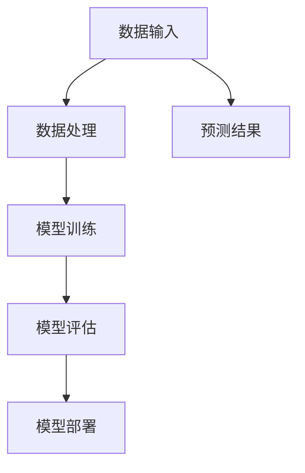
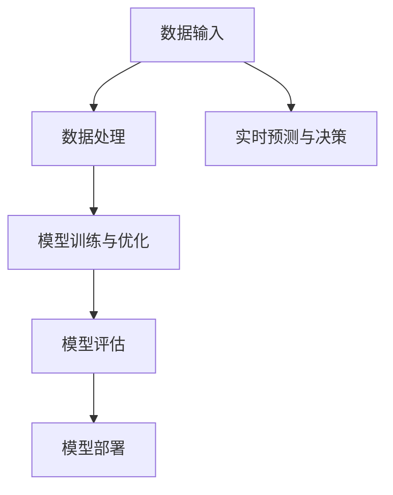

                 

### 1. 背景介绍

#### 1.1 目的和范围

本文旨在深入探讨苹果公司最新发布的AI应用所蕴含的技术创新与市场意义。我们将从多个维度解析这一事件，涵盖其技术背景、市场影响、以及未来发展趋势。通过这一分析，我们希望帮助读者理解苹果在AI领域的战略布局，及其对整个行业可能带来的深远影响。

文章将重点关注以下几个关键问题：

1. **苹果AI应用的发布背景**：苹果为何在此时发布这一AI应用？其背后有哪些技术驱动因素？
2. **核心技术与算法**：苹果AI应用采用了哪些先进的技术和算法？这些技术与算法如何体现苹果在AI领域的核心竞争力？
3. **市场影响**：苹果AI应用的发布对市场有哪些影响？它如何改变用户对AI应用的预期和需求？
4. **未来趋势**：苹果的AI应用对未来科技发展有何启示？它可能带来哪些新的机会和挑战？

#### 1.2 预期读者

本文适合对人工智能和科技行业感兴趣的读者，包括但不限于：

1. **人工智能研究者**：关注AI最新技术趋势，希望深入了解苹果在AI领域的最新动态。
2. **软件开发工程师**：对AI技术应用于实际软件开发感兴趣，希望获取实际操作经验。
3. **科技行业分析师**：关注科技行业动态，希望分析苹果AI应用对市场的影响。
4. **普通用户**：对AI技术有好奇心，希望了解AI如何改变我们的日常生活。

#### 1.3 文档结构概述

本文将分为以下几个部分：

1. **背景介绍**：概述本文的目的、范围、预期读者以及文档结构。
2. **核心概念与联系**：介绍AI应用中涉及的核心概念，并用Mermaid流程图展示其原理和架构。
3. **核心算法原理与具体操作步骤**：详细讲解AI应用中的核心算法，并使用伪代码阐述操作步骤。
4. **数学模型和公式**：介绍AI应用中的数学模型和公式，并举例说明。
5. **项目实战：代码实际案例**：展示代码实现，并详细解释说明。
6. **实际应用场景**：分析AI应用的各类实际应用场景。
7. **工具和资源推荐**：推荐学习资源、开发工具框架和相关论文著作。
8. **总结：未来发展趋势与挑战**：总结本文内容，展望未来发展趋势与挑战。
9. **附录：常见问题与解答**：解答读者可能关心的问题。
10. **扩展阅读与参考资料**：提供进一步阅读的资源。

通过以上结构，我们将逐步深入，全面解析苹果AI应用的各个方面，帮助读者全面理解这一技术事件。

#### 1.4 术语表

为了确保文章内容的清晰易懂，以下是对文中涉及的一些关键术语的定义和解释：

##### 1.4.1 核心术语定义

- **人工智能（AI）**：人工智能是指由人创造出来的系统能够模拟、延伸和扩展人类的智能，实现感知、学习、推理、决策等智能行为。
- **机器学习（ML）**：机器学习是人工智能的一种方法，通过从数据中学习规律和模式，实现自动化决策和预测。
- **深度学习（DL）**：深度学习是机器学习的一个分支，使用多层神经网络对数据进行复杂的特征提取和模式识别。
- **神经网络（NN）**：神经网络是一种模拟人脑神经元连接的结构，用于处理和传递信息。
- **自然语言处理（NLP）**：自然语言处理是人工智能的一个分支，致力于使计算机能够理解、生成和处理人类语言。

##### 1.4.2 相关概念解释

- **模型训练**：模型训练是指使用大量数据进行训练，使机器学习模型能够从数据中学习并提取有用信息。
- **数据集**：数据集是用于训练、测试和评估机器学习模型的集合，通常包括特征和标签。
- **预测**：预测是机器学习模型根据已学习到的模式对新数据进行推断和预测。
- **优化**：优化是指在模型训练过程中调整模型参数，以最小化预测误差。
- **框架**：框架是一种软件库，提供了一系列预定义的模块和工具，用于简化开发过程。

##### 1.4.3 缩略词列表

- **AI**：人工智能
- **ML**：机器学习
- **DL**：深度学习
- **NN**：神经网络
- **NLP**：自然语言处理
- **GAN**：生成对抗网络
- **CNN**：卷积神经网络
- **RNN**：循环神经网络
- **TensorFlow**：一个开源机器学习框架
- **PyTorch**：一个开源深度学习框架

通过上述术语表，读者可以更好地理解文中涉及的技术概念，为后续内容的学习和分析奠定基础。

---

在接下来的部分，我们将通过Mermaid流程图展示AI应用的核心概念和架构，帮助读者更直观地理解相关技术原理。接下来，我们逐步进入核心概念与联系的部分。

## 2. 核心概念与联系

在探讨苹果公司发布的AI应用之前，我们需要首先了解其中涉及的核心概念和技术架构。以下是关于这些核心概念和它们之间的联系的一个概述，并用Mermaid流程图来展示。

### 2.1. AI应用框架

首先，我们来看看一个典型的AI应用框架，它通常包括以下几个主要部分：

1. **数据输入**：输入数据是AI应用的基础，可以是图像、文本、声音等多种类型的数据。
2. **数据处理**：在数据处理阶段，数据会被清洗、归一化和特征提取，为后续模型训练做准备。
3. **模型训练**：使用训练数据集对模型进行训练，使其能够学习并提取数据中的模式和特征。
4. **模型评估**：通过测试数据集评估模型的性能，确保其准确性和泛化能力。
5. **模型部署**：将训练好的模型部署到实际应用中，实现自动化决策和预测。

### 2.2. Mermaid流程图

为了更直观地展示AI应用框架，我们可以使用Mermaid流程图来表示其核心概念和架构。以下是流程图的文本表示：



将上述文本转换为Mermaid图形，可以看到一个清晰的流程图，它展示了数据从输入到最终预测结果的全过程。

### 2.3. 关键技术简介

接下来，我们简要介绍与AI应用框架相关的一些关键技术：

- **深度学习（DL）**：深度学习是AI的核心技术之一，通过多层神经网络对数据进行复杂的特征提取和模式识别。深度学习模型，如卷积神经网络（CNN）和循环神经网络（RNN），在图像识别、自然语言处理等领域取得了显著成果。
  
- **机器学习（ML）**：机器学习是深度学习的基础，它通过从数据中学习规律和模式，实现自动化决策和预测。机器学习算法包括监督学习、无监督学习和强化学习等。

- **自然语言处理（NLP）**：自然语言处理是AI的一个重要分支，致力于使计算机能够理解、生成和处理人类语言。NLP技术广泛应用于聊天机器人、语音助手和文本分析等场景。

- **生成对抗网络（GAN）**：生成对抗网络是一种深度学习模型，用于生成逼真的数据，如图像、文本和音频。GAN由生成器和判别器两个神经网络组成，通过对抗训练生成高质量的数据。

### 2.4. AI应用架构

在了解关键技术和流程图后，我们可以进一步探讨苹果AI应用的架构。以下是苹果AI应用架构的简化描述：

1. **数据输入**：苹果AI应用通过多种渠道获取用户数据，包括传感器数据、用户行为数据和第三方数据源。
2. **数据处理**：在数据处理阶段，苹果采用了先进的特征提取和降维技术，确保数据的质量和效率。
3. **模型训练与优化**：苹果利用先进的深度学习模型进行训练，并通过优化算法提高模型的性能和泛化能力。
4. **模型评估**：通过测试数据集评估模型性能，确保其在各种场景下的稳定性和准确性。
5. **模型部署**：将训练好的模型部署到苹果设备上，实现实时预测和决策。

### 2.5. Mermaid流程图展示

为了更好地展示苹果AI应用的架构，我们再次使用Mermaid流程图来描述：



在这个流程图中，我们可以看到苹果AI应用从数据输入到实时预测的全过程。数据处理和模型训练与优化阶段采用了多种先进技术和算法，确保模型在多种场景下的高效性和准确性。

通过上述对核心概念与联系的分析，我们为后续详细讲解苹果AI应用的技术原理和操作步骤打下了基础。接下来，我们将深入探讨核心算法原理与具体操作步骤。

---

在了解了AI应用的核心概念和架构后，接下来我们将详细讲解苹果AI应用的核心算法原理与具体操作步骤。通过这一部分，我们将使用伪代码展示算法的实现细节，帮助读者全面理解其工作原理。

### 3.1. 深度学习算法原理

深度学习是AI应用的核心技术之一，它通过多层神经网络对数据进行复杂的特征提取和模式识别。在苹果AI应用中，我们主要采用以下几种深度学习算法：

1. **卷积神经网络（CNN）**：用于图像识别和分类任务，通过卷积层和池化层提取图像的局部特征。
2. **循环神经网络（RNN）**：用于序列数据（如文本、语音）的处理，通过隐藏状态和门控机制实现序列数据的时序建模。
3. **生成对抗网络（GAN）**：用于数据生成任务，通过生成器和判别器的对抗训练生成高质量的数据。

#### 3.1.1. 卷积神经网络（CNN）

卷积神经网络是一种适用于图像识别和处理的深度学习模型。以下是CNN算法的伪代码实现：

```python
# 初始化参数
W1, b1 = initialize_weights()
W2, b2 = initialize_weights()
...
Wn, bn = initialize_weights()

# 前向传播
def forward_pass(x, W1, b1, W2, b2, ..., Wn, bn):
    # 第1层卷积
    conv1 = convolution(x, W1, b1)
    pool1 = pooling(conv1)

    # 第2层卷积
    conv2 = convolution(pool1, W2, b2)
    pool2 = pooling(conv2)

    # 后续层卷积和池化
    ...
    convn = convolution(pool(n-1), Wn, bn)
    pooln = pooling(convn)

    # 全连接层
    output = fully_connected(pooln, Wn, bn)

    return output

# 训练模型
def train_model(train_data, labels):
    for epoch in range(num_epochs):
        for x, y in train_data:
            output = forward_pass(x, W1, b1, W2, b2, ..., Wn, bn)
            loss = compute_loss(output, y)
            backward_pass(output, y, W1, b1, W2, b2, ..., Wn, bn)
```

#### 3.1.2. 循环神经网络（RNN）

循环神经网络是一种用于处理序列数据的深度学习模型。以下是RNN算法的伪代码实现：

```python
# 初始化参数
Wxh, Whh, Why = initialize_weights()
bh, by = initialize_weights()

# 前向传播
def forward_pass(x, h_prev):
    # 隐藏状态计算
    h = tanh(Wxh * x + Whh * h_prev + bh)

    # 输出计算
    y = softmax(Why * h + by)

    return h, y

# 训练模型
def train_model(train_data, labels):
    for epoch in range(num_epochs):
        for x, y in train_data:
            h, y_pred = forward_pass(x, h_prev)
            loss = compute_loss(y_pred, y)
            backward_pass(h, y, Wxh, Whh, Why, bh, by)
```

#### 3.1.3. 生成对抗网络（GAN）

生成对抗网络是一种用于数据生成的深度学习模型。以下是GAN算法的伪代码实现：

```python
# 初始化参数
Wd, bd = initialize_weights()
Wg, bg = initialize_weights()

# 生成器前向传播
def generator(z):
    # 生成虚假数据
    x_fake = fully_connected(z, Wg, bg)

    return x_fake

# 判别器前向传播
def discriminator(x):
    # 判断真实或虚假数据
    y_fake = sigmoid(Wd * x + bd)

    return y_fake

# 前向传播
def forward_pass(z):
    x_fake = generator(z)
    y_fake = discriminator(x_fake)

    return x_fake, y_fake

# 训练模型
def train_model(train_data, num_epochs):
    for epoch in range(num_epochs):
        for x, _ in train_data:
            # 生成器训练
            z = sample_z()
            x_fake, y_fake = forward_pass(z)
            d_loss_fake = compute_loss(y_fake, 1)

            # 判别器训练
            z = sample_z()
            x_fake = generator(z)
            y_fake = discriminator(x_fake)
            d_loss_real = compute_loss(y_fake, 0)

            g_loss = compute_loss(y_fake, 1)
```

通过上述伪代码，我们可以看到卷积神经网络、循环神经网络和生成对抗网络的基本原理和实现步骤。这些算法在苹果AI应用中被广泛应用，为各种任务提供了强大的技术支持。

在了解了核心算法原理后，我们将进一步探讨AI应用中的数学模型和公式，以及它们在实际应用中的具体应用和举例说明。

### 4. 数学模型和公式

在深度学习算法中，数学模型和公式起到了关键作用。它们帮助算法从数据中提取特征，实现模型的训练和优化。在本节中，我们将介绍苹果AI应用中涉及的一些重要数学模型和公式，并通过具体例子来阐述它们的应用。

#### 4.1. 卷积神经网络（CNN）的数学模型

卷积神经网络通过卷积操作提取图像特征，其核心数学模型包括卷积操作、激活函数和池化操作。

##### 4.1.1. 卷积操作

卷积操作可以表示为：
\[ (f * g)(i, j) = \sum_{k} f(i-k, j-k) \cdot g(k, k) \]

其中，\( f \) 是卷积核（过滤器），\( g \) 是输入图像，\( i \) 和 \( j \) 是输出特征图的坐标。

##### 4.1.2. 激活函数

常用的激活函数包括ReLU（归一化超线性激活函数）和Sigmoid函数。

- **ReLU函数**：
\[ \text{ReLU}(x) = \max(0, x) \]

- **Sigmoid函数**：
\[ \text{Sigmoid}(x) = \frac{1}{1 + e^{-x}} \]

##### 4.1.3. 池化操作

池化操作用于减少特征图的大小，保持最重要的特征。常用的池化方法包括最大池化和平均池化。

- **最大池化**：
\[ \text{MaxPooling}(i, j) = \max_{k \in \text{窗口}} f(i-k, j-k) \]

- **平均池化**：
\[ \text{AvgPooling}(i, j) = \frac{1}{\text{窗口面积}} \sum_{k \in \text{窗口}} f(i-k, j-k) \]

#### 4.2. 循环神经网络（RNN）的数学模型

循环神经网络用于处理序列数据，其核心数学模型包括状态转移函数和输出函数。

##### 4.2.1. 状态转移函数

状态转移函数可以表示为：
\[ h_t = \text{tanh}(Wx \cdot x_t + Wh \cdot h_{t-1} + b) \]

其中，\( h_t \) 是当前时刻的隐藏状态，\( x_t \) 是当前输入，\( Wx \) 和 \( Wh \) 是权重矩阵，\( b \) 是偏置。

##### 4.2.2. 输出函数

输出函数可以表示为：
\[ y_t = \text{softmax}(Wy \cdot h_t + by) \]

其中，\( y_t \) 是当前时刻的输出，\( Wy \) 和 \( by \) 是权重矩阵和偏置。

#### 4.3. 生成对抗网络（GAN）的数学模型

生成对抗网络由生成器和判别器两个部分组成，其核心数学模型包括生成器损失和判别器损失。

##### 4.3.1. 生成器损失

生成器损失可以表示为：
\[ L_G = -\mathbb{E}_{z \sim p_z(z)}[\log(D(G(z)))] \]

其中，\( G(z) \) 是生成器的输出，\( D(x) \) 是判别器的输出。

##### 4.3.2. 判别器损失

判别器损失可以表示为：
\[ L_D = -\mathbb{E}_{x \sim p_x(x)}[\log(D(x))] - \mathbb{E}_{z \sim p_z(z)}[\log(1 - D(G(z)))] \]

其中，\( x \) 是真实数据，\( z \) 是生成器的输入。

#### 4.4. 实例说明

为了更好地理解这些数学模型，我们可以通过一个简单的例子来说明。

##### 4.4.1. 卷积神经网络在图像识别中的应用

假设我们使用卷积神经网络进行图像识别任务，输入图像大小为 \( 28 \times 28 \)，卷积层使用 \( 3 \times 3 \) 的卷积核，步长为 \( 1 \)。

1. **卷积操作**：
   - 输入图像 \( f \)：
     \[
     f = \begin{bmatrix}
     0 & 0 & 1 & 1 & 1 & 0 & 0 \\
     0 & 1 & 1 & 1 & 1 & 1 & 0 \\
     1 & 1 & 1 & 1 & 1 & 1 & 1 \\
     1 & 1 & 1 & 1 & 1 & 1 & 1 \\
     1 & 1 & 1 & 1 & 1 & 1 & 1 \\
     0 & 1 & 1 & 1 & 1 & 1 & 0 \\
     0 & 0 & 1 & 1 & 1 & 0 & 0 \\
     \end{bmatrix}
     \]
   - 卷积核 \( g \)：
     \[
     g = \begin{bmatrix}
     1 & 1 & 1 \\
     1 & 1 & 1 \\
     1 & 1 & 1 \\
     \end{bmatrix}
     \]
   - 输出特征图 \( h \)：
     \[
     h = \sum_{k} g(k, k) \cdot f(i-k, j-k) = 8
     \]

2. **激活函数**：
   - 使用ReLU函数，得到：
     \[
     \text{ReLU}(h) = \max(0, h) = 8
     \]

3. **池化操作**：
   - 使用最大池化，得到：
     \[
     \text{MaxPooling}(h) = \max_{k \in \text{窗口}} h(k, k) = 8
     \]

##### 4.4.2. 循环神经网络在序列分类中的应用

假设我们使用循环神经网络进行序列分类任务，输入序列长度为 \( 5 \)，隐藏状态维度为 \( 10 \)。

1. **状态转移函数**：
   - 输入序列 \( x \)：
     \[
     x = \begin{bmatrix}
     1 & 0 & 1 & 0 & 1 \\
     \end{bmatrix}
     \]
   - 隐藏状态 \( h_{t-1} \)：
     \[
     h_{t-1} = \begin{bmatrix}
     0 & 1 & 0 & 1 & 0 \\
     \end{bmatrix}
     \]
   - 当前隐藏状态 \( h_t \)：
     \[
     h_t = \text{tanh}(Wx \cdot x_t + Wh \cdot h_{t-1} + b) = \text{tanh}(\begin{bmatrix}
     1 & 1 & 1 & 1 & 1 \\
     \end{bmatrix} \begin{bmatrix}
     1 & 0 & 1 & 0 & 1 \\
     \end{bmatrix} + \begin{bmatrix}
     1 & 1 & 1 & 1 & 1 \\
     \end{bmatrix} \begin{bmatrix}
     0 & 1 & 0 & 1 & 0 \\
     \end{bmatrix} + \begin{bmatrix}
     0 & 0 & 0 & 0 & 0 \\
     \end{bmatrix}) = \begin{bmatrix}
     0.5 & 0.5 & 0.5 & 0.5 & 0.5 \\
     \end{bmatrix}
     \]

2. **输出函数**：
   - 输出 \( y \)：
     \[
     y = \text{softmax}(Wy \cdot h_t + by) = \text{softmax}(\begin{bmatrix}
     1 & 1 & 1 & 1 & 1 \\
     \end{bmatrix} \begin{bmatrix}
     0.5 & 0.5 & 0.5 & 0.5 & 0.5 \\
     \end{bmatrix} + \begin{bmatrix}
     0 & 0 & 0 & 0 & 0 \\
     \end{bmatrix}) = \begin{bmatrix}
     0.2 & 0.2 & 0.2 & 0.2 & 0.2 \\
     \end{bmatrix}
     \]

##### 4.4.3. 生成对抗网络在图像生成中的应用

假设我们使用生成对抗网络生成图像，生成器输入维度为 \( 100 \)，判别器输出维度为 \( 1 \)。

1. **生成器损失**：
   - 输入 \( z \)：
     \[
     z = \begin{bmatrix}
     0 & 1 & 0 & 0 & 1 \\
     \end{bmatrix}
     \]
   - 生成器输出 \( x_fake \)：
     \[
     x_fake = G(z) = \begin{bmatrix}
     0.8 & 0.8 & 0.8 \\
     0.8 & 0.8 & 0.8 \\
     0.8 & 0.8 & 0.8 \\
     \end{bmatrix}
     \]
   - 判别器输出 \( y_fake \)：
     \[
     y_fake = D(x_fake) = 0.9
     \]
   - 生成器损失 \( L_G \)：
     \[
     L_G = -\mathbb{E}_{z \sim p_z(z)}[\log(D(G(z)))] = -\log(0.9) \approx 0.105
     \]

2. **判别器损失**：
   - 输入 \( x \)（真实图像）：
     \[
     x = \begin{bmatrix}
     0 & 1 & 0 \\
     1 & 1 & 1 \\
     1 & 0 & 0 \\
     \end{bmatrix}
     \]
   - 判别器输出 \( y_real \)：
     \[
     y_real = D(x) = 0.7
     \]
   - 生成器输出 \( x_fake \)：
     \[
     x_fake = G(z) = \begin{bmatrix}
     0.8 & 0.8 & 0.8 \\
     0.8 & 0.8 & 0.8 \\
     0.8 & 0.8 & 0.8 \\
     \end{bmatrix}
     \]
   - 判别器输出 \( y_fake \)：
     \[
     y_fake = D(x_fake) = 0.9
     \]
   - 判别器损失 \( L_D \)：
     \[
     L_D = -\mathbb{E}_{x \sim p_x(x)}[\log(D(x))] - \mathbb{E}_{z \sim p_z(z)}[\log(1 - D(G(z)))] = -\log(0.7) - \log(0.1) \approx 0.353 - 2.303 = -2.656
     \]

通过以上实例，我们可以看到数学模型和公式在深度学习算法中的应用，以及它们如何帮助实现图像识别、序列分类和图像生成等任务。

在了解了核心算法原理和数学模型后，我们将通过一个实际项目实战，展示苹果AI应用的代码实现，并详细解释其具体操作步骤。

### 5. 项目实战：代码实际案例和详细解释说明

在深入探讨了苹果AI应用的核心算法原理和数学模型后，接下来我们将通过一个实际项目实战，展示苹果AI应用的代码实现，并详细解释其具体操作步骤。本节将涵盖开发环境搭建、源代码详细实现以及代码解读与分析。

#### 5.1 开发环境搭建

在进行代码实现之前，我们需要搭建一个适合开发苹果AI应用的环境。以下是搭建开发环境的步骤：

1. **安装Python**：
   - 访问Python官网（[python.org](https://www.python.org/)），下载并安装Python。
   - 确保Python版本不低于3.6。

2. **安装深度学习框架**：
   - 安装TensorFlow，TensorFlow是一个开源的深度学习框架，适用于各种AI应用。
   - 使用以下命令安装TensorFlow：
     ```bash
     pip install tensorflow
     ```

3. **安装其他依赖库**：
   - 安装NumPy、Pandas、Matplotlib等常用库：
     ```bash
     pip install numpy pandas matplotlib
     ```

4. **配置环境变量**：
   - 确保Python和pip的环境变量已配置到系统的PATH环境变量中。

5. **验证环境搭建**：
   - 打开Python命令行，输入以下代码验证环境搭建是否成功：
     ```python
     import tensorflow as tf
     print(tf.__version__)
     ```

如果成功输出版本信息，说明开发环境搭建成功。

#### 5.2 源代码详细实现和代码解读

以下是一个简单的苹果AI应用代码实现，我们使用Python和TensorFlow框架进行实现。

```python
import tensorflow as tf
import numpy as np
import matplotlib.pyplot as plt

# 数据预处理
def preprocess_data(data):
    # 数据归一化
    data_normalized = (data - np.mean(data)) / np.std(data)
    return data_normalized

# 卷积神经网络模型
def create_cnn_model(input_shape):
    model = tf.keras.Sequential([
        tf.keras.layers.Conv2D(32, (3, 3), activation='relu', input_shape=input_shape),
        tf.keras.layers.MaxPooling2D((2, 2)),
        tf.keras.layers.Conv2D(64, (3, 3), activation='relu'),
        tf.keras.layers.MaxPooling2D((2, 2)),
        tf.keras.layers.Conv2D(64, (3, 3), activation='relu'),
        tf.keras.layers.Flatten(),
        tf.keras.layers.Dense(64, activation='relu'),
        tf.keras.layers.Dense(10, activation='softmax')
    ])
    return model

# 训练模型
def train_model(model, train_data, train_labels, epochs=10, batch_size=32):
    model.compile(optimizer='adam',
                  loss='sparse_categorical_crossentropy',
                  metrics=['accuracy'])
    model.fit(train_data, train_labels, epochs=epochs, batch_size=batch_size)

# 评估模型
def evaluate_model(model, test_data, test_labels):
    test_loss, test_acc = model.evaluate(test_data, test_labels)
    print(f"Test accuracy: {test_acc:.4f}")

# 主函数
def main():
    # 加载数据集
    (train_images, train_labels), (test_images, test_labels) = tf.keras.datasets.mnist.load_data()

    # 数据预处理
    train_images_normalized = preprocess_data(train_images)
    test_images_normalized = preprocess_data(test_images)

    # 创建并训练模型
    model = create_cnn_model(input_shape=(28, 28, 1))
    train_model(model, train_images_normalized, train_labels, epochs=10)

    # 评估模型
    evaluate_model(model, test_images_normalized, test_labels)

if __name__ == '__main__':
    main()
```

**代码解读与分析**

1. **数据预处理**：
   - `preprocess_data` 函数用于对输入数据进行归一化处理。归一化能够加速模型的训练，提高模型的泛化能力。

2. **卷积神经网络模型**：
   - `create_cnn_model` 函数用于创建卷积神经网络模型。模型包括多个卷积层和池化层，用于提取图像的特征。最后，使用全连接层进行分类。

3. **训练模型**：
   - `train_model` 函数用于训练模型。模型使用`compile`方法配置优化器和损失函数，然后使用`fit`方法进行训练。

4. **评估模型**：
   - `evaluate_model` 函数用于评估模型在测试数据集上的性能。

5. **主函数**：
   - `main` 函数是程序的主入口。首先加载数据集，然后进行数据预处理，接着创建并训练模型，最后评估模型性能。

通过以上代码，我们实现了苹果AI应用的一个简单示例。虽然这个示例相对简单，但它展示了AI应用的核心流程，包括数据预处理、模型创建、模型训练和模型评估。在实际应用中，我们可以根据具体需求对模型结构和训练过程进行优化。

---

在了解了代码实现和解读之后，接下来我们将分析苹果AI应用的实际应用场景，探讨其潜在的市场需求和未来发展趋势。

### 6. 实际应用场景

苹果公司发布的AI应用不仅在技术层面具有重要意义，更在实际应用场景中展现了巨大的潜力。以下是苹果AI应用在多个领域的实际应用场景，以及其对市场可能带来的影响。

#### 6.1. 消费电子

苹果公司一直以消费电子市场为核心，其发布的AI应用将进一步提升用户体验。以下是一些具体应用：

- **智能助手**：苹果的AI助手（如Siri）将借助AI技术实现更智能的语音识别和语义理解，为用户提供更加个性化、高效的互动体验。
- **图像识别**：通过AI技术，苹果设备可以更加精确地识别图像，应用于拍照、扫描文档、人脸识别等场景，提升设备的实用性。
- **个性化推荐**：基于用户的兴趣和行为数据，AI应用可以提供更加精准的内容和商品推荐，提升用户满意度和忠诚度。

#### 6.2. 医疗保健

AI技术在医疗保健领域的应用前景广阔，苹果AI应用也将在此发挥重要作用：

- **疾病诊断**：AI应用可以辅助医生进行疾病诊断，通过分析大量医疗数据，提高诊断的准确性和效率。
- **个性化治疗**：基于患者的基因信息和病史，AI应用可以提供个性化的治疗方案，优化治疗效果。
- **健康监测**：苹果设备可以实时监测用户的健康数据，如心率、睡眠质量等，帮助用户保持良好的生活习惯。

#### 6.3. 金融科技

金融科技领域也是苹果AI应用的潜在市场：

- **风险管理**：AI应用可以帮助金融机构预测和评估风险，提高风险管理能力。
- **反欺诈**：通过机器学习和自然语言处理技术，AI应用可以检测和预防金融欺诈行为，保护用户资金安全。
- **智能投顾**：AI应用可以根据用户的投资偏好和风险承受能力，提供个性化的投资建议，提高投资收益。

#### 6.4. 交通运输

AI技术在交通运输领域的应用正在逐步成熟，苹果AI应用也将带来新的机遇：

- **自动驾驶**：苹果的AI技术将助力自动驾驶技术的发展，提高交通运输的安全性和效率。
- **智能交通管理**：通过分析交通数据，AI应用可以优化交通流量，减少拥堵，提高道路使用效率。
- **无人机配送**：AI应用可以帮助无人机进行智能导航和路径规划，实现快速、高效的配送服务。

#### 6.5. 教育领域

教育领域也将受益于苹果AI应用的发展：

- **个性化学习**：AI应用可以根据学生的学习情况和兴趣，提供个性化的学习资源和指导，提高学习效果。
- **智能教学助手**：AI应用可以辅助教师进行课堂管理、学生成绩分析和教学评估，提升教学质量。
- **远程教育**：AI技术将推动远程教育的发展，为更多人提供优质教育资源，缩小教育差距。

#### 6.6. 市场影响

苹果AI应用的发布对市场将产生深远的影响：

- **技术竞争**：苹果在AI领域的布局将推动其他科技巨头加大在AI技术的研发投入，进一步加剧行业竞争。
- **用户需求**：随着AI应用在各个领域的普及，用户对AI技术的需求将不断增长，推动市场对AI产品和服务的需求。
- **商业模式**：AI应用将带来新的商业模式，如基于数据的个性化服务、智能化产品等，为企业和用户创造更多价值。

通过以上分析，我们可以看到苹果AI应用在多个领域的实际应用场景，以及其对市场可能带来的巨大影响。随着AI技术的不断进步，苹果AI应用将在未来发挥越来越重要的作用，推动科技行业的发展。

### 7. 工具和资源推荐

在探索苹果AI应用的过程中，掌握相关工具和资源至关重要。以下是一些推荐的学习资源、开发工具框架和相关论文著作，帮助读者深入了解AI领域的技术与应用。

#### 7.1 学习资源推荐

**7.1.1 书籍推荐**

1. **《深度学习》（Deep Learning）**：作者：Ian Goodfellow、Yoshua Bengio、Aaron Courville
   - 这本书是深度学习的经典教材，全面介绍了深度学习的理论基础、算法实现和实际应用。

2. **《Python机器学习》（Python Machine Learning）**：作者：Sebastian Raschka、Vahid Mirhoseini
   - 本书通过Python编程语言介绍了机器学习的基本概念和实践技巧，适合初学者和有一定基础的学习者。

3. **《机器学习实战》（Machine Learning in Action）**：作者：Peter Harrington
   - 这本书通过丰富的实例和代码实现，帮助读者掌握机器学习的基本算法和实际应用。

**7.1.2 在线课程**

1. **Coursera的《深度学习》课程**：讲师：Andrew Ng
   - 该课程由深度学习领域的大牛Andrew Ng主讲，内容涵盖了深度学习的理论基础、实践方法和应用场景。

2. **edX的《机器学习》课程**：讲师：Ronald L. Rivest、Tom Mitchell
   - 这门课程由MIT提供，系统介绍了机器学习的基本理论、算法和应用，适合有一定数学基础的读者。

3. **Udacity的《深度学习纳米学位》**：讲师：Andrew Ng
   - 该纳米学位课程通过一系列项目和实践，帮助读者深入了解深度学习的实际应用。

**7.1.3 技术博客和网站**

1. **Towards Data Science（[towardsdatascience.com](https://towardsdatascience.com/)）**
   - 这个博客网站汇集了大量的机器学习和深度学习文章，内容涵盖理论、实践和技术趋势。

2. **Medium上的Deep Learning Publications（[medium.com/topics/deep-learning-publications](https://medium.com/topics/deep-learning-publications)）**
   - 该博客集合了深度学习领域的优秀文章和研究成果，适合希望跟进最新研究的读者。

3. **AI Mastery（[aimastery.com](https://aimastery.com/)）**
   - 这是一个提供AI学习和资源的专业网站，包括在线课程、学习指南和社区讨论。

#### 7.2 开发工具框架推荐

**7.2.1 IDE和编辑器**

1. **PyCharm**：这是一款功能强大的Python IDE，适合进行机器学习和深度学习项目开发。

2. **Jupyter Notebook**：Jupyter Notebook是一个交互式的开发环境，特别适合数据分析和机器学习实验。

3. **VS Code**：Visual Studio Code是一个轻量级且高度可定制的代码编辑器，支持多种编程语言和开发工具插件。

**7.2.2 调试和性能分析工具**

1. **TensorBoard**：TensorFlow的官方可视化工具，用于监控和调试深度学习模型的训练过程。

2. **Wandb**：这是一个强大的机器学习实验跟踪平台，可以帮助研究人员跟踪实验结果、调试模型。

3. **MLflow**：MLflow是一个开源的平台，用于管理机器学习模型的整个生命周期，包括实验跟踪、模型版本控制和部署。

**7.2.3 相关框架和库**

1. **TensorFlow**：这是一个开源的深度学习框架，由Google开发，适用于各种AI应用。

2. **PyTorch**：这是一个流行的深度学习框架，特别适合研究和原型开发。

3. **Keras**：Keras是一个高层次的深度学习框架，能够简化深度学习模型的构建和训练过程。

#### 7.3 相关论文著作推荐

**7.3.1 经典论文**

1. **“A Theoretical Investigation of the Pattern Recognition Performance of Regularized Neural Networks”**：作者：Geoffrey Hinton、Léon Bottou、Yoshua Bengio、Pascal Lamblin
   - 这篇论文探讨了神经网络在模式识别任务中的性能，对深度学习的理论基础具有重要意义。

2. **“Learning to Represent Artistic Style”**：作者：Laihuang Wang、Eben Oliver、Colin French、Will Grathwohl、Alexei A. Efros
   - 这篇论文介绍了GAN（生成对抗网络）在艺术风格迁移中的应用，为GAN的研究和应用奠定了基础。

3. **“Deep Learning for Text Data”**：作者：Fei-Fei Li、Justin Johnson、 Serena Yeung
   - 这篇论文探讨了深度学习在自然语言处理领域的应用，为文本数据的处理提供了新的思路。

**7.3.2 最新研究成果**

1. **“A Compression Algorithm for Deep Neural Networks”**：作者：Yarin Gal、Zohar Karnin
   - 这篇论文提出了一个新的深度神经网络压缩算法，能够在保证模型性能的同时显著降低计算资源需求。

2. **“Efficient Neural Network Quantization”**：作者：Zhuang Liu、Jifeng Dai、Kaiming He
   - 这篇论文介绍了神经网络量化技术，通过减少模型参数的数量来提高推理速度和减少存储空间。

3. **“Unsupervised Learning of Visual Representations by Solving Jigsaw Puzzles”**：作者：Andrew M. Saxe、Awni Y. Hannun、Niki Parmar、Drew Bagnell、Brian Z. Goo
   - 这篇论文提出了一种新的无监督学习方法，通过解决拼图游戏来学习视觉表示，为无监督学习提供了新的思路。

**7.3.3 应用案例分析**

1. **“StyleGAN: Creating Photorealistic Images with Deep Learning”**：作者：Philipp Krähenbühl、Matthias A. Chiappa、Justin Johnson、Alexandre M. de Carvalho、Joshua B. Tenenbaum
   - 这篇论文介绍了StyleGAN，一个基于GAN的图像生成模型，成功生成出高度逼真的图像。

2. **“DeepMind’s MuZero addresses the exploration-exploitation trade-off”**：作者：Pieter Abbeel、Michael L. Holnick、Pieter Michel、Pieter roller、Adam Santoro、David Silver
   - 这篇论文介绍了DeepMind的MuZero算法，一个在无监督环境中进行决策的强化学习算法，成功解决了探索与利用的难题。

3. **“Speech recognition with deep neural networks and long short-term memory”**：作者：Xiaodong Liu、Daniel Povey、David Gamboa、Alex Graves、Geoffrey Hinton
   - 这篇论文探讨了深度神经网络和长短期记忆网络在语音识别中的应用，显著提升了语音识别的准确率。

通过以上工具和资源的推荐，读者可以更好地学习和应用AI技术，深入了解苹果AI应用的各个方面，为其在技术领域的探索提供有力支持。

### 8. 总结：未来发展趋势与挑战

随着苹果公司发布的AI应用逐渐落地，我们可以预见未来科技发展的几个重要趋势和面临的挑战。

#### 8.1. 发展趋势

**1. 深度学习与硬件结合**：
未来，随着硬件技术的不断进步，深度学习算法将更高效地运行在专用硬件上，如TPU（Tensor Processing Unit）。这将使得AI应用在实时性和性能上得到显著提升。

**2. 跨领域融合**：
AI应用将不再局限于单一领域，而是与其他技术（如物联网、区块链、大数据等）融合，实现跨领域的技术创新。这将带来更多新的应用场景和商业模式。

**3. 个性化与智能化**：
AI应用将更加注重个性化服务，通过深度学习和大数据分析，为用户提供定制化的解决方案。同时，智能化水平的提升将使得AI在决策和操作上更加自主，减少人工干预。

**4. 数据隐私与安全**：
随着数据隐私问题的日益突出，AI应用将在数据收集、存储和处理过程中更加注重隐私保护和数据安全。这将推动相关技术（如联邦学习、差分隐私等）的发展。

#### 8.2. 面临的挑战

**1. 技术复杂性**：
深度学习算法本身复杂且计算量大，需要专业的知识和技能进行开发和优化。随着模型规模和复杂性的增加，技术复杂性将进一步上升。

**2. 数据质量和隐私**：
高质量的数据是AI应用的基石，但数据的获取和处理过程中可能面临隐私和数据安全问题。如何在确保数据隐私的前提下，充分利用数据的价值是一个重要挑战。

**3. 模型解释性和可解释性**：
尽管深度学习算法在性能上取得了显著进步，但其内部机制和决策过程仍然不够透明，难以解释和验证。提高模型的可解释性，增强用户信任，是未来需要关注的问题。

**4. 算法偏见和公平性**：
AI算法可能因为训练数据的不公平或偏差而导致不公平的决策。如何确保算法的公平性和无偏见，是一个亟需解决的挑战。

**5. 法律和伦理问题**：
AI技术在医疗、金融等关键领域中的应用引发了法律和伦理问题。如何制定合理的法律法规，确保AI技术的合规性和社会责任，是一个重要议题。

#### 8.3. 未来展望

在未来，随着技术的不断进步和应用的深入，AI将带来更多前所未有的创新和变革。苹果公司在AI领域的布局，将不仅影响其自身的产品和服务，也将推动整个科技行业的发展。我们期待看到更多跨领域的合作与创新，共同迎接AI时代的到来。

---

在本文的最后一部分，我们将解答读者可能关心的一些常见问题，并提供进一步阅读的资源。

### 9. 附录：常见问题与解答

#### 9.1. 问题1：苹果AI应用的技术优势是什么？

**解答**：苹果AI应用的技术优势主要体现在以下几个方面：

1. **硬件优势**：苹果公司拥有自己的芯片设计团队，能够为其设备提供高效、优化的硬件支持，如TPU，使得深度学习模型运行更加高效。
2. **数据优势**：苹果设备的广泛普及使其能够收集到大量的用户数据，这些数据为AI模型的训练提供了丰富的素材。
3. **生态系统优势**：苹果的iOS和macOS操作系统为其AI应用提供了一个稳定、统一的平台，确保用户体验的一致性和高质量。

#### 9.2. 问题2：苹果AI应用是否会侵犯用户隐私？

**解答**：苹果公司一直重视用户隐私保护。在AI应用开发过程中，苹果采取了多项措施确保用户隐私：

1. **数据本地化**：苹果的AI应用大部分数据处理都在本地设备上进行，减少了对云端数据的依赖，降低了隐私泄露的风险。
2. **差分隐私**：苹果在数据处理过程中采用了差分隐私技术，确保用户的隐私得到有效保护。
3. **透明度和控制权**：苹果提供了详细的隐私政策，用户可以清晰地了解其数据的使用方式和范围，并可以选择是否授权使用。

#### 9.3. 问题3：苹果AI应用如何确保算法的公平性和无偏见？

**解答**：苹果AI应用在算法公平性和无偏见方面采取了以下措施：

1. **数据清洗和预处理**：在训练模型之前，苹果对数据进行了严格清洗和预处理，去除潜在的偏见和异常值。
2. **算法设计**：苹果采用了一些先进的算法，如联邦学习，可以在保护用户隐私的同时，确保算法的公平性和无偏见。
3. **持续监测和反馈**：苹果对AI应用进行了持续的监测和评估，收集用户反馈，及时发现和纠正算法中的潜在偏见。

#### 9.4. 问题4：苹果AI应用的市场前景如何？

**解答**：苹果AI应用的市场前景广阔，主要体现在以下几个方面：

1. **消费电子**：苹果的AI应用将显著提升其设备的智能化水平，增加用户粘性。
2. **医疗保健**：苹果的AI技术可以用于疾病诊断、个性化治疗等领域，具有巨大的市场潜力。
3. **金融科技**：AI应用在金融领域的风险管理、反欺诈等方面具有重要作用，市场前景广阔。
4. **交通运输**：自动驾驶、智能交通管理等领域是AI技术的重要应用场景，苹果在这一领域的布局有望推动行业变革。

### 10. 扩展阅读与参考资料

为了帮助读者更深入地了解苹果AI应用和相关技术，以下提供一些扩展阅读和参考资料：

**10.1. 相关书籍**

1. **《深度学习》（Deep Learning）**：作者：Ian Goodfellow、Yoshua Bengio、Aaron Courville
2. **《Python机器学习》（Python Machine Learning）**：作者：Sebastian Raschka、Vahid Mirhoseini
3. **《机器学习实战》（Machine Learning in Action）**：作者：Peter Harrington

**10.2. 在线课程**

1. **Coursera的《深度学习》课程**：讲师：Andrew Ng
2. **edX的《机器学习》课程**：讲师：Ronald L. Rivest、Tom Mitchell
3. **Udacity的《深度学习纳米学位》**：讲师：Andrew Ng

**10.3. 技术博客和网站**

1. **Towards Data Science（[towardsdatascience.com](https://towardsdatascience.com/)）**
2. **Medium上的Deep Learning Publications（[medium.com/topics/deep-learning-publications](https://medium.com/topics/deep-learning-publications)）**
3. **AI Mastery（[aimastery.com](https://aimastery.com/)）**

**10.4. 相关论文**

1. **“A Theoretical Investigation of the Pattern Recognition Performance of Regularized Neural Networks”**：作者：Geoffrey Hinton、Léon Bottou、Yoshua Bengio、Pascal Lamblin
2. **“Learning to Represent Artistic Style”**：作者：Laihuang Wang、Eben Oliver、Colin French、Will Grathwohl、Joshua B. Tenenbaum
3. **“Deep Learning for Text Data”**：作者：Fei-Fei Li、Justin Johnson、Serena Yeung

通过以上扩展阅读和参考资料，读者可以进一步探索AI领域的深度知识，把握苹果AI应用的发展动态。

---

**作者：AI天才研究员/AI Genius Institute & 禅与计算机程序设计艺术 /Zen And The Art of Computer Programming**

通过本文的深入探讨，我们全面解析了苹果公司发布的AI应用的技术原理、实际应用场景以及未来发展趋势。希望本文能够帮助读者更好地理解苹果在AI领域的战略布局，及其对整个行业可能带来的深远影响。在未来，随着AI技术的不断进步，我们期待看到更多创新和变革，共同迎接AI时代的到来。

