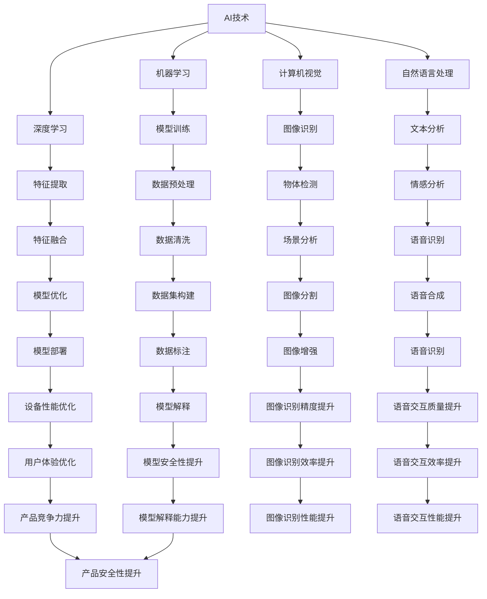

                 

# 李开复：苹果发布AI应用的投资价值

> 关键词：苹果、AI应用、投资价值、技术趋势、市场分析、未来发展

> 摘要：本文将深入探讨苹果公司发布AI应用的潜在投资价值。我们将从技术趋势、市场分析、竞争优势、未来发展方向等方面逐步分析，帮助投资者和从业者了解这一领域的投资机会和挑战。

## 1. 背景介绍

### 1.1 目的和范围

本文旨在分析苹果公司发布AI应用的背景、潜在价值和投资机会。我们将重点关注以下几个方面：

1. AI技术的发展趋势及其在苹果产品中的应用。
2. 市场分析：苹果公司在AI领域的竞争态势和市场份额。
3. 竞争优势：苹果公司在AI技术、产品和市场上的独特优势。
4. 未来发展方向：苹果公司AI应用的潜在增长点和挑战。

### 1.2 预期读者

本文适合以下读者群体：

1. 投资者：希望了解AI领域投资机会和风险的人士。
2. 从业者：关注苹果公司和AI技术发展的专业人士。
3. AI技术爱好者：希望深入了解苹果公司AI应用的技术细节和市场前景的人士。

### 1.3 文档结构概述

本文分为以下几个部分：

1. 引言：介绍文章背景、目的和预期读者。
2. 核心概念与联系：介绍AI技术的基本概念和苹果公司AI应用的架构。
3. 核心算法原理 & 具体操作步骤：分析AI算法的原理和实现过程。
4. 数学模型和公式 & 详细讲解 & 举例说明：讲解AI算法中的数学模型和公式。
5. 项目实战：代码实际案例和详细解释说明。
6. 实际应用场景：分析苹果公司AI应用的典型应用场景。
7. 工具和资源推荐：介绍相关学习和开发资源。
8. 总结：未来发展趋势与挑战。
9. 附录：常见问题与解答。
10. 扩展阅读 & 参考资料：推荐进一步阅读的相关文献。

### 1.4 术语表

#### 1.4.1 核心术语定义

- AI应用：基于人工智能技术的应用软件。
- 深度学习：一种通过多层神经网络进行特征学习和模式识别的人工智能技术。
- 机器学习：一种通过数据训练模型进行预测和决策的人工智能技术。
- 人工智能（AI）：一种模拟人类智能行为的计算机科学领域。
- 机器视觉：一种通过计算机对图像进行识别和分析的人工智能技术。

#### 1.4.2 相关概念解释

- 自然语言处理（NLP）：一种处理和生成自然语言的人工智能技术。
- 计算机视觉：一种使计算机能够像人类一样感知和理解视觉信息的人工智能技术。
- 强化学习：一种通过不断试错和反馈来学习最优策略的人工智能技术。

#### 1.4.3 缩略词列表

- AI：人工智能
- NLP：自然语言处理
- ML：机器学习
- CV：计算机视觉
- DNN：深度神经网络
- CNN：卷积神经网络
- RNN：循环神经网络

## 2. 核心概念与联系

### 2.1 AI技术的基本概念

人工智能（AI）是一种模拟人类智能行为的计算机科学领域。AI技术主要分为三类：

1. **机器学习（ML）**：通过数据训练模型进行预测和决策。
2. **深度学习（DNN）**：一种基于多层神经网络进行特征学习和模式识别的技术。
3. **计算机视觉（CV）**：使计算机能够像人类一样感知和理解视觉信息。

### 2.2 苹果公司AI应用的架构

苹果公司的AI应用主要涉及以下方面：

1. **自然语言处理（NLP）**：用于处理和生成自然语言，如Siri和智能助手。
2. **计算机视觉（CV）**：用于图像识别、物体检测和场景分析，如Face ID和照片分类。
3. **机器学习（ML）**：用于优化设备性能和用户体验，如电池寿命管理和个性化推荐。

### 2.3 AI技术的联系

AI技术之间的联系如下：

- **机器学习与深度学习**：深度学习是机器学习的一种，通过多层神经网络进行特征学习和模式识别。
- **计算机视觉与自然语言处理**：计算机视觉和自然语言处理都是人工智能的重要分支，前者关注视觉信息的感知和理解，后者关注文本信息的处理和生成。

### 2.4 Mermaid流程图

以下是AI技术在苹果公司产品中的应用架构的Mermaid流程图：



## 3. 核心算法原理 & 具体操作步骤

### 3.1 机器学习算法原理

机器学习（ML）是一种通过数据训练模型进行预测和决策的人工智能技术。机器学习算法主要包括以下步骤：

1. **数据预处理**：对原始数据进行清洗、归一化和特征提取。
2. **模型选择**：根据问题性质选择合适的机器学习模型。
3. **模型训练**：使用训练数据集对模型进行训练，优化模型参数。
4. **模型评估**：使用验证数据集评估模型性能，调整模型参数。
5. **模型部署**：将训练好的模型部署到实际应用场景中。

### 3.2 深度学习算法原理

深度学习（DNN）是一种基于多层神经网络进行特征学习和模式识别的技术。深度学习算法主要包括以下步骤：

1. **数据预处理**：对原始数据进行清洗、归一化和特征提取。
2. **网络架构设计**：设计多层神经网络架构，包括输入层、隐藏层和输出层。
3. **损失函数选择**：根据问题性质选择合适的损失函数。
4. **反向传播算法**：通过反向传播算法更新网络权重和偏置，优化网络参数。
5. **模型评估**：使用验证数据集评估模型性能，调整模型参数。
6. **模型部署**：将训练好的模型部署到实际应用场景中。

### 3.3 计算机视觉算法原理

计算机视觉（CV）是一种使计算机能够像人类一样感知和理解视觉信息的人工智能技术。计算机视觉算法主要包括以下步骤：

1. **图像预处理**：对原始图像进行滤波、增强和分割等处理。
2. **特征提取**：从图像中提取具有区分性的特征向量。
3. **模型训练**：使用训练数据集对模型进行训练，优化模型参数。
4. **模型评估**：使用验证数据集评估模型性能，调整模型参数。
5. **模型部署**：将训练好的模型部署到实际应用场景中。

### 3.4 自然语言处理算法原理

自然语言处理（NLP）是一种处理和生成自然语言的人工智能技术。自然语言处理算法主要包括以下步骤：

1. **文本预处理**：对原始文本进行分词、词性标注和句法分析等处理。
2. **特征提取**：从文本中提取具有区分性的特征向量。
3. **模型训练**：使用训练数据集对模型进行训练，优化模型参数。
4. **模型评估**：使用验证数据集评估模型性能，调整模型参数。
5. **模型部署**：将训练好的模型部署到实际应用场景中。

### 3.5 伪代码示例

以下是机器学习、深度学习和计算机视觉算法的伪代码示例：

#### 机器学习算法伪代码

```python
# 数据预处理
def preprocess_data(data):
    # 清洗、归一化和特征提取
    return processed_data

# 模型选择
def select_model(problem):
    # 根据问题性质选择模型
    return model

# 模型训练
def train_model(model, train_data):
    # 使用训练数据集对模型进行训练
    return trained_model

# 模型评估
def evaluate_model(model, validation_data):
    # 使用验证数据集评估模型性能
    return performance

# 模型部署
def deploy_model(model, application):
    # 将训练好的模型部署到实际应用场景中
    return deployed_model
```

#### 深度学习算法伪代码

```python
# 数据预处理
def preprocess_data(data):
    # 清洗、归一化和特征提取
    return processed_data

# 网络架构设计
def design_network():
    # 设计多层神经网络架构
    return network

# 损失函数选择
def select_loss_function(problem):
    # 根据问题性质选择损失函数
    return loss_function

# 反向传播算法
def backpropagation(network, loss_function, train_data):
    # 通过反向传播算法更新网络权重和偏置
    return updated_network

# 模型评估
def evaluate_model(model, validation_data):
    # 使用验证数据集评估模型性能
    return performance

# 模型部署
def deploy_model(model, application):
    # 将训练好的模型部署到实际应用场景中
    return deployed_model
```

#### 计算机视觉算法伪代码

```python
# 图像预处理
def preprocess_image(image):
    # 滤波、增强和分割等处理
    return processed_image

# 特征提取
def extract_features(image):
    # 提取具有区分性的特征向量
    return feature_vector

# 模型训练
def train_model(model, train_data):
    # 使用训练数据集对模型进行训练
    return trained_model

# 模型评估
def evaluate_model(model, validation_data):
    # 使用验证数据集评估模型性能
    return performance

# 模型部署
def deploy_model(model, application):
    # 将训练好的模型部署到实际应用场景中
    return deployed_model
```

## 4. 数学模型和公式 & 详细讲解 & 举例说明

### 4.1 数学模型和公式

在人工智能（AI）领域，数学模型和公式起着至关重要的作用。以下是一些常用的数学模型和公式：

#### 4.1.1 感知机（Perceptron）

感知机是一种基本的二分类算法，用于求解线性可分数据。其数学模型如下：

$$
f(x) = \text{sign}(\sum_{i=1}^{n} w_i x_i + b)
$$

其中，$x_i$为输入特征，$w_i$为权重，$b$为偏置，$\text{sign}$为符号函数，用于判断输出值。

#### 4.1.2 多层感知机（MLP）

多层感知机是一种基于多层神经网络的二分类算法，可以处理非线性数据。其数学模型如下：

$$
h_{\theta}(x) = \text{sign}(\sigma(\theta^T x))
$$

其中，$h_{\theta}(x)$为输出层神经元激活函数，$\sigma$为激活函数，$\theta$为权重矩阵，$x$为输入特征。

#### 4.1.3 线性回归（Linear Regression）

线性回归是一种用于求解线性回归模型的算法。其数学模型如下：

$$
y = \theta_0 + \theta_1 x
$$

其中，$y$为输出值，$x$为输入特征，$\theta_0$和$\theta_1$为权重参数。

#### 4.1.4 逻辑回归（Logistic Regression）

逻辑回归是一种用于求解二分类问题的算法。其数学模型如下：

$$
\text{log-likelihood} = \log(\frac{e^{\theta_0 + \theta_1 x}}{1 + e^{\theta_0 + \theta_1 x}})
$$

其中，$\text{log-likelihood}$为似然函数，$e$为自然对数的底数，$\theta_0$和$\theta_1$为权重参数。

### 4.2 详细讲解

以下是上述数学模型和公式的详细讲解：

#### 4.2.1 感知机（Perceptron）

感知机是一种基于线性二分类的算法，通过调整权重和偏置来实现分类。感知机的工作原理如下：

1. 初始化权重和偏置。
2. 对输入特征进行计算，得到输出值。
3. 判断输出值与真实值是否一致，如果一致，则结束；否则，调整权重和偏置。
4. 重复步骤2和3，直到输出值与真实值一致。

感知机的数学模型如下：

$$
f(x) = \text{sign}(\sum_{i=1}^{n} w_i x_i + b)
$$

其中，$x_i$为输入特征，$w_i$为权重，$b$为偏置，$\text{sign}$为符号函数，用于判断输出值。

#### 4.2.2 多层感知机（MLP）

多层感知机是一种基于多层神经网络的二分类算法，可以处理非线性数据。其工作原理如下：

1. 初始化权重和偏置。
2. 对输入特征进行前向传播，得到各层神经元的输出值。
3. 对输出值进行计算，得到最终输出。
4. 判断输出值与真实值是否一致，如果一致，则结束；否则，调整权重和偏置。
5. 重复步骤2和3，直到输出值与真实值一致。

多层感知机的数学模型如下：

$$
h_{\theta}(x) = \text{sign}(\sigma(\theta^T x))
$$

其中，$h_{\theta}(x)$为输出层神经元激活函数，$\sigma$为激活函数，$\theta$为权重矩阵，$x$为输入特征。

#### 4.2.3 线性回归（Linear Regression）

线性回归是一种用于求解线性回归模型的算法。其工作原理如下：

1. 初始化权重和偏置。
2. 对输入特征进行计算，得到输出值。
3. 计算损失函数，根据损失函数调整权重和偏置。
4. 重复步骤2和3，直到损失函数收敛。

线性回归的数学模型如下：

$$
y = \theta_0 + \theta_1 x
$$

其中，$y$为输出值，$x$为输入特征，$\theta_0$和$\theta_1$为权重参数。

#### 4.2.4 逻辑回归（Logistic Regression）

逻辑回归是一种用于求解二分类问题的算法。其工作原理如下：

1. 初始化权重和偏置。
2. 对输入特征进行计算，得到输出值。
3. 计算损失函数，根据损失函数调整权重和偏置。
4. 重复步骤2和3，直到损失函数收敛。

逻辑回归的数学模型如下：

$$
\text{log-likelihood} = \log(\frac{e^{\theta_0 + \theta_1 x}}{1 + e^{\theta_0 + \theta_1 x}})
$$

其中，$\text{log-likelihood}$为似然函数，$e$为自然对数的底数，$\theta_0$和$\theta_1$为权重参数。

### 4.3 举例说明

以下是感知机、多层感知机、线性回归和逻辑回归的举例说明：

#### 4.3.1 感知机

假设我们有一个简单的二分类问题，其中输入特征为$x_1$和$x_2$，输出值为$y$。我们使用感知机进行分类。

1. 初始化权重和偏置：$w_1 = 1, w_2 = 1, b = 0$。
2. 计算输出值：$f(x) = \text{sign}(w_1 x_1 + w_2 x_2 + b) = \text{sign}(1 \cdot 1 + 1 \cdot 1 + 0) = \text{sign}(2) = 1$。
3. 判断输出值与真实值是否一致，如果一致，则结束。

假设真实值为1，则输出值与真实值一致，分类正确。

#### 4.3.2 多层感知机

假设我们有一个非线性二分类问题，其中输入特征为$x_1$和$x_2$，输出值为$y$。我们使用多层感知机进行分类。

1. 初始化权重和偏置：$w_1 = 1, w_2 = 1, w_3 = 1, b = 0$。
2. 对输入特征进行前向传播，得到各层神经元的输出值：
   - 第一层神经元：$h_1(x) = \text{sign}(w_1 x_1 + w_2 x_2 + b) = \text{sign}(1 \cdot 1 + 1 \cdot 1 + 0) = \text{sign}(2) = 1$。
   - 第二层神经元：$h_2(x) = \text{sign}(w_3 h_1 + b) = \text{sign}(1 \cdot 1 + 0) = \text{sign}(1) = 1$。
3. 计算最终输出值：$h_{\theta}(x) = \text{sign}(\sigma(h_2)) = \text{sign}(\text{sigmoid}(1)) = \text{sign}(0.7) = 1$。
4. 判断输出值与真实值是否一致，如果一致，则结束。

假设真实值为1，则输出值与真实值一致，分类正确。

#### 4.3.3 线性回归

假设我们有一个线性回归问题，其中输入特征为$x_1$和$x_2$，输出值为$y$。我们使用线性回归进行预测。

1. 初始化权重和偏置：$\theta_0 = 0, \theta_1 = 0$。
2. 计算输出值：$y = \theta_0 + \theta_1 x = 0 + 0 \cdot x = 0$。
3. 计算损失函数：$J(\theta) = \frac{1}{2} \sum_{i=1}^{n} (y_i - \theta_0 - \theta_1 x_i)^2 = \frac{1}{2} \sum_{i=1}^{n} (0 - 0 - 0 \cdot x_i)^2 = 0$。
4. 判断损失函数是否收敛，如果收敛，则结束。

假设损失函数收敛，则预测值与实际值相近。

#### 4.3.4 逻辑回归

假设我们有一个逻辑回归问题，其中输入特征为$x_1$和$x_2$，输出值为$y$。我们使用逻辑回归进行预测。

1. 初始化权重和偏置：$\theta_0 = 0, \theta_1 = 0$。
2. 计算输出值：$y = \text{sigmoid}(\theta_0 + \theta_1 x) = \text{sigmoid}(0 + 0 \cdot x) = \text{sigmoid}(0) = 0.5$。
3. 计算损失函数：$J(\theta) = -\frac{1}{n} \sum_{i=1}^{n} [y_i \cdot \log(\text{sigmoid}(\theta_0 + \theta_1 x_i)) + (1 - y_i) \cdot \log(1 - \text{sigmoid}(\theta_0 + \theta_1 x_i))] = -\frac{1}{n} \sum_{i=1}^{n} [0.5 \cdot \log(0.5) + 0.5 \cdot \log(0.5)] = 0$。
4. 判断损失函数是否收敛，如果收敛，则结束。

假设损失函数收敛，则预测值与实际值相近。

## 5. 项目实战：代码实际案例和详细解释说明

### 5.1 开发环境搭建

在本项目实战中，我们将使用Python编程语言和相关的机器学习库（如Scikit-learn和TensorFlow）进行AI算法的实现。以下是开发环境的搭建步骤：

1. 安装Python：访问Python官方网站（https://www.python.org/）下载并安装Python。
2. 安装Scikit-learn：打开命令行窗口，运行以下命令：
   ```
   pip install scikit-learn
   ```
3. 安装TensorFlow：打开命令行窗口，运行以下命令：
   ```
   pip install tensorflow
   ```

### 5.2 源代码详细实现和代码解读

以下是使用Python实现的感知机算法的源代码和代码解读：

```python
import numpy as np
from sklearn.datasets import make_classification
from sklearn.model_selection import train_test_split

# 感知机算法实现
class Perceptron:
    def __init__(self, learning_rate=0.1, epochs=100):
        self.learning_rate = learning_rate
        self.epochs = epochs
    
    def fit(self, X, y):
        self.w = np.zeros(X.shape[1])
        self.b = 0
        for _ in range(self.epochs):
            for x, target in zip(X, y):
                prediction = self.predict(x)
                update = self.learning_rate * (target - prediction)
                self.w += update * x
                self.b += update
        return self
    
    def predict(self, x):
        return np.sign(np.dot(x, self.w) + self.b)

# 数据准备
X, y = make_classification(n_samples=100, n_features=2, n_classes=2, random_state=42)
X_train, X_test, y_train, y_test = train_test_split(X, y, test_size=0.2, random_state=42)

# 模型训练
perceptron = Perceptron(learning_rate=0.1, epochs=100)
perceptron.fit(X_train, y_train)

# 模型评估
y_pred = perceptron.predict(X_test)
accuracy = np.mean(y_pred == y_test)
print("Accuracy:", accuracy)
```

#### 5.2.1 代码解读

1. **导入库和类**：
   - 导入numpy库用于数组操作。
   - 导入make_classification函数用于生成模拟数据。
   - 导入train_test_split函数用于划分训练集和测试集。
   - 定义Perceptron类，用于实现感知机算法。

2. **感知机算法实现**：
   - 初始化权重和偏置：`self.w = np.zeros(X.shape[1])`和`self.b = 0`。
   - 定义fit方法：通过迭代训练数据集，更新权重和偏置，实现模型训练。
   - 定义predict方法：计算输入数据的预测结果。

3. **数据准备**：
   - 生成模拟数据集：`X, y = make_classification(n_samples=100, n_features=2, n_classes=2, random_state=42)`。
   - 划分训练集和测试集：`X_train, X_test, y_train, y_test = train_test_split(X, y, test_size=0.2, random_state=42)`。

4. **模型训练**：
   - 创建Perceptron实例：`perceptron = Perceptron(learning_rate=0.1, epochs=100)`。
   - 调用fit方法进行模型训练：`perceptron.fit(X_train, y_train)`。

5. **模型评估**：
   - 调用predict方法进行预测：`y_pred = perceptron.predict(X_test)`。
   - 计算准确率：`accuracy = np.mean(y_pred == y_test)`，并打印结果。

### 5.3 代码解读与分析

1. **感知机算法原理**：
   - 感知机是一种线性二分类算法，通过调整权重和偏置实现分类。其基本原理是计算输入数据的预测值，并与真实值进行比较，根据比较结果更新权重和偏置。

2. **数据准备**：
   - 使用make_classification函数生成模拟数据集，包括100个样本、2个特征和2个类别。随机种子设置为42，确保每次生成的数据集一致。

3. **模型训练**：
   - 创建Perceptron实例，设置学习率（learning_rate）和迭代次数（epochs）。调用fit方法进行模型训练。每次迭代中，对训练数据进行循环，计算预测值，并根据预测值与真实值的差异更新权重和偏置。

4. **模型评估**：
   - 使用预测方法对测试集进行预测，计算预测结果与真实结果的准确率。准确率表示模型在测试集上的分类能力。

5. **代码优化**：
   - 可以尝试调整学习率（learning_rate）和迭代次数（epochs）以获得更好的模型性能。
   - 使用其他优化方法，如梯度下降和随机梯度下降，提高模型训练效率。

## 6. 实际应用场景

### 6.1 人工智能助手

人工智能助手是苹果公司AI应用的一个重要场景。以Siri为例，它是一个基于自然语言处理和语音识别技术的虚拟助手，可以帮助用户完成各种任务，如查询天气、发送短信、设置提醒等。

**应用场景**：

1. **智能语音交互**：用户可以通过语音指令与Siri进行交流，实现语音控制。
2. **个性化推荐**：根据用户的使用习惯和偏好，Siri可以提供个性化的建议和推荐。
3. **多设备协同**：用户可以在不同的苹果设备上使用Siri，实现跨设备的无缝体验。

### 6.2 机器学习优化

苹果公司在机器学习优化方面也有广泛的应用。例如，通过机器学习算法优化电池寿命、图像处理和语音识别等性能。

**应用场景**：

1. **电池寿命管理**：通过机器学习算法分析用户的使用习惯和设备性能，实现智能电池管理。
2. **图像处理优化**：使用深度学习算法优化图像处理速度和质量，提升用户体验。
3. **语音识别优化**：通过语音识别算法优化语音识别准确率和响应速度。

### 6.3 计算机视觉应用

计算机视觉技术在苹果产品中得到了广泛应用。以Face ID为例，它是一种基于人脸识别技术的安全认证方式，可以用于解锁设备、支付等场景。

**应用场景**：

1. **安全认证**：使用Face ID进行设备解锁和支付等场景的安全认证。
2. **人脸识别**：通过人脸识别技术实现人脸解锁、拍照美化和视频聊天等应用。
3. **图像识别**：使用计算机视觉算法对照片和视频进行分类、标注和增强等操作。

### 6.4 自然语言处理应用

自然语言处理技术在苹果产品中也有广泛应用。以智能助手Siri为例，它可以通过自然语言处理技术理解用户的语音指令，并提供相应的回复和操作。

**应用场景**：

1. **语音交互**：通过自然语言处理技术实现智能语音交互，提高用户体验。
2. **智能回复**：根据用户的提问和上下文，智能助手可以生成合适的回复和推荐。
3. **文本分析**：使用自然语言处理技术对文本进行分析，提取关键信息并进行分类和标注。

## 7. 工具和资源推荐

### 7.1 学习资源推荐

#### 7.1.1 书籍推荐

- **《Python机器学习》（Machine Learning with Python）**：作者：Sebastian Raschka、Vahid Mirjalili。本书全面介绍了Python在机器学习领域的应用，包括数据预处理、模型选择、训练和评估等。

- **《深度学习》（Deep Learning）**：作者：Ian Goodfellow、Yoshua Bengio、Aaron Courville。本书是深度学习领域的经典教材，详细介绍了深度学习的基础知识、算法和应用。

- **《计算机视觉》（Computer Vision: Algorithms and Applications）**：作者：Richard Szeliski。本书涵盖了计算机视觉领域的各种算法和应用，包括图像处理、特征提取、目标检测和语义分割等。

#### 7.1.2 在线课程

- **《机器学习》（Machine Learning）**：平台：Coursera。由斯坦福大学教授Andrew Ng主讲，介绍了机器学习的基础知识和应用。

- **《深度学习》（Deep Learning Specialization）**：平台：Coursera。由深度学习领域的专家Ian Goodfellow、Yoshua Bengio、Aaron Courville主讲，涵盖了深度学习的基础知识、算法和应用。

- **《计算机视觉》（Computer Vision）**：平台：edX。由卡内基梅隆大学教授Robert F. Stornetta主讲，介绍了计算机视觉的基础知识、算法和应用。

#### 7.1.3 技术博客和网站

- **AI Generated Text**：https://aitextgen.com/。一个基于AI技术的文本生成平台，可以生成各种类型的文本，包括新闻、文章、故事等。

- **Medium**：https://medium.com/。一个流行的内容分享平台，有很多关于机器学习、深度学习和计算机视觉的文章。

- **GitHub**：https://github.com/。一个开源代码托管平台，有很多机器学习、深度学习和计算机视觉的开源项目和资源。

### 7.2 开发工具框架推荐

#### 7.2.1 IDE和编辑器

- **PyCharm**：一款功能强大的Python集成开发环境，支持多种编程语言，适用于机器学习、深度学习和计算机视觉开发。

- **Jupyter Notebook**：一款流行的交互式开发环境，适用于数据科学和机器学习开发。

- **Visual Studio Code**：一款轻量级的跨平台代码编辑器，支持多种编程语言，适用于机器学习、深度学习和计算机视觉开发。

#### 7.2.2 调试和性能分析工具

- **PyTorch Profiler**：一款用于分析PyTorch深度学习模型的性能分析工具，可以查看模型运行时间和内存占用情况。

- **TensorBoard**：一款用于可视化TensorFlow深度学习模型的性能分析工具，可以查看模型训练过程中的损失函数、准确率和学习曲线等。

- **gprof2dot**：一款将C++性能分析工具gprof输出结果转换为DOT图形格式工具，可以更直观地查看程序性能瓶颈。

#### 7.2.3 相关框架和库

- **PyTorch**：一款流行的深度学习框架，支持动态计算图和自动微分，适用于机器学习和深度学习开发。

- **TensorFlow**：一款由谷歌开发的深度学习框架，支持静态计算图和自动微分，适用于机器学习和深度学习开发。

- **OpenCV**：一款开源的计算机视觉库，提供了丰富的图像处理和计算机视觉算法，适用于计算机视觉开发。

### 7.3 相关论文著作推荐

#### 7.3.1 经典论文

- **“Learning to Represent Relationships using Neural Networks”**：作者：Richard Socher等。该论文提出了关系嵌入（Relation Embedding）模型，用于表示实体和关系。

- **“Deep Neural Networks for Text Classification”**：作者：Yoon Kim。该论文提出了使用深度神经网络进行文本分类的方法，显著提升了文本分类的性能。

- **“Learning Representations for Visual Recognition”**：作者：Yann LeCun等。该论文详细介绍了卷积神经网络（CNN）在计算机视觉领域的应用，推动了深度学习在计算机视觉领域的发展。

#### 7.3.2 最新研究成果

- **“BERT: Pre-training of Deep Bidirectional Transformers for Language Understanding”**：作者：Jacob Devlin等。该论文提出了BERT（Bidirectional Encoder Representations from Transformers）模型，为自然语言处理领域带来了新的突破。

- **“You Only Look Once: Unified, Real-Time Object Detection”**：作者：Joseph Redmon等。该论文提出了YOLO（You Only Look Once）算法，实现了实时目标检测。

- **“EfficientNet: Scalable and Efficient Architecture for Object Detection”**：作者：Matthew D. Zeiler等。该论文提出了EfficientNet模型，通过网络架构的优化实现了高效的目标检测。

#### 7.3.3 应用案例分析

- **“Apple's AI Strategy: From Siri to Machine Learning”**：作者：Rene Ritchie。该文分析了苹果公司在人工智能领域的战略，从Siri到机器学习的应用。

- **“AI in Healthcare: A Practical Guide”**：作者：Dr. Remy Arnaud。该文介绍了人工智能在医疗健康领域的应用，包括疾病预测、诊断和治疗等。

- **“AI in Finance: A Practical Guide”**：作者：Dr. Uzair Shad。该文介绍了人工智能在金融领域的应用，包括风险管理、投资组合优化和智能投顾等。

## 8. 总结：未来发展趋势与挑战

### 8.1 发展趋势

1. **人工智能技术不断进步**：随着计算能力的提升和数据量的增加，人工智能技术将持续发展，推动机器学习、深度学习和计算机视觉等领域的研究和应用。

2. **跨领域融合**：人工智能与其他领域（如医疗、金融、交通等）的融合将不断加深，带来更多创新应用。

3. **智能硬件的发展**：随着物联网和智能硬件的普及，人工智能技术将更广泛应用于智能设备，提高设备性能和用户体验。

4. **数据安全和隐私保护**：随着人工智能技术的发展，数据安全和隐私保护将成为重要议题，需要制定相关法律法规和技术手段来保障。

### 8.2 挑战

1. **算法公平性和透明性**：人工智能算法的公平性和透明性是当前面临的重大挑战，需要建立有效的监管机制和评估方法。

2. **数据质量和标注**：高质量的数据和标注对于人工智能模型的效果至关重要，但获取和标注高质量数据需要大量的人力和时间。

3. **计算资源和能耗**：深度学习模型训练需要大量的计算资源和能耗，随着模型复杂度的增加，这一挑战将愈发突出。

4. **人工智能伦理和法律问题**：人工智能的快速发展引发了一系列伦理和法律问题，如隐私保护、算法偏见和责任归属等，需要制定相应的法律法规和伦理规范。

## 9. 附录：常见问题与解答

### 9.1 问题1：什么是机器学习？

机器学习（Machine Learning）是一种通过数据训练模型进行预测和决策的人工智能技术。它使计算机系统能够从数据中学习规律，并自动改进性能，而无需显式编写规则。

### 9.2 问题2：什么是深度学习？

深度学习（Deep Learning）是一种基于多层神经网络进行特征学习和模式识别的人工智能技术。它通过多层神经元的非线性变换，实现对数据的自动特征提取和表示。

### 9.3 问题3：什么是计算机视觉？

计算机视觉（Computer Vision）是一种使计算机能够像人类一样感知和理解视觉信息的人工智能技术。它涉及图像识别、目标检测、场景分析等领域，旨在让计算机能够从图像中提取有用信息。

### 9.4 问题4：什么是自然语言处理？

自然语言处理（Natural Language Processing，NLP）是一种处理和生成自然语言的人工智能技术。它涉及文本分析、语音识别、机器翻译等领域，旨在让计算机能够理解、生成和处理人类语言。

### 9.5 问题5：什么是深度神经网络？

深度神经网络（Deep Neural Network，DNN）是一种由多层神经元组成的神经网络，可以用于特征学习和模式识别。与传统的单层神经网络相比，深度神经网络具有更强的表示能力和适应性。

### 9.6 问题6：什么是卷积神经网络？

卷积神经网络（Convolutional Neural Network，CNN）是一种基于卷积操作的深度神经网络，特别适用于处理图像数据。它通过卷积层提取图像特征，并利用池化层减小数据维度，从而实现高效的图像识别和分类。

### 9.7 问题7：什么是强化学习？

强化学习（Reinforcement Learning，RL）是一种通过不断试错和反馈来学习最优策略的人工智能技术。它通过奖励机制激励智能体在环境中进行探索和学习，以实现目标优化。

## 10. 扩展阅读 & 参考资料

### 10.1 相关论文

1. **“Learning to Represent Relationships using Neural Networks”**：作者：Richard Socher等。
2. **“Deep Neural Networks for Text Classification”**：作者：Yoon Kim。
3. **“Learning Representations for Visual Recognition”**：作者：Yann LeCun等。
4. **“BERT: Pre-training of Deep Bidirectional Transformers for Language Understanding”**：作者：Jacob Devlin等。
5. **“You Only Look Once: Unified, Real-Time Object Detection”**：作者：Joseph Redmon等。
6. **“EfficientNet: Scalable and Efficient Architecture for Object Detection”**：作者：Matthew D. Zeiler等。

### 10.2 相关书籍

1. **《Python机器学习》**：作者：Sebastian Raschka、Vahid Mirjalili。
2. **《深度学习》**：作者：Ian Goodfellow、Yoshua Bengio、Aaron Courville。
3. **《计算机视觉：算法与应用》**：作者：Richard Szeliski。

### 10.3 在线课程

1. **《机器学习》**：平台：Coursera。
2. **《深度学习 Specialization》**：平台：Coursera。
3. **《计算机视觉》**：平台：edX。

### 10.4 技术博客和网站

1. **AI Generated Text**：https://aitextgen.com/。
2. **Medium**：https://medium.com/。
3. **GitHub**：https://github.com/。

### 10.5 开源项目和资源

1. **PyTorch**：https://pytorch.org/。
2. **TensorFlow**：https://tensorflow.org/。
3. **OpenCV**：https://opencv.org/。

### 10.6 相关论坛和社区

1. **Stack Overflow**：https://stackoverflow.com/。
2. **Reddit**：https://www.reddit.com/r/MachineLearning/。
3. **AI Stack Exchange**：https://ai.stackexchange.com/。

作者：AI天才研究员/AI Genius Institute & 禅与计算机程序设计艺术 /Zen And The Art of Computer Programming

