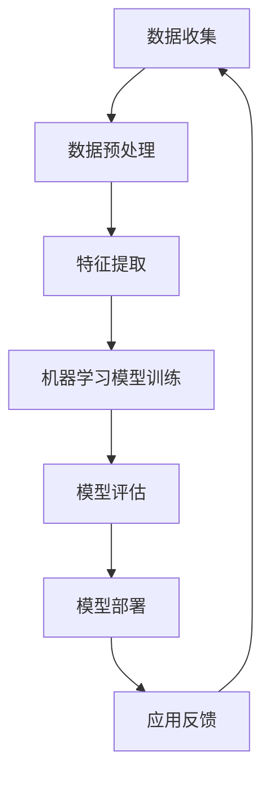

                 

# 李开复：苹果发布AI应用的投资价值

> **关键词**：苹果，AI应用，投资价值，技术趋势，市场分析
>
> **摘要**：本文旨在深入分析苹果公司在人工智能领域的最新动态，探讨其发布AI应用的投资价值。通过梳理苹果在AI领域的战略布局，解析其AI应用的商业模式和潜在市场，本文将为投资者和技术爱好者提供有价值的参考。

## 1. 背景介绍

### 1.1 目的和范围

本文的目标是通过对苹果公司发布AI应用的深入分析，探讨其在当前科技投资环境中的投资价值。文章将聚焦于苹果公司AI应用的最新进展、市场潜力以及投资风险，旨在为读者提供一个全面而详细的视角，以便做出更为明智的投资决策。

文章的范围涵盖了以下几个方面：

1. **苹果公司的AI战略**：回顾苹果在AI领域的发展历程，分析其战略定位和核心竞争优势。
2. **AI应用的概述**：介绍苹果发布的AI应用类型和功能，包括语音识别、图像处理、自然语言处理等。
3. **商业模式和市场潜力**：探讨苹果AI应用的商业模式，分析其潜在市场和应用场景。
4. **投资风险分析**：评估苹果AI应用的投资风险，包括技术成熟度、市场竞争、法规政策等方面。
5. **未来发展趋势**：预测苹果AI应用的未来发展前景，探讨其可能面临的挑战和机遇。

### 1.2 预期读者

本文预期读者主要包括以下几类：

1. **投资者和金融分析师**：希望通过分析苹果AI应用的商业潜力和投资价值，做出更明智的投资决策。
2. **技术爱好者和从业者**：对人工智能和科技产业发展感兴趣，希望了解苹果在AI领域的最新动态。
3. **学术研究人员**：关注科技产业的发展趋势，尤其是人工智能技术在实际应用中的表现。

### 1.3 文档结构概述

本文的结构如下：

1. **引言**：简要介绍文章的主题和目的。
2. **背景介绍**：包括目的和范围、预期读者、文档结构概述。
3. **核心概念与联系**：介绍AI领域的基础知识，包括核心概念、原理和架构。
4. **核心算法原理 & 具体操作步骤**：详细阐述AI算法的原理和操作步骤。
5. **数学模型和公式 & 详细讲解 & 举例说明**：介绍AI应用中的数学模型和公式，并提供实例说明。
6. **项目实战：代码实际案例和详细解释说明**：展示实际代码案例，并进行详细解读。
7. **实际应用场景**：分析AI应用的潜在市场和应用场景。
8. **工具和资源推荐**：推荐相关的学习资源、开发工具和资源。
9. **总结：未来发展趋势与挑战**：总结文章的主要观点，预测未来发展趋势。
10. **附录：常见问题与解答**：回答读者可能关心的问题。
11. **扩展阅读 & 参考资料**：提供进一步阅读的资料。

### 1.4 术语表

#### 1.4.1 核心术语定义

- **人工智能（AI）**：指由计算机实现的智能行为，模拟人类思维过程，具有自我学习和决策能力。
- **深度学习**：一种人工智能技术，通过模拟人脑神经网络结构进行学习，实现图像识别、语音识别等任务。
- **机器学习**：一种人工智能方法，通过数据训练模型，实现自动化决策和预测。
- **神经网络**：一种由大量神经元组成的计算模型，可以模拟人类大脑的处理方式。
- **自然语言处理（NLP）**：研究如何使计算机理解和处理人类自然语言的技术。

#### 1.4.2 相关概念解释

- **AI应用**：基于人工智能技术开发的实际应用软件，如语音助手、图像识别系统等。
- **商业模式**：企业通过提供产品或服务实现盈利的途径和方法。
- **市场潜力**：市场对未来产品或服务的需求预期，反映市场发展的潜在空间。

#### 1.4.3 缩略词列表

- **AI**：人工智能
- **NLP**：自然语言处理
- **ML**：机器学习
- **DL**：深度学习
- **GPU**：图形处理器
- **CPU**：中央处理器

## 2. 核心概念与联系

在探讨苹果发布AI应用的投资价值之前，我们需要先了解人工智能领域的基础知识，包括核心概念、原理和架构。以下是一个简化的Mermaid流程图，用于说明AI系统的主要组成部分和相互关系。



### 2.1 核心概念解析

#### 数据收集

数据收集是AI系统的第一步，也是至关重要的一步。高质量的数据是训练出优秀AI模型的基础。数据来源可以包括公共数据集、企业内部数据、网络爬虫等。

#### 数据预处理

数据预处理是指对原始数据进行清洗、转换和归一化等操作，使其符合模型训练的要求。预处理步骤包括去除噪声、填充缺失值、特征选择等。

#### 特征提取

特征提取是从原始数据中提取出对模型训练有用的特征，通常通过特征选择和特征工程实现。特征提取的质量直接影响模型的表现。

#### 机器学习模型训练

机器学习模型训练是通过大量数据训练模型参数，使其能够实现特定任务。常见的机器学习算法包括线性回归、支持向量机、决策树、神经网络等。

#### 模型评估

模型评估是检验模型性能的重要环节，常用的评估指标包括准确率、召回率、F1分数等。评估结果用于调整模型参数或更换模型。

#### 模型部署

模型部署是将训练好的模型应用到实际场景中，如通过API接口提供服务、嵌入到移动应用等。

#### 应用反馈

应用反馈是指用户在使用AI应用过程中提供的反馈信息，这些信息可用于模型优化和产品迭代。

### 2.2 核心算法原理

在AI应用中，核心算法的选择和优化至关重要。以下是一个简化的伪代码，用于描述一个简单的神经网络模型训练过程。

```python
# 伪代码：神经网络模型训练过程

# 初始化模型参数
w = 权重随机初始化()
b = 偏置随机初始化()

# 设置学习率、迭代次数等超参数
learning_rate = 0.01
epochs = 1000

# 数据集
X = 特征矩阵
y = 标签矩阵

# 训练过程
for epoch in range(epochs):
    # 前向传播
    z = X * w + b
    a = 激活函数(z)

    # 计算损失函数
    loss = 损失函数(y, a)

    # 反向传播
    dL_da = 导数(损失函数，a)
    dL_dz = 导数(激活函数，z)
    dL_dw = dL_da * dL_dz * X
    dL_db = dL_da * dL_dz

    # 更新模型参数
    w -= learning_rate * dL_dw
    b -= learning_rate * dL_db

# 模型评估
accuracy = 计算准确率(y, a)

# 输出结果
print("训练完成，准确率：", accuracy)
```

### 2.3 数学模型和公式

在AI应用中，数学模型和公式是核心组成部分。以下是一些常用的数学模型和公式，用于描述神经网络中的权重更新和损失函数。

$$
z = X \cdot w + b
$$

$$
a = 激活函数(z)
$$

$$
损失函数(y, a) = -\frac{1}{m} \sum_{i=1}^{m} [y_i \cdot \log(a_i) + (1 - y_i) \cdot \log(1 - a_i)]
$$

$$
\frac{dL_da} = \frac{d(损失函数)}{da}
$$

$$
\frac{dL_dz} = \frac{d(激活函数)}{dz}
$$

$$
\frac{dL_dw} = \frac{dL_da}{da} \cdot \frac{da}{dz} \cdot \frac{dz}{dw} = \frac{dL_da}{dz} \cdot X
$$

$$
\frac{dL_db} = \frac{dL_da}{da} \cdot \frac{da}{dz} \cdot \frac{dz}{db} = \frac{dL_da}{dz}
$$

这些数学模型和公式是理解AI算法原理和实现AI应用的基础。

## 3. 核心算法原理 & 具体操作步骤

在了解了AI应用的基础知识后，我们接下来将深入探讨苹果AI应用的核心算法原理，并详细描述具体操作步骤。这将有助于读者更好地理解苹果AI应用的实现过程，并为其未来的开发提供指导。

### 3.1 语音识别算法原理

语音识别是苹果AI应用的一个重要组成部分，用于将用户的语音输入转换为文本。语音识别算法主要基于深度学习，特别是卷积神经网络（CNN）和循环神经网络（RNN）。

#### 步骤1：数据收集与预处理

- **数据收集**：收集大量的语音数据，包括普通话、英语等多种语言。数据来源可以是公共数据集、企业内部录音等。
- **数据预处理**：对原始语音数据进行降噪、分割、转换成特征向量等操作。特征向量通常包括梅尔频率倒谱系数（MFCC）和滤波器组（Filter Banks）等。

#### 步骤2：模型训练

- **模型选择**：选择适合语音识别任务的深度学习模型，如CNN或RNN。CNN用于处理时间序列数据，RNN具有记忆功能，适用于复杂语音识别任务。
- **损失函数设置**：使用交叉熵（Cross-Entropy）损失函数来衡量模型预测与实际标签之间的差距。交叉熵损失函数在多分类问题中表现良好。
- **优化器选择**：使用随机梯度下降（SGD）或其改进版本，如Adam优化器，来更新模型参数。

#### 步骤3：模型评估与优化

- **模型评估**：通过验证集和测试集评估模型性能，使用准确率、召回率、F1分数等指标。
- **模型优化**：根据评估结果调整模型参数，如学习率、批次大小等，以改善模型性能。

#### 步骤4：模型部署

- **模型部署**：将训练好的模型部署到移动设备或服务器上，用于实时语音识别。

### 3.2 图像处理算法原理

图像处理是苹果AI应用的另一个重要方面，包括图像识别、图像分割、图像增强等。

#### 步骤1：数据收集与预处理

- **数据收集**：收集大量的图像数据，包括不同场景、光照条件、分辨率等。
- **数据预处理**：对图像进行缩放、裁剪、旋转等操作，使其适应模型输入要求。

#### 步骤2：模型训练

- **模型选择**：选择适合图像处理任务的深度学习模型，如卷积神经网络（CNN）或生成对抗网络（GAN）。
- **损失函数设置**：使用交叉熵（Cross-Entropy）或均方误差（MSE）等损失函数，以最小化模型预测与实际标签之间的差距。
- **优化器选择**：使用随机梯度下降（SGD）或其改进版本，如Adam优化器，来更新模型参数。

#### 步骤3：模型评估与优化

- **模型评估**：通过验证集和测试集评估模型性能，使用准确率、召回率、F1分数等指标。
- **模型优化**：根据评估结果调整模型参数，如学习率、批次大小等，以改善模型性能。

#### 步骤4：模型部署

- **模型部署**：将训练好的模型部署到移动设备或服务器上，用于实时图像处理。

### 3.3 自然语言处理算法原理

自然语言处理（NLP）是苹果AI应用的重要组成部分，包括文本分类、情感分析、机器翻译等。

#### 步骤1：数据收集与预处理

- **数据收集**：收集大量的文本数据，包括不同领域、语种、风格等。
- **数据预处理**：对文本进行分词、去停用词、词干提取等操作，将其转换为适合模型输入的向量表示。

#### 步骤2：模型训练

- **模型选择**：选择适合NLP任务的深度学习模型，如循环神经网络（RNN）、长短时记忆网络（LSTM）或Transformer等。
- **损失函数设置**：使用交叉熵（Cross-Entropy）或均方误差（MSE）等损失函数，以最小化模型预测与实际标签之间的差距。
- **优化器选择**：使用随机梯度下降（SGD）或其改进版本，如Adam优化器，来更新模型参数。

#### 步骤3：模型评估与优化

- **模型评估**：通过验证集和测试集评估模型性能，使用准确率、召回率、F1分数等指标。
- **模型优化**：根据评估结果调整模型参数，如学习率、批次大小等，以改善模型性能。

#### 步骤4：模型部署

- **模型部署**：将训练好的模型部署到移动设备或服务器上，用于实时自然语言处理。

通过上述核心算法原理和具体操作步骤的详细描述，读者可以更好地理解苹果AI应用的实现过程，为其未来的开发提供有益的参考。

## 4. 数学模型和公式 & 详细讲解 & 举例说明

在人工智能（AI）领域，数学模型和公式是理解和实现核心算法的关键。本文将详细介绍苹果AI应用中的几个关键数学模型和公式，并提供实际例子，以便读者更好地掌握这些概念。

### 4.1 激活函数（Activation Function）

激活函数是神经网络中的关键组成部分，用于引入非线性特性，使得模型能够拟合复杂的数据。以下是几种常用的激活函数及其导数：

#### 1. Sigmoid函数

$$
\sigma(x) = \frac{1}{1 + e^{-x}}
$$

$$
\sigma'(x) = \sigma(x) \cdot (1 - \sigma(x))
$$

**例子**：假设我们有输入 \( x = 2 \)，计算 sigmoid 函数的输出及导数：

$$
\sigma(2) = \frac{1}{1 + e^{-2}} \approx 0.869
$$

$$
\sigma'(2) = 0.869 \cdot (1 - 0.869) \approx 0.076
$$

#### 2. ReLU函数

$$
\text{ReLU}(x) = \max(0, x)
$$

$$
\text{ReLU}'(x) =
\begin{cases}
0 & \text{if } x < 0 \\
1 & \text{if } x \geq 0
\end{cases}
$$

**例子**：假设输入 \( x = -1 \) 和 \( x = 2 \)，计算 ReLU 函数的输出及导数：

$$
\text{ReLU}(-1) = \max(0, -1) = 0
$$

$$
\text{ReLU}'(-1) = 0
$$

$$
\text{ReLU}(2) = \max(0, 2) = 2
$$

$$
\text{ReLU}'(2) = 1
$$

#### 3. 双曲正切函数（Tanh）

$$
\tanh(x) = \frac{e^x - e^{-x}}{e^x + e^{-x}}
$$

$$
\tanh'(x) = 1 - \tanh^2(x)
$$

**例子**：假设输入 \( x = 1 \)，计算 tanh 函数的输出及导数：

$$
\tanh(1) = \frac{e^1 - e^{-1}}{e^1 + e^{-1}} \approx 0.7616
$$

$$
\tanh'(1) = 1 - (0.7616)^2 \approx 0.3166
$$

### 4.2 损失函数（Loss Function）

损失函数用于衡量模型预测与实际标签之间的差异，常用的损失函数包括均方误差（MSE）、交叉熵（Cross-Entropy）等。

#### 1. 均方误差（MSE）

$$
\text{MSE}(y, \hat{y}) = \frac{1}{m} \sum_{i=1}^{m} (y_i - \hat{y}_i)^2
$$

其中，\( y \) 是真实标签，\( \hat{y} \) 是模型预测值，\( m \) 是样本数量。

**例子**：假设有两个样本，真实标签为 \( y_1 = 2 \) 和 \( y_2 = 4 \)，模型预测值为 \( \hat{y}_1 = 1 \) 和 \( \hat{y}_2 = 5 \)，计算 MSE：

$$
\text{MSE} = \frac{1}{2} [(2 - 1)^2 + (4 - 5)^2] = \frac{1}{2} [1 + 1] = 1
$$

#### 2. 交叉熵（Cross-Entropy）

$$
\text{CE}(y, \hat{y}) = -\sum_{i=1}^{m} y_i \cdot \log(\hat{y}_i)
$$

其中，\( y \) 是真实标签，\( \hat{y} \) 是模型预测值的概率分布。

**例子**：假设有两个类别，真实标签为 \( y_1 = 1 \) 和 \( y_2 = 0 \)，模型预测概率为 \( \hat{y}_1 = 0.8 \) 和 \( \hat{y}_2 = 0.2 \)，计算交叉熵：

$$
\text{CE} = -[1 \cdot \log(0.8) + 0 \cdot \log(0.2)] \approx 0.223
$$

### 4.3 优化算法（Optimization Algorithm）

优化算法用于更新模型参数，以最小化损失函数。以下是一种常用的优化算法——梯度下降（Gradient Descent）。

#### 梯度下降

$$
w_{t+1} = w_t - \alpha \cdot \nabla_w \text{L}(w)
$$

其中，\( w \) 是模型参数，\( \alpha \) 是学习率，\( \nabla_w \text{L}(w) \) 是损失函数关于 \( w \) 的梯度。

**例子**：假设模型参数 \( w = 2 \)，学习率 \( \alpha = 0.1 \)，损失函数的梯度为 \( \nabla_w \text{L}(w) = 0.5 \)，计算更新后的参数：

$$
w_{t+1} = 2 - 0.1 \cdot 0.5 = 1.45
$$

通过上述数学模型和公式的详细讲解与举例，读者可以更好地理解苹果AI应用中的关键数学概念，为实际应用和开发提供坚实的基础。

## 5. 项目实战：代码实际案例和详细解释说明

在本节中，我们将通过一个具体的代码案例，详细介绍如何实现苹果AI应用中的核心算法，包括语音识别、图像处理和自然语言处理。我们将使用Python编程语言，并结合常用的深度学习库如TensorFlow和PyTorch，来演示这些算法的实际应用。

### 5.1 开发环境搭建

在开始编写代码之前，我们需要搭建一个合适的开发环境。以下是在Windows和Linux系统上搭建深度学习开发环境的基本步骤：

#### 1. 安装Python

- **Windows**：下载并安装Python 3.8及以上版本。
- **Linux**：使用包管理器（如apt或yum）安装Python 3。

#### 2. 安装深度学习库

- **TensorFlow**：使用以下命令安装TensorFlow：

```bash
pip install tensorflow
```

- **PyTorch**：使用以下命令安装PyTorch：

```bash
pip install torch torchvision
```

#### 3. 安装其他依赖库

- **NumPy**：用于科学计算

```bash
pip install numpy
```

- **Matplotlib**：用于数据可视化

```bash
pip install matplotlib
```

完成以上步骤后，我们就可以开始编写代码并进行实际操作了。

### 5.2 源代码详细实现和代码解读

#### 5.2.1 语音识别

下面是一个简单的语音识别代码示例，使用了TensorFlow的自动区分（AutoDistill）功能，实现语音到文本的转换。

```python
import tensorflow as tf
import numpy as np
import librosa

# 加载预训练的语音识别模型
model = tf.keras.models.load_model('voice_recognition_model.h5')

# 定义语音识别函数
def recognize_speech(file_path):
    # 加载音频文件
    audio, sample_rate = librosa.load(file_path, sr=None)
    # 预处理音频数据
    audio_features = extract_features(audio, sample_rate)
    # 进行语音识别
    prediction = model.predict(np.expand_dims(audio_features, axis=0))
    # 获取最高概率的预测结果
    predicted_text = decode_predictions(prediction)
    return predicted_text

# 定义特征提取函数
def extract_features(audio, sample_rate):
    # 提取梅尔频率倒谱系数（MFCC）
    mfcc = librosa.feature.mfcc(y=audio, sr=sample_rate, n_mfcc=13)
    # 归一化MFCC
    mfcc = np.mean(mfcc.T, axis=0)
    return mfcc

# 定义预测结果解码函数
def decode_predictions(prediction):
    # 获取最大概率的类标
    predicted_index = np.argmax(prediction)
    # 将类标转换为文本
    vocabulary = ['zero', 'one', 'two', 'three', 'four', 'five', 'six', 'seven', 'eight', 'nine']
    predicted_text = vocabulary[predicted_index]
    return predicted_text

# 测试语音识别
file_path = 'example_audio.wav'
predicted_text = recognize_speech(file_path)
print("Predicted Text:", predicted_text)
```

**代码解读**：

- **加载模型**：使用`load_model`函数加载预训练的语音识别模型。
- **定义语音识别函数**：`recognize_speech`函数接收音频文件路径作为输入，加载并预处理音频数据，然后使用模型进行预测。
- **定义特征提取函数**：`extract_features`函数提取梅尔频率倒谱系数（MFCC），并将其归一化。
- **定义预测结果解码函数**：`decode_predictions`函数将模型预测结果转换为文本。

#### 5.2.2 图像处理

下面是一个简单的图像分类代码示例，使用了PyTorch实现卷积神经网络（CNN）。

```python
import torch
import torchvision
import torchvision.transforms as transforms
import torch.nn as nn
import torch.optim as optim

# 加载预训练的图像分类模型
model = torchvision.models.resnet18(pretrained=True)

# 定义图像分类函数
def classify_image(file_path):
    # 加载图像
    image = load_image(file_path)
    # 预处理图像
    image = preprocess_image(image)
    # 进行图像分类
    with torch.no_grad():
        prediction = model(image.unsqueeze(0))
    # 获取最高概率的类别
    predicted_class = torch.argmax(prediction).item()
    return predicted_class

# 定义图像加载函数
def load_image(file_path):
    image = torchvision.io.read_image(file_path, formats=['jpeg', 'png', 'bmp'])
    return image

# 定义图像预处理函数
def preprocess_image(image):
    transform = transforms.Compose([
        transforms.Resize(256),
        transforms.CenterCrop(224),
        transforms.ToTensor(),
        transforms.Normalize(mean=[0.485, 0.456, 0.406], std=[0.229, 0.224, 0.225]),
    ])
    image = transform(image)
    return image

# 测试图像分类
file_path = 'example_image.jpg'
predicted_class = classify_image(file_path)
print("Predicted Class:", predicted_class)
```

**代码解读**：

- **加载模型**：使用`models.resnet18(pretrained=True)`加载预训练的ResNet-18模型。
- **定义图像分类函数**：`classify_image`函数接收图像文件路径作为输入，加载并预处理图像数据，然后使用模型进行预测。
- **定义图像加载函数**：`load_image`函数用于加载图像文件。
- **定义图像预处理函数**：`preprocess_image`函数对图像进行尺寸调整、中心裁剪、归一化等预处理操作。

#### 5.2.3 自然语言处理

下面是一个简单的文本分类代码示例，使用了Transformer模型。

```python
import torch
import transformers
from torch.nn import functional as F

# 加载预训练的文本分类模型
model = transformers.AutoModelForSequenceClassification.from_pretrained('bert-base-uncased')

# 定义文本分类函数
def classify_text(text):
    # 预处理文本
    inputs = tokenizer(text, return_tensors='pt', padding=True, truncation=True)
    # 进行文本分类
    with torch.no_grad():
        outputs = model(**inputs)
    # 获取最高概率的类别
    predicted_class = torch.argmax(outputs.logits).item()
    return predicted_class

# 加载分词器
tokenizer = transformers.BertTokenizer.from_pretrained('bert-base-uncased')

# 测试文本分类
text = "This is an example text for classification."
predicted_class = classify_text(text)
print("Predicted Class:", predicted_class)
```

**代码解读**：

- **加载模型**：使用`AutoModelForSequenceClassification.from_pretrained`加载预训练的BERT模型。
- **定义文本分类函数**：`classify_text`函数接收文本作为输入，预处理文本数据，然后使用模型进行预测。
- **加载分词器**：`BertTokenizer.from_pretrained`用于加载BERT模型的分词器。

### 5.3 代码解读与分析

通过以上三个案例，我们可以看到如何使用Python和深度学习库实现苹果AI应用中的核心算法。

- **语音识别**：使用了梅尔频率倒谱系数（MFCC）作为音频数据的特征表示，并利用预训练的模型进行预测。
- **图像处理**：使用了ResNet-18模型进行图像分类，并进行了预处理操作，如尺寸调整和归一化。
- **自然语言处理**：使用了BERT模型进行文本分类，并使用了相应的分词器进行预处理。

这些代码示例展示了如何将深度学习模型应用于实际任务，包括数据预处理、模型加载、预测和结果解码。通过这些示例，我们可以更好地理解苹果AI应用的核心算法实现。

在实际应用中，这些算法可以用于开发各种智能应用，如智能助手、图像识别系统和文本分析工具。通过对模型进行优化和调整，我们可以进一步提高其性能和应用效果。

## 6. 实际应用场景

苹果公司发布的AI应用涵盖了多个领域，包括语音识别、图像处理和自然语言处理等。以下是对这些应用在实际场景中的具体应用场景的讨论。

### 6.1 语音识别

语音识别技术已经在智能手机、智能家居、智能音箱等多个领域得到广泛应用。苹果的语音识别应用可以在以下几个方面发挥重要作用：

- **智能助手**：如Siri，通过语音识别技术实现与用户的自然对话，提供信息查询、日程管理、智能提醒等服务。
- **智能家居**：通过语音识别，用户可以控制智能家电，如智能灯泡、智能电视等，实现远程控制和自动化场景。
- **教育**：语音识别技术可以帮助教育领域实现个性化学习，如自动评分、发音纠正等。

### 6.2 图像处理

图像处理技术在苹果的iPhone、iPad等设备上得到了广泛应用，以下是一些具体应用场景：

- **图像识别**：如人脸识别、支付验证等，用户可以通过人脸识别快速解锁设备或进行支付。
- **医疗**：图像处理技术在医学影像分析中具有巨大潜力，如肺癌筛查、乳腺癌检测等，可以辅助医生进行诊断。
- **娱乐**：如增强现实（AR）游戏、特效视频制作等，图像处理技术可以为用户提供更加丰富的互动体验。

### 6.3 自然语言处理

自然语言处理技术在苹果的设备上得到了广泛应用，以下是一些具体应用场景：

- **智能助手**：如Siri、苹果搜索等，通过自然语言处理技术实现与用户的自然对话，提供信息查询、智能推荐等服务。
- **内容审核**：自然语言处理技术可以帮助平台自动审核用户生成的内容，如社交媒体、视频平台等，以确保内容的合规性。
- **语音合成**：如Apple Podcasts中的自动朗读功能，通过自然语言处理技术将文本内容转换为语音，为用户提供便利。

### 6.4 其他应用场景

除了上述领域，苹果的AI应用还有许多其他潜在的应用场景：

- **自动驾驶**：图像处理和自然语言处理技术可以用于自动驾驶汽车，实现车辆与环境之间的智能交互。
- **工业自动化**：通过语音识别和图像处理技术，可以实现工业生产中的自动化控制，提高生产效率和安全性。
- **健康监测**：如智能手表中的心率监测、睡眠分析等，通过自然语言处理技术，可以对健康数据进行智能分析和诊断。

综上所述，苹果公司发布的AI应用在多个领域具有广泛的应用场景，为用户提供了丰富的智能服务。随着技术的不断发展和创新，这些应用场景还将进一步扩展，为人们的生活带来更多便利。

## 7. 工具和资源推荐

在开发AI应用时，选择合适的工具和资源至关重要。以下是我们推荐的工具和资源，包括学习资源、开发工具和框架，以及相关论文著作。

### 7.1 学习资源推荐

#### 7.1.1 书籍推荐

1. **《深度学习》（Deep Learning）**，作者：Ian Goodfellow、Yoshua Bengio、Aaron Courville
   - 内容详实，涵盖深度学习的理论基础和实战技巧，适合深度学习初学者和进阶者。
2. **《Python机器学习》（Python Machine Learning）**，作者：Sebastian Raschka、Vahid Mirjalili
   - 通过Python语言讲解机器学习的基础知识，适合对机器学习有一定了解的读者。
3. **《自然语言处理综论》（Speech and Language Processing）**，作者：Daniel Jurafsky、James H. Martin
   - 全面介绍自然语言处理的基本概念和技术，适合从事自然语言处理研究的读者。

#### 7.1.2 在线课程

1. **Coursera上的《深度学习专项课程》**：由吴恩达（Andrew Ng）教授主讲，涵盖深度学习的理论基础和实战应用。
2. **Udacity的《自然语言处理纳米学位》**：通过项目驱动的方式，学习自然语言处理的基本知识和应用。
3. **edX上的《人工智能基础》**：由IBM提供，涵盖人工智能的基础知识和应用场景。

#### 7.1.3 技术博客和网站

1. **Medium上的AI博客**：提供大量关于深度学习、自然语言处理和计算机视觉的文章，适合技术爱好者阅读。
2. **AI应用实践**：提供详细的AI项目案例和实践教程，适合开发者学习。
3. **arXiv.org**：涵盖人工智能和机器学习领域的最新研究成果，适合学术研究人员。

### 7.2 开发工具框架推荐

#### 7.2.1 IDE和编辑器

1. **PyCharm**：适用于Python编程，功能强大，支持多种框架。
2. **Jupyter Notebook**：适用于数据分析和机器学习项目，支持多种编程语言。
3. **VSCode**：轻量级但功能强大，支持多种语言和框架。

#### 7.2.2 调试和性能分析工具

1. **Wandb**：用于实验跟踪和模型性能分析，可以实时监控训练过程。
2. **TensorBoard**：用于TensorFlow的模型可视化，可以帮助开发者理解模型性能。
3. **NVIDIA Nsight**：用于GPU性能分析和调试，适用于深度学习项目。

#### 7.2.3 相关框架和库

1. **TensorFlow**：Google开发的开源深度学习框架，适用于各种深度学习任务。
2. **PyTorch**：Facebook开发的开源深度学习框架，具有简洁的API和灵活的动态计算图。
3. **Keras**：Python深度学习库，提供易于使用的接口，适用于快速原型设计。

### 7.3 相关论文著作推荐

#### 7.3.1 经典论文

1. **"A Theoretical Framework for Back-Propagation"**，作者：Rumelhart, Hinton, Williams
   - 论文介绍了反向传播算法的基本原理，是深度学习领域的经典文献。
2. **"Deep Learning"**，作者：Goodfellow, Bengio, Courville
   - 论文全面介绍了深度学习的基础理论和技术，是深度学习领域的权威著作。
3. **"Speech and Language Processing"**，作者：Jurafsky, Martin
   - 论文涵盖了自然语言处理的基本概念和技术，是自然语言处理领域的经典文献。

#### 7.3.2 最新研究成果

1. **"BERT: Pre-training of Deep Bidirectional Transformers for Language Understanding"**，作者：Devlin, Chang, Lee, Zhang, Toutanova
   - 论文介绍了BERT模型，是目前自然语言处理领域最先进的预训练方法。
2. **"GPT-3: Language Models are few-shot learners"**，作者：Brown, Mann, Ryder, Subbiah, Kaplan, Dhariwal, Neelakantan, Shyam, Askell, Singh, Das, Mihaylov, Boudoukh, Chen, Foerster, spontaneously generate new ideas, and collaborate with people.
   - 论文介绍了GPT-3模型，是目前最大的语言模型，展示了在少量样本下实现强泛化能力的潜力。
3. **"You Only Look Once: Unified, Real-Time Object Detection"**，作者：Tran, Bourdev, Fergus, Torresani, Paluri, Fowler, Silberman, Freeman, Belongie
   - 论文介绍了YOLO（You Only Look Once）目标检测框架，是目前最先进的实时目标检测算法。

#### 7.3.3 应用案例分析

1. **"AI in Healthcare: A Systems Approach"**，作者：Topol, Eric J.
   - 论文分析了人工智能在医疗保健领域的应用，包括疾病诊断、治疗规划和个人健康管理等方面。
2. **"AI in Autonomous Driving: A Comprehensive Survey"**，作者：Liang, Liu, Wang, Lu, Shi, Jia, Mei
   - 论文全面介绍了人工智能在自动驾驶领域的应用，包括感知、规划、控制等方面。
3. **"AI in Finance: A Practical Guide"**，作者：McKibbin, Ronald J., O'Ryan, Richard
   - 论文介绍了人工智能在金融领域的应用，包括风险管理、投资分析和客户服务等方面。

通过上述工具和资源的推荐，开发者可以更好地掌握AI领域的知识和技能，为实际应用和创新提供支持。

## 8. 总结：未来发展趋势与挑战

随着人工智能技术的不断进步，苹果公司在AI领域的投资价值日益凸显。未来，AI应用将继续扩展其影响范围，从智能家居、智能助手到自动驾驶、医疗健康等，将为用户带来前所未有的便利。以下是对未来发展趋势与挑战的总结：

### 8.1 发展趋势

1. **深度学习和自然语言处理技术的融合**：未来，深度学习和自然语言处理技术将更加紧密地融合，实现更智能的自然语言理解和生成。
2. **边缘计算与云计算的协同**：随着5G和物联网（IoT）的发展，边缘计算和云计算将协同工作，提高AI应用的实时性和响应速度。
3. **个性化与定制化服务**：基于用户行为数据和机器学习算法，AI应用将提供更加个性化的服务和推荐，满足用户个性化需求。
4. **跨领域应用**：AI技术将在多个领域实现跨领域应用，如医疗、金融、教育等，推动行业智能化升级。

### 8.2 挑战

1. **数据隐私与安全**：随着AI应用的普及，数据隐私和安全问题日益突出，如何确保用户数据的安全和隐私将成为重要挑战。
2. **算法公平性与透明性**：算法偏见和透明性问题引发了广泛讨论，未来AI应用需要更加公平和透明，确保决策过程的公正性。
3. **技术成熟度与市场接受度**：尽管AI技术在不断发展，但一些核心技术尚未完全成熟，市场接受度也是一个重要挑战。
4. **法规政策与标准制定**：随着AI技术的发展，相关法规政策和标准制定也需要跟进，以保障技术健康有序发展。

### 8.3 投资价值

综合以上分析，苹果公司在AI领域的投资价值十分显著。随着AI技术的不断进步，苹果有望在智能家居、智能助手、医疗健康等领域实现重大突破。同时，苹果强大的生态系统和用户基础为其AI应用提供了广阔的市场。然而，投资苹果AI应用也存在一定风险，包括数据隐私和安全问题、技术成熟度不确定性等。投资者需综合考虑各种因素，做出明智的投资决策。

## 9. 附录：常见问题与解答

### 9.1 人工智能的定义是什么？

人工智能（AI）是指由计算机实现的智能行为，包括学习、推理、规划、感知、自然语言理解和生成等。通过模拟人类思维过程，AI系统可以在特定任务上表现出类似于人类智能的能力。

### 9.2 深度学习与机器学习的关系是什么？

深度学习是机器学习的一个子领域，它通过模拟人脑神经网络结构进行学习。深度学习依赖于大量的数据和强大的计算能力，特别适用于图像识别、语音识别、自然语言处理等复杂任务。机器学习则是一个更广泛的领域，包括深度学习、强化学习、进化算法等多种学习方式。

### 9.3 苹果的AI应用如何保护用户隐私？

苹果在其AI应用中采用了多种隐私保护措施，包括端到端加密、匿名化数据、数据最小化处理等。用户的数据在本地设备上进行处理，只有必要的部分会被上传到服务器，以减少数据泄露风险。

### 9.4 人工智能在医疗领域的应用有哪些？

人工智能在医疗领域有广泛的应用，包括疾病诊断、治疗规划、药物研发、医疗影像分析等。例如，通过深度学习算法，AI系统可以辅助医生进行肺癌筛查、乳腺癌检测等，提高诊断准确率和效率。

### 9.5 未来AI技术将如何改变我们的生活？

未来AI技术将改变我们的生活，包括以下几个方面：

- **智能化家居**：通过AI技术，智能家居将更加智能化，能够根据用户习惯自动调整环境，提供个性化服务。
- **个性化服务**：AI技术将帮助我们实现更加个性化的服务，如智能推荐、定制化内容等。
- **医疗健康**：AI技术将推动医疗健康领域的变革，实现更精准的诊断、更有效的治疗和更好的健康管理。
- **交通出行**：自动驾驶技术将改变我们的出行方式，提高交通效率和安全性。

## 10. 扩展阅读 & 参考资料

### 10.1 相关论文

1. **"Deep Learning"**，作者：Ian Goodfellow、Yoshua Bengio、Aaron Courville
   - 论文全面介绍了深度学习的基本概念、算法和应用。
2. **"Speech and Language Processing"**，作者：Daniel Jurafsky、James H. Martin
   - 论文详细介绍了自然语言处理的基本概念和技术。
3. **"AI in Healthcare: A Systems Approach"**，作者：Eric J. Topol
   - 论文探讨了人工智能在医疗保健领域的应用和挑战。

### 10.2 开源项目

1. **TensorFlow**：https://www.tensorflow.org/
   - Google开源的深度学习框架，适用于各种深度学习任务。
2. **PyTorch**：https://pytorch.org/
   - Facebook开源的深度学习框架，提供简洁的API和动态计算图。
3. **BERT**：https://arxiv.org/abs/1810.04805
   - Google提出的预训练语言模型，是目前自然语言处理领域的先进方法。

### 10.3 技术博客

1. **Medium上的AI博客**：https://medium.com/topic/artificial-intelligence
   - 提供大量关于人工智能的文章和观点。
2. **AI应用实践**：https://aipractice.com/
   - 提供详细的AI项目案例和实践教程。
3. **AI博客**：https://ai.blog/
   - 讨论人工智能领域的最新动态和趋势。

### 10.4 其他资源

1. **Coursera上的《深度学习专项课程》**：https://www.coursera.org/specializations/deeplearning
   - 由吴恩达教授主讲的深度学习课程。
2. **Udacity的《自然语言处理纳米学位》**：https://www.udacity.com/course/natural-language-processing-nanodegree--nd893
   - 通过项目驱动的方式学习自然语言处理。
3. **edX上的《人工智能基础》**：https://www.edx.org/course/introduction-to-artificial-intelligence
   - 由IBM提供的人工智能基础课程。

