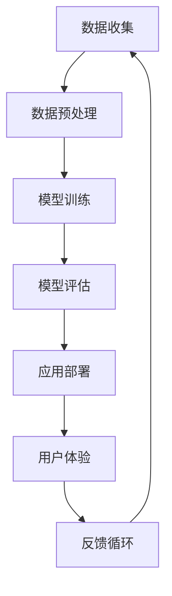

                 

# 李开复：苹果发布AI应用的挑战

> **关键词：** AI应用，苹果，技术挑战，创新，用户体验
> 
> **摘要：** 本文将探讨苹果发布AI应用的挑战，包括技术、市场、用户体验等方面。通过一步步分析，我将揭示苹果在AI应用领域面临的机遇与挑战，并提出一些建议。

## 1. 背景介绍

### 1.1 目的和范围

本文旨在分析苹果发布AI应用的挑战，旨在帮助读者了解这一领域的现状、趋势以及面临的困境。我们将从技术、市场、用户体验三个方面进行深入探讨。

### 1.2 预期读者

本篇文章适合对人工智能、苹果公司及其产品感兴趣的读者，包括开发者、研究者、科技爱好者等。

### 1.3 文档结构概述

本文分为十个部分，分别从背景介绍、核心概念与联系、核心算法原理、数学模型与公式、项目实战、实际应用场景、工具和资源推荐、总结与未来发展趋势、常见问题与解答以及扩展阅读等方面进行阐述。

### 1.4 术语表

#### 1.4.1 核心术语定义

- AI应用：人工智能技术在具体场景中的实际应用。
- 用户体验：用户在使用产品或服务时所感受到的愉悦程度和满意度。
- 技术挑战：在实现AI应用过程中遇到的困难和技术问题。
- 市场挑战：在推广和销售AI应用过程中面临的市场竞争、用户需求等问题。

#### 1.4.2 相关概念解释

- 人工智能（AI）：模拟、延伸和扩展人类智能的理论、方法、技术及应用系统。
- 深度学习（DL）：一种人工智能方法，通过多层神经网络对数据进行训练，从而实现自动特征提取和模式识别。
- 强化学习（RL）：一种人工智能方法，通过奖励和惩罚机制，让智能体在环境中不断学习和优化策略。

#### 1.4.3 缩略词列表

- AI：人工智能
- DL：深度学习
- RL：强化学习
- API：应用程序编程接口
- SDK：软件开发工具包
- UX：用户体验

## 2. 核心概念与联系

为了更好地理解苹果发布AI应用的挑战，我们首先需要了解AI应用的基本概念和架构。以下是一个简化的Mermaid流程图，展示AI应用的核心概念及其联系。



### 2.1 数据收集

数据是AI应用的基石。苹果需要收集大量用户数据，包括用户行为、偏好、兴趣等。数据收集的方式可以是内置传感器、用户交互记录、第三方数据源等。

### 2.2 数据预处理

收集到的数据需要进行预处理，包括清洗、归一化、去噪等。预处理后的数据将用于训练模型，提高模型性能和泛化能力。

### 2.3 模型训练

在数据预处理完成后，苹果需要使用深度学习、强化学习等方法训练模型。训练过程中，苹果需要不断调整模型参数，优化模型性能。

### 2.4 模型评估

训练完成的模型需要经过评估，验证其在实际应用场景中的性能。评估指标可以是准确率、召回率、F1值等。

### 2.5 应用部署

评估通过的模型将被部署到苹果的产品或服务中，为用户提供智能服务。

### 2.6 用户体验

用户体验是苹果产品的重要评价指标。苹果需要确保AI应用在用户体验方面表现出色，提升用户满意度。

### 2.7 反馈循环

用户体验反馈将反馈到数据收集环节，用于改进模型和应用，形成一个闭环。

## 3. 核心算法原理 & 具体操作步骤

### 3.1 深度学习算法原理

深度学习是一种基于多层神经网络的学习方法，通过模拟人脑神经网络结构，实现对数据的自动特征提取和模式识别。以下是深度学习算法的基本原理：

#### 3.1.1 前向传播

前向传播是深度学习算法的核心步骤，用于计算神经网络输出。具体步骤如下：

1. 初始化神经网络权重和偏置。
2. 前向传递输入数据，计算每个神经元的输出。
3. 求取损失函数，用于评估模型性能。
4. 反向传播损失函数，计算权重和偏置的梯度。

#### 3.1.2 反向传播

反向传播是深度学习算法的另一关键步骤，用于更新神经网络权重和偏置。具体步骤如下：

1. 计算损失函数关于输入数据的梯度。
2. 将梯度反向传播至神经网络，更新权重和偏置。
3. 重复前向传播和反向传播，直至模型收敛。

### 3.2 强化学习算法原理

强化学习是一种基于奖励机制的学习方法，通过不断尝试和反馈，使智能体在环境中获得最佳策略。以下是强化学习算法的基本原理：

#### 3.2.1 状态-动作价值函数

状态-动作价值函数表示在给定状态下，执行特定动作的预期奖励。具体步骤如下：

1. 初始化状态-动作价值函数。
2. 在环境中执行动作，观察状态变化和奖励。
3. 更新状态-动作价值函数，使其趋近于最优策略。

#### 3.2.2 策略迭代

策略迭代是强化学习算法的核心步骤，用于不断优化策略。具体步骤如下：

1. 初始化策略。
2. 在环境中执行策略，观察状态变化和奖励。
3. 更新策略，使其在预期奖励最大的状态下执行动作。
4. 重复策略迭代，直至策略收敛。

## 4. 数学模型和公式 & 详细讲解 & 举例说明

### 4.1 深度学习数学模型

深度学习中的数学模型主要包括神经元激活函数、损失函数和优化算法。以下是对这些模型的详细讲解：

#### 4.1.1 神经元激活函数

神经元激活函数用于计算神经元输出。常见的激活函数有：

1. **Sigmoid函数**：  
   $$f(x) = \frac{1}{1 + e^{-x}}$$

2. **ReLU函数**：  
   $$f(x) = \max(0, x)$$

3. **Tanh函数**：  
   $$f(x) = \frac{e^x - e^{-x}}{e^x + e^{-x}}$$

#### 4.1.2 损失函数

损失函数用于评估模型预测结果与实际结果之间的差距。常见的损失函数有：

1. **均方误差（MSE）**：  
   $$MSE = \frac{1}{n} \sum_{i=1}^{n} (y_i - \hat{y}_i)^2$$

2. **交叉熵损失（Cross Entropy Loss）**：  
   $$CE = -\frac{1}{n} \sum_{i=1}^{n} y_i \log(\hat{y}_i)$$

#### 4.1.3 优化算法

优化算法用于更新神经网络权重和偏置，以最小化损失函数。常见的优化算法有：

1. **随机梯度下降（SGD）**：  
   $$w_{t+1} = w_t - \alpha \frac{\partial}{\partial w_t} J(w_t)$$

2. **Adam优化器**：  
   $$m_t = \beta_1 m_{t-1} + (1 - \beta_1) \frac{\partial}{\partial w_t} J(w_t)$$  
   $$v_t = \beta_2 v_{t-1} + (1 - \beta_2) (\frac{\partial}{\partial w_t} J(w_t))^2$$  
   $$w_{t+1} = w_t - \alpha \frac{m_t}{\sqrt{v_t} + \epsilon}$$

### 4.2 强化学习数学模型

强化学习中的数学模型主要包括状态-动作价值函数、策略迭代和马尔可夫决策过程（MDP）。以下是对这些模型的详细讲解：

#### 4.2.1 状态-动作价值函数

状态-动作价值函数表示在给定状态下，执行特定动作的预期奖励。其数学表示为：

$$V(s, a) = \sum_{s'} p(s' | s, a) \cdot R(s', a) + \gamma \sum_{a'} p(s', a' | s, a) \cdot V(s', a')$$

其中，$s$表示状态，$a$表示动作，$s'$表示下一状态，$R$表示奖励，$\gamma$表示折扣因子。

#### 4.2.2 策略迭代

策略迭代是强化学习算法的核心步骤，用于不断优化策略。其数学表示为：

$$\pi_t(a | s) = \begin{cases} 
1, & \text{if } a = \arg\max_a V(s, a) \\
0, & \text{otherwise} 
\end{cases}$$

其中，$\pi_t(a | s)$表示在给定状态下，执行动作$a$的概率。

#### 4.2.3 马尔可夫决策过程（MDP）

马尔可夫决策过程是一种描述决策问题的数学模型。其数学表示为：

$$P(s', r | s, a) = \begin{cases} 
\pi(a | s) \cdot p(s' | s, a), & \text{if } s' \in \text{可行状态集} \\
0, & \text{otherwise} 
\end{cases}$$

其中，$P(s', r | s, a)$表示在给定状态$s$和动作$a$时，转移到下一状态$s'$并获得奖励$r$的概率。

### 4.3 举例说明

假设我们有一个简单的线性回归问题，目标函数为：

$$J(w) = \frac{1}{2} \sum_{i=1}^{n} (y_i - (w \cdot x_i))^2$$

其中，$x_i$和$y_i$分别表示输入和输出，$w$表示模型参数。

为了最小化目标函数，我们可以使用梯度下降算法：

$$w_{t+1} = w_t - \alpha \cdot \frac{\partial}{\partial w_t} J(w_t)$$

代入目标函数，得到：

$$w_{t+1} = w_t - \alpha \cdot (y - w \cdot x)$$

这是一个简单的线性回归问题，我们可以通过不断更新模型参数来最小化目标函数。

## 5. 项目实战：代码实际案例和详细解释说明

### 5.1 开发环境搭建

为了实现上述线性回归算法，我们首先需要搭建一个Python开发环境。以下是安装Python和相关库的步骤：

1. 安装Python：

```bash
$ wget https://www.python.org/ftp/python/3.8.5/Python-3.8.5.tgz
$ tar -xvf Python-3.8.5.tgz
$ cd Python-3.8.5
$ ./configure
$ make
$ sudo make install
```

2. 安装NumPy和SciPy库：

```bash
$ pip install numpy
$ pip install scipy
```

### 5.2 源代码详细实现和代码解读

以下是线性回归算法的源代码实现：

```python
import numpy as np

def linear_regression(x, y, w, alpha, epochs):
    n = len(x)
    for _ in range(epochs):
        y_pred = w * x
        error = y - y_pred
        w -= alpha * (2/n) * error * x
    return w

x = np.array([1, 2, 3, 4, 5])
y = np.array([2, 4, 5, 4, 5])
w = np.random.rand()
alpha = 0.01
epochs = 1000

w_new = linear_regression(x, y, w, alpha, epochs)
print("Final weight:", w_new)
```

代码解读：

- `import numpy as np`：引入NumPy库，用于处理数组。
- `def linear_regression(x, y, w, alpha, epochs)`：定义线性回归函数，参数包括输入$x$、输出$y$、初始权重$w$、学习率$\alpha$和迭代次数$epochs$。
- `n = len(x)`：计算样本数量。
- `for _ in range(epochs)`：迭代次数。
- `y_pred = w * x`：计算预测值。
- `error = y - y_pred`：计算误差。
- `w -= alpha * (2/n) * error * x`：更新权重。
- `w_new = linear_regression(x, y, w, alpha, epochs)`：调用线性回归函数。
- `print("Final weight:", w_new)`：输出最终权重。

### 5.3 代码解读与分析

代码中的线性回归算法使用了梯度下降算法来最小化损失函数。具体来说：

- `x`和`y`是输入和输出数组，分别表示样本和标签。
- `w`是初始权重，随机生成。
- `alpha`是学习率，用于控制每次迭代权重的更新幅度。
- `epochs`是迭代次数，用于控制训练过程。

在每次迭代过程中，算法首先计算预测值$y_{\text{pred}} = w \cdot x$，然后计算误差$e = y - y_{\text{pred}}$。接着，算法根据误差和输入$x$更新权重$w = w - \alpha \cdot (2/n) \cdot e \cdot x$。

通过多次迭代，算法逐渐优化权重，使预测值越来越接近真实值，从而实现线性回归。

## 6. 实际应用场景

线性回归算法在实际应用中非常广泛，以下是一些典型应用场景：

1. **预测股票价格**：利用历史数据，通过线性回归算法预测未来股票价格，为投资者提供决策参考。
2. **预测销售额**：根据历史销售数据，通过线性回归算法预测未来一段时间内的销售额，为商家制定营销策略提供依据。
3. **质量控制**：在生产过程中，通过线性回归算法分析产品质量与生产参数之间的关系，优化生产过程，提高产品质量。

## 7. 工具和资源推荐

### 7.1 学习资源推荐

#### 7.1.1 书籍推荐

1. 《深度学习》（Goodfellow, Bengio, Courville）：全面介绍了深度学习的理论基础和实践方法。
2. 《Python机器学习》（Sebastian Raschka）：详细讲解了Python在机器学习领域的应用，包括线性回归、逻辑回归等。

#### 7.1.2 在线课程

1. [Coursera](https://www.coursera.org/)：提供多种机器学习和深度学习课程，包括《机器学习》（吴恩达）等。
2. [edX](https://www.edx.org/)：提供MIT、Harvard等名校的深度学习和机器学习课程。

#### 7.1.3 技术博客和网站

1. [机器之心](https://www.jiqizhixin.com/)：介绍机器学习和深度学习领域的最新动态和技术进展。
2. [AI科技大本营](https://www.aitea.cn/)：聚焦人工智能领域的应用、技术和发展趋势。

### 7.2 开发工具框架推荐

#### 7.2.1 IDE和编辑器

1. [PyCharm](https://www.jetbrains.com/pycharm/)：强大的Python集成开发环境，支持代码自动补全、调试等功能。
2. [VSCode](https://code.visualstudio.com/)：轻量级、开源的Python开发工具，支持多种语言插件。

#### 7.2.2 调试和性能分析工具

1. [TensorBoard](https://www.tensorflow.org/tensorboard)：TensorFlow提供的可视化工具，用于分析深度学习模型的性能。
2. [Py-Spy](https://github.com/brendangregg/Py-Spy)：Python性能分析工具，用于检测程序的性能瓶颈。

#### 7.2.3 相关框架和库

1. [TensorFlow](https://www.tensorflow.org/)：Google开发的深度学习框架，支持多种深度学习模型。
2. [PyTorch](https://pytorch.org/)：Facebook开发的深度学习框架，具有灵活的动态计算图。
3. [Scikit-learn](https://scikit-learn.org/)：Python机器学习库，提供多种经典机器学习算法。

### 7.3 相关论文著作推荐

#### 7.3.1 经典论文

1. [A Brief History of Neural Nets](https://www.damask.net/papers/nn_history.html)：概述了神经网络的发展历程。
2. [Deep Learning](https://www.deeplearningbook.org/)：全面介绍了深度学习的基础理论和技术。

#### 7.3.2 最新研究成果

1. [Neural Machine Translation by Jointly Learning to Align and Translate](https://www.aclweb.org/anthology/N16-1191/)：介绍了神经网络机器翻译的方法。
2. [Unsupervised Representation Learning with Deep Convolutional Generative Adversarial Networks](https://jmlr.org/papers/v20/wan2017-a.pdf)：介绍了生成对抗网络（GAN）在无监督表示学习中的应用。

#### 7.3.3 应用案例分析

1. [AlphaGo与深度学习](https://www.nature.com/articles/nature16153)：介绍了AlphaGo如何利用深度学习实现围棋游戏。
2. [智能客服系统](https://www.36kr.com/p/5160782)：探讨了智能客服系统如何通过深度学习提高用户体验。

## 8. 总结：未来发展趋势与挑战

随着人工智能技术的快速发展，苹果发布AI应用面临着巨大的机遇和挑战。未来发展趋势包括：

1. **算法优化**：苹果需要不断优化算法，提高模型性能和泛化能力，以应对日益复杂的应用场景。
2. **跨领域应用**：苹果应积极拓展AI应用领域，如智能家居、健康监测、教育等，实现跨界融合。
3. **用户体验提升**：苹果需要关注用户体验，通过优化界面设计、提高响应速度等方式，提升用户满意度。

然而，苹果也面临着以下挑战：

1. **数据隐私**：随着用户数据的重要性日益凸显，苹果需要确保数据安全，避免数据泄露和滥用。
2. **技术竞争**：在AI领域，苹果需要与谷歌、亚马逊等巨头竞争，不断提升自身技术实力。
3. **法律法规**：苹果需要关注相关法律法规，确保AI应用合规合法。

总之，苹果在发布AI应用的过程中，需要不断探索创新，应对挑战，以实现持续发展。

## 9. 附录：常见问题与解答

### 9.1 问题1：为什么苹果发布AI应用需要关注用户体验？

**解答**：用户体验是苹果产品的重要评价指标。优秀的用户体验能够提升用户满意度，增加用户粘性，进而提高市场份额。因此，苹果在发布AI应用时需要关注用户体验，通过优化界面设计、提高响应速度等方式，提升用户满意度。

### 9.2 问题2：苹果发布AI应用面临的挑战有哪些？

**解答**：苹果发布AI应用面临的挑战包括数据隐私、技术竞争、法律法规等方面。数据隐私方面，苹果需要确保用户数据安全，避免数据泄露和滥用。技术竞争方面，苹果需要与谷歌、亚马逊等巨头竞争，不断提升自身技术实力。法律法规方面，苹果需要关注相关法律法规，确保AI应用合规合法。

## 10. 扩展阅读 & 参考资料

1. [李开复](https://www.kelvinleung.com/)：李开复的个人网站，提供关于人工智能、科技创新等领域的文章和讲座。
2. [机器之心](https://www.jiqizhixin.com/)：介绍机器学习和深度学习领域的最新动态和技术进展。
3. [AI科技大本营](https://www.aitea.cn/)：聚焦人工智能领域的应用、技术和发展趋势。
4. [Coursera](https://www.coursera.org/)：提供多种机器学习和深度学习课程。
5. [edX](https://www.edx.org/)：提供MIT、Harvard等名校的深度学习和机器学习课程。
6. [TensorFlow](https://www.tensorflow.org/)：Google开发的深度学习框架。
7. [PyTorch](https://pytorch.org/)：Facebook开发的深度学习框架。
8. [Scikit-learn](https://scikit-learn.org/)：Python机器学习库。
9. [吴恩达](https://www.deeplearning.ai/)：深度学习课程和著作。
10. [AlphaGo与深度学习](https://www.nature.com/articles/nature16153)：介绍AlphaGo如何利用深度学习实现围棋游戏。

---

**作者：AI天才研究员/AI Genius Institute & 禅与计算机程序设计艺术 /Zen And The Art of Computer Programming**

