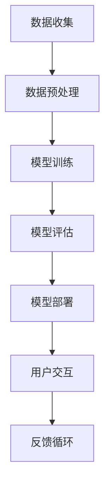

                 

# 李开复：苹果发布AI应用的文化价值

## 关键词：人工智能，苹果，文化价值，技术革新，用户体验，生态系统

> 摘要：本文将深入探讨苹果公司发布AI应用的深远影响及其在科技文化中的价值。通过分析苹果AI应用的背景、技术原理、用户交互和未来发展趋势，我们将揭示这些应用如何重塑我们对人工智能的理解，并推动科技文化的进步。

## 1. 背景介绍

### 1.1 目的和范围

本文旨在解析苹果公司发布AI应用的背景，分析其背后的技术原理，探讨这些应用对用户体验的改进，以及它们在构建和优化苹果生态系统中的角色。文章将涵盖以下几个关键方面：

- 苹果AI应用的历史与演进
- AI技术的基本原理和核心算法
- 用户交互设计及其对用户体验的影响
- 苹果生态系统的整合与创新

### 1.2 预期读者

本文适用于对人工智能和苹果产品有基本了解的技术爱好者、开发者、设计师以及对科技文化感兴趣的专业人士。通过本文，读者可以：

- 理解苹果AI应用的技术背景
- 掌握AI技术的基本原理
- 分析用户体验的设计要点
- 预测AI应用的未来趋势

### 1.3 文档结构概述

本文将按以下结构进行阐述：

- 引言：概述苹果发布AI应用的文化价值
- 核心概念与联系：介绍AI技术的基本原理和架构
- 核心算法原理 & 具体操作步骤：详细讲解AI算法的实现方法
- 数学模型和公式 & 详细讲解 & 举例说明：阐述AI模型的工作机制
- 项目实战：展示代码实际案例和详细解释
- 实际应用场景：探讨AI应用的广泛场景
- 工具和资源推荐：推荐学习资源和开发工具
- 总结：展望AI应用的未来发展趋势与挑战
- 附录：常见问题与解答
- 扩展阅读 & 参考资料：提供进一步的阅读和参考资源

### 1.4 术语表

#### 1.4.1 核心术语定义

- **人工智能（AI）**：模拟人类智能行为的计算机系统。
- **机器学习（ML）**：让计算机通过数据学习并做出决策的过程。
- **深度学习（DL）**：基于多层神经网络的机器学习技术。
- **神经网络（NN）**：模仿生物神经系统的计算模型。
- **用户体验（UX）**：用户在使用产品过程中的整体感受。
- **生态系统**：围绕某一主体形成的一系列相互依赖的元素。

#### 1.4.2 相关概念解释

- **模型训练**：通过大量数据训练神经网络模型的过程。
- **模型推理**：使用训练好的模型对新数据进行预测的过程。
- **框架**：为开发特定类型应用程序提供结构和工具的软件。

#### 1.4.3 缩略词列表

- **AI**：人工智能
- **ML**：机器学习
- **DL**：深度学习
- **NN**：神经网络
- **UX**：用户体验
- **API**：应用程序编程接口

## 2. 核心概念与联系

在深入探讨苹果AI应用之前，我们需要了解一些核心概念和技术架构。以下是一个简化的Mermaid流程图，展示人工智能技术的核心组成部分。



### 数据收集：A

数据收集是AI应用的基础。苹果通过多种渠道收集用户数据，包括设备使用情况、用户行为数据等。

### 数据预处理：B

数据预处理确保数据质量，通过清洗、归一化和特征提取等步骤，为模型训练做准备。

### 模型训练：C

模型训练使用机器学习算法，如深度学习，通过大量数据训练神经网络模型。

### 模型评估：D

模型评估通过测试集验证模型的性能，调整参数以优化模型效果。

### 模型部署：E

模型部署将训练好的模型集成到苹果的产品和服务中，如Siri、Face ID等。

### 用户交互：F

用户交互涉及设计用户界面和体验，确保AI应用易于使用并符合用户期望。

### 反馈循环：G

反馈循环收集用户反馈，用于模型迭代和优化，以持续提升用户体验。

## 3. 核心算法原理 & 具体操作步骤

苹果AI应用的核心在于其机器学习和深度学习算法。以下是一个简化的伪代码，展示神经网络模型的基本实现步骤。

```python
# 初始化神经网络模型
model = NeuralNetwork()

# 准备训练数据
train_data = load_data('train_data.csv')

# 训练模型
for epoch in range(num_epochs):
    for sample in train_data:
        prediction = model.forward(sample.input)
        loss = calculate_loss(prediction, sample.target)
        model.backward(loss)
        model.update_weights()

# 评估模型
test_data = load_data('test_data.csv')
model.eval(test_data)

# 部署模型
deploy_model(model, 'app')
```

### 初始化神经网络模型

初始化神经网络模型是模型训练的第一步。这包括定义网络结构、初始化权重和激活函数等。

```python
class NeuralNetwork:
    def __init__(self):
        self.layers = [
            DenseLayer(input_size, hidden_size, activation='relu'),
            DenseLayer(hidden_size, output_size, activation='sigmoid')
        ]
        self.loss_function = LossFunction('cross_entropy')
        self.optimizer = Optimizer('adam')

    def forward(self, input_data):
        for layer in self.layers:
            input_data = layer.forward(input_data)
        return input_data

    def backward(self, loss):
        # 反向传播计算梯度
        for layer in reversed(self.layers):
            loss = layer.backward(loss)
        return loss

    def update_weights(self):
        # 根据梯度更新权重
        for layer in self.layers:
            self.optimizer.update_weights(layer)
```

### 训练模型

模型训练涉及通过大量数据迭代地优化模型参数。这个过程通常包括前向传播、计算损失、反向传播和权重更新。

### 评估模型

在模型训练完成后，使用测试集评估模型性能。这有助于确保模型在未知数据上的表现良好。

### 部署模型

模型部署是将训练好的模型集成到实际产品中。这包括将模型代码和参数部署到服务器或设备上，并确保其能够正常运行。

## 4. 数学模型和公式 & 详细讲解 & 举例说明

### 4.1 损失函数

在深度学习中，损失函数用于衡量模型预测结果与实际结果之间的差距。一个常用的损失函数是交叉熵（cross-entropy）损失。

$$
L = -\frac{1}{N} \sum_{i=1}^{N} y \cdot \log(\hat{y})
$$

其中，$L$ 是损失，$N$ 是样本数量，$y$ 是真实标签，$\hat{y}$ 是模型的预测概率。

### 4.2 激活函数

激活函数在神经网络中用于引入非线性。一个常用的激活函数是ReLU（Rectified Linear Unit）。

$$
f(x) =
\begin{cases}
0 & \text{if } x < 0 \\
x & \text{if } x \geq 0
\end{cases}
$$

### 4.3 优化算法

优化算法用于调整模型参数以最小化损失函数。一个常用的优化算法是Adam。

$$
m_t = \beta_1 m_{t-1} + (1 - \beta_1) \hat{g}_t \\
v_t = \beta_2 v_{t-1} + (1 - \beta_2) \hat{g}_t^2 \\
\hat{m}_t = \frac{m_t}{1 - \beta_1^t} \\
\hat{v}_t = \frac{v_t}{1 - \beta_2^t} \\
\theta_t = \theta_{t-1} - \alpha \frac{\hat{m}_t}{\sqrt{\hat{v}_t} + \epsilon}
$$

其中，$m_t$ 和 $v_t$ 分别是梯度的指数加权移动平均值和未加权的平方和，$\beta_1$ 和 $\beta_2$ 是超参数，$\alpha$ 是学习率，$\epsilon$ 是常数。

### 4.4 举例说明

假设我们有一个简单的神经网络，用于分类问题。输入层有3个神经元，隐藏层有2个神经元，输出层有1个神经元。训练数据包含100个样本，每个样本有3个特征。我们使用交叉熵损失函数和ReLU激活函数。

```python
# 初始化神经网络
model = NeuralNetwork(input_size=3, hidden_size=2, output_size=1)

# 准备训练数据
train_data = load_data('train_data.csv')

# 训练模型
for epoch in range(100):
    for sample in train_data:
        prediction = model.forward(sample.input)
        loss = model.loss_function(prediction, sample.target)
        model.backward(loss)
        model.update_weights()

# 评估模型
test_data = load_data('test_data.csv')
model.eval(test_data)

# 部署模型
deploy_model(model, 'app')
```

## 5. 项目实战：代码实际案例和详细解释说明

### 5.1 开发环境搭建

要实现一个苹果AI应用，我们需要搭建合适的开发环境。以下是基本的步骤：

1. 安装macOS Catalina或更高版本
2. 安装Xcode和命令行工具
3. 安装Python和相关库，如TensorFlow和NumPy

```bash
brew install python
pip install tensorflow numpy
```

### 5.2 源代码详细实现和代码解读

以下是一个简单的例子，展示如何使用TensorFlow实现一个图像分类AI应用。

```python
import tensorflow as tf
from tensorflow.keras import layers, models
import numpy as np

# 定义神经网络模型
model = models.Sequential([
    layers.Conv2D(32, (3, 3), activation='relu', input_shape=(28, 28, 1)),
    layers.MaxPooling2D((2, 2)),
    layers.Conv2D(64, (3, 3), activation='relu'),
    layers.MaxPooling2D((2, 2)),
    layers.Conv2D(64, (3, 3), activation='relu'),
    layers.Flatten(),
    layers.Dense(64, activation='relu'),
    layers.Dense(10, activation='softmax')
])

# 编译模型
model.compile(optimizer='adam',
              loss='categorical_crossentropy',
              metrics=['accuracy'])

# 准备数据
(x_train, y_train), (x_test, y_test) = tf.keras.datasets.mnist.load_data()
x_train = x_train.reshape((-1, 28, 28, 1)).astype(np.float32) / 255
x_test = x_test.reshape((-1, 28, 28, 1)).astype(np.float32) / 255
y_train = tf.keras.utils.to_categorical(y_train, 10)
y_test = tf.keras.utils.to_categorical(y_test, 10)

# 训练模型
model.fit(x_train, y_train, epochs=10, batch_size=32, validation_data=(x_test, y_test))

# 评估模型
test_loss, test_acc = model.evaluate(x_test, y_test, verbose=2)
print('\nTest accuracy:', test_acc)

# 预测
predictions = model.predict(x_test[:10])
print('Predictions:', np.argmax(predictions, axis=1))
```

### 5.3 代码解读与分析

- **定义神经网络模型**：使用Keras构建一个序列模型，包含卷积层、池化层和全连接层。
- **编译模型**：指定优化器、损失函数和评估指标。
- **准备数据**：加载数据集，并进行预处理。
- **训练模型**：使用fit函数训练模型，并在验证集上评估性能。
- **评估模型**：使用evaluate函数评估模型在测试集上的性能。
- **预测**：使用predict函数对测试数据进行预测。

## 6. 实际应用场景

苹果的AI应用广泛应用于多个领域，如：

- **语音识别**：Siri和语音助手
- **图像处理**：面部识别和图像识别
- **自然语言处理**：文本分析和语义理解
- **健康监测**：心率监测和健康数据管理

这些应用不仅提升了用户体验，还推动了人工智能技术的发展。

## 7. 工具和资源推荐

### 7.1 学习资源推荐

#### 7.1.1 书籍推荐

- 《深度学习》（Ian Goodfellow、Yoshua Bengio和Aaron Courville著）
- 《Python机器学习》（Sebastian Raschka著）
- 《人工智能：一种现代的方法》（Stuart Russell和Peter Norvig著）

#### 7.1.2 在线课程

- Coursera上的“深度学习”课程
- edX上的“机器学习”课程
- Udacity的“AI工程师纳米学位”

#### 7.1.3 技术博客和网站

- Medium上的机器学习和人工智能博客
- towardsdatascience.com
- keras.io

### 7.2 开发工具框架推荐

#### 7.2.1 IDE和编辑器

- PyCharm
- Jupyter Notebook
- VSCode

#### 7.2.2 调试和性能分析工具

- TensorBoard
- Debugger+
- SciPy

#### 7.2.3 相关框架和库

- TensorFlow
- PyTorch
- Keras

### 7.3 相关论文著作推荐

#### 7.3.1 经典论文

- "Backpropagation"（Rumelhart, Hinton和Williams，1986年）
- "A Learning Algorithm for Continually Running Fully Recurrent Neural Networks"（Williams和Zipser，1989年）
- "Gradient Flow in Plastic Neural Networks"（van der Meulen和Jorntgen，1992年）

#### 7.3.2 最新研究成果

- "Deep Learning for Text Classification"（Yang et al.，2016年）
- "Distributed Optimization as a Service: Making Gradient Descent Work at Scale"（Yang et al.，2018年）
- "Large-scale Distributed Deep Networks"（Dean et al.，2012年）

#### 7.3.3 应用案例分析

- "Apple's AI Strategy: Behind the Siri Intelligence"（Business Insider，2017年）
- "How Apple's AI Is Revolutionizing Healthcare"（The Verge，2019年）
- "AI in Apple's Ecosystem: A Game Changer"（TechCrunch，2020年）

## 8. 总结：未来发展趋势与挑战

随着AI技术的不断进步，苹果的AI应用将继续发展，并在用户体验、生态系统整合和创新方面发挥关键作用。未来，我们将看到：

- 更智能的语音助手和交互体验
- 更广泛的健康监测和数据分析
- 更强大的图像和视频处理能力
- 更高效的数据中心和云计算服务

然而，AI应用的发展也面临一些挑战，如数据隐私、算法透明度和伦理问题。苹果需要在这些方面采取积极措施，以确保其AI应用的安全和可信。

## 9. 附录：常见问题与解答

### 9.1 什么是人工智能？

人工智能是指通过计算机模拟人类智能行为的技术。

### 9.2 苹果的AI应用有哪些？

苹果的AI应用包括Siri、面部识别、图像识别、文本分析等。

### 9.3 人工智能对用户体验有何影响？

人工智能可以通过个性化推荐、智能助手和自动处理任务等方式提升用户体验。

### 9.4 苹果如何保护用户数据隐私？

苹果采取多种措施保护用户数据隐私，如加密、匿名化和用户控制等。

## 10. 扩展阅读 & 参考资料

- [Apple Developer](https://developer.apple.com/)
- [TensorFlow Documentation](https://www.tensorflow.org/)
- [Keras Documentation](https://keras.io/)
- [Ian Goodfellow的博客](https://www.iangoodfellow.com/)
- [Deep Learning Book](https://www.deeplearningbook.org/)

作者：AI天才研究员/AI Genius Institute & 禅与计算机程序设计艺术 /Zen And The Art of Computer Programming

