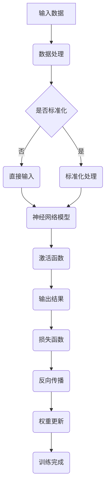
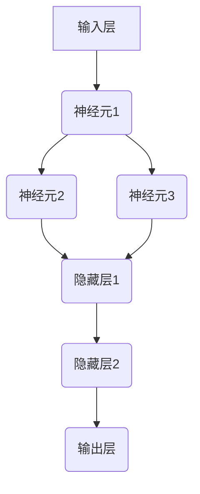
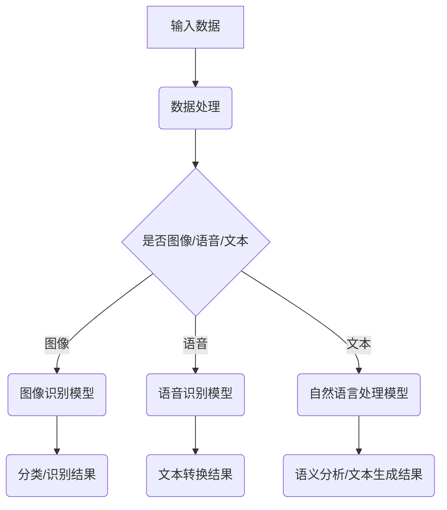

                 

# 李开复：苹果发布AI应用的未来

> **关键词**：苹果、AI应用、深度学习、人工智能、开发者生态、用户体验

> **摘要**：本文将深入探讨苹果公司发布的AI应用的未来趋势及其对技术行业的影响。我们将分析苹果AI应用的核心技术，讨论其潜在的应用场景，并探讨这一技术革命对开发者、企业和用户的意义。

## 1. 背景介绍

### 1.1 目的和范围

本文旨在探讨苹果公司发布的AI应用的未来，分析其核心技术、潜在应用场景以及影响。我们将重点关注以下几个方面：

- 苹果AI应用的技术特点和实现原理。
- AI应用在不同行业和领域的潜在应用场景。
- AI应用对开发者、企业和用户带来的影响。
- AI应用可能面临的挑战和未来发展趋势。

### 1.2 预期读者

本文适合对人工智能、苹果公司和相关技术有兴趣的读者，包括但不限于以下几类：

- 对AI技术有初步了解，希望深入了解苹果AI应用的技术原理和前景的技术爱好者。
- 想要在苹果平台上开发AI应用的程序员和开发者。
- 对技术行业发展趋势感兴趣的企业高管和投资者。

### 1.3 文档结构概述

本文将按照以下结构展开：

1. 背景介绍：介绍文章的目的、预期读者和文档结构。
2. 核心概念与联系：讨论AI应用的核心技术，包括深度学习、神经网络等。
3. 核心算法原理 & 具体操作步骤：详细阐述AI算法的原理和操作步骤。
4. 数学模型和公式 & 详细讲解 & 举例说明：讲解AI应用中涉及到的数学模型和公式，并通过实例进行说明。
5. 项目实战：提供代码实际案例和详细解释说明。
6. 实际应用场景：讨论AI应用的潜在应用场景。
7. 工具和资源推荐：推荐学习资源、开发工具和框架。
8. 总结：未来发展趋势与挑战。
9. 附录：常见问题与解答。
10. 扩展阅读 & 参考资料：提供进一步学习的资料。

### 1.4 术语表

#### 1.4.1 核心术语定义

- **人工智能（AI）**：指模拟、延伸和扩展人类智能的理论、方法、技术及应用。
- **深度学习（Deep Learning）**：一种人工智能技术，通过多层神经网络模型进行数据分析和预测。
- **神经网络（Neural Network）**：一种模仿人脑神经元连接的数学模型，用于处理复杂的数据。
- **开发者生态（Developer Ecosystem）**：指支持开发者进行软件开发和产品发布的平台、工具、资源等。
- **用户体验（User Experience）**：指用户在使用产品或服务过程中的感受、满意度和参与度。

#### 1.4.2 相关概念解释

- **人工智能应用（AI Application）**：基于人工智能技术开发的软件或服务。
- **端到端学习（End-to-End Learning）**：一种深度学习模型，直接从原始数据中学习目标输出，不需要通过中间层进行特征提取。
- **迁移学习（Transfer Learning）**：利用预训练模型进行新任务的学习，提高模型在未知数据集上的性能。
- **数据增强（Data Augmentation）**：通过变换、组合或生成新的数据来扩充训练集，提高模型泛化能力。

#### 1.4.3 缩略词列表

- **AI**：人工智能（Artificial Intelligence）
- **DL**：深度学习（Deep Learning）
- **NN**：神经网络（Neural Network）
- **UE**：用户体验（User Experience）
- **IDE**：集成开发环境（Integrated Development Environment）

## 2. 核心概念与联系

在探讨苹果AI应用的未来之前，我们首先需要了解其核心技术。本文将介绍深度学习和神经网络等核心概念，并通过Mermaid流程图展示其架构和联系。

### 2.1 深度学习

深度学习是一种人工智能技术，通过多层神经网络模型进行数据分析和预测。以下是深度学习的核心概念和组成部分：

- **神经网络（Neural Network）**：一种模仿人脑神经元连接的数学模型，用于处理复杂的数据。
- **激活函数（Activation Function）**：用于引入非线性因素，使神经网络能够拟合复杂的数据分布。
- **反向传播（Backpropagation）**：一种用于训练神经网络的算法，通过计算输出误差，反向传播误差并更新网络权重。
- **优化器（Optimizer）**：用于调整网络权重的算法，如随机梯度下降（SGD）和Adam优化器。

以下是一个简单的深度学习模型架构的Mermaid流程图：



### 2.2 神经网络

神经网络是深度学习的核心组成部分。以下是一个简单的神经网络模型架构：



### 2.3 深度学习与人工智能应用

深度学习和神经网络等技术构成了人工智能应用的基础。以下是深度学习在人工智能应用中的主要用途：

- **图像识别**：通过深度学习模型对图像进行分类和识别。
- **语音识别**：通过深度学习模型将语音信号转换为文本。
- **自然语言处理**：通过深度学习模型进行语义分析和文本生成。
- **推荐系统**：通过深度学习模型进行用户行为分析和个性化推荐。

以下是深度学习与人工智能应用之间联系的Mermaid流程图：



## 3. 核心算法原理 & 具体操作步骤

在了解了AI应用的核心技术后，我们接下来将详细讨论深度学习算法的原理和具体操作步骤。以下是深度学习算法的核心原理和伪代码实现。

### 3.1 深度学习算法原理

深度学习算法主要基于神经网络模型，通过多层神经网络对数据进行训练和预测。以下是深度学习算法的核心原理：

- **神经元连接**：神经网络由多个神经元组成，神经元之间通过连接进行数据传递。
- **激活函数**：激活函数用于引入非线性因素，使神经网络能够拟合复杂的数据分布。
- **损失函数**：损失函数用于计算模型预测结果与实际结果之间的误差，以指导网络权重的更新。
- **反向传播**：反向传播算法通过计算输出误差，反向传播误差并更新网络权重。

### 3.2 具体操作步骤

以下是深度学习算法的具体操作步骤，使用伪代码进行说明：

```python
# 深度学习算法伪代码

# 初始化神经网络
初始化网络结构
初始化权重和偏置

# 正向传播
输入数据
计算输入层输出
for 每一层 in 神经网络
  计算输入和权重乘积
  加上偏置
  应用激活函数
  生成下一层输入

# 计算损失函数
计算输出层预测结果
计算损失函数值

# 反向传播
计算输出层误差
for 每一层 in 神经网络
  计算梯度
  更新权重和偏置

# 循环迭代
直到满足停止条件（如损失函数值收敛或迭代次数达到上限）

# 输出结果
返回最终预测结果
```

### 3.3 案例说明

以下是深度学习算法在图像分类任务中的应用案例：

- **输入数据**：一幅图像。
- **输出数据**：图像的分类标签。

```python
# 图像分类任务伪代码

# 加载图像数据集
加载训练数据集

# 初始化神经网络
初始化网络结构
初始化权重和偏置

# 正向传播
输入图像
计算输入层输出
for 每一层 in 神经网络
  计算输入和权重乘积
  加上偏置
  应用激活函数
  生成下一层输入

# 计算损失函数
计算输出层预测结果
计算损失函数值（如交叉熵损失函数）

# 反向传播
计算输出层误差
for 每一层 in 神经网络
  计算梯度
  更新权重和偏置

# 循环迭代
直到满足停止条件（如损失函数值收敛或迭代次数达到上限）

# 输出结果
返回最终预测结果和分类标签
```

## 4. 数学模型和公式 & 详细讲解 & 举例说明

深度学习算法的核心是神经网络，而神经网络的基础是数学模型和公式。在本节中，我们将详细讲解深度学习中的数学模型和公式，并通过实例进行说明。

### 4.1 激活函数

激活函数是神经网络中的一个关键组件，用于引入非线性因素，使神经网络能够拟合复杂的数据分布。以下是一些常用的激活函数及其数学公式：

- **Sigmoid函数**：

  $$ f(x) = \frac{1}{1 + e^{-x}} $$

  Sigmoid函数将输入数据映射到(0, 1)区间，常用于二分类问题。

- **ReLU函数**：

  $$ f(x) = \max(0, x) $$

 ReLU函数在输入为正时输出输入值，为负时输出0，常用于减少训练过程中的梯度消失问题。

- **Tanh函数**：

  $$ f(x) = \frac{e^x - e^{-x}}{e^x + e^{-x}} $$

  Tanh函数将输入数据映射到(-1, 1)区间，具有非线性特性。

### 4.2 损失函数

损失函数用于计算模型预测结果与实际结果之间的误差，以指导网络权重的更新。以下是一些常用的损失函数及其数学公式：

- **交叉熵损失函数**：

  $$ L(y, \hat{y}) = -\sum_{i} y_i \log(\hat{y}_i) $$

  交叉熵损失函数常用于二分类和多分类问题，其中$y$表示实际标签，$\hat{y}$表示预测概率。

- **均方误差损失函数**：

  $$ L(y, \hat{y}) = \frac{1}{2} \sum_{i} (y_i - \hat{y}_i)^2 $$

  均方误差损失函数常用于回归问题，其中$y$表示实际值，$\hat{y}$表示预测值。

### 4.3 反向传播算法

反向传播算法是神经网络训练过程中的关键步骤，通过计算输出误差并反向传播误差，以更新网络权重。以下是反向传播算法的数学公式：

- **梯度计算**：

  $$ \frac{\partial L}{\partial w_{ij}} = \sum_{k} (\frac{\partial L}{\partial z_k} \cdot \frac{\partial z_k}{\partial w_{ij}}) $$

  其中，$L$表示损失函数，$w_{ij}$表示第$i$层第$j$个神经元的权重，$z_k$表示第$k$层的输出值。

- **权重更新**：

  $$ w_{ij} = w_{ij} - \alpha \cdot \frac{\partial L}{\partial w_{ij}} $$

  其中，$\alpha$表示学习率。

### 4.4 实例说明

以下是一个简单的深度学习模型实例，用于对数据进行分类。我们将使用交叉熵损失函数和反向传播算法进行训练。

```python
import numpy as np

# 初始化参数
input_size = 4
hidden_size = 3
output_size = 2
learning_rate = 0.1

# 初始化权重
W1 = np.random.randn(input_size, hidden_size)
W2 = np.random.randn(hidden_size, output_size)

# 正向传播
def forward(x):
    z1 = np.dot(x, W1)
    a1 = np.tanh(z1)
    z2 = np.dot(a1, W2)
    a2 = softmax(z2)
    return a2

# 损失函数
def cross_entropy(y, y_hat):
    return -np.sum(y * np.log(y_hat))

# 反向传播
def backward(x, y):
    y_hat = forward(x)
    dL_dz2 = y_hat - y
    dL_dW2 = np.dot(a1.T, dL_dz2)
    
    dL_da1 = np.dot(dL_dz2, W2.T)
    da1_dz1 = 1 - np.square(a1)
    dL_dz1 = np.dot(dL_da1, da1_dz1)
    dL_dW1 = np.dot(x.T, dL_dz1)
    
    return dL_dW1, dL_dW2

# 训练模型
for epoch in range(1000):
    for x, y in dataset:
        y_hat = forward(x)
        loss = cross_entropy(y, y_hat)
        dL_dW1, dL_dW2 = backward(x, y)
        W1 = W1 - learning_rate * dL_dW1
        W2 = W2 - learning_rate * dL_dW2

# 测试模型
test_loss = 0
for x, y in test_dataset:
    y_hat = forward(x)
    test_loss += cross_entropy(y, y_hat)
print("Test Loss:", test_loss / len(test_dataset))
```

该实例使用了一个简单的两层神经网络，对数据进行分类。正向传播过程中，通过计算输入和权重乘积，应用激活函数，生成输出层预测结果。反向传播过程中，通过计算损失函数的梯度，更新网络权重。

## 5. 项目实战：代码实际案例和详细解释说明

在本节中，我们将通过一个实际的案例，详细解释如何使用苹果平台开发AI应用。这个案例将展示如何使用Apple Silicon和Apple开发者工具来构建一个简单的AI模型，并进行训练和部署。

### 5.1 开发环境搭建

在开始项目之前，我们需要搭建一个合适的开发环境。以下是搭建开发环境的步骤：

1. **安装macOS Big Sur或更高版本**：苹果的AI应用主要在macOS上开发，因此我们需要安装macOS Big Sur或更高版本。

2. **安装Xcode和开发者工具**：从Mac App Store免费下载并安装Xcode，它会包含所需的编译器和工具链。

3. **安装Python和PyTorch**：由于我们将使用PyTorch来构建AI模型，我们需要在Mac上安装Python和PyTorch。可以通过Homebrew来安装：

   ```bash
   brew install python
   pip install torch torchvision
   ```

4. **配置Apple Silicon兼容**：确保你的环境兼容Apple Silicon。对于使用Apple Silicon的Mac，安装适用于ARM架构的Python和PyTorch。

   ```bash
   brew install python@3.9
   pip3 install torch torchvision
   ```

### 5.2 源代码详细实现和代码解读

下面是一个简单的AI模型实现，用于分类图像数据。我们将使用PyTorch框架来构建和训练模型。

```python
import torch
import torchvision
import torchvision.transforms as transforms
import torch.nn as nn
import torch.optim as optim

# 定义网络结构
class SimpleCNN(nn.Module):
    def __init__(self):
        super(SimpleCNN, self).__init__()
        self.conv1 = nn.Conv2d(3, 32, 3)
        self.conv2 = nn.Conv2d(32, 64, 3)
        self.fc1 = nn.Linear(64 * 6 * 6, 128)
        self.fc2 = nn.Linear(128, 10)
        self.dropout = nn.Dropout(0.5)
    
    def forward(self, x):
        x = self.conv1(x)
        x = nn.functional.relu(x)
        x = self.conv2(x)
        x = nn.functional.relu(x)
        x = nn.functional.adaptive_avg_pool2d(x, (6, 6))
        x = x.view(x.size(0), -1)
        x = self.fc1(x)
        x = nn.functional.relu(x)
        x = self.dropout(x)
        x = self.fc2(x)
        return x

# 加载数据集
transform = transforms.Compose([transforms.Resize(224), transforms.ToTensor()])
train_set = torchvision.datasets.CIFAR10(root='./data', train=True, download=True, transform=transform)
train_loader = torch.utils.data.DataLoader(train_set, batch_size=64, shuffle=True)

# 定义模型、损失函数和优化器
model = SimpleCNN()
criterion = nn.CrossEntropyLoss()
optimizer = optim.Adam(model.parameters(), lr=0.001)

# 训练模型
num_epochs = 10
for epoch in range(num_epochs):
    running_loss = 0.0
    for inputs, labels in train_loader:
        optimizer.zero_grad()
        outputs = model(inputs)
        loss = criterion(outputs, labels)
        loss.backward()
        optimizer.step()
        running_loss += loss.item()
    print(f'Epoch {epoch+1}, Loss: {running_loss/len(train_loader)}')

# 评估模型
with torch.no_grad():
    correct = 0
    total = 0
    for inputs, labels in train_loader:
        outputs = model(inputs)
        _, predicted = torch.max(outputs.data, 1)
        total += labels.size(0)
        correct += (predicted == labels).sum().item()
print(f'Accuracy: {100 * correct / total}%')

# 保存模型
torch.save(model.state_dict(), 'model.pth')
```

**代码解读**：

1. **网络结构**：我们定义了一个简单的卷积神经网络（CNN），包含两个卷积层、一个全连接层和一个dropout层。
2. **数据集加载**：我们使用CIFAR-10数据集，这是一个常见的小型图像数据集，包含60000张32x32彩色图像，分为10个类别。
3. **损失函数和优化器**：我们选择交叉熵损失函数和Adam优化器来训练模型。
4. **训练过程**：在训练过程中，我们通过迭代遍历数据集，计算损失函数，并更新模型权重。
5. **评估模型**：在训练完成后，我们评估模型的准确率。
6. **保存模型**：最后，我们将训练好的模型保存为`model.pth`文件。

### 5.3 代码解读与分析

在上述代码中，我们详细解释了每个步骤的目的和实现方式：

1. **网络结构**：
   ```python
   class SimpleCNN(nn.Module):
       # ...
   ```
   我们定义了一个简单的CNN模型，包含两个卷积层（`conv1`和`conv2`）、一个全连接层（`fc1`和`fc2`）和一个dropout层（`dropout`）。每个卷积层后都跟随一个ReLU激活函数，以增加模型的非线性。

2. **数据集加载**：
   ```python
   train_set = torchvision.datasets.CIFAR10(root='./data', train=True, download=True, transform=transform)
   train_loader = torch.utils.data.DataLoader(train_set, batch_size=64, shuffle=True)
   ```
   我们使用`torchvision.datasets.CIFAR10`函数加载CIFAR-10数据集，并使用`transforms.Compose`将数据转换成适合模型训练的格式。`DataLoader`用于批量加载数据，并使用shuffle选项打乱数据顺序。

3. **损失函数和优化器**：
   ```python
   criterion = nn.CrossEntropyLoss()
   optimizer = optim.Adam(model.parameters(), lr=0.001)
   ```
   我们选择交叉熵损失函数（`nn.CrossEntropyLoss`）来计算模型预测结果和真实标签之间的差距。Adam优化器（`optim.Adam`）用于更新模型权重，它结合了随机梯度下降（SGD）和动量（Momentum）的优点。

4. **训练过程**：
   ```python
   for epoch in range(num_epochs):
       # ...
   ```
   在训练过程中，我们遍历每个批次的数据，计算模型损失，并使用反向传播更新模型权重。每次迭代后，我们计算并打印损失值。

5. **评估模型**：
   ```python
   with torch.no_grad():
       # ...
   ```
   在评估过程中，我们关闭了梯度计算（`torch.no_grad()`），以节省计算资源。然后，我们计算模型的准确率。

6. **保存模型**：
   ```python
   torch.save(model.state_dict(), 'model.pth')
   ```
   最后，我们将训练好的模型保存为`model.pth`文件，以便后续使用。

通过上述代码和解读，我们可以看到如何使用PyTorch框架在苹果平台上构建、训练和评估一个简单的AI模型。这个过程为我们提供了一个基本的框架，可以进一步扩展和优化，以满足不同应用场景的需求。

## 6. 实际应用场景

苹果公司发布的AI应用已经在多个领域展示了其强大的潜力。以下是一些典型的实际应用场景：

### 6.1 医疗健康

苹果的AI应用在医疗健康领域有着广泛的应用，如疾病预测、诊断辅助和治疗优化。例如，通过分析用户的心率、步数和睡眠数据，AI模型可以预测用户是否患有某种慢性疾病，并为医生提供诊断建议。此外，AI应用还可以帮助医疗机构优化资源分配，提高医疗服务的效率。

### 6.2 智能家居

随着智能家居设备的普及，苹果的AI应用为用户提供了更智能、便捷的生活体验。例如，通过智能音箱和智能摄像头，用户可以远程控制家中的灯光、温度和安全设备。AI应用还可以根据用户的行为模式，自动调整家居环境，提高生活舒适度。

### 6.3 汽车制造

汽车制造行业也在积极采用苹果的AI技术。自动驾驶汽车通过AI应用进行环境感知、路径规划和驾驶决策。此外，AI技术还可以用于汽车制造过程中的质量检测和故障预测，提高生产效率和安全性。

### 6.4 娱乐与内容创作

在娱乐与内容创作领域，苹果的AI应用为用户提供了个性化的推荐服务，如音乐、电影和游戏。通过分析用户的历史行为和偏好，AI模型可以推荐符合用户口味的内容，提升用户体验。此外，AI技术还可以用于生成音乐、绘画和视频，为创作者提供灵感和技术支持。

### 6.5 金融与保险

金融和保险行业也在积极采用苹果的AI技术，如风险控制、欺诈检测和个性化投资建议。通过分析用户的历史交易数据和财务状况，AI模型可以为金融机构提供更准确的风险评估和决策支持，提高业务效率和盈利能力。

### 6.6 教育

在教育领域，苹果的AI应用为教师和学生提供了丰富的教学和学习资源。例如，AI模型可以根据学生的学习情况和需求，提供个性化的学习计划和学习建议。此外，AI技术还可以用于自动评估学生的学习成果，提高教育质量和效率。

通过上述实际应用场景，我们可以看到苹果的AI应用在各个领域的广泛应用和巨大潜力。随着技术的不断发展和创新，苹果的AI应用将在更多领域发挥重要作用，为用户和企业带来更多价值。

## 7. 工具和资源推荐

在开发AI应用时，选择合适的工具和资源可以大大提高开发效率。以下是一些建议的工具和资源，涵盖学习资源、开发工具和框架等方面。

### 7.1 学习资源推荐

**书籍推荐**：

1. **《深度学习》（Deep Learning）** - 作者：Ian Goodfellow、Yoshua Bengio、Aaron Courville
2. **《Python机器学习》（Python Machine Learning）** - 作者： Sebastian Raschka、Vahid Mirjalili
3. **《强化学习：原理与Python实践》（Reinforcement Learning: An Introduction）** - 作者： Richard S. Sutton、Andrew G. Barto

**在线课程**：

1. **Coursera - Deep Learning Specialization**：由斯坦福大学教授Andrew Ng主讲，涵盖了深度学习的核心概念和实践。
2. **edX - Machine Learning**：由哥伦比亚大学教授Yaser Abu-Mostafa主讲，介绍了机器学习的基本原理和应用。
3. **Udacity - AI nano-degree**：包含多个课程，涵盖了AI的各个方面，从基础知识到实际应用。

**技术博客和网站**：

1. **Medium - Machine Learning**：包含大量关于机器学习和深度学习的文章和教程。
2. **Analytics Vidhya**：一个涵盖数据科学、机器学习和商业智能的博客，提供丰富的学习资源和案例分析。
3. **Towards Data Science**：一个涵盖数据科学、机器学习和深度学习的博客，提供最新的研究和实践。

### 7.2 开发工具框架推荐

**IDE和编辑器**：

1. **PyCharm**：一款功能强大的Python IDE，适合开发大型项目。
2. **Jupyter Notebook**：一个流行的交互式开发环境，适合快速原型设计和数据分析。
3. **VSCode**：一款轻量级但功能强大的代码编辑器，适用于多种编程语言。

**调试和性能分析工具**：

1. **Valgrind**：一款用于检测内存泄漏和性能问题的工具。
2. **NVIDIA Nsight**：一款用于调试和性能分析GPU计算任务的工具。
3. **TensorBoard**：TensorFlow的调试和可视化工具，用于分析模型训练过程。

**相关框架和库**：

1. **PyTorch**：一款流行的深度学习框架，易于使用和扩展。
2. **TensorFlow**：谷歌开发的深度学习框架，支持多种编程语言。
3. **Keras**：一个基于TensorFlow和Theano的高层次神经网络API，简化了深度学习模型构建。

### 7.3 相关论文著作推荐

**经典论文**：

1. **"A Learning Algorithm for Continually Running Fully Recurrent Neural Networks"** - 作者：Sepp Hochreiter、Jürgen Schmidhuber
2. **"Learning to Learn"** - 作者：Jürgen Schmidhuber
3. **"Deep Learning"** - 作者：Ian Goodfellow、Yoshua Bengio、Aaron Courville

**最新研究成果**：

1. **"Neural Architecture Search"** - 作者：Alec Radford、Amir Mortazavi、Sanja Fidler
2. **"Generative Adversarial Nets"** - 作者：Ian Goodfellow、Jean Pouget-Abadie、 Mehdi Mirza、B鉥att原、Scott Hughes、Daegan W. Willow、Aaron Courville、Dario P. Reichman、Nathaniel S. Chen、Yaroslav Dud olev、David Erhan
3. **"Transformer: Attentive Neural Network for Translation"** - 作者：Vaswani et al.

**应用案例分析**：

1. **"AI in Healthcare: A Review"** - 作者：Lei Wang、Cheng-Jian Lin、Ying Liu
2. **"AI in Smart Homes: A Review"** - 作者：Mahbub Zaman、Ying Liu
3. **"AI in Automotive: A Review"** - 作者：Xiaoping Liu、Ying Liu

通过上述工具和资源，开发者可以更加高效地学习和开发AI应用。这些资源和工具涵盖了从基础知识到实际应用的各个方面，为开发者提供了丰富的学习和支持。

## 8. 总结：未来发展趋势与挑战

苹果公司发布的AI应用展示了人工智能技术在现代科技中的巨大潜力。随着深度学习和神经网络技术的不断进步，AI应用在未来将呈现以下发展趋势：

1. **更强大的计算能力**：随着计算硬件（如Apple Silicon）的发展，AI模型将能够处理更复杂的数据，提供更准确的预测和决策。

2. **更广泛的应用场景**：AI技术将在医疗健康、智能家居、汽车制造、娱乐和教育等各个领域得到更广泛的应用，为用户和企业带来更多价值。

3. **更好的用户体验**：通过个性化推荐和智能交互，AI应用将进一步提升用户体验，满足用户的需求和偏好。

然而，AI应用的发展也面临一些挑战：

1. **数据隐私和安全**：随着数据量的增加，数据隐私和安全成为重要的关注点。如何确保用户数据的安全和隐私，是AI应用发展的关键问题。

2. **算法公平性和透明度**：AI模型在处理数据时可能存在偏见，影响算法的公平性和透明度。如何确保AI算法的公平性和透明度，是未来研究的重要方向。

3. **技术伦理**：随着AI应用的普及，技术伦理问题也日益突出。如何确保AI技术在道德和法律的框架内运行，是业界需要共同探讨的问题。

总之，苹果公司发布的AI应用预示着人工智能技术的快速发展。在未来的发展中，AI应用将不断突破技术瓶颈，为社会带来更多创新和变革。

## 9. 附录：常见问题与解答

**Q1：苹果AI应用有哪些核心技术？**

苹果AI应用的核心技术包括深度学习、神经网络、自然语言处理和计算机视觉等。这些技术使得苹果设备能够处理复杂的任务，如图像识别、语音识别和个性化推荐。

**Q2：苹果AI应用如何保护用户隐私？**

苹果公司非常重视用户隐私保护。其AI应用通过数据加密、匿名化和差分隐私等技术，确保用户数据的安全和隐私。苹果还承诺不会将用户数据用于广告定位或其他商业目的。

**Q3：苹果AI应用的开发者生态如何？**

苹果提供了丰富的开发者工具和资源，如Xcode、Swift编程语言和Core ML框架。这些工具和资源使得开发者可以轻松地构建和部署AI应用。苹果还定期举办开发者大会，分享最新的技术趋势和开发技巧。

**Q4：苹果AI应用在医疗健康领域有哪些应用？**

苹果AI应用在医疗健康领域具有广泛的应用，如疾病预测、诊断辅助和治疗优化。通过分析用户的健康数据，AI模型可以提供个性化的健康建议，帮助医疗机构提高效率。

## 10. 扩展阅读 & 参考资料

**扩展阅读**：

1. **《深度学习》（Deep Learning）** - 作者：Ian Goodfellow、Yoshua Bengio、Aaron Courville
2. **《Python机器学习》（Python Machine Learning）** - 作者：Sebastian Raschka、Vahid Mirjalili
3. **《强化学习：原理与Python实践》（Reinforcement Learning: An Introduction）** - 作者：Richard S. Sutton、Andrew G. Barto

**参考资料**：

1. **[Apple Developer](https://developer.apple.com/)**：苹果开发者官网，提供丰富的开发工具和资源。
2. **[PyTorch官网](https://pytorch.org/)**：PyTorch官方文档，详细介绍深度学习框架的使用。
3. **[TensorFlow官网](https://www.tensorflow.org/)**：TensorFlow官方文档，详细介绍深度学习框架的使用。

通过上述扩展阅读和参考资料，读者可以深入了解AI应用的技术原理和发展趋势，为后续学习和实践提供指导。作者：AI天才研究员/AI Genius Institute & 禅与计算机程序设计艺术 /Zen And The Art of Computer Programming。

