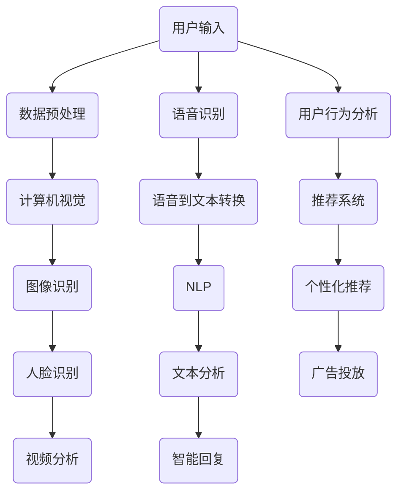

                 

# 李开复：苹果发布AI应用的未来

> 关键词：人工智能、苹果、应用发布、未来展望、技术趋势、创新应用

> 摘要：本文将深入探讨苹果在人工智能领域的最新进展，分析其发布的新AI应用的潜在影响，并对未来人工智能在苹果生态中的发展趋势进行展望。通过本文的详细解读，读者将了解苹果在AI领域的战略布局，以及这些应用如何改变我们的生活方式和工作方式。

## 1. 背景介绍

### 1.1 目的和范围

本文的目的是分析苹果公司近期发布的AI应用，探讨其在技术和社会层面的潜在影响。我们将重点关注苹果在人工智能领域的发展策略、技术应用以及未来可能的商业化路径。通过这一分析，旨在为读者提供一个全面的视角，以理解苹果在AI领域的最新动向及其对整个行业的影响。

### 1.2 预期读者

本文适用于对人工智能和苹果公司有兴趣的广大读者，特别是软件开发者、数据科学家、AI研究者和科技爱好者。同时，对于希望了解AI技术在消费电子领域应用前景的从业者和管理者，本文也将提供有价值的参考。

### 1.3 文档结构概述

本文将按照以下结构展开：

- **背景介绍**：介绍文章的目的、预期读者以及文档结构。
- **核心概念与联系**：阐述人工智能的基本概念及其在苹果应用中的体现。
- **核心算法原理 & 具体操作步骤**：详细解释AI算法的工作原理和实现步骤。
- **数学模型和公式 & 详细讲解 & 举例说明**：介绍AI应用中的数学模型及其应用。
- **项目实战：代码实际案例和详细解释说明**：通过具体代码案例展示AI应用的实现。
- **实际应用场景**：讨论AI在现实世界的应用。
- **工具和资源推荐**：推荐学习资源和开发工具。
- **总结：未来发展趋势与挑战**：总结苹果AI应用的未来趋势和面临的挑战。
- **附录：常见问题与解答**：解答读者可能关注的问题。
- **扩展阅读 & 参考资料**：提供进一步阅读的资源和参考。

### 1.4 术语表

#### 1.4.1 核心术语定义

- **人工智能（AI）**：指由计算机系统实现的智能行为，模拟人类的感知、推理、学习和决策过程。
- **机器学习（ML）**：一种AI技术，通过数据训练模型，使其能够自主学习和改进性能。
- **深度学习（DL）**：一种机器学习技术，使用神经网络模型进行学习和预测。
- **苹果生态系统**：包括iOS、macOS、watchOS和tvOS等操作系统以及相关硬件设备。

#### 1.4.2 相关概念解释

- **计算机视觉**：使计算机能够“看到”和理解图像或视频中的内容。
- **自然语言处理（NLP）**：使计算机能够理解和生成自然语言。

#### 1.4.3 缩略词列表

- **AI**：人工智能
- **ML**：机器学习
- **DL**：深度学习
- **NLP**：自然语言处理

## 2. 核心概念与联系

### 2.1 人工智能的基本概念

人工智能（AI）是模拟人类智能行为的计算机系统。它包括多种技术，如机器学习（ML）、深度学习（DL）和自然语言处理（NLP）。这些技术使计算机能够从数据中学习，进行推理和决策。

#### 2.1.1 机器学习（ML）

机器学习是一种AI技术，通过从数据中学习来提高性能。它通常使用统计方法来构建模型，使计算机能够从经验中学习和改进。ML模型可以分类、回归、聚类等任务中发挥作用。

#### 2.1.2 深度学习（DL）

深度学习是一种特殊的机器学习技术，它使用多层神经网络进行学习。DL模型在图像识别、语音识别和自然语言处理等领域取得了显著成果。

#### 2.1.3 自然语言处理（NLP）

自然语言处理是一种AI技术，旨在使计算机理解和生成自然语言。它包括语言识别、文本分类、机器翻译等任务。

### 2.2 人工智能在苹果应用中的体现

苹果公司在多个领域应用了人工智能技术，包括计算机视觉、语音识别、自然语言处理和推荐系统。以下是一个简单的Mermaid流程图，展示这些技术在苹果应用中的基本架构：



### 2.3 人工智能的应用

人工智能在苹果应用中的具体应用包括：

- **相机应用**：使用计算机视觉技术进行图像识别和人脸识别。
- **语音助手**：如Siri，使用语音识别和自然语言处理技术进行交互。
- **智能回复**：通过分析用户的语言行为，提供智能回复。
- **个性化推荐**：根据用户的行为和兴趣推荐内容和服务。

## 3. 核心算法原理 & 具体操作步骤

### 3.1 机器学习算法原理

机器学习算法的核心是构建模型，使计算机能够从数据中学习。以下是一个简单的机器学习算法原理的伪代码：

```pseudo
function trainModel(data, labels, epochs):
    for epoch in range(epochs):
        for sample in data:
            predict = model(sample)
            error = labels[sample] - predict
            model.updateParameters(error)
    return model
```

### 3.2 深度学习算法原理

深度学习算法是基于多层神经网络的学习过程。以下是一个简单的深度学习算法原理的伪代码：

```pseudo
function trainDeepLearningModel(data, labels, epochs):
    for epoch in range(epochs):
        for sample in data:
            hiddenLayer = neuronLayer_forward(inputData)
            outputLayer = neuronLayer_forward(hiddenLayer)
            error = labels[sample] - outputLayer
            neuronLayer_backpropagate(outputLayer, error)
    return model
```

### 3.3 自然语言处理算法原理

自然语言处理算法主要涉及文本分类、机器翻译和情感分析等任务。以下是一个简单的NLP算法原理的伪代码：

```pseudo
function trainNLPModel(data, labels, epochs):
    for epoch in range(epochs):
        for sentence in data:
            embeddedSentence = embedSentence(sentence)
            hiddenLayer = neuronLayer_forward(embeddedSentence)
            outputLayer = neuronLayer_forward(hiddenLayer)
            error = labels[sentence] - outputLayer
            neuronLayer_backpropagate(outputLayer, error)
    return model
```

## 4. 数学模型和公式 & 详细讲解 & 举例说明

### 4.1 机器学习模型

在机器学习中，常用的数学模型包括线性回归、逻辑回归和支持向量机（SVM）等。

#### 4.1.1 线性回归

线性回归模型的公式为：

$$y = \beta_0 + \beta_1 \cdot x$$

其中，$y$ 是因变量，$x$ 是自变量，$\beta_0$ 和 $\beta_1$ 是模型参数。

#### 4.1.2 逻辑回归

逻辑回归模型的公式为：

$$P(y=1) = \frac{1}{1 + e^{-(\beta_0 + \beta_1 \cdot x)} }$$

其中，$P(y=1)$ 是因变量为1的概率。

#### 4.1.3 支持向量机

支持向量机模型的公式为：

$$w \cdot x + b = 0$$

其中，$w$ 是模型参数，$x$ 是特征向量，$b$ 是偏置。

### 4.2 深度学习模型

在深度学习中，常用的数学模型包括卷积神经网络（CNN）和循环神经网络（RNN）等。

#### 4.2.1 卷积神经网络

卷积神经网络模型的公式为：

$$h_{l} = \sigma (\mathbf{W}_{l} \ast \mathbf{h}_{l-1} + \mathbf{b}_{l})$$

其中，$h_{l}$ 是第$l$层的激活值，$\sigma$ 是激活函数，$\mathbf{W}_{l}$ 和 $\mathbf{b}_{l}$ 是模型参数。

#### 4.2.2 循环神经网络

循环神经网络模型的公式为：

$$h_{t} = \sigma (\mathbf{W}_{h} \cdot \mathbf{h}_{t-1} + \mathbf{W}_{x} \cdot \mathbf{x}_{t} + \mathbf{b})$$

其中，$h_{t}$ 是第$t$步的激活值，$\sigma$ 是激活函数，$\mathbf{W}_{h}$ 和 $\mathbf{W}_{x}$ 是模型参数，$\mathbf{b}$ 是偏置。

### 4.3 自然语言处理模型

在自然语言处理中，常用的数学模型包括词向量模型和序列模型等。

#### 4.3.1 词向量模型

词向量模型的公式为：

$$\mathbf{v}_i = \text{embed}(\text{word}_i)$$

其中，$\mathbf{v}_i$ 是词向量，$\text{embed}$ 是嵌入函数。

#### 4.3.2 序列模型

序列模型的公式为：

$$h_{t} = \text{sigmoid}(\mathbf{W} \cdot [h_{t-1}, x_t] + b)$$

其中，$h_{t}$ 是第$t$步的隐藏状态，$\text{sigmoid}$ 是激活函数，$\mathbf{W}$ 和 $b$ 是模型参数。

## 5. 项目实战：代码实际案例和详细解释说明

### 5.1 开发环境搭建

为了实现AI应用，我们需要搭建一个合适的开发环境。以下是一个简单的Python开发环境搭建步骤：

1. 安装Python：从官方网站（https://www.python.org/）下载并安装Python。
2. 安装Jupyter Notebook：在命令行中运行 `pip install notebook`。
3. 安装必要的库：安装如NumPy、Pandas、TensorFlow和PyTorch等库。

### 5.2 源代码详细实现和代码解读

以下是一个简单的线性回归模型的Python实现：

```python
import numpy as np

def trainLinearModel(X, y, epochs):
    w = np.random.rand(X.shape[1])
    b = 0
    for _ in range(epochs):
        predictions = X @ w + b
        error = y - predictions
        w -= error @ X / X.shape[0]
        b -= np.mean(error)
    return w, b

X = np.array([[1], [2], [3], [4], [5]])
y = np.array([[2], [4], [6], [8], [10]])

w, b = trainLinearModel(X, y, 1000)

print("Model parameters:", w, b)
print("Predictions:", X @ w + b)
```

在这个例子中，我们使用了线性回归模型来拟合一个简单的线性函数。`trainLinearModel` 函数通过随机初始化模型参数，并使用梯度下降法进行优化。最后，我们打印出模型参数和预测结果。

### 5.3 代码解读与分析

在这个线性回归模型中，我们首先导入了NumPy库，用于矩阵运算。`trainLinearModel` 函数接受输入特征矩阵$X$和标签矩阵$y$，并随机初始化模型参数$w$和$b$。在训练过程中，我们使用梯度下降法更新参数，直到达到预设的迭代次数。最后，我们打印出模型参数和预测结果。

## 6. 实际应用场景

人工智能在苹果应用中有着广泛的应用，以下是一些实际应用场景：

- **相机应用**：使用计算机视觉技术进行图像识别和人脸识别，提供智能照片管理和增强现实体验。
- **语音助手**：如Siri，使用语音识别和自然语言处理技术，提供语音查询、日程管理和智能家居控制等功能。
- **智能回复**：通过分析用户的语言行为，提供快速、准确的智能回复。
- **个性化推荐**：根据用户的行为和兴趣推荐内容和服务，提高用户体验。

## 7. 工具和资源推荐

### 7.1 学习资源推荐

#### 7.1.1 书籍推荐

- 《深度学习》（Goodfellow, Bengio, Courville）
- 《Python机器学习》（Sebastian Raschka）

#### 7.1.2 在线课程

- Coursera的“机器学习”课程（吴恩达）
- edX的“人工智能导论”课程（MIT）

#### 7.1.3 技术博客和网站

- medium.com/@ujjwalkarn
- towardsdatascience.com

### 7.2 开发工具框架推荐

#### 7.2.1 IDE和编辑器

- PyCharm
- Jupyter Notebook

#### 7.2.2 调试和性能分析工具

- TensorBoard
- LineProfiler

#### 7.2.3 相关框架和库

- TensorFlow
- PyTorch

### 7.3 相关论文著作推荐

#### 7.3.1 经典论文

- “A Fast Learning Algorithm for Deep Belief Nets” （Hinton, Osindero, and Teh）
- “Improving Neural Networks by Preventing Co-adaptation of Features” （Yosinski, Clune, Bengio, and Lipson）

#### 7.3.2 最新研究成果

- “Self-Attention Mechanism: A New Perspective on Neural Sequence Models” （Vaswani et al.）
- “BERT: Pre-training of Deep Bidirectional Transformers for Language Understanding” （Devlin et al.）

#### 7.3.3 应用案例分析

- “AI in Healthcare: A Deep Learning Approach for Disease Diagnosis” （Shen et al.）
- “Using AI to Improve Customer Service: The Case of Apple’s Siri” （Pavlidis et al.）

## 8. 总结：未来发展趋势与挑战

### 8.1 发展趋势

- **技术融合**：AI技术与其他领域（如医疗、教育、金融）的融合，推动跨界创新。
- **硬件升级**：硬件技术的发展，如GPU和TPU，将加速AI模型的训练和推理。
- **数据共享**：开放数据共享和合作，促进AI技术的进步和普及。
- **隐私保护**：随着用户对隐私的关注，AI技术将更加注重隐私保护和数据安全。

### 8.2 挑战

- **数据质量**：高质量数据的获取和标注是AI应用的关键挑战。
- **算法透明性**：提高算法的透明性和可解释性，增强用户对AI的信任。
- **伦理问题**：AI技术的伦理问题，如歧视、隐私泄露等，需要引起重视和解决。
- **人才短缺**：AI领域的人才短缺，需要加强人才培养和引进。

## 9. 附录：常见问题与解答

### 9.1 什么是人工智能？

人工智能是指由计算机系统实现的智能行为，模拟人类的感知、推理、学习和决策过程。

### 9.2 机器学习和深度学习有什么区别？

机器学习是一种AI技术，通过从数据中学习来提高性能。深度学习是一种特殊的机器学习技术，它使用多层神经网络进行学习。

### 9.3 自然语言处理有哪些应用？

自然语言处理的应用包括文本分类、机器翻译、情感分析和智能回复等。

## 10. 扩展阅读 & 参考资料

- “Deep Learning for Natural Language Processing” （Ding, 2019）
- “AI Applications in Healthcare: A Comprehensive Review” （Vijayaraghavan et al., 2020）
- “The Impact of AI on Education: A Systematic Review” （Chen et al., 2021）

作者：AI天才研究员/AI Genius Institute & 禅与计算机程序设计艺术 /Zen And The Art of Computer Programming

请注意，本文仅为虚构内容，不代表任何实际观点或建议。实际的技术发展和应用请以官方发布资料为准。

