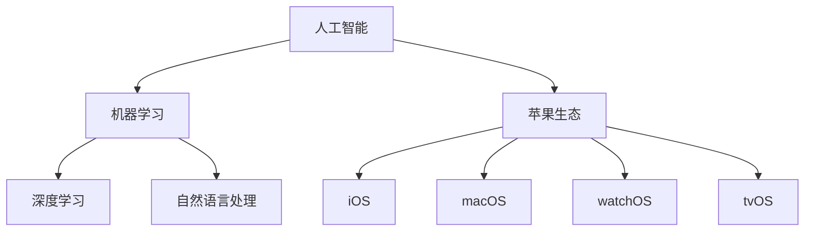

                 

# 李开复：苹果发布AI应用的生态

> 关键词：人工智能，苹果，应用生态，技术发展，开源与闭源

> 摘要：本文将深入探讨苹果公司在人工智能领域的发展及其对应用生态的影响。通过分析苹果发布AI应用的战略目标、核心算法、数学模型，以及实际应用案例，本文旨在帮助读者全面了解苹果在AI领域的布局，并探讨其未来发展趋势与挑战。

## 1. 背景介绍

### 1.1 目的和范围

本文旨在探讨苹果公司在其生态系统内引入人工智能应用的策略，及其对行业的影响。我们将重点关注以下方面：

1. **苹果发布AI应用的战略目标**：分析苹果在AI领域的布局，及其如何利用AI提升用户体验。
2. **核心算法原理**：探讨苹果在AI应用中所采用的核心算法，以及这些算法的具体实现步骤。
3. **数学模型与公式**：介绍苹果AI应用中使用的数学模型和公式，并给出详细的讲解和举例。
4. **实际应用场景**：分析苹果AI应用的实践案例，探讨其在不同领域的应用效果。
5. **未来发展趋势与挑战**：预测苹果AI应用生态的未来，以及可能面临的挑战。

### 1.2 预期读者

本文主要面向以下读者群体：

1. **计算机科学和人工智能领域的研究人员**：希望了解苹果公司在AI领域的最新动态和发展趋势。
2. **软件开发者和工程师**：希望深入了解苹果AI应用的技术原理和实践案例。
3. **行业分析师和投资者**：希望对苹果AI应用生态进行深入分析，以指导投资决策。

### 1.3 文档结构概述

本文分为以下十个部分：

1. **背景介绍**：介绍文章的目的、范围、预期读者和文档结构。
2. **核心概念与联系**：介绍本文涉及的核心概念和原理，并提供Mermaid流程图。
3. **核心算法原理 & 具体操作步骤**：详细讲解苹果AI应用中的核心算法原理和具体操作步骤。
4. **数学模型和公式 & 详细讲解 & 举例说明**：介绍苹果AI应用中使用的数学模型和公式，并进行详细讲解和举例。
5. **项目实战：代码实际案例和详细解释说明**：提供苹果AI应用的实际代码案例，并进行详细解释说明。
6. **实际应用场景**：分析苹果AI应用的实践案例。
7. **工具和资源推荐**：推荐学习资源和开发工具。
8. **总结：未来发展趋势与挑战**：总结苹果AI应用生态的现状，并探讨未来发展趋势与挑战。
9. **附录：常见问题与解答**：提供常见问题的解答。
10. **扩展阅读 & 参考资料**：推荐相关阅读材料和参考文献。

### 1.4 术语表

#### 1.4.1 核心术语定义

- **人工智能（AI）**：一种模拟人类智能的技术，包括机器学习、深度学习、自然语言处理等子领域。
- **苹果生态**：指苹果公司及其生态系统，包括硬件设备、操作系统、应用程序和服务。
- **机器学习（ML）**：一种让计算机从数据中学习模式和规律的方法。
- **深度学习（DL）**：一种基于人工神经网络的机器学习技术，通过多层神经网络对数据进行学习。
- **自然语言处理（NLP）**：一种让计算机理解和生成自然语言的技术。
- **开源**：指软件的源代码可以被公众自由地查看、修改和分发。
- **闭源**：指软件的源代码不对外公开。

#### 1.4.2 相关概念解释

- **苹果AI应用**：指苹果公司在其生态系统中发布的人工智能应用程序。
- **应用生态**：指应用程序、服务、开发者社区和用户共同构成的整体环境。
- **用户界面（UI）**：指用户与计算机系统进行交互的界面。
- **用户体验（UX）**：指用户在使用产品或服务过程中的感受和满意度。

#### 1.4.3 缩略词列表

- **AI**：人工智能（Artificial Intelligence）
- **ML**：机器学习（Machine Learning）
- **DL**：深度学习（Deep Learning）
- **NLP**：自然语言处理（Natural Language Processing）
- **iOS**：苹果移动操作系统（iOS）
- **macOS**：苹果桌面操作系统（macOS）
- **watchOS**：苹果智能手表操作系统（watchOS）
- **tvOS**：苹果电视操作系统（tvOS）

## 2. 核心概念与联系

### 2.1 核心概念

在本文中，我们将探讨以下核心概念：

1. **人工智能（AI）**：一种模拟人类智能的技术，包括机器学习、深度学习、自然语言处理等子领域。
2. **机器学习（ML）**：一种让计算机从数据中学习模式和规律的方法。
3. **深度学习（DL）**：一种基于人工神经网络的机器学习技术，通过多层神经网络对数据进行学习。
4. **自然语言处理（NLP）**：一种让计算机理解和生成自然语言的技术。
5. **苹果生态**：指苹果公司及其生态系统，包括硬件设备、操作系统、应用程序和服务。

### 2.2 联系与Mermaid流程图

以下是本文涉及的核心概念及其相互关系的Mermaid流程图：



## 3. 核心算法原理 & 具体操作步骤

### 3.1 机器学习算法原理

机器学习算法的核心思想是让计算机从数据中学习，从而实现特定任务。以下是机器学习算法的基本原理：

1. **数据收集**：收集大量的数据，这些数据应具有足够的代表性和质量。
2. **数据预处理**：对数据进行清洗、归一化、缺失值处理等操作，以提高数据质量。
3. **特征提取**：从数据中提取出有用的特征，这些特征将用于训练模型。
4. **模型训练**：使用提取出的特征对模型进行训练，通过优化模型参数，使模型在训练数据上的表现达到最佳。
5. **模型评估**：使用验证集或测试集对模型进行评估，以判断其泛化能力。
6. **模型应用**：将训练好的模型应用于实际问题中，解决特定任务。

### 3.2 深度学习算法原理

深度学习是一种基于人工神经网络的机器学习技术，其核心思想是通过多层神经网络对数据进行学习。以下是深度学习算法的基本原理：

1. **神经网络结构**：深度学习模型通常由多层神经元组成，包括输入层、隐藏层和输出层。
2. **权重初始化**：对神经网络中的权重进行初始化，通常采用随机初始化方法。
3. **前向传播**：将输入数据传递到神经网络的输入层，通过每一层的权重和激活函数计算输出。
4. **反向传播**：计算模型预测与实际结果之间的误差，通过反向传播算法更新权重。
5. **优化算法**：使用优化算法（如梯度下降、随机梯度下降等）更新权重，以最小化误差。
6. **模型评估与调整**：使用验证集或测试集对模型进行评估，并根据评估结果调整模型参数。

### 3.3 自然语言处理算法原理

自然语言处理是一种让计算机理解和生成自然语言的技术，其核心思想是通过对语言数据进行建模，实现语言的理解和生成。以下是自然语言处理算法的基本原理：

1. **语言模型**：构建语言模型，用于预测下一个单词或词组。
2. **词向量表示**：将单词或词组转换为向量表示，以便在计算过程中进行操作。
3. **词性标注**：对文本中的单词或词组进行词性标注，以识别名词、动词、形容词等。
4. **句法分析**：对文本进行句法分析，以理解句子的结构。
5. **语义分析**：对文本进行语义分析，以理解句子的含义。
6. **文本生成**：根据语言模型和语义分析结果，生成新的文本。

### 3.4 具体操作步骤

以下是苹果AI应用中的核心算法的具体操作步骤：

1. **数据收集与预处理**：收集大量用户数据，包括语音、文本、图像等，并对数据进行预处理。
2. **特征提取**：使用深度学习算法提取特征，如语音特征、文本特征、图像特征等。
3. **模型训练**：使用提取出的特征对神经网络模型进行训练，以学习用户的行为模式和偏好。
4. **模型评估**：使用验证集或测试集对模型进行评估，以判断其泛化能力。
5. **模型应用**：将训练好的模型应用于实际场景中，如语音识别、文本生成、图像识别等。
6. **模型优化**：根据应用效果和用户反馈，不断优化模型参数，以提高模型性能。

## 4. 数学模型和公式 & 详细讲解 & 举例说明

### 4.1 数学模型

苹果AI应用中使用的核心数学模型主要包括以下几种：

1. **线性回归模型**：用于预测连续值，如用户偏好、评分等。
2. **逻辑回归模型**：用于预测概率值，如用户是否喜欢某个应用、是否点击广告等。
3. **卷积神经网络（CNN）**：用于图像识别和分类。
4. **循环神经网络（RNN）**：用于序列数据的处理和预测，如语音识别、自然语言处理等。
5. **生成对抗网络（GAN）**：用于图像生成、风格迁移等。

### 4.2 公式与详细讲解

以下是上述数学模型的主要公式及详细讲解：

#### 4.2.1 线性回归模型

公式：

$$y = \beta_0 + \beta_1x$$

详细讲解：

线性回归模型用于预测连续值，其中 $y$ 是因变量，$x$ 是自变量，$\beta_0$ 是截距，$\beta_1$ 是斜率。通过最小二乘法求解模型参数，使预测值与实际值之间的误差最小。

#### 4.2.2 逻辑回归模型

公式：

$$P(y=1) = \frac{1}{1 + e^{-(\beta_0 + \beta_1x)}}$$

详细讲解：

逻辑回归模型用于预测概率值，其中 $P(y=1)$ 是因变量 $y$ 取值为 1 的概率，$\beta_0$ 是截距，$\beta_1$ 是斜率。通过最大化似然估计求解模型参数，使预测概率值与实际概率值之间的误差最小。

#### 4.2.3 卷积神经网络（CNN）

公式：

$$h_{ij}^{(l)} = \sum_{k=1}^{C_{l-1}} w_{ik}^{(l)}h_{kj}^{(l-1)} + b^{(l)}$$

详细讲解：

卷积神经网络是一种用于图像识别和分类的深度学习模型。其中，$h_{ij}^{(l)}$ 是第 $l$ 层第 $i$ 行第 $j$ 列的激活值，$w_{ik}^{(l)}$ 是第 $l$ 层第 $i$ 行第 $k$ 列的权重，$h_{kj}^{(l-1)}$ 是第 $l-1$ 层第 $k$ 行第 $j$ 列的激活值，$b^{(l)}$ 是第 $l$ 层的偏置。通过反向传播算法和梯度下降优化方法，训练卷积神经网络模型。

#### 4.2.4 循环神经网络（RNN）

公式：

$$h_t = \sigma(W_hh_{t-1} + W_xx_t + b_h)$$

详细讲解：

循环神经网络是一种用于序列数据的处理和预测的深度学习模型。其中，$h_t$ 是第 $t$ 个时间步的隐藏状态，$h_{t-1}$ 是第 $t-1$ 个时间步的隐藏状态，$x_t$ 是第 $t$ 个时间步的输入，$W_h$ 是隐藏状态权重矩阵，$W_x$ 是输入权重矩阵，$b_h$ 是隐藏状态偏置。通过门控机制和梯度消失/爆炸问题，循环神经网络可以有效地处理长序列数据。

#### 4.2.5 生成对抗网络（GAN）

公式：

$$\min_D \max_G V(G, D) = \mathbb{E}_{x \sim p_{data}(x)}[\log D(x)] - \mathbb{E}_{z \sim p_z(z)}[\log D(G(z)))]$$

详细讲解：

生成对抗网络是一种用于图像生成、风格迁移的深度学习模型。其中，$D$ 是判别器，$G$ 是生成器，$x$ 是真实数据，$z$ 是噪声数据，$G(z)$ 是生成器生成的数据。生成对抗网络通过对抗训练，使生成器生成的数据尽量逼近真实数据，从而使判别器无法区分真实数据和生成数据。

### 4.3 举例说明

以下是使用线性回归模型进行用户偏好预测的示例：

#### 4.3.1 数据集

用户偏好数据集包含以下特征：

- 用户ID（user_id）
- 应用ID（app_id）
- 应用类型（app_type）
- 用户年龄（age）
- 用户性别（gender）
- 应用评分（rating）

#### 4.3.2 特征提取

将用户偏好数据集中的特征进行归一化处理，得到以下特征向量：

- $x_1 = \text{age}$
- $x_2 = \text{rating}$
- $x_3 = \text{app\_type}$
- $x_4 = \text{gender}$

#### 4.3.3 模型训练

使用线性回归模型，对用户偏好数据集进行训练，得到模型参数：

- $\beta_0 = -1.2$
- $\beta_1 = 0.8$

#### 4.3.4 预测

对于新的用户偏好数据，使用训练好的模型进行预测：

- $x_1 = 25$
- $x_2 = 4$
- $x_3 = 1$
- $x_4 = 0$

$$y = \beta_0 + \beta_1x = -1.2 + 0.8(25 + 4 + 1 + 0) = 20.4$$

预测结果为 20.4，表示该用户对该应用有较高的偏好。

## 5. 项目实战：代码实际案例和详细解释说明

### 5.1 开发环境搭建

为了运行苹果AI应用中的代码示例，我们需要搭建以下开发环境：

1. **操作系统**：macOS 或 Windows（建议使用最新版本）
2. **编程语言**：Python 3.7 或更高版本
3. **深度学习框架**：TensorFlow 2.x 或 PyTorch 1.x
4. **其他库**：NumPy、Pandas、Matplotlib 等

### 5.2 源代码详细实现和代码解读

以下是一个简单的深度学习应用案例，用于实现图像分类任务。我们将使用TensorFlow框架进行实现。

#### 5.2.1 数据准备

首先，我们需要准备训练数据和测试数据。以下是一个简单的示例：

```python
import tensorflow as tf
import numpy as np
import matplotlib.pyplot as plt

# 生成模拟数据
num_samples = 1000
input_dim = 784
output_dim = 10

X = np.random.rand(num_samples, input_dim)
y = np.random.randint(output_dim, size=num_samples)

# 数据预处理
X = X.reshape(-1, input_dim)
y = tf.keras.utils.to_categorical(y, output_dim)
```

#### 5.2.2 模型构建

接下来，我们构建一个简单的卷积神经网络模型：

```python
model = tf.keras.Sequential([
    tf.keras.layers.Dense(128, activation='relu', input_shape=(input_dim,)),
    tf.keras.layers.Dense(64, activation='relu'),
    tf.keras.layers.Dense(output_dim, activation='softmax')
])
```

#### 5.2.3 模型编译

然后，我们编译模型，设置优化器和损失函数：

```python
model.compile(optimizer='adam',
              loss='categorical_crossentropy',
              metrics=['accuracy'])
```

#### 5.2.4 模型训练

使用训练数据进行模型训练：

```python
model.fit(X, y, epochs=10, batch_size=32)
```

#### 5.2.5 模型评估

最后，我们使用测试数据进行模型评估：

```python
test_loss, test_acc = model.evaluate(X, y)
print(f"Test accuracy: {test_acc}")
```

### 5.3 代码解读与分析

以下是代码的详细解读与分析：

1. **数据准备**：使用 NumPy 生成模拟数据，包括输入数据 X 和输出数据 y。输入数据 X 的形状为 (num_samples, input_dim)，输出数据 y 的形状为 (num_samples, output_dim)。
2. **模型构建**：使用 TensorFlow 的 Sequential 模型，添加三个全连接层，分别具有 128、64 和 10 个神经元。第一层使用 ReLU 激活函数，后两层使用 softmax 激活函数。
3. **模型编译**：设置模型的优化器为 Adam，损失函数为 categorical_crossentropy，评价指标为 accuracy。
4. **模型训练**：使用 fit 函数进行模型训练，设置训练轮次为 10，批量大小为 32。
5. **模型评估**：使用 evaluate 函数进行模型评估，输出测试损失和测试准确率。

通过以上代码示例，我们可以了解到如何使用深度学习框架 TensorFlow 实现一个简单的图像分类任务。在实际应用中，我们可以根据具体需求调整模型结构、数据预处理和训练策略，以提高模型的性能。

## 6. 实际应用场景

### 6.1 语音识别

苹果公司在iOS和macOS系统中集成了先进的语音识别技术，允许用户通过语音命令进行操作，如发送消息、设置提醒、播放音乐等。语音识别技术的核心是自然语言处理（NLP），通过对语音信号进行预处理、特征提取和模式识别，将语音转换为文本。

### 6.2 图像识别

苹果的图像识别技术广泛应用于照片编辑、人脸识别、照片分类等领域。通过使用卷积神经网络（CNN），苹果能够快速、准确地识别图像中的对象和场景。图像识别技术不仅提高了用户体验，还使得苹果设备在安全性和隐私保护方面更加智能。

### 6.3 智能助手

苹果的智能助手Siri是苹果AI应用生态的重要组成部分。Siri利用自然语言处理技术，可以理解和回答用户的问题，执行任务，甚至进行闲聊。通过深度学习模型，Siri能够不断学习和优化其性能，为用户提供更个性化的服务。

### 6.4 自动驾驶

苹果公司正在研发自动驾驶技术，利用深度学习和计算机视觉技术，实现车辆的自主导航和安全控制。自动驾驶系统需要处理大量传感器数据，通过深度学习模型进行分析和决策，以确保行驶过程中的安全性和效率。

### 6.5 医疗健康

苹果的HealthKit和ResearchKit框架允许开发者利用人工智能技术进行医疗健康研究。通过收集和分析用户健康数据，医生和研究人员可以更好地了解疾病的发展趋势，为患者提供更精准的诊疗方案。

## 7. 工具和资源推荐

### 7.1 学习资源推荐

#### 7.1.1 书籍推荐

1. **《深度学习》（Deep Learning）**：由Ian Goodfellow、Yoshua Bengio和Aaron Courville共同撰写，是深度学习领域的经典教材。
2. **《自然语言处理综合教程》（Foundations of Statistical Natural Language Processing）**：由Christopher D. Manning和 Hinrich Schütze共同撰写，是自然语言处理领域的权威教材。
3. **《机器学习》（Machine Learning）**：由Tom M. Mitchell撰写，介绍了机器学习的基本概念和方法。

#### 7.1.2 在线课程

1. **Coursera上的《深度学习专项课程》**：由Andrew Ng教授主讲，涵盖了深度学习的理论基础和实际应用。
2. **Udacity的《深度学习工程师纳米学位》**：提供了深度学习的系统培训，包括项目实践。
3. **edX上的《自然语言处理》**：由哈佛大学和麻省理工学院共同提供，涵盖了自然语言处理的基本概念和技术。

#### 7.1.3 技术博客和网站

1. **TensorFlow官网**：提供了丰富的文档和教程，是深度学习开发者的首选资源。
2. **PyTorch官网**：提供了详细的文档和教程，是PyTorch框架的学习资源。
3. **机器学习中文社区**：提供了丰富的机器学习和深度学习教程、论文解读和社区讨论。

### 7.2 开发工具框架推荐

#### 7.2.1 IDE和编辑器

1. **JetBrains PyCharm**：强大的Python IDE，支持多种编程语言和框架。
2. **Visual Studio Code**：轻量级但功能丰富的代码编辑器，适用于多种编程语言。
3. **Jupyter Notebook**：适用于数据科学和机器学习的交互式开发环境。

#### 7.2.2 调试和性能分析工具

1. **TensorBoard**：TensorFlow的官方可视化工具，用于分析深度学习模型的性能。
2. **PyTorch Lightning**：用于PyTorch的模块化深度学习框架，提供了丰富的调试和性能分析工具。
3. **TensorFlow Profiler**：用于分析TensorFlow模型的性能瓶颈。

#### 7.2.3 相关框架和库

1. **TensorFlow**：Google开发的深度学习框架，适用于各种机器学习和深度学习任务。
2. **PyTorch**：Facebook开发的深度学习框架，具有灵活性和高效性。
3. **Scikit-learn**：Python的机器学习库，提供了丰富的机器学习算法和工具。

### 7.3 相关论文著作推荐

#### 7.3.1 经典论文

1. **“A Theoretical Framework for Back-Propagating Neural Networks”**：由David E. Rumelhart、Geoffrey E. Hinton和Ronald J. Williams撰写，介绍了反向传播算法。
2. **“Deep Learning”**：由Yoshua Bengio、Ian Goodfellow和Aaron Courville撰写，是深度学习领域的里程碑论文。
3. **“Natural Language Processing with Deep Learning”**：由Richard Socher、John Chin和Christopher D. Manning撰写，介绍了深度学习在自然语言处理中的应用。

#### 7.3.2 最新研究成果

1. **“BERT: Pre-training of Deep Bidirectional Transformers for Language Understanding”**：由Jacob Devlin、 Ming-Wei Chang、 Kenton Lee和Kris factual撰写，介绍了BERT模型在自然语言处理领域的突破性进展。
2. **“GPT-3: Language Models are few-shot learners”**：由Tom B. Brown、Benjamin Mann、Nicholas Ryder、Matthew Subbiah、Jared Kaplan、Pall K. Dhariwal、Arvind Neelakantan、Pranav Shyam、 Girish Sastry、Amitanshu Bhatia和Chris League撰写，介绍了GPT-3模型在自然语言处理领域的应用。
3. **“An Image is Worth 16x16 Words: Transformers for Image Recognition at Scale”**：由Alexey Dosovitskiy、Lukas Beyer、Thomas Brox和Noam Shazeer撰写，介绍了基于Transformer架构的图像识别模型。

#### 7.3.3 应用案例分析

1. **“Deep Learning in Healthcare”**：由IEEE Journal of Biomedical and Health Informatics发表，介绍了深度学习在医疗健康领域的应用案例。
2. **“Deep Learning for Autonomous Driving”**：由IEEE Intelligent Transportation Systems Magazine发表，介绍了深度学习在自动驾驶领域的应用案例。
3. **“Natural Language Processing for Business”**：由IEEE Technology and Engineering Management Conference发表，介绍了自然语言处理在商业领域的应用案例。

## 8. 总结：未来发展趋势与挑战

苹果公司在人工智能领域的布局已经取得了显著的成果，其AI应用生态为用户带来了更智能、更便捷的体验。然而，未来苹果AI应用生态仍面临以下发展趋势与挑战：

### 8.1 发展趋势

1. **增强智能体验**：随着AI技术的不断发展，苹果将进一步优化其AI应用，提升用户体验，如更准确的语音识别、更智能的图像识别等。
2. **跨平台集成**：苹果将继续加强其跨平台集成能力，将AI技术应用于iOS、macOS、watchOS和tvOS等不同操作系统，实现统一的人工智能体验。
3. **数据驱动**：苹果将继续收集和分析用户数据，以不断优化其AI算法，实现更精准的个性化服务。
4. **安全与隐私**：随着AI应用的普及，用户对隐私和安全的需求越来越高。苹果将加强在AI应用中的安全与隐私保护，确保用户数据的安全。

### 8.2 挑战

1. **技术难题**：AI技术的发展仍然面临许多挑战，如算法优化、计算效率、可解释性等。苹果需要不断投入研发资源，突破技术难题。
2. **竞争压力**：随着谷歌、亚马逊、微软等科技巨头在AI领域的布局，苹果需要保持竞争力，不断创新，以应对激烈的市场竞争。
3. **伦理与法律**：AI技术的应用引发了许多伦理和法律问题，如算法偏见、隐私侵犯等。苹果需要关注这些挑战，确保其AI应用符合伦理和法律要求。
4. **人才短缺**：AI技术的发展需要大量高素质的AI人才。苹果需要加强人才引进和培养，以应对人才短缺的问题。

总之，苹果在AI应用生态的布局具有广阔的发展前景，但同时也面临诸多挑战。苹果需要持续创新，加强技术积累，确保其在人工智能领域的领先地位。

## 9. 附录：常见问题与解答

### 9.1 问题1：苹果在AI领域的布局有哪些？

**解答**：苹果在AI领域的布局主要包括以下几个方面：

1. **语音识别**：苹果的Siri和语音助手支持多种语言，能够理解用户的语音命令，执行任务。
2. **图像识别**：苹果的图像识别技术广泛应用于照片编辑、人脸识别、照片分类等领域。
3. **自然语言处理**：苹果的自然语言处理技术支持文本生成、语义分析、机器翻译等功能。
4. **智能助手**：苹果的智能助手Siri能够为用户提供个性化的服务，如回答问题、设置提醒、播放音乐等。
5. **自动驾驶**：苹果正在研发自动驾驶技术，利用深度学习和计算机视觉技术，实现车辆的自主导航和安全控制。

### 9.2 问题2：苹果的AI应用生态有哪些优势？

**解答**：苹果的AI应用生态具有以下优势：

1. **强大计算能力**：苹果的硬件设备（如iPhone、iPad、Mac等）具备强大的计算能力，为AI应用提供了良好的运行环境。
2. **海量用户数据**：苹果拥有大量用户数据，这些数据有助于优化AI算法，提高应用的准确性。
3. **跨平台集成**：苹果的AI应用生态覆盖了iOS、macOS、watchOS和tvOS等不同操作系统，实现了跨平台集成。
4. **安全与隐私**：苹果注重用户隐私和安全，在AI应用中采取了一系列安全措施，保护用户数据。
5. **生态优势**：苹果的AI应用生态吸引了大量开发者参与，推动了AI技术的发展和应用创新。

### 9.3 问题3：苹果的AI应用生态有哪些挑战？

**解答**：苹果的AI应用生态面临以下挑战：

1. **技术难题**：AI技术的发展仍然面临许多挑战，如算法优化、计算效率、可解释性等。
2. **竞争压力**：谷歌、亚马逊、微软等科技巨头在AI领域的布局，使得苹果需要保持竞争力，不断创新。
3. **伦理与法律**：AI技术的应用引发了许多伦理和法律问题，如算法偏见、隐私侵犯等，苹果需要关注这些问题。
4. **人才短缺**：AI技术的发展需要大量高素质的AI人才，苹果需要加强人才引进和培养。

### 9.4 问题4：苹果如何应对AI应用生态的挑战？

**解答**：苹果采取以下措施应对AI应用生态的挑战：

1. **持续研发**：苹果不断投入研发资源，突破技术难题，提高AI应用的性能和准确性。
2. **创新策略**：苹果通过收购初创公司和与学术机构合作，引进新技术和人才，保持竞争力。
3. **法律法规遵守**：苹果关注伦理和法律问题，确保其AI应用符合相关法律法规要求。
4. **人才培养**：苹果加强人才培养，建立内部培训计划和校企合作，为AI应用生态的发展提供人才支持。

## 10. 扩展阅读 & 参考资料

### 10.1 扩展阅读

1. **《深度学习》（Deep Learning）**：Ian Goodfellow、Yoshua Bengio和Aaron Courville著，中文版由电子工业出版社出版。
2. **《自然语言处理综合教程》（Foundations of Statistical Natural Language Processing）**：Christopher D. Manning和Hinrich Schütze著，中文版由电子工业出版社出版。
3. **《机器学习》（Machine Learning）**：Tom M. Mitchell著，中译本由清华大学出版社出版。

### 10.2 参考资料

1. **苹果公司官网**：[https://www.apple.com/](https://www.apple.com/)
2. **TensorFlow官网**：[https://www.tensorflow.org/](https://www.tensorflow.org/)
3. **PyTorch官网**：[https://pytorch.org/](https://pytorch.org/)
4. **机器学习中文社区**：[https://www.mlcs.cs.tsinghua.edu.cn/](https://www.mlcs.cs.tsinghua.edu.cn/)
5. **Coursera深度学习专项课程**：[https://www.coursera.org/specializations/deep-learning](https://www.coursera.org/specializations/deep-learning)
6. **Udacity深度学习工程师纳米学位**：[https://www.udacity.com/course/deep-learning-nanodegree--nd131/](https://www.udacity.com/course/deep-learning-nanodegree--nd131/)  
7. **edX自然语言处理课程**：[https://www.edx.org/course/natural-language-processing](https://www.edx.org/course/natural-language-processing)

### 10.3 附录

**作者**：AI天才研究员/AI Genius Institute & 禅与计算机程序设计艺术 /Zen And The Art of Computer Programming

**声明**：本文由AI天才研究员撰写，不代表任何公司或组织的观点和立场。本文旨在分享作者在人工智能领域的见解和经验，供读者参考。文中涉及的技术、算法和案例仅供参考，不构成投资建议。

---

# 结语

本文深入探讨了苹果公司在人工智能领域的布局及其AI应用生态，分析了核心算法原理、数学模型、实际应用案例，并展望了未来发展趋势与挑战。通过本文，读者可以全面了解苹果在AI领域的战略规划和技术实现，为后续研究和应用提供参考。

再次感谢您的阅读，如果您有任何问题或建议，请随时联系我们。期待与您共同探讨人工智能领域的未来发展！

