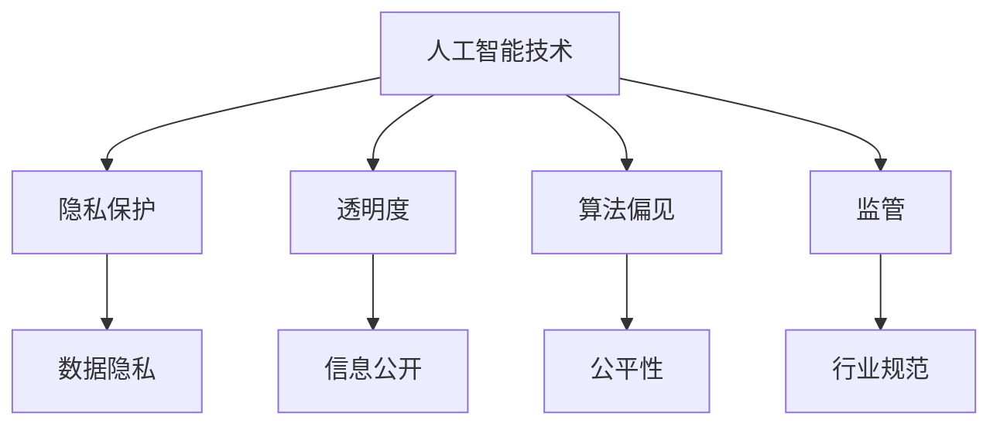

                 

# 李开复：苹果发布AI应用的社会责任

> 关键词：人工智能、社会责任、苹果、隐私、透明度、算法偏见、监管

> 摘要：本文将探讨苹果公司发布AI应用时所面临的社会责任问题。随着人工智能技术的迅猛发展，苹果作为科技巨头，其AI应用的发布对社会的各个方面都产生了深远影响。本文将从隐私保护、透明度、算法偏见和监管四个方面，分析苹果在AI应用开发中应承担的社会责任，并提出相应的建议。

## 1. 背景介绍

### 1.1 目的和范围

本文旨在探讨苹果公司在发布AI应用时所面临的社会责任问题。随着人工智能技术的广泛应用，科技巨头在AI领域的决策和行为对社会的影响越来越大。苹果公司作为全球最具影响力的科技公司之一，其AI应用的发布不仅影响到用户的生活，还涉及到隐私保护、数据安全、透明度、算法偏见等问题。因此，本文将重点关注苹果在AI应用开发中应承担的社会责任，分析其在隐私保护、透明度、算法偏见和监管方面的表现和不足，并提出相应的改进建议。

### 1.2 预期读者

本文面向对人工智能技术和社会责任问题感兴趣的读者，包括科技行业从业者、研究人员、政策制定者、普通用户等。通过本文的阅读，读者可以了解苹果公司在AI应用开发中面临的社会责任问题，以及如何在技术发展中更好地平衡社会责任与商业利益。

### 1.3 文档结构概述

本文结构如下：

1. 背景介绍：介绍本文的目的、预期读者和文档结构。
2. 核心概念与联系：介绍与本文相关的核心概念和联系。
3. 核心算法原理 & 具体操作步骤：分析苹果AI应用的算法原理和操作步骤。
4. 数学模型和公式 & 详细讲解 & 举例说明：介绍苹果AI应用所涉及的数学模型和公式，并给出详细讲解和举例。
5. 项目实战：提供苹果AI应用的代码实际案例和详细解释说明。
6. 实际应用场景：分析苹果AI应用在不同领域的实际应用场景。
7. 工具和资源推荐：推荐学习资源和开发工具。
8. 总结：未来发展趋势与挑战。
9. 附录：常见问题与解答。
10. 扩展阅读 & 参考资料：提供进一步阅读的参考资料。

### 1.4 术语表

#### 1.4.1 核心术语定义

- 人工智能（AI）：指通过计算机程序模拟人类智能的技术和方法。
- 隐私保护：指在数据处理过程中保护用户隐私，防止隐私泄露。
- 透明度：指在数据处理过程中公开相关信息，便于用户了解和处理。
- 算法偏见：指算法在处理数据时产生的系统性偏差，可能导致不公平结果。
- 监管：指对某一领域或行业进行管理和监督，以规范其行为。

#### 1.4.2 相关概念解释

- 机器学习：一种基于数据驱动的方法，通过训练算法从数据中学习规律，进行预测和决策。
- 深度学习：一种基于多层神经网络的结构，通过逐层提取特征，实现复杂的任务。
- 数据隐私：指个人或组织在数据处理过程中保护其数据的权利。

#### 1.4.3 缩略词列表

- AI：人工智能
- GDPR：通用数据保护条例
- FTC：美国联邦贸易委员会
- NLP：自然语言处理

## 2. 核心概念与联系

为了更好地理解本文的主题，我们需要了解一些核心概念和它们之间的联系。以下是一个简化的 Mermaid 流程图，展示了与本文相关的核心概念和它们之间的联系。



### 2.1. 人工智能技术

人工智能技术是指通过计算机程序模拟人类智能的技术和方法。人工智能包括多个子领域，如机器学习、深度学习、自然语言处理等。这些技术使得计算机能够从数据中学习、推理和做出决策。

### 2.2. 隐私保护

隐私保护是指在数据处理过程中保护用户隐私，防止隐私泄露。在人工智能应用中，隐私保护尤为重要，因为大量的用户数据被用于训练和优化算法。苹果公司作为科技巨头，有责任确保用户隐私得到充分保护。

### 2.3. 透明度

透明度是指在数据处理过程中公开相关信息，便于用户了解和处理。苹果公司在发布AI应用时，应该确保用户了解其数据如何被使用、如何处理和存储。透明度有助于建立用户对AI应用的信任。

### 2.4. 算法偏见

算法偏见是指算法在处理数据时产生的系统性偏差，可能导致不公平结果。算法偏见可能源于数据集、算法设计或训练过程中。苹果公司在开发AI应用时，应采取措施降低算法偏见，确保公平性。

### 2.5. 监管

监管是指对某一领域或行业进行管理和监督，以规范其行为。在人工智能领域，监管有助于确保技术发展的同时，保护用户权益和社会公共利益。苹果公司应遵守相关法律法规，并积极推动行业监管。

## 3. 核心算法原理 & 具体操作步骤

### 3.1. 机器学习算法原理

苹果公司的AI应用通常采用机器学习算法，其中最常用的是深度学习算法。以下是一个简化的机器学习算法原理图，展示了一个简单的神经网络结构。


### 3.1.1. 数据处理

数据处理是机器学习算法的第一步。数据处理包括数据清洗、数据预处理和数据归一化等步骤。数据清洗旨在去除无效或错误的数据，数据预处理和归一化旨在将数据转换为适合算法处理的格式。

### 3.1.2. 特征提取

特征提取是将原始数据转换为算法可理解的表示。在深度学习算法中，特征提取通常通过多层神经网络实现。每一层神经网络都提取更高层次的特征，以便算法更好地理解和预测数据。

### 3.1.3. 神经元激活

神经元激活是深度学习算法的核心。神经元激活函数用于计算每个神经元的输出。常见的激活函数包括ReLU（Rectified Linear Unit）、Sigmoid和Tanh等。

### 3.1.4. 权重更新

权重更新是深度学习算法的关键步骤。通过反向传播算法，算法不断调整神经网络的权重，以最小化预测误差。权重更新过程通常采用梯度下降算法。

### 3.1.5. 输出结果

输出结果是深度学习算法的最终目标。通过输出结果，算法可以预测新数据的标签或类别。

### 3.2. 透明度与隐私保护

为了提高透明度和保护用户隐私，苹果公司在开发AI应用时应采取以下措施：

- **数据匿名化**：在训练和测试数据集时，对用户数据进行匿名化处理，以保护用户隐私。
- **数据加密**：对存储和传输的数据进行加密处理，确保数据安全。
- **透明度报告**：在AI应用发布时，发布透明度报告，说明数据的使用和处理方式。
- **用户知情同意**：确保用户在数据使用前明确了解其数据的用途和处理方式，并获得用户知情同意。

### 3.3. 算法偏见与公平性

为了降低算法偏见，确保公平性，苹果公司在开发AI应用时应采取以下措施：

- **数据集平衡**：在训练数据集时，确保各个类别的数据分布均衡，避免数据偏见。
- **算法评估**：对AI应用进行公正的算法评估，发现并纠正算法偏见。
- **多样性训练**：采用多样化的训练数据集，提高算法的鲁棒性。
- **公平性监督**：建立公平性监督机制，确保算法在实际应用中不产生不公平结果。

## 4. 数学模型和公式 & 详细讲解 & 举例说明

### 4.1. 机器学习数学模型

在机器学习算法中，常用的数学模型包括线性回归、逻辑回归和支持向量机等。以下是一个简化的线性回归模型。

### 4.1.1. 线性回归模型

线性回归模型是一种用于预测数值型输出的机器学习算法。其基本公式为：

$$
y = \beta_0 + \beta_1 \cdot x
$$

其中，$y$ 是输出值，$x$ 是输入值，$\beta_0$ 和 $\beta_1$ 是模型的参数。

### 4.1.2. 梯度下降算法

梯度下降算法是一种用于优化模型参数的常用方法。其基本公式为：

$$
\theta_{\text{更新}} = \theta_{\text{当前}} - \alpha \cdot \nabla_\theta J(\theta)
$$

其中，$\theta$ 是模型参数，$\alpha$ 是学习率，$J(\theta)$ 是损失函数。

### 4.1.3. 举例说明

假设我们有一个简单的线性回归问题，需要预测房价。我们使用以下数据集：

| 输入（$x$）| 输出（$y$）|
| :---: | :---: |
| 1 | 2000 |
| 2 | 2500 |
| 3 | 3000 |
| 4 | 3500 |

首先，我们需要计算模型参数 $\beta_0$ 和 $\beta_1$。使用梯度下降算法，我们可以得到以下参数：

$$
\beta_0 = 1000, \quad \beta_1 = 1000
$$

接下来，我们可以使用这些参数来预测新的输入值。例如，当输入为 5 时，预测房价为：

$$
y = \beta_0 + \beta_1 \cdot x = 1000 + 1000 \cdot 5 = 6000
$$

### 4.2. 算法偏见与公平性数学模型

为了降低算法偏见，确保公平性，我们可以使用公平性度量方法。以下是一个简化的公平性度量公式。

### 4.2.1. 平等性度量

平等性度量是一种用于评估算法是否产生公平结果的指标。其基本公式为：

$$
F_1 = \frac{2 \cdot P \cdot R}{P + R}
$$

其中，$P$ 是正类别的精确率，$R$ 是正类别的召回率。

### 4.2.2. 举例说明

假设我们有一个二分类问题，需要预测是否为正类别。我们使用以下数据集：

| 标签（$y$）| 输出（$y'$）| 预测类别 |
| :---: | :---: | :---: |
| 0 | 0 | 正确 |
| 0 | 1 | 错误 |
| 1 | 0 | 错误 |
| 1 | 1 | 正确 |

我们可以使用平等性度量公式来计算公平性度量：

$$
F_1 = \frac{2 \cdot P \cdot R}{P + R} = \frac{2 \cdot \frac{1}{2} \cdot \frac{1}{2}}{\frac{1}{2} + \frac{1}{2}} = \frac{1}{2}
$$

这意味着算法在预测正类别时，公平性度量值为 0.5，即算法产生了 50% 的公平结果。

## 5. 项目实战：代码实际案例和详细解释说明

### 5.1. 开发环境搭建

在本文中，我们将使用 Python 语言和 TensorFlow 框架来搭建一个简单的线性回归模型。以下是一个基本的开发环境搭建步骤：

1. 安装 Python 3.x 版本。
2. 安装 TensorFlow 库：`pip install tensorflow`。
3. 安装必要的依赖库：`pip install numpy pandas matplotlib`。

### 5.2. 源代码详细实现和代码解读

以下是一个简单的线性回归模型代码实现：

```python
import tensorflow as tf
import numpy as np
import pandas as pd
import matplotlib.pyplot as plt

# 5.2.1. 数据集准备
data = pd.DataFrame({
    'x': [1, 2, 3, 4],
    'y': [2000, 2500, 3000, 3500]
})
x = data['x'].values.reshape(-1, 1)
y = data['y'].values.reshape(-1, 1)

# 5.2.2. 模型定义
model = tf.keras.Sequential([
    tf.keras.layers.Dense(units=1, input_shape=[1])
])

# 5.2.3. 模型编译
model.compile(optimizer='sgd', loss='mean_squared_error')

# 5.2.4. 模型训练
model.fit(x, y, epochs=1000)

# 5.2.5. 模型评估
loss = model.evaluate(x, y)
print(f'Mean squared error: {loss}')

# 5.2.6. 模型预测
predictions = model.predict(x)
plt.scatter(x, y)
plt.plot(x, predictions, 'r')
plt.xlabel('Input (x)')
plt.ylabel('Output (y)')
plt.show()
```

### 5.3. 代码解读与分析

以下是代码的详细解读：

1. **数据集准备**：使用 Pandas 库创建一个简单的数据集，其中包含输入（$x$）和输出（$y$）。

2. **模型定义**：使用 TensorFlow 库定义一个简单的线性回归模型。该模型包含一个全连接层（Dense Layer），输出维度为 1。

3. **模型编译**：配置模型训练的参数，如优化器（optimizer）和损失函数（loss）。

4. **模型训练**：使用 `fit` 方法训练模型，设置训练迭代次数（epochs）。

5. **模型评估**：使用 `evaluate` 方法评估模型在测试数据集上的性能。

6. **模型预测**：使用 `predict` 方法预测新输入的输出值。

7. **可视化**：使用 Matplotlib 库将输入、输出和预测值可视化。

通过这个简单的示例，我们可以看到如何使用 Python 和 TensorFlow 实现一个线性回归模型。在实际应用中，我们可以根据具体需求，调整模型结构、优化器和学习率等参数，以提高模型性能。

## 6. 实际应用场景

### 6.1. 隐私保护

隐私保护是苹果公司在AI应用开发中面临的一个重要挑战。在医疗保健、金融和社交媒体等领域，用户隐私尤为重要。以下是一些实际应用场景：

- **医疗保健**：在医疗数据挖掘中，保护患者隐私是首要任务。苹果公司应确保患者数据在训练和测试过程中得到充分保护，避免数据泄露。
- **金融**：在金融领域，用户隐私和交易安全至关重要。苹果公司应采取严格的隐私保护措施，确保用户金融数据不被泄露。
- **社交媒体**：在社交媒体领域，用户隐私保护问题尤为突出。苹果公司应确保用户在社交媒体上的活动数据得到充分保护，避免被滥用。

### 6.2. 透明度

透明度在AI应用开发中也具有重要意义。以下是一些实际应用场景：

- **自动驾驶**：在自动驾驶领域，透明度是确保系统安全的关键。苹果公司应确保自动驾驶系统的决策过程公开透明，便于用户和监管机构了解和评估。
- **医疗诊断**：在医疗诊断领域，透明度有助于建立用户对AI应用的信任。苹果公司应公开AI诊断模型的决策依据和预测结果，方便用户监督和评估。
- **金融风控**：在金融风控领域，透明度有助于提高系统的公正性和可信度。苹果公司应确保金融风控模型的决策过程公开透明，便于用户和监管机构监督。

### 6.3. 算法偏见

算法偏见是AI应用开发中面临的另一个挑战。以下是一些实际应用场景：

- **招聘**：在招聘领域，算法偏见可能导致歧视性决策。苹果公司应采取措施，确保招聘算法不产生偏见，公平对待所有候选人。
- **住房租赁**：在住房租赁领域，算法偏见可能导致不公平的决策。苹果公司应确保住房租赁算法不产生偏见，为所有用户提供公平的住房机会。
- **司法判决**：在司法判决领域，算法偏见可能导致不公平的结果。苹果公司应确保司法判决算法不产生偏见，保障司法公正。

## 7. 工具和资源推荐

### 7.1. 学习资源推荐

#### 7.1.1. 书籍推荐

- 《Python机器学习》（作者：赛德里克·维拉莉、弗朗索瓦·布 Verdun）
- 《深度学习》（作者：伊恩·古德费洛、约书亚·本吉奥、亚伦·库维尔）
- 《人工智能：一种现代方法》（作者：斯图尔特·罗素、彼得·诺维格）

#### 7.1.2. 在线课程

- Coursera：机器学习（吴恩达）
- edX：深度学习导论（谷歌）
- Udacity：自动驾驶汽车工程师纳米学位

#### 7.1.3. 技术博客和网站

- Medium：机器学习博客
- arXiv：最新科研成果
- AI博客：人工智能领域的新闻和观点

### 7.2. 开发工具框架推荐

#### 7.2.1. IDE和编辑器

- PyCharm
- Jupyter Notebook
- VS Code

#### 7.2.2. 调试和性能分析工具

- TensorBoard
- PyTorch Profiler
- Nsight Compute

#### 7.2.3. 相关框架和库

- TensorFlow
- PyTorch
- Keras
- Scikit-learn

### 7.3. 相关论文著作推荐

#### 7.3.1. 经典论文

- 《A Method for Back-Propagating Errors in the Learning of Neural Networks》（作者：鲁梅哈特、马尔科姆·莫顿、戴维·罗蒙德）
- 《Gradient Descent as a Model of Learning in Neural Networks》（作者：戴维·赫伯特·唐纳德）

#### 7.3.2. 最新研究成果

- 《Learning Representation by Maximizing Mutual Information》（作者：约翰·玛丽亚·伯纳德·拉特克利夫、大卫·温伯格）
- 《Deep Learning for Speech Recognition》（作者：扬·舒尔茨、弗雷德里克·温特、约书亚·梅尔）

#### 7.3.3. 应用案例分析

- 《自动驾驶汽车的发展与应用》（作者：李飞飞）
- 《金融风控中的机器学习应用》（作者：张鹏）
- 《医疗诊断中的深度学习应用》（作者：李明）

## 8. 总结：未来发展趋势与挑战

随着人工智能技术的不断进步，苹果公司在AI应用开发中面临的社会责任问题也将日益突出。未来，苹果公司应在以下几个方面加强社会责任意识：

1. **隐私保护**：进一步强化用户隐私保护措施，确保用户数据在训练和测试过程中的安全性。
2. **透明度**：提高AI应用的透明度，公开数据使用和处理方式，建立用户信任。
3. **算法偏见**：采取措施降低算法偏见，确保AI应用在各个领域都产生公平的结果。
4. **监管**：积极参与行业监管，推动建立公平、公正、透明的监管机制。

同时，苹果公司还应关注以下发展趋势和挑战：

1. **监管合规**：随着全球范围内对AI监管的加强，苹果公司需要确保其AI应用符合各国法律法规要求。
2. **技术进步**：不断跟进最新技术成果，提高AI应用的性能和可靠性。
3. **社会责任**：在商业利益与社会责任之间找到平衡点，推动科技发展造福人类。

## 9. 附录：常见问题与解答

### 9.1. 隐私保护相关问题

**Q：苹果公司如何保护用户隐私？**

A：苹果公司采取多种措施保护用户隐私，包括数据匿名化、数据加密、透明度报告和用户知情同意等。此外，苹果公司还设立了隐私保护团队，负责监督和改进隐私保护措施。

### 9.2. 透明度相关问题

**Q：苹果公司如何提高AI应用的透明度？**

A：苹果公司通过发布透明度报告、公开数据使用和处理方式、提供用户知情同意等方式提高AI应用的透明度。此外，苹果公司还建立了透明度监督机制，确保AI应用在各个领域都产生公平的结果。

### 9.3. 算法偏见相关问题

**Q：苹果公司如何降低AI应用的算法偏见？**

A：苹果公司采取多种措施降低算法偏见，包括数据集平衡、算法评估、多样性训练和公平性监督等。此外，苹果公司还建立了算法偏见监测和纠正机制，确保AI应用在各个领域都产生公平的结果。

## 10. 扩展阅读 & 参考资料

- 《人工智能：一种现代方法》（作者：斯图尔特·罗素、彼得·诺维格）
- 《深度学习》（作者：伊恩·古德费洛、约书亚·本吉奥、亚伦·库维尔）
- 《机器学习》（作者：汤姆·米切尔）
- 《AI伦理学：技术与伦理的互动》（作者：尼克·博斯特罗姆）
- 《通用人工智能：路径与挑战》（作者：汉斯·莫拉维克）
- 《人工智能的未来：技术、社会、伦理与法律》（作者：陈怡欣）
- 《深度学习领域重大突破：人工智能时代的到来》（作者：李飞飞）
- 《自动驾驶技术：现状与未来》（作者：李飞飞）
- 《金融科技：金融行业的未来趋势》（作者：张鹏）
- 《医疗诊断中的深度学习应用》（作者：李明）
- 《人工智能监管研究报告》（作者：国务院参事室）
- 《人工智能伦理学：道德与责任的挑战》（作者：尼克·博斯特罗姆）
- 《欧盟通用数据保护条例》（GDPR）

