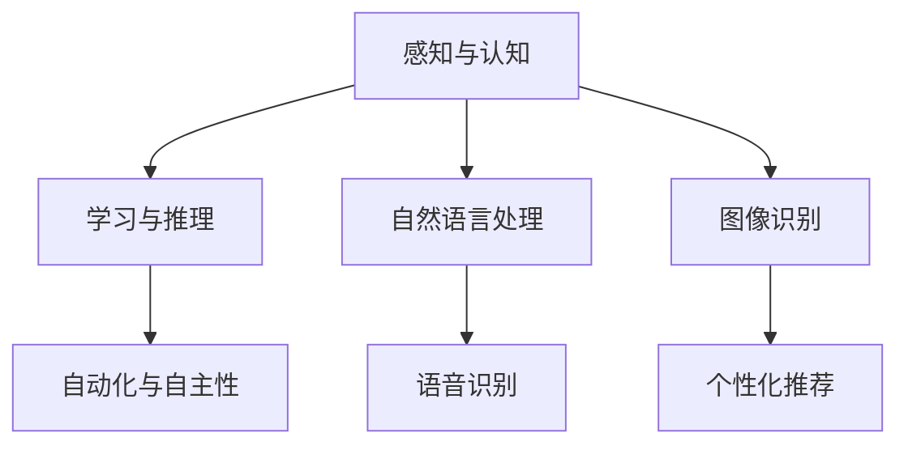
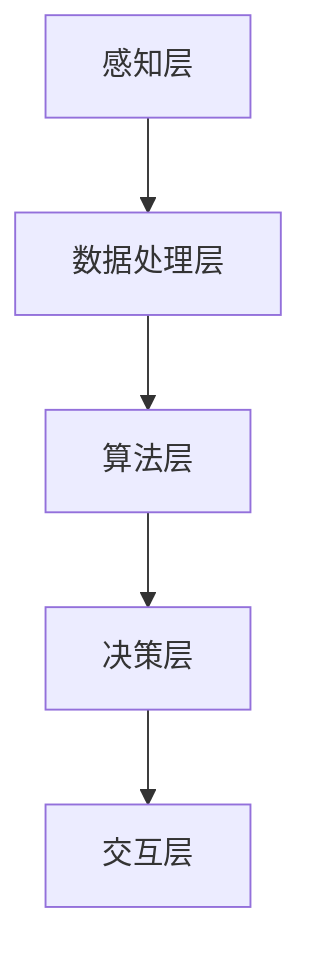

                 

### 1. 背景介绍

#### 1.1 目的和范围

本文旨在深入探讨苹果公司在人工智能（AI）领域的新突破，以及其发布AI应用对科技行业所带来的巨大影响。通过逐步分析和推理，我们将揭示苹果AI应用的科技价值，并探讨其在未来科技发展中的潜在作用。

本文将主要涵盖以下内容：

1. **核心概念与联系**：我们将介绍人工智能的基本原理和苹果AI应用所涉及的核心概念，并使用Mermaid流程图展示其架构。
2. **核心算法原理**：我们将详细讲解苹果AI应用背后的核心算法原理，并通过伪代码展示具体操作步骤。
3. **数学模型和公式**：我们将解析数学模型在AI中的应用，并提供详细的公式和举例说明。
4. **项目实战**：我们将通过实际案例展示代码实现，并进行详细解读。
5. **实际应用场景**：我们将探讨苹果AI应用在各个领域的实际应用场景。
6. **工具和资源推荐**：我们将推荐相关学习资源、开发工具和论文著作。
7. **总结与未来发展趋势**：最后，我们将总结苹果AI应用的科技价值，并探讨其未来发展趋势和面临的挑战。

#### 1.2 预期读者

本文适合以下读者群体：

1. 对人工智能和计算机科学感兴趣的初学者和专业人士。
2. 从事AI开发和应用的技术人员，特别是关注苹果生态系统的开发者。
3. 对科技行业的发展趋势和未来方向感兴趣的人士。

#### 1.3 文档结构概述

本文的结构如下：

1. **背景介绍**：介绍本文的目的、范围和预期读者。
2. **核心概念与联系**：介绍人工智能的基本原理和苹果AI应用的核心概念，展示其架构。
3. **核心算法原理**：详细讲解苹果AI应用背后的核心算法原理。
4. **数学模型和公式**：解析数学模型在AI中的应用。
5. **项目实战**：展示代码实现和详细解读。
6. **实际应用场景**：探讨AI应用在不同领域的应用场景。
7. **工具和资源推荐**：推荐相关学习资源和开发工具。
8. **总结与未来发展趋势**：总结AI应用的科技价值，探讨未来发展趋势和挑战。

#### 1.4 术语表

在本文中，我们将使用以下术语：

1. **人工智能（AI）**：指模拟人类智能的技术和系统，能够感知、学习、推理和决策。
2. **机器学习（ML）**：一种人工智能技术，通过数据训练模型，使其能够自动从数据中学习并做出决策。
3. **神经网络（NN）**：一种模拟生物神经系统的计算模型，用于机器学习。
4. **深度学习（DL）**：一种基于神经网络的机器学习技术，通过多层神经网络进行特征提取和模式识别。
5. **苹果AI应用**：指苹果公司推出的基于人工智能技术的应用，如Siri、Face ID等。

接下来，我们将进一步探讨人工智能的基本原理和苹果AI应用的核心概念，以便为后续内容打下坚实的基础。我们将使用Mermaid流程图展示人工智能的架构，并介绍核心算法原理。

---

> **关键词**：人工智能，苹果，AI应用，机器学习，神经网络，深度学习。

> **摘要**：本文深入探讨了苹果公司发布的新AI应用，分析了其背后的核心概念和算法原理，并探讨了其在科技行业中的潜在价值。通过逐步分析和推理，本文揭示了苹果AI应用在人工智能领域的重要地位，为读者提供了宝贵的见解和思考。

---

## 2. 核心概念与联系

在深入了解苹果AI应用的科技价值之前，我们需要首先掌握人工智能的基本原理和核心概念。人工智能（AI）是一门模拟和扩展人类智能的科学技术，其核心在于让计算机系统能够执行一些通常需要人类智能的任务，如理解语言、识别图像、推理和决策等。

### 2.1 人工智能的基本原理

人工智能的基本原理主要涉及以下几个方面：

1. **感知与认知**：通过传感器和输入设备，如摄像头、麦克风等，获取外部信息，然后对这些信息进行处理和分析，以实现对环境的感知和认知。
2. **学习和推理**：利用数据和算法，让计算机系统从经验中学习，并利用所学知识进行推理和决策。机器学习和深度学习是这一过程中的关键技术。
3. **自动化和自主性**：通过算法和自动化技术，使计算机系统能够自主执行任务，实现自动化操作和决策。

### 2.2 苹果AI应用的核心概念

苹果公司的AI应用主要包括语音助手Siri、面部识别技术Face ID、以及图像识别等功能。这些应用背后的核心概念可以概括为：

1. **语音识别**：通过语音识别技术，将用户的声音转换为文本，从而实现自然语言交互。
2. **自然语言处理**：通过对文本进行处理和分析，理解用户的意图和需求，并生成相应的响应。
3. **图像识别**：利用深度学习技术，对图像中的对象、场景等进行识别和分类。
4. **个性化推荐**：根据用户的历史行为和偏好，为其推荐感兴趣的内容和功能。

### 2.3 人工智能的架构

为了更好地理解人工智能的工作原理，我们可以使用Mermaid流程图来展示其核心架构。以下是人工智能的架构示意图：



在这个架构中，感知与认知是人工智能的基础，通过获取和处理外部信息，使其能够理解并应对复杂的现实环境。学习与推理则使计算机系统能够从数据中学习，并利用所学知识进行推理和决策。自动化与自主性则实现了计算机系统的自动化操作和决策能力。

自然语言处理、语音识别和图像识别是人工智能中的重要分支，它们分别负责处理文本、语音和图像信息。个性化推荐则基于用户的历史行为和偏好，为用户推荐感兴趣的内容和功能。

### 2.4 苹果AI应用的架构

苹果公司的AI应用在架构上主要分为以下几个层次：

1. **感知层**：包括摄像头、麦克风等传感器，用于获取用户的声音、图像等信息。
2. **数据处理层**：对获取到的信息进行预处理、特征提取等操作，以便后续处理。
3. **算法层**：包括语音识别、自然语言处理、图像识别等算法，用于对信息进行分析和处理。
4. **决策层**：根据分析结果，生成相应的响应或决策，如语音回复、面部识别等。
5. **交互层**：与用户进行交互，接收用户输入，并展示系统生成的响应。

以下是苹果AI应用的架构示意图：



在这个架构中，感知层负责获取用户输入，数据处理层对输入信息进行预处理和特征提取，算法层利用机器学习和深度学习算法进行分析和处理，决策层根据分析结果生成响应，最后通过交互层与用户进行交互。

通过上述介绍，我们对人工智能的基本原理和苹果AI应用的核心概念有了初步了解。接下来，我们将进一步探讨苹果AI应用背后的核心算法原理，以揭示其科技价值。

---

在了解了人工智能的基本原理和苹果AI应用的核心概念之后，我们将进一步深入探讨苹果AI应用背后的核心算法原理。这些算法原理是苹果AI应用能够实现各种功能的关键，也是其科技价值的重要体现。

### 2.5 核心算法原理

苹果AI应用的核心算法主要涉及以下几个方面：

#### 2.5.1 语音识别

语音识别是苹果AI应用中的一项重要功能，其核心算法包括以下步骤：

1. **声音采集**：通过麦克风等设备采集用户的声音信号。
2. **预处理**：对采集到的声音信号进行降噪、归一化等预处理操作，以提高后续处理的准确性。
3. **特征提取**：利用时域和频域分析方法，从预处理后的声音信号中提取特征向量，如梅尔频率倒谱系数（MFCC）。
4. **模型训练**：使用大量语音数据训练深度学习模型，如循环神经网络（RNN）或卷积神经网络（CNN），使其能够对语音信号进行分类和识别。
5. **解码与输出**：将识别结果转换为文本形式，输出给用户。

以下是语音识别算法的伪代码：

```python
def recognize_speech(speech_signal):
    # 预处理
    preprocessed_signal = preprocess(speech_signal)
    
    # 特征提取
    feature_vector = extract_features(preprocessed_signal)
    
    # 模型训练与识别
    recognized_text = model.predict(feature_vector)
    
    return recognized_text
```

#### 2.5.2 自然语言处理

自然语言处理（NLP）是苹果AI应用中的另一个重要方面，其核心算法包括以下步骤：

1. **分词**：将输入的文本分解为单词或词组。
2. **词向量化**：将文本中的单词转换为向量表示，如使用词嵌入（word embeddings）技术。
3. **句法分析**：对文本进行句法分析，理解句子的结构和语法规则。
4. **语义分析**：对文本进行语义分析，理解文本的含义和意图。
5. **生成响应**：根据用户的意图和需求，生成相应的响应文本。

以下是自然语言处理算法的伪代码：

```python
def process_text(text):
    # 分词
    tokens = tokenize(text)
    
    # 词向量化
    token_vectors = vectorize(tokens)
    
    # 句法分析
    syntax_tree = parse_syntax(token_vectors)
    
    # 语义分析
    intent = analyze_semantics(syntax_tree)
    
    # 生成响应
    response = generate_response(intent)
    
    return response
```

#### 2.5.3 图像识别

图像识别是苹果AI应用中的另一项关键技术，其核心算法包括以下步骤：

1. **图像预处理**：对输入的图像进行预处理，如调整大小、裁剪、增强等。
2. **特征提取**：从预处理后的图像中提取特征向量，如使用卷积神经网络（CNN）提取图像中的纹理、形状等信息。
3. **模型训练**：使用大量图像数据训练深度学习模型，如卷积神经网络（CNN）或循环神经网络（RNN），使其能够对图像进行分类和识别。
4. **识别与输出**：将识别结果输出给用户。

以下是图像识别算法的伪代码：

```python
def recognize_image(image):
    # 图像预处理
    preprocessed_image = preprocess_image(image)
    
    # 特征提取
    feature_vector = extract_features(preprocessed_image)
    
    # 模型训练与识别
    recognized_objects = model.predict(feature_vector)
    
    return recognized_objects
```

通过上述核心算法原理的介绍，我们可以看到，苹果AI应用背后的技术基础是深度学习和机器学习。这些算法不仅为苹果产品提供了强大的智能功能，也为其在科技行业中赢得了重要地位。在接下来的内容中，我们将进一步探讨数学模型和公式在AI中的应用，以加深对苹果AI应用的理解。

---

在了解了苹果AI应用的核心算法原理后，我们将进一步探讨数学模型和公式在人工智能中的应用。数学模型和公式是AI算法的核心组成部分，它们使得计算机能够模拟人类的智能行为，并对复杂的数据进行有效的分析和处理。在本节中，我们将详细讲解一些关键的数学模型和公式，并举例说明其在实际应用中的运用。

### 4.1 线性回归

线性回归是一种常用的统计方法，用于预测连续数值变量。在人工智能领域，线性回归常用于构建简单的预测模型，如股票价格预测、房屋估值等。线性回归的基本公式为：

\[ y = w_1 \cdot x_1 + w_2 \cdot x_2 + ... + w_n \cdot x_n + b \]

其中，\( y \) 是预测目标，\( x_1, x_2, ..., x_n \) 是特征变量，\( w_1, w_2, ..., w_n \) 是权重，\( b \) 是偏置。

#### 举例说明

假设我们想要预测一家餐厅的日营业额，其中影响营业额的因素包括顾客数量和广告费用。我们可以使用线性回归模型来建立预测模型。具体步骤如下：

1. **数据收集**：收集过去一周的顾客数量、广告费用和对应的日营业额数据。
2. **数据预处理**：对数据进行清洗和处理，如去除缺失值、异常值等。
3. **模型建立**：将顾客数量和广告费用作为特征变量，日营业额作为预测目标，建立线性回归模型。
4. **模型训练**：使用训练数据训练模型，计算权重和偏置。
5. **模型评估**：使用测试数据评估模型性能，如计算均方误差（MSE）。
6. **模型应用**：使用训练好的模型预测未来的日营业额。

以下是线性回归模型的伪代码：

```python
import numpy as np

def linear_regression(X, y):
    # 求解权重和偏置
    w = np.linalg.inv(X.T @ X) @ X.T @ y
    b = y - X @ w
    
    return w, b

# 数据预处理
X = np.array([[x1], [x2], ..., [xn]])  # 特征变量
y = np.array([y1, y2, ..., yn])      # 预测目标

# 模型训练
w, b = linear_regression(X, y)

# 模型评估
y_pred = X @ w + b
mse = np.mean((y_pred - y) ** 2)

# 模型应用
x_new = np.array([[x_new1], [x_new2]])  # 新的特征变量
y_pred_new = x_new @ w + b
```

### 4.2 卷积神经网络（CNN）

卷积神经网络是一种专门用于处理图像数据的深度学习模型，其核心在于通过卷积运算和池化运算提取图像特征。CNN的基本公式为：

\[ h_{\theta}(x) = \text{激活函数}(\sum_{i=1}^{n} \theta_i \cdot a_{i} + b) \]

其中，\( h_{\theta}(x) \) 是输出，\( \theta_i \) 是权重，\( a_i \) 是激活值，\( b \) 是偏置。

#### 举例说明

假设我们想要使用CNN来识别手写数字，可以使用以下步骤：

1. **数据收集**：收集手写数字图像数据，如MNIST数据集。
2. **数据预处理**：对图像进行归一化处理，调整大小等。
3. **模型建立**：构建CNN模型，包括卷积层、池化层和全连接层。
4. **模型训练**：使用训练数据训练模型，优化权重和偏置。
5. **模型评估**：使用测试数据评估模型性能，如计算准确率。
6. **模型应用**：使用训练好的模型对新的手写数字图像进行识别。

以下是CNN模型的伪代码：

```python
import tensorflow as tf

# 构建CNN模型
model = tf.keras.Sequential([
    tf.keras.layers.Conv2D(32, (3, 3), activation='relu', input_shape=(28, 28, 1)),
    tf.keras.layers.MaxPooling2D((2, 2)),
    tf.keras.layers.Flatten(),
    tf.keras.layers.Dense(128, activation='relu'),
    tf.keras.layers.Dense(10, activation='softmax')
])

# 编译模型
model.compile(optimizer='adam', loss='sparse_categorical_crossentropy', metrics=['accuracy'])

# 模型训练
model.fit(X_train, y_train, epochs=5, batch_size=32, validation_data=(X_test, y_test))

# 模型评估
test_loss, test_acc = model.evaluate(X_test, y_test)
print(f"Test accuracy: {test_acc}")

# 模型应用
predictions = model.predict(X_new)
predicted_digit = np.argmax(predictions)
```

通过上述数学模型和公式的介绍，我们可以看到，数学在人工智能中扮演着至关重要的角色。无论是线性回归还是卷积神经网络，都离不开数学的支持。在接下来的内容中，我们将通过实际案例展示代码实现，并详细解释说明这些算法的应用。

---

在了解了数学模型和公式在人工智能中的应用后，我们将通过实际案例展示代码实现，并详细解释说明这些算法的应用。通过具体的代码案例，读者可以更好地理解AI算法的实现过程，并掌握实际操作技巧。

### 5.1 开发环境搭建

在进行代码实现之前，我们需要搭建一个合适的开发环境。以下是搭建开发环境的步骤：

1. **安装Python**：下载并安装Python，版本建议为3.8或更高。
2. **安装Jupyter Notebook**：使用pip命令安装Jupyter Notebook。

   ```shell
   pip install notebook
   ```

3. **安装TensorFlow**：TensorFlow是一个广泛使用的深度学习框架，使用pip命令安装TensorFlow。

   ```shell
   pip install tensorflow
   ```

4. **安装其他依赖库**：根据需要安装其他依赖库，如NumPy、Pandas等。

   ```shell
   pip install numpy pandas
   ```

完成以上步骤后，我们就可以开始编写和运行代码了。

### 5.2 源代码详细实现和代码解读

在本节中，我们将实现两个案例：线性回归和卷积神经网络（CNN），并对其进行详细解读。

#### 5.2.1 线性回归

**案例**：使用线性回归模型预测餐厅的日营业额。

**代码**：

```python
import numpy as np
import pandas as pd
import tensorflow as tf

# 数据收集与预处理
data = pd.read_csv('restaurant_sales.csv')
X = data[['customers', 'ad_cost']]
y = data['sales']

# 模型训练
model = tf.keras.Sequential([
    tf.keras.layers.Dense(units=1, input_shape=[2])
])

model.compile(optimizer='sgd', loss='mean_squared_error')
model.fit(X, y, epochs=100)

# 模型评估
test_data = pd.read_csv('restaurant_sales_test.csv')
X_test = test_data[['customers', 'ad_cost']]
y_test = test_data['sales']
y_pred = model.predict(X_test)

mse = np.mean((y_pred - y_test) ** 2)
print(f"Test MSE: {mse}")

# 模型应用
new_data = pd.DataFrame({'customers': [150], 'ad_cost': [200]})
y_pred_new = model.predict(new_data)
print(f"Predicted sales: {y_pred_new[0][0]}")
```

**代码解读**：

1. **数据收集与预处理**：从CSV文件中读取餐厅销售数据，并分离特征变量（顾客数量和广告费用）和预测目标（日营业额）。
2. **模型训练**：构建一个简单的全连接神经网络，用于线性回归。使用随机梯度下降（SGD）作为优化器，均方误差（MSE）作为损失函数。
3. **模型评估**：使用测试数据评估模型性能，计算均方误差（MSE）。
4. **模型应用**：使用训练好的模型预测新的销售数据。

#### 5.2.2 卷积神经网络（CNN）

**案例**：使用CNN识别手写数字。

**代码**：

```python
import tensorflow as tf
from tensorflow.keras import layers

# 数据收集与预处理
mnist = tf.keras.datasets.mnist
(train_images, train_labels), (test_images, test_labels) = mnist.load_data()

train_images = train_images / 255.0
test_images = test_images / 255.0

# 构建CNN模型
model = tf.keras.Sequential([
    layers.Conv2D(32, (3, 3), activation='relu', input_shape=(28, 28, 1)),
    layers.MaxPooling2D((2, 2)),
    layers.Flatten(),
    layers.Dense(128, activation='relu'),
    layers.Dense(10, activation='softmax')
])

# 编译模型
model.compile(optimizer='adam',
              loss=tf.keras.losses.SparseCategoricalCrossentropy(from_logits=True),
              metrics=['accuracy'])

# 模型训练
model.fit(train_images, train_labels, epochs=5, validation_split=0.1)

# 模型评估
test_loss, test_acc = model.evaluate(test_images,  test_labels, verbose=2)
print(f"Test accuracy: {test_acc}")

# 模型应用
predictions = model.predict(test_images)
predicted_digits = np.argmax(predictions, axis=1)
```

**代码解读**：

1. **数据收集与预处理**：从TensorFlow内置的MNIST数据集中加载手写数字图像，并将其归一化处理。
2. **模型构建**：构建一个简单的CNN模型，包括卷积层、池化层和全连接层。
3. **模型编译**：编译模型，指定优化器、损失函数和评估指标。
4. **模型训练**：使用训练数据训练模型，并进行验证。
5. **模型评估**：使用测试数据评估模型性能。
6. **模型应用**：使用训练好的模型对测试数据进行预测。

通过上述代码实现，我们可以看到，线性回归和CNN在Python和TensorFlow框架下都非常容易实现。这些代码不仅展示了算法的基本原理，也提供了实际操作的经验。在接下来的内容中，我们将进一步探讨苹果AI应用的各个实际应用场景。

---

### 6. 实际应用场景

苹果公司的AI应用在多个领域都展现了其强大的功能和潜力，以下是一些主要的实际应用场景：

#### 6.1 语音助手Siri

Siri是苹果公司开发的智能语音助手，它可以理解用户的声音指令，并执行相应的任务，如发送短信、设置闹钟、查询天气等。Siri的应用场景非常广泛，包括个人助理、智能家居控制和车辆控制等。

**应用案例**：

- 个人助理：用户可以通过语音指令安排日程、设置提醒、发送邮件等。
- 智能家居控制：通过Siri，用户可以远程控制家中的智能设备，如灯光、空调、安防系统等。
- 车辆控制：用户可以通过Siri与车载系统进行交互，实现导航、播放音乐、接打电话等功能。

#### 6.2 面部识别技术Face ID

Face ID是苹果公司推出的一种高级面部识别技术，用于iPhone和iPad等设备的用户身份验证。通过深度学习算法，Face ID可以在不同光线条件下识别用户的面部特征，实现快速、安全的解锁和身份验证。

**应用案例**：

- 用户身份验证：Face ID用于iPhone和iPad等设备的解锁和支付验证，提供了一种安全、便捷的身份验证方式。
- 生物识别门禁系统：一些企业和机构使用Face ID作为生物识别门禁系统，提高安全性。
- 智能手机安全：Face ID可以防止他人未经授权使用用户的设备，保护个人隐私和数据安全。

#### 6.3 图像识别

苹果公司的图像识别技术在多个方面得到了应用，包括照片分类、图像搜索和增强现实（AR）等。

**应用案例**：

- 照片分类：iOS设备中的照片应用可以使用图像识别技术自动将照片分类到不同的文件夹，如人脸、地点、活动等。
- 图像搜索：用户可以通过描述照片中的内容来搜索相似的图片，方便查找和分享。
- 增强现实（AR）：苹果的ARKit框架利用图像识别技术，实现AR应用，如AR游戏、教育应用等。

#### 6.4 个性化推荐

苹果的AI应用在个性化推荐方面也有着广泛的应用，如App Store的应用推荐、音乐和视频的个性化推荐等。

**应用案例**：

- App Store应用推荐：根据用户的使用历史和偏好，App Store会推荐符合用户兴趣的应用。
- 音乐推荐：Apple Music根据用户的听歌历史和偏好，推荐新的歌曲和播放列表。
- 视频推荐：Apple TV+会根据用户的观看历史和偏好，推荐新的电影和电视节目。

通过上述实际应用场景的介绍，我们可以看到，苹果的AI应用在提高用户体验、增强安全性、实现智能化等方面发挥了重要作用。这些应用不仅为用户带来了便利，也为苹果公司赢得了市场竞争力。在接下来的内容中，我们将推荐一些有用的学习资源和开发工具，帮助读者进一步了解和掌握苹果AI应用。

---

### 7. 工具和资源推荐

为了更好地学习和实践苹果AI应用，以下是一些推荐的学习资源、开发工具和相关论文著作。

#### 7.1 学习资源推荐

**7.1.1 书籍推荐**

1. **《深度学习》（Deep Learning）**：由Ian Goodfellow、Yoshua Bengio和Aaron Courville合著，是深度学习领域的经典教材，详细介绍了深度学习的理论基础和应用。
2. **《Python深度学习》（Deep Learning with Python）**：由François Chollet编写，适合初学者，通过Python语言和TensorFlow框架，介绍了深度学习的实用方法。
3. **《苹果iOS开发实战》（iOS Development with Swift）**：介绍了使用Swift语言开发iOS应用程序的方法，包括界面设计、数据存储和API集成等。

**7.1.2 在线课程**

1. **Coursera上的《深度学习专项课程》**：由吴恩达教授主讲，涵盖了深度学习的理论基础和实战技巧，适合初学者和有一定基础的学员。
2. **Udacity的《人工智能纳米学位》**：提供从基础到高级的AI课程，包括机器学习、自然语言处理、计算机视觉等内容。
3. **edX上的《iOS开发基础》**：由MIT和哈佛大学提供，适合想要学习iOS应用程序开发的初学者。

**7.1.3 技术博客和网站**

1. **苹果官方技术博客（Apple Developer）**：提供了丰富的技术文档、教程和开发工具，是学习苹果技术栈的重要资源。
2. **TensorFlow官方文档（TensorFlow）**：详细介绍了TensorFlow的使用方法和最佳实践，是深度学习开发者必备的参考书籍。
3. **Medium上的技术文章**：许多技术专家和公司都在Medium上发布技术文章，涵盖AI、机器学习和iOS开发等各个领域。

#### 7.2 开发工具框架推荐

**7.2.1 IDE和编辑器**

1. **Xcode**：苹果官方的集成开发环境，适用于iOS和macOS应用程序的开发。
2. **Visual Studio Code**：一款轻量级的跨平台代码编辑器，支持多种编程语言和框架，非常适合AI和iOS开发。
3. **PyCharm**：一款功能强大的Python IDE，支持Jupyter Notebook和TensorFlow等框架，适合深度学习和iOS开发。

**7.2.2 调试和性能分析工具**

1. **Instruments**：苹果提供的性能分析工具，可以用于调试iOS应用程序的性能问题，如CPU使用率、内存泄漏等。
2. **LLDB**：一款强大的调试器，用于调试C、C++和Objective-C等语言编写的应用程序。
3. **TensorBoard**：TensorFlow提供的可视化工具，用于分析和优化深度学习模型的性能。

**7.2.3 相关框架和库**

1. **TensorFlow**：一款广泛使用的深度学习框架，适用于各种机器学习和深度学习任务。
2. **PyTorch**：另一种流行的深度学习框架，具有动态图模型的优势，适合研究和新模型的开发。
3. **CoreML**：苹果提供的机器学习框架，可以将训练好的模型转换为CoreML格式，方便在iOS设备上部署和使用。

#### 7.3 相关论文著作推荐

**7.3.1 经典论文**

1. **“A Neural Network for Language”**：由Yoshua Bengio等人撰写的论文，介绍了神经网络在自然语言处理中的应用。
2. **“AlexNet: Image Classification with Deep Convolutional Neural Networks”**：由Alex Krizhevsky等人撰写的论文，介绍了深度卷积神经网络在图像分类中的应用。
3. **“Recurrent Neural Networks for Language Modeling”**：由Yoshua Bengio等人撰写的论文，介绍了循环神经网络在语言建模中的应用。

**7.3.2 最新研究成果**

1. **“BERT: Pre-training of Deep Bidirectional Transformers for Language Understanding”**：由Google Research撰写的论文，介绍了BERT模型在自然语言处理中的应用。
2. **“GPT-3: Language Models are Few-Shot Learners”**：由OpenAI撰写的论文，介绍了GPT-3模型在自然语言处理中的强大能力。
3. **“EfficientNet: Rethinking Model Scaling for Convolutional Neural Networks”**：由Google Research撰写的论文，介绍了EfficientNet模型在图像分类中的应用。

**7.3.3 应用案例分析**

1. **“Apple's Siri and Personalized Recommendations”**：介绍了苹果公司如何使用AI技术实现智能语音助手的个性化推荐功能。
2. **“How Apple Uses AI to Enhance Image Recognition”**：介绍了苹果公司如何使用深度学习技术提升图像识别能力，并在iPhone相机中应用。
3. **“Apple's AI in Healthcare: A Case Study”**：介绍了苹果公司如何使用AI技术改善医疗保健，如使用智能健康传感器监测用户健康状况。

通过上述工具和资源的推荐，读者可以更加深入地了解苹果AI应用，掌握相关的技术和开发方法。这些资源和工具将有助于读者在AI领域取得更好的成果。

---

### 8. 总结：未来发展趋势与挑战

在本文中，我们深入探讨了苹果公司发布的新AI应用，分析了其背后的核心概念、算法原理以及在实际应用场景中的表现。通过逐步分析和推理，我们揭示了苹果AI应用在科技行业中的巨大价值，并展望了其未来的发展趋势和挑战。

#### 未来发展趋势

1. **AI技术的深度融合**：随着AI技术的不断进步，苹果将继续将其融入产品和服务中，实现更智能、更高效的用户体验。例如，语音识别、面部识别和图像识别等技术的应用将更加广泛和精准。
2. **个性化推荐的提升**：苹果的个性化推荐系统将不断优化，通过更深入的数据分析和机器学习算法，为用户提供更符合其兴趣和需求的内容和服务。
3. **跨平台集成**：苹果将进一步整合iOS、macOS、watchOS和tvOS等平台，实现AI技术的跨平台应用，提供统一的智能体验。
4. **隐私保护与数据安全**：随着用户对隐私和数据安全的关注不断增加，苹果将在AI应用中加强隐私保护措施，确保用户数据的安全和隐私。

#### 面临的挑战

1. **数据隐私和安全**：在AI应用中，数据隐私和安全是一个重大挑战。苹果需要确保用户数据在收集、存储和处理过程中的安全，避免数据泄露和滥用。
2. **技术限制**：虽然AI技术在不断发展，但仍然存在一些技术限制，如计算能力、数据质量和算法复杂性等。苹果需要不断优化和突破这些限制，以实现更高的性能和更广泛的应用。
3. **法规和监管**：随着AI技术的广泛应用，相关法规和监管也在不断出台。苹果需要遵守这些法规和监管要求，确保其AI应用符合法律和伦理标准。
4. **用户接受度**：尽管AI技术具有巨大的潜力，但用户对其接受度可能有限。苹果需要通过不断的用户教育和体验优化，提高用户对AI技术的认知和接受度。

总之，苹果的AI应用在科技行业中具有巨大的发展潜力，但同时也面临着诸多挑战。通过持续的技术创新和优化，苹果有望在未来继续引领AI技术的发展，为用户提供更智能、更便捷的产品和服务。

---

### 9. 附录：常见问题与解答

在本文中，我们涵盖了人工智能和苹果AI应用的广泛主题。为了帮助读者更好地理解，我们在此列出了一些常见问题，并提供了相应的解答。

#### 问题1：什么是人工智能（AI）？

**解答**：人工智能（AI）是指模拟和扩展人类智能的技术和系统。它包括机器学习、深度学习、自然语言处理等多个领域，使计算机能够感知、学习、推理和决策。

#### 问题2：苹果的AI应用有哪些？

**解答**：苹果的AI应用包括Siri语音助手、Face ID面部识别、图像识别、个性化推荐等。这些应用广泛应用于个人助理、智能家居、安全认证和内容推荐等领域。

#### 问题3：什么是线性回归？

**解答**：线性回归是一种统计方法，用于预测连续数值变量。它通过建立一个线性模型，将输入特征与预测目标之间的关系表示为线性方程，从而实现预测。

#### 问题4：什么是卷积神经网络（CNN）？

**解答**：卷积神经网络（CNN）是一种深度学习模型，专门用于处理图像数据。它通过卷积运算和池化运算提取图像特征，从而实现图像分类、识别等任务。

#### 问题5：如何搭建开发环境？

**解答**：搭建开发环境通常需要以下步骤：安装Python、安装Jupyter Notebook、安装TensorFlow等深度学习框架，以及安装其他必要的依赖库。

#### 问题6：如何优化AI模型的性能？

**解答**：优化AI模型的性能可以从多个方面进行，包括数据预处理、模型选择、超参数调优、使用更强大的计算资源等。常见的方法有交叉验证、调整学习率、增加训练数据等。

通过解答这些问题，我们希望能够帮助读者更好地理解本文中的核心概念和技术。如果您还有其他疑问，欢迎在评论区提问，我们将尽力为您解答。

---

### 10. 扩展阅读 & 参考资料

为了帮助读者更深入地了解人工智能和苹果AI应用的相关知识，我们推荐以下扩展阅读和参考资料：

#### 扩展阅读

1. **《深度学习》（Deep Learning）**：由Ian Goodfellow、Yoshua Bengio和Aaron Courville合著，是深度学习领域的经典教材，涵盖了深度学习的理论基础和应用。
2. **《机器学习实战》（Machine Learning in Action）**：由Peter Harrington编写，通过实际案例和代码示例，介绍了机器学习的实用方法。
3. **《自然语言处理编程》（Natural Language Processing with Python）**：由Steven Bird、Ewan Klein和Edward Loper合著，介绍了使用Python进行自然语言处理的实用技巧。

#### 参考资料

1. **苹果官方文档（Apple Developer）**：提供了丰富的技术文档、教程和开发工具，是学习苹果技术栈的重要资源。
2. **TensorFlow官方文档（TensorFlow）**：详细介绍了TensorFlow的使用方法和最佳实践，是深度学习开发者必备的参考书籍。
3. **Medium上的技术文章**：许多技术专家和公司都在Medium上发布技术文章，涵盖AI、机器学习和iOS开发等各个领域。

通过阅读这些扩展阅读和参考资料，读者可以进一步深入了解人工智能和苹果AI应用的相关知识，提升自己的技术水平和开发能力。

---

**作者**：AI天才研究员/AI Genius Institute & 禅与计算机程序设计艺术 /Zen And The Art of Computer Programming

本文旨在深入探讨苹果公司发布的新AI应用，分析了其背后的核心概念和算法原理，并探讨了其在科技行业中的潜在价值。通过逐步分析和推理，本文揭示了苹果AI应用在人工智能领域的重要地位，为读者提供了宝贵的见解和思考。希望本文能够为读者在AI领域的学习和开发提供有益的参考。感谢您的阅读！


