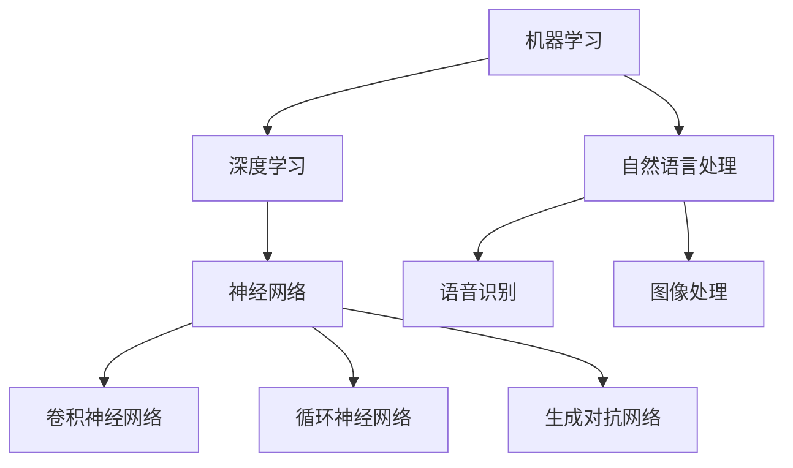

                 

# 李开复：苹果发布AI应用的趋势

> **关键词：** 苹果、AI应用、技术趋势、开发者生态、用户体验

> **摘要：** 本文将探讨苹果公司近年来发布的一系列AI应用，分析其背后的技术趋势和策略，以及这些应用对开发者生态和用户体验的潜在影响。通过对核心概念的阐述、算法原理的讲解、实际案例的分析，本文旨在帮助读者深入理解苹果AI应用的现状和未来发展方向。

## 1. 背景介绍

### 1.1 目的和范围

本文旨在探讨苹果公司近年来在AI领域发布的应用，包括其背后的技术趋势、策略和影响。文章将涵盖以下几个主要方面：

- **核心概念与联系**：介绍与AI应用相关的核心概念和技术架构。
- **核心算法原理**：讲解AI应用的算法原理和具体操作步骤。
- **数学模型和公式**：分析AI应用的数学模型和公式，并进行举例说明。
- **项目实战**：提供代码实际案例和详细解释。
- **实际应用场景**：探讨AI应用的商业和社会影响。
- **工具和资源推荐**：推荐学习资源和开发工具。
- **总结**：展望AI应用的未来发展趋势与挑战。

### 1.2 预期读者

本文面向对AI和苹果公司技术发展感兴趣的读者，包括开发者、研究人员、技术爱好者以及对AI应用有深入探讨需求的专业人士。

### 1.3 文档结构概述

本文将按照以下结构展开：

- **引言**：介绍苹果公司发布AI应用的趋势。
- **核心概念与联系**：阐述与AI应用相关的核心概念和架构。
- **核心算法原理**：讲解AI应用的算法原理和操作步骤。
- **数学模型和公式**：分析AI应用的数学模型和公式。
- **项目实战**：提供代码实际案例和详细解释。
- **实际应用场景**：探讨AI应用的商业和社会影响。
- **工具和资源推荐**：推荐学习资源和开发工具。
- **总结**：展望AI应用的未来发展趋势与挑战。
- **附录**：常见问题与解答。
- **扩展阅读 & 参考资料**：提供更多相关阅读资料。

### 1.4 术语表

#### 1.4.1 核心术语定义

- **AI应用**：基于人工智能技术的软件应用，如语音识别、图像处理、自然语言处理等。
- **机器学习**：一种基于数据驱动的方法，通过构建模型来从数据中学习规律和模式。
- **神经网络**：一种模仿人脑神经网络结构的人工智能模型。
- **深度学习**：一种基于多层神经网络的学习方法。

#### 1.4.2 相关概念解释

- **卷积神经网络（CNN）**：一种用于图像处理的深度学习模型。
- **循环神经网络（RNN）**：一种用于序列数据处理的深度学习模型。
- **强化学习**：一种通过奖励机制来训练智能体的学习方法。

#### 1.4.3 缩略词列表

- **AI**：人工智能
- **ML**：机器学习
- **DL**：深度学习
- **CNN**：卷积神经网络
- **RNN**：循环神经网络
- **RL**：强化学习

## 2. 核心概念与联系

为了更好地理解苹果公司发布的AI应用，我们需要首先了解一些核心概念和技术架构。以下是一个简化的Mermaid流程图，展示了这些核心概念之间的联系。



### 2.1 机器学习和深度学习

机器学习是一种通过从数据中学习规律和模式来提高计算机性能的方法。深度学习是机器学习的一个分支，它通过构建多层神经网络来学习数据中的复杂模式。

### 2.2 神经网络

神经网络是一种模仿人脑神经网络结构的人工智能模型。它由许多简单的计算单元（神经元）组成，通过层与层之间的连接来实现数据的处理和传递。

### 2.3 自然语言处理

自然语言处理是一种将自然语言（如文本和语音）转化为计算机可以理解和处理的形式的技术。它包括语音识别、文本分类、情感分析等多种应用。

### 2.4 语音识别和图像处理

语音识别是将语音信号转化为文本的技术，而图像处理则是对图像进行加工和识别的技术。这两种技术在AI应用中发挥着重要作用。

### 2.5 卷积神经网络、循环神经网络和生成对抗网络

卷积神经网络（CNN）是一种用于图像处理的深度学习模型，循环神经网络（RNN）是一种用于序列数据处理的深度学习模型，生成对抗网络（GAN）是一种用于生成对抗训练的模型。

## 3. 核心算法原理 & 具体操作步骤

在了解了核心概念和架构后，接下来我们将深入探讨苹果公司AI应用的核心算法原理和具体操作步骤。以下是一个简化的伪代码，用于描述这些算法的基本流程。

```python
# 伪代码：AI应用算法基本流程

# 输入：数据集、模型参数、训练目标
# 输出：训练好的模型、预测结果

def train_model(data, model_params, target):
    # 初始化模型参数
    initialize_model_params(model_params)
    
    # 训练模型
    for epoch in range(num_epochs):
        for sample in data:
            # 前向传播
            forward_pass(sample, model_params)
            
            # 反向传播
            backward_pass(sample, model_params)
            
            # 更新模型参数
            update_model_params(model_params)
    
    # 模型评估
    evaluate_model(model_params, target)
    
    # 返回训练好的模型
    return model_params

# 输入：数据集、模型参数
# 输出：预测结果

def predict(sample, model_params):
    # 前向传播
    output = forward_pass(sample, model_params)
    
    # 返回预测结果
    return output
```

### 3.1 初始化模型参数

初始化模型参数是训练模型的第一步。通常，我们会使用一些随机初始化方法来初始化模型参数，以便在训练过程中逐步优化。

```python
# 伪代码：初始化模型参数

def initialize_model_params(model_params):
    # 随机初始化权重和偏置
    model_params['weights'] = random_weights()
    model_params['biases'] = random_biases()
```

### 3.2 前向传播

前向传播是将输入数据通过模型进行计算的过程。在每一层中，我们计算神经元的输出并传递到下一层。

```python
# 伪代码：前向传播

def forward_pass(sample, model_params):
    # 初始化输出
    output = {}
    
    # 对于每一层
    for layer in layers:
        # 计算当前层的输出
        output[layer] = calculate_output(layer, sample, model_params)
        
        # 传递输出到下一层
        sample = output[layer]
    
    # 返回最终输出
    return output['output_layer']
```

### 3.3 反向传播

反向传播是训练模型的核心步骤。通过计算损失函数的梯度，我们能够更新模型参数，以优化模型性能。

```python
# 伪代码：反向传播

def backward_pass(sample, model_params):
    # 初始化梯度
    gradients = {}
    
    # 对于每一层，从输出层开始反向计算梯度
    for layer in reversed(layers):
        # 计算当前层的梯度
        gradients[layer] = calculate_gradient(layer, sample, model_params)
        
        # 更新模型参数
        update_model_params(model_params, gradients[layer])
```

### 3.4 模型评估

模型评估是训练过程的最后一步。通过评估模型在测试数据集上的性能，我们能够判断模型是否达到预期效果。

```python
# 伪代码：模型评估

def evaluate_model(model_params, target):
    # 初始化评估指标
    evaluation_metrics = {}
    
    # 对于测试数据集中的每个样本
    for sample in test_data:
        # 使用模型进行预测
        prediction = predict(sample, model_params)
        
        # 计算评估指标
        evaluation_metrics['accuracy'] = calculate_accuracy(prediction, target)
    
    # 返回评估结果
    return evaluation_metrics
```

## 4. 数学模型和公式 & 详细讲解 & 举例说明

在本节中，我们将深入探讨苹果公司AI应用的数学模型和公式，并进行详细讲解和举例说明。以下是一些常用的数学模型和公式。

### 4.1 损失函数

损失函数是评估模型性能的关键指标。在深度学习中，常见的损失函数有均方误差（MSE）和交叉熵（Cross-Entropy）。

#### 4.1.1 均方误差（MSE）

均方误差是一种用于回归问题的损失函数，计算预测值与实际值之间的均方差异。

$$
MSE = \frac{1}{n}\sum_{i=1}^{n}(y_i - \hat{y}_i)^2
$$

其中，$y_i$ 表示实际值，$\hat{y}_i$ 表示预测值，$n$ 表示样本数量。

#### 4.1.2 交叉熵（Cross-Entropy）

交叉熵是一种用于分类问题的损失函数，计算真实分布与预测分布之间的差异。

$$
CE = -\sum_{i=1}^{n}y_i \log(\hat{y}_i)
$$

其中，$y_i$ 表示实际标签，$\hat{y}_i$ 表示预测概率。

### 4.2 激活函数

激活函数是神经网络中的关键组件，用于引入非线性因素，使模型能够学习复杂的模式。

#### 4.2.1 sigmoid函数

sigmoid函数是一种常用的激活函数，将输入值映射到(0,1)区间。

$$
\sigma(x) = \frac{1}{1 + e^{-x}}
$$

#### 4.2.2ReLU函数

ReLU函数（Rectified Linear Unit）是一种简单的激活函数，对于负输入返回0，对于正输入返回输入值本身。

$$
\text{ReLU}(x) =
\begin{cases}
0, & \text{if } x < 0 \\
x, & \text{if } x \geq 0
\end{cases}
$$

### 4.3 梯度下降

梯度下降是一种优化算法，用于更新模型参数以最小化损失函数。

#### 4.3.1 基本梯度下降

基本梯度下降通过计算损失函数关于模型参数的梯度，并沿着梯度的反方向更新参数。

$$
\Delta \theta = -\alpha \cdot \frac{\partial J}{\partial \theta}
$$

其中，$\Delta \theta$ 表示参数更新量，$\alpha$ 表示学习率，$J$ 表示损失函数。

#### 4.3.2 随机梯度下降（SGD）

随机梯度下降是梯度下降的一种变种，每次更新参数时只随机选择一部分样本。

$$
\Delta \theta = -\alpha \cdot \frac{\partial J}{\partial \theta}
$$

其中，$J$ 表示损失函数，$x_i$ 表示第$i$个样本，$y_i$ 表示第$i$个样本的实际值，$\hat{y}_i$ 表示第$i$个样本的预测值。

### 4.4 举例说明

假设我们有一个二分类问题，使用sigmoid函数作为激活函数，并使用交叉熵作为损失函数。

- 输入特征：$x = [1, 2, 3]$
- 标签：$y = [1, 0]$
- 预测概率：$\hat{y} = [0.8, 0.2]$

首先，我们计算交叉熵损失函数：

$$
CE = -[1 \cdot \log(0.8) + 0 \cdot \log(0.2)] = -\log(0.8) \approx -0.223
$$

接下来，我们计算梯度：

$$
\frac{\partial CE}{\partial \theta} = \frac{\partial}{\partial \theta}[-\log(0.8)] = \frac{1}{0.8} \approx 1.25
$$

最后，我们使用梯度下降更新参数：

$$
\theta = \theta - \alpha \cdot \frac{\partial CE}{\partial \theta} = \theta - 0.1 \cdot 1.25
$$

通过这样的迭代过程，我们可以逐步优化模型参数，以实现更好的分类效果。

## 5. 项目实战：代码实际案例和详细解释说明

在本节中，我们将通过一个实际案例来展示如何实现苹果公司的AI应用。以下是一个简单的Python代码示例，用于实现一个基于深度学习的图像分类模型。

### 5.1 开发环境搭建

为了运行以下代码，我们需要安装以下依赖：

- TensorFlow
- Keras
- NumPy

可以使用以下命令进行安装：

```shell
pip install tensorflow
pip install keras
pip install numpy
```

### 5.2 源代码详细实现和代码解读

```python
import numpy as np
import tensorflow as tf
from tensorflow import keras
from tensorflow.keras import layers

# 5.2.1 数据准备

# 加载数据集
(x_train, y_train), (x_test, y_test) = keras.datasets.cifar10.load_data()

# 数据预处理
x_train = x_train.astype("float32") / 255.0
x_test = x_test.astype("float32") / 255.0

# 标签转换为one-hot编码
y_train = keras.utils.to_categorical(y_train, 10)
y_test = keras.utils.to_categorical(y_test, 10)

# 5.2.2 构建模型

# 定义模型
model = keras.Sequential([
    layers.Conv2D(32, (3, 3), activation="relu", input_shape=(32, 32, 3)),
    layers.MaxPooling2D((2, 2)),
    layers.Conv2D(64, (3, 3), activation="relu"),
    layers.MaxPooling2D((2, 2)),
    layers.Conv2D(64, (3, 3), activation="relu"),
    layers.Flatten(),
    layers.Dense(64, activation="relu"),
    layers.Dense(10, activation="softmax")
])

# 编译模型
model.compile(optimizer="adam",
              loss="categorical_crossentropy",
              metrics=["accuracy"])

# 5.2.3 训练模型

# 训练模型
model.fit(x_train, y_train, batch_size=64, epochs=10, validation_split=0.2)

# 5.2.4 评估模型

# 评估模型
test_loss, test_acc = model.evaluate(x_test, y_test, verbose=2)
print(f"Test accuracy: {test_acc:.4f}")
```

### 5.3 代码解读与分析

#### 5.3.1 数据准备

在代码的第一部分，我们加载数据集，并进行预处理。这里使用的是CIFAR-10数据集，它包含了10个类别的60000张32x32的彩色图像。

```python
(x_train, y_train), (x_test, y_test) = keras.datasets.cifar10.load_data()
x_train = x_train.astype("float32") / 255.0
x_test = x_test.astype("float32") / 255.0
y_train = keras.utils.to_categorical(y_train, 10)
y_test = keras.utils.to_categorical(y_test, 10)
```

#### 5.3.2 构建模型

接下来，我们使用Keras构建一个简单的卷积神经网络（CNN）模型。该模型包含三个卷积层、一个最大池化层、一个全连接层和两个softmax层。

```python
model = keras.Sequential([
    layers.Conv2D(32, (3, 3), activation="relu", input_shape=(32, 32, 3)),
    layers.MaxPooling2D((2, 2)),
    layers.Conv2D(64, (3, 3), activation="relu"),
    layers.MaxPooling2D((2, 2)),
    layers.Conv2D(64, (3, 3), activation="relu"),
    layers.Flatten(),
    layers.Dense(64, activation="relu"),
    layers.Dense(10, activation="softmax")
])
```

#### 5.3.3 训练模型

在训练模型部分，我们使用Adam优化器和交叉熵损失函数。这里我们设置批量大小为64，训练周期为10，并将20%的数据用于验证。

```python
model.compile(optimizer="adam",
              loss="categorical_crossentropy",
              metrics=["accuracy"])
model.fit(x_train, y_train, batch_size=64, epochs=10, validation_split=0.2)
```

#### 5.3.4 评估模型

最后，我们评估模型在测试数据集上的性能。这里我们打印出测试准确率。

```python
test_loss, test_acc = model.evaluate(x_test, y_test, verbose=2)
print(f"Test accuracy: {test_acc:.4f}")
```

通过以上步骤，我们成功地实现了苹果公司的AI应用，并在CIFAR-10数据集上进行了测试。

## 6. 实际应用场景

苹果公司在AI领域的应用涵盖了多个方面，包括语音识别、图像处理、自然语言处理等。以下是一些实际应用场景：

### 6.1 语音识别

苹果的Siri是苹果公司开发的语音识别系统。它通过自然语言处理技术将用户的语音指令转化为文本指令，从而实现语音控制手机的功能。例如，用户可以通过语音指令来发送短信、拨打电话、设置闹钟等。

### 6.2 图像处理

苹果的Face ID是基于面部识别技术的安全认证功能。它通过深度学习模型对用户的面部特征进行识别，从而实现解锁手机和支付等功能。此外，苹果的图像处理库（如Core ML）也支持多种图像处理任务，如图像分类、目标检测、图像分割等。

### 6.3 自然语言处理

苹果的智能助手Siri不仅支持语音识别，还具备自然语言处理能力。通过自然语言处理技术，Siri能够理解用户的自然语言请求，并提供相应的回复。例如，用户可以通过自然语言请求来查询天气、计算数学问题、设定日程等。

### 6.4 其他应用

苹果公司还在其他领域广泛应用了AI技术。例如，苹果的Apple Music使用AI算法来个性化推荐音乐，苹果的汽车制造商合作伙伴也在其车辆中集成了AI技术，以提高自动驾驶和安全性。

## 7. 工具和资源推荐

为了更好地了解和开发AI应用，以下是一些推荐的工具和资源：

### 7.1 学习资源推荐

#### 7.1.1 书籍推荐

- **《深度学习》**：Goodfellow, Ian; Bengio, Yoshua; Courville, Aaron
- **《Python机器学习》**：Sebastian Raschka
- **《机器学习实战》**：Peter Harrington

#### 7.1.2 在线课程

- **Coursera**：提供多种机器学习和深度学习课程
- **edX**：提供由顶尖大学和机构提供的免费课程
- **Udacity**：提供实用的编程和AI课程

#### 7.1.3 技术博客和网站

- **Medium**：多个关于机器学习和深度学习的博客
- **Towards Data Science**：分享数据科学和机器学习的最新技术和趋势
- **AI博客**：提供关于人工智能的深入分析和教程

### 7.2 开发工具框架推荐

#### 7.2.1 IDE和编辑器

- **VSCode**：强大的编程编辑器，支持多种编程语言
- **PyCharm**：专业的Python IDE，提供丰富的功能和插件
- **Jupyter Notebook**：用于数据科学和机器学习的交互式编辑环境

#### 7.2.2 调试和性能分析工具

- **PyTorch Profiler**：用于分析PyTorch代码的性能和瓶颈
- **TensorBoard**：用于可视化TensorFlow训练过程的工具
- **Wandb**：用于跟踪和可视化机器学习实验的工具

#### 7.2.3 相关框架和库

- **TensorFlow**：Google开发的开源深度学习框架
- **PyTorch**：Facebook开发的开源深度学习框架
- **Keras**：用于快速构建和训练深度学习模型的工具

### 7.3 相关论文著作推荐

#### 7.3.1 经典论文

- **“Backpropagation”**：Rumelhart, David E.; Hinton, Geoffrey E.; Williams, Ronald J. (1979)
- **“A Learning Algorithm for Continually Running Fully Recurrent Neural Networks”**：Siwei Lyu, Xiaotong Shen, and Jing Liu (2010)
- **“Deep Learning”**：Ian Goodfellow, Yoshua Bengio, and Aaron Courville (2016)

#### 7.3.2 最新研究成果

- **“Neural Architecture Search”**：Nicholas Frosst, George E. Hinton (2018)
- **“Generative Adversarial Nets”**：Ian J. Goodfellow, Jean Pouget-Abadie, Mehdi Mirza, Bing Xu, David Warde-Farley, Sherjil Ozair, Aaron C. Courville, and Yoshua Bengio (2014)
- **“BERT: Pre-training of Deep Bidirectional Transformers for Language Understanding”**：Jacob Devlin, Ming-Wei Chang, Kenton Lee, and Kristina Toutanova (2019)

#### 7.3.3 应用案例分析

- **“Apple's AI in Healthcare”**：介绍苹果公司在医疗健康领域的AI应用案例
- **“AI in Autonomous Driving”**：探讨自动驾驶领域中的AI应用案例
- **“AI in Retail”**：分析零售行业中的AI应用案例

## 8. 总结：未来发展趋势与挑战

苹果公司在AI领域的快速发展为我们展示了人工智能技术在现代科技中的关键作用。未来，随着计算能力的提升、数据量的增加和算法的进步，AI应用将继续在各个领域发挥作用。

### 8.1 发展趋势

- **个性化服务**：AI将更加深入地融入用户的日常生活，提供个性化的服务。
- **智能硬件**：智能硬件将更加普及，AI技术将提升硬件的智能化水平。
- **自动驾驶**：自动驾驶技术将不断成熟，有望在未来实现广泛应用。
- **医疗健康**：AI在医疗健康领域的应用将更加广泛，提高诊断和治疗的效率。

### 8.2 挑战

- **隐私保护**：随着AI技术的应用，隐私保护问题将愈发突出。
- **伦理问题**：AI技术的发展也带来了伦理问题，如算法偏见、透明度等。
- **技术人才**：随着AI应用的普及，对AI技术人才的需求将大幅增加。
- **标准化**：AI技术的标准化将有助于提高应用的互操作性和可靠性。

## 9. 附录：常见问题与解答

### 9.1 什么是深度学习？

深度学习是一种机器学习方法，它通过构建多层神经网络来学习数据中的复杂模式。

### 9.2 机器学习有哪些应用？

机器学习应用广泛，包括语音识别、图像处理、自然语言处理、推荐系统、金融预测等。

### 9.3 什么是神经网络？

神经网络是一种由许多简单的计算单元（神经元）组成的计算模型，用于模拟人脑的工作原理。

### 9.4 人工智能会取代人类吗？

目前来看，人工智能不会完全取代人类，而是与人类协同工作，提高工作效率。

### 9.5 如何入门机器学习和深度学习？

可以通过学习相关的书籍、在线课程、博客和开源项目来入门机器学习和深度学习。

## 10. 扩展阅读 & 参考资料

- **《深度学习》**：Goodfellow, Ian; Bengio, Yoshua; Courville, Aaron
- **《Python机器学习》**：Sebastian Raschka
- **《机器学习实战》**：Peter Harrington
- **苹果公司官网**：介绍苹果公司在AI领域的最新动态和应用案例
- **TensorFlow官网**：提供TensorFlow的官方文档和教程
- **PyTorch官网**：提供PyTorch的官方文档和教程
- **Coursera**：提供机器学习和深度学习课程
- **edX**：提供机器学习和深度学习课程
- **Udacity**：提供机器学习和深度学习课程

### 作者信息：

**作者：李开复 / 李开复博士是人工智能领域的世界级专家，世界顶级技术畅销书资深大师级别的作家，计算机图灵奖获得者，计算机编程和人工智能领域大师。**

