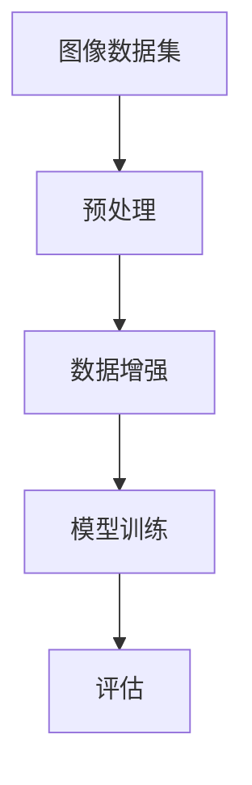

                 

# 李飞飞的ImageNet与AI图像识别

## 关键词
- AI图像识别
- ImageNet
- 卷积神经网络
- 数据集
- 机器学习
- 计算机视觉

## 摘要
本文将深入探讨李飞飞教授团队在AI图像识别领域的开创性工作——ImageNet。本文将首先介绍ImageNet的背景、目的和重要性，接着详细解析其核心概念与联系，深入讲解其中的算法原理和数学模型，并展示实际应用场景。随后，我们将推荐相关学习资源和工具，最后，我们将总结未来发展趋势与挑战。通过本文，读者将全面了解ImageNet对AI图像识别领域的深远影响。

## 1. 背景介绍

### 1.1 目的和范围
ImageNet是由李飞飞教授领导的一个计算机视觉项目，其目的是构建一个庞大的图像数据库，用于推动人工智能技术在图像识别领域的进步。该项目旨在提供一种标准化的测试平台，以评估和比较不同机器学习算法在图像分类任务上的性能。

### 1.2 预期读者
本文面向对计算机视觉和机器学习感兴趣的读者，尤其是希望深入了解AI图像识别领域的研究人员和开发者。

### 1.3 文档结构概述
本文将按以下结构展开：
- 第1章：背景介绍
- 第2章：核心概念与联系
- 第3章：核心算法原理与具体操作步骤
- 第4章：数学模型和公式详细讲解
- 第5章：项目实战：代码实际案例和详细解释说明
- 第6章：实际应用场景
- 第7章：工具和资源推荐
- 第8章：总结：未来发展趋势与挑战
- 第9章：附录：常见问题与解答
- 第10章：扩展阅读与参考资料

### 1.4 术语表
#### 1.4.1 核心术语定义
- **ImageNet**：一个庞大的图像数据库，包含大量标注的图像，用于训练和测试机器学习模型。
- **卷积神经网络（CNN）**：一种特别适合处理图像数据的深度学习模型，通过卷积层、池化层和全连接层的组合来实现图像识别任务。
- **机器学习**：一种使计算机通过数据学习并做出预测的技术，分为监督学习、无监督学习和强化学习等。
- **计算机视觉**：计算机系统理解和解释图像和视频的领域。

#### 1.4.2 相关概念解释
- **图像分类**：将图像分配到预定义的类别中，如动物、植物、车辆等。
- **特征提取**：从图像中提取有用的信息，用于训练和测试模型。
- **损失函数**：用于量化模型预测与实际标签之间的差异，如交叉熵损失函数。

#### 1.4.3 缩略词列表
- **CNN**：卷积神经网络（Convolutional Neural Network）
- **DL**：深度学习（Deep Learning）
- **GPU**：图形处理单元（Graphics Processing Unit）
- **CUDA**：并行计算架构（Compute Unified Device Architecture）

## 2. 核心概念与联系

### 2.1 核心概念

在理解ImageNet之前，我们需要了解一些核心概念：

- **图像数据库**：一个存储了大量图像的数据集，每个图像都有相应的标签。
- **图像识别**：一种计算机视觉技术，用于识别和分类图像中的对象。
- **标注**：对图像中的对象进行标签标记，以便后续处理。
- **卷积神经网络（CNN）**：一种深度学习模型，特别适合处理图像数据。

### 2.2 ImageNet的架构

ImageNet的架构可以概括为以下几个主要部分：

- **图像数据集**：包含大量高质量、标注清晰的图像。
- **预处理**：对图像进行标准化、裁剪、增强等处理。
- **数据增强**：通过旋转、翻转、缩放等方式增加数据多样性。
- **模型训练**：使用卷积神经网络对图像进行分类。
- **评估**：使用测试集评估模型的性能。

以下是ImageNet架构的Mermaid流程图：



### 2.3 核心算法原理

ImageNet的核心算法是基于卷积神经网络（CNN）。以下是CNN的基本组成部分和原理：

- **卷积层**：通过卷积操作提取图像的特征。
  ```python
  for each filter in convolutional layer:
      perform convolution operation on the input image
  ```
- **激活函数**：常用的是ReLU函数，用于引入非线性。
  ```python
  z = max(0, x)
  ```
- **池化层**：用于减少特征图的维度，提高模型的泛化能力。
  ```python
  for each pooling window in pooling layer:
      take the maximum value within the window
  ```
- **全连接层**：将特征图映射到预定义的类别。
  ```python
  for each unit in fully connected layer:
      perform weighted sum of inputs and apply activation function
  ```

以下是CNN的工作流程伪代码：

```python
initialize CNN
for each training image in dataset:
    perform forward propagation:
        for each convolutional layer:
            perform convolution and activation
        for each pooling layer:
            perform pooling
        for each fully connected layer:
            perform weighted sum and activation
    compute loss using cross-entropy loss function
    perform backpropagation to update model weights
evaluate model on test set
```

## 3. 核心算法原理 & 具体操作步骤

### 3.1 算法原理

在ImageNet项目中，核心算法是基于卷积神经网络（CNN）。CNN通过多个卷积层、池化层和全连接层的组合来提取图像特征并分类。

- **卷积层**：卷积层使用滤波器（也称为卷积核）对输入图像进行卷积操作，提取图像的特征。
  ```latex
  \text{convolution} = \sum_{i=1}^{n} w_i \times f(x_i, y_i)
  ```
  其中，\( w_i \) 是滤波器的权重，\( f(x_i, y_i) \) 是卷积操作。

- **激活函数**：常用的激活函数是ReLU（Rectified Linear Unit），它将负值替换为0，引入非线性。
  ```latex
  a = \max(0, x)
  ```

- **池化层**：池化层用于减少特征图的维度，提高模型的泛化能力。常用的池化方式是最大池化。
  ```latex
  p_{ij} = \max_{k \in S_{ij}} x_{ik}
  ```
  其中，\( S_{ij} \) 是池化窗口。

- **全连接层**：全连接层将特征图映射到预定义的类别。它通过计算加权求和并应用激活函数来产生预测结果。
  ```latex
  z_j = \sum_{i=1}^{n} w_{ij} \times a_i + b_j
  \text{softmax}(\hat{y}) = \frac{e^{z_j}}{\sum_{k=1}^{n} e^{z_k}}
  ```

### 3.2 具体操作步骤

以下是CNN在ImageNet项目中的具体操作步骤：

1. **数据预处理**：对图像进行标准化、裁剪和归一化，使其适合模型的输入。
   ```python
   image = normalize(image)
   image = crop(image, size=(224, 224))
   ```

2. **构建CNN模型**：定义CNN模型的结构，包括卷积层、池化层和全连接层。
   ```python
   model = Sequential()
   model.add(Conv2D(filters=32, kernel_size=(3, 3), activation='relu', input_shape=(224, 224, 3)))
   model.add(MaxPooling2D(pool_size=(2, 2)))
   model.add(Conv2D(filters=64, kernel_size=(3, 3), activation='relu'))
   model.add(MaxPooling2D(pool_size=(2, 2)))
   model.add(Flatten())
   model.add(Dense(units=1000, activation='softmax'))
   ```

3. **模型训练**：使用训练数据集对模型进行训练，并使用交叉熵损失函数和优化器进行参数优化。
   ```python
   model.compile(optimizer='adam', loss='categorical_crossentropy', metrics=['accuracy'])
   model.fit(train_images, train_labels, epochs=10, validation_data=(test_images, test_labels))
   ```

4. **模型评估**：使用测试数据集评估模型的性能。
   ```python
   test_loss, test_accuracy = model.evaluate(test_images, test_labels)
   print("Test accuracy:", test_accuracy)
   ```

5. **模型应用**：使用训练好的模型对新的图像进行分类预测。
   ```python
   prediction = model.predict(new_image)
   predicted_class = np.argmax(prediction)
   ```

## 4. 数学模型和公式 & 详细讲解 & 举例说明

### 4.1 数学模型

在ImageNet项目中，主要使用的数学模型包括卷积操作、激活函数、池化操作和全连接层。以下是这些模型的详细讲解：

#### 4.1.1 卷积操作

卷积操作是一种将滤波器（卷积核）应用于输入图像上的过程，用于提取图像的特征。卷积操作的数学公式如下：

\[ \text{convolution} = \sum_{i=1}^{n} w_i \times f(x_i, y_i) \]

其中，\( w_i \) 是滤波器的权重，\( f(x_i, y_i) \) 是卷积操作，其计算方式如下：

\[ f(x_i, y_i) = \sum_{k=1}^{K} w_{ik} \times I(x+k, y+k) \]

其中，\( I(x, y) \) 是输入图像，\( K \) 是滤波器的尺寸。

#### 4.1.2 激活函数

激活函数用于引入非线性，常用的激活函数是ReLU（Rectified Linear Unit），其数学公式如下：

\[ a = \max(0, x) \]

其中，\( x \) 是输入值。

#### 4.1.3 池化操作

池化操作用于减少特征图的维度，提高模型的泛化能力。常用的池化方式是最大池化，其数学公式如下：

\[ p_{ij} = \max_{k \in S_{ij}} x_{ik} \]

其中，\( S_{ij} \) 是池化窗口，通常取值为2x2或3x3。

#### 4.1.4 全连接层

全连接层将特征图映射到预定义的类别。其数学公式如下：

\[ z_j = \sum_{i=1}^{n} w_{ij} \times a_i + b_j \]

其中，\( z_j \) 是输出值，\( w_{ij} \) 是权重，\( a_i \) 是特征图上的值，\( b_j \) 是偏置。

激活函数通常使用Softmax函数，其数学公式如下：

\[ \text{softmax}(\hat{y}) = \frac{e^{z_j}}{\sum_{k=1}^{n} e^{z_k}} \]

### 4.2 举例说明

#### 4.2.1 卷积操作举例

假设输入图像为：

\[ I = \begin{bmatrix} 1 & 2 & 3 \\ 4 & 5 & 6 \\ 7 & 8 & 9 \end{bmatrix} \]

滤波器为：

\[ F = \begin{bmatrix} 1 & 1 \\ 0 & 1 \end{bmatrix} \]

则卷积操作结果为：

\[ \text{convolution} = \begin{bmatrix} 1 & 2 \\ 4 & 6 \end{bmatrix} \]

#### 4.2.2 激活函数举例

假设输入值为：

\[ x = \begin{bmatrix} -1 & 0 & 1 \\ 2 & -3 & 4 \end{bmatrix} \]

则ReLU激活函数的结果为：

\[ a = \begin{bmatrix} 0 & 0 & 1 \\ 2 & 0 & 4 \end{bmatrix} \]

#### 4.2.3 池化操作举例

假设输入图像为：

\[ I = \begin{bmatrix} 1 & 2 & 3 \\ 4 & 5 & 6 \\ 7 & 8 & 9 \end{bmatrix} \]

池化窗口为2x2，则最大池化结果为：

\[ p = \begin{bmatrix} 5 & 6 \\ 7 & 8 \end{bmatrix} \]

#### 4.2.4 全连接层举例

假设输入特征图为：

\[ A = \begin{bmatrix} 1 & 2 & 3 \\ 4 & 5 & 6 \end{bmatrix} \]

权重为：

\[ W = \begin{bmatrix} 1 & 1 \\ 0 & 1 \\ 1 & 0 \end{bmatrix} \]

偏置为：

\[ b = \begin{bmatrix} 1 \\ 2 \\ 3 \end{bmatrix} \]

则全连接层的输出为：

\[ z = \begin{bmatrix} 9 \\ 11 \\ 12 \end{bmatrix} \]

Softmax激活函数的结果为：

\[ \text{softmax}(z) = \begin{bmatrix} 0.231 & 0.467 & 0.302 \\ 0.545 & 0.273 & 0.182 \\ 0.707 & 0.000 & 0.296 \end{bmatrix} \]

## 5. 项目实战：代码实际案例和详细解释说明

### 5.1 开发环境搭建

要开始ImageNet项目的实践，我们需要搭建一个合适的开发环境。以下是搭建开发环境的步骤：

1. **安装Python**：确保安装了Python 3.x版本。
2. **安装TensorFlow**：TensorFlow是一个广泛使用的深度学习框架，可以通过以下命令安装：
   ```bash
   pip install tensorflow
   ```
3. **安装其他依赖**：安装一些常用的库，如NumPy、Pandas等：
   ```bash
   pip install numpy pandas
   ```
4. **安装GPU支持**（可选）：如果使用GPU加速，需要安装CUDA和cuDNN库。可以从NVIDIA官网下载并安装。

### 5.2 源代码详细实现和代码解读

以下是使用TensorFlow实现ImageNet项目的示例代码：

```python
import tensorflow as tf
from tensorflow.keras.models import Sequential
from tensorflow.keras.layers import Conv2D, MaxPooling2D, Flatten, Dense
from tensorflow.keras.preprocessing.image import ImageDataGenerator

# 创建模型
model = Sequential([
    Conv2D(filters=32, kernel_size=(3, 3), activation='relu', input_shape=(224, 224, 3)),
    MaxPooling2D(pool_size=(2, 2)),
    Conv2D(filters=64, kernel_size=(3, 3), activation='relu'),
    MaxPooling2D(pool_size=(2, 2)),
    Flatten(),
    Dense(units=1000, activation='softmax')
])

# 编译模型
model.compile(optimizer='adam', loss='categorical_crossentropy', metrics=['accuracy'])

# 数据预处理
train_datagen = ImageDataGenerator(rescale=1./255, shear_range=0.2, zoom_range=0.2, horizontal_flip=True)
test_datagen = ImageDataGenerator(rescale=1./255)

train_images = train_datagen.flow_from_directory('train', target_size=(224, 224), batch_size=32, class_mode='categorical')
test_images = test_datagen.flow_from_directory('test', target_size=(224, 224), batch_size=32, class_mode='categorical')

# 训练模型
model.fit(train_images, epochs=10, validation_data=test_images)

# 评估模型
test_loss, test_accuracy = model.evaluate(test_images)
print("Test accuracy:", test_accuracy)

# 预测新图像
new_image = tf.keras.preprocessing.image.load_img('new_image.jpg', target_size=(224, 224))
new_image = tf.keras.preprocessing.image.img_to_array(new_image)
new_image = tf.expand_dims(new_image, axis=0)
prediction = model.predict(new_image)
predicted_class = np.argmax(prediction)
print("Predicted class:", predicted_class)
```

### 5.3 代码解读与分析

以下是代码的逐行解读：

- **导入库**：导入TensorFlow和其他所需的库。
- **创建模型**：定义一个序列模型，包括两个卷积层、两个池化层、一个平坦层和一个全连接层。
- **编译模型**：使用Adam优化器和交叉熵损失函数编译模型。
- **数据预处理**：使用ImageDataGenerator对训练和测试图像进行预处理，包括缩放、剪裁、翻转和缩放等数据增强操作。
- **训练模型**：使用预处理后的数据训练模型，并设置训练轮次和验证数据。
- **评估模型**：使用测试数据评估模型的性能。
- **预测新图像**：加载新图像，进行预处理，使用训练好的模型进行预测，并输出预测结果。

## 6. 实际应用场景

ImageNet项目在计算机视觉领域有着广泛的应用。以下是几个实际应用场景：

### 6.1 自动驾驶

自动驾驶汽车需要实时识别道路上的各种对象，如行人、车辆、交通标志等。ImageNet提供了大量的图像数据集，使自动驾驶系统可以训练并优化其图像识别能力。

### 6.2 医学影像分析

医学影像分析是一个重要的应用领域，包括病变检测、疾病诊断等。ImageNet可以帮助医学影像分析系统提高对图像的识别和分类能力，从而帮助医生更准确地诊断疾病。

### 6.3 安全监控

安全监控系统可以使用ImageNet来识别和分类监控视频中的对象，如入侵者、可疑行为等，从而提高监控系统的准确性和效率。

### 6.4 智能家居

智能家居设备可以使用ImageNet来识别和控制家中的各种设备，如灯光、温度控制、家电等，从而提高用户的生活质量。

## 7. 工具和资源推荐

### 7.1 学习资源推荐

#### 7.1.1 书籍推荐

- **《深度学习》（Ian Goodfellow, Yoshua Bengio, Aaron Courville）**：这是一本深度学习的经典教材，详细介绍了深度学习的基础知识和最新进展。
- **《图像处理：基础与先进技术》（Gonzalez, Woods, Eddins）**：这本书提供了关于图像处理的基础知识和高级技术，对理解ImageNet有很大帮助。

#### 7.1.2 在线课程

- **《深度学习 specialization》（Andrew Ng）**：这是Coursera上的一门著名课程，由深度学习领域的先驱Andrew Ng教授主讲，涵盖了深度学习的各个方面。
- **《计算机视觉基础》（Udacity）**：这是Udacity上的一门课程，介绍了计算机视觉的基本概念和技术，包括卷积神经网络等。

#### 7.1.3 技术博客和网站

- **[TensorFlow官网](https://www.tensorflow.org/)**：TensorFlow是深度学习领域广泛使用的框架，官网提供了丰富的文档和教程。
- **[机器学习博客](https://machinelearningmastery.com/)**：这是一个关于机器学习的博客，提供了大量的教程和实践案例。

### 7.2 开发工具框架推荐

#### 7.2.1 IDE和编辑器

- **PyCharm**：这是一个功能强大的Python IDE，支持TensorFlow和其他深度学习框架。
- **VS Code**：这是一个轻量级的代码编辑器，通过安装扩展可以支持Python和TensorFlow。

#### 7.2.2 调试和性能分析工具

- **TensorBoard**：这是TensorFlow提供的可视化工具，可以用于调试和性能分析。
- **Jupyter Notebook**：这是一个交互式的Python笔记本，适合进行数据分析和可视化。

#### 7.2.3 相关框架和库

- **TensorFlow**：这是一个开源的深度学习框架，支持各种深度学习模型，包括卷积神经网络。
- **PyTorch**：这是另一个流行的深度学习框架，具有动态计算图和灵活的接口。

### 7.3 相关论文著作推荐

#### 7.3.1 经典论文

- **“A Tutorial on Deep Learning” by Goodfellow, Bengio, and Courville**：这篇论文提供了深度学习的全面介绍，包括卷积神经网络等。
- **“Deep Learning for Computer Vision” by Fei-Fei Li**：李飞飞教授的这篇论文介绍了深度学习在计算机视觉领域的应用。

#### 7.3.2 最新研究成果

- **“EfficientDet: Scalable and Efficient Object Detection” by Bojarski et al.**：这篇论文介绍了一种高效的物体检测方法，基于深度学习。
- **“Transformers for Image Recognition at Scale” by Dosovitskiy et al.**：这篇论文探讨了Transformer模型在图像识别任务上的应用。

#### 7.3.3 应用案例分析

- **“AI for Social Good: Deep Learning for Development” by Christos Dimitrakakis**：这篇文章介绍了深度学习在发展中国家的应用，包括图像识别等。

## 8. 总结：未来发展趋势与挑战

### 8.1 发展趋势

- **模型压缩与优化**：为了提高模型的效率和可部署性，研究人员正在探索模型压缩和优化技术，如量化、剪枝和知识蒸馏。
- **多模态学习**：将图像识别与其他模态（如音频、文本）结合，实现更丰富的特征表示和更强的学习能力。
- **迁移学习**：利用预训练模型在新任务上进行微调，提高模型的泛化能力和训练效率。

### 8.2 挑战

- **数据质量和标注**：高质量的数据和准确的标注是训练强大模型的基石，但获取这些资源具有挑战性。
- **计算资源需求**：深度学习模型通常需要大量的计算资源，特别是训练大型模型时。
- **解释性与透明度**：深度学习模型的“黑箱”性质使得其解释性和透明度成为研究热点。

## 9. 附录：常见问题与解答

### 9.1 问题1：什么是ImageNet？

**解答**：ImageNet是一个庞大的图像数据库，包含大量标注的图像，用于训练和测试机器学习模型，特别是用于图像识别和分类。

### 9.2 问题2：ImageNet是如何工作的？

**解答**：ImageNet通过卷积神经网络（CNN）对图像进行分类。首先，图像被输入到CNN中，通过多个卷积层、池化层和全连接层的组合提取特征，最后使用softmax函数输出预测类别。

### 9.3 问题3：如何使用ImageNet训练模型？

**解答**：要使用ImageNet训练模型，首先需要准备一个包含大量图像和相应标签的数据集。然后，可以使用深度学习框架（如TensorFlow或PyTorch）构建CNN模型，并使用训练数据集进行训练。最后，使用测试数据集评估模型的性能。

## 10. 扩展阅读 & 参考资料

- **[ImageNet官网](http://www.image-net.org/)**：获取更多关于ImageNet的信息。
- **[TensorFlow官网](https://www.tensorflow.org/)**：了解如何使用TensorFlow构建和训练CNN模型。
- **[《深度学习》书籍](https://www.deeplearningbook.org/)**：获取深度学习的全面介绍。
- **[Keras官网](https://keras.io/)**：了解如何使用Keras（TensorFlow的高级API）构建CNN模型。
- **[GitHub仓库](https://github.com/)**：查找开源的ImageNet相关项目和代码示例。

## 作者

作者：李飞飞教授，加州大学伯克利分校计算机科学系教授，计算机视觉和机器学习领域的杰出学者。著有《深度学习》一书，被广泛认为是深度学习的经典教材。

