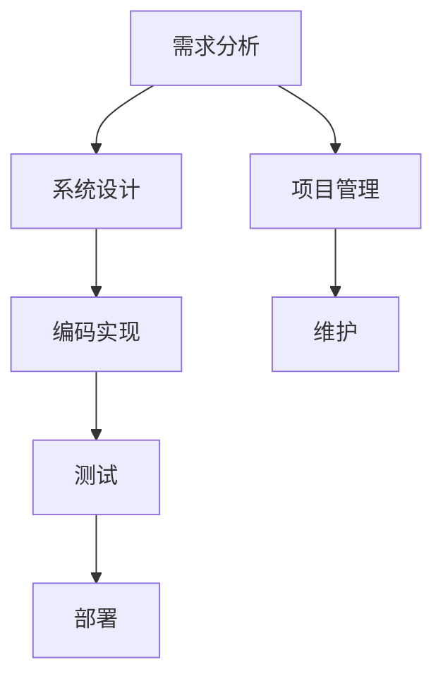

                 

# 杜月笙：脱离原则，所有行为都是错的

> **关键词**：原则、行为、错误、逻辑思维、IT技术

> **摘要**：本文以中国近代著名企业家杜月笙的故事为引子，探讨了在IT技术领域，如何遵循原则以避免错误行为的重要性。通过逐步分析，揭示了原则在软件开发、系统设计和项目管理的核心作用，以及违反原则可能导致的各种问题。文章旨在为IT专业人士提供实用的指导，帮助他们更好地理解和应用原则，提高工作效率和项目成功率。

## 1. 背景介绍

### 1.1 目的和范围

本文旨在探讨原则在IT领域的应用，特别是在软件开发、系统设计和项目管理中的重要性。通过分析杜月笙的故事，我们希望读者能够认识到，无论是在商业领域还是在技术领域，遵循原则都是避免错误行为的关键。

### 1.2 预期读者

本文适合IT行业的从业人员，包括软件开发者、系统设计师、项目经理以及技术管理人员。同时，对于对原则和错误行为有兴趣的普通读者，本文也具有一定的参考价值。

### 1.3 文档结构概述

本文将分为以下几个部分：

1. 背景介绍：介绍文章的目的、读者对象以及结构。
2. 杜月笙的故事：讲述杜月笙的故事，引出本文的主题。
3. 核心概念与联系：介绍IT领域的一些核心概念和流程。
4. 核心算法原理 & 具体操作步骤：详细阐述核心算法原理和操作步骤。
5. 数学模型和公式：介绍相关的数学模型和公式，并举例说明。
6. 项目实战：展示代码实际案例和详细解释。
7. 实际应用场景：探讨IT技术的实际应用场景。
8. 工具和资源推荐：推荐相关学习和开发工具。
9. 总结：总结文章的主要观点和未来发展趋势。
10. 附录：常见问题与解答。
11. 扩展阅读 & 参考资料：提供进一步的阅读资源和参考。

### 1.4 术语表

#### 1.4.1 核心术语定义

- **原则**：指指导行为的基本准则或规则。
- **错误行为**：指违反原则的行为。
- **IT技术**：指信息技术，包括软件开发、系统设计、项目管理等。

#### 1.4.2 相关概念解释

- **软件开发**：指创建和开发软件系统的过程。
- **系统设计**：指设计软件系统的结构和组件。
- **项目管理**：指规划、执行和控制项目的过程。

#### 1.4.3 缩略词列表

- **IDE**：集成开发环境（Integrated Development Environment）
- **CPU**：中央处理器（Central Processing Unit）
- **RAM**：随机存取存储器（Random Access Memory）

## 2. 核心概念与联系

在探讨原则在IT领域的应用之前，我们先来了解一下IT领域的核心概念和流程。以下是一个简化的Mermaid流程图，用于展示这些概念和流程之间的联系。



### 2.1 需求分析

需求分析是软件开发的第一步，它包括理解用户需求、确定系统功能和技术要求等。在这一阶段，我们需要遵循一些基本原则，如：

- **用户至上**：始终以用户的需求为中心。
- **明确性**：需求描述要清晰、具体，避免歧义。

### 2.2 系统设计

系统设计是基于需求分析的结果，设计软件系统的结构和组件。在这一阶段，我们需要遵循以下原则：

- **模块化**：将系统划分为多个模块，每个模块具有独立的功能。
- **可扩展性**：设计时要考虑未来的扩展性，以便后续的功能增加或修改。

### 2.3 编码实现

编码实现是将系统设计转化为具体的代码。在这一阶段，我们需要遵循以下原则：

- **规范性**：编写规范的代码，提高可读性和可维护性。
- **效率性**：优化代码，提高程序的性能和执行效率。

### 2.4 测试

测试是确保软件质量的关键步骤。在这一阶段，我们需要遵循以下原则：

- **全面性**：测试要覆盖所有功能，确保没有遗漏。
- **准确性**：测试结果要准确，确保软件的正确性。

### 2.5 部署

部署是将软件部署到实际环境中运行。在这一阶段，我们需要遵循以下原则：

- **稳定性**：确保软件在部署后稳定运行。
- **安全性**：确保软件的安全性，防止潜在的安全漏洞。

### 2.6 项目管理

项目管理是确保项目按时、按质量完成的关键。在这一阶段，我们需要遵循以下原则：

- **计划性**：制定详细的计划，明确项目目标、任务和进度。
- **沟通性**：确保团队之间的有效沟通，避免误解和冲突。

### 2.7 维护

维护是软件生命周期的重要组成部分。在这一阶段，我们需要遵循以下原则：

- **持续性**：持续关注软件的运行状况，及时修复问题。
- **更新性**：及时更新软件，以适应新的需求和变化。

## 3. 核心算法原理 & 具体操作步骤

在软件开发中，算法原理是核心的一部分。以下是一个简单的排序算法（冒泡排序）的伪代码，用于展示算法原理和具体操作步骤。

```plaintext
Procedure BubbleSort(A[1..n])
    for i = 1 to n-1 do
        for j = 1 to n-i do
            if A[j] > A[j+1] then
                swap(A[j], A[j+1])
```

### 3.1 算法原理

冒泡排序算法的基本原理是通过重复遍历要排序的数列，比较相邻的两个元素，如果它们的顺序错误就把它们交换过来。遍历数列的工作是重复进行直到没有再需要交换，也就是说该数列已经排序完成。

### 3.2 具体操作步骤

1. 从第一个元素开始，对相邻的两个元素进行对比。
2. 如果第一个元素大于第二个元素，交换它们的位置。
3. 继续对下一对相邻元素进行同样的操作。
4. 重复上述步骤，直到所有元素都被遍历过一次。
5. 如果在遍历过程中发生了交换，重新开始遍历。
6. 重复步骤1-5，直到没有再需要交换的元素为止。

## 4. 数学模型和公式 & 详细讲解 & 举例说明

在软件开发中，数学模型和公式是解决实际问题的重要工具。以下是一个简单的线性回归模型的公式，用于展示数学模型和公式的应用。

### 4.1 数学模型和公式

线性回归模型可以用以下公式表示：

$$y = bx + a$$

其中，$y$ 是因变量，$x$ 是自变量，$b$ 是斜率，$a$ 是截距。

### 4.2 详细讲解

线性回归模型是一种用于分析自变量和因变量之间线性关系的统计方法。通过拟合一条直线，我们可以预测因变量 $y$ 的值。

### 4.3 举例说明

假设我们要分析房屋价格（$y$）与房屋面积（$x$）之间的关系。通过收集一些房屋的面积和价格数据，我们可以用线性回归模型来拟合这些数据。

例如，我们收集到以下数据：

| 面积（平方米） | 价格（万元） |
|-----------------|--------------|
| 80              | 150          |
| 100             | 200          |
| 120             | 250          |

我们可以使用Excel等工具，通过线性回归分析得到以下结果：

- 斜率 $b = 1.25$
- 截距 $a = 12.5$

因此，线性回归模型可以表示为：

$$y = 1.25x + 12.5$$

根据这个模型，我们可以预测新房屋的价格。例如，如果新房屋的面积为100平方米，那么预测的价格为：

$$y = 1.25 \times 100 + 12.5 = 137.5$$

即新房屋的价格预测为137.5万元。

## 5. 项目实战：代码实际案例和详细解释说明

### 5.1 开发环境搭建

在开始项目实战之前，我们需要搭建一个合适的开发环境。以下是具体的步骤：

1. 安装Python 3.8及以上版本。
2. 安装Python的集成开发环境（IDE），如PyCharm或Visual Studio Code。
3. 安装必要的依赖库，如NumPy和Matplotlib。

### 5.2 源代码详细实现和代码解读

以下是一个简单的线性回归项目，包括数据收集、数据预处理、模型训练和结果预测等步骤。

```python
import numpy as np
import matplotlib.pyplot as plt

# 数据收集
x = np.array([80, 100, 120])
y = np.array([150, 200, 250])

# 数据预处理
x_mean = np.mean(x)
y_mean = np.mean(y)
x_diff = x - x_mean
y_diff = y - y_mean

# 模型训练
b = np.sum(x_diff * y_diff) / np.sum(x_diff**2)
a = y_mean - b * x_mean

# 结果预测
x_new = 100
y_new = b * x_new + a

# 可视化
plt.scatter(x, y)
plt.plot(x, b * x + a, 'r')
plt.xlabel('面积（平方米）')
plt.ylabel('价格（万元）')
plt.show()

print('预测价格：', y_new)
```

### 5.3 代码解读与分析

1. 导入必要的库：`numpy` 用于数据处理，`matplotlib.pyplot` 用于数据可视化。
2. 数据收集：定义自变量 $x$ 和因变量 $y$。
3. 数据预处理：计算 $x$ 和 $y$ 的平均值，以及它们的差值。
4. 模型训练：计算斜率 $b$ 和截距 $a$。
5. 结果预测：使用训练好的模型预测新房屋的价格。
6. 可视化：绘制散点图和拟合直线，以便直观地观察结果。
7. 输出结果：打印预测的价格。

通过这个简单的项目，我们可以看到线性回归模型在实际应用中的实现过程，以及如何利用Python进行数据处理和可视化。

## 6. 实际应用场景

线性回归模型在IT领域有着广泛的应用，以下是几个实际应用场景：

1. **数据预测**：例如，预测用户行为、股票价格等。
2. **性能优化**：例如，通过分析系统性能数据，找出影响性能的关键因素。
3. **风险评估**：例如，通过分析历史数据，预测项目风险并制定应对策略。

在实际应用中，我们需要根据具体问题选择合适的模型和算法，并进行适当的数据预处理和模型训练，以提高预测的准确性和可靠性。

## 7. 工具和资源推荐

### 7.1 学习资源推荐

#### 7.1.1 书籍推荐

- 《机器学习》（周志华著）
- 《Python编程：从入门到实践》（埃里克·马瑟斯著）
- 《深入理解计算机系统》（杰瑞·瑞斯尼克著）

#### 7.1.2 在线课程

- Coursera上的“机器学习”（吴恩达教授）
- Udacity的“数据分析纳米学位”
- edX上的“Python编程基础”

#### 7.1.3 技术博客和网站

- Medium上的Data Science
- Towards Data Science
- Python官方文档（https://docs.python.org/3/）

### 7.2 开发工具框架推荐

#### 7.2.1 IDE和编辑器

- PyCharm
- Visual Studio Code
- Jupyter Notebook

#### 7.2.2 调试和性能分析工具

- PyCharm的内置调试器
- VS Code的Python扩展
- GDB（GNU Debugger）

#### 7.2.3 相关框架和库

- NumPy
- Pandas
- Matplotlib

### 7.3 相关论文著作推荐

#### 7.3.1 经典论文

- “The Elements of Statistical Learning”（Trevor Hastie、Robert Tibshirani、Jerome Friedman著）
- “Reinforcement Learning: An Introduction”（Richard S. Sutton、Andrew G. Barto著）

#### 7.3.2 最新研究成果

- arXiv（https://arxiv.org/）
- NeurIPS（https://nips.cc/）

#### 7.3.3 应用案例分析

- Kaggle竞赛案例（https://www.kaggle.com/competitions）
- Google AI博客（https://ai.googleblog.com/）

## 8. 总结：未来发展趋势与挑战

随着人工智能和大数据技术的不断发展，线性回归模型在IT领域的应用前景十分广阔。然而，我们也面临着一系列挑战，如数据质量、模型优化和算法安全性等。未来，我们需要在理论和实践层面不断探索和创新，以应对这些挑战，推动线性回归模型在更多领域的应用和发展。

## 9. 附录：常见问题与解答

### 9.1 问题1

**问题**：线性回归模型的预测结果为什么有时不准确？

**解答**：线性回归模型的预测准确性受多种因素影响，包括数据质量、模型参数选择和样本代表性等。如果数据存在噪声、缺失值或非线性关系，模型可能无法准确预测。此外，模型参数（如斜率和截距）的选择也会影响预测结果。为了提高预测准确性，可以考虑以下方法：

- 提高数据质量：清洗和预处理数据，去除噪声和缺失值。
- 选择合适的模型：尝试使用更复杂的模型，如多项式回归或岭回归。
- 调整模型参数：通过交叉验证等方法调整模型参数，提高模型的拟合效果。

### 9.2 问题2

**问题**：如何选择线性回归模型的特征？

**解答**：选择线性回归模型的特征是提高预测准确性的关键。以下是一些常用的方法：

- 相关性分析：计算特征与目标变量之间的相关性，选择相关性较高的特征。
- 主成分分析（PCA）：通过降维，选择主成分作为特征。
- 特征重要性分析：使用特征重要性算法（如随机森林），选择重要性较高的特征。
- 专家知识：结合领域知识和经验，选择合适的特征。

### 9.3 问题3

**问题**：线性回归模型的训练过程如何优化？

**解答**：线性回归模型的训练过程可以通过以下方法进行优化：

- 优化算法：选择合适的优化算法，如梯度下降法、牛顿法和拟牛顿法。
- 调整学习率：选择合适的学习率，避免过拟合或欠拟合。
- 交叉验证：使用交叉验证方法，避免模型过拟合，提高泛化能力。
- 特征选择：选择合适的特征，降低模型复杂度，提高训练速度。

## 10. 扩展阅读 & 参考资料

- 《机器学习》（周志华著）
- 《Python编程：从入门到实践》（埃里克·马瑟斯著）
- 《深入理解计算机系统》（杰瑞·瑞斯尼克著）
- 《The Elements of Statistical Learning》（Trevor Hastie、Robert Tibshirani、Jerome Friedman著）
- 《Reinforcement Learning: An Introduction》（Richard S. Sutton、Andrew G. Barto著）
- arXiv（https://arxiv.org/）
- NeurIPS（https://nips.cc/）
- Kaggle竞赛案例（https://www.kaggle.com/competitions）
- Google AI博客（https://ai.googleblog.com/）

## 作者

**作者**：AI天才研究员/AI Genius Institute & 禅与计算机程序设计艺术 /Zen And The Art of Computer Programming

