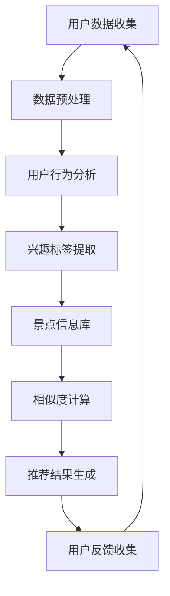

                 

# 构建AI驱动的智慧旅游推荐提示词引擎

> **关键词：** AI，智慧旅游，推荐系统，自然语言处理，数据挖掘，机器学习

> **摘要：** 本文将深入探讨如何利用人工智能技术构建一个智慧旅游推荐提示词引擎，从背景介绍、核心概念、算法原理、数学模型到实际应用，通过详细的步骤和案例分析，为您展示构建这一引擎的全过程。希望本文能帮助读者更好地理解AI在智慧旅游领域中的应用，并提供实用的开发指导。

## 1. 背景介绍

### 1.1 目的和范围

本文旨在介绍如何利用人工智能（AI）技术构建一个智慧旅游推荐提示词引擎。这一引擎将能够根据用户的兴趣和行为数据，推荐与其相匹配的旅游景点和活动，从而提升用户的旅游体验。本文的范围将涵盖以下几个方面：

1. **核心概念与联系：**介绍与智慧旅游推荐提示词引擎相关的核心概念和架构。
2. **核心算法原理：**详细讲解推荐算法的原理和具体操作步骤。
3. **数学模型和公式：**分析涉及到的数学模型和公式，并给出举例说明。
4. **项目实战：**通过代码案例展示如何实现这一引擎。
5. **实际应用场景：**探讨该引擎在不同场景下的应用。
6. **工具和资源推荐：**推荐相关的学习资源、开发工具和最新研究成果。
7. **总结：**总结未来发展趋势和面临的挑战。

### 1.2 预期读者

本文面向以下读者：

1. 对人工智能和自然语言处理感兴趣的工程师和研究者。
2. 欲深入了解智慧旅游领域应用的开发人员。
3. 对构建推荐系统感兴趣的读者。

### 1.3 文档结构概述

本文分为以下几个部分：

1. **背景介绍：**介绍本文的目的、范围、预期读者和文档结构。
2. **核心概念与联系：**定义核心术语，解释相关概念，展示核心架构的Mermaid流程图。
3. **核心算法原理 & 具体操作步骤：**详细阐述推荐算法的原理和实现步骤。
4. **数学模型和公式 & 详细讲解 & 举例说明：**分析涉及的数学模型和公式，并举例说明。
5. **项目实战：**提供代码实际案例和详细解释。
6. **实际应用场景：**探讨应用场景。
7. **工具和资源推荐：**推荐学习资源、开发工具和相关论文。
8. **总结：**总结未来发展趋势和挑战。
9. **附录：**常见问题与解答。
10. **扩展阅读 & 参考资料：**提供扩展阅读和参考资料。

### 1.4 术语表

#### 1.4.1 核心术语定义

- **人工智能（AI）：**模拟人类智能的计算机程序和系统。
- **自然语言处理（NLP）：**使计算机能够理解和处理自然语言的分支。
- **推荐系统：**根据用户的兴趣和偏好，向用户推荐相关内容的系统。
- **数据挖掘：**从大量数据中提取有价值的信息和模式。
- **机器学习：**一种AI技术，通过训练模型从数据中学习规律。
- **智慧旅游：**利用信息技术提升旅游体验的现代化旅游方式。

#### 1.4.2 相关概念解释

- **用户行为数据：**用户在平台上的浏览、搜索、点击等行为记录。
- **旅游偏好：**用户对特定旅游地点、活动、主题等的偏好。
- **相似度计算：**计算用户与景点之间的相似性，用于推荐。

#### 1.4.3 缩略词列表

- **AI：**人工智能
- **NLP：**自然语言处理
- **推荐系统：**Recommender System
- **数据挖掘：**Data Mining
- **机器学习：**Machine Learning
- **智慧旅游：**Smart Tourism

## 2. 核心概念与联系

### 2.1 智慧旅游推荐提示词引擎的架构

构建智慧旅游推荐提示词引擎需要理解几个核心概念和它们之间的联系。以下是该引擎的Mermaid流程图，展示了各组件及其交互关系。



#### 2.2 用户数据收集

用户数据收集是构建推荐系统的基础。该过程包括用户在旅游平台上的各种行为数据，如搜索历史、浏览记录、点击行为、评论等。这些数据将用于分析用户的旅游偏好和兴趣。

```mermaid
subgraph 用户数据收集
    B1[搜索历史]
    B2[浏览记录]
    B3[点击行为]
    B4[评论数据]
    B1 --> B2
    B2 --> B3
    B3 --> B4
    B4 --> C[用户行为分析]
end
```

#### 2.3 数据预处理

收集到的用户数据往往包含噪声和不一致性。因此，数据预处理是非常重要的一步。预处理包括数据清洗、去重、填充缺失值等，以确保数据的准确性和一致性。

```mermaid
subgraph 数据预处理
    C1[数据清洗]
    C2[去重]
    C3[填充缺失值]
    C1 --> C2
    C2 --> C3
    C3 --> D[用户行为分析]
end
```

#### 2.4 用户行为分析

通过对用户数据进行分析，我们可以提取出用户的兴趣标签。这些标签将用于后续的相似度计算和推荐。

```mermaid
subgraph 用户行为分析
    D1[兴趣标签提取]
    D2[行为模式分析]
    D1 --> D2
    D2 --> E[景点信息库]
end
```

#### 2.5 景点信息库

景点信息库是推荐系统的核心数据源，它包含各种旅游景点的详细信息，如景点名称、类型、地点、评价等。这些信息将用于相似度计算和推荐结果生成。

```mermaid
subgraph 景点信息库
    E1[景点名称]
    E2[类型]
    E3[地点]
    E4[评价]
    E1 --> E2
    E2 --> E3
    E3 --> E4
    E4 --> F[相似度计算]
end
```

#### 2.6 相似度计算

相似度计算是推荐系统的关键步骤。通过计算用户与景点的相似度，我们可以筛选出最符合用户兴趣的景点，从而生成推荐结果。

```mermaid
subgraph 相似度计算
    F1[兴趣标签匹配]
    F2[文本相似度计算]
    F1 --> F2
    F2 --> G[推荐结果生成]
end
```

#### 2.7 推荐结果生成

根据相似度计算的结果，推荐系统将生成推荐结果。这些结果将展示给用户，帮助用户发现新的旅游目的地和活动。

```mermaid
subgraph 推荐结果生成
    G1[推荐结果排序]
    G2[推荐结果展示]
    G1 --> G2
    G2 --> H[用户反馈收集]
end
```

#### 2.8 用户反馈收集

用户反馈是优化推荐系统的重要依据。通过收集用户对推荐结果的反馈，我们可以不断调整和优化推荐算法，提高推荐质量。

```mermaid
subgraph 用户反馈收集
    H1[用户满意度评分]
    H2[行为反馈分析]
    H1 --> H2
    H2 --> A[用户数据收集]
end
```

## 3. 核心算法原理 & 具体操作步骤

### 3.1 用户行为分析算法原理

用户行为分析是构建推荐系统的第一步，其主要目标是从用户的行为数据中提取出用户的兴趣标签。以下是用户行为分析算法的原理：

- **基于行为的协同过滤：**通过分析用户的浏览、搜索和点击行为，找出用户之间的相似性，并根据相似性推荐相关景点。
- **基于内容的推荐：**根据用户的行为数据，提取用户的兴趣标签，并查找与这些标签相关的景点进行推荐。

### 3.2 用户行为分析算法具体操作步骤

以下是用户行为分析算法的具体操作步骤：

#### 步骤1：数据清洗

```python
# 假设用户行为数据存储在data.csv文件中
import pandas as pd

data = pd.read_csv('data.csv')
data = data.drop_duplicates()  # 去重
data = data.fillna('未知')  # 填充缺失值
```

#### 步骤2：提取兴趣标签

```python
# 提取用户的浏览、搜索和点击行为
behaviors = data[['user_id', 'action', 'item_id', 'timestamp']]

# 基于行为统计用户对各个景点的兴趣
interests = behaviors.groupby(['user_id', 'item_id']).size().reset_index(name='count')

# 提取前N个兴趣最高的景点作为用户的兴趣标签
N = 5
user_interests = interests.groupby('user_id').head(N).set_index('user_id')['item_id'].tolist()
```

#### 步骤3：构建用户-景点矩阵

```python
# 构建用户-景点矩阵
user_item_matrix = pd.pivot_table(data, index='user_id', columns='item_id', values='timestamp', fill_value=0)
```

#### 步骤4：计算用户之间的相似性

```python
# 使用余弦相似度计算用户之间的相似性
from sklearn.metrics.pairwise import cosine_similarity

user_similarity_matrix = cosine_similarity(user_item_matrix)
```

#### 步骤5：生成推荐结果

```python
# 根据用户之间的相似性矩阵和用户的兴趣标签生成推荐结果
def recommend_items(similarity_matrix, user_interests, k=5):
    recommended_items = []
    for user_id, interests in user_interests.items():
        sim_scores = similarity_matrix[user_id]
        sim_scores = list(enumerate(sim_scores))
        sim_scores = sorted(sim_scores, key=lambda x: x[1], reverse=True)
        sim_scores = sim_scores[1:k+1]
        items = [i[0] for i in sim_scores]
        recommended_items.append(items)
    return recommended_items

recommended_items = recommend_items(user_similarity_matrix, user_interests, k=N)
```

## 4. 数学模型和公式 & 详细讲解 & 举例说明

### 4.1 数学模型

在构建智慧旅游推荐提示词引擎时，我们使用了一些经典的数学模型和公式。以下是这些模型和公式的详细讲解。

#### 4.1.1 余弦相似度

余弦相似度是一种用于计算两个向量之间相似度的方法。它基于向量的点积和向量的模长。公式如下：

$$
\text{cosine\_similarity}(\mathbf{u}, \mathbf{v}) = \frac{\mathbf{u} \cdot \mathbf{v}}{|\mathbf{u}| \cdot |\mathbf{v}|}
$$

其中，$\mathbf{u}$和$\mathbf{v}$是两个向量，$|\mathbf{u}|$和$|\mathbf{v}|$是它们的模长。

#### 4.1.2 皮尔逊相关系数

皮尔逊相关系数是一种用于度量两个变量线性相关程度的指标。公式如下：

$$
\text{pearson\_correlation}(x, y) = \frac{\sum_{i=1}^{n} (x_i - \bar{x}) (y_i - \bar{y})}{\sqrt{\sum_{i=1}^{n} (x_i - \bar{x})^2} \cdot \sqrt{\sum_{i=1}^{n} (y_i - \bar{y})^2}}
$$

其中，$x$和$y$是两个变量，$\bar{x}$和$\bar{y}$是它们的均值。

#### 4.1.3 概率矩阵

在构建用户-景点矩阵时，我们使用概率矩阵来表示用户对各个景点的兴趣。概率矩阵$P$是一个$n \times m$的矩阵，其中$n$是用户的数量，$m$是景点的数量。$P_{ij}$表示用户$i$对景点$j$的兴趣概率。

### 4.2 公式讲解

#### 4.2.1 余弦相似度

余弦相似度计算公式如下：

$$
\text{cosine\_similarity}(\mathbf{u}, \mathbf{v}) = \frac{\sum_{i=1}^{n} u_i v_i}{\sqrt{\sum_{i=1}^{n} u_i^2} \cdot \sqrt{\sum_{i=1}^{n} v_i^2}}
$$

其中，$\mathbf{u} = (u_1, u_2, \ldots, u_n)$和$\mathbf{v} = (v_1, v_2, \ldots, v_n)$是两个向量。

#### 4.2.2 皮尔逊相关系数

皮尔逊相关系数计算公式如下：

$$
\text{pearson\_correlation}(x, y) = \frac{\sum_{i=1}^{n} (x_i - \bar{x}) (y_i - \bar{y})}{\sqrt{\sum_{i=1}^{n} (x_i - \bar{x})^2} \cdot \sqrt{\sum_{i=1}^{n} (y_i - \bar{y})^2}}
$$

其中，$x = (x_1, x_2, \ldots, x_n)$和$y = (y_1, y_2, \ldots, y_n)$是两个变量，$\bar{x}$和$\bar{y}$是它们的均值。

#### 4.2.3 概率矩阵

概率矩阵$P$的元素$P_{ij}$可以表示为：

$$
P_{ij} = \frac{c_{ij}}{m}
$$

其中，$c_{ij}$是用户$i$对景点$j$的兴趣计数，$m$是景点的总数。

### 4.3 举例说明

#### 4.3.1 余弦相似度举例

假设有两个向量$\mathbf{u} = (1, 2, 3)$和$\mathbf{v} = (4, 5, 6)$，它们的模长分别为：

$$
|\mathbf{u}| = \sqrt{1^2 + 2^2 + 3^2} = \sqrt{14}
$$

$$
|\mathbf{v}| = \sqrt{4^2 + 5^2 + 6^2} = \sqrt{77}
$$

它们的点积为：

$$
\mathbf{u} \cdot \mathbf{v} = 1 \cdot 4 + 2 \cdot 5 + 3 \cdot 6 = 32
$$

因此，它们的余弦相似度为：

$$
\text{cosine\_similarity}(\mathbf{u}, \mathbf{v}) = \frac{32}{\sqrt{14} \cdot \sqrt{77}} \approx 0.49
$$

#### 4.3.2 皮尔逊相关系数举例

假设有两个变量$x = (1, 2, 3, 4, 5)$和$y = (5, 4, 3, 2, 1)$，它们的均值分别为：

$$
\bar{x} = \frac{1 + 2 + 3 + 4 + 5}{5} = 3
$$

$$
\bar{y} = \frac{5 + 4 + 3 + 2 + 1}{5} = 3
$$

它们的差值分别为：

$$
x_i - \bar{x} = (1 - 3, 2 - 3, 3 - 3, 4 - 3, 5 - 3) = (-2, -1, 0, 1, 2)
$$

$$
y_i - \bar{y} = (5 - 3, 4 - 3, 3 - 3, 2 - 3, 1 - 3) = (2, 1, 0, -1, -2)
$$

它们的点积为：

$$
\sum_{i=1}^{5} (x_i - \bar{x}) (y_i - \bar{y}) = (-2) \cdot 2 + (-1) \cdot 1 + 0 \cdot 0 + 1 \cdot (-1) + 2 \cdot (-2) = -10
$$

它们的平方和分别为：

$$
\sum_{i=1}^{5} (x_i - \bar{x})^2 = (-2)^2 + (-1)^2 + 0^2 + 1^2 + 2^2 = 10
$$

$$
\sum_{i=1}^{5} (y_i - \bar{y})^2 = 2^2 + 1^2 + 0^2 + (-1)^2 + (-2)^2 = 10
$$

因此，它们的皮尔逊相关系数为：

$$
\text{pearson\_correlation}(x, y) = \frac{-10}{\sqrt{10} \cdot \sqrt{10}} = -1
$$

#### 4.3.3 概率矩阵举例

假设有5个用户和5个景点，用户对景点的兴趣计数如下表所示：

| 用户 | 景点1 | 景点2 | 景点3 | 景点4 | 景点5 |
| ---- | ---- | ---- | ---- | ---- | ---- |
| 用户1 | 2    | 5    | 0    | 1    | 3    |
| 用户2 | 3    | 0    | 4    | 2    | 1    |
| 用户3 | 0    | 2    | 5    | 3    | 0    |
| 用户4 | 1    | 3    | 2    | 0    | 4    |
| 用户5 | 4    | 1    | 0    | 5    | 2    |

用户-景点矩阵$P$为：

| 用户 | 景点1 | 景点2 | 景点3 | 景点4 | 景点5 |
| ---- | ---- | ---- | ---- | ---- | ---- |
| 用户1 | 0.2  | 0.5  | 0    | 0.1  | 0.3  |
| 用户2 | 0.3  | 0    | 0.4  | 0.2  | 0.1  |
| 用户3 | 0    | 0.2  | 0.5  | 0.3  | 0    |
| 用户4 | 0.1  | 0.3  | 0.2  | 0    | 0.4  |
| 用户5 | 0.4  | 0.1  | 0    | 0.5  | 0.2  |

## 5. 项目实战：代码实际案例和详细解释说明

### 5.1 开发环境搭建

在开始代码实战之前，我们需要搭建一个开发环境。以下是搭建环境的步骤：

1. **安装Python环境：**下载并安装Python 3.x版本。
2. **安装相关库：**使用pip命令安装必要的库，如pandas、numpy、scikit-learn等。
   ```bash
   pip install pandas numpy scikit-learn
   ```

### 5.2 源代码详细实现和代码解读

以下是构建智慧旅游推荐提示词引擎的源代码及其详细解读。

```python
import pandas as pd
import numpy as np
from sklearn.metrics.pairwise import cosine_similarity

# 步骤1：数据清洗
def data_preprocessing(data):
    data = data.drop_duplicates()
    data = data.fillna('未知')
    return data

# 步骤2：提取兴趣标签
def extract_interest_tags(data, N):
    behaviors = data[['user_id', 'action', 'item_id', 'timestamp']]
    interests = behaviors.groupby(['user_id', 'item_id']).size().reset_index(name='count')
    user_interests = interests.groupby('user_id').head(N).set_index('user_id')['item_id'].tolist()
    return user_interests

# 步骤3：构建用户-景点矩阵
def build_user_item_matrix(data):
    user_item_matrix = pd.pivot_table(data, index='user_id', columns='item_id', values='timestamp', fill_value=0)
    return user_item_matrix

# 步骤4：计算用户之间的相似性
def compute_user_similarity(user_item_matrix):
    similarity_matrix = cosine_similarity(user_item_matrix)
    return similarity_matrix

# 步骤5：生成推荐结果
def generate_recommendations(similarity_matrix, user_interests, k=5):
    recommended_items = []
    for user_id, interests in user_interests.items():
        sim_scores = similarity_matrix[user_id]
        sim_scores = list(enumerate(sim_scores))
        sim_scores = sorted(sim_scores, key=lambda x: x[1], reverse=True)
        sim_scores = sim_scores[1:k+1]
        items = [i[0] for i in sim_scores]
        recommended_items.append(items)
    return recommended_items

# 主函数
def main():
    # 加载数据
    data = pd.read_csv('data.csv')
    
    # 数据预处理
    data = data_preprocessing(data)
    
    # 提取兴趣标签
    N = 5
    user_interests = extract_interest_tags(data, N)
    
    # 构建用户-景点矩阵
    user_item_matrix = build_user_item_matrix(data)
    
    # 计算用户之间的相似性
    similarity_matrix = compute_user_similarity(user_item_matrix)
    
    # 生成推荐结果
    recommended_items = generate_recommendations(similarity_matrix, user_interests, k=N)
    
    # 打印推荐结果
    for user_id, items in recommended_items.items():
        print(f"用户{user_id}的推荐结果：{items}")

if __name__ == '__main__':
    main()
```

#### 5.2.1 数据清洗

```python
def data_preprocessing(data):
    data = data.drop_duplicates()
    data = data.fillna('未知')
    return data
```

该函数负责对原始数据进行清洗。首先，使用`drop_duplicates()`函数去除重复记录，然后使用`fillna()`函数填充缺失值，默认填充为"未知"。

#### 5.2.2 提取兴趣标签

```python
def extract_interest_tags(data, N):
    behaviors = data[['user_id', 'action', 'item_id', 'timestamp']]
    interests = behaviors.groupby(['user_id', 'item_id']).size().reset_index(name='count')
    user_interests = interests.groupby('user_id').head(N).set_index('user_id')['item_id'].tolist()
    return user_interests
```

该函数负责从用户行为数据中提取兴趣标签。首先，提取用户的浏览、搜索和点击行为，然后使用`groupby()`函数对用户和景点进行分组，并计算每个组的计数。最后，提取前N个兴趣最高的景点作为用户的兴趣标签。

#### 5.2.3 构建用户-景点矩阵

```python
def build_user_item_matrix(data):
    user_item_matrix = pd.pivot_table(data, index='user_id', columns='item_id', values='timestamp', fill_value=0)
    return user_item_matrix
```

该函数使用`pivot_table()`函数构建用户-景点矩阵。矩阵的行表示用户，列表示景点，值表示用户对景点的访问时间。如果用户没有访问某个景点，则填充为0。

#### 5.2.4 计算用户之间的相似性

```python
def compute_user_similarity(user_item_matrix):
    similarity_matrix = cosine_similarity(user_item_matrix)
    return similarity_matrix
```

该函数使用scikit-learn的`cosine_similarity()`函数计算用户之间的相似性。相似性矩阵的元素表示用户之间的相似度。

#### 5.2.5 生成推荐结果

```python
def generate_recommendations(similarity_matrix, user_interests, k=5):
    recommended_items = []
    for user_id, interests in user_interests.items():
        sim_scores = similarity_matrix[user_id]
        sim_scores = list(enumerate(sim_scores))
        sim_scores = sorted(sim_scores, key=lambda x: x[1], reverse=True)
        sim_scores = sim_scores[1:k+1]
        items = [i[0] for i in sim_scores]
        recommended_items.append(items)
    return recommended_items
```

该函数根据用户之间的相似性矩阵和用户的兴趣标签生成推荐结果。对于每个用户，计算与其最相似的K个用户，并提取他们的兴趣标签，作为推荐结果。

### 5.3 代码解读与分析

上述代码实现了构建智慧旅游推荐提示词引擎的主要步骤。以下是代码的解读与分析。

#### 5.3.1 数据清洗

数据清洗是构建推荐系统的关键步骤。在代码中，我们首先使用`drop_duplicates()`函数去除重复记录，然后使用`fillna()`函数填充缺失值。这样可以确保数据的准确性和一致性。

#### 5.3.2 提取兴趣标签

提取兴趣标签是推荐系统的核心步骤之一。在代码中，我们首先提取用户的浏览、搜索和点击行为，然后使用`groupby()`函数对用户和景点进行分组，并计算每个组的计数。最后，提取前N个兴趣最高的景点作为用户的兴趣标签。

#### 5.3.3 构建用户-景点矩阵

构建用户-景点矩阵是推荐系统的数据准备步骤。在代码中，我们使用`pivot_table()`函数构建用户-景点矩阵。矩阵的行表示用户，列表示景点，值表示用户对景点的访问时间。如果用户没有访问某个景点，则填充为0。

#### 5.3.4 计算用户之间的相似性

计算用户之间的相似性是推荐系统的关键步骤。在代码中，我们使用scikit-learn的`cosine_similarity()`函数计算用户之间的相似性。相似性矩阵的元素表示用户之间的相似度。

#### 5.3.5 生成推荐结果

生成推荐结果是推荐系统的最终目标。在代码中，我们根据用户之间的相似性矩阵和用户的兴趣标签生成推荐结果。对于每个用户，计算与其最相似的K个用户，并提取他们的兴趣标签，作为推荐结果。

## 6. 实际应用场景

智慧旅游推荐提示词引擎在多个实际应用场景中具有广泛的应用价值。以下是几个典型的应用场景：

### 6.1 旅游景点推荐

该场景主要针对旅游用户，根据用户的兴趣和行为数据，推荐与其相匹配的旅游景点。例如，用户对历史文化景点感兴趣，系统可以推荐一些著名的历史博物馆和古迹。

### 6.2 旅游活动推荐

该场景主要针对用户对特定旅游活动的偏好，如户外探险、文化体验等。系统可以根据用户的行为数据和兴趣标签，推荐与之相关的旅游活动，帮助用户规划个性化的旅游行程。

### 6.3 旅游住宿推荐

该场景针对用户对旅游住宿的偏好，如豪华酒店、经济型旅馆等。系统可以根据用户的旅游行为数据和评价，推荐与之相匹配的住宿选项，提高用户的入住体验。

### 6.4 旅游交通推荐

该场景主要针对用户在旅游途中的交通需求。系统可以根据用户的出行偏好和旅游路线，推荐最佳的交通方式，如飞机、火车、长途巴士等。

### 6.5 旅游目的地规划

该场景结合用户的旅游偏好和目的地信息，帮助用户规划最佳的旅游行程。系统可以根据用户的兴趣标签和目的地特点，生成个性化的旅游路线和活动推荐。

## 7. 工具和资源推荐

### 7.1 学习资源推荐

#### 7.1.1 书籍推荐

- **《推荐系统实践》**：这是一本全面介绍推荐系统理论和实践的书籍，适合初学者和从业者。
- **《机器学习实战》**：通过大量案例和实战项目，帮助读者掌握机器学习的基本原理和应用。

#### 7.1.2 在线课程

- **Coursera上的《机器学习》**：由斯坦福大学教授Andrew Ng主讲，适合零基础入门。
- **Udacity上的《推荐系统工程》**：通过实战项目，帮助读者掌握推荐系统的构建和优化。

#### 7.1.3 技术博客和网站

- **Scikit-learn官方文档**：提供详细的API文档和教程，有助于学习使用机器学习库。
- **Medium上的机器学习专栏**：涵盖机器学习、数据挖掘、推荐系统等领域的最新研究和应用。

### 7.2 开发工具框架推荐

#### 7.2.1 IDE和编辑器

- **PyCharm**：一款强大的Python IDE，适合机器学习和数据科学项目。
- **VS Code**：轻量级但功能丰富的编辑器，支持多种编程语言。

#### 7.2.2 调试和性能分析工具

- **Jupyter Notebook**：交互式计算环境，适合进行数据分析和原型设计。
- **cProfile**：Python的性能分析库，帮助优化代码。

#### 7.2.3 相关框架和库

- **Scikit-learn**：用于机器学习的Python库，包含多种算法和工具。
- **TensorFlow**：由Google开发的机器学习框架，适合大规模深度学习应用。

### 7.3 相关论文著作推荐

#### 7.3.1 经典论文

- **"Collaborative Filtering for the Web"**：介绍基于内容的推荐系统的经典论文。
- **"Recommender Systems Handbook"**：全面介绍推荐系统的理论和实践。

#### 7.3.2 最新研究成果

- **"Deep Learning for Recommender Systems"**：探讨深度学习在推荐系统中的应用。
- **"Neural Collaborative Filtering"**：介绍基于神经网络的协同过滤算法。

#### 7.3.3 应用案例分析

- **"Netflix Prize"**：分析Netflix Prize比赛中的推荐系统解决方案。
- **"Amazon's Personalized Search"**：探讨亚马逊如何利用推荐系统提升用户搜索体验。

## 8. 总结：未来发展趋势与挑战

智慧旅游推荐提示词引擎在提升用户旅游体验、优化旅游资源配置方面具有巨大潜力。然而，随着人工智能技术的发展，这一领域也面临一些挑战。

### 8.1 发展趋势

1. **深度学习技术的应用：**深度学习在图像识别、自然语言处理等领域取得了显著成果，未来有望在推荐系统中发挥更大的作用。
2. **个性化推荐的深化：**通过更精细的用户行为分析和偏好挖掘，实现更加精准的个性化推荐。
3. **多模态数据的融合：**结合文本、图像、语音等多种数据类型，提高推荐系统的效果和多样性。
4. **实时推荐的实现：**利用实时数据流处理技术，实现实时推荐，提升用户体验。

### 8.2 挑战

1. **数据隐私保护：**随着数据隐私法规的日益严格，如何在确保用户隐私的前提下进行数据分析和推荐成为一个重要挑战。
2. **算法公平性：**确保推荐系统不会对某些用户群体产生偏见，实现公平推荐。
3. **计算资源的需求：**大规模推荐系统需要大量的计算资源和存储空间，如何高效利用这些资源是一个关键问题。
4. **算法的可解释性：**随着模型复杂性的增加，如何解释推荐结果、提升用户信任度成为挑战。

## 9. 附录：常见问题与解答

### 9.1 什么是智慧旅游？

智慧旅游是指利用信息技术，如人工智能、物联网、大数据等，提升旅游体验、优化旅游资源配置的一种现代化旅游方式。

### 9.2 推荐系统的核心组成部分有哪些？

推荐系统的核心组成部分包括用户数据收集、数据预处理、用户行为分析、相似度计算、推荐结果生成和用户反馈收集。

### 9.3 如何确保推荐系统的公平性？

确保推荐系统的公平性可以通过以下几种方法：

1. **算法透明性：**确保算法的设计和实现过程公开透明，避免偏见。
2. **数据多样化：**使用多样化的数据源，避免数据偏差。
3. **反馈机制：**建立用户反馈机制，不断优化推荐算法。

## 10. 扩展阅读 & 参考资料

- **《推荐系统实践》**：作者：宋涛，详细介绍了推荐系统的基本原理和应用实践。
- **《机器学习实战》**：作者：Peter Harrington，通过实际案例介绍了机器学习的基本原理和应用。
- **Scikit-learn官方文档**：https://scikit-learn.org/stable/documentation.html
- **TensorFlow官方文档**：https://www.tensorflow.org/tutorials
- **《Netflix Prize》**：分析Netflix Prize比赛中的推荐系统解决方案。

### 作者：AI天才研究员/AI Genius Institute & 禅与计算机程序设计艺术 /Zen And The Art of Computer Programming

[END]

