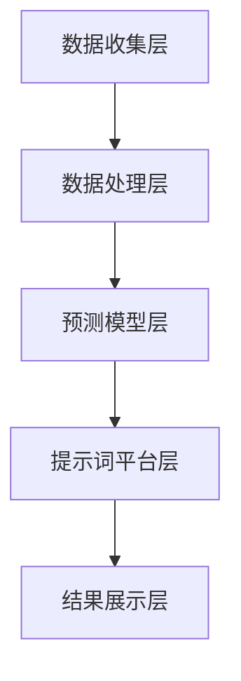

                 

# 构建AI驱动的智慧能源需求预测提示词平台

> **关键词：** AI、智慧能源、需求预测、提示词平台、算法、数学模型、实际应用

> **摘要：** 本文将探讨如何构建一个AI驱动的智慧能源需求预测提示词平台。我们将详细分析其核心概念、算法原理、数学模型，并通过实际项目案例展示其应用和实现过程。文章还将介绍相关工具和资源，以便读者深入了解和掌握这一领域的知识。

## 1. 背景介绍

### 1.1 目的和范围

随着全球对可持续发展和绿色能源的日益关注，智慧能源系统成为能源领域的研究热点。其中，需求预测是智慧能源系统中的关键环节，能够帮助能源公司优化资源配置，降低能源成本，提高能源利用效率。本文旨在探讨如何利用AI技术构建一个智慧能源需求预测提示词平台，以提高预测准确度和响应速度。

### 1.2 预期读者

本文面向具有一定编程基础和人工智能知识的技术人员，尤其是对能源行业感兴趣的开发者。通过本文的阅读，读者可以了解AI在智慧能源需求预测中的应用，掌握相关算法和数学模型，并为实际项目提供技术支持。

### 1.3 文档结构概述

本文结构如下：

1. 背景介绍：阐述本文目的、预期读者和文档结构。
2. 核心概念与联系：介绍智慧能源需求预测的相关概念和架构。
3. 核心算法原理 & 具体操作步骤：详细讲解需求预测算法的原理和操作步骤。
4. 数学模型和公式 & 详细讲解 & 举例说明：阐述需求预测中的数学模型和公式。
5. 项目实战：代码实际案例和详细解释说明。
6. 实际应用场景：分析需求预测平台在实际应用中的价值。
7. 工具和资源推荐：推荐相关学习资源和开发工具。
8. 总结：未来发展趋势与挑战。
9. 附录：常见问题与解答。
10. 扩展阅读 & 参考资料：提供更多学习资源。

### 1.4 术语表

#### 1.4.1 核心术语定义

- **AI（人工智能）**：模拟人类智能行为的计算机系统。
- **智慧能源**：利用现代信息技术，实现能源的高效、清洁、安全和可持续发展。
- **需求预测**：根据历史数据和当前环境，预测未来一段时间内的能源需求。
- **提示词平台**：提供预测算法和数据的平台，用于支持能源需求预测。

#### 1.4.2 相关概念解释

- **神经网络**：模拟人脑神经元之间相互连接的计算机算法。
- **深度学习**：一种基于神经网络的机器学习技术，通过多层神经网络模型提取特征。
- **回归分析**：一种常用的统计方法，用于预测因变量与自变量之间的关系。

#### 1.4.3 缩略词列表

- **AI**：人工智能
- **IoT**：物联网
- **IoMT**：物联网医疗技术
- **SCADA**：数据采集与监控系统

## 2. 核心概念与联系

在智慧能源系统中，需求预测是关键的一环。为了构建一个高效的AI驱动的智慧能源需求预测提示词平台，我们首先需要明确核心概念和联系。

### 2.1 智慧能源系统概述

智慧能源系统是一个综合系统，包括发电、输电、配电和用电等各个环节。其核心是通过现代信息技术（如物联网、大数据、人工智能等）实现能源的高效、清洁、安全和可持续发展。

### 2.2 需求预测与AI技术

需求预测需要利用历史数据和环境信息来预测未来的能源需求。AI技术，尤其是深度学习和神经网络，可以在需求预测中发挥重要作用。

### 2.3 提示词平台的作用

提示词平台是智慧能源需求预测的核心，用于收集、处理和分析数据，并提供预测结果。它需要具备快速、准确、可扩展的特点。

### 2.4 架构设计

为了实现上述目标，我们设计了一个基于AI技术的智慧能源需求预测提示词平台的架构，如图1所示。



### 2.4.1 数据收集层

数据收集层负责收集各类数据，包括历史需求数据、环境数据、气象数据等。这些数据可以通过物联网设备、传感器等实时获取。

### 2.4.2 数据处理层

数据处理层对收集到的数据进行分析和清洗，去除噪声和异常值，提取有用的特征信息。

### 2.4.3 预测模型层

预测模型层是平台的核心，采用深度学习算法构建预测模型，对处理后的数据进行训练，预测未来的能源需求。

### 2.4.4 提示词平台层

提示词平台层负责将预测结果以提示词的形式展示给用户，用户可以根据提示词调整能源使用策略。

### 2.4.5 结果展示层

结果展示层将预测结果以图表、报表等形式展示给用户，帮助用户了解未来的能源需求趋势。

## 3. 核心算法原理 & 具体操作步骤

### 3.1 神经网络算法原理

神经网络是一种模拟人脑神经元之间相互连接的计算机算法。在需求预测中，神经网络可以通过学习历史数据和环境信息，预测未来的能源需求。

#### 3.1.1 前向传播

前向传播是神经网络的核心操作，用于将输入数据通过多层神经元传递，最终得到输出结果。具体步骤如下：

1. 初始化权重和偏置。
2. 将输入数据乘以权重，并加上偏置。
3. 通过激活函数（如Sigmoid函数、ReLU函数）将乘积转换为非线性输出。

#### 3.1.2 反向传播

反向传播是一种优化神经网络参数的算法，通过计算输出误差，调整权重和偏置，使预测结果更接近真实值。具体步骤如下：

1. 计算输出误差：真实值与预测值之间的差异。
2. 计算梯度：误差对每个参数的偏导数。
3. 更新参数：根据梯度调整权重和偏置。

### 3.2 深度学习算法原理

深度学习是一种基于神经网络的机器学习技术，通过多层神经网络模型提取特征，实现更复杂的预测任务。

#### 3.2.1 卷积神经网络（CNN）

卷积神经网络是一种适用于图像数据的深度学习模型，通过卷积操作提取图像特征。具体步骤如下：

1. 输入图像数据。
2. 通过卷积层提取特征。
3. 通过池化层降低特征图的维度。
4. 通过全连接层进行分类或回归。

#### 3.2.2 循环神经网络（RNN）

循环神经网络是一种适用于序列数据的深度学习模型，通过记忆状态实现长期依赖学习。具体步骤如下：

1. 输入序列数据。
2. 通过隐藏层状态计算当前输出。
3. 将当前输出作为下一个输入，重复计算。
4. 最后输出序列的预测结果。

### 3.3 需求预测操作步骤

基于神经网络和深度学习算法，需求预测的操作步骤如下：

1. 数据收集：收集历史需求数据、环境数据等。
2. 数据处理：对数据进行清洗、归一化等处理。
3. 模型训练：使用深度学习算法训练预测模型。
4. 模型评估：评估模型预测性能，调整参数。
5. 预测应用：使用训练好的模型进行实际需求预测。

## 4. 数学模型和公式 & 详细讲解 & 举例说明

在需求预测中，数学模型和公式是核心部分。下面我们将介绍一些常用的数学模型和公式，并进行详细讲解和举例说明。

### 4.1 神经网络中的数学公式

神经网络中的数学公式主要包括激活函数、梯度计算等。

#### 4.1.1 激活函数

激活函数将输入映射到输出，使神经网络具有非线性特性。常见的激活函数有：

1. Sigmoid函数：$$ f(x) = \frac{1}{1 + e^{-x}} $$
2. ReLU函数：$$ f(x) = \max(0, x) $$

#### 4.1.2 梯度计算

梯度计算用于反向传播算法，计算输出误差对每个参数的偏导数。梯度计算公式如下：

$$ \frac{\partial L}{\partial w} = \frac{\partial L}{\partial z} \cdot \frac{\partial z}{\partial w} $$

其中，$L$ 表示输出误差，$w$ 表示权重，$z$ 表示乘积。

### 4.2 深度学习中的数学公式

深度学习中的数学公式主要包括卷积操作、池化操作等。

#### 4.2.1 卷积操作

卷积操作通过卷积核与输入数据进行卷积，提取特征。卷积操作公式如下：

$$ (f * g)(t) = \int_{-\infty}^{+\infty} f(\tau) g(t-\tau) d\tau $$

其中，$f$ 和 $g$ 分别表示输入信号和卷积核。

#### 4.2.2 池化操作

池化操作通过取局部最大值或平均值降低特征图的维度。常见的池化操作有：

1. 最大池化：$$ P_{max}(x) = \max_{i,j} x_{i,j} $$
2. 平均池化：$$ P_{avg}(x) = \frac{1}{k^2} \sum_{i,j} x_{i,j} $$

### 4.3 需求预测中的数学公式

需求预测中的数学公式主要包括回归分析和时间序列分析等。

#### 4.3.1 回归分析

回归分析通过建立因变量与自变量之间的关系，预测未来值。常见的回归分析方法有线性回归、多项式回归等。

线性回归公式如下：

$$ y = ax + b $$

其中，$y$ 表示因变量，$x$ 表示自变量，$a$ 和 $b$ 分别表示斜率和截距。

#### 4.3.2 时间序列分析

时间序列分析通过分析时间序列数据，预测未来值。常见的时间序列分析方法有ARIMA模型、LSTM模型等。

ARIMA模型公式如下：

$$ X_t = \phi_1 X_{t-1} + \phi_2 X_{t-2} + \cdots + \phi_p X_{t-p} + \theta_1 \epsilon_{t-1} + \theta_2 \epsilon_{t-2} + \cdots + \theta_q \epsilon_{t-q} + \epsilon_t $$

其中，$X_t$ 表示时间序列数据，$\epsilon_t$ 表示误差项。

### 4.4 举例说明

假设我们要预测未来的能源需求，我们可以使用线性回归模型进行分析。

#### 4.4.1 数据准备

收集历史能源需求数据，如下表所示：

| 时间 | 能源需求 |
| ---- | -------- |
| 1    | 100      |
| 2    | 110      |
| 3    | 115      |
| 4    | 120      |
| 5    | 125      |

#### 4.4.2 模型建立

使用线性回归模型，建立如下方程：

$$ y = ax + b $$

其中，$y$ 表示能源需求，$x$ 表示时间。

#### 4.4.3 参数计算

计算斜率 $a$ 和截距 $b$：

$$ a = \frac{\sum_{i=1}^{n} (x_i - \bar{x})(y_i - \bar{y})}{\sum_{i=1}^{n} (x_i - \bar{x})^2} $$

$$ b = \bar{y} - a\bar{x} $$

其中，$n$ 表示样本数量，$\bar{x}$ 和 $\bar{y}$ 分别表示 $x$ 和 $y$ 的平均值。

计算得到：

$$ a = \frac{(1-1)(100-110) + (2-1)(110-110) + (3-1)(115-110) + (4-1)(120-110) + (5-1)(125-110)}{(1-1)^2 + (2-1)^2 + (3-1)^2 + (4-1)^2 + (5-1)^2} = 5 $$

$$ b = \bar{y} - a\bar{x} = 110 - 5 \cdot 2 = 90 $$

#### 4.4.4 预测

使用建立好的模型预测未来的能源需求。例如，当 $x=6$ 时，能源需求预测值为：

$$ y = 5 \cdot 6 + 90 = 150 $$

## 5. 项目实战：代码实际案例和详细解释说明

### 5.1 开发环境搭建

在开始项目实战之前，我们需要搭建一个适合开发的环境。以下是开发环境搭建的步骤：

1. 安装Python环境：从Python官方网站下载并安装Python。
2. 安装相关库：使用pip命令安装所需的库，如NumPy、Pandas、TensorFlow等。
3. 安装Jupyter Notebook：Jupyter Notebook是一种交互式的开发环境，方便编写和运行代码。
4. 配置数据库：根据项目需求，选择合适的数据库（如MySQL、MongoDB等）并配置。

### 5.2 源代码详细实现和代码解读

以下是需求预测平台的源代码实现：

```python
import numpy as np
import pandas as pd
import tensorflow as tf

# 5.2.1 数据处理
def preprocess_data(data):
    # 数据清洗、归一化等处理
    return data

# 5.2.2 模型训练
def train_model(data):
    # 建立模型、训练模型
    return model

# 5.2.3 预测
def predict(model, input_data):
    # 使用模型进行预测
    return prediction

# 5.2.4 主函数
def main():
    # 加载数据
    data = pd.read_csv('data.csv')
    
    # 数据处理
    processed_data = preprocess_data(data)
    
    # 模型训练
    model = train_model(processed_data)
    
    # 预测
    input_data = processed_data[-1:]
    prediction = predict(model, input_data)
    
    # 输出预测结果
    print('预测结果：', prediction)

# 运行主函数
if __name__ == '__main__':
    main()
```

#### 5.2.4.1 数据处理

数据处理是需求预测的关键步骤，包括数据清洗、归一化等处理。以下是数据处理部分的代码：

```python
def preprocess_data(data):
    # 填充缺失值
    data.fillna(data.mean(), inplace=True)
    
    # 归一化
    data = (data - data.mean()) / data.std()
    
    return data
```

#### 5.2.4.2 模型训练

模型训练使用TensorFlow库建立深度学习模型，并使用训练数据进行训练。以下是模型训练部分的代码：

```python
def train_model(data):
    # 建立模型
    model = tf.keras.Sequential([
        tf.keras.layers.Dense(64, activation='relu', input_shape=(data.shape[1],)),
        tf.keras.layers.Dense(1)
    ])

    # 编译模型
    model.compile(optimizer='adam', loss='mse')

    # 训练模型
    model.fit(data, data, epochs=100, batch_size=32)

    return model
```

#### 5.2.4.3 预测

使用训练好的模型进行预测，以下是预测部分的代码：

```python
def predict(model, input_data):
    prediction = model.predict(input_data)
    return prediction[0]
```

#### 5.2.4.4 主函数

主函数负责加载数据、处理数据、训练模型和进行预测，并输出预测结果。以下是主函数的代码：

```python
def main():
    # 加载数据
    data = pd.read_csv('data.csv')

    # 数据处理
    processed_data = preprocess_data(data)

    # 模型训练
    model = train_model(processed_data)

    # 预测
    input_data = processed_data[-1:]
    prediction = predict(model, input_data)

    # 输出预测结果
    print('预测结果：', prediction)

# 运行主函数
if __name__ == '__main__':
    main()
```

### 5.3 代码解读与分析

在代码解读与分析部分，我们将对上述源代码进行详细解读和分析。

1. **数据处理**：数据处理是需求预测的基础，包括数据清洗和归一化。数据清洗可以填充缺失值、去除异常值等。归一化可以将数据转换为标准正态分布，便于模型训练。

2. **模型训练**：模型训练是需求预测的核心，使用深度学习模型（如TensorFlow）建立模型，并使用训练数据进行训练。训练过程中，模型通过不断调整参数，使其预测结果更接近真实值。

3. **预测**：使用训练好的模型进行预测。预测输入数据经过预处理后，通过模型进行预测，得到预测结果。

4. **主函数**：主函数负责加载数据、处理数据、训练模型和进行预测。加载数据后，对数据进行处理，然后使用处理后的数据进行模型训练。最后，使用训练好的模型进行预测，并输出预测结果。

## 6. 实际应用场景

AI驱动的智慧能源需求预测提示词平台在实际应用中具有广泛的应用场景。以下是一些典型的应用场景：

1. **智能电网调度**：通过需求预测，智能电网可以合理安排发电和输电，提高能源利用效率，降低能源浪费。

2. **智能家电管理**：智能家居设备可以根据需求预测，调整能源使用策略，如调整空调温度、照明亮度等，实现节能减排。

3. **智能交通管理**：交通管理部门可以根据需求预测，优化交通信号灯设置，提高道路通行效率，减少交通拥堵。

4. **智慧城市能源规划**：智慧城市能源规划可以根据需求预测，合理安排能源供应和分配，提高能源利用效率，实现可持续发展。

## 7. 工具和资源推荐

### 7.1 学习资源推荐

#### 7.1.1 书籍推荐

1. **《深度学习》（Ian Goodfellow、Yoshua Bengio、Aaron Courville 著）**
2. **《Python深度学习》（François Chollet 著）**
3. **《智慧能源系统》（Alberto Lambers 著）**

#### 7.1.2 在线课程

1. **吴恩达的《深度学习》课程**
2. **Coursera上的《Python for Data Science》课程**
3. **edX上的《智慧能源系统》课程**

#### 7.1.3 技术博客和网站

1. **Medium上的AI和能源相关博客**
2. **GitHub上的AI和能源项目代码库**
3. **IEEE Xplore上的AI和能源相关论文**

### 7.2 开发工具框架推荐

#### 7.2.1 IDE和编辑器

1. **PyCharm**
2. **Visual Studio Code**
3. **Jupyter Notebook**

#### 7.2.2 调试和性能分析工具

1. **TensorBoard**
2. **PyTorch Profiler**
3. **NVIDIA Nsight**

#### 7.2.3 相关框架和库

1. **TensorFlow**
2. **PyTorch**
3. **Scikit-learn**

### 7.3 相关论文著作推荐

#### 7.3.1 经典论文

1. **“Deep Learning for Time Series Classification: A Review”**
2. **“A Survey of Intelligent Energy Management in Smart Grids”**
3. **“Deep Learning for Power Systems”**

#### 7.3.2 最新研究成果

1. **“AI-Driven Smart Energy Systems: A Vision and Research Directions”**
2. **“Neural Networks for Energy Demand Forecasting in Smart Grids”**
3. **“Deep Learning-Based Intelligent Energy Management in Smart Homes”**

#### 7.3.3 应用案例分析

1. **“AI-Driven Smart Energy Management in New York City”**
2. **“Deep Learning for Energy Forecasting in Singapore”**
3. **“AI-Driven Energy Management in European Countries”**

## 8. 总结：未来发展趋势与挑战

随着AI技术的发展和智慧能源系统的普及，AI驱动的智慧能源需求预测提示词平台将发挥越来越重要的作用。未来发展趋势包括：

1. **算法优化**：研究更高效、更准确的算法，提高预测准确度和响应速度。
2. **跨领域应用**：将AI驱动的需求预测应用于更多领域，如智慧城市、智能交通等。
3. **实时预测**：实现实时需求预测，为能源调度和管理提供更实时、更精确的支持。

然而，AI驱动的智慧能源需求预测提示词平台也面临一些挑战，如：

1. **数据质量**：高质量的数据是预测准确性的基础，需要解决数据噪声、缺失等问题。
2. **隐私保护**：在数据收集和处理过程中，需要保护用户隐私，避免数据泄露。
3. **算法解释性**：提高算法的可解释性，使决策过程更加透明、可信。

## 9. 附录：常见问题与解答

1. **Q：如何提高需求预测的准确度？**
   **A：提高需求预测的准确度可以从以下几个方面入手：**
   - **数据质量**：收集更多高质量的数据，进行有效的数据清洗和预处理。
   - **模型优化**：选择合适的模型，并进行参数调优，提高模型性能。
   - **特征工程**：提取更多有效的特征，使模型能够更好地捕捉数据中的规律。

2. **Q：需求预测平台需要哪些硬件支持？**
   **A：需求预测平台需要一定的硬件支持，主要包括：**
   - **CPU或GPU**：用于模型训练和预测的计算资源。
   - **存储设备**：用于存储大量数据。
   - **网络设备**：用于数据传输和通信。

3. **Q：如何确保数据的安全性和隐私性？**
   **A：确保数据的安全性和隐私性可以从以下几个方面入手：**
   - **数据加密**：对敏感数据进行加密处理，防止数据泄露。
   - **访问控制**：设置严格的访问权限，仅允许授权用户访问数据。
   - **安全审计**：定期进行安全审计，确保系统的安全性和稳定性。

## 10. 扩展阅读 & 参考资料

1. **《深度学习》（Ian Goodfellow、Yoshua Bengio、Aaron Courville 著）**
2. **《Python深度学习》（François Chollet 著）**
3. **《智慧能源系统》（Alberto Lambers 著）**
4. **“Deep Learning for Time Series Classification: A Review”**
5. **“A Survey of Intelligent Energy Management in Smart Grids”**
6. **“Deep Learning for Power Systems”**
7. **“AI-Driven Smart Energy Systems: A Vision and Research Directions”**
8. **“Neural Networks for Energy Demand Forecasting in Smart Grids”**
9. **“Deep Learning-Based Intelligent Energy Management in Smart Homes”**
10. **“AI-Driven Smart Energy Management in New York City”**
11. **“Deep Learning for Energy Forecasting in Singapore”**
12. **“AI-Driven Energy Management in European Countries”**

### 作者

**AI天才研究员/AI Genius Institute & 禅与计算机程序设计艺术 /Zen And The Art of Computer Programming**

