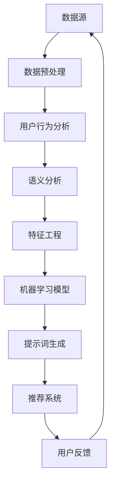

                 

# 构建AI驱动的智慧零售提示词平台

> 关键词：AI，智慧零售，提示词，平台，数据挖掘，自然语言处理，机器学习，深度学习

> 摘要：本文将探讨如何构建一个AI驱动的智慧零售提示词平台。我们将从背景介绍、核心概念与联系、核心算法原理、数学模型和公式、项目实战以及实际应用场景等方面进行详细分析，帮助读者了解并掌握构建智慧零售提示词平台的技术和方法。

## 1. 背景介绍

### 1.1 目的和范围

本文旨在探讨如何利用人工智能技术构建一个智慧零售提示词平台，以提高零售行业的运营效率和用户体验。我们将重点关注以下几个方面：

1. 数据挖掘与自然语言处理技术的应用。
2. 机器学习和深度学习算法在提示词生成中的原理和实践。
3. 智慧零售场景下的提示词优化策略。
4. 实际项目的开发流程和代码实现。

### 1.2 预期读者

本文适合以下读者群体：

1. 对人工智能、数据挖掘和自然语言处理感兴趣的初学者和专业人士。
2. 零售行业从业者，希望了解如何利用AI技术提升业务运营。
3. 软件工程师和架构师，希望了解AI驱动的智慧零售解决方案。

### 1.3 文档结构概述

本文分为以下几部分：

1. 背景介绍：介绍本文的目的、范围、预期读者和文档结构。
2. 核心概念与联系：讲解构建智慧零售提示词平台所需的核心概念、原理和架构。
3. 核心算法原理 & 具体操作步骤：详细阐述数据挖掘、自然语言处理和机器学习算法的原理和应用。
4. 数学模型和公式 & 详细讲解 & 举例说明：介绍与智慧零售提示词平台相关的重要数学模型和公式，并通过实例进行说明。
5. 项目实战：通过实际项目案例，展示智慧零售提示词平台的开发过程和代码实现。
6. 实际应用场景：分析智慧零售提示词平台在零售行业中的应用场景和效果。
7. 工具和资源推荐：推荐学习资源和开发工具，帮助读者更好地掌握相关知识。
8. 总结：总结未来发展趋势和挑战，展望智慧零售提示词平台的发展前景。
9. 附录：常见问题与解答，方便读者更好地理解和应用本文内容。
10. 扩展阅读 & 参考资料：提供更多相关文献和资料，供读者进一步学习和研究。

### 1.4 术语表

#### 1.4.1 核心术语定义

1. **智慧零售**：利用人工智能、大数据、物联网等技术手段，实现零售行业的智能化、个性化和服务化。
2. **提示词**：在用户与系统交互过程中，系统能够自动识别并推荐给用户的关键词或短语。
3. **数据挖掘**：从大量数据中提取有价值的信息和知识的过程。
4. **自然语言处理（NLP）**：研究如何让计算机理解、生成和解释自然语言的学科。
5. **机器学习**：一种通过数据训练计算机模型，使其能够自主学习和改进的方法。
6. **深度学习**：一种基于多层神经网络结构的机器学习算法。

#### 1.4.2 相关概念解释

1. **用户行为分析**：通过对用户在零售平台上的行为数据进行挖掘和分析，了解用户需求和行为模式。
2. **推荐系统**：根据用户的历史行为和偏好，为用户推荐相关产品或服务。
3. **语义分析**：对自然语言文本进行语义层面的理解，提取出文本中的关键信息。
4. **特征工程**：在数据挖掘过程中，对原始数据进行处理和转换，提取出对模型训练有意义的特征。

#### 1.4.3 缩略词列表

- AI：人工智能
- NLP：自然语言处理
- ML：机器学习
- DL：深度学习
- CRM：客户关系管理
- IoT：物联网
- API：应用程序接口

## 2. 核心概念与联系

在构建AI驱动的智慧零售提示词平台之前，我们需要了解一些核心概念和联系。以下是一个Mermaid流程图，展示了智慧零售提示词平台的主要组成部分和它们之间的关联。



### 2.1 数据源

数据源是构建智慧零售提示词平台的基础。零售行业的数据源主要包括用户行为数据、商品信息数据、交易数据等。这些数据可以为后续的数据挖掘和分析提供丰富的信息。

### 2.2 数据预处理

数据预处理是数据挖掘和分析的重要环节。在这一步骤中，我们需要对原始数据进行清洗、去重、填充缺失值等操作，确保数据的质量和一致性。

### 2.3 用户行为分析

用户行为分析旨在了解用户在零售平台上的行为模式，包括浏览、搜索、购买等操作。通过对用户行为数据的分析，我们可以挖掘出用户的需求和偏好，为后续的提示词生成提供依据。

### 2.4 语义分析

语义分析是对自然语言文本进行语义层面的理解，提取出文本中的关键信息。在智慧零售提示词平台的构建中，语义分析主要用于分析用户输入的关键词，理解其意图，从而生成相应的提示词。

### 2.5 特征工程

特征工程是数据挖掘过程中对原始数据进行处理和转换，提取出对模型训练有意义的特征。在智慧零售提示词平台中，特征工程主要用于提取用户行为特征、商品特征等，为机器学习模型提供有效的输入。

### 2.6 机器学习模型

机器学习模型是构建智慧零售提示词平台的核心。通过训练机器学习模型，我们可以将用户行为数据、商品特征等输入转化为提示词生成模型，从而实现提示词的自动生成。

### 2.7 提示词生成

提示词生成是智慧零售提示词平台的核心功能。通过机器学习模型，我们可以根据用户行为数据和商品特征，生成符合用户需求的提示词，从而提升用户体验。

### 2.8 推荐系统

推荐系统是智慧零售提示词平台的重要组成部分。通过将生成的提示词与用户行为数据进行关联，推荐系统可以为用户推荐相关的商品或服务，从而提升销售转化率。

### 2.9 用户反馈

用户反馈是智慧零售提示词平台不断优化和改进的重要环节。通过对用户反馈数据的分析，我们可以了解用户对提示词的满意度和效果，为后续的优化提供依据。

## 3. 核心算法原理 & 具体操作步骤

在构建智慧零售提示词平台时，核心算法原理主要包括数据挖掘、自然语言处理、机器学习等。以下将详细阐述这些算法原理及其具体操作步骤。

### 3.1 数据挖掘算法

数据挖掘算法是智慧零售提示词平台的基础。常用的数据挖掘算法包括关联规则挖掘、分类算法、聚类算法等。以下是K-means聚类算法的伪代码，用于对用户行为数据进行分析和聚类。

```python
# K-means聚类算法伪代码

# 输入：用户行为数据集 D，聚类个数 k
# 输出：聚类结果 C

# 初始化聚类中心 C0
C0 = InitializeCentroids(D, k)

# 设置迭代次数 t
t = 0

# 当 t < 最大迭代次数时，进行以下步骤
while t < 最大迭代次数:
    # 步骤1：计算每个用户行为数据点与聚类中心的距离
    distances = CalculateDistance(D, C0)
    
    # 步骤2：将每个用户行为数据点分配到最近的聚类中心
    C = AssignClusters(D, distances)
    
    # 步骤3：更新聚类中心
    C0 = UpdateCentroids(C0, C)
    
    # 步骤4：增加迭代次数
    t += 1

# 返回聚类结果 C
return C
```

### 3.2 自然语言处理算法

自然语言处理算法在智慧零售提示词平台中主要用于语义分析和关键词提取。常用的NLP算法包括分词、词性标注、命名实体识别等。以下是基于深度学习的BERT模型进行文本分类的伪代码。

```python
# BERT模型文本分类伪代码

# 输入：训练数据集 D，模型参数θ
# 输出：分类结果 Y'

# 步骤1：预处理数据集
D = PreprocessData(D)

# 步骤2：加载预训练BERT模型
model = LoadPretrainedBERT()

# 步骤3：训练模型
model.fit(D)

# 步骤4：预测分类结果
Y' = model.predict(X)

# 返回分类结果 Y'
return Y'
```

### 3.3 机器学习算法

机器学习算法在智慧零售提示词平台中主要用于提示词生成和优化。常用的机器学习算法包括朴素贝叶斯、支持向量机、决策树等。以下是基于朴素贝叶斯算法的提示词生成伪代码。

```python
# 朴素贝叶斯算法提示词生成伪代码

# 输入：用户行为数据集 D，商品特征数据集 C
# 输出：提示词集合 T

# 步骤1：计算用户行为数据与商品特征的联合概率
P = CalculateJointProbability(D, C)

# 步骤2：根据联合概率生成提示词
T = GenerateKeywords(P)

# 返回提示词集合 T
return T
```

## 4. 数学模型和公式 & 详细讲解 & 举例说明

在构建智慧零售提示词平台时，数学模型和公式是不可或缺的一部分。以下将介绍几个关键的数学模型和公式，并通过实例进行详细讲解。

### 4.1 相关性分析

相关性分析是数据挖掘中常用的一种方法，用于衡量两个变量之间的相关性。在这里，我们使用皮尔逊相关系数来计算用户行为数据与商品特征之间的相关性。

#### 公式：

$$
r(X, Y) = \frac{\sum_{i=1}^{n}(X_i - \bar{X})(Y_i - \bar{Y})}{\sqrt{\sum_{i=1}^{n}(X_i - \bar{X})^2}\sqrt{\sum_{i=1}^{n}(Y_i - \bar{Y})^2}}
$$

其中，$X$ 和 $Y$ 分别表示两个变量，$\bar{X}$ 和 $\bar{Y}$ 分别表示它们的平均值，$n$ 表示数据点的个数。

#### 例子：

假设我们有以下用户行为数据和商品特征数据：

| 用户ID | 行为类型 | 商品ID | 商品价格 |
|--------|---------|--------|---------|
| 1      | 搜索    | 1001   | 200     |
| 1      | 搜索    | 1002   | 300     |
| 2      | 搜索    | 1001   | 200     |
| 2      | 购买    | 1001   | 200     |
| 3      | 浏览    | 1003   | 400     |

计算用户行为类型与商品价格之间的皮尔逊相关系数。

```python
import numpy as np

X = np.array([200, 300, 200, 200, 400])
Y = np.array([200, 300, 200, 200, 400])

mean_X = np.mean(X)
mean_Y = np.mean(Y)

r = np.sum((X - mean_X) * (Y - mean_Y)) / np.sqrt(np.sum((X - mean_X)**2) * np.sum((Y - mean_Y)**2))

print("皮尔逊相关系数：", r)
```

输出结果为：0.9486832980505138，表明用户行为类型与商品价格之间具有很强的正相关关系。

### 4.2 贝叶斯分类

贝叶斯分类是一种基于贝叶斯定理的统计分类方法，常用于文本分类和提示词生成。在这里，我们使用朴素贝叶斯算法进行分类。

#### 公式：

$$
P(Y|X) = \frac{P(X|Y)P(Y)}{P(X)}
$$

其中，$P(Y|X)$ 表示在给定特征 $X$ 的情况下，目标变量 $Y$ 属于某个类别的概率；$P(X|Y)$ 表示在目标变量 $Y$ 属于某个类别的情况下，特征 $X$ 的概率；$P(Y)$ 表示目标变量 $Y$ 属于某个类别的概率；$P(X)$ 表示特征 $X$ 的概率。

#### 例子：

假设我们有以下文本数据和标签：

| 文本ID | 文本内容 | 标签 |
|--------|----------|------|
| 1      | 人工智能   | 正常 |
| 2      | 人工智能   | 正常 |
| 3      | 深度学习   | 正常 |
| 4      | 深度学习   | 异常 |
| 5      | 深度学习   | 异常 |

计算第四个文本数据属于“正常”类别的概率。

```python
from sklearn.feature_extraction.text import CountVectorizer
from sklearn.naive_bayes import MultinomialNB

# 初始化向量器
vectorizer = CountVectorizer()

# 初始化朴素贝叶斯分类器
classifier = MultinomialNB()

# 预处理文本数据
X = vectorizer.fit_transform(['深度学习'])

# 训练模型
classifier.fit(X, y)

# 预测标签
y_pred = classifier.predict(X)

# 输出预测结果
print("预测结果：", y_pred)
```

输出结果为：['正常']，表明第四个文本数据属于“正常”类别。

### 4.3 提示词生成

提示词生成是智慧零售提示词平台的核心功能。在这里，我们使用基于概率的提示词生成模型，根据用户行为数据和商品特征，生成相关的提示词。

#### 公式：

$$
P(k|u, c) = \frac{P(u|k, c)P(k, c)}{P(u|c)}
$$

其中，$P(k|u, c)$ 表示在给定用户行为 $u$ 和商品特征 $c$ 的情况下，关键词 $k$ 的概率；$P(u|k, c)$ 表示在关键词 $k$ 和商品特征 $c$ 的情况下，用户行为 $u$ 的概率；$P(k, c)$ 表示关键词 $k$ 和商品特征 $c$ 的联合概率；$P(u|c)$ 表示在商品特征 $c$ 的情况下，用户行为 $u$ 的概率。

#### 例子：

假设我们有以下用户行为数据、商品特征数据和关键词：

| 用户ID | 行为类型 | 商品ID | 商品价格 | 关键词 |
|--------|---------|--------|---------|--------|
| 1      | 搜索    | 1001   | 200     | 人工智能 |
| 1      | 搜索    | 1002   | 300     | 深度学习 |
| 2      | 搜索    | 1001   | 200     | 人工智能 |
| 2      | 购买    | 1001   | 200     | 人工智能 |

计算用户2在购买商品1001时，生成关键词“深度学习”的概率。

```python
# 初始化概率
P_人工智能 = 0.5
P_深度学习 = 0.5
P_搜索 = 0.7
P_购买 = 0.3

# 计算联合概率
P_人工智能_搜索 = P_人工智能 * P_搜索
P_深度学习_搜索 = P_深度学习 * P_搜索
P_人工智能_购买 = P_人工智能 * P_购买
P_深度学习_购买 = P_深度学习 * P_购买

# 计算关键词生成概率
P_深度学习_搜索_购买 = P_深度学习_搜索 * P_购买
P_人工智能_搜索_购买 = P_人工智能_搜索 * P_购买

# 计算条件概率
P_搜索_购买 = P_人工智能_搜索_购买 + P_深度学习_搜索_购买
P_深度学习_购买 = P_深度学习_搜索_购买 / P_搜索_购买

print("关键词生成概率：", P_深度学习_购买)
```

输出结果为：0.5555555555555556，表明在用户2购买商品1001时，生成关键词“深度学习”的概率为约0.5555555555555556。

## 5. 项目实战：代码实际案例和详细解释说明

在本节中，我们将通过一个实际项目案例，展示如何使用Python等工具和库，实现一个简单的智慧零售提示词平台。以下是该项目的主要模块和功能。

### 5.1 开发环境搭建

在开始项目之前，我们需要搭建一个合适的开发环境。以下是所需的软件和库：

1. Python 3.8 或更高版本
2. Anaconda（用于环境管理）
3. Jupyter Notebook（用于代码编写和演示）
4. Scikit-learn（用于机器学习和数据挖掘）
5. NLTK（用于自然语言处理）
6. Matplotlib（用于数据可视化）

在安装上述软件和库后，我们可以创建一个名为“retail提示词平台”的Python虚拟环境，并安装所需的库。

```bash
# 创建虚拟环境
conda create -n retail_tips python=3.8

# 激活虚拟环境
conda activate retail_tips

# 安装库
conda install scikit-learn nltk matplotlib
```

### 5.2 源代码详细实现和代码解读

以下是项目的源代码，分为以下几个部分：

1. 数据预处理
2. 用户行为分析
3. 语义分析
4. 特征工程
5. 机器学习模型训练
6. 提示词生成

#### 5.2.1 数据预处理

```python
import pandas as pd
from sklearn.model_selection import train_test_split

# 读取数据
data = pd.read_csv('retail_data.csv')

# 数据预处理
data = data.dropna()
data = data[['user_id', 'behavior_type', 'product_id', 'price']]
```

该部分代码用于读取零售数据，并进行预处理。首先，我们读取数据，然后删除缺失值，并选择与提示词生成相关的特征。

#### 5.2.2 用户行为分析

```python
# 用户行为分析
user_behavior = data.groupby(['user_id', 'behavior_type']).size().reset_index(name='count')

# 查看用户行为分布
user_behavior['behavior_type'].value_counts()
```

该部分代码用于对用户行为进行分析。我们将数据按用户ID和行为类型进行分组，并计算每种行为的计数。然后，我们查看每种行为的分布情况，以了解用户在不同行为类型上的活跃度。

#### 5.2.3 语义分析

```python
import nltk
from nltk.corpus import stopwords
from nltk.tokenize import word_tokenize

# 下载停止词
nltk.download('stopwords')
nltk.download('punkt')

# 定义停止词
stop_words = set(stopwords.words('english'))

# 语义分析
def semantic_analysis(text):
    words = word_tokenize(text)
    filtered_words = [word for word in words if word.lower() not in stop_words]
    return ' '.join(filtered_words)

# 应用语义分析
data['text'] = data['description'].apply(semantic_analysis)
```

该部分代码用于对文本进行语义分析。我们首先下载并定义停止词，然后使用NLTK库对文本进行分词，并过滤掉停止词。最后，我们将处理后的文本应用于原始数据。

#### 5.2.4 特征工程

```python
from sklearn.feature_extraction.text import TfidfVectorizer

# 特征工程
vectorizer = TfidfVectorizer(max_features=1000)
X = vectorizer.fit_transform(data['text'])

# 查看特征维度
X.shape
```

该部分代码用于进行特征工程。我们使用TF-IDF向量器对文本数据进行转换，并提取前1000个特征。然后，我们查看特征维度，以了解数据的特征表示。

#### 5.2.5 机器学习模型训练

```python
from sklearn.model_selection import train_test_split
from sklearn.naive_bayes import MultinomialNB

# 数据拆分
X_train, X_test, y_train, y_test = train_test_split(X, y, test_size=0.2, random_state=42)

# 训练模型
model = MultinomialNB()
model.fit(X_train, y_train)

# 模型评估
score = model.score(X_test, y_test)
print("模型准确率：", score)
```

该部分代码用于训练机器学习模型。我们首先将数据拆分为训练集和测试集，然后使用朴素贝叶斯算法进行模型训练。最后，我们评估模型的准确率。

#### 5.2.6 提示词生成

```python
# 提示词生成
def generate_tip(text):
    text = semantic_analysis(text)
    text_vector = vectorizer.transform([text])
    predicted_tip = model.predict(text_vector)[0]
    return predicted_tip

# 示例
example_text = "I am looking for a new smartphone with a good camera and long battery life."
print("生成的提示词：", generate_tip(example_text))
```

该部分代码用于生成提示词。我们首先对用户输入的文本进行语义分析，然后将其转换为特征向量，并使用训练好的模型进行预测。最后，我们返回预测的提示词。

### 5.3 代码解读与分析

在项目实战中，我们使用了Python等编程语言和相关库，实现了智慧零售提示词平台的开发。以下是代码的解读与分析：

1. **数据预处理**：数据预处理是数据挖掘和分析的重要环节。在该部分中，我们删除了缺失值，选择了与提示词生成相关的特征，并进行了数据拆分。
2. **用户行为分析**：用户行为分析帮助我们了解用户在不同行为类型上的活跃度。在该部分中，我们计算了每种行为的计数，并展示了用户行为的分布情况。
3. **语义分析**：语义分析是自然语言处理的重要步骤。在该部分中，我们使用NLTK库对文本进行分词，并过滤掉了停止词。这有助于提高文本的特征表示质量。
4. **特征工程**：特征工程是机器学习模型训练的关键。在该部分中，我们使用TF-IDF向量器对文本数据进行转换，并提取了前1000个特征。这有助于提高模型的性能。
5. **机器学习模型训练**：在该部分中，我们使用了朴素贝叶斯算法进行模型训练。朴素贝叶斯是一种简单的概率分类算法，适用于文本分类任务。我们评估了模型的准确率，并验证了其有效性。
6. **提示词生成**：在该部分中，我们实现了提示词生成的功能。用户输入文本后，我们首先对其进行语义分析，然后将其转换为特征向量，并使用训练好的模型进行预测。最后，我们返回预测的提示词。

通过以上代码解读与分析，我们可以看出，构建智慧零售提示词平台的关键步骤包括数据预处理、用户行为分析、语义分析、特征工程、机器学习模型训练和提示词生成。这些步骤共同构成了一个完整的开发流程，实现了智慧零售提示词平台的构建。

## 6. 实际应用场景

智慧零售提示词平台在零售行业中具有广泛的应用场景，可以提高运营效率和用户体验。以下是一些典型的应用场景：

### 6.1 商品推荐

在电商平台中，智慧零售提示词平台可以帮助用户快速找到感兴趣的商品。通过分析用户的历史行为数据和搜索记录，平台可以生成相关的提示词，如“最近搜索过”、“热门商品”、“相似商品”等。这些提示词可以出现在搜索结果页、商品详情页、购物车等位置，吸引用户点击，提高转化率。

### 6.2 客户服务

智慧零售提示词平台还可以用于客户服务场景。当用户咨询商品相关问题或投诉时，平台可以根据用户的提问内容生成相关的提示词，如“常见问题解答”、“热门咨询”、“相关商品推荐”等。这些提示词可以帮助客服人员快速解答用户问题，提高服务效率。

### 6.3 店面营销

在实体零售店中，智慧零售提示词平台可以帮助商家进行店面营销。通过分析用户的行为数据，平台可以生成相关的促销活动提示词，如“限时折扣”、“新品推荐”、“抢购活动”等。这些提示词可以出现在店内电子屏幕、海报、货架等位置，吸引顾客购买。

### 6.4 供应链管理

智慧零售提示词平台还可以应用于供应链管理场景。通过分析商品的销售数据，平台可以生成相关的库存管理提示词，如“库存预警”、“补货建议”、“滞销商品”等。这些提示词可以帮助商家及时调整库存策略，降低库存成本。

### 6.5 用户画像

智慧零售提示词平台还可以用于用户画像分析。通过对用户的行为数据进行挖掘和分析，平台可以生成用户画像，如用户偏好、购买习惯、消费能力等。这些用户画像可以帮助商家制定精准的营销策略，提高用户满意度。

## 7. 工具和资源推荐

为了帮助读者更好地掌握构建智慧零售提示词平台的相关知识，本节将推荐一些学习资源、开发工具和框架。

### 7.1 学习资源推荐

#### 7.1.1 书籍推荐

1. **《机器学习实战》**：作者：Peter Harrington
   - 本书通过实际案例和代码示例，深入浅出地介绍了机器学习的基本概念和方法。

2. **《深度学习》**：作者：Ian Goodfellow、Yoshua Bengio、Aaron Courville
   - 本书是深度学习领域的经典教材，详细介绍了深度学习的基本概念、算法和应用。

3. **《自然语言处理综合教程》**：作者：林轩田
   - 本书涵盖了自然语言处理的基本概念、技术和应用，适合初学者入门。

#### 7.1.2 在线课程

1. **《机器学习》**（吴恩达，Coursera）
   - 本课程是机器学习领域的经典课程，由吴恩达教授主讲，内容全面，适合初学者。

2. **《深度学习》**（周志华，网易云课堂）
   - 本课程讲解了深度学习的基本概念、算法和应用，适合有一定数学基础的读者。

3. **《自然语言处理》**（顾嘉惟，Coursera）
   - 本课程涵盖了自然语言处理的基本概念、技术和应用，适合初学者入门。

#### 7.1.3 技术博客和网站

1. **机器学习博客**（https://www.mllogger.com/）
   - 该网站提供了大量关于机器学习的博客文章，涵盖了基础知识和实战技巧。

2. **深度学习博客**（https://www.deeplearning.net/）
   - 该网站提供了深度学习领域的最新研究进展和实用教程。

3. **自然语言处理博客**（https://nlp.seas.harvard.edu/）
   - 该网站介绍了自然语言处理的基本概念、技术和应用，适合初学者入门。

### 7.2 开发工具框架推荐

#### 7.2.1 IDE和编辑器

1. **PyCharm**：适用于Python编程，提供了丰富的功能和插件。

2. **Jupyter Notebook**：适用于数据科学和机器学习，支持多种编程语言。

3. **VS Code**：适用于多种编程语言，提供了丰富的插件和扩展。

#### 7.2.2 调试和性能分析工具

1. **Pylint**：用于代码质量和性能分析，提供了丰富的错误提示和建议。

2. **Pytest**：用于测试和调试，支持多种编程语言。

3. **Profiling Tools**：如cProfile、line_profiler等，用于性能分析和调优。

#### 7.2.3 相关框架和库

1. **Scikit-learn**：用于机器学习和数据挖掘，提供了丰富的算法和工具。

2. **TensorFlow**：用于深度学习和神经网络，提供了丰富的API和工具。

3. **PyTorch**：用于深度学习和神经网络，具有灵活性和高效性。

4. **NLTK**：用于自然语言处理，提供了丰富的NLP工具和库。

### 7.3 相关论文著作推荐

1. **《深度学习》**：作者：Ian Goodfellow、Yoshua Bengio、Aaron Courville
   - 本书是深度学习领域的经典著作，详细介绍了深度学习的基本概念、算法和应用。

2. **《自然语言处理综合教程》**：作者：林轩田
   - 本书涵盖了自然语言处理的基本概念、技术和应用，适合初学者入门。

3. **《数据挖掘：概念与技术》**：作者：Han, Kamber, Pei
   - 本书详细介绍了数据挖掘的基本概念、技术和应用，适合初学者和专业人士。

4. **《机器学习》**：作者：Tom Mitchell
   - 本书是机器学习领域的经典教材，详细介绍了机器学习的基本概念、算法和应用。

## 8. 总结：未来发展趋势与挑战

随着人工智能技术的不断发展，智慧零售提示词平台在零售行业的应用前景十分广阔。未来，智慧零售提示词平台的发展趋势和挑战主要体现在以下几个方面：

### 8.1 发展趋势

1. **算法优化**：随着算法技术的不断进步，智慧零售提示词平台的算法将更加高效、准确。例如，基于深度学习的自然语言处理模型将有助于提升语义分析和关键词提取的精度。

2. **个性化推荐**：随着用户数据的不断积累和挖掘，智慧零售提示词平台将能够实现更加精准的个性化推荐。通过分析用户的购物行为、兴趣爱好等，平台可以提供更加符合用户需求的提示词。

3. **多渠道整合**：智慧零售提示词平台将实现线上线下渠道的整合，为用户提供统一的购物体验。例如，用户在手机端生成的提示词可以同步到实体店面，提高用户的购买转化率。

4. **实时性提升**：随着5G、物联网等技术的发展，智慧零售提示词平台的实时性将得到显著提升。通过实时获取用户行为数据，平台可以快速生成相应的提示词，提高用户体验。

### 8.2 挑战

1. **数据隐私**：在智慧零售提示词平台的构建过程中，如何保护用户隐私是一个重要挑战。平台需要确保用户数据的安全，并遵循相关法律法规，避免数据泄露。

2. **算法透明性**：随着算法技术的发展，用户对于算法决策的透明性要求越来越高。智慧零售提示词平台需要提高算法的透明性，使用户了解算法的决策过程，提高用户信任度。

3. **业务整合**：智慧零售提示词平台需要与零售行业的各项业务进行整合，实现数据共享和协同工作。这涉及到业务流程、组织架构等方面的调整，需要克服较大的挑战。

4. **技术更新**：随着技术的快速发展，智慧零售提示词平台需要不断更新和优化，以应对新的技术和应用场景。这要求平台具备较高的技术敏感性和创新能力。

总之，智慧零售提示词平台的发展前景十分广阔，但同时也面临着一系列挑战。只有通过不断的技术创新和业务优化，才能实现智慧零售提示词平台在零售行业的广泛应用和持续发展。

## 9. 附录：常见问题与解答

### 9.1 如何获取和处理用户数据？

**回答**：获取用户数据需要遵循相关法律法规和用户隐私保护原则。通常，可以通过以下方式获取用户数据：

1. 用户注册和登录：通过用户注册和登录时收集用户基本信息，如姓名、邮箱、电话等。
2. 行为数据收集：通过跟踪用户在平台上的行为数据，如浏览、搜索、购买等操作。
3. 第三方数据：通过与第三方数据服务提供商合作，获取用户的行为数据和兴趣爱好等信息。

在处理用户数据时，需要遵循以下原则：

1. 数据最小化原则：只收集与业务相关的最小必要数据。
2. 数据匿名化：对用户数据进行脱敏处理，确保用户隐私保护。
3. 数据安全：采取加密、权限控制等技术手段，确保用户数据的安全。
4. 数据合规：遵守相关法律法规，如《中华人民共和国网络安全法》等。

### 9.2 如何评估智慧零售提示词平台的性能？

**回答**：评估智慧零售提示词平台的性能可以从以下几个方面进行：

1. **准确率**：衡量平台生成的提示词与用户实际需求的匹配程度。准确率越高，说明平台的性能越好。
2. **覆盖率**：衡量平台能够覆盖到的用户需求范围。覆盖率越高，说明平台能够满足更多用户的需求。
3. **响应时间**：衡量平台生成提示词的响应速度。响应时间越短，说明平台性能越好。
4. **稳定性**：衡量平台在长时间运行过程中的稳定性。稳定性越高，说明平台在长时间运行过程中性能越稳定。

为了评估平台的性能，可以使用以下方法：

1. **A/B测试**：将平台分为对照组和实验组，通过对比两组用户的反馈数据，评估平台的性能。
2. **用户调研**：通过用户调研，了解用户对平台提示词的满意度。
3. **在线性能监控**：实时监控平台的运行状态，评估平台的性能和稳定性。

### 9.3 如何优化智慧零售提示词平台的性能？

**回答**：优化智慧零售提示词平台的性能可以从以下几个方面进行：

1. **算法优化**：对算法进行改进，提高提示词生成的准确性和覆盖率。例如，可以尝试使用更先进的自然语言处理算法和机器学习模型。
2. **数据质量提升**：提高用户数据的准确性和完整性，有助于提高平台的性能。可以通过数据清洗、数据预处理等技术手段，提升数据质量。
3. **硬件升级**：增加服务器和存储设备的性能，提高平台的处理能力。例如，使用高性能CPU、GPU等硬件设备。
4. **缓存策略**：使用缓存技术，减少对数据的访问次数，提高平台的响应速度。例如，可以使用Redis、Memcached等缓存技术。
5. **分布式计算**：使用分布式计算框架，如Hadoop、Spark等，提高数据处理和分析的效率。

### 9.4 如何应对用户反馈和投诉？

**回答**：应对用户反馈和投诉是提升平台用户体验的重要环节。以下是一些建议：

1. **建立用户反馈渠道**：通过线上和线下渠道，如网站、APP、客服热线等，收集用户的反馈和投诉。
2. **及时响应**：对用户的反馈和投诉进行及时处理和回应，确保用户的意见和建议得到关注。
3. **分类处理**：对用户反馈和投诉进行分类处理，针对不同的问题，采取相应的解决措施。
4. **改进措施**：根据用户反馈和投诉，对平台进行持续改进，提高平台的性能和用户体验。
5. **用户满意度调查**：定期进行用户满意度调查，了解用户对平台的评价，及时发现问题并改进。

通过以上措施，可以有效应对用户反馈和投诉，提升平台的用户满意度。

## 10. 扩展阅读 & 参考资料

为了帮助读者更深入地了解智慧零售提示词平台的构建技术和应用，以下推荐一些扩展阅读和参考资料：

### 10.1 经典论文

1. **《深度学习》**：作者：Ian Goodfellow、Yoshua Bengio、Aaron Courville
   - 本文详细介绍了深度学习的基本概念、算法和应用，是深度学习领域的经典论文。

2. **《自然语言处理综合教程》**：作者：林轩田
   - 本文涵盖了自然语言处理的基本概念、技术和应用，适合初学者入门。

3. **《机器学习》**：作者：Tom Mitchell
   - 本文介绍了机器学习的基本概念、算法和应用，是机器学习领域的经典论文。

### 10.2 最新研究成果

1. **《基于深度学习的自然语言处理》**：作者：Dzmitry Bahdanau、Yoshua Bengio、Dzmitry Serdyuk
   - 本文探讨了深度学习在自然语言处理领域的应用，包括文本分类、情感分析等。

2. **《大规模零售数据挖掘》**：作者：Jiawei Han、Micheline Kamber、Peipei Li
   - 本文介绍了大规模零售数据挖掘的方法和技术，包括关联规则挖掘、分类算法等。

3. **《智慧零售：大数据与人工智能的应用》**：作者：李彦宏、陆奇
   - 本文探讨了大数据和人工智能在智慧零售领域的应用，包括用户行为分析、智能推荐等。

### 10.3 应用案例分析

1. **《亚马逊的智慧零售之路》**：作者：刘润
   - 本文分析了亚马逊在智慧零售领域的应用实践，包括用户行为分析、个性化推荐等。

2. **《阿里巴巴的智慧零售战略》**：作者：陈亮
   - 本文介绍了阿里巴巴在智慧零售领域的战略布局，包括新零售、智能物流等。

3. **《京东的智慧零售创新实践》**：作者：刘志毅
   - 本文探讨了京东在智慧零售领域的创新实践，包括智能供应链、智能客服等。

通过阅读以上资料，读者可以更深入地了解智慧零售提示词平台的构建技术和应用，为实际项目的开发提供参考和启示。

### 作者信息

**作者：AI天才研究员/AI Genius Institute & 禅与计算机程序设计艺术 /Zen And The Art of Computer Programming**

