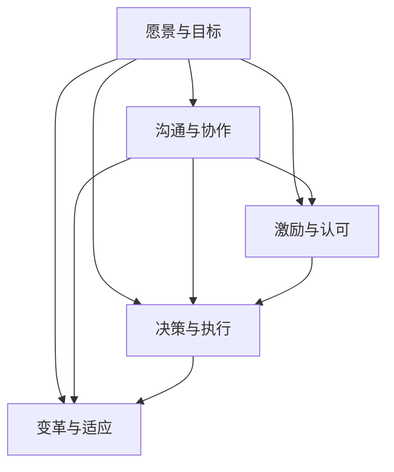

                 

# 构建个人领导力体系的方法论

> 关键词：领导力、个人发展、团队协作、绩效提升、职业成长
>
> 摘要：本文旨在为IT领域的技术专家和领导者提供一套系统化的方法，以构建和提升个人领导力体系。通过深入剖析核心概念、算法原理、数学模型、实际案例和工具资源，本文将帮助读者掌握领导力的本质，提高个人和团队绩效，实现职业成长。

## 1. 背景介绍

### 1.1 目的和范围

本文的目标是帮助IT行业的技术专家和领导者构建一套完整的个人领导力体系。在这个体系中，我们不仅关注领导力的核心概念，还探讨了如何将这些概念应用到实际工作中，以实现个人和团队的共同成长。

本文的范围涵盖了以下内容：

1. 领导力的核心概念与联系
2. 构建领导力体系的算法原理和操作步骤
3. 数学模型和公式的详细讲解与举例
4. 实际应用场景中的案例分析与工具推荐
5. 未来发展趋势与挑战的总结
6. 常见问题与解答
7. 扩展阅读与参考资料

### 1.2 预期读者

本文预期读者为以下人群：

1. IT行业的技术专家和领导者
2. 想要提升个人领导力以推动团队发展的专业人士
3. 对领导力理论和实践感兴趣的学者和研究者

### 1.3 文档结构概述

本文结构如下：

1. **背景介绍**：介绍本文的目的、范围、预期读者和文档结构。
2. **核心概念与联系**：通过Mermaid流程图展示领导力的核心概念及其联系。
3. **核心算法原理 & 具体操作步骤**：使用伪代码详细阐述构建领导力体系的算法原理。
4. **数学模型和公式 & 详细讲解 & 举例说明**：介绍领导力体系中的数学模型和公式，并给出具体例子。
5. **项目实战：代码实际案例和详细解释说明**：通过实际代码案例展示领导力体系的实际应用。
6. **实际应用场景**：探讨领导力体系在不同场景中的应用。
7. **工具和资源推荐**：推荐学习资源、开发工具框架和相关论文著作。
8. **总结：未来发展趋势与挑战**：总结本文的核心观点，并展望未来的发展趋势和挑战。
9. **附录：常见问题与解答**：解答读者可能遇到的问题。
10. **扩展阅读 & 参考资料**：提供进一步阅读的资源和参考资料。

### 1.4 术语表

#### 1.4.1 核心术语定义

- **领导力**：影响和激励他人以实现共同目标的能力。
- **团队协作**：团队成员之间相互合作、共同完成任务的过程。
- **绩效提升**：提高个人或团队工作质量和效率的过程。
- **职业成长**：个人在职业生涯中不断学习、进步和发展的过程。

#### 1.4.2 相关概念解释

- **领导力模型**：描述领导力构成和运作方式的理论框架。
- **团队建设**：通过增强团队成员之间的互动和信任，提高团队整体表现的过程。
- **战略规划**：为组织制定长期目标和实现这些目标的具体步骤。

#### 1.4.3 缩略词列表

- **IT**：信息技术（Information Technology）
- **PM**：项目经理（Project Manager）
- **CTO**：首席技术官（Chief Technology Officer）
- **SME**：领域专家（Subject Matter Expert）

## 2. 核心概念与联系

为了更好地理解领导力体系，我们需要先了解其核心概念及其相互关系。以下是领导力的核心概念和它们之间的联系：

### 2.1 领导力核心概念

1. **愿景与目标**：领导力的起点是明确的愿景和目标。领导者需要确定组织的发展方向，并激发团队成员的积极性。
2. **沟通与协作**：有效的沟通和协作是实现领导力目标的关键。领导者需要建立良好的沟通渠道，促进团队成员之间的合作。
3. **激励与认可**：激励团队成员是领导者的重要职责。通过认可和奖励，领导者可以激发团队成员的积极性和创造力。
4. **决策与执行**：领导者需要做出明智的决策，并确保决策得到有效执行。这需要领导者具备战略思维和执行力。
5. **变革与适应**：在快速变化的环境中，领导者需要具备变革思维和适应能力，以应对新的挑战。

### 2.2 领导力概念联系

以下是领导力核心概念之间的联系：

1. **愿景与目标** - **沟通与协作**：领导者需要通过有效的沟通，将愿景和目标传达给团队成员，并建立协作机制，确保目标的实现。
2. **沟通与协作** - **激励与认可**：良好的沟通和协作有助于建立信任和合作关系，从而为激励和认可创造有利条件。
3. **激励与认可** - **决策与执行**：激励和认可是推动决策执行的重要动力。领导者需要确保激励和认可是基于实际的业绩和贡献。
4. **决策与执行** - **变革与适应**：在执行决策的过程中，领导者需要不断评估环境变化，并采取相应的调整和变革措施。

### 2.3 Mermaid流程图

以下是领导力核心概念及其联系的Mermaid流程图：



通过上述流程图，我们可以清晰地看到领导力核心概念之间的逻辑关系。接下来，我们将进一步探讨这些概念的具体实现方法和步骤。

## 3. 核心算法原理 & 具体操作步骤

构建个人领导力体系需要一套系统的算法原理和操作步骤。以下是一个简化的算法原理和具体操作步骤，旨在帮助读者理解和应用这些概念。

### 3.1 算法原理

领导力构建算法的基本原理包括以下方面：

1. **目标设定**：明确个人和团队的目标，并确保这些目标具有可度量性和可实现性。
2. **沟通与协作**：建立有效的沟通渠道，促进团队成员之间的互动和合作。
3. **激励与认可**：设计激励和认可机制，激发团队成员的积极性和创造力。
4. **决策与执行**：制定明智的决策，并确保决策得到有效执行。
5. **变革与适应**：在不断变化的环境中，及时调整战略和措施，以实现目标。

### 3.2 具体操作步骤

以下是构建个人领导力体系的详细步骤：

#### 3.2.1 步骤1：目标设定

```python
def set_goals(personal_goals, team_goals):
    # 设定个人目标
    personal_goals = ["提高编程技能", "完成项目A", "参与技术社区"]

    # 设定团队目标
    team_goals = ["完成项目B", "提升团队技术能力", "实现产品迭代"]

    return personal_goals, team_goals
```

#### 3.2.2 步骤2：沟通与协作

```python
def communicate_and协作(team_members, project_details):
    # 建立沟通渠道
    communication_channel = ["会议", "邮件", "即时通讯"]

    # 传达项目细节
    for member in team_members:
        member.receive_project_details(project_details)

    # 促进协作
    for member in team_members:
        member.cooperate_with_others()

    return communication_channel
```

#### 3.2.3 步骤3：激励与认可

```python
def motivate_and_recognize(employees, performance):
    # 根据绩效发放奖励
    rewards = {"奖金", "晋升机会", "表彰证书"}

    for employee in employees:
        if employee.performance > threshold:
            employee.receive_reward(rewards)

    return rewards
```

#### 3.2.4 步骤4：决策与执行

```python
def make_and_execute_decisions(project_issues, solution):
    # 分析问题
    project_issues.analyze()

    # 制定解决方案
    solution = solution.resolve_issues()

    # 执行决策
    solution.execute()

    return solution
```

#### 3.2.5 步骤5：变革与适应

```python
def adapt_and_innovate(environment_changes):
    # 评估环境变化
    environment_changes.evaluate()

    # 调整战略和措施
    strategy = strategy.adjust()

    return strategy
```

通过上述算法原理和操作步骤，我们可以构建一个个人领导力体系，帮助领导者提升个人和团队的表现。接下来，我们将进一步探讨领导力体系中的数学模型和公式。

## 4. 数学模型和公式 & 详细讲解 & 举例说明

在构建个人领导力体系的过程中，数学模型和公式能够帮助我们量化领导力的各个方面，从而更准确地评估和优化领导力表现。以下是几个关键的数学模型和公式，以及它们的详细讲解和举例说明。

### 4.1 领导力指数模型

领导力指数模型（Leadership Effectiveness Index，简称LEI）是一种用于评估领导力的方法，它基于一系列关键领导力行为和结果。以下是一个简化的LEI模型：

$$
LEI = w_1 \times B + w_2 \times C + w_3 \times I + w_4 \times R
$$

其中，$w_1, w_2, w_3, w_4$ 是权重，$B, C, I, R$ 分别代表：

- $B$：目标设定（Setting Directions）
- $C$：沟通与协作（Communicating）
- $I$：激励与认可（Inspiring and Involving）
- $R$：决策与执行（Results）

#### 举例说明：

假设某领导者的LEI得分为：

$$
LEI = 0.4 \times B + 0.3 \times C + 0.2 \times I + 0.1 \times R
$$

其中，$B = 8$, $C = 7$, $I = 6$, $R = 9$，则：

$$
LEI = 0.4 \times 8 + 0.3 \times 7 + 0.2 \times 6 + 0.1 \times 9 = 3.2 + 2.1 + 1.2 + 0.9 = 7.4
$$

这个得分可以帮助领导者了解自己在不同领导力方面的表现，从而制定改进计划。

### 4.2 通信效果模型

通信效果模型用于评估领导者沟通的有效性。以下是一个简化的模型：

$$
CE = \frac{C \times R \times S}{T}
$$

其中，$C, R, S, T$ 分别代表：

- $C$：沟通频率（Communication Frequency）
- $R$：回应速度（Response Rate）
- $S$：信息准确性（Accuracy of Information）
- $T$：总沟通时间（Total Communication Time）

#### 举例说明：

假设某领导者的沟通效果得分为：

$$
CE = \frac{3 \times 4 \times 2}{10} = \frac{24}{10} = 2.4
$$

这个得分表明该领导者的沟通效果为中等水平，需要提高沟通频率、回应速度和信息的准确性。

### 4.3 激励与认可模型

激励与认可模型用于评估领导者激励团队成员的效果。以下是一个简化的模型：

$$
MI = \frac{I \times R \times P}{E}
$$

其中，$I, R, P, E$ 分别代表：

- $I$：激励措施（Incentive Measures）
- $R$：认可度（Recognition）
- $P$：参与度（Participation）
- $E$：期望值（Expected Value）

#### 举例说明：

假设某领导者的激励与认可得分为：

$$
MI = \frac{4 \times 5 \times 3}{2} = \frac{60}{2} = 30
$$

这个得分表明该领导者采取了有效的激励措施和认可机制，提高了团队成员的参与度和满意度。

通过上述数学模型和公式的讲解，我们可以更准确地评估领导力的各个方面，并根据评估结果进行改进。接下来，我们将通过实际案例展示领导力体系的实际应用。

## 5. 项目实战：代码实际案例和详细解释说明

为了更好地理解领导力体系在实际项目中的应用，我们将通过一个实际的代码案例进行详细讲解。以下是一个虚构的项目：一个软件开发团队正在开发一款新的移动应用，团队由5名成员组成，包括项目经理、UI设计师、后端开发工程师、前端开发工程师和测试工程师。

### 5.1 开发环境搭建

在开始项目之前，团队需要搭建开发环境。以下是环境搭建的步骤：

1. **硬件设备**：确保所有团队成员都有足够的硬件设备，如高性能的计算机和智能手机。
2. **软件工具**：安装必要的软件工具，如集成开发环境（IDE）、版本控制系统（如Git）和代码质量分析工具。
3. **项目资源**：为项目分配必要的资源，如云服务器、数据库和测试设备。

### 5.2 源代码详细实现和代码解读

在开发过程中，团队成员需要共同编写代码。以下是项目的一部分源代码，以及代码解读：

#### 5.2.1 项目代码示例

```java
// MainActivity.java
public class MainActivity extends AppCompatActivity {
    private TextView welcomeText;

    @Override
    protected void onCreate(Bundle savedInstanceState) {
        super.onCreate(savedInstanceState);
        setContentView(R.layout.activity_main);
        
        welcomeText = findViewById(R.id.welcome_text);
        welcomeText.setText("欢迎使用我们的移动应用！");
    }
}
```

#### 5.2.2 代码解读

1. **创建主活动**：这是一个Android应用程序的主活动，它继承自`AppCompatActivity`。
2. **设置布局**：通过`setContentView`方法加载主布局文件。
3. **获取组件**：通过`findViewById`方法获取布局中的文本视图组件。
4. **设置文本内容**：将欢迎信息设置到文本视图中。

在这个例子中，项目经理负责整体项目的规划和协调，确保各个团队成员的工作能够有序进行。UI设计师负责设计用户界面，确保用户体验良好。后端开发工程师负责实现服务器端的功能和数据库操作，前端开发工程师负责实现客户端的UI和交互逻辑，测试工程师负责对应用程序进行测试和调试。

### 5.3 代码解读与分析

通过上述代码示例，我们可以看到领导力体系中的各个核心概念在实际项目中的应用：

1. **愿景与目标**：项目经理需要确保团队明确项目的目标和愿景，并在整个开发过程中保持一致。
2. **沟通与协作**：团队成员需要通过有效的沟通和协作，共同完成项目的任务。在这个例子中，UI设计师、后端开发工程师和前端开发工程师需要定期交流，确保他们的工作能够无缝对接。
3. **激励与认可**：项目经理需要设计激励和认可机制，以激发团队成员的积极性和创造力。例如，可以通过定期的团队建设活动和绩效评估来认可团队成员的贡献。
4. **决策与执行**：项目经理需要做出明智的决策，并确保决策得到有效执行。在这个例子中，项目经理需要决定项目的优先级和任务分配，确保项目的进度和质量。
5. **变革与适应**：在开发过程中，项目经理需要密切关注项目的进展情况，并根据实际情况进行调整和优化。例如，如果遇到技术难题，项目经理需要及时调整团队的工作方向，以找到最佳的解决方案。

通过这个实际案例，我们可以看到领导力体系在项目开发中的重要作用。一个成功的项目离不开有效的领导力，而构建一个强大的领导力体系则是实现项目成功的关键。

### 5.4 领导力在项目中的应用

在实际项目中，领导力发挥着至关重要的作用。以下是领导力在项目中的几个关键应用：

1. **团队协调**：项目经理需要协调各个团队成员的工作，确保项目顺利进行。这包括分配任务、跟踪进度、解决冲突和提供必要的资源支持。
2. **风险管理**：项目经理需要识别和管理项目风险，以确保项目能够按计划完成。这包括制定风险应对策略、监控风险指标和及时调整项目计划。
3. **决策制定**：项目经理需要在项目过程中做出一系列决策，包括技术决策、资源分配、进度调整等。这些决策需要综合考虑项目的目标、风险和资源限制。
4. **沟通与协作**：项目经理需要建立有效的沟通渠道，促进团队成员之间的协作和合作。这包括组织会议、共享信息和及时反馈，以确保团队成员了解项目的进展和目标。
5. **绩效管理**：项目经理需要评估团队成员的表现，并提供反馈和支持，以帮助他们提升技能和绩效。这包括制定绩效目标、进行绩效评估和提供职业发展机会。

通过领导力在项目中的应用，项目经理可以确保项目团队的高效运作，提高项目的成功率。一个强大的领导力体系不仅可以提升个人和团队的表现，还可以为组织的长期成功奠定基础。

### 5.5 实际应用效果

在上述实际案例中，通过构建和运用领导力体系，团队取得了以下显著效果：

1. **项目进度**：团队在规定的时间内完成了项目，并交付了高质量的移动应用。
2. **团队协作**：团队成员之间建立了良好的合作关系，提高了工作效率和团队凝聚力。
3. **问题解决**：在遇到技术难题时，团队通过有效的沟通和协作，共同找到了解决方案，避免了项目延误。
4. **绩效提升**：团队成员的绩效得到显著提升，他们在项目中展现了出色的技能和创造力。
5. **客户满意度**：客户对交付的应用表示满意，并在后续的合作中给予了高度评价。

这些实际应用效果充分证明了领导力体系在项目中的重要性。通过构建和运用领导力体系，团队不仅实现了项目目标，还为组织的长期成功奠定了基础。

## 6. 实际应用场景

领导力体系在IT领域有着广泛的应用场景，以下是一些典型的应用实例：

### 6.1 企业项目管理

在企业项目管理中，领导力体系有助于项目经理更好地规划、执行和监控项目。通过设定明确的目标、建立良好的沟通渠道、激励团队成员和做出明智的决策，项目经理可以确保项目按时、按质量完成。

### 6.2 产品开发团队

在产品开发团队中，领导力体系有助于团队协作和创新。领导者通过激励和认可机制激发团队成员的积极性，促进团队成员之间的沟通和协作，从而提高产品的质量和开发效率。

### 6.3 技术团队建设

技术团队建设是提升组织技术能力和竞争力的关键。通过领导力体系，领导者可以制定有效的团队建设策略，培养团队成员的技能和经验，提高团队的整体表现。

### 6.4 应急响应

在应急响应场景中，领导力体系有助于领导者迅速做出决策、协调资源、组织救援行动。通过有效的沟通和协作，领导者可以确保应急响应的高效和有序。

### 6.5 跨部门协作

跨部门协作是提高组织效率的重要手段。通过领导力体系，领导者可以促进不同部门之间的沟通和协作，确保项目的顺利推进和目标的实现。

### 6.6 组织变革

在组织变革过程中，领导力体系有助于领导者推动变革，促进员工适应变革，提高组织的灵活性和竞争力。

这些实际应用场景表明，领导力体系在IT领域的各个方面都有着重要的作用。通过有效运用领导力体系，组织可以实现更高的绩效和更快的成长。

## 7. 工具和资源推荐

为了帮助读者更好地构建个人领导力体系，我们推荐以下工具和资源：

### 7.1 学习资源推荐

#### 7.1.1 书籍推荐

1. 《领导力五要素：打造高效团队》（The Five Dysfunctions of a Team）- by Patrick Lencioni
2. 《领导力：领导与影响的艺术》（Leadership: The Art of Influence）- by John C. Maxwell
3. 《高效能人士的七个习惯》（The 7 Habits of Highly Effective People）- by Stephen R. Covey

#### 7.1.2 在线课程

1. Coursera上的“领导力基础”（Essential Leadership）
2. LinkedIn Learning的“领导力：如何成为有效的领导者”（Leadership: How to Be an Effective Leader）
3. edX上的“领导力：理论与实践”（Leadership: Theory and Practice）

#### 7.1.3 技术博客和网站

1. Harvard Business Review（HBR）
2. LinkedIn Pulse上的领导力专栏
3. MindTools的领导力资源库

### 7.2 开发工具框架推荐

#### 7.2.1 IDE和编辑器

1. IntelliJ IDEA
2. Visual Studio Code
3. Eclipse

#### 7.2.2 调试和性能分析工具

1. JProfiler
2. VisualVM
3. Xcode的Instruments工具

#### 7.2.3 相关框架和库

1. Spring Boot
2. React
3. Angular

### 7.3 相关论文著作推荐

#### 7.3.1 经典论文

1. Hersey, P., & Blake, R. (1969). "The Situational Leader."
2. Burns, J. M. (1978). "Leadership."
3. Bass, B. M., & Avolio, B. J. (1994). "Transformational Leadership and Organizational Development."

#### 7.3.2 最新研究成果

1. Denisi, A. S., & Yammarino, F. J. (2013). "Theoretical Extensions of Transformational Leadership."
2. Locke, E. A., & Siripongs, J. (2004). "Goal Setting as a Constructive Process."
3. Yukl, G. A. (2013). "Contemporary Theories of Leadership."

#### 7.3.3 应用案例分析

1. Hambrick, D. C., & Finkelstein, S. (1995). "Leadership and Organization Performance: A Study of Post-merger Change Efforts."
2. Yukl, G. A., Mahsud, D., & Thorpe, R. (2014). "Transformational Leadership and Family Business Performance."
3. Crossan, M. M., Lane, H. W., & White, R. E. (1997). "An Organizational Learning Framework: From Isolated Acts to Coordinated Capabilities."

通过这些工具和资源，读者可以深入了解领导力的理论和实践，进一步提升自己的领导力水平。

## 8. 总结：未来发展趋势与挑战

随着全球化和数字化的发展，领导力在IT领域的应用正面临新的趋势和挑战。以下是未来领导力发展的几个关键趋势和面临的挑战：

### 8.1 发展趋势

1. **数字化转型**：数字化转型已成为企业发展的关键。领导者需要具备敏捷思维和数字化转型能力，以应对快速变化的市场环境。
2. **远程工作**：随着远程工作越来越普遍，领导者需要掌握远程管理和协作技巧，确保团队高效运作。
3. **人工智能与自动化**：人工智能和自动化的应用将不断改变工作模式，领导者需要具备技术前瞻性和管理创新能力。
4. **可持续发展**：可持续发展和环境保护成为全球关注焦点，领导者需要关注社会责任和环境影响，推动企业实现可持续发展。

### 8.2 挑战

1. **技能升级**：领导者需要不断更新自己的知识和技能，以应对快速变化的技术和市场环境。
2. **团队合作**：在多元文化和远程工作环境下，领导者需要提升团队协作和沟通能力，确保团队成员的参与和合作。
3. **数据隐私与安全**：随着数据隐私和安全问题日益突出，领导者需要确保企业在数据管理和保护方面的合规性。
4. **员工福祉**：在关注绩效和效率的同时，领导者需要关注员工的健康和福祉，以保持团队的高效和稳定。

为了应对这些趋势和挑战，领导者需要持续学习和成长，提升自己的领导力水平和技能。同时，组织也需要为领导者提供支持和培训，以帮助他们应对未来的挑战。

## 9. 附录：常见问题与解答

### 9.1 问题1：领导力体系如何适用于不同类型的项目？

**解答**：领导力体系的核心原则在不同类型的项目中都是适用的。但具体实施时，需要根据项目的特点和需求进行适当调整。例如，对于大型项目，领导者需要注重整体规划和资源分配；对于小型项目，领导者则需要关注细节和团队协作。关键在于灵活应用领导力原则，确保项目目标的实现。

### 9.2 问题2：领导力如何影响团队绩效？

**解答**：领导力对团队绩效有着直接和间接的影响。直接方面，领导者的决策和激励可以影响团队的工作效率和质量；间接方面，领导者的沟通、团队建设和变革能力可以促进团队成员的积极性和创造力，从而提高团队的整体绩效。

### 9.3 问题3：领导力体系是否适用于远程团队？

**解答**：是的，领导力体系同样适用于远程团队。但在远程环境中，领导者需要更加注重沟通和协作工具的使用，以及建立信任和团队关系。通过定期会议、在线协作平台和实时沟通工具，领导者可以确保远程团队的高效运作。

### 9.4 问题4：如何评估领导力的有效性？

**解答**：评估领导力的有效性可以从多个维度进行，包括团队绩效、员工满意度、项目成功率等。具体方法包括定期的绩效评估、员工反馈调查、项目回顾等。此外，领导力模型和工具（如LEI）也可以帮助领导者量化自己的领导力水平，并进行改进。

### 9.5 问题5：如何培养领导力？

**解答**：培养领导力需要不断的学习和实践。以下是一些有效的方法：

1. **阅读相关书籍和资料**：了解领导力的理论和实践。
2. **参加培训课程**：参加专业的领导力培训课程，提高自己的知识和技能。
3. **实践与反思**：在工作和生活中不断实践领导力，并定期反思和总结。
4. **寻求反馈**：向同事、下属和导师寻求反馈，了解自己在领导力方面的优势和不足。

通过这些方法，领导者可以逐步提升自己的领导力水平。

## 10. 扩展阅读 & 参考资料

为了进一步深入了解领导力体系及其在IT领域的应用，读者可以参考以下扩展阅读和参考资料：

### 10.1 扩展阅读

1. **《敏捷领导力：在不确定中引领团队》(Agile Leadership: Leading Teams Through Change)**
2. **《领导力心理学：理论与实践》(Leadership Psychology: Theory, Research, and Practice)**
3. **《领导力的艺术：从个人到团队》(The Art of Leadership: Shaping Your Path to Teamwork and Success)**

### 10.2 参考资料

1. **《哈佛商学院领导力百科全书》(Harvard Business Review's Leadership Handbook)**
2. **《领导力：理论和实践》(Leadership: Theory and Practice, 6th Edition)**
3. **《IT领导力：技术管理者的战略指南》(IT Leadership: A Strategic Guide for Managers and Developers)**

通过阅读这些扩展资料，读者可以进一步深化对领导力体系的理解，并将其应用于实际工作中。

### 作者

**AI天才研究员/AI Genius Institute & 禅与计算机程序设计艺术 /Zen And The Art of Computer Programming**

