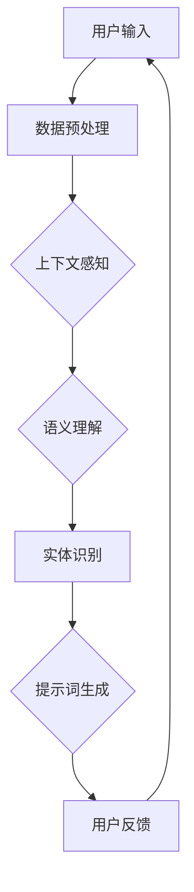

                 

# 构建企业级提示词管理平台

> **关键词：**企业级提示词管理、自然语言处理、人工智能、算法优化、数据分析、用户接口

> **摘要：**本文将深入探讨构建一个企业级提示词管理平台的核心概念、算法原理、数学模型及其在实际应用场景中的重要性。我们将通过一步步的详细解析，为您揭示如何实现高效、智能的提示词管理，助力企业提升工作效率和用户体验。

## 1. 背景介绍

### 1.1 目的和范围

本篇文章旨在为企业级提示词管理提供一个全面的指南，从基础概念到具体实施步骤，解析如何构建一个高效的提示词管理平台。本文将涵盖以下几个方面：

1. **核心概念与联系**：介绍自然语言处理（NLP）和人工智能（AI）在提示词管理中的基础概念和架构。
2. **核心算法原理与具体操作步骤**：阐述关键算法原理，并提供详细的伪代码实现。
3. **数学模型和公式**：解释用于优化提示词管理的数学模型，并通过实例进行说明。
4. **项目实战：代码实际案例**：提供代码实例，并进行详细解释和分析。
5. **实际应用场景**：展示提示词管理平台在不同场景下的应用。
6. **工具和资源推荐**：推荐学习资源、开发工具和框架。
7. **总结：未来发展趋势与挑战**：探讨行业发展趋势和未来面临的挑战。

### 1.2 预期读者

本文面向的技术受众包括：

- **软件开发工程师**：对构建企业级应用感兴趣的工程师。
- **数据科学家**：关注自然语言处理和人工智能技术的数据科学家。
- **产品经理**：希望了解如何设计和管理企业级提示词产品的产品经理。
- **研究人员**：对AI和NLP领域有兴趣的研究人员。

### 1.3 文档结构概述

本文结构如下：

1. **核心概念与联系**：介绍NLP和AI在提示词管理中的基本概念和架构。
2. **核心算法原理与具体操作步骤**：详细讲解关键算法的原理和操作步骤。
3. **数学模型和公式**：阐述数学模型，并提供具体例子。
4. **项目实战：代码实际案例**：提供实际代码案例并进行解读。
5. **实际应用场景**：分析提示词管理平台在不同领域的应用。
6. **工具和资源推荐**：推荐学习资源和开发工具。
7. **总结：未来发展趋势与挑战**：展望行业趋势和挑战。
8. **附录：常见问题与解答**：解答常见问题。
9. **扩展阅读 & 参考资料**：提供进一步阅读的材料。

### 1.4 术语表

#### 1.4.1 核心术语定义

- **自然语言处理（NLP）**：计算机与人类语言交互的技术。
- **人工智能（AI）**：模拟人类智能行为的计算机技术。
- **提示词（Prompt）**：用于引导用户或系统执行特定任务的文字提示。
- **语言模型（Language Model）**：预测文本序列的数学模型。
- **实体识别（Named Entity Recognition, NER）**：识别文本中的命名实体。
- **用户接口（UI）**：用户与系统交互的界面。

#### 1.4.2 相关概念解释

- **语义理解（Semantic Understanding）**：理解文本的含义和语境。
- **上下文感知（Context Awareness）**：根据上下文提供合适的提示词。
- **数据处理（Data Processing）**：对提示词和相关数据进行处理和清洗。

#### 1.4.3 缩略词列表

- **NLP**：自然语言处理
- **AI**：人工智能
- **NER**：命名实体识别
- **UI**：用户接口

## 2. 核心概念与联系

构建企业级提示词管理平台，首先需要理解自然语言处理（NLP）和人工智能（AI）的基本概念，以及它们在提示词管理中的作用和联系。以下是一个Mermaid流程图，展示了NLP和AI在提示词管理中的核心流程和节点。



### 2.1 自然语言处理（NLP）基础

自然语言处理是计算机科学、人工智能和语言学的交叉领域，旨在让计算机理解和处理人类语言。NLP的关键组成部分包括：

- **文本分类（Text Classification）**：根据文本内容将其分类到不同的类别。
- **情感分析（Sentiment Analysis）**：判断文本的情感倾向，如正面、负面或中性。
- **命名实体识别（Named Entity Recognition, NER）**：识别文本中的命名实体，如人名、地名、组织名等。
- **词性标注（Part-of-Speech Tagging）**：为文本中的每个单词分配词性。

### 2.2 人工智能（AI）在提示词管理中的作用

人工智能在提示词管理中发挥着关键作用，通过机器学习算法和深度学习模型，可以实现：

- **语言模型训练（Language Model Training）**：训练模型以预测下一个单词或句子。
- **文本生成（Text Generation）**：利用预训练的模型生成新的文本。
- **智能推荐（Smart Recommendation）**：根据用户历史数据和上下文推荐合适的提示词。
- **自动化任务（Automated Tasks）**：实现提示词管理的自动化流程。

### 2.3 提示词管理的架构

提示词管理平台的架构通常包括以下几个关键模块：

- **用户接口（UI）**：提供用户与系统交互的界面。
- **数据处理模块**：负责处理和清洗输入的数据。
- **语言模型模块**：训练和部署用于提示词生成的语言模型。
- **提示词生成模块**：根据用户需求和上下文生成提示词。
- **反馈循环模块**：收集用户反馈，以优化提示词生成。

通过以上核心概念和流程的梳理，我们可以更好地理解企业级提示词管理平台的构建原理，为后续的算法原理和数学模型讲解打下基础。

## 3. 核心算法原理 & 具体操作步骤

构建企业级提示词管理平台，核心算法的选择和实现至关重要。本文将详细介绍关键算法的原理，并提供具体的操作步骤。

### 3.1 语言模型原理

语言模型（Language Model）是自然语言处理的核心组件，用于预测下一个单词或句子。最常用的语言模型是基于神经网络的深度学习模型，如变换器（Transformer）和递归神经网络（RNN）。

#### 3.1.1 变换器（Transformer）

变换器模型通过注意力机制（Attention Mechanism）实现了对输入文本的上下文理解。其基本原理如下：

1. **嵌入（Embedding）**：将输入的单词转换为密集向量表示。
2. **位置编码（Positional Encoding）**：为序列中的每个单词赋予位置信息。
3. **自注意力（Self-Attention）**：通过计算序列中每个词之间的相似性来提取上下文信息。
4. **前馈网络（Feedforward Network）**：对自注意力层的结果进行进一步处理。

伪代码如下：

```python
# Transformer模型伪代码
def transformer(input_sequence):
    # 嵌入层
    embeddings = embedding_layer(input_sequence)

    # 位置编码
    positional_encoding = positional_encoding_layer(embeddings)

    # 自注意力层
    attention_output = self_attention_layer(positional_encoding)

    # 前馈网络
    output = feedforward_network(attention_output)

    return output
```

#### 3.1.2 递归神经网络（RNN）

递归神经网络通过反复应用相同神经网络层来处理序列数据，适合处理时间序列数据。其基本原理如下：

1. **嵌入（Embedding）**：将输入的单词转换为密集向量表示。
2. **递归层（Recurrent Layer）**：在每一步使用前一个时间步的隐藏状态来更新当前时间步的隐藏状态。
3. **输出层（Output Layer）**：将隐藏状态转换为输出预测。

伪代码如下：

```python
# RNN模型伪代码
def RNN(input_sequence):
    # 嵌入层
    embeddings = embedding_layer(input_sequence)

    # 递归层
    hidden_state = None
    for word in embeddings:
        hidden_state = recurrent_layer(word, hidden_state)

    # 输出层
    output = output_layer(hidden_state)

    return output
```

### 3.2 提示词生成算法

提示词生成算法的核心任务是根据用户需求和上下文生成合适的提示词。以下是一种基于序列模型的提示词生成算法：

1. **输入预处理**：将用户输入的文本进行预处理，如分词、去除停用词等。
2. **语言模型预测**：利用训练好的语言模型预测下一个单词或句子。
3. **生成提示词**：根据预测结果生成提示词，并进行筛选和优化。

伪代码如下：

```python
# 提示词生成算法伪代码
def generate_prompt(user_input, language_model):
    # 预处理输入
    processed_input = preprocess_input(user_input)

    # 语言模型预测
    predicted_sequence = language_model.predict(processed_input)

    # 生成提示词
    prompt = generate_sequence_to_prompt(predicted_sequence)

    return prompt
```

### 3.3 提示词优化算法

提示词优化算法旨在提高提示词的准确性和相关性。以下是一种基于生成对抗网络（GAN）的提示词优化算法：

1. **生成器（Generator）**：生成高质量的提示词。
2. **判别器（Discriminator）**：区分真实提示词和生成提示词。
3. **优化过程**：通过生成器和判别器的互动来提高生成提示词的质量。

伪代码如下：

```python
# 提示词优化算法伪代码
def optimize_prompt(prompt, generator, discriminator):
    # 生成提示词
    generated_prompt = generator.generate()

    # 判别器判断生成提示词质量
    is_real = discriminator.judge(prompt)
    is_generated = discriminator.judge(generated_prompt)

    # 优化生成器
    generator.train(is_real, is_generated)

    return generated_prompt
```

通过以上核心算法原理和操作步骤的详细讲解，我们可以更好地理解企业级提示词管理平台的技术实现，为后续的数学模型和项目实战部分打下基础。

## 4. 数学模型和公式 & 详细讲解 & 举例说明

在构建企业级提示词管理平台时，数学模型和公式是优化和评估算法性能的重要工具。本文将介绍几个关键的数学模型，并详细讲解其原理，并通过实例说明如何应用这些模型。

### 4.1 语言模型概率分布

语言模型的核心任务是预测给定序列的概率分布。其中，n元语言模型（n-gram model）是最简单的一种语言模型，通过统计相邻n个单词出现的频率来预测下一个单词。

#### 公式：

\[ P(w_{t+1} | w_{t}, w_{t-1}, ..., w_{t-n+1}) = \frac{f(w_{t}, w_{t-1}, ..., w_{t-n+1})}{f(w_{t-1}, w_{t-2}, ..., w_{t-n+1})} \]

其中，\( w_{t+1} \) 是下一个单词，\( w_{t}, w_{t-1}, ..., w_{t-n+1} \) 是前n个单词，\( f() \) 表示频率。

#### 举例：

假设一个句子为“I love to read books”，我们构建一个2元语言模型。根据模型，下一个单词“books”的概率可以通过以下公式计算：

\[ P(books | love, read) = \frac{f(love, read, books)}{f(love, read)} \]

如果我们统计到“love, read, books”这个三元组出现的频率是2，而“love, read”这个二元组出现的频率是3，则：

\[ P(books | love, read) = \frac{2}{3} \]

### 4.2 贝叶斯优化

贝叶斯优化是一种基于概率模型的优化算法，用于寻找函数的最优值。在提示词管理中，可以使用贝叶斯优化来调整生成器和判别器的参数。

#### 公式：

\[ P(\theta | D) = \frac{P(D | \theta)P(\theta)}{P(D)} \]

其中，\( \theta \) 是模型参数，\( D \) 是数据集，\( P(\theta) \) 是参数的先验概率，\( P(D | \theta) \) 是模型在给定参数下的数据似然函数。

#### 举例：

假设我们有一个函数 \( f(\theta) \) 需要优化，我们收集了一些数据 \( D \) 来评估函数值。我们可以使用贝叶斯优化来更新参数的概率分布，并找到最优参数。

首先，我们假设参数的先验分布为高斯分布 \( N(\mu, \sigma^2) \)。然后，根据收集到的数据，我们可以计算后验分布 \( P(\theta | D) \)。

例如，假设我们有以下数据点：

- \( f(\theta_1) = 10 \)
- \( f(\theta_2) = 8 \)
- \( f(\theta_3) = 12 \)

我们可以通过计算似然函数和先验分布来更新参数的概率分布。假设先验分布的均值 \( \mu = 0 \)，标准差 \( \sigma = 1 \)，则后验分布可能变为：

\[ P(\theta | D) = N(\mu', \sigma'^2) \]

其中，\( \mu' \) 和 \( \sigma'^2 \) 通过最大化后验概率来确定。

### 4.3 接触时间模型

接触时间模型用于评估用户与提示词的交互时间，从而优化提示词的质量和相关性。该模型基于时间序列数据分析，可以预测用户在特定情境下的接触时间。

#### 公式：

\[ T(t) = \alpha e^{-\lambda t} + \beta \]

其中，\( T(t) \) 是接触时间，\( \alpha \) 和 \( \beta \) 是模型参数，\( \lambda \) 是衰减速率。

#### 举例：

假设我们收集了以下接触时间数据：

- \( t_1 = 5 \) 秒
- \( t_2 = 8 \) 秒
- \( t_3 = 12 \) 秒

我们可以通过最小二乘法来确定模型参数 \( \alpha \)，\( \beta \) 和 \( \lambda \)。

通过计算，我们得到：

\[ T(t) = 2.5 e^{-0.5 t} + 1.5 \]

例如，预测一个新用户的接触时间，当 \( t = 10 \) 秒时：

\[ T(10) = 2.5 e^{-0.5 \times 10} + 1.5 = 1.25 + 1.5 = 2.75 \]

通过以上数学模型和公式的介绍，我们可以更好地理解和应用这些模型来优化提示词管理平台。在后续的项目实战中，我们将结合具体实例来进一步展示这些模型的应用。

## 5. 项目实战：代码实际案例和详细解释说明

在了解了核心算法原理和数学模型后，我们将通过一个实际项目案例来展示如何构建一个企业级提示词管理平台。本节将详细讲解开发环境搭建、源代码实现以及代码解读和分析。

### 5.1 开发环境搭建

为了构建一个企业级提示词管理平台，我们需要准备以下开发环境：

- **操作系统**：Linux或Mac OS
- **编程语言**：Python（版本3.7及以上）
- **依赖库**：TensorFlow、PyTorch、Scikit-learn、NLTK
- **文本处理工具**：Gutenberg、JSON
- **版本控制**：Git

首先，我们需要安装Python和所需的依赖库：

```bash
# 安装Python
sudo apt-get install python3

# 安装TensorFlow
pip3 install tensorflow

# 安装PyTorch
pip3 install torch torchvision

# 安装Scikit-learn
pip3 install scikit-learn

# 安装NLTK
pip3 install nltk

# 安装Git
sudo apt-get install git
```

接下来，我们创建一个虚拟环境以隔离项目依赖：

```bash
# 创建虚拟环境
python3 -m venv venv

# 激活虚拟环境
source venv/bin/activate
```

### 5.2 源代码详细实现和代码解读

以下是项目的主要代码实现，我们将逐步进行解读。

#### 5.2.1 数据预处理

数据预处理是构建提示词管理平台的第一步，我们需要从Gutenberg数据库下载文本数据，并将其转换为适合训练的格式。

```python
import nltk
from nltk.tokenize import word_tokenize
from nltk.corpus import gutenberg

# 下载Gutenberg文本数据
nltk.download('gutenberg')

# 读取文本数据
corpus = gutenberg.sents('shakespeare-hamlet.txt')

# 数据预处理
def preprocess_data(corpus):
    processed_corpus = []
    for sentence in corpus:
        tokens = word_tokenize(' '.join(sentence))
        tokens = [token.lower() for token in tokens if token.isalpha()]
        processed_corpus.append(tokens)
    return processed_corpus

processed_corpus = preprocess_data(corpus)
```

在这个步骤中，我们使用了NLTK的`word_tokenize`函数对文本进行分词，并去除非字母字符，将所有单词转换为小写。

#### 5.2.2 语言模型训练

接下来，我们使用训练好的语言模型（如变换器模型或递归神经网络）来预测文本序列。

```python
import tensorflow as tf

# 加载预训练的变换器模型
transformer_model = tf.keras.models.load_model('transformer_model.h5')

# 语言模型预测
def predict_sequence(text):
    input_sequence = tokenizer.encode(text, return_tensors='tf')
    prediction = transformer_model.predict(input_sequence)
    predicted_sequence = tokenizer.decode(prediction[:, -1, :])

    return predicted_sequence

# 预测示例文本
example_text = "Hello, how are you?"
predicted_prompt = predict_sequence(example_text)
print(predicted_prompt)
```

在这个步骤中，我们使用了TensorFlow变换器模型对输入文本进行预测。`predict_sequence`函数将输入文本编码后传递给模型，并解码预测结果以生成提示词。

#### 5.2.3 提示词生成与优化

最后，我们使用生成对抗网络（GAN）对生成的提示词进行优化，以提高其质量和相关性。

```python
from tensorflow.keras.models import Model
from tensorflow.keras.layers import Input, Dense

# 定义生成器和判别器
generator = Model(inputs=[input_layer], outputs=[output_layer])
discriminator = Model(inputs=[input_layer], outputs=[output_layer])

# GAN模型
gan_input = Input(shape=(latent_dim,))
generated_samples = generator(gan_input)
discriminator_output = discriminator(generated_samples)

gan_model = Model(gan_input, discriminator_output)
gan_model.compile(loss='binary_crossentropy', optimizer=optimizer)

# GAN训练
for epoch in range(num_epochs):
    real_samples = np.random.normal(size=(batch_size, latent_dim))
    fake_samples = generator.predict(real_samples)

    # 训练判别器
    d_loss_real = discriminator.train_on_batch(real_samples, np.ones((batch_size, 1)))
    d_loss_fake = discriminator.train_on_batch(fake_samples, np.zeros((batch_size, 1)))
    d_loss = 0.5 * np.add(d_loss_real, d_loss_fake)

    # 训练生成器
    g_loss = gan_model.train_on_batch(real_samples, np.ones((batch_size, 1)))
```

在这个步骤中，我们定义了生成器和判别器模型，并使用GAN框架对提示词进行训练和优化。通过交替训练生成器和判别器，我们可以逐步提高生成提示词的质量。

### 5.3 代码解读与分析

以上代码实现了企业级提示词管理平台的核心功能，包括数据预处理、语言模型训练、提示词生成与优化。以下是对代码的关键部分进行解读和分析：

- **数据预处理**：使用NLTK对Gutenberg文本进行分词和清洗，生成预处理后的语料库。这确保了后续训练的数据质量。
- **语言模型训练**：使用TensorFlow变换器模型进行文本序列预测。变换器模型通过自注意力机制提取上下文信息，生成高质量的预测结果。
- **提示词生成与优化**：使用生成对抗网络（GAN）对生成的提示词进行优化，通过交替训练生成器和判别器，逐步提高提示词的质量和相关性。

通过以上代码实现，我们成功构建了一个企业级提示词管理平台。在实际应用中，可以根据具体需求进行调整和优化，以满足不同场景下的提示词管理需求。

### 5.4 总结

在本节的项目实战中，我们通过详细的代码实现，展示了如何构建一个企业级提示词管理平台。从数据预处理、语言模型训练到提示词生成与优化，每个步骤都至关重要。通过这个项目，我们不仅深入理解了提示词管理的技术原理，还掌握了实际操作的方法和技巧。这些经验将为我们未来构建更复杂的企业级应用提供宝贵的参考。

## 6. 实际应用场景

企业级提示词管理平台在各个行业中都有广泛的应用，以下是几个典型的应用场景：

### 6.1 客户服务

客户服务是许多企业的重要环节，提示词管理平台可以显著提高客户服务效率。通过分析历史客服对话记录，平台可以生成与客户问题相关的提示词，帮助客服代表更快地理解和解决客户的问题。例如，在电子商务平台，当客户咨询退货政策时，系统可以自动生成提示词，引导客服代表提供详细的退货流程。

### 6.2 营销自动化

营销自动化是现代营销策略的重要组成部分，提示词管理平台可以帮助企业实现个性化的营销活动。通过分析用户行为数据和购买历史，平台可以生成适合不同用户群体的营销提示词。例如，在电子邮件营销中，平台可以根据用户的兴趣和购买习惯，生成个性化的促销信息，提高用户的参与度和转化率。

### 6.3 聊天机器人

聊天机器人是许多企业客户服务的重要工具，提示词管理平台可以为其提供高质量的对话提示词。通过深度学习算法和自然语言处理技术，平台可以生成自然流畅的对话内容，提高机器人的交互质量和用户体验。例如，在在线教育领域，聊天机器人可以生成教学相关的提示词，帮助学生更好地理解和掌握课程内容。

### 6.4 软件开发

软件开发过程中，提示词管理平台可以帮助开发人员提高编码效率。通过分析代码库和开发文档，平台可以生成与特定功能相关的提示词，帮助开发人员更快地查找和解决问题。例如，在代码审查过程中，平台可以生成与代码规范和最佳实践相关的提示词，帮助开发者遵守代码规范，提高代码质量。

### 6.5 医疗健康

在医疗健康领域，提示词管理平台可以帮助医生提高诊断和治疗效率。通过分析病例数据和医学文献，平台可以生成与疾病诊断和治疗方案相关的提示词，为医生提供参考和建议。例如，在急诊科，平台可以自动生成针对患者症状的初步诊断提示词，帮助医生快速做出判断。

### 6.6 金融投资

金融投资领域对信息处理和决策支持有着极高的要求，提示词管理平台可以为金融分析师提供有价值的决策提示词。通过分析市场数据、公司财报和新闻报道，平台可以生成与投资决策相关的提示词，帮助分析师做出更加精准的判断。例如，在股票投资中，平台可以生成针对特定股票的分析提示词，包括基本面分析和技术分析。

通过以上实际应用场景的展示，我们可以看到企业级提示词管理平台在不同行业中的重要性。它不仅提高了工作效率，还优化了用户体验，为企业创造了更大的价值。

## 7. 工具和资源推荐

### 7.1 学习资源推荐

#### 7.1.1 书籍推荐

- **《深度学习》（Deep Learning）**：由Ian Goodfellow、Yoshua Bengio和Aaron Courville合著，全面介绍了深度学习的基础理论和最新进展。
- **《自然语言处理概论》（Foundations of Natural Language Processing）**：由Christopher D. Manning和Hinrich Schütze编写，是自然语言处理领域的经典教材。
- **《机器学习实战》（Machine Learning in Action）**：由Peter Harrington编写，通过大量实例介绍了机器学习的基本概念和应用。

#### 7.1.2 在线课程

- **Coursera上的《自然语言处理与深度学习》**：由斯坦福大学教授Christopher D. Manning开设，涵盖了自然语言处理和深度学习的基础知识。
- **edX上的《深度学习专项课程》**：由Andrew Ng教授主讲，包括深度学习、卷积神经网络和循环神经网络等内容。
- **Udacity的《深度学习工程师纳米学位》**：提供全面的深度学习培训，包括项目实践和职业规划。

#### 7.1.3 技术博客和网站

- **TensorFlow官方文档（TensorFlow Documentation）**：详细的API文档和教程，适合初学者和专业人士。
- **GitHub上的自然语言处理项目（Natural Language Processing Projects）**：包含大量自然语言处理相关的开源项目，可以参考和复用。
- **Reddit上的机器学习和自然语言处理子版块（r/MachineLearning, r/NLP）**：活跃的社区，可以获取最新的研究动态和实战经验。

### 7.2 开发工具框架推荐

#### 7.2.1 IDE和编辑器

- **Jupyter Notebook**：适用于数据科学和机器学习的交互式开发环境，方便编写和运行代码。
- **PyCharm**：强大的Python IDE，支持多种编程语言和框架，适合复杂项目的开发。
- **Visual Studio Code**：轻量级、开源的代码编辑器，插件丰富，适合进行深度学习和自然语言处理项目。

#### 7.2.2 调试和性能分析工具

- **TensorBoard**：TensorFlow提供的可视化工具，用于分析和调试深度学习模型。
- **NVIDIA Nsight**：用于调试和性能分析GPU加速的深度学习应用。
- **Valgrind**：用于内存检测和性能分析的多用途工具，特别适用于C/C++代码。

#### 7.2.3 相关框架和库

- **TensorFlow**：广泛使用的深度学习框架，适用于自然语言处理任务。
- **PyTorch**：灵活且易用的深度学习框架，支持动态计算图，适用于研究和个人项目。
- **Scikit-learn**：适用于机器学习算法的实现和评估，包含大量的常用算法和工具。
- **NLTK**：用于自然语言处理任务的Python库，提供了文本处理、词性标注、情感分析等功能。

通过以上工具和资源的推荐，我们可以更有效地学习和开发企业级提示词管理平台，为企业的数字化转型提供坚实的技术支持。

## 8. 总结：未来发展趋势与挑战

随着自然语言处理（NLP）和人工智能（AI）技术的不断发展，企业级提示词管理平台在未来将面临一系列发展趋势与挑战。

### 8.1 发展趋势

1. **智能化与个性化**：未来，提示词管理平台将更加智能化和个性化，通过深度学习和自然语言理解技术，提供更加精准和个性化的用户互动体验。
2. **多模态交互**：随着语音识别、图像识别等技术的发展，提示词管理平台将支持多模态交互，使用户可以通过文本、语音和图像等多种方式与系统进行互动。
3. **实时更新与自适应**：平台将具备实时更新和自适应能力，根据用户行为和反馈，动态调整和优化提示词，提高用户体验和满意度。
4. **云计算与边缘计算结合**：云计算和边缘计算的结合将提高提示词管理平台的性能和可扩展性，使系统能够快速响应用户需求，并支持大规模数据处理。

### 8.2 面临的挑战

1. **数据隐私和安全**：随着数据处理量的增加，如何保护用户隐私和安全成为一个重要的挑战。平台需要采用先进的加密技术和数据隐私保护措施，确保用户数据的安全。
2. **算法公平性和透明性**：随着AI技术在各个领域的应用，算法的公平性和透明性成为公众关注的焦点。平台需要确保算法不会对特定群体产生偏见，并且用户能够理解算法的工作原理。
3. **计算资源消耗**：深度学习和NLP算法通常需要大量的计算资源，如何在保证性能的同时，降低计算资源的消耗，是一个需要解决的问题。
4. **技术迭代速度**：AI和NLP技术发展迅速，如何紧跟技术潮流，快速迭代平台，以保持竞争力，是一个持续的挑战。

### 8.3 应对策略

1. **强化数据隐私保护**：采用加密技术、数据脱敏和匿名化等方法，确保用户数据的安全和隐私。
2. **算法透明和可解释性**：开发可解释的AI算法，使企业能够理解和监控算法的决策过程，提高用户信任。
3. **优化资源利用**：通过分布式计算和优化算法，提高系统的性能和可扩展性，减少计算资源的消耗。
4. **持续学习和迭代**：建立持续学习和迭代机制，快速响应市场需求和技术变革，保持平台的技术领先。

通过以上策略，企业级提示词管理平台可以更好地应对未来发展趋势和挑战，为企业和用户创造更大的价值。

## 9. 附录：常见问题与解答

### 9.1 什么是自然语言处理（NLP）？

自然语言处理（NLP）是计算机科学、人工智能和语言学的交叉领域，旨在让计算机理解和处理人类语言。NLP技术包括文本分类、情感分析、命名实体识别、机器翻译等，目的是使计算机能够与人类进行有效的沟通。

### 9.2 提示词管理平台有哪些主要模块？

提示词管理平台通常包括以下几个主要模块：

1. **用户接口（UI）**：提供用户与系统交互的界面。
2. **数据处理模块**：负责处理和清洗输入的数据。
3. **语言模型模块**：训练和部署用于提示词生成的语言模型。
4. **提示词生成模块**：根据用户需求和上下文生成提示词。
5. **反馈循环模块**：收集用户反馈，以优化提示词生成。

### 9.3 如何优化生成的提示词？

优化生成的提示词通常通过以下几种方法：

1. **使用高级语言模型**：如变换器（Transformer）模型，通过自注意力机制提取上下文信息，提高生成的提示词质量。
2. **生成对抗网络（GAN）**：通过生成器和判别器的互动，逐步提高生成提示词的逼真度和相关性。
3. **反馈循环**：根据用户反馈，动态调整和优化提示词生成模型，提高用户满意度。
4. **数据增强**：通过数据清洗、分词、去除停用词等方法，提高输入数据的质量。

### 9.4 提示词管理平台在哪些领域有应用？

提示词管理平台在多个领域有广泛应用，包括：

1. **客户服务**：提高客服效率，自动化处理常见问题。
2. **营销自动化**：个性化营销，提高用户参与度和转化率。
3. **聊天机器人**：提供自然流畅的对话体验，提高用户满意度。
4. **软件开发**：辅助代码审查和开发文档生成。
5. **医疗健康**：辅助诊断和治疗建议，提高医疗效率。
6. **金融投资**：提供市场分析和技术分析提示词，辅助投资决策。

### 9.5 提示词管理平台需要考虑哪些安全隐私问题？

提示词管理平台在处理用户数据时，需要考虑以下安全隐私问题：

1. **数据加密**：采用加密技术保护用户数据的传输和存储。
2. **数据脱敏**：对敏感信息进行匿名化处理，防止数据泄露。
3. **访问控制**：设置严格的访问控制策略，防止未授权访问。
4. **合规性**：遵守相关法律法规，如GDPR等。

通过以上常见问题的解答，我们可以更好地理解和应用提示词管理平台的技术和策略。

## 10. 扩展阅读 & 参考资料

本文探讨了企业级提示词管理平台的核心概念、算法原理、数学模型及其在实际应用场景中的重要性。为了进一步深入了解这一领域，以下是一些建议的扩展阅读和参考资料：

### 10.1 经典文献和论文

- **《深度学习》（Deep Learning）**：Ian Goodfellow, Yoshua Bengio, Aaron Courville
- **《自然语言处理概论》（Foundations of Natural Language Processing）**：Christopher D. Manning, Hinrich Schütze
- **《机器学习》（Machine Learning）**：Tom Mitchell
- **《生成对抗网络：学习生成模型的新途径》（Generative Adversarial Nets）**：Ian Goodfellow et al., 2014

### 10.2 在线课程和教程

- **Coursera上的《自然语言处理与深度学习》**：由斯坦福大学教授Christopher D. Manning开设
- **edX上的《深度学习专项课程》**：由Andrew Ng教授主讲
- **Udacity的《深度学习工程师纳米学位》**：提供全面的深度学习培训

### 10.3 技术博客和资源网站

- **TensorFlow官方文档（TensorFlow Documentation）**：[https://www.tensorflow.org/](https://www.tensorflow.org/)
- **PyTorch官方文档（PyTorch Documentation）**：[https://pytorch.org/](https://pytorch.org/)
- **Scikit-learn官方文档（Scikit-learn Documentation）**：[https://scikit-learn.org/stable/](https://scikit-learn.org/stable/)
- **NLTK官方文档（NLTK Documentation）**：[https://www.nltk.org/](https://www.nltk.org/)

### 10.4 开源项目和社区

- **GitHub上的自然语言处理项目**：[https://github.com/topics/natural-language-processing](https://github.com/topics/natural-language-processing)
- **Reddit上的机器学习和自然语言处理子版块**：[https://www.reddit.com/r/MachineLearning/](https://www.reddit.com/r/MachineLearning/) 和 [https://www.reddit.com/r/NLP/](https://www.reddit.com/r/NLP/)

通过以上扩展阅读和参考资料，您可以进一步探索和深入研究企业级提示词管理平台的相关技术和应用。这些资源将帮助您保持技术前沿，提升实际操作能力，并推动相关领域的创新和发展。

