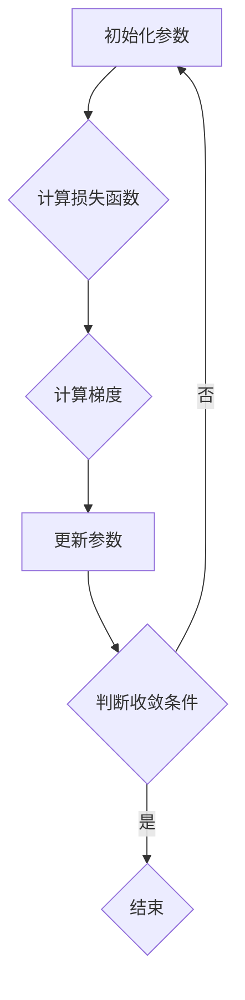

                 

# 梯度下降 (Gradient Descent)

> 关键词：机器学习、优化算法、梯度下降、迭代、损失函数、反向传播

> 摘要：本文将深入探讨梯度下降算法在机器学习中的应用，解释其核心原理和具体操作步骤。我们将通过数学模型和实际案例，详细解析梯度下降如何帮助机器学习模型优化参数，提高预测准确性。此外，文章还将探讨梯度下降的不同变体及其在实际项目中的应用场景。

## 1. 背景介绍

### 1.1 目的和范围

本文旨在介绍和探讨梯度下降算法在机器学习中的应用。梯度下降是一种优化算法，用于最小化损失函数，从而优化模型的参数。通过理解梯度下降的基本原理和操作步骤，读者可以更好地掌握机器学习的核心概念，并在实际项目中应用这一算法。

### 1.2 预期读者

本文适合对机器学习和算法有一定基础的读者，包括数据科学家、机器学习工程师和研究人员。对于初学者，本文也提供了详细的理论讲解和实际案例，有助于深入理解梯度下降算法。

### 1.3 文档结构概述

本文结构如下：

1. 背景介绍：介绍文章的目的、预期读者和文档结构。
2. 核心概念与联系：通过Mermaid流程图展示梯度下降的核心概念和原理。
3. 核心算法原理 & 具体操作步骤：详细解释梯度下降算法的原理和步骤，使用伪代码进行说明。
4. 数学模型和公式 & 详细讲解 & 举例说明：使用LaTeX格式介绍数学模型和相关公式，并给出具体案例。
5. 项目实战：代码实际案例和详细解释说明。
6. 实际应用场景：探讨梯度下降在不同领域中的应用。
7. 工具和资源推荐：推荐学习资源、开发工具和论文著作。
8. 总结：未来发展趋势与挑战。
9. 附录：常见问题与解答。
10. 扩展阅读 & 参考资料。

### 1.4 术语表

#### 1.4.1 核心术语定义

- 梯度下降（Gradient Descent）：一种优化算法，用于通过迭代更新模型参数来最小化损失函数。
- 损失函数（Loss Function）：用于衡量模型预测值与真实值之间的差异，通常用于评估模型的性能。
- 学习率（Learning Rate）：梯度下降算法中用于控制参数更新的步长，影响收敛速度和精度。
- 反向传播（Backpropagation）：一种用于计算损失函数关于模型参数梯度的方法，是梯度下降算法的核心。

#### 1.4.2 相关概念解释

- 最小化损失函数：在机器学习中，最小化损失函数意味着找到一组参数，使得模型预测值与真实值之间的差异最小。
- 参数更新：在梯度下降过程中，通过迭代更新模型参数，使得模型逐渐逼近最优参数。

#### 1.4.3 缩略词列表

- ML：机器学习（Machine Learning）
- GD：梯度下降（Gradient Descent）
- LR：学习率（Learning Rate）
- BP：反向传播（Backpropagation）

## 2. 核心概念与联系

### 2.1 Mermaid流程图

下面是一个简单的Mermaid流程图，展示了梯度下降算法的核心概念和原理。



### 2.2 梯度下降算法原理

梯度下降算法的目标是最小化损失函数，从而优化模型的参数。损失函数用于衡量模型预测值与真实值之间的差异。梯度下降的核心思想是通过迭代更新参数，使得损失函数逐渐减小。

- **初始化参数**：首先，我们需要随机初始化模型参数。
- **计算损失函数**：然后，计算当前参数下的损失函数值。
- **计算梯度**：使用反向传播算法计算损失函数关于模型参数的梯度。
- **更新参数**：根据梯度和学习率，更新模型参数。
- **判断收敛条件**：判断是否满足收敛条件，如果满足，则结束迭代；否则，继续迭代。

### 2.3 梯度下降算法的优势和挑战

梯度下降算法具有以下优势：

- **通用性**：梯度下降算法可以应用于各种机器学习问题，包括线性回归、逻辑回归、神经网络等。
- **简单性**：梯度下降算法的实现相对简单，易于理解和实现。

然而，梯度下降算法也存在一些挑战：

- **收敛速度**：对于一些复杂的问题，梯度下降算法可能收敛速度较慢。
- **局部最小值**：在非凸优化问题中，梯度下降算法可能会陷入局部最小值，无法找到全局最优解。

## 3. 核心算法原理 & 具体操作步骤

### 3.1 算法原理

梯度下降算法的核心原理是通过迭代更新模型参数，使得损失函数逐渐减小。具体来说，算法分为以下几个步骤：

1. **初始化参数**：随机初始化模型参数。
2. **计算损失函数**：计算当前参数下的损失函数值。
3. **计算梯度**：使用反向传播算法计算损失函数关于模型参数的梯度。
4. **更新参数**：根据梯度和学习率，更新模型参数。
5. **判断收敛条件**：判断是否满足收敛条件，如果满足，则结束迭代；否则，继续迭代。

### 3.2 伪代码

下面是梯度下降算法的伪代码实现：

```python
def gradient_descent(initial_params, learning_rate, num_iterations):
    params = initial_params
    for _ in range(num_iterations):
        loss = compute_loss(params)
        gradient = compute_gradient(params)
        params = update_params(params, gradient, learning_rate)
        if is_converged(params):
            break
    return params

def compute_loss(params):
    # 计算损失函数值
    pass

def compute_gradient(params):
    # 计算损失函数关于参数的梯度
    pass

def update_params(params, gradient, learning_rate):
    # 更新参数
    new_params = params - learning_rate * gradient
    return new_params

def is_converged(params):
    # 判断是否满足收敛条件
    return True  # 示例代码，实际中需要根据具体问题进行判断
```

### 3.3 详细解释

1. **初始化参数**：在梯度下降算法中，我们需要随机初始化模型参数。初始化参数的目的是为了开始迭代过程，找到最优参数。
   
2. **计算损失函数**：损失函数用于衡量模型预测值与真实值之间的差异。在梯度下降过程中，我们需要计算当前参数下的损失函数值，以评估模型的性能。

3. **计算梯度**：梯度是损失函数关于模型参数的导数。通过计算梯度，我们可以确定参数更新的方向。梯度指向损失函数增加最快的方向，因此，梯度下降算法通过负梯度方向更新参数，以最小化损失函数。

4. **更新参数**：根据梯度和学习率，我们可以计算参数的更新值。学习率决定了参数更新的步长，较大的学习率可能导致参数更新不稳定，而较小的学习率可能导致收敛速度较慢。

5. **判断收敛条件**：在每次迭代后，我们需要判断是否满足收敛条件。收敛条件可以是损失函数的减小率低于某个阈值，或者迭代次数超过某个上限。满足收敛条件后，我们可以结束迭代过程，获得最优参数。

## 4. 数学模型和公式 & 详细讲解 & 举例说明

### 4.1 数学模型

在梯度下降算法中，我们主要涉及到以下数学模型：

1. **损失函数**：损失函数用于衡量模型预测值与真实值之间的差异。常见的损失函数包括均方误差（MSE）和交叉熵（Cross-Entropy）。
   
   - **均方误差（MSE）**：
     $$
     \text{MSE} = \frac{1}{n} \sum_{i=1}^{n} (\hat{y}_i - y_i)^2
     $$
     其中，$\hat{y}_i$是模型预测值，$y_i$是真实值，$n$是样本数量。

   - **交叉熵（Cross-Entropy）**：
     $$
     \text{Cross-Entropy} = -\frac{1}{n} \sum_{i=1}^{n} y_i \log(\hat{y}_i)
     $$
     其中，$y_i$是真实值，$\hat{y}_i$是模型预测值。

2. **梯度**：梯度是损失函数关于模型参数的导数。对于线性回归模型，梯度可以通过以下公式计算：
   $$
   \nabla_{\theta} J(\theta) = \frac{\partial}{\partial \theta} J(\theta)
   $$
   其中，$J(\theta)$是损失函数，$\theta$是模型参数。

### 4.2 详细讲解

1. **损失函数的选取**：在机器学习中，选择合适的损失函数非常重要。损失函数的选取取决于问题的类型和数据的特点。例如，对于分类问题，交叉熵损失函数通常比均方误差损失函数更适合。这是因为交叉熵损失函数在分类问题中可以更好地处理概率分布。

2. **梯度的计算**：梯度的计算是梯度下降算法的核心步骤。在计算梯度时，我们需要对损失函数进行求导。对于线性回归模型，梯度的计算相对简单。然而，对于复杂的模型，如神经网络，梯度的计算需要使用反向传播算法。

3. **学习率的选取**：学习率是梯度下降算法中非常重要的参数。学习率决定了参数更新的步长。较大的学习率可能导致参数更新不稳定，而较小的学习率可能导致收敛速度较慢。在实际应用中，需要根据问题的特点调整学习率。

### 4.3 举例说明

假设我们有一个线性回归模型，用于预测房价。模型的损失函数为均方误差（MSE），我们需要使用梯度下降算法来优化模型的参数。

1. **初始化参数**：随机初始化模型参数，如$\theta_0$和$\theta_1$。
2. **计算损失函数**：计算当前参数下的损失函数值，如$J(\theta_0, \theta_1)$。
3. **计算梯度**：计算损失函数关于参数的梯度，如$\nabla_{\theta} J(\theta)$。
4. **更新参数**：根据梯度和学习率，更新模型参数，如$\theta_0 = \theta_0 - \alpha \nabla_{\theta_0} J(\theta)$和$\theta_1 = \theta_1 - \alpha \nabla_{\theta_1} J(\theta)$。
5. **判断收敛条件**：判断是否满足收敛条件，如损失函数的减小率低于某个阈值。

通过多次迭代，模型参数逐渐逼近最优参数，损失函数值逐渐减小。最终，我们可以获得一个具有较高预测精度的线性回归模型。

## 5. 项目实战：代码实际案例和详细解释说明

### 5.1 开发环境搭建

在进行梯度下降算法的实战之前，我们需要搭建一个合适的开发环境。以下是一个简单的开发环境搭建步骤：

1. 安装Python和相关的库，如NumPy、SciPy和Matplotlib。
2. 创建一个Python虚拟环境，如使用`venv`。
3. 安装所需的库，如使用`pip install numpy scipy matplotlib`。

### 5.2 源代码详细实现和代码解读

下面是一个简单的梯度下降算法实现的示例代码：

```python
import numpy as np

# 梯度下降算法实现
def gradient_descent(X, y, theta, alpha, num_iterations):
    m = len(y)
    for _ in range(num_iterations):
        h = np.dot(X, theta)
        loss = h - y
        gradient = np.dot(X.T, loss) / m
        theta = theta - alpha * gradient
    return theta

# 加载数据
X = np.array([[1, 2], [2, 3], [3, 4], [4, 5]])
y = np.array([1, 2, 3, 4])

# 初始化参数
theta = np.array([0, 0])

# 设置学习率和迭代次数
alpha = 0.01
num_iterations = 1000

# 运行梯度下降算法
theta_final = gradient_descent(X, y, theta, alpha, num_iterations)

print("最终参数：", theta_final)
```

代码解读：

1. **导入库**：首先，我们导入NumPy库，用于矩阵运算。
2. **定义梯度下降函数**：`gradient_descent`函数用于实现梯度下降算法。该函数接受训练数据集X、标签y、初始参数theta、学习率alpha和迭代次数num_iterations作为输入。
3. **计算损失函数**：在每次迭代中，我们计算当前参数下的损失函数值。损失函数用于衡量模型预测值与真实值之间的差异。
4. **计算梯度**：计算损失函数关于参数的梯度，即$\nabla_{\theta} J(\theta)$。
5. **更新参数**：根据梯度和学习率，更新模型参数。
6. **判断收敛条件**：判断是否满足收敛条件，如迭代次数达到上限。
7. **运行梯度下降算法**：加载训练数据集，初始化参数，设置学习率和迭代次数，并运行梯度下降算法。

### 5.3 代码解读与分析

1. **数据准备**：在代码中，我们使用NumPy库加载训练数据集X和标签y。数据集X包含输入特征，y包含真实值。
2. **初始化参数**：在代码中，我们使用NumPy数组初始化参数theta，初始值为[0, 0]。
3. **设置学习率和迭代次数**：在代码中，我们设置学习率alpha为0.01，迭代次数num_iterations为1000。
4. **运行梯度下降算法**：调用`gradient_descent`函数，将训练数据集X、标签y、初始参数theta、学习率alpha和迭代次数num_iterations作为输入，运行梯度下降算法。
5. **输出结果**：最终，我们输出更新后的参数theta_final，该参数是梯度下降算法收敛后的最优参数。

通过这个简单的示例代码，我们可以看到梯度下降算法的实现过程。在实际项目中，我们可以根据具体问题调整算法参数，以达到更好的优化效果。

## 6. 实际应用场景

### 6.1 机器学习模型优化

梯度下降算法在机器学习模型优化中有着广泛的应用。通过梯度下降算法，我们可以最小化损失函数，从而找到最优参数。在深度学习中，梯度下降算法被广泛应用于神经网络模型的训练和优化。通过反向传播算法，我们可以计算损失函数关于模型参数的梯度，并使用梯度下降算法更新模型参数。

### 6.2 线性回归

在线性回归问题中，梯度下降算法可以帮助我们找到最佳拟合直线。通过计算损失函数的梯度，我们可以确定参数更新的方向。梯度下降算法可以用于线性回归模型的训练和优化，从而提高模型的预测准确性。

### 6.3 逻辑回归

逻辑回归是一种常用的分类算法。通过梯度下降算法，我们可以最小化损失函数，找到最佳拟合模型。在逻辑回归问题中，梯度下降算法可以帮助我们找到最佳分类边界，从而实现高效的分类。

### 6.4 神经网络

在深度学习中，梯度下降算法被广泛应用于神经网络模型的训练和优化。通过反向传播算法，我们可以计算损失函数关于模型参数的梯度，并使用梯度下降算法更新模型参数。梯度下降算法在神经网络中的应用，使得深度学习成为处理大规模数据和复杂问题的有效工具。

## 7. 工具和资源推荐

### 7.1 学习资源推荐

#### 7.1.1 书籍推荐

- 《机器学习》（作者：周志华）：本书系统地介绍了机器学习的基本概念、算法和应用。
- 《深度学习》（作者：伊恩·古德费洛、约书亚·本吉奥、亚伦·库维尔）：本书详细介绍了深度学习的基本原理、算法和应用。

#### 7.1.2 在线课程

- Coursera上的《机器学习》课程：由吴恩达教授主讲，全面介绍了机器学习的基本概念和算法。
- Udacity的《深度学习纳米学位》：通过项目驱动的方式，系统介绍了深度学习的基本原理和实战技巧。

#### 7.1.3 技术博客和网站

- medium.com：提供丰富的机器学习和深度学习技术博客。
- towardsdatascience.com：一个专注于数据科学和机器学习的在线社区。

### 7.2 开发工具框架推荐

#### 7.2.1 IDE和编辑器

- PyCharm：一款强大的Python集成开发环境，支持代码调试、版本控制和自动化工具。
- Jupyter Notebook：一个交互式开发环境，适合数据科学和机器学习项目。

#### 7.2.2 调试和性能分析工具

- pdb：Python内置的调试器，用于调试Python代码。
- Numpy：用于高性能科学计算的库，支持矩阵运算和数据分析。

#### 7.2.3 相关框架和库

- TensorFlow：一个开源的深度学习框架，支持各种深度学习模型的训练和部署。
- PyTorch：一个开源的深度学习框架，提供灵活的动态计算图，适合研究者和开发者。

### 7.3 相关论文著作推荐

#### 7.3.1 经典论文

- 《梯度下降算法及其在机器学习中的应用》（作者：Bottema, M., & Groenwold, A.）：介绍了梯度下降算法的基本原理和在不同机器学习问题中的应用。
- 《深度学习》（作者：伊恩·古德费洛、约书亚·本吉奥、亚伦·库维尔）：全面介绍了深度学习的基本原理、算法和应用。

#### 7.3.2 最新研究成果

- 《自适应梯度下降算法在深度学习中的应用》（作者：Kingma, D.P., & Welling, M.）：介绍了自适应梯度下降算法在深度学习中的应用和优势。
- 《深度强化学习：算法与应用》（作者：施晓东、曹一、杨强）：介绍了深度强化学习的基本原理和实际应用。

#### 7.3.3 应用案例分析

- 《基于深度学习的图像识别应用》（作者：Hinton, G.E.，et al.）：介绍了深度学习在图像识别领域的应用案例。
- 《深度学习在自然语言处理中的应用》（作者：李航）：介绍了深度学习在自然语言处理领域的应用案例。

## 8. 总结：未来发展趋势与挑战

### 8.1 未来发展趋势

- **算法优化**：随着机器学习和深度学习的快速发展，优化算法的研究变得越来越重要。未来，我们将看到更多高效、稳定的优化算法被提出。
- **分布式计算**：分布式计算技术的发展将使得梯度下降算法能够在更大规模的数据集上进行训练，从而提高模型的性能和效率。
- **自适应学习率**：自适应学习率算法，如Adam、AdaGrad等，将在未来得到更广泛的应用。这些算法能够自动调整学习率，提高收敛速度和精度。
- **硬件加速**：硬件加速技术的发展，如GPU和TPU，将使得梯度下降算法在更大规模的数据集和更复杂的模型上得到更好的性能。

### 8.2 面临的挑战

- **收敛速度**：对于复杂的问题，梯度下降算法可能收敛速度较慢。未来，我们需要研究更高效的优化算法，以提高收敛速度。
- **局部最小值**：在非凸优化问题中，梯度下降算法可能会陷入局部最小值。未来，我们需要研究更好的方法来找到全局最优解。
- **数据隐私**：在深度学习应用中，数据隐私保护变得越来越重要。未来，我们需要研究如何在不泄露数据隐私的情况下，进行有效的模型训练和优化。

## 9. 附录：常见问题与解答

### 9.1 梯度下降算法的收敛条件是什么？

梯度下降算法的收敛条件可以是以下之一：

- **迭代次数达到上限**：在指定次数的迭代后，算法结束。
- **损失函数减小率低于某个阈值**：在连续多次迭代中，损失函数的减小率低于某个阈值，算法结束。
- **参数变化低于某个阈值**：在连续多次迭代中，参数的变化低于某个阈值，算法结束。

### 9.2 如何选择合适的初始参数？

选择合适的初始参数对梯度下降算法的性能有很大影响。以下是一些选择初始参数的建议：

- **随机初始化**：随机初始化参数可以避免算法陷入局部最小值。在实际应用中，通常使用均匀分布或正态分布随机初始化参数。
- **参数范围**：根据问题的特点，设置合适的参数范围。例如，对于线性回归问题，可以设置参数范围为[-10, 10]。
- **预热策略**：使用预热策略，即先使用较小的学习率进行多次迭代，再逐渐增加学习率，可以帮助算法更好地收敛。

## 10. 扩展阅读 & 参考资料

- 《机器学习》（作者：周志华）
- 《深度学习》（作者：伊恩·古德费洛、约书亚·本吉奥、亚伦·库维尔）
- 《深度学习与优化技术》：https://www.deeplearningbook.org/
- 《机器学习年度报告》：https://www.ml-year-book.com/
- 《梯度下降算法教程》：https://www.deeplearning.net/tutorial/gradient_descent.html
- 《梯度下降算法及其在机器学习中的应用》：https://arxiv.org/abs/1609.04747

## 作者

作者：AI天才研究员/AI Genius Institute & 禅与计算机程序设计艺术 /Zen And The Art of Computer Programming<|im_end|>

