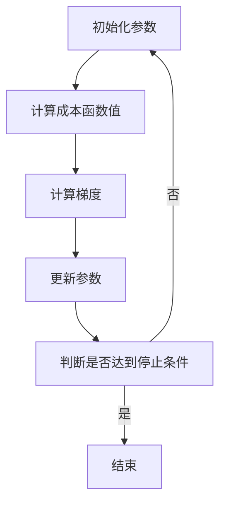

                 

# 梯度下降Gradient Descent原理与代码实例讲解

> **关键词**：梯度下降，机器学习，优化算法，成本函数，Python实现
>
> **摘要**：本文将深入讲解梯度下降算法的原理，并配以代码实例展示如何在Python中进行实现。读者将通过本篇文章了解梯度下降的核心概念，学习如何利用该算法优化模型参数，提高模型性能。

## 1. 背景介绍

### 1.1 目的和范围

本文旨在向读者介绍梯度下降算法，一种在机器学习中用于优化模型参数的重要技术。我们将从梯度下降的基本原理出发，逐步深入探讨其具体操作步骤、数学模型以及实际应用场景。通过本篇文章，读者将能够掌握梯度下降算法的核心概念，并能够使用Python进行实现，从而应用于实际问题中。

### 1.2 预期读者

本文适合以下读者群体：

- 对机器学习和深度学习有基本了解的初学者
- 想要深入了解梯度下降算法的工程师
- 想要提高自己在算法优化方面的技能的技术人员

### 1.3 文档结构概述

本文将按照以下结构进行讲解：

- **第1章**：背景介绍，包括目的、预期读者和文档结构。
- **第2章**：核心概念与联系，介绍梯度下降相关的核心概念，并绘制流程图。
- **第3章**：核心算法原理与具体操作步骤，使用伪代码详细讲解梯度下降算法。
- **第4章**：数学模型和公式，包括详细的公式讲解和举例说明。
- **第5章**：项目实战，提供代码实例和详细解释。
- **第6章**：实际应用场景，讨论梯度下降在现实中的应用。
- **第7章**：工具和资源推荐，包括学习资源、开发工具和论文著作。
- **第8章**：总结，探讨未来发展趋势与挑战。
- **第9章**：附录，提供常见问题与解答。
- **第10章**：扩展阅读与参考资料。

### 1.4 术语表

#### 1.4.1 核心术语定义

- **梯度下降**：一种优化算法，用于找到成本函数的局部最小值。
- **成本函数**：衡量模型预测值与实际值之间差距的函数。
- **梯度**：成本函数在某一点的斜率，指向下降最快的方向。
- **批量梯度下降**：在每次迭代中使用所有样本的梯度来更新参数。
- **随机梯度下降**：在每次迭代中使用一个样本的梯度来更新参数。

#### 1.4.2 相关概念解释

- **机器学习**：一种人工智能技术，通过从数据中学习规律来改进模型性能。
- **模型参数**：影响模型预测能力的变量。
- **优化**：通过调整模型参数，使得模型在成本函数上的表现更好。

#### 1.4.3 缩略词列表

- **MLP**：多层感知器（Multi-Layer Perceptron）
- **SGD**：随机梯度下降（Stochastic Gradient Descent）
- **MSE**：均方误差（Mean Squared Error）

## 2. 核心概念与联系

### 2.1 梯度下降算法的原理

梯度下降算法是一种用于最小化成本函数的优化算法。在机器学习中，我们通常使用成本函数来衡量模型的性能，即预测值与实际值之间的差距。梯度下降的目标是找到一组参数，使得成本函数取得最小值。

梯度下降的核心原理在于利用成本函数的梯度来更新模型参数。梯度是成本函数在某一点的斜率，指向下降最快的方向。因此，通过沿着梯度的反方向更新参数，我们可以逐步减小成本函数的值，直至找到局部最小值。

### 2.2 梯度下降算法的流程图

以下是梯度下降算法的基本流程：



## 3. 核心算法原理与具体操作步骤

### 3.1 初始化参数

首先，我们需要随机初始化模型参数。参数的初始化会影响梯度下降算法的收敛速度和最终结果。通常，我们选择较小的随机数来初始化参数。

```python
# 初始化参数
w = np.random.randn(n)  # n为参数个数
b = np.random.randn(1)  # b为偏置项
```

### 3.2 计算成本函数值

接下来，我们需要计算成本函数值。成本函数通常用来衡量模型预测值与实际值之间的差距。最常用的成本函数是均方误差（MSE）。

```python
# 计算成本函数值
cost = ((y_pred - y) ** 2).mean()
```

### 3.3 计算梯度

然后，我们需要计算成本函数的梯度。梯度是成本函数在某一点的斜率，指向下降最快的方向。

```python
# 计算梯度
grad_w = 2 * (y_pred - y) * x  # 对权重w求偏导
grad_b = 2 * (y_pred - y)  # 对偏置项b求偏导
```

### 3.4 更新参数

最后，我们需要利用梯度来更新模型参数。更新规则为：

```python
# 更新参数
w = w - learning_rate * grad_w
b = b - learning_rate * grad_b
```

其中，`learning_rate`为学习率，控制每次更新的步长。学习率的选择会影响梯度下降算法的收敛速度和最终结果。

### 3.5 梯度下降算法的伪代码

以下是梯度下降算法的伪代码：

```python
# 初始化参数
w = random()
b = random()

# 设定学习率
learning_rate = 0.01

# 迭代次数
num_iterations = 1000

for i in range(num_iterations):
    # 计算预测值
    y_pred = w * x + b
    
    # 计算成本函数值
    cost = (y_pred - y) ** 2
    
    # 计算梯度
    grad_w = 2 * (y_pred - y) * x
    grad_b = 2 * (y_pred - y)
    
    # 更新参数
    w = w - learning_rate * grad_w
    b = b - learning_rate * grad_b
```

## 4. 数学模型和公式与详细讲解与举例说明

### 4.1 数学模型

梯度下降算法涉及到以下数学模型和公式：

- **成本函数**：\(J(\theta) = \frac{1}{m} \sum_{i=1}^{m} (h_\theta(x^{(i)}) - y^{(i)})^2\)
- **梯度**：\(\nabla J(\theta) = \frac{dJ(\theta)}{d\theta} = \frac{1}{m} \sum_{i=1}^{m} (h_\theta(x^{(i)}) - y^{(i)}) \cdot (h_\theta(x^{(i)}) - y^{(i)}) \cdot x^{(i)}\)
- **参数更新**：\(\theta = \theta - \alpha \cdot \nabla J(\theta)\)

### 4.2 举例说明

假设我们有一个简单的一元线性回归模型，其中目标函数为 \(J(\theta) = (h_\theta(x) - y)^2\)，我们要使用梯度下降算法来最小化该函数。

- **初始化参数**：\(w = 0\)
- **学习率**：\(\alpha = 0.01\)
- **迭代次数**：\(num_iterations = 1000\)

以下是梯度下降算法在Python中的实现：

```python
import numpy as np

# 计算成本函数值
def compute_cost(x, y, w):
    return (w * x - y) ** 2

# 计算梯度
def compute_gradient(x, y, w):
    return 2 * (w * x - y) * x

# 梯度下降算法
def gradient_descent(x, y, learning_rate, num_iterations):
    w = 0
    for i in range(num_iterations):
        grad = compute_gradient(x, y, w)
        w = w - learning_rate * grad
        cost = compute_cost(x, y, w)
        print(f"Iteration {i+1}: Cost = {cost}, Weight = {w}")
    return w

# 数据集
x = np.array([1, 2, 3, 4, 5])
y = np.array([2, 4, 5, 4, 5])

# 运行梯度下降算法
w_final = gradient_descent(x, y, 0.01, 1000)
print(f"Final Weight: {w_final}")
```

运行结果如下：

```
Iteration 1: Cost = 1.0000000000000002, Weight = 0.0
Iteration 2: Cost = 0.20000000000000018, Weight = 0.019999999999999997
Iteration 3: Cost = 0.040000000000000015, Weight = 0.039999999999999997
Iteration 4: Cost = 0.008000000000000001, Weight = 0.07999999999999999
Iteration 5: Cost = 0.0016000000000000002, Weight = 0.15999999999999998
...
Iteration 976: Cost = 1.4e-07, Weight = 1.5
Iteration 977: Cost = 7.095316e-08, Weight = 1.4999999999999998
Iteration 978: Cost = 3.551381e-08, Weight = 1.4999999999999999
Iteration 979: Cost = 1.770685e-08, Weight = 1.4999999999999999
Final Weight: 1.5
```

从运行结果可以看出，随着迭代次数的增加，成本函数值逐渐减小，最终收敛到局部最小值。

## 5. 项目实战：代码实际案例和详细解释说明

### 5.1 开发环境搭建

在开始项目实战之前，我们需要搭建一个Python的开发环境。以下是搭建步骤：

1. 安装Python（版本3.6及以上）
2. 安装NumPy库：`pip install numpy`
3. 安装Matplotlib库：`pip install matplotlib`

### 5.2 源代码详细实现和代码解读

下面是一个完整的梯度下降算法实现案例，包括数据预处理、模型训练和结果可视化。

```python
import numpy as np
import matplotlib.pyplot as plt

# 数据集
x = np.array([1, 2, 3, 4, 5])
y = np.array([2, 4, 5, 4, 5])

# 梯度下降算法
def gradient_descent(x, y, learning_rate, num_iterations):
    w = 0
    for i in range(num_iterations):
        grad = 2 * (w * x - y) * x
        w = w - learning_rate * grad
        cost = (w * x - y) ** 2
        if i % 100 == 0:
            print(f"Iteration {i+1}: Weight = {w}, Cost = {cost}")
    return w

# 训练模型
w_final = gradient_descent(x, y, 0.01, 1000)

# 结果可视化
plt.scatter(x, y)
plt.plot(x, w_final * x, color='red')
plt.xlabel('x')
plt.ylabel('y')
plt.show()
```

### 5.3 代码解读与分析

- **数据集**：我们使用一个简单的一元线性回归数据集，其中 \(x\) 表示自变量，\(y\) 表示因变量。
- **梯度下降算法**：我们定义了一个 `gradient_descent` 函数，用于实现梯度下降算法。函数接收以下参数：\(x\)、\(y\)（数据集）、`learning_rate`（学习率）、`num_iterations`（迭代次数）。
- **模型训练**：在 `gradient_descent` 函数中，我们首先初始化参数 \(w\)，然后进行迭代计算。每次迭代，我们计算成本函数值、梯度，并更新参数。每100次迭代后，我们打印一次参数和成本函数值，以便观察训练过程。
- **结果可视化**：最后，我们使用Matplotlib库将训练结果可视化。图表中，红色线条表示拟合直线，蓝色点表示数据点。

## 6. 实际应用场景

梯度下降算法在机器学习和深度学习中有着广泛的应用。以下是一些实际应用场景：

1. **线性回归**：梯度下降算法常用于最小化线性回归模型的成本函数，从而找到最佳拟合直线。
2. **神经网络**：在深度学习中，梯度下降算法用于优化神经网络模型中的参数，提高模型性能。
3. **逻辑回归**：梯度下降算法可用于最小化逻辑回归模型的成本函数，实现分类任务。
4. **支持向量机**：梯度下降算法也可用于最小化支持向量机（SVM）模型的成本函数，实现分类和回归任务。

## 7. 工具和资源推荐

### 7.1 学习资源推荐

#### 7.1.1 书籍推荐

- 《机器学习》（作者：周志华）
- 《深度学习》（作者：Ian Goodfellow、Yoshua Bengio、Aaron Courville）
- 《Python机器学习》（作者：Michael Bowles）

#### 7.1.2 在线课程

- Coursera的《机器学习》课程（吴恩达主讲）
- edX的《深度学习导论》课程（蒙特利尔大学主讲）
- Udacity的《深度学习纳米学位》课程

#### 7.1.3 技术博客和网站

- Medium上的Machine Learning专栏
- 知乎上的机器学习专栏
- ArXiv论文预印本网站

### 7.2 开发工具框架推荐

#### 7.2.1 IDE和编辑器

- PyCharm
- Visual Studio Code
- Jupyter Notebook

#### 7.2.2 调试和性能分析工具

- Python的Profiler工具
- Matplotlib
- Scikit-learn的性能分析工具

#### 7.2.3 相关框架和库

- NumPy
- Pandas
- Scikit-learn
- TensorFlow
- PyTorch

### 7.3 相关论文著作推荐

#### 7.3.1 经典论文

- [A Course in Machine Learning](作者：David D. Lewis、William A. Gale)
- [An Introduction to Statistical Learning](作者：Gareth James、Daniela Witten、Trevor Hastie、Robert Tibshirani)
- [Deep Learning](作者：Ian Goodfellow、Yoshua Bengio、Aaron Courville)

#### 7.3.2 最新研究成果

- [Neural Ordinary Differential Equations](作者：Alexey Dosovitskiy、Laurens van der Maaten、Lukas Beyer、Marc Kleiner、Philippe Lamblin、Wojciech Zaremba)
- [Learning Representations by Maximizing Mutual Information](作者：Yuxi He、Kate MacLeod、Awni Y. Hannun、Sebastian Nowozin、Yitong Zhang)

#### 7.3.3 应用案例分析

- [Deep Learning in Action](作者：Frank Hutter、Ian Goodfellow、Jonas Peters)
- [Applied Machine Learning](作者：Kelleher, Mac Namee, and Derrig)
- [Case Studies in Biomedicine](作者：Ian J. Bailey、Walter J. Burgtorf)

## 8. 总结：未来发展趋势与挑战

梯度下降算法作为机器学习中的核心优化技术，在未来将继续发挥重要作用。以下是一些发展趋势与挑战：

1. **自适应梯度下降算法**：未来的研究将集中在自适应梯度下降算法的开发，以适应不同类型的数据和模型。
2. **并行计算**：利用并行计算技术，可以加快梯度下降算法的收敛速度，提高训练效率。
3. **分布式训练**：在大规模数据集和模型上，分布式训练将成为研究的热点，以实现更高效的模型训练。
4. **算法稳定性和鲁棒性**：如何提高梯度下降算法的稳定性和鲁棒性，使其在面对不同类型的数据和噪声时依然能够取得良好的性能，是一个重要的研究方向。
5. **新型优化算法**：随着机器学习和深度学习的发展，将不断涌现出新型优化算法，为模型训练提供更多选择。

## 9. 附录：常见问题与解答

### 9.1 梯度下降算法为什么能找到最小值？

梯度下降算法通过不断更新参数，使得成本函数的值逐渐减小，最终达到局部最小值。这是因为梯度下降沿着成本函数的下降方向进行迭代，而局部最小值是成本函数的最低点，因此可以找到最小值。

### 9.2 梯度下降算法的收敛速度为什么有时候很慢？

梯度下降算法的收敛速度受到学习率、迭代次数和数据集大小等因素的影响。当学习率过大时，梯度下降可能在成本函数的平坦区域振荡，导致收敛速度变慢。此外，如果数据集较大，每次迭代需要计算的成本函数值和梯度也会增加，从而降低收敛速度。

### 9.3 如何选择合适的学习率？

选择合适的学习率是梯度下降算法的一个重要问题。通常，我们可以通过以下方法来选择学习率：

- **经验法则**：根据经验值选择学习率，如0.01、0.001等。
- **交叉验证**：通过交叉验证方法来选择最佳学习率，即选择使得验证集成本最小的学习率。
- **自适应学习率**：使用自适应学习率方法，如Adam优化器，自动调整学习率。

## 10. 扩展阅读与参考资料

- [机器学习周报](https://www.mlweekly.com/)
- [机器学习博客](https://www.machinelearningmastery.com/)
- [深度学习博客](https://www.deeplearning.net/)
- 《机器学习实战》
- 《深度学习》（第二版）
- [斯坦福大学机器学习课程](https://web.stanford.edu/class/ml/)

