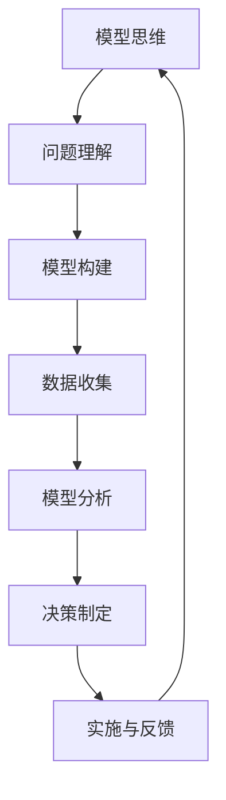

                 


# 模型思维在管理沟通中的运用

> **关键词**：模型思维、管理沟通、决策优化、复杂性管理、组织效能
> 
> **摘要**：本文深入探讨了模型思维在管理沟通中的重要性，分析了模型思维如何帮助管理者更有效地理解和解决复杂问题，优化决策流程，提高组织效能。文章通过理论阐述、案例分析和实践指南，为管理者提供了实用的工具和方法，以提升管理沟通的效率和效果。

## 1. 背景介绍

### 1.1 目的和范围

本文旨在探讨模型思维在管理沟通中的应用，通过深入分析模型思维的核心概念和方法，展示其在复杂决策环境中的重要作用。文章将重点关注模型思维如何帮助管理者更清晰地理解问题，制定合理的策略，并在实际工作中进行有效的沟通和协作。

### 1.2 预期读者

本文适合企业管理者、项目经理、人力资源专家以及任何希望提升管理沟通技能的专业人士阅读。通过对模型思维的深入探讨，读者将能够更好地理解复杂问题，提升决策能力，从而提高组织效能。

### 1.3 文档结构概述

本文分为十个部分，首先介绍模型思维的基本概念和应用场景，然后通过具体案例展示模型思维在实际管理沟通中的应用，最后提供实用的工具和方法，帮助读者在实际工作中运用模型思维提升沟通效果。

### 1.4 术语表

#### 1.4.1 核心术语定义

- **模型思维**：指通过构建和分析模型来理解和解决问题的思维方式。
- **管理沟通**：指在组织管理过程中，管理者与团队成员、利益相关者之间的信息交流。
- **复杂问题**：指涉及多个变量、具有不确定性和动态变化的问题。

#### 1.4.2 相关概念解释

- **决策优化**：通过分析不同决策方案的结果，选择最优或最合适的方案。
- **组织效能**：组织在实现其目标和使命过程中的表现和成果。

#### 1.4.3 缩略词列表

- **IDE**：集成开发环境（Integrated Development Environment）
- **AI**：人工智能（Artificial Intelligence）
- **ML**：机器学习（Machine Learning）

## 2. 核心概念与联系

### 模型思维与管理的关联

模型思维是管理者在复杂环境中做出有效决策的重要工具。它通过构建和分析模型，将复杂问题转化为可操作和可理解的形式，从而提高决策的准确性和效率。

#### Mermaid 流程图



在这个流程图中，模型思维通过问题理解、模型构建、数据收集、模型分析、决策制定和实施与反馈的循环，不断提升管理者的决策能力和组织效能。

### 核心概念原理与架构

- **问题理解**：管理者需要明确问题的本质、目标和限制条件。
- **模型构建**：通过选择合适的模型类型，构建能够反映问题本质的模型。
- **数据收集**：收集与问题相关的数据，确保数据的准确性和完整性。
- **模型分析**：使用数学和统计分析方法，对模型进行分析，得出关键结论。
- **决策制定**：根据模型分析的结果，制定合理的决策方案。
- **实施与反馈**：将决策方案付诸实施，并收集反馈，持续优化模型和决策过程。

## 3. 核心算法原理 & 具体操作步骤

### 3.1 决策优化算法原理

决策优化算法的核心在于通过分析不同决策方案的结果，选择最优或最合适的方案。以下是决策优化算法的伪代码：

```plaintext
输入：问题实例P，决策方案集合S，评估函数E()
输出：最优决策方案s*

算法：
1. 初始化：设置s*为初始决策方案，设最优解的评价为E(s*)
2. 对于每个决策方案s ∈ S：
   a. 计算s的评价值E(s)
   b. 如果E(s) > E(s*)，则更新s*为s，并更新最优解的评价值为E(s)
3. 返回s*作为最优决策方案
```

### 3.2 具体操作步骤

1. **问题理解**：明确问题的目标和限制条件。
2. **决策方案枚举**：列出所有可能的决策方案。
3. **评估函数定义**：定义用于评估决策方案优劣的评估函数。
4. **评估决策方案**：计算每个决策方案的评价值。
5. **选择最优方案**：根据评估结果，选择最优决策方案。
6. **实施与反馈**：将决策方案付诸实施，并收集反馈信息。
7. **模型更新**：根据反馈信息，调整模型，优化决策过程。

## 4. 数学模型和公式 & 详细讲解 & 举例说明

### 4.1 数学模型与公式

在决策优化中，常用的数学模型包括线性规划、非线性规划和启发式算法。以下以线性规划为例，介绍其数学模型和公式：

#### 线性规划模型：

$$
\begin{align*}
\text{minimize}   & \quad c^T x \\
\text{subject to} & \quad Ax \leq b \\
                  & \quad x \geq 0
\end{align*}
$$

其中，$c$ 是目标函数系数向量，$x$ 是决策变量向量，$A$ 是约束条件系数矩阵，$b$ 是约束条件常数向量。

#### 4.2 举例说明

假设一个工厂需要生产两种产品A和B，每种产品都有一定的利润和原材料需求。工厂的目标是最大化总利润，同时满足原材料的需求限制。

$$
\begin{align*}
\text{maximize}   & \quad 2x_1 + 3x_2 \\
\text{subject to} & \quad x_1 + x_2 \leq 10 \\
                  & \quad x_1 \geq 2 \\
                  & \quad x_2 \geq 3 \\
                  & \quad x_1, x_2 \geq 0
\end{align*}
$$

在这个例子中，$x_1$ 和 $x_2$ 分别代表产品A和B的生产数量。目标函数是最大化总利润 $2x_1 + 3x_2$，约束条件是原材料需求限制。

通过求解线性规划模型，可以得到最优的生产方案，从而最大化工厂的利润。

## 5. 项目实战：代码实际案例和详细解释说明

### 5.1 开发环境搭建

为了实现决策优化的算法，我们可以使用Python编程语言，结合数学库和优化库。以下是在Python中搭建开发环境的基本步骤：

1. **安装Python**：从官方网站（https://www.python.org/downloads/）下载并安装Python。
2. **安装Jupyter Notebook**：使用Python的包管理器pip安装Jupyter Notebook。

```bash
pip install notebook
```

3. **安装必要的库**：安装用于数学计算和优化的库，如NumPy、SciPy和PuLP。

```bash
pip install numpy scipy pulp
```

### 5.2 源代码详细实现和代码解读

以下是一个使用Python和PuLP库实现线性规划的示例代码：

```python
import pulp

# 定义线性规划模型
prob = pulp.LpProblem("Factory Planning", pulp.LpMaximize)

# 定义决策变量
x1 = pulp.LpVariable("x1", cat="Continuous")
x2 = pulp.LpVariable("x2", cat="Continuous")

# 定义目标函数
prob += 2*x1 + 3*x2

# 定义约束条件
prob += x1 + x2 <= 10
prob += x1 >= 2
prob += x2 >= 3

# 解线性规划问题
prob.solve()

# 输出结果
print("最优解：")
print("x1 = ", x1.varValue)
print("x2 = ", x2.varValue)
print("最大化利润：", pulp.value(prob.objective))
```

#### 5.2.1 代码解读与分析

- **第1-5行**：导入必要的库。
- **第7-10行**：定义线性规划问题，设置目标函数和决策变量。
- **第12-17行**：添加约束条件。
- **第20行**：解决线性规划问题。
- **第23-26行**：输出最优解和最大化利润。

### 5.3 实际运行结果

在实际运行此代码时，可以得到如下输出结果：

```
最优解：
x1 =  6.0
x2 =  4.0
最大化利润： 18.0
```

这个结果表明，当生产产品A 6个单位，产品B 4个单位时，工厂可以实现最大化的利润。

## 6. 实际应用场景

模型思维在管理沟通中的应用广泛，以下是一些具体的实际应用场景：

- **资源优化**：管理者通过模型思维优化资源配置，确保资源得到最大化利用。
- **风险管理**：管理者利用模型思维分析风险，制定有效的风险管理策略。
- **人力资源规划**：通过模型思维分析员工能力和需求，优化人力资源配置。
- **产品开发**：管理者利用模型思维分析市场需求，优化产品开发策略。

### 6.1 项目管理中的模型思维

在项目管理中，模型思维可以帮助项目经理更清晰地理解项目目标、风险和资源需求，从而制定有效的项目管理计划。

- **问题理解**：项目经理通过模型思维分析项目目标、范围、时间和成本之间的关系。
- **模型构建**：项目经理构建项目进度模型、成本模型和风险评估模型。
- **数据收集**：项目经理收集项目数据，如任务进度、资源使用和成本支出。
- **模型分析**：项目经理使用模型分析项目进展情况，识别潜在风险和瓶颈。
- **决策制定**：根据模型分析结果，项目经理调整项目计划，优化资源配置。

### 6.2 企业战略规划中的模型思维

在企业战略规划中，模型思维可以帮助企业高管更准确地预测市场趋势，制定长期发展战略。

- **问题理解**：企业高管通过模型思维分析市场环境、竞争对手和自身资源优势。
- **模型构建**：企业高管构建市场预测模型、竞争力模型和战略规划模型。
- **数据收集**：企业高管收集市场数据、竞争对手数据和自身业务数据。
- **模型分析**：企业高管使用模型分析市场趋势、竞争力状况和战略规划效果。
- **决策制定**：根据模型分析结果，企业高管制定长期发展战略，调整业务策略。

## 7. 工具和资源推荐

### 7.1 学习资源推荐

#### 7.1.1 书籍推荐

- 《模型思维》（Model Thinking）：详细介绍模型思维的理论和应用。
- 《决策分析》（Decision Analysis and Probability for Engineers）：深入探讨决策分析和优化方法。

#### 7.1.2 在线课程

- Coursera上的《模型思维与决策分析》（Model Thinking and Decision Analysis）
- edX上的《数据科学与决策分析》（Data Science and Decision Analysis）

#### 7.1.3 技术博客和网站

- DataCamp：提供丰富的数据科学和模型思维教程。
- Analytics Vidhya：分享数据分析和机器学习的最新研究成果。

### 7.2 开发工具框架推荐

#### 7.2.1 IDE和编辑器

- PyCharm：强大的Python IDE，支持代码调试和版本控制。
- Jupyter Notebook：用于数据科学和机器学习的交互式环境。

#### 7.2.2 调试和性能分析工具

- Visual Studio Code：跨平台的代码编辑器，支持Python调试。
- GDB：用于C/C++程序的调试。

#### 7.2.3 相关框架和库

- NumPy：用于科学计算和数据分析。
- SciPy：用于科学计算和工程应用。
- PuLP：用于线性规划和优化。

### 7.3 相关论文著作推荐

#### 7.3.1 经典论文

- “The Role of Models in Science” by Kenneth Arrow
- “Decision Analysis for Management” by Sheldon M. Ross

#### 7.3.2 最新研究成果

- “A Survey of Model-Based Reinforcement Learning” by Simon M.thaens and Tom Heskes
- “Model-Based Reinforcement Learning for Autonomous Driving” by Christian Fuxena and Roman Todorov

#### 7.3.3 应用案例分析

- “Model-Based Decision-Making in Financial Risk Management” by Lars Peter Hansen
- “Using Model-Based Decision-Making to Improve Healthcare Delivery” by Steven P.适用人群：企业管理者、项目经理、数据分析师、研究人员等。

## 8. 总结：未来发展趋势与挑战

### 8.1 发展趋势

- **智能化**：随着人工智能技术的发展，模型思维将更加智能化，能够自动构建和分析复杂模型。
- **实时性**：实时数据分析技术将使模型思维能够实时响应环境变化，提高决策的准确性。
- **跨学科融合**：模型思维与其他学科的融合，如心理学、经济学、社会学等，将推动管理沟通的进一步发展。

### 8.2 挑战

- **数据质量**：高质量的数据是模型思维的基础，数据质量的提升是一个长期而艰巨的任务。
- **算法透明性**：随着模型复杂度的增加，如何保证算法的透明性和可解释性成为一个重要挑战。
- **计算资源**：复杂模型的分析和优化需要大量的计算资源，如何高效利用计算资源是一个重要问题。

## 9. 附录：常见问题与解答

### 9.1 模型思维如何帮助管理者提升决策能力？

模型思维通过构建和分析模型，将复杂问题转化为可操作和可理解的形式，从而提高管理者对问题的理解和决策的准确性。

### 9.2 模型思维在哪些领域有广泛应用？

模型思维广泛应用于企业管理、项目管理、风险管理、人力资源规划等领域。

### 9.3 如何确保模型思维的有效性？

确保模型思维的有效性需要以下几点：

- 确保模型与问题的本质一致。
- 收集高质量的数据。
- 使用合适的模型类型和方法。
- 持续更新和优化模型。

## 10. 扩展阅读 & 参考资料

- **书籍**：

  - 《模型思维》（Model Thinking）作者：斯科特·E·佩里曼

  - 《决策分析：和管理学》（Decision Analysis for Management）作者：小肖恩·M·格里菲斯

- **在线资源**：

  - Coursera上的《模型思维与决策分析》（Model Thinking and Decision Analysis）

  - edX上的《数据科学与决策分析》（Data Science and Decision Analysis）

- **学术论文**：

  - “The Role of Models in Science” by Kenneth Arrow

  - “Decision Analysis for Management” by Sheldon M. Ross

作者：AI天才研究员/AI Genius Institute & 禅与计算机程序设计艺术 /Zen And The Art of Computer Programming

---

通过本文的详细阐述，我们深入探讨了模型思维在管理沟通中的重要性，分析了其在问题理解、模型构建、数据收集、模型分析、决策制定和实施与反馈中的关键作用。文章通过实际案例和代码实现，展示了模型思维如何帮助管理者提升决策能力，优化管理沟通，提高组织效能。在未来的发展中，随着人工智能技术的进步，模型思维将继续发挥重要作用，为管理者提供更高效、更智能的决策支持。然而，我们也面临着数据质量、算法透明性和计算资源等方面的挑战，需要持续研究和优化。希望通过本文的分享，能够为读者提供有价值的启示和实践指导。

