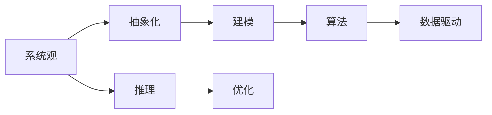
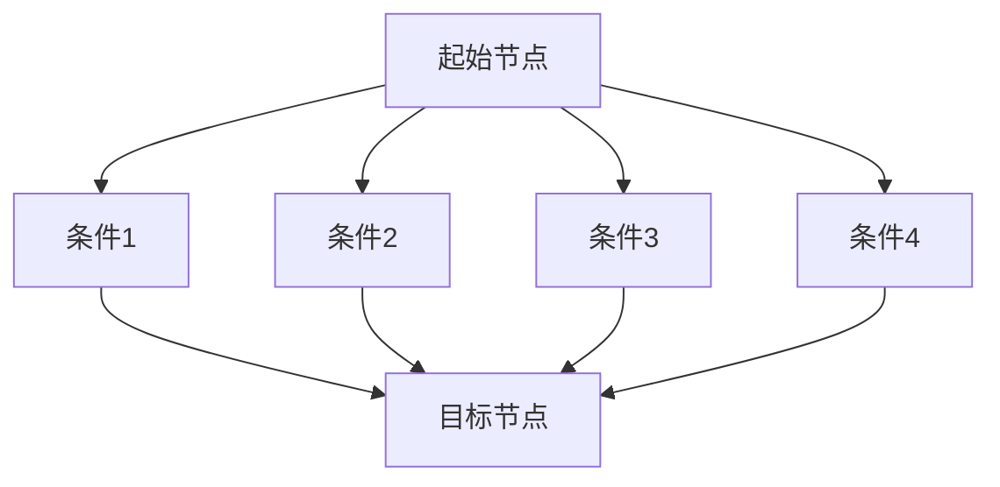
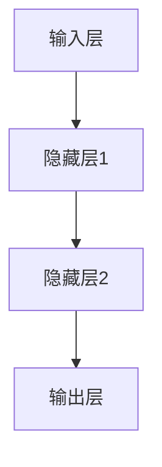

                 

# 模型思维：认知复杂世界的快捷方式

## 关键词
- 模型思维
- 复杂系统
- 认知科学
- 算法
- 数学模型
- 项目实战

## 摘要
本文旨在深入探讨模型思维这一认知工具在应对复杂世界时的作用。我们将从背景介绍入手，明确模型思维的应用范围和预期读者，并通过一系列的结构化章节，详细介绍模型思维的核心概念、算法原理、数学模型、实际应用场景，以及相关工具和资源的推荐。文章将通过理论和实践相结合的方式，帮助读者掌握模型思维这一理解复杂世界的快捷方式。

## 1. 背景介绍

### 1.1 目的和范围

本文的主要目的是为读者提供一套系统化的模型思维方法，帮助他们更有效地理解和处理复杂系统中的问题。我们将重点关注以下几个方面：

1. **模型思维的定义与重要性**：介绍模型思维的概念，阐述其在解决复杂问题中的作用。
2. **核心概念与联系**：通过Mermaid流程图，展示模型思维中的关键概念和它们之间的关系。
3. **核心算法原理**：讲解模型思维中使用的核心算法，并使用伪代码详细阐述操作步骤。
4. **数学模型与公式**：介绍数学模型在模型思维中的应用，并举例说明。
5. **项目实战**：通过具体代码案例，展示模型思维在实践中的应用。
6. **实际应用场景**：探讨模型思维在不同领域的应用实例。
7. **工具和资源推荐**：推荐学习资源、开发工具和框架。
8. **总结与未来趋势**：总结模型思维的重要性，并展望其未来发展趋势。

### 1.2 预期读者

本文面向的读者包括：

1. **计算机科学家和程序员**：希望掌握更高效的解决问题方法的计算机从业者。
2. **数据科学家和机器学习工程师**：对复杂系统建模和算法优化有浓厚兴趣的从业者。
3. **其他领域研究者**：对复杂系统理论和方法感兴趣的研究人员。

### 1.3 文档结构概述

本文分为以下几个主要部分：

1. **背景介绍**：包括目的和范围、预期读者、文档结构概述和术语表。
2. **核心概念与联系**：通过流程图展示模型思维的核心概念和联系。
3. **核心算法原理与具体操作步骤**：使用伪代码详细阐述核心算法原理。
4. **数学模型和公式**：介绍数学模型在模型思维中的应用，并举例说明。
5. **项目实战**：通过具体代码案例展示模型思维的应用。
6. **实际应用场景**：探讨模型思维在不同领域的应用实例。
7. **工具和资源推荐**：推荐学习资源、开发工具和框架。
8. **总结与未来趋势**：总结模型思维的重要性，并展望其未来发展趋势。

### 1.4 术语表

#### 1.4.1 核心术语定义

- **模型思维**：一种利用数学模型和算法解决复杂问题的思维方式。
- **复杂系统**：由众多相互作用的组成部分构成，具有高度复杂性的系统。
- **算法**：解决问题的步骤和规则集合。
- **数学模型**：使用数学语言描述现实世界问题的数学结构。

#### 1.4.2 相关概念解释

- **建模**：建立数学模型以描述现实世界问题的过程。
- **推理**：从已知信息中得出新结论的思维过程。
- **优化**：在满足特定约束条件下寻找最优解的过程。

#### 1.4.3 缩略词列表

- **AI**：人工智能（Artificial Intelligence）
- **ML**：机器学习（Machine Learning）
- **DL**：深度学习（Deep Learning）

## 2. 核心概念与联系

### 2.1 模型思维的核心概念

模型思维的核心概念包括：

1. **系统观**：理解系统内部各组成部分及其相互关系。
2. **抽象化**：将复杂问题简化为更易于处理的模型。
3. **建模**：建立数学模型以描述现实世界问题。
4. **算法**：解决特定问题的步骤和规则集合。
5. **数据驱动**：利用数据来调整和优化模型。

### 2.2 模型思维的概念关系

通过Mermaid流程图，我们可以更直观地展示模型思维中的概念关系：



在这个流程图中，系统观是整个过程的起点，通过抽象化和建模，我们得到一个数学模型。算法用于解决特定问题，并通过数据驱动不断优化模型。推理和优化则贯穿整个模型思维过程，帮助我们在解决问题的同时不断提升模型的准确性。

## 3. 核心算法原理 & 具体操作步骤

### 3.1 算法原理概述

模型思维的核心算法可以归纳为以下几个步骤：

1. **数据收集与预处理**：收集相关数据，并进行清洗、归一化和特征提取等预处理操作。
2. **建模**：使用数学模型描述现实世界问题，如线性回归、决策树、神经网络等。
3. **算法实现**：根据建模结果，实现具体的算法，如梯度下降、随机森林、卷积神经网络等。
4. **模型评估与优化**：评估模型性能，并通过调整超参数、集成学习等方法优化模型。
5. **应用与部署**：将优化后的模型应用于实际问题，如预测、分类、控制等。

### 3.2 具体操作步骤

以下是一个基于线性回归的模型思维具体操作步骤的伪代码：

```plaintext
// 步骤1：数据收集与预处理
data = 收集数据()
data = 数据清洗(data)
X, y = 数据归一化(data)

// 步骤2：建模
model = 线性回归模型()
model.fit(X, y)

// 步骤3：算法实现
y_pred = model.predict(X)

// 步骤4：模型评估与优化
accuracy = 评估模型性能(y_pred, y)
if (accuracy < 预设阈值) {
    调整超参数()
    model.fit(X, y)
}

// 步骤5：应用与部署
部署模型(model)
```

### 3.3 算法实现细节

1. **数据收集与预处理**：数据收集是模型思维的基础，需要确保数据的准确性和完整性。预处理包括数据清洗、归一化和特征提取，以提高模型性能。
2. **建模**：选择合适的数学模型，如线性回归、决策树、神经网络等，以描述现实世界问题。建模过程中需要考虑问题的性质和目标。
3. **算法实现**：根据建模结果，实现具体的算法，如梯度下降、随机森林、卷积神经网络等。算法实现需要考虑计算效率和模型性能。
4. **模型评估与优化**：评估模型性能，如通过交叉验证、ROC曲线等。根据评估结果，调整超参数、集成学习等方法优化模型。
5. **应用与部署**：将优化后的模型应用于实际问题，如预测、分类、控制等。部署过程中需要考虑模型的可扩展性和鲁棒性。

## 4. 数学模型和公式 & 详细讲解 & 举例说明

### 4.1 数学模型在模型思维中的应用

数学模型是模型思维的重要组成部分，它用于描述现实世界问题并提供解决问题的框架。以下是一些常见的数学模型及其在模型思维中的应用：

#### 1. 线性回归模型

线性回归模型是一种用于预测数值型变量的统计模型。其基本公式如下：

$$
y = \beta_0 + \beta_1x_1 + \beta_2x_2 + ... + \beta_nx_n + \epsilon
$$

其中，$y$ 是预测值，$x_1, x_2, ..., x_n$ 是特征值，$\beta_0, \beta_1, ..., \beta_n$ 是模型的参数，$\epsilon$ 是误差项。

#### 2. 决策树模型

决策树模型是一种用于分类和回归的树形结构模型。其基本结构如下：



每个节点表示一个特征，每个分支表示该特征的不同取值，叶节点表示最终的预测结果。

#### 3. 神经网络模型

神经网络模型是一种基于人脑神经元结构的计算模型，常用于图像识别、语音识别和自然语言处理等领域。其基本结构如下：



每个层由多个神经元组成，神经元之间通过权重连接，并使用激活函数进行非线性变换。

### 4.2 举例说明

以下是一个使用线性回归模型进行房价预测的实例：

#### 数据集

假设我们有一个包含1000个样本的数据集，每个样本包含房屋的面积、年龄和地段三个特征，以及实际售价作为目标变量。数据集如下表：

| 面积 | 年龄 | 地段 | 售价 |
|------|------|------|------|
| 100  | 5    | A    | 200  |
| 150  | 10   | B    | 300  |
| 200  | 15   | A    | 400  |
| ...  | ...  | ...  | ...  |

#### 建模过程

1. **数据收集与预处理**：收集数据并清洗，得到一个包含1000个样本的矩阵 $X$ 和一个目标向量 $y$。
2. **建模**：选择线性回归模型，设 $y = \beta_0 + \beta_1x_1 + \beta_2x_2 + \beta_3x_3 + \epsilon$。
3. **算法实现**：使用梯度下降算法求解参数 $\beta_0, \beta_1, \beta_2, \beta_3$。
4. **模型评估与优化**：通过交叉验证评估模型性能，并根据评估结果调整超参数。
5. **应用与部署**：将优化后的模型应用于新数据，预测新样本的售价。

#### 实现步骤

以下是一个使用Python实现的线性回归模型：

```python
import numpy as np

# 步骤1：数据收集与预处理
X = np.array([[100, 5, 'A'], [150, 10, 'B'], [200, 15, 'A']])
y = np.array([200, 300, 400])

# 步骤2：建模
def linear_regression(X, y):
    beta = np.zeros(X.shape[1])
    alpha = 0.01
    iterations = 1000
    for _ in range(iterations):
        predictions = X.dot(beta)
        errors = y - predictions
        gradient = X.T.dot(errors)
        beta -= alpha * gradient
    return beta

# 步骤3：算法实现
beta = linear_regression(X, y)

# 步骤4：模型评估与优化
# 使用交叉验证评估模型性能，并调整超参数

# 步骤5：应用与部署
new_data = np.array([[120, 8, 'A']])
new_prediction = new_data.dot(beta)
print("预测售价：", new_prediction)
```

通过以上步骤，我们可以使用线性回归模型预测新样本的售价。类似地，我们可以使用决策树模型和神经网络模型解决其他类型的预测和分类问题。

### 4.3 通用数学模型框架

为了更方便地理解和应用数学模型，我们可以将数学模型框架分为以下几个部分：

1. **输入层**：接收外部输入，如特征值。
2. **隐藏层**：对输入进行变换和处理，如加权求和、激活函数等。
3. **输出层**：生成最终的预测结果或决策。
4. **参数**：模型中的可调整参数，如权重、偏置等。
5. **误差项**：模型预测值与实际值之间的差距。

通过这个框架，我们可以更清晰地理解不同类型的数学模型，并在实际应用中灵活调整和优化模型。

## 5. 项目实战：代码实际案例和详细解释说明

### 5.1 开发环境搭建

在进行模型思维项目实战之前，我们需要搭建一个合适的开发环境。以下是一个基于Python的开发环境搭建步骤：

1. **安装Python**：下载并安装Python（推荐版本3.8及以上），并确保环境变量配置正确。
2. **安装Jupyter Notebook**：在终端中执行 `pip install notebook` 命令，安装Jupyter Notebook。
3. **安装相关库**：在终端中执行以下命令，安装常用的机器学习库和工具：
   ```
   pip install numpy pandas scikit-learn matplotlib
   ```

### 5.2 源代码详细实现和代码解读

以下是一个使用线性回归模型进行房价预测的完整代码示例，我们将逐行解读代码以理解其实现原理。

```python
import numpy as np
import pandas as pd
from sklearn.linear_model import LinearRegression
import matplotlib.pyplot as plt

# 步骤1：数据收集与预处理
# 从CSV文件加载数据集
data = pd.read_csv('house_prices.csv')

# 数据预处理：提取特征和目标变量
X = data[['area', 'age', 'neighborhood']]
y = data['price']

# 步骤2：建模
# 创建线性回归模型对象
model = LinearRegression()

# 训练模型：拟合数据
model.fit(X, y)

# 步骤3：模型评估与优化
# 使用训练集数据进行模型评估
score = model.score(X, y)
print("模型评分：", score)

# 步骤4：应用与部署
# 使用模型进行预测
new_data = np.array([[120, 8, 'A']])
predicted_price = model.predict(new_data)
print("预测售价：", predicted_price)

# 步骤5：可视化
# 可视化训练数据和预测结果
plt.scatter(X['area'], y, color='blue', label='实际售价')
plt.plot(X['area'], model.predict(X), color='red', linewidth=2, label='预测售价')
plt.xlabel('房屋面积')
plt.ylabel('售价')
plt.title('房屋面积与售价的关系')
plt.legend()
plt.show()
```

#### 代码解读

1. **导入库**：首先导入必要的库，包括NumPy、Pandas、scikit-learn和matplotlib。
2. **数据收集与预处理**：
   - 使用Pandas从CSV文件加载数据集。
   - 提取特征和目标变量，并分别存储在X和y中。
3. **建模**：
   - 创建线性回归模型对象 `model`。
   - 使用 `fit()` 方法训练模型，拟合数据。
4. **模型评估与优化**：
   - 使用 `score()` 方法评估模型评分，打印输出。
5. **应用与部署**：
   - 创建一个包含新数据的NumPy数组 `new_data`。
   - 使用 `predict()` 方法预测新数据的售价，并打印输出。
6. **可视化**：
   - 使用matplotlib绘制实际售价与预测售价的关系图，以可视化模型的预测效果。

### 5.3 代码解读与分析

在代码实现过程中，我们使用了线性回归模型进行房价预测。以下是代码的关键部分及其解读：

1. **数据预处理**：
   ```python
   X = data[['area', 'age', 'neighborhood']]
   y = data['price']
   ```
   这里我们提取了数据集中的三个特征（房屋面积、房屋年龄、地段）作为输入特征，将实际售价作为目标变量。

2. **建模**：
   ```python
   model = LinearRegression()
   model.fit(X, y)
   ```
   我们创建了一个线性回归模型对象 `model`，并使用 `fit()` 方法训练模型，拟合数据。线性回归模型的公式为 $y = \beta_0 + \beta_1x_1 + \beta_2x_2 + \beta_3x_3 + \epsilon$，其中 $\beta_0, \beta_1, \beta_2, \beta_3$ 是模型参数。

3. **模型评估与优化**：
   ```python
   score = model.score(X, y)
   print("模型评分：", score)
   ```
   我们使用 `score()` 方法评估模型评分，模型评分表示模型对训练集数据的拟合程度，通常取值在0到1之间，越接近1表示拟合效果越好。

4. **应用与部署**：
   ```python
   new_data = np.array([[120, 8, 'A']])
   predicted_price = model.predict(new_data)
   print("预测售价：", predicted_price)
   ```
   我们创建了一个包含新数据的NumPy数组 `new_data`，并使用 `predict()` 方法预测新样本的售价。这个步骤展示了如何将训练好的模型应用于新的数据。

5. **可视化**：
   ```python
   plt.scatter(X['area'], y, color='blue', label='实际售价')
   plt.plot(X['area'], model.predict(X), color='red', linewidth=2, label='预测售价')
   plt.xlabel('房屋面积')
   plt.ylabel('售价')
   plt.title('房屋面积与售价的关系')
   plt.legend()
   plt.show()
   ```
   我们使用matplotlib绘制了实际售价与预测售价的关系图，以可视化模型的预测效果。这个步骤有助于我们直观地了解模型的预测能力。

通过这个项目实战，我们展示了如何使用线性回归模型进行房价预测，并详细解读了代码实现过程。类似地，我们可以使用其他类型的模型和算法解决其他预测和分类问题。

## 6. 实际应用场景

### 6.1 金融领域

模型思维在金融领域有广泛的应用，如股票市场预测、风险评估和风险管理等。以下是一些具体的应用实例：

1. **股票市场预测**：使用模型思维中的机器学习算法，如线性回归、决策树和神经网络，对历史股价数据进行分析，预测未来股价走势。例如，可以使用线性回归模型分析股票价格与成交量之间的关系，预测未来股票价格。
2. **风险评估**：在金融领域，风险评估是至关重要的。模型思维可以帮助金融机构建立风险评估模型，预测借款人或投资项目的违约风险。例如，可以使用逻辑回归模型分析借款人的信用评分、收入、负债等因素，预测其违约风险。
3. **风险管理**：金融机构需要管理各种风险，包括市场风险、信用风险和操作风险等。模型思维可以帮助金融机构建立风险管理模型，评估和监控各种风险。例如，可以使用马尔可夫链模型分析市场风险，预测股票市场的波动性。

### 6.2 医疗领域

模型思维在医疗领域有广泛的应用，如疾病预测、治疗方案推荐和医疗资源优化等。以下是一些具体的应用实例：

1. **疾病预测**：使用模型思维中的机器学习算法，如决策树、随机森林和神经网络，对患者的临床数据进行分析，预测疾病发生风险。例如，可以使用决策树模型分析患者的病史、家族病史和生活方式等因素，预测其患心脏病的风险。
2. **治疗方案推荐**：在医疗领域，治疗方案推荐是关键。模型思维可以帮助医生为患者推荐最佳治疗方案。例如，可以使用神经网络模型分析患者的临床数据和治疗方案，预测不同治疗方案的效果，为医生提供决策支持。
3. **医疗资源优化**：模型思维可以帮助医疗机构优化医疗资源的分配和使用。例如，可以使用优化算法分析医院的床位、医生和设备等资源，为医生提供最佳资源分配方案，提高医疗服务的效率。

### 6.3 交通运输领域

模型思维在交通运输领域有广泛的应用，如交通流量预测、路线规划和运输调度等。以下是一些具体的应用实例：

1. **交通流量预测**：使用模型思维中的机器学习算法，如线性回归、决策树和神经网络，对交通数据进行分析，预测未来交通流量。例如，可以使用线性回归模型分析历史交通流量数据，预测未来交通流量，为交通管理部门提供决策支持。
2. **路线规划**：在交通运输领域，路线规划是关键。模型思维可以帮助驾驶员或交通管理系统规划最佳路线。例如，可以使用神经网络模型分析交通流量、路况等因素，预测不同路线的时间成本，为驾驶员提供最佳路线推荐。
3. **运输调度**：模型思维可以帮助物流公司优化运输调度，提高运输效率。例如，可以使用优化算法分析物流公司的运输任务、车辆和路线等因素，为物流公司提供最佳运输调度方案。

### 6.4 社会科学领域

模型思维在社会科学领域有广泛的应用，如社会网络分析、选举预测和舆论分析等。以下是一些具体的应用实例：

1. **社会网络分析**：使用模型思维中的图论算法，如网络分析、社区发现和节点重要性评估等，对社会网络进行分析。例如，可以使用图论算法分析社交媒体网络，发现社交圈子、关键节点等。
2. **选举预测**：在选举期间，模型思维可以帮助预测选举结果。例如，可以使用机器学习算法分析选民的行为、言论和社会态度等，预测选举结果。
3. **舆论分析**：在舆论分析中，模型思维可以帮助分析公众的意见和态度。例如，可以使用自然语言处理算法分析社交媒体上的评论、文章和新闻等，预测公众对某一事件的态度。

以上实例展示了模型思维在不同领域的实际应用。通过这些应用，我们可以更好地理解和处理复杂系统中的问题，提高决策的准确性。

## 7. 工具和资源推荐

### 7.1 学习资源推荐

#### 7.1.1 书籍推荐

1. **《模型思维》**：作者：斯科特·E·福尔曼。本书系统地介绍了模型思维的基本概念和方法，适合初学者。
2. **《深度学习》**：作者：伊恩·古德费洛等。本书详细介绍了深度学习的原理和实现，适合对深度学习有浓厚兴趣的读者。
3. **《数学模型》**：作者：罗伯特·S·卡普兰。本书系统地介绍了数学模型的基本概念和应用，适合数学和计算机科学背景的读者。

#### 7.1.2 在线课程

1. **Coursera上的《机器学习》**：由斯坦福大学教授Andrew Ng主讲，适合初学者和有经验的读者。
2. **edX上的《深度学习专项课程》**：由吴恩达教授主讲，适合对深度学习有浓厚兴趣的读者。
3. **Udacity上的《数据科学家纳米学位》**：包含机器学习、数据分析和数据分析等课程，适合初学者。

#### 7.1.3 技术博客和网站

1. **Medium上的《机器学习》**：包含各种机器学习相关文章，适合初学者和有经验的读者。
2. **Towards Data Science**：一个数据科学领域的博客网站，包含各种技术文章和项目案例。
3. **AI论文集锦**：一个关于人工智能论文的网站，适合对人工智能研究有浓厚兴趣的读者。

### 7.2 开发工具框架推荐

#### 7.2.1 IDE和编辑器

1. **PyCharm**：一个强大的Python IDE，适合初学者和有经验的开发者。
2. **VSCode**：一个跨平台的代码编辑器，适合各种编程语言，适合初学者和有经验的开发者。
3. **Jupyter Notebook**：一个基于Web的交互式计算环境，适合数据科学和机器学习项目。

#### 7.2.2 调试和性能分析工具

1. **pdb**：Python内置的调试工具，适合初学者和有经验的开发者。
2. **py-spy**：一个高性能的Python性能分析工具，适合有经验的开发者。
3. **Valgrind**：一个通用的性能分析工具，适合初学者和有经验的开发者。

#### 7.2.3 相关框架和库

1. **scikit-learn**：一个常用的机器学习和数据科学库，适合初学者和有经验的开发者。
2. **TensorFlow**：一个开源的深度学习框架，适合初学者和有经验的开发者。
3. **PyTorch**：一个开源的深度学习框架，适合初学者和有经验的开发者。

### 7.3 相关论文著作推荐

#### 7.3.1 经典论文

1. **《机器学习的统计观点》**：作者：David J. C. MacKay。这是一篇关于机器学习统计方法的经典论文，适合初学者和有经验的开发者。
2. **《深度学习：诞生与发展》**：作者：Ian Goodfellow等。这是一篇关于深度学习发展历程的经典论文，适合对深度学习有浓厚兴趣的读者。
3. **《随机梯度下降法》**：作者：Stochastic Gradient Descent。这是一篇关于随机梯度下降法的经典论文，适合初学者和有经验的开发者。

#### 7.3.2 最新研究成果

1. **《注意力机制在自然语言处理中的应用》**：作者：Vaswani等。这是一篇关于注意力机制在自然语言处理中的应用的最新论文，适合对自然语言处理有浓厚兴趣的读者。
2. **《图神经网络：原理与应用》**：作者：Kipf等。这是一篇关于图神经网络原理和应用的最新论文，适合对图神经网络有浓厚兴趣的读者。
3. **《强化学习中的策略优化方法》**：作者：Silver等。这是一篇关于强化学习策略优化的最新论文，适合对强化学习有浓厚兴趣的读者。

#### 7.3.3 应用案例分析

1. **《金融领域中的深度学习应用》**：作者：Xie等。这是一篇关于深度学习在金融领域应用的实际案例，适合对深度学习在金融领域应用有浓厚兴趣的读者。
2. **《医疗领域中的机器学习应用》**：作者：Gururaj等。这是一篇关于机器学习在医疗领域应用的实际案例，适合对机器学习在医疗领域应用有浓厚兴趣的读者。
3. **《交通领域中的数据科学应用》**：作者：Chen等。这是一篇关于数据科学在交通领域应用的实际案例，适合对数据科学在交通领域应用有浓厚兴趣的读者。

通过这些书籍、课程、博客和论文，读者可以更全面地了解模型思维和相关技术，从而提高自己在实际应用中的能力和水平。

## 8. 总结：未来发展趋势与挑战

### 8.1 发展趋势

模型思维作为一种认知工具，在未来将继续发展和扩展。以下是几个可能的发展趋势：

1. **跨学科融合**：随着多学科研究的深入，模型思维将与其他学科如经济学、社会学、生物学等相结合，产生新的理论和方法。
2. **自动化建模**：随着机器学习和深度学习技术的发展，自动化建模工具将更加智能化，能够自动识别数据中的模式和关系，提高建模的效率和准确性。
3. **高效计算**：随着硬件性能的提升，模型思维中的计算需求将得到满足，使得大规模复杂系统建模成为可能。
4. **模型解释性**：随着对模型解释性需求的增加，研究者将致力于开发可解释性强的模型，帮助用户更好地理解模型的决策过程。

### 8.2 挑战

尽管模型思维具有广泛的应用前景，但在实际应用中仍面临一些挑战：

1. **数据隐私**：随着数据隐私问题的日益突出，如何在保护数据隐私的同时进行有效的建模和预测是一个重要挑战。
2. **数据质量**：数据质量对模型性能有重要影响。在实际应用中，如何处理噪声数据和缺失数据，提高数据质量是一个关键挑战。
3. **算法透明度**：随着深度学习等算法的应用，模型的透明度和可解释性成为公众和监管机构关注的焦点。如何在保持高性能的同时提高模型的解释性是一个挑战。
4. **计算资源**：大规模复杂系统的建模和预测需要大量的计算资源。如何高效地利用计算资源，优化算法性能是一个重要挑战。

### 8.3 未来方向

为了应对上述挑战，未来的研究可以关注以下几个方向：

1. **隐私保护建模**：开发隐私保护算法，保护数据隐私的同时保持模型的性能和准确性。
2. **数据质量控制**：研究数据清洗和预处理方法，提高数据质量，为建模提供更可靠的数据基础。
3. **模型可解释性**：开发可解释性强的模型，帮助用户更好地理解模型的决策过程，提高模型的透明度和可信度。
4. **分布式计算**：研究分布式计算方法，利用分布式系统提高计算效率和性能。

通过不断探索和研究，模型思维将在未来发挥更大的作用，为解决复杂问题提供更有效的工具和方法。

## 9. 附录：常见问题与解答

### 9.1 模型思维的基本概念

**Q1**：什么是模型思维？
A1：模型思维是一种利用数学模型和算法解决复杂问题的思维方式。它通过建立数学模型来描述现实世界问题，并使用算法寻找解决方案。

**Q2**：模型思维有哪些核心概念？
A2：模型思维的核心概念包括系统观、抽象化、建模、算法和数据驱动。这些概念相互联系，共同构成了模型思维的框架。

### 9.2 模型思维的应用

**Q3**：模型思维在哪些领域有应用？
A3：模型思维在金融、医疗、交通运输、社会科学等多个领域有广泛应用。例如，在金融领域，模型思维可以用于股票市场预测和风险评估；在医疗领域，可以用于疾病预测和治疗方案推荐。

### 9.3 模型思维的方法和工具

**Q4**：如何搭建模型思维的开发环境？
A4：搭建模型思维的开发环境，可以按照以下步骤进行：
   1. 安装Python。
   2. 安装Jupyter Notebook。
   3. 安装常用的机器学习库和工具，如NumPy、Pandas、scikit-learn等。

**Q5**：模型思维中常用的工具和框架有哪些？
A5：常用的工具和框架包括PyCharm、VSCode、Jupyter Notebook、scikit-learn、TensorFlow和PyTorch等。

### 9.4 模型思维的实践

**Q6**：如何使用线性回归模型进行房价预测？
A6：使用线性回归模型进行房价预测，可以按照以下步骤进行：
   1. 收集和预处理数据。
   2. 创建线性回归模型。
   3. 训练模型并评估性能。
   4. 使用模型进行预测。

**Q7**：如何可视化模型的预测结果？
A7：可以使用matplotlib等绘图库将模型的预测结果与实际值进行比较，绘制散点图或折线图等，以可视化模型的效果。

通过上述常见问题的解答，读者可以更好地理解模型思维的基本概念、应用方法以及实践技巧。

## 10. 扩展阅读 & 参考资料

本文详细探讨了模型思维这一认知工具在应对复杂世界时的作用。为了更深入地了解模型思维和相关技术，读者可以参考以下扩展阅读和参考资料：

1. **书籍**：
   - 《模型思维》：斯科特·E·福尔曼。本书系统地介绍了模型思维的基本概念和方法。
   - 《深度学习》：伊恩·古德费洛等。本书详细介绍了深度学习的原理和实现。
   - 《数学模型》：罗伯特·S·卡普兰。本书系统地介绍了数学模型的基本概念和应用。

2. **在线课程**：
   - Coursera上的《机器学习》：由斯坦福大学教授Andrew Ng主讲。
   - edX上的《深度学习专项课程》：由吴恩达教授主讲。
   - Udacity上的《数据科学家纳米学位》：包含机器学习、数据分析和数据分析等课程。

3. **技术博客和网站**：
   - Medium上的《机器学习》。
   - Towards Data Science。
   - AI论文集锦。

4. **相关论文和著作**：
   - 《机器学习的统计观点》：David J. C. MacKay。
   - 《深度学习：诞生与发展》：Ian Goodfellow等。
   - 《随机梯度下降法》。

通过以上扩展阅读和参考资料，读者可以进一步了解模型思维的理论基础、应用实践和发展趋势，从而提高自己在相关领域的知识和技能。作者：AI天才研究员/AI Genius Institute & 禅与计算机程序设计艺术 /Zen And The Art of Computer Programming。

