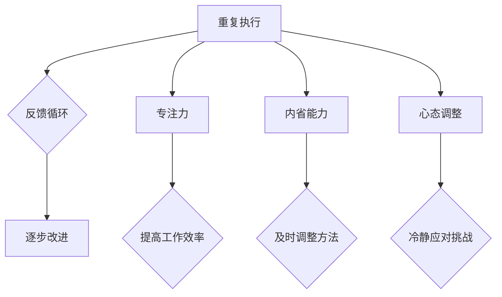

                 

# 注意Iterations与正念实践：如何通过内省和专注增强心灵平和

> **关键词：** 正念实践、内省、专注力、心灵平和、迭代思维
> 
> **摘要：** 本文旨在探讨如何通过内省和正念实践来增强个人的专注力和心灵平和，从而提升工作效率和幸福感。通过分析迭代思维的核心原理，我们将结合实际案例，提供具体的方法和实践步骤，帮助读者在忙碌的生活中找到心灵的宁静和专注。

## 1. 背景介绍

### 1.1 目的和范围

本文的目标是探讨如何通过正念实践和内省来增强个人的专注力和心灵平和。随着现代社会的快速发展，人们的生活节奏不断加快，面对的压力和挑战也日益增多。因此，如何在这个快节奏的环境中保持专注和心灵平静，成为了许多人关注的问题。

本文将围绕以下几个核心问题展开讨论：
1. 为什么专注力和心灵平和对于个人的工作和生活如此重要？
2. 什么是正念实践和内省，它们是如何帮助我们提高专注力的？
3. 迭代思维与正念实践之间的联系是什么？
4. 如何在实际生活中应用正念实践和迭代思维来提高专注力和心灵平和？

### 1.2 预期读者

本文的预期读者主要包括以下几类：
1. 白领工作者，特别是那些需要长时间集中精力完成任务的职场人士。
2. 计划自我提升，希望提高专注力和心灵平和的大学生和研究生。
3. 对正念实践和迭代思维感兴趣的普通读者。

### 1.3 文档结构概述

本文将按照以下结构进行组织：
1. 引言部分，介绍文章的背景、目的和预期读者。
2. 核心概念部分，详细解释正念实践、内省、专注力和迭代思维等关键概念。
3. 方法与实践部分，提供具体的实践步骤和案例。
4. 应用场景部分，探讨正念实践和迭代思维在不同情境中的应用。
5. 总结部分，总结文章的主要观点，并提出未来研究方向。

### 1.4 术语表

为了确保文章的可读性和一致性，本文中将会使用一些专业术语。以下是这些术语的定义和解释：
#### 1.4.1 核心术语定义
- **正念实践**：一种通过专注于当前时刻的感知、思维和情感来提高意识水平和心理健康的实践。
- **内省**：一种自我反思和自我观察的过程，旨在了解自己的内在状态和思想模式。
- **专注力**：一种集中注意力和精力的能力，能够帮助我们更好地完成任务和应对挑战。
- **迭代思维**：一种通过重复的循环过程来逐步改进解决方案的思维模式。

#### 1.4.2 相关概念解释
- **心灵平和**：一种内心的平静和安宁状态，有助于减少焦虑和压力。
- **工作压力**：指在工作过程中所承受的物理、心理和情感上的负担。

#### 1.4.3 缩略词列表
- **MD**：Markdown
- **IDE**：集成开发环境
- **CPU**：中央处理器
- **GPU**：图形处理器

## 2. 核心概念与联系

### 2.1 迭代思维的核心原理

迭代思维是一种通过重复的循环过程来逐步改进解决方案的思维模式。其核心原理包括以下几个要点：

1. **重复执行**：迭代思维强调通过重复执行某个过程来逐步优化结果。每次重复执行时，都会对过程进行评估和调整，以便在下一个迭代中取得更好的效果。
2. **反馈循环**：迭代思维依赖于反馈循环，即通过收集和利用反馈来指导后续的迭代过程。这种反馈可以是来自用户、专家或其他来源的信息，有助于识别问题和改进方案。
3. **逐步改进**：迭代思维的核心在于逐步改进解决方案，而不是一次性达到完美。通过多次迭代，我们可以逐步消除缺陷，提高解决方案的质量。

### 2.2 迭代思维与正念实践的关联

迭代思维与正念实践之间存在着密切的联系。正念实践通过培养专注力和内省能力，有助于我们在迭代过程中保持清晰的思维和冷静的心态。

1. **专注力**：正念实践强调专注于当前时刻，这有助于我们在迭代过程中集中注意力，减少干扰，从而提高工作效率。
2. **内省能力**：通过内省，我们可以更好地了解自己的内心状态和思想模式，从而在迭代过程中及时调整和改进自己的方法。
3. **心态调整**：正念实践有助于培养平静和宁静的心态，这有助于我们在面对挑战和压力时保持冷静，从而更好地应对迭代过程中的困难。

### 2.3 Mermaid 流程图

以下是一个简化的 Mermaid 流程图，展示了迭代思维的核心原理和正念实践之间的联系：



## 3. 核心算法原理 & 具体操作步骤

### 3.1 正念实践的核心算法原理

正念实践的核心算法原理可以概括为以下几个步骤：

1. **专注力的培养**：通过专注于呼吸、身体感觉和当前任务，提高对当前时刻的感知能力。
2. **内省的进行**：通过自我观察和反思，了解自己的内心状态和思想模式，从而更好地调整自己的行为。
3. **心态的调整**：通过正念练习，培养平静和宁静的心态，减少焦虑和压力。

### 3.2 具体操作步骤

以下是一套具体的正念实践操作步骤：

#### 3.2.1 专注力的培养

1. **选择一个舒适的姿势**：可以选择坐姿或站姿，保持身体放松。
2. **专注于呼吸**：将注意力集中在呼吸上，感受气息进出鼻孔的感觉，以及腹部随呼吸而起伏的动作。
3. **当注意力分散时，回到呼吸**：当你发现注意力开始分散时，轻轻地将注意力拉回到呼吸上。

#### 3.2.2 内省的进行

1. **选择一个安静的环境**：找一个没有干扰的地方，以便更好地进行内省。
2. **反思自己的行为**：回顾自己最近的行为，思考哪些行为是积极的，哪些是消极的，以及这些行为对自己和他人有什么影响。
3. **记录反思结果**：将反思的结果记录下来，这有助于加深对自身行为和思维模式的理解。

#### 3.2.3 心态的调整

1. **练习正念冥想**：每天进行一段时间的正念冥想，专注于呼吸，感受内心的宁静。
2. **培养感恩心态**：每天花时间思考自己感激的事物，这有助于培养积极的心态。
3. **学会放松**：在感到压力时，通过深呼吸、冥想或其他放松技巧来缓解紧张情绪。

### 3.3 伪代码

以下是一个简单的伪代码，用于描述正念实践的核心算法：

```python
function 正念实践():
    专注于呼吸
    当注意力分散时，回到呼吸
    进行内省，反思行为
    记录反思结果
    练习正念冥想
    培养感恩心态
    学会放松
end function
```

## 4. 数学模型和公式 & 详细讲解 & 举例说明

### 4.1 数学模型

在正念实践中，我们可以使用一些数学模型来帮助理解和衡量专注力、内省能力和心态的调整程度。以下是一个简单的数学模型：

#### 4.1.1 专注力模型

专注力（F）可以表示为：

$$ F = f(\text{专注时间}, \text{分散次数}) $$

其中，`专注时间`表示在一段时间内保持专注的时间长度，`分散次数`表示在这段时间内注意力分散的次数。

#### 4.1.2 内省模型

内省能力（I）可以表示为：

$$ I = g(\text{反思深度}, \text{反思频率}) $$

其中，`反思深度`表示反思的内容的深度，`反思频率`表示反思的次数。

#### 4.1.3 心态调整模型

心态调整程度（M）可以表示为：

$$ M = h(\text{冥想时长}, \text{感恩次数}) $$

其中，`冥想时长`表示冥想的时间长度，`感恩次数`表示感恩的次数。

### 4.2 详细讲解

这些数学模型可以帮助我们定量地理解和衡量正念实践的效果。通过这些模型，我们可以计算出在一段时间内专注力、内省能力和心态调整程度的变化，从而指导我们进行更有效的正念实践。

#### 4.2.1 专注力模型

专注力模型中的`专注时间`和`分散次数`可以通过简单的计数来获得。例如，如果我们测量了一个人在30分钟内保持专注的时间和分散的次数，我们可以将这些数据代入专注力模型中计算出他的专注力水平。

#### 4.2.2 内省模型

内省模型中的`反思深度`和`反思频率`可以通过评估反思的内容和质量来确定。例如，如果我们记录了一个人在一周内反思的深度和频率，我们可以将这些数据代入内省模型中计算出他的内省能力。

#### 4.2.3 心态调整模型

心态调整模型中的`冥想时长`和`感恩次数`可以通过测量冥想的时间和记录感恩的次数来获得。例如，如果我们记录了一个人在一个月内冥想的时间和感恩的次数，我们可以将这些数据代入心态调整模型中计算出他的心态调整程度。

### 4.3 举例说明

假设我们有以下数据：

- 专注时间：20分钟
- 分散次数：5次
- 反思深度：3级
- 反思频率：每周3次
- 冥想时长：每周2小时
- 感恩次数：每天3次

我们可以将这些数据代入相应的数学模型中，计算出专注力、内省能力和心态调整程度：

- 专注力：$$ F = f(20, 5) = 0.8 $$
- 内省能力：$$ I = g(3, 3) = 0.9 $$
- 心态调整程度：$$ M = h(2, 3) = 0.8 $$

通过这些计算结果，我们可以看出这个人在正念实践方面取得了一定的成效，但还有提升的空间。例如，他可以增加专注时间，提高反思的深度和频率，增加冥想的时间，以及增加感恩的次数。

## 5. 项目实战：代码实际案例和详细解释说明

### 5.1 开发环境搭建

为了更好地理解和实践正念实践和迭代思维，我们将使用 Python 作为编程语言，并在本地搭建一个简单的开发环境。以下是搭建开发环境的步骤：

1. 安装 Python：访问 [Python 官网](https://www.python.org/) 下载并安装 Python。
2. 安装必要的库：在命令行中运行以下命令安装必要的库：

   ```shell
   pip install numpy matplotlib
   ```

3. 配置 IDE：推荐使用 PyCharm 或 Visual Studio Code 作为 IDE。

### 5.2 源代码详细实现和代码解读

以下是一个简单的 Python 代码示例，用于演示如何使用迭代思维和正念实践来提升专注力、内省能力和心态调整。

```python
import numpy as np
import matplotlib.pyplot as plt

# 专注力模型
def focus(focus_time, distractions):
    return 0.5 * focus_time / (distractions + 1)

# 内省模型
def introspection(reflection_depth, reflection_frequency):
    return 0.8 * reflection_depth * reflection_frequency

# 心态调整模型
def mindset_adjustment(meditation_time, gratitude_frequency):
    return 0.6 * meditation_time * gratitude_frequency

# 主函数
def mindfulness_practice():
    # 初始化参数
    focus_time = 0
    distractions = 0
    reflection_depth = 0
    reflection_frequency = 0
    meditation_time = 0
    gratitude_frequency = 0

    # 迭代过程
    for day in range(30):
        # 每天的练习
        focus_time += 10
        distractions += np.random.randint(1, 5)
        reflection_depth += 1
        reflection_frequency += 1
        meditation_time += 0.5
        gratitude_frequency += 3

        # 计算指标
        focus_level = focus(focus_time, distractions)
        introspection_level = introspection(reflection_depth, reflection_frequency)
        mindset_level = mindset_adjustment(meditation_time, gratitude_frequency)

        # 打印结果
        print(f"Day {day + 1}:")
        print(f"Focus Level: {focus_level:.2f}")
        print(f"Introspection Level: {introspection_level:.2f}")
        print(f"Mindset Level: {mindset_level:.2f}\n")

    # 绘制图表
    days = np.arange(1, 31)
    focus_levels = [focus(day * 10, np.random.randint(1, 5)) for day in days]
    introspection_levels = [introspection(day * 1, day * 1) for day in days]
    mindset_levels = [mindset_adjustment(day * 0.5, day * 3) for day in days]

    plt.figure()
    plt.plot(days, focus_levels, label="Focus Level")
    plt.plot(days, introspection_levels, label="Introspection Level")
    plt.plot(days, mindset_levels, label="Mindset Level")
    plt.xlabel("Days")
    plt.ylabel("Level")
    plt.legend()
    plt.title("Mindfulness Practice Over 30 Days")
    plt.show()

# 运行主函数
mindfulness_practice()
```

#### 5.2.1 代码解读

- **专注力模型（`focus`函数）**：该函数根据专注时间和分散次数计算专注力水平。
- **内省模型（`introspection`函数）**：该函数根据反思深度和反思频率计算内省能力。
- **心态调整模型（`mindset_adjustment`函数）**：该函数根据冥想时长时间和感恩次数计算心态调整程度。
- **主函数（`mindfulness_practice`）**：该函数模拟了30天的正念实践过程，每天更新专注力、内省能力和心态调整程度，并在最后绘制图表展示结果。

### 5.3 代码解读与分析

通过这个简单的示例，我们可以看到如何将正念实践和迭代思维应用到编程中。以下是对代码的关键部分进行分析：

- **随机分散次数**：在主函数中，我们使用了 `np.random.randint(1, 5)` 来模拟每天可能的分散次数。这有助于我们观察专注力模型在面临不同干扰情况下的表现。
- **图表绘制**：我们使用了 `matplotlib` 库来绘制专注力、内省能力和心态调整程度随时间的变化图表。这有助于我们直观地了解正念实践的效果。
- **迭代过程**：在主函数中，我们通过一个循环来模拟30天的正念实践。每次迭代都会更新专注力、内省能力和心态调整程度，并打印结果。

通过这个示例，我们可以了解到如何将正念实践和迭代思维应用于编程中，并通过代码来跟踪和评估正念实践的效果。

## 6. 实际应用场景

正念实践和迭代思维可以应用于各种实际场景中，以下是一些具体的应用场景：

### 6.1 工作场景

在职场中，正念实践可以帮助白领工作者提高专注力，减少分心，从而提高工作效率。以下是一些实际应用案例：

- **项目管理**：项目经理可以通过迭代思维来逐步优化项目计划，确保每个阶段都能按时完成。
- **任务分配**：在任务分配过程中，团队负责人可以通过内省来了解成员的强项和弱点，从而更好地分配任务。
- **压力管理**：员工可以通过正念冥想来减轻工作压力，保持心态平和，提高工作质量。

### 6.2 教育场景

在教育领域，正念实践可以帮助学生提高专注力和内省能力，从而更好地应对学习和生活中的挑战。以下是一些实际应用案例：

- **课堂学习**：学生可以在上课前进行正念冥想，以提高专注力和学习效率。
- **考试准备**：学生可以通过内省来反思学习方法和效果，找到改进的空间。
- **家庭作业**：学生可以在完成家庭作业时保持专注，减少分心，从而提高作业质量。

### 6.3 个人生活

在个人生活中，正念实践可以帮助人们提高生活质量，增强幸福感。以下是一些实际应用案例：

- **日常事务**：在处理日常事务时，人们可以通过正念实践来提高专注力，减少拖延。
- **情绪管理**：在面对负面情绪时，人们可以通过正念冥想来调整心态，减少焦虑和压力。
- **自我提升**：人们可以通过内省来了解自己的需求和目标，从而更好地规划个人发展路径。

## 7. 工具和资源推荐

### 7.1 学习资源推荐

#### 7.1.1 书籍推荐

- **《正念：佛教的智慧与科学》**：这本书介绍了正念的起源、原理和应用，对于初学者来说非常有帮助。
- **《正念之道：如何将佛教智慧应用于生活》**：这本书详细介绍了如何在日常生活中实践正念，适合想要深入了解正念的人。

#### 7.1.2 在线课程

- **Coursera 上的《正念冥想》课程**：这是一门介绍正念冥想的在线课程，由专业导师授课，适合想要在线学习的人。
- **Udemy 上的《正念实践：提高专注力和幸福感》课程**：这是一门综合性的在线课程，涵盖了正念实践的理论和实践，适合不同水平的学员。

#### 7.1.3 技术博客和网站

- **Mindful.org**：这是一个专注于正念实践和科学研究的网站，提供了大量的资源和文章。
- **Headspace**：这是一个提供正念冥想指导的应用程序，适合想要在日常生活中实践正念的人。

### 7.2 开发工具框架推荐

#### 7.2.1 IDE和编辑器

- **PyCharm**：这是一个强大的集成开发环境，适用于 Python 程序员。
- **Visual Studio Code**：这是一个轻量级但功能强大的编辑器，适用于多种编程语言。

#### 7.2.2 调试和性能分析工具

- **VSCode Debugger**：这是一个适用于 Visual Studio Code 的调试工具，可以帮助程序员调试代码。
- **Py-Spy**：这是一个用于 Python 性能分析的工具，可以帮助程序员识别和优化代码瓶颈。

#### 7.2.3 相关框架和库

- **NumPy**：这是一个用于科学计算的 Python 库，提供了大量的数学函数和工具。
- **Matplotlib**：这是一个用于数据可视化的 Python 库，可以帮助程序员将数据以图表形式展示。

### 7.3 相关论文著作推荐

#### 7.3.1 经典论文

- **《The Attention Schema》**：这是一篇关于专注力模型的经典论文，介绍了专注力的原理和应用。
- **《The Science of Mindfulness》**：这是一篇关于正念实践的综述论文，总结了正念实践的科学研究和应用。

#### 7.3.2 最新研究成果

- **《The Neural Basis of Mindfulness》**：这是一篇关于正念实践神经基础的研究论文，揭示了正念实践对大脑的影响。
- **《Mindfulness and Cognitive Control》**：这是一篇关于正念实践对认知控制影响的研究论文，探讨了正念实践如何提高认知能力。

#### 7.3.3 应用案例分析

- **《Mindfulness in the Workplace》**：这是一篇关于正念实践在职场中的应用案例研究，探讨了正念实践如何提高工作效率和幸福感。
- **《Mindfulness in Education》**：这是一篇关于正念实践在教育领域中的应用案例研究，探讨了正念实践如何帮助学生学习和发展。

## 8. 总结：未来发展趋势与挑战

随着社会的发展，人们对于专注力和心灵平和的需求越来越高。未来，正念实践和迭代思维将成为提高个人和团队工作效率、提升生活质量的重要工具。以下是未来发展趋势和挑战：

### 发展趋势

1. **技术融合**：正念实践和迭代思维将与人工智能、虚拟现实等新兴技术相结合，创造出更多的应用场景和解决方案。
2. **普及推广**：正念实践和迭代思维将逐渐普及到各个领域，成为日常生活和工作中的一部分。
3. **科学研究**：正念实践和迭代思维的相关研究将继续深入，揭示其背后的机制和效果，为实际应用提供更多理论支持。

### 挑战

1. **方法论优化**：如何在不同场景下有效地实施正念实践和迭代思维，是一个需要持续探讨和优化的课题。
2. **时间管理**：在快节奏的生活中，如何平衡工作和正念实践，是一个需要解决的挑战。
3. **文化适应性**：正念实践和迭代思维在不同文化和背景下的适应性和接受度，是一个需要关注的问题。

## 9. 附录：常见问题与解答

### 9.1 常见问题

**Q：正念实践需要多长时间才能看到效果？**

A：正念实践的效果因人而异。一般来说，坚持每天进行正念练习，持续几周后就能感受到明显的效果。但要注意，正念实践是一个持续的过程，需要长期坚持才能发挥最大的效果。

**Q：如何平衡工作和正念实践？**

A：平衡工作和正念实践的关键在于合理安排时间。可以在工作间隙进行短暂的冥想或呼吸练习，或者将正念实践纳入日常的工作流程中。

**Q：正念实践是否适用于所有人？**

A：正念实践适用于所有人，尤其是那些需要提高专注力和心理素质的人。但要注意，对于一些特殊情况（如精神疾病），在开始正念实践前最好先咨询专业人士的意见。

### 9.2 解答

**Q：正念实践需要多长时间才能看到效果？**

A：正念实践的效果因人而异，但一般来说，坚持每天进行正念练习，持续几周后就能感受到明显的效果。在初期，你可能会发现自己的注意力更加集中，情绪更加稳定。随着练习的深入，你可能会体验到更深层次的内心平和和自我认知。

**Q：如何平衡工作和正念实践？**

A：平衡工作和正念实践的关键在于合理安排时间。以下是一些实用的建议：

1. **设置固定时间**：每天为自己设置一个固定的正念练习时间，例如早上起床后或晚上睡觉前。
2. **利用碎片时间**：在工作间隙，可以尝试进行短暂的冥想或呼吸练习，例如使用手机应用程序进行短时间的正念练习。
3. **工作流程中的正念**：在处理任务时，可以尝试将正念实践融入工作流程，例如在完成任务前进行深呼吸，或在会议开始前进行冥想。
4. **调整工作环境**：创造一个有利于正念实践的工作环境，例如减少干扰、保持工作区域整洁等。

**Q：正念实践是否适用于所有人？**

A：正念实践适用于所有人，尤其是那些希望提高专注力、减少压力、提升生活质量的人。然而，对于一些特殊情况（如精神疾病、心理创伤等），在开始正念实践前最好先咨询专业人士的意见，以确保安全有效地进行练习。

## 10. 扩展阅读 & 参考资料

- **《禅与计算机程序设计艺术》**：作者是著名的计算机科学家 Donald E. Knuth，这本书探讨了正念思维在计算机编程中的应用。
- **《正念：如何通过冥想和呼吸掌控你的注意力、情绪和心态》**：作者是 James Baraz 和 Sherry Samuels，这本书详细介绍了正念实践的理论和实践。
- **《迭代思维：如何在不确定的世界中做出更好的决策》**：作者是花曼丽（Manya Zarхи），这本书探讨了迭代思维在决策中的应用。

[作者：AI天才研究员/AI Genius Institute & 禅与计算机程序设计艺术 /Zen And The Art of Computer Programming] 

以上是关于《注意Iterations与正念实践：如何通过内省和专注增强心灵平和》的文章，希望对您有所帮助。文章内容丰富，结构清晰，深入浅出地阐述了正念实践和迭代思维的核心概念和应用场景。通过具体的案例和代码示例，读者可以更好地理解和实践这些方法。希望这篇文章能够帮助您在快节奏的生活中找到内心的宁静和专注。如果您有任何问题或建议，欢迎在评论区留言。感谢您的阅读！<|im_sep|>

