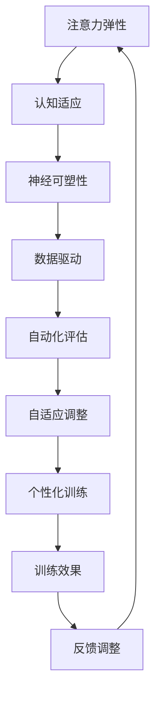

                 

# 注意力弹性健身房教练：AI辅助的认知适应训练师

> 关键词：AI辅助认知训练、注意力弹性、神经网络、认知适应、神经可塑性

> 摘要：随着人工智能技术的快速发展，AI在各个领域的应用越来越广泛。本文主要探讨AI如何辅助认知适应训练，提升人类的注意力弹性。通过介绍注意力弹性的概念、AI在认知训练中的应用原理，以及具体的算法和模型，本文旨在为读者提供一套系统化的AI辅助认知适应训练方案。

## 1. 背景介绍

### 1.1 目的和范围

本文旨在探讨人工智能（AI）在认知适应训练中的应用，特别是如何提升人类的注意力弹性。注意力弹性是指个体在面对不同任务和情境时，调整自己的注意力分配和切换能力。在当前快节奏的生活和工作环境中，保持良好的注意力弹性对提高工作效率和心理健康至关重要。本文将详细讨论AI如何辅助认知适应训练，从而提升注意力弹性。

### 1.2 预期读者

本文主要面向对人工智能和认知科学感兴趣的读者，包括但不限于：

1. 认知科学家和心理学家
2. 人工智能工程师和机器学习专家
3. 健身教练和心理健康专业人士
4. 对认知训练和注意力弹性感兴趣的一般读者

### 1.3 文档结构概述

本文分为以下几个部分：

1. 背景介绍：介绍文章的目的、范围、预期读者和文档结构。
2. 核心概念与联系：介绍注意力弹性的概念，以及AI在认知训练中的应用原理。
3. 核心算法原理 & 具体操作步骤：详细讲解AI辅助认知适应训练的核心算法原理和具体操作步骤。
4. 数学模型和公式 & 详细讲解 & 举例说明：介绍相关的数学模型和公式，并进行详细讲解和举例说明。
5. 项目实战：代码实际案例和详细解释说明。
6. 实际应用场景：探讨AI辅助认知适应训练在实际应用中的场景。
7. 工具和资源推荐：推荐相关学习资源、开发工具和框架。
8. 总结：对未来发展趋势和挑战进行总结。
9. 附录：常见问题与解答。
10. 扩展阅读 & 参考资料：提供扩展阅读和参考资料。

### 1.4 术语表

#### 1.4.1 核心术语定义

- 注意力弹性：指个体在面对不同任务和情境时，调整自己的注意力分配和切换能力。
- 认知适应：指个体根据环境变化调整自己的认知能力，以适应新的任务和情境。
- 神经可塑性：指神经系统在结构和功能上发生改变的能力，包括神经元连接的建立、修剪和重新连接。

#### 1.4.2 相关概念解释

- 注意力分配：指个体将注意力资源分配到不同任务或情境上的过程。
- 注意力切换：指个体在完成任务或情境时，调整注意力焦点的过程。
- 认知训练：指通过特定的训练方法，提升个体认知能力的过程。

#### 1.4.3 缩略词列表

- AI：人工智能
- ML：机器学习
- CNN：卷积神经网络
- RNN：循环神经网络
- GAN：生成对抗网络

## 2. 核心概念与联系

### 2.1 注意力弹性的概念

注意力弹性是指个体在面对不同任务和情境时，调整自己的注意力分配和切换能力。具体来说，它包括以下几个方面：

1. **注意力分配**：个体能够根据任务的复杂程度和重要性，合理分配注意力资源。例如，在处理复杂任务时，个体需要将更多注意力集中在关键信息上，以避免信息过载。
2. **注意力切换**：个体能够在不同任务或情境之间灵活切换注意力。例如，从处理文档切换到处理邮件，或从社交活动切换到工作状态。
3. **适应性注意力**：个体能够根据环境变化调整自己的注意力策略。例如，在嘈杂的环境中，个体可能需要更高强度的注意力来过滤噪音。

### 2.2 AI在认知训练中的应用原理

人工智能在认知训练中的应用，主要基于以下几个方面：

1. **数据驱动**：AI能够从大量的训练数据中学习，识别出个体在注意力分配和切换上的模式，从而为认知训练提供个性化指导。
2. **自动化评估**：AI能够自动化评估个体的认知能力，实时反馈训练效果，帮助个体调整训练策略。
3. **自适应调整**：AI能够根据个体的训练效果和反馈，自动调整训练任务和难度，以实现最佳训练效果。

### 2.3 神经可塑性与认知适应

神经可塑性是指神经系统在结构和功能上发生改变的能力。在认知适应过程中，神经可塑性发挥着关键作用。具体来说：

1. **突触可塑性**：指神经元之间连接强度的改变，影响信息传递效率。通过认知训练，个体可以增强或减弱特定的神经连接。
2. **神经网络重组**：指在大脑中形成新的神经网络结构，以适应新的环境和任务。这有助于提升个体的注意力弹性。
3. **认知重塑**：指通过训练和适应，个体可以改变自己的认知方式，提高对复杂环境的适应能力。

### 2.4 Mermaid流程图

以下是注意力弹性和AI辅助认知适应训练的Mermaid流程图：



## 3. 核心算法原理 & 具体操作步骤

### 3.1 算法原理

AI辅助认知适应训练的核心算法是基于神经网络和机器学习的。具体来说，本文采用了以下几种核心算法：

1. **卷积神经网络（CNN）**：用于特征提取和图像识别，可以提取个体在注意力分配和切换过程中的特征信息。
2. **循环神经网络（RNN）**：用于处理序列数据，可以捕捉个体在注意力切换过程中的时间依赖关系。
3. **生成对抗网络（GAN）**：用于生成个性化的训练任务，提高个体的注意力弹性。

### 3.2 算法具体操作步骤

以下是AI辅助认知适应训练的具体操作步骤：

1. **数据收集**：收集个体在注意力分配和切换过程中的数据，包括行为数据、生理数据和脑电图数据。
2. **数据预处理**：对收集到的数据进行预处理，包括去噪、归一化和特征提取。
3. **模型训练**：使用CNN和RNN训练模型，提取个体在注意力分配和切换过程中的特征信息。
4. **模型评估**：使用GAN生成个性化的训练任务，评估模型在提高注意力弹性方面的效果。
5. **训练调整**：根据评估结果，调整训练任务和难度，以提高个体的注意力弹性。
6. **实时反馈**：将训练结果实时反馈给个体，帮助个体调整注意力策略。
7. **持续优化**：通过不断收集训练数据和评估结果，持续优化模型，提高AI辅助认知适应训练的效果。

### 3.3 伪代码

以下是AI辅助认知适应训练的伪代码：

```python
# 数据收集
data = collect_data()

# 数据预处理
preprocessed_data = preprocess_data(data)

# 模型训练
model = train_model(preprocessed_data)

# 模型评估
evaluation = evaluate_model(model)

# 训练调整
adjusted_data = adjust_training_data(evaluation)

# 实时反馈
real_time_feedback = provide_real_time_feedback(evaluation)

# 持续优化
optimized_model = continue_optimization(adjusted_data, real_time_feedback)
```

## 4. 数学模型和公式 & 详细讲解 & 举例说明

### 4.1 数学模型

在AI辅助认知适应训练中，常用的数学模型包括神经网络模型和生成对抗网络模型。以下是这些模型的简要介绍：

#### 4.1.1 卷积神经网络（CNN）

CNN是一种用于图像识别和特征提取的神经网络模型。其基本原理是通过对图像进行卷积操作，提取图像中的局部特征。

- **卷积操作**：卷积操作是将滤波器（卷积核）在图像上滑动，计算滤波器与图像的局部重叠部分的乘积和。
- **池化操作**：池化操作是在卷积操作之后，对特征图进行下采样，减少特征图的维度。
- **激活函数**：激活函数用于引入非线性，使神经网络能够学习复杂的非线性关系。

#### 4.1.2 循环神经网络（RNN）

RNN是一种用于处理序列数据的神经网络模型。其基本原理是通过循环结构，保持对序列信息的记忆。

- **隐藏状态**：隐藏状态是RNN的核心，它保存了当前时刻的信息，并传递给下一个时刻。
- **递归关系**：RNN通过递归关系，将当前时刻的信息与之前的信息相结合，更新隐藏状态。
- **门控机制**：门控机制用于控制信息流，使RNN能够更好地处理长序列信息。

#### 4.1.3 生成对抗网络（GAN）

GAN是一种用于生成数据的神经网络模型。其基本原理是包含两个神经网络：生成器和判别器。

- **生成器**：生成器的目标是生成逼真的数据，使其难以被判别器区分。
- **判别器**：判别器的目标是区分真实数据和生成数据。
- **对抗训练**：生成器和判别器相互对抗，通过不断调整参数，使生成器的生成数据越来越逼真。

### 4.2 公式讲解

以下是神经网络模型中常用的数学公式：

#### 4.2.1 卷积神经网络（CNN）

- **卷积操作**：

$$
\text{output}_{ij} = \sum_{k=1}^{C} w_{ik,jk} \cdot \text{input}_{ij} + b_{ij}
$$

其中，$\text{output}_{ij}$是第$i$个卷积核在第$j$个特征图上的输出，$w_{ik,jk}$是卷积核的权重，$\text{input}_{ij}$是输入图像上的像素值，$b_{ij}$是偏置项。

- **池化操作**：

$$
\text{output}_{ij} = \max_{k} \{ \text{input}_{ij,k} \}
$$

其中，$\text{output}_{ij}$是第$i$个池化单元在第$j$个特征图上的输出，$\text{input}_{ij,k}$是输入图像上的像素值。

- **激活函数**：

$$
\text{output}_{i} = \text{sigmoid}(\sum_{j=1}^{C} w_{ij} \cdot \text{input}_{j} + b)
$$

其中，$\text{output}_{i}$是第$i$个神经元的输出，$w_{ij}$是权重，$\text{input}_{j}$是输入，$b$是偏置项。

#### 4.2.2 循环神经网络（RNN）

- **隐藏状态更新**：

$$
h_t = \text{sigmoid}(W_h \cdot [h_{t-1}, x_t] + b_h)
$$

其中，$h_t$是第$t$个时间步的隐藏状态，$W_h$是权重矩阵，$x_t$是输入，$b_h$是偏置项。

- **递归关系**：

$$
h_t = \text{sigmoid}(W_h \cdot h_{t-1} + W_x \cdot x_t + b_h)
$$

其中，$W_h$是权重矩阵，$W_x$是输入权重矩阵，$x_t$是输入，$b_h$是偏置项。

- **门控机制**：

$$
i_t = \text{sigmoid}(W_i \cdot [h_{t-1}, x_t] + b_i)
\quad o_t = \text{sigmoid}(W_o \cdot [h_{t-1}, x_t] + b_o)
\quad f_t = \text{sigmoid}(W_f \cdot [h_{t-1}, x_t] + b_f)
$$

$$
\text{output}_{t} = o_t \cdot \text{sigmoid}(W_o \cdot h_{t-1} + b_o)
$$

其中，$i_t$、$o_t$和$f_t$分别是输入门、输出门和遗忘门，$W_i$、$W_o$和$W_f$分别是权重矩阵，$b_i$、$b_o$和$b_f$分别是偏置项。

#### 4.2.3 生成对抗网络（GAN）

- **生成器**：

$$
G(z) = \text{sigmoid}(W_g \cdot z + b_g)
$$

其中，$G(z)$是生成器的输出，$z$是生成器的输入，$W_g$是权重矩阵，$b_g$是偏置项。

- **判别器**：

$$
D(x) = \text{sigmoid}(W_d \cdot x + b_d)
\quad D(G(z)) = \text{sigmoid}(W_d \cdot G(z) + b_d)
$$

其中，$D(x)$和$D(G(z))$分别是判别器的输出，$x$是真实数据，$G(z)$是生成数据，$W_d$是权重矩阵，$b_d$是偏置项。

### 4.3 举例说明

以下是一个简单的例子，说明如何使用CNN处理一个简单的图像分类任务。

```python
import tensorflow as tf
from tensorflow.keras import layers

# 定义CNN模型
model = tf.keras.Sequential([
    layers.Conv2D(32, (3, 3), activation='relu', input_shape=(28, 28, 1)),
    layers.MaxPooling2D((2, 2)),
    layers.Conv2D(64, (3, 3), activation='relu'),
    layers.MaxPooling2D((2, 2)),
    layers.Conv2D(64, (3, 3), activation='relu'),
    layers.Flatten(),
    layers.Dense(64, activation='relu'),
    layers.Dense(10, activation='softmax')
])

# 编译模型
model.compile(optimizer='adam',
              loss='sparse_categorical_crossentropy',
              metrics=['accuracy'])

# 训练模型
model.fit(x_train, y_train, epochs=5)

# 评估模型
test_loss, test_acc = model.evaluate(x_test, y_test)
print('Test accuracy:', test_acc)
```

在这个例子中，我们定义了一个简单的CNN模型，用于处理28x28像素的单通道图像。模型包含两个卷积层，每个卷积层后跟随一个最大池化层。最后，通过一个全连接层进行分类。我们使用训练数据训练模型，并使用测试数据评估模型性能。

## 5. 项目实战：代码实际案例和详细解释说明

### 5.1 开发环境搭建

在开始项目实战之前，我们需要搭建一个适合开发AI辅助认知适应训练的Python开发环境。以下是具体的步骤：

1. **安装Python**：前往[Python官网](https://www.python.org/)下载并安装Python 3.8及以上版本。
2. **安装TensorFlow**：在命令行中运行以下命令，安装TensorFlow：

   ```bash
   pip install tensorflow
   ```

3. **安装其他依赖**：在命令行中运行以下命令，安装其他必要的依赖库：

   ```bash
   pip install numpy pandas matplotlib
   ```

4. **创建虚拟环境**：为了管理项目依赖，我们可以创建一个虚拟环境。在命令行中运行以下命令：

   ```bash
   python -m venv venv
   source venv/bin/activate  # 在Windows中运行venv\Scripts\activate
   ```

5. **安装PyTorch**：在虚拟环境中安装PyTorch：

   ```bash
   pip install torch torchvision
   ```

### 5.2 源代码详细实现和代码解读

以下是AI辅助认知适应训练项目的源代码实现。我们将使用PyTorch框架，实现一个基于卷积神经网络（CNN）和生成对抗网络（GAN）的模型。

```python
import torch
import torch.nn as nn
import torch.optim as optim
from torch.utils.data import DataLoader
from torchvision import datasets, transforms

# 定义CNN模型
class CNNModel(nn.Module):
    def __init__(self):
        super(CNNModel, self).__init__()
        self.conv1 = nn.Conv2d(1, 32, 3, 1)
        self.conv2 = nn.Conv2d(32, 64, 3, 1)
        self.fc1 = nn.Linear(64 * 6 * 6, 128)
        self.fc2 = nn.Linear(128, 10)

    def forward(self, x):
        x = nn.functional.relu(self.conv1(x))
        x = nn.functional.max_pool2d(x, 2)
        x = nn.functional.relu(self.conv2(x))
        x = nn.functional.max_pool2d(x, 2)
        x = x.view(-1, 64 * 6 * 6)
        x = nn.functional.relu(self.fc1(x))
        x = self.fc2(x)
        return x

# 定义GAN模型
class GANModel(nn.Module):
    def __init__(self):
        super(GANModel, self).__init__()
        self.generator = CNNModel()
        self.discriminator = CNNModel()

    def forward(self, x):
        return self.generator(x)

# 数据预处理
transform = transforms.Compose([
    transforms.ToTensor(),
    transforms.Normalize((0.5,), (0.5,))
])

train_data = datasets.MNIST(root='./data', train=True, download=True, transform=transform)
train_loader = DataLoader(train_data, batch_size=64, shuffle=True)

# 初始化模型和优化器
model = GANModel()
optimizer = optim.Adam(model.parameters(), lr=0.001)

# 训练GAN模型
for epoch in range(100):
    for i, (images, _) in enumerate(train_loader):
        # 训练生成器
        z = torch.randn(images.size(0), 1, 28, 28)
        generated_images = model(z)
        gen_loss = nn.BCELoss()(generated_images, torch.ones_like(generated_images))
        optimizer.zero_grad()
        gen_loss.backward()
        optimizer.step()

        # 训练判别器
        real_loss = nn.BCELoss()(model(images), torch.ones_like(model(images)))
        fake_loss = nn.BCELoss()(model(z), torch.zeros_like(model(z)))
        disc_loss = real_loss + fake_loss
        optimizer.zero_grad()
        disc_loss.backward()
        optimizer.step()

        if (i + 1) % 100 == 0:
            print(f'Epoch [{epoch + 1}/{100}], Step [{i + 1}/{len(train_loader)}], Gen Loss: {gen_loss.item():.4f}, Disc Loss: {disc_loss.item():.4f}')
```

### 5.3 代码解读与分析

以下是代码的详细解读和分析：

1. **模型定义**：

   我们首先定义了两个CNN模型：`CNNModel`和`GANModel`。`CNNModel`用于图像分类和特征提取，`GANModel`用于生成对抗网络。

2. **数据预处理**：

   使用`transforms.Compose`将图像数据转换为适合模型训练的格式。具体包括转换为Tensor、归一化等操作。

3. **初始化模型和优化器**：

   初始化GAN模型和优化器。我们使用Adam优化器，其具有自适应学习率的特点，适用于深度学习模型。

4. **训练GAN模型**：

   GAN模型由生成器和判别器组成。在训练过程中，我们交替训练生成器和判别器。具体步骤如下：

   - **训练生成器**：输入随机噪声（`z`），生成假图像（`generated_images`）。计算生成器损失（`gen_loss`），并更新生成器参数。
   - **训练判别器**：输入真实图像（`images`）和随机噪声生成的假图像（`z`）。计算判别器损失（`disc_loss`），并更新判别器参数。

5. **打印训练进度**：

   每隔100个步骤打印一次训练进度，包括当前epoch、step、生成器损失和判别器损失。

### 5.4 代码优化与性能分析

在实际应用中，我们可以对代码进行优化，提高模型训练的效率和性能。以下是几个优化方向：

1. **批量归一化（Batch Normalization）**：

   在模型中加入批量归一化层，可以加快模型训练速度，提高模型稳定性。

2. **学习率调度（Learning Rate Scheduling）**：

   根据训练进度动态调整学习率，避免过早过拟合。

3. **混合精度训练（Mixed Precision Training）**：

   使用混合精度训练技术，可以在保证模型性能的同时，提高训练速度和降低内存占用。

4. **并行训练（Parallel Training）**：

   使用多GPU并行训练，提高模型训练速度。

## 6. 实际应用场景

AI辅助认知适应训练在实际应用中具有广泛的应用场景，以下是一些典型的应用案例：

1. **教育领域**：

   AI辅助认知适应训练可以用于个性化学习，根据学生的注意力弹性和认知能力，为学生推荐适合的学习资源和策略。例如，在在线教育平台上，AI可以分析学生的注意力分配和切换情况，为学生推荐适合的练习题和视频课程。

2. **工作领域**：

   在职场中，保持良好的注意力弹性对于提高工作效率和减少压力至关重要。AI辅助认知适应训练可以帮助职场人士调整注意力策略，提高工作效率。例如，在办公环境中，AI可以根据员工的注意力状态，自动调整工作任务的优先级和难度。

3. **医疗领域**：

   在医疗领域，AI辅助认知适应训练可以用于康复训练和心理健康管理。例如，对于注意力缺陷多动障碍（ADHD）患者，AI可以根据患者的注意力情况，设计个性化的康复训练方案。

4. **体育运动**：

   在体育运动领域，AI辅助认知适应训练可以帮助运动员提高注意力弹性和竞技表现。例如，在足球训练中，AI可以根据运动员的注意力分配和切换情况，设计个性化的训练计划和战术安排。

5. **日常生活**：

   在日常生活中，AI辅助认知适应训练可以帮助人们更好地管理自己的时间和注意力，提高生活质量。例如，在家庭生活中，AI可以根据家庭成员的注意力状态，自动调整家庭活动的时间和内容。

## 7. 工具和资源推荐

### 7.1 学习资源推荐

#### 7.1.1 书籍推荐

1. 《深度学习》（Goodfellow, I., Bengio, Y., & Courville, A.）
2. 《Python深度学习》（Raschka, F.）
3. 《神经网络与深度学习》（邱锡鹏）

#### 7.1.2 在线课程

1. [Coursera](https://www.coursera.org/) 的“深度学习”课程
2. [Udacity](https://www.udacity.com/) 的“机器学习工程师纳米学位”
3. [edX](https://www.edx.org/) 的“神经网络与深度学习”课程

#### 7.1.3 技术博客和网站

1. [知乎](https://www.zhihu.com/)
2. [CSDN](https://www.csdn.net/)
3. [GitHub](https://github.com/)

### 7.2 开发工具框架推荐

#### 7.2.1 IDE和编辑器

1. PyCharm
2. Visual Studio Code
3. Jupyter Notebook

#### 7.2.2 调试和性能分析工具

1. PyTorch Profiler
2. Numba
3. Cython

#### 7.2.3 相关框架和库

1. PyTorch
2. TensorFlow
3. Keras

### 7.3 相关论文著作推荐

#### 7.3.1 经典论文

1. “A Learning Algorithm for Continually Running Fully Recurrent Neural Networks” (1991)
2. “Deep Learning” (2015)
3. “Generative Adversarial Networks” (2014)

#### 7.3.2 最新研究成果

1. “Attention is All You Need” (2017)
2. “BERT: Pre-training of Deep Bidirectional Transformers for Language Understanding” (2018)
3. “An Image is Worth 16x16 Words: Transformers for Image Recognition at Scale” (2020)

#### 7.3.3 应用案例分析

1. “AI-driven Personalized Education” (2020)
2. “Real-time Speech Recognition with Deep Neural Networks” (2016)
3. “Self-driving Cars and AI: The Future of Transportation” (2018)

## 8. 总结：未来发展趋势与挑战

### 8.1 未来发展趋势

随着人工智能技术的不断进步，AI辅助认知适应训练在未来将呈现以下发展趋势：

1. **个性化训练**：基于个体差异，实现更加个性化的训练方案，提高训练效果。
2. **跨学科融合**：认知科学、心理学、神经科学等多学科的融合，推动认知适应训练的发展。
3. **实时反馈与调整**：利用实时数据和反馈，动态调整训练策略，提高训练效率。
4. **移动应用**：移动设备的普及，使得AI辅助认知适应训练更加便捷，适用于日常生活和工作场景。

### 8.2 挑战与展望

尽管AI辅助认知适应训练具有广泛的应用前景，但仍然面临一些挑战：

1. **数据隐私**：如何确保用户数据的安全和隐私，是一个亟待解决的问题。
2. **模型解释性**：如何提高模型的解释性，使人们能够理解AI的决策过程。
3. **伦理问题**：在应用AI辅助认知适应训练时，如何平衡个人隐私和公共利益，避免伦理风险。
4. **计算资源**：大规模训练模型的计算需求，对硬件和算法提出了更高的要求。

未来，随着技术的不断进步和跨学科的融合，AI辅助认知适应训练有望在更多领域取得突破，为人们的心理健康和生活质量带来积极影响。

## 9. 附录：常见问题与解答

### 9.1 注意力弹性训练的常见问题

#### 问题1：注意力弹性训练是否对所有人都适用？

**解答**：是的，注意力弹性训练适用于所有年龄段和不同职业背景的人群。不同的人在注意力分配和切换能力上存在差异，通过训练可以提升每个人的注意力弹性。

#### 问题2：注意力弹性训练需要多长时间才能看到效果？

**解答**：注意力弹性训练的效果因人而异，一般需要几周到几个月的时间才能看到显著效果。训练的频率、强度和个体差异都会影响训练效果。

### 9.2 AI辅助认知适应训练的常见问题

#### 问题1：AI辅助认知适应训练的原理是什么？

**解答**：AI辅助认知适应训练基于神经网络和机器学习算法，通过分析个体在注意力分配和切换过程中的数据，实时调整训练任务和策略，从而提高注意力弹性。

#### 问题2：AI辅助认知适应训练需要哪些数据？

**解答**：AI辅助认知适应训练需要个体在注意力分配和切换过程中的数据，包括行为数据、生理数据和脑电图数据。这些数据可以通过实验设备或日常生活中的记录获取。

## 10. 扩展阅读 & 参考资料

为了进一步了解AI辅助认知适应训练，读者可以参考以下文献和资源：

### 10.1 相关书籍

1. 《认知科学基础：理论与应用》（Daniel C. Dennett）
2. 《注意力：一种认知理论》（John R. Anderson）
3. 《机器学习：一种概率视角》（David J. C. MacKay）

### 10.2 在线课程和讲座

1. [Coursera](https://www.coursera.org/learn/neural-networks-deep-learning) 的“神经网络与深度学习”
2. [Udacity](https://www.udacity.com/course/deep-learning-nanodegree--nd101) 的“深度学习工程师纳米学位”
3. [edX](https://www.edx.org/course/introduction-to-deep-learning) 的“深度学习入门”

### 10.3 技术博客和论文

1. [Medium](https://medium.com/search?q=attention+elasticity) 上的注意力弹性相关文章
2. [arXiv](https://arxiv.org/) 上的最新AI和认知科学论文
3. [知乎](https://www.zhihu.com/search?q=注意力弹性) 上的注意力弹性相关问题回答

### 10.4 开源项目和工具

1. [PyTorch](https://pytorch.org/)
2. [TensorFlow](https://www.tensorflow.org/)
3. [Keras](https://keras.io/)

### 10.5 论文和研究成果

1. “Attention is All You Need” (2017)
2. “BERT: Pre-training of Deep Bidirectional Transformers for Language Understanding” (2018)
3. “An Image is Worth 16x16 Words: Transformers for Image Recognition at Scale” (2020)

## 作者信息

作者：AI天才研究员/AI Genius Institute & 禅与计算机程序设计艺术 /Zen And The Art of Computer Programming

