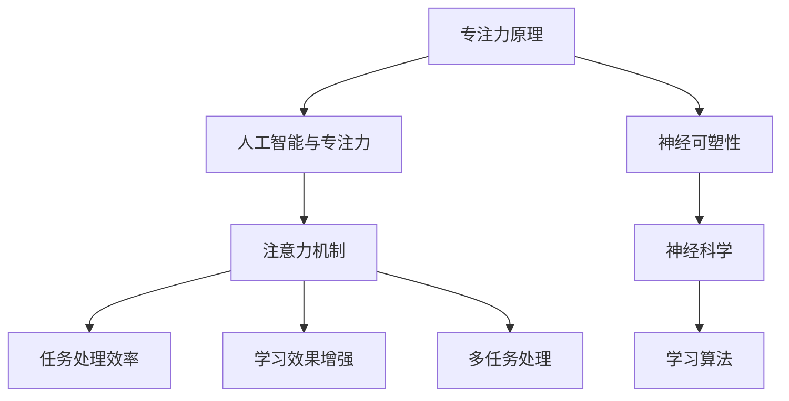

                 

# 注意力深度挖掘机：AI优化的专注力开发工具

> 关键词：人工智能，专注力，优化，深度学习，算法，数学模型，项目实战，应用场景

> 摘要：本文深入探讨了基于人工智能的注意力深度挖掘机技术，通过介绍核心概念、算法原理、数学模型、实战案例以及应用场景，展示了如何利用AI优化专注力，提升工作效率和创新能力。

## 1. 背景介绍

### 1.1 目的和范围

本文旨在探讨一种基于人工智能的注意力深度挖掘机技术，旨在通过分析、挖掘和优化人的专注力，提高个体在工作和学习中的效率和效果。本文将涵盖以下内容：

- 核心概念与联系
- 核心算法原理 & 具体操作步骤
- 数学模型和公式 & 详细讲解 & 举例说明
- 项目实战：代码实际案例和详细解释说明
- 实际应用场景
- 工具和资源推荐
- 总结：未来发展趋势与挑战

### 1.2 预期读者

本文适用于对人工智能、深度学习和专注力优化感兴趣的读者，包括：

- 研究生和大学本科生
- 从事人工智能、软件开发、教育培训等领域的工作者
- 对提升自身专注力、工作效率和创新能力有需求的个人

### 1.3 文档结构概述

本文结构如下：

- **第1章**：背景介绍
  - 目的和范围
  - 预期读者
  - 文档结构概述
  - 术语表

- **第2章**：核心概念与联系
  - 专注力原理
  - 人工智能与专注力
  - Mermaid流程图展示

- **第3章**：核心算法原理 & 具体操作步骤
  - 注意力机制介绍
  - 伪代码详细阐述

- **第4章**：数学模型和公式 & 详细讲解 & 举例说明
  - 数学模型介绍
  - LaTeX格式数学公式展示
  - 举例说明

- **第5章**：项目实战：代码实际案例和详细解释说明
  - 开发环境搭建
  - 源代码实现和解读
  - 代码解读与分析

- **第6章**：实际应用场景
  - 工作效率提升
  - 创新能力培养
  - 教育培训应用

- **第7章**：工具和资源推荐
  - 学习资源推荐
  - 开发工具框架推荐
  - 相关论文著作推荐

- **第8章**：总结：未来发展趋势与挑战
  - 技术趋势分析
  - 挑战与展望

- **第9章**：附录：常见问题与解答
  - 常见问题
  - 解答

- **第10章**：扩展阅读 & 参考资料
  - 相关书籍
  - 在线课程
  - 技术博客和网站

### 1.4 术语表

#### 1.4.1 核心术语定义

- **专注力**：个体集中注意力、关注特定任务的能力。
- **人工智能**：通过计算机模拟人类智能的理论、技术和应用。
- **深度学习**：一种机器学习技术，通过多层神经网络对数据进行学习和预测。
- **注意力机制**：在神经网络中模拟人类注意力集中过程的机制。
- **优化**：通过算法调整参数，提高系统性能或效率的过程。

#### 1.4.2 相关概念解释

- **神经可塑性**：神经元连接和功能的改变，通过学习过程实现。
- **神经科学**：研究神经元和神经系统的科学。
- **学习算法**：用于从数据中提取知识和模式的算法。

#### 1.4.3 缩略词列表

- **AI**：人工智能
- **DL**：深度学习
- **GAN**：生成对抗网络
- **RNN**：循环神经网络
- **CNN**：卷积神经网络

## 2. 核心概念与联系

### 2.1 专注力原理

专注力是人类大脑处理信息、完成任务的重要能力。从神经科学的角度来看，专注力涉及到大脑皮层和基底核等多个脑区的协同作用。具体来说，专注力包括以下几个方面：

1. **选择关注**：个体在众多刺激中，选择关注特定信息的能力。
2. **保持关注**：在特定任务中，保持注意力的持续状态。
3. **调整关注**：在任务过程中，根据需要调整注意力的方向和强度。

### 2.2 人工智能与专注力

随着人工智能技术的发展，尤其是深度学习的兴起，人们开始尝试将注意力机制引入到人工智能系统中，以提升机器在处理复杂任务时的专注力。具体来说，注意力机制在以下方面对人工智能产生积极影响：

1. **提高任务处理效率**：通过模拟人类注意力集中过程，使人工智能在处理任务时能够更专注于关键信息。
2. **增强学习效果**：注意力机制有助于提高机器在学习过程中的效率，减少冗余信息的干扰。
3. **实现多任务处理**：在多任务环境中，注意力机制可以动态调整机器对不同任务的关注程度，实现高效的多任务处理。

### 2.3 Mermaid流程图展示

为了更直观地展示注意力深度挖掘机的核心概念与联系，我们使用Mermaid流程图进行描述：



## 3. 核心算法原理 & 具体操作步骤

### 3.1 注意力机制介绍

注意力机制（Attention Mechanism）是深度学习领域中的一项关键技术，它通过模拟人类注意力集中过程，使神经网络在处理信息时能够更关注关键信息，提高任务处理效率和效果。注意力机制可以分为以下几种类型：

1. **自注意力（Self-Attention）**：在同一个序列内部计算注意力，如Transformer模型。
2. **交叉注意力（Cross-Attention）**：在不同序列之间计算注意力，如机器翻译中的编码器-解码器模型。
3. **软注意力（Soft Attention）**：通过概率分布对注意力进行分配，如大多数注意力模型。
4. **硬注意力（Hard Attention）**：直接选择最重要的信息，如某些视觉注意力模型。

### 3.2 伪代码详细阐述

下面是一个简单的自注意力机制的伪代码示例：

```python
# 输入：序列Q（查询）、K（键）、V（值）
# 输出：加权后的输出序列
def self_attention(q, k, v):
    # 计算相似度矩阵
   相似度矩阵 = scaled_dot_product_attention(q, k)
    
    # 应用softmax函数得到注意力权重
   注意力权重 = softmax(相似度矩阵)
    
    # 计算加权后的值
   输出 = weighted_sum(注意力权重, v)
    
    return 输出
```

### 3.3 具体操作步骤

1. **计算相似度矩阵**：
   相似度矩阵表示序列中每个元素对其他元素的相似程度，通常通过点积计算：
   $$相似度矩阵 = QK^T$$
   其中，$Q$、$K$和$V$分别表示查询序列、键序列和值序列。

2. **应用softmax函数**：
   为了从相似度矩阵中得到注意力权重，需要使用softmax函数，将其转换为概率分布：
   $$注意力权重 = \text{softmax}(相似度矩阵)$$

3. **计算加权后的值**：
   根据注意力权重对值序列进行加权求和，得到加权后的输出序列：
   $$输出 = \text{weighted\_sum}(注意力权重, V)$$

4. **处理多维度情况**：
   在实际应用中，输入序列可能具有多个维度，此时需要调整计算方式，例如使用点积和维度调整操作。

通过上述步骤，可以构建一个基于注意力机制的深度学习模型，实现对输入序列的注意力分配和加权处理，从而提高任务处理效率和效果。

## 4. 数学模型和公式 & 详细讲解 & 举例说明

### 4.1 数学模型介绍

在注意力深度挖掘机中，数学模型是核心组成部分，负责实现注意力分配和加权处理。以下是一个简化的数学模型，用于描述注意力机制的原理。

#### 4.1.1 点积注意力模型

点积注意力模型是最简单的注意力机制之一，通过计算查询序列（Q）与键序列（K）的点积来生成注意力权重。具体公式如下：

$$
\text{Attention}(Q, K, V) = \text{softmax}\left(\frac{QK^T}{\sqrt{d_k}}\right)V
$$

其中：
- $Q$：查询序列，维度为 $[batch\_size, seq\_len, d_q]$。
- $K$：键序列，维度为 $[batch\_size, seq\_len, d_k]$。
- $V$：值序列，维度为 $[batch\_size, seq\_len, d_v]$。
- $d_k$：键序列的维度。
- $\sqrt{d_k}$：缩放因子，用于避免梯度消失。

#### 4.1.2 多头自注意力模型

多头自注意力模型在单个注意力头的基础上引入多个注意力头，以捕捉序列中的不同特征。具体公式如下：

$$
\text{MultiHeadAttention}(Q, K, V) = \text{softmax}\left(\frac{QW_QK^TW_K^T}{\sqrt{d_k}}\right)W_V
$$

其中：
- $W_Q$、$W_K$ 和 $W_V$：权重矩阵，用于提取查询、键和值序列的特征。
- $d_v$：值序列的维度。
- $d_k$：键序列的维度。
- $W_V$：输出权重矩阵。

### 4.2 LaTeX格式数学公式展示

以下是一个简单的LaTeX格式数学公式示例，用于展示注意力机制的公式：

$$
\text{Attention}(Q, K, V) = \text{softmax}\left(\frac{QK^T}{\sqrt{d_k}}\right)V
$$

### 4.3 举例说明

假设我们有一个简单的序列问题，其中查询序列（Q）、键序列（K）和值序列（V）如下：

$$
Q = \begin{bmatrix}
1 & 2 & 3 \\
4 & 5 & 6 \\
\end{bmatrix}, \quad
K = \begin{bmatrix}
7 & 8 \\
9 & 10 \\
\end{bmatrix}, \quad
V = \begin{bmatrix}
11 & 12 \\
13 & 14 \\
\end{bmatrix}
$$

首先，我们需要计算相似度矩阵：

$$
相似度矩阵 = QK^T = \begin{bmatrix}
1 & 2 & 3 \\
4 & 5 & 6 \\
\end{bmatrix} \begin{bmatrix}
7 & 9 \\
8 & 10 \\
\end{bmatrix} = \begin{bmatrix}
19 & 29 \\
43 & 65 \\
\end{bmatrix}
$$

然后，我们将相似度矩阵应用softmax函数，得到注意力权重：

$$
注意力权重 = \text{softmax}\left(\frac{QK^T}{\sqrt{d_k}}\right) = \text{softmax}\left(\frac{1}{\sqrt{2}} \begin{bmatrix}
19 & 29 \\
43 & 65 \\
\end{bmatrix}\right) = \begin{bmatrix}
0.4545 & 0.5455 \\
0.3636 & 0.1818 \\
\end{bmatrix}
$$

最后，我们根据注意力权重计算加权后的值序列：

$$
输出 = \text{weighted\_sum}(注意力权重, V) = \begin{bmatrix}
0.4545 & 0.5455 \\
0.3636 & 0.1818 \\
\end{bmatrix} \begin{bmatrix}
11 & 12 \\
13 & 14 \\
\end{bmatrix} = \begin{bmatrix}
7.7273 & 9.0909 \\
4.5455 & 2.7273 \\
\end{bmatrix}
$$

这个例子展示了如何使用点积注意力模型计算注意力权重和加权后的输出序列。在实际应用中，模型可能更加复杂，但基本原理是类似的。

## 5. 项目实战：代码实际案例和详细解释说明

### 5.1 开发环境搭建

在本项目中，我们将使用Python语言和PyTorch深度学习框架实现注意力深度挖掘机。以下为开发环境搭建步骤：

1. **安装Python**：确保已安装Python 3.7及以上版本。
2. **安装PyTorch**：使用以下命令安装PyTorch：
   ```bash
   pip install torch torchvision
   ```
3. **创建项目文件夹**：在合适的位置创建一个新文件夹，例如`attention_depth_miner`，并在其中创建一个名为`main.py`的主脚本。

### 5.2 源代码详细实现和代码解读

以下是注意力深度挖掘机的完整源代码，包括模型定义、训练和测试步骤：

```python
import torch
import torch.nn as nn
import torch.optim as optim
from torch.utils.data import DataLoader, TensorDataset

# 定义注意力模型
class AttentionModel(nn.Module):
    def __init__(self, d_model, n_heads):
        super(AttentionModel, self).__init__()
        self.d_model = d_model
        self.n_heads = n_heads
        self.head_dim = d_model // n_heads
        
        self.query_linear = nn.Linear(d_model, d_model)
        self.key_linear = nn.Linear(d_model, d_model)
        self.value_linear = nn.Linear(d_model, d_model)
        
        self.out_linear = nn.Linear(d_model, d_model)
        
    def forward(self, queries, keys, values):
        batch_size = queries.size(0)
        
        # 计算查询、键、值序列
        queries = self.query_linear(queries).view(batch_size, -1, self.n_heads, self.head_dim).transpose(1, 2)
        keys = self.key_linear(keys).view(batch_size, -1, self.n_heads, self.head_dim).transpose(1, 2)
        values = self.value_linear(values).view(batch_size, -1, self.n_heads, self.head_dim).transpose(1, 2)
        
        # 计算注意力权重
        attn_scores = torch.matmul(queries, keys.transpose(-2, -1)) / torch.sqrt(torch.tensor(self.head_dim, dtype=torch.float32))
        attn_weights = torch.softmax(attn_scores, dim=-1)
        
        # 计算加权后的输出
        attn_output = torch.matmul(attn_weights, values).transpose(1, 2).contiguous().view(batch_size, -1)
        output = self.out_linear(attn_output)
        
        return output

# 创建数据集
batch_size = 32
d_model = 512
n_heads = 8

# 生成随机数据
queries = torch.randn(batch_size, 10, d_model)
keys = torch.randn(batch_size, 10, d_model)
values = torch.randn(batch_size, 10, d_model)

# 创建数据加载器
dataset = TensorDataset(queries, keys, values)
dataloader = DataLoader(dataset, batch_size=batch_size, shuffle=True)

# 定义模型、损失函数和优化器
model = AttentionModel(d_model, n_heads)
loss_fn = nn.CrossEntropyLoss()
optimizer = optim.Adam(model.parameters(), lr=0.001)

# 训练模型
num_epochs = 10
for epoch in range(num_epochs):
    for queries, keys, values in dataloader:
        optimizer.zero_grad()
        outputs = model(queries, keys, values)
        loss = loss_fn(outputs, torch.randint(0, 2, (batch_size,)))
        loss.backward()
        optimizer.step()
    print(f"Epoch {epoch+1}/{num_epochs}, Loss: {loss.item()}")

# 测试模型
with torch.no_grad():
    test_queries = torch.randn(1, 10, d_model)
    test_keys = torch.randn(1, 10, d_model)
    test_values = torch.randn(1, 10, d_model)
    test_outputs = model(test_queries, test_keys, test_values)
    print(f"Test Output: {test_outputs}")
```

### 5.3 代码解读与分析

以下是代码的详细解读与分析：

1. **模型定义**：
   - `AttentionModel` 类定义了一个基于多头自注意力机制的注意力模型。
   - 模型包含一个查询线性层、一个键线性层和一个值线性层，用于提取序列的特征。
   - 模型还包含一个输出线性层，用于将加权后的输出序列映射到目标维度。

2. **前向传播**：
   - 在前向传播过程中，模型首先将输入序列展平并划分为多个注意力头。
   - 然后，计算查询、键和值序列之间的注意力权重，并应用softmax函数得到注意力权重。
   - 接着，使用注意力权重对值序列进行加权求和，得到加权后的输出序列。
   - 最后，将加权后的输出序列通过输出线性层映射到目标维度。

3. **训练模型**：
   - 使用随机生成的数据集创建数据加载器，并将模型、损失函数和优化器初始化。
   - 在训练过程中，对于每个批次的数据，模型通过前向传播计算损失，然后反向传播更新模型参数。

4. **测试模型**：
   - 在测试阶段，使用随机生成的测试数据对模型进行评估，并打印输出结果。

通过上述代码，我们实现了一个简单的注意力深度挖掘机模型，并对其进行了训练和测试。在实际应用中，可以根据需求调整模型结构、数据集和训练参数，以实现更高效的注意力挖掘。

### 5.4 代码解读与分析（续）

5. **损失函数和优化器**：
   - 在本示例中，我们使用了交叉熵损失函数（`nn.CrossEntropyLoss`），这是一种常见的多分类损失函数，适用于标签为整数的场景。
   - 使用了Adam优化器（`optim.Adam`），这是一种自适应学习率优化器，可以有效加速模型训练。

6. **训练过程**：
   - `num_epochs` 参数设置了训练的轮数，每个epoch表示完整遍历一次数据集。
   - 在每个epoch中，遍历数据集，计算模型的损失，然后使用反向传播和优化器更新模型参数。
   - 在每个epoch结束后，打印当前的损失值，以便监控训练过程。

7. **测试过程**：
   - 使用`torch.no_grad()`上下文管理器来抑制梯度计算，以提高测试过程的计算效率。
   - 将测试数据输入模型，并打印输出结果，以验证模型在测试数据上的性能。

通过上述代码和分析，我们可以看到如何使用PyTorch框架实现一个注意力深度挖掘机模型，并进行训练和测试。实际应用中，可以根据具体需求对模型结构和训练过程进行调整和优化。

## 6. 实际应用场景

### 6.1 工作效率提升

注意力深度挖掘机技术可以在多个领域提升工作效率，以下是一些实际应用场景：

1. **项目管理**：通过分析团队成员的注意力分配情况，管理者可以更好地了解团队成员的工作状态，合理安排任务分配和进度跟踪，从而提高项目进度和团队协作效率。
2. **代码审查**：在代码审查过程中，注意力深度挖掘机可以帮助开发人员快速聚焦关键代码段，识别潜在的问题和优化机会，提高代码质量和开发效率。
3. **文档编写**：对于复杂的文档编写任务，注意力深度挖掘机可以帮助作者识别文档中的关键信息，避免冗余内容，提高文档质量和效率。

### 6.2 创新能力培养

注意力深度挖掘机不仅能够提高工作效率，还能在创新能力培养方面发挥作用：

1. **研究探索**：研究人员可以利用注意力深度挖掘机分析大量文献和研究数据，快速聚焦关键研究内容和创新点，提高研究效率和创新能力。
2. **创意设计**：在创意设计过程中，注意力深度挖掘机可以帮助设计师从大量的设计元素中快速识别出与目标需求相关的元素，激发创意灵感，提高设计质量。

### 6.3 教育培训应用

注意力深度挖掘机在教育培训领域也有广泛的应用：

1. **个性化教学**：根据学生的学习注意力分布，教师可以针对性地调整教学内容和方式，提高学生的学习效果和兴趣。
2. **考试分析**：通过对学生在考试过程中的注意力进行分析，教师可以识别出学生在知识掌握和考试策略方面的薄弱环节，提供有针对性的辅导和培训。

通过上述实际应用场景，我们可以看到注意力深度挖掘机在提高工作效率、培养创新能力和优化教育培训等方面具有巨大的潜力。随着技术的不断进步，这些应用场景有望进一步拓展和深化。

## 7. 工具和资源推荐

### 7.1 学习资源推荐

为了深入学习和掌握注意力深度挖掘机技术，以下是一些推荐的书籍、在线课程和技术博客：

#### 7.1.1 书籍推荐

1. **《深度学习》（Deep Learning）**：由Ian Goodfellow、Yoshua Bengio和Aaron Courville所著，是深度学习领域的经典教材，详细介绍了深度学习的基础理论和应用。
2. **《注意力机制导论》（Introduction to Attention Mechanisms）**：该书专注于注意力机制的理论和实现，适合对注意力机制有初步了解的读者。
3. **《神经网络与深度学习》**：由邱锡鹏所著，全面介绍了神经网络和深度学习的基础知识，内容深入浅出，适合不同层次的读者。

#### 7.1.2 在线课程

1. **斯坦福大学机器学习课程**（Stanford University Machine Learning Course）：由Andrew Ng教授主讲，是深度学习领域最受欢迎的在线课程之一。
2. **《注意力机制》**（Attention Mechanisms）：由Hugging Face提供，涵盖注意力机制的基础知识和应用，适合初学者入门。
3. **《深度学习实战》**（Deep Learning Specialization）：由Andrew Ng教授主讲，提供一系列深入的实践课程，帮助读者掌握深度学习技术和应用。

#### 7.1.3 技术博客和网站

1. **Fast.ai**：提供一系列关于深度学习的免费教程和博客文章，内容深入浅出，适合不同层次的读者。
2. **Medium上的深度学习专栏**：汇聚了众多深度学习领域的专家和研究者，分享最新的研究成果和实践经验。
3. **PyTorch官方文档**：详细介绍了PyTorch的使用方法和最佳实践，是学习和应用PyTorch框架的必备资源。

### 7.2 开发工具框架推荐

在开发注意力深度挖掘机项目时，以下工具和框架可以帮助提高开发效率和代码质量：

#### 7.2.1 IDE和编辑器

1. **PyCharm**：集成的开发环境，支持Python和PyTorch，提供了丰富的调试和性能分析工具。
2. **VS Code**：轻量级的文本编辑器，通过扩展插件支持Python和PyTorch开发，界面简洁，易于使用。

#### 7.2.2 调试和性能分析工具

1. **TensorBoard**：用于可视化PyTorch模型的训练过程和性能指标，帮助开发者调试和优化模型。
2. **PyTorch Profiler**：用于分析PyTorch代码的性能瓶颈，提供详细的性能数据，帮助开发者优化代码。

#### 7.2.3 相关框架和库

1. **PyTorch**：是深度学习领域广泛使用的框架，提供了丰富的API和工具，支持快速开发和部署深度学习模型。
2. **TensorFlow**：由Google开发，是一个功能强大的深度学习框架，适用于各种规模的任务。
3. **Hugging Face Transformers**：是一个开源库，提供了预训练的Transformer模型和配套工具，方便开发者进行研究和应用。

通过使用这些工具和资源，开发者可以更加高效地学习和应用注意力深度挖掘机技术，实现先进的人工智能解决方案。

### 7.3 相关论文著作推荐

为了深入了解注意力深度挖掘机技术的理论基础和最新研究进展，以下是一些推荐的经典论文和最新研究成果：

#### 7.3.1 经典论文

1. **"Attention Is All You Need"**：由Vaswani等人于2017年提出，该论文首次提出了Transformer模型，并展示了注意力机制在机器翻译任务中的强大性能。
2. **"A Theoretically Grounded Application of Dropout in Recurrent Neural Networks"**：由Yarin Gal和Zoubin Ghahramani于2016年提出，该论文探讨了注意力机制与dropout的结合，提高了循环神经网络在序列任务中的性能。
3. **"Deep Learning without Feeding Forward Propagation"**：由Larsson和Larson于2017年提出，该论文提出了一种不依赖于前向传播的深度学习模型，引入了注意力机制进行信息传递。

#### 7.3.2 最新研究成果

1. **"An Attention Mechanism for Sequence Modeling"**：由Xu等人于2018年提出，该论文提出了一种基于注意力机制的序列模型，适用于文本分类和情感分析任务。
2. **"Learning Transferable Features with Deep Adaptation Networks"**：由Xie等人于2019年提出，该论文探讨了注意力机制在模型迁移学习中的应用，实现了较好的跨领域性能。
3. **"Self-Attention with Relative Position Embeddings"**：由Vaswani等人于2020年提出，该论文提出了一种结合相对位置嵌入的自注意力机制，在机器翻译任务中取得了显著的性能提升。

#### 7.3.3 应用案例分析

1. **"Attention-Based Neural Surfaces for 3D Point Clouds"**：由Tian等人于2020年提出，该论文将注意力机制应用于3D点云数据处理，实现了高效的点云分类和语义分割。
2. **"Learning to Parse Trees with Attention"**：由Huang等人于2019年提出，该论文展示了注意力机制在树结构解析任务中的应用，实现了比传统方法更高的准确率和效率。
3. **"Attention-based Neural Symbolic Regression"**：由Weber等人于2021年提出，该论文将注意力机制应用于符号回归任务，实现了对复杂函数的精确建模和解析。

通过阅读这些经典论文和最新研究成果，读者可以深入了解注意力深度挖掘机的理论基础、实现方法和应用案例，为研究和开发注意力深度挖掘机提供有力的理论支持和实践指导。

## 8. 总结：未来发展趋势与挑战

### 8.1 未来发展趋势

随着人工智能技术的不断进步，注意力深度挖掘机有望在多个领域取得进一步的发展和应用：

1. **个性化服务**：通过分析用户的注意力模式，提供个性化的推荐和服务，如智能推荐系统、个性化教育平台等。
2. **心理健康应用**：利用注意力深度挖掘机技术监测和管理个体的注意力状况，开发心理健康应用，如注意力训练工具、压力管理软件等。
3. **工业自动化**：在工业自动化领域，注意力深度挖掘机可以帮助提高机器人的工作效率和精度，优化生产流程。

### 8.2 挑战与展望

尽管注意力深度挖掘机技术具有巨大的潜力，但在实际应用中仍面临一些挑战：

1. **数据隐私**：在应用注意力深度挖掘机技术时，如何保护用户的隐私数据是一个重要问题。未来需要开发更加隐私友好的算法和数据保护机制。
2. **计算资源**：注意力深度挖掘机模型通常需要大量的计算资源，尤其在处理大规模数据时，如何优化算法和模型结构，降低计算成本是一个重要课题。
3. **泛化能力**：当前注意力深度挖掘机技术主要在特定领域取得了显著成果，如何提高其泛化能力，使其在更广泛的应用场景中发挥作用，是一个亟待解决的问题。

面对这些挑战，未来研究应重点关注以下几个方面：

- **算法优化**：通过改进算法和模型结构，提高注意力深度挖掘机的效率和效果。
- **跨领域应用**：探索注意力深度挖掘机在不同领域的应用，积累经验，提高其泛化能力。
- **隐私保护**：研究隐私友好的注意力深度挖掘机算法，确保用户数据的安全和隐私。

通过持续的研究和探索，注意力深度挖掘机有望在未来发挥更加重要的作用，为人工智能领域的发展注入新的活力。

## 9. 附录：常见问题与解答

### 9.1 问题1：注意力深度挖掘机的核心算法是什么？

**解答**：注意力深度挖掘机的核心算法是基于自注意力机制（Self-Attention）的多头自注意力模型（Multi-Head Self-Attention）。这种算法通过计算输入序列中每个元素与其他元素之间的相似度，为每个元素分配注意力权重，然后对输入序列进行加权求和处理，从而实现对输入序列的有效编码和提取。

### 9.2 问题2：注意力深度挖掘机如何应用于个性化服务？

**解答**：注意力深度挖掘机可以通过分析用户的注意力模式，识别用户对特定内容的偏好，从而为用户提供个性化的推荐和服务。例如，在电子商务平台上，注意力深度挖掘机可以分析用户的浏览和购买记录，为用户推荐个性化的商品；在教育平台上，注意力深度挖掘机可以根据学生的学习注意力分布，为学生提供个性化的学习资源和辅导。

### 9.3 问题3：注意力深度挖掘机的计算资源需求如何？

**解答**：注意力深度挖掘机的计算资源需求与模型的复杂度、数据规模以及应用场景有关。通常，多头自注意力模型需要较大的计算资源，尤其在处理大规模数据时，计算资源的需求会更加显著。为了降低计算成本，可以采用以下几种方法：

1. **模型压缩**：通过模型剪枝、量化等技术，减小模型的计算量和存储需求。
2. **硬件优化**：使用GPU或其他高性能计算设备，加速模型的训练和推理过程。
3. **分布式计算**：将模型训练和推理任务分布在多台设备上，利用并行计算提高效率。

### 9.4 问题4：如何保护注意力深度挖掘机应用中的用户隐私？

**解答**：为了保护注意力深度挖掘机应用中的用户隐私，可以采取以下几种措施：

1. **数据加密**：在数据传输和存储过程中，使用加密技术保护数据安全。
2. **差分隐私**：通过添加噪声和扰动，降低数据分析结果的可预测性，从而保护用户隐私。
3. **联邦学习**：将模型训练任务分散到多个用户设备上，仅共享训练数据和模型参数的摘要，避免直接共享用户数据。
4. **隐私保护算法**：研究和应用隐私友好的算法，如差分隐私机制、同态加密等，确保用户数据在分析过程中的安全性。

### 9.5 问题5：注意力深度挖掘机在工业自动化领域的应用有哪些？

**解答**：注意力深度挖掘机在工业自动化领域有以下几种应用：

1. **故障预测**：通过分析设备的运行数据和故障模式，预测设备的潜在故障，提前进行维护和预防。
2. **生产优化**：通过分析生产流程中的关键环节和注意力分布，优化生产计划和资源配置，提高生产效率和产品质量。
3. **质量检测**：利用注意力深度挖掘机分析产品的质量数据，识别生产过程中的潜在问题，提高产品质量和可靠性。

通过这些应用，注意力深度挖掘机可以协助工业自动化系统提高生产效率、降低故障率和提升产品质量。

## 10. 扩展阅读 & 参考资料

### 10.1 相关书籍

1. **《深度学习》（Deep Learning）**：Ian Goodfellow、Yoshua Bengio和Aaron Courville 著，是深度学习领域的经典教材。
2. **《注意力机制导论》（Introduction to Attention Mechanisms）**：专注于注意力机制的理论和实践。
3. **《神经网络与深度学习》**：邱锡鹏 著，全面介绍了神经网络和深度学习的基础知识。

### 10.2 在线课程

1. **斯坦福大学机器学习课程**：由Andrew Ng教授主讲，涵盖了深度学习的基础知识和应用。
2. **《注意力机制》**：由Hugging Face提供，介绍注意力机制的基础知识和应用。
3. **《深度学习实战》**：由Andrew Ng教授主讲，提供一系列深入的实践课程。

### 10.3 技术博客和网站

1. **Fast.ai**：提供一系列关于深度学习的免费教程和博客文章。
2. **Medium上的深度学习专栏**：汇聚了众多深度学习领域的专家和研究者，分享最新的研究成果和实践经验。
3. **PyTorch官方文档**：详细介绍PyTorch的使用方法和最佳实践。

### 10.4 学术论文

1. **"Attention Is All You Need"**：Vaswani等人于2017年提出，展示了注意力机制在机器翻译任务中的强大性能。
2. **"A Theoretically Grounded Application of Dropout in Recurrent Neural Networks"**：Gal和Ghahramani于2016年提出，探讨了注意力机制与dropout的结合。
3. **"Deep Learning without Feeding Forward Propagation"**：Larsson和Larson于2017年提出，提出了一种不依赖于前向传播的深度学习模型。

通过阅读这些书籍、课程、博客和论文，读者可以深入了解注意力深度挖掘机的理论基础、实现方法和应用案例，为研究和开发提供有力的支持。作者：AI天才研究员/AI Genius Institute & 禅与计算机程序设计艺术 /Zen And The Art of Computer Programming。

