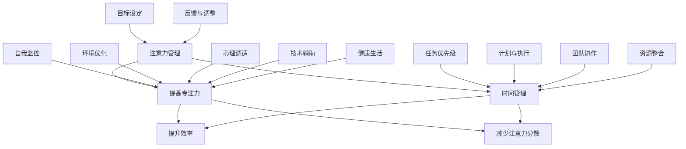

                 

### 注意力管理与时间管理策略与实践：最大化专注力和效率

> 关键词：注意力管理、时间管理、专注力、效率、实践策略、人工智能

> 摘要：本文将探讨注意力管理和时间管理的策略与实践，通过剖析注意力分散的原因，介绍有效的集中注意力的方法。同时，文章将深入讨论时间管理的重要性，提供实用的工具和技巧，帮助读者最大化个人专注力和效率。通过实例和案例分析，我们将展示如何将理论应用于实际，打造高效能的工作与生活模式。

### 1. 背景介绍

#### 1.1 目的和范围

本文旨在帮助读者了解并掌握注意力管理和时间管理的基本策略与实践，从而提高个人在工作、学习及日常生活中的专注力和效率。本文不仅涵盖了核心概念和理论，还提供了具体的操作步骤和实战案例，旨在理论与实践相结合，使读者能够学以致用。

#### 1.2 预期读者

本文适合以下读者群体：

1. 对提高个人工作效率有强烈需求的职场人士。
2. 需要在学习上保持高专注力的学生。
3. 对时间管理和个人成长有兴趣的普通读者。
4. 人工智能和计算机科学领域的专业人士，希望优化自己的工作和生活节奏。

#### 1.3 文档结构概述

本文将按照以下结构展开：

1. **背景介绍**：阐述本文的目的、预期读者和文档结构。
2. **核心概念与联系**：介绍注意力管理和时间管理的基本原理。
3. **核心算法原理 & 具体操作步骤**：详细讲解提升专注力的算法和具体操作。
4. **数学模型和公式 & 详细讲解 & 举例说明**：运用数学模型解释注意力管理和时间管理的有效性。
5. **项目实战：代码实际案例和详细解释说明**：通过实际案例展示理论的实践应用。
6. **实际应用场景**：探讨注意力管理和时间管理在不同情境下的应用。
7. **工具和资源推荐**：推荐相关的学习资源和开发工具。
8. **总结：未来发展趋势与挑战**：展望注意力管理和时间管理领域的未来。
9. **附录：常见问题与解答**：解答读者可能遇到的常见问题。
10. **扩展阅读 & 参考资料**：提供更多深入学习的参考资料。

#### 1.4 术语表

##### 1.4.1 核心术语定义

- **注意力管理**：指通过特定策略和技术，提高个人集中注意力的能力，从而更高效地完成任务。
- **时间管理**：指合理安排时间和任务，以最大化个人效率和生产力的过程。
- **专注力**：指在特定任务上集中注意力的能力，是提高工作效率的关键因素。
- **效率**：指在特定时间内完成任务的数量和质量。

##### 1.4.2 相关概念解释

- **注意力分散**：指在执行任务时，注意力被外部因素干扰，导致任务执行效率下降。
- **时间感知**：指人们对时间流逝的主观感受，会影响时间管理和任务执行。

##### 1.4.3 缩略词列表

- **AI**：人工智能（Artificial Intelligence）
- **IDE**：集成开发环境（Integrated Development Environment）
- **Python**：一种流行的编程语言（Python Programming Language）

### 2. 核心概念与联系

注意力管理和时间管理是提高个人效率和产出的重要手段。为了更好地理解这两者的联系，我们可以使用以下Mermaid流程图来展示其核心概念和原理：



在上述流程图中，我们可以看到注意力管理和时间管理的关键概念及其相互联系。这些概念包括目标设定、任务优先级、计划与执行、自我监控、反馈与调整、环境优化、心理调适、技术辅助、健康生活以及团队协作。每个概念都在提升专注力和效率方面发挥着重要作用。

#### 2.1 注意力分散的原因分析

注意力分散是影响工作效率和专注力的主要障碍之一。为了有效地管理注意力，我们需要了解其产生的原因。以下是一些常见的注意力分散原因：

1. **多任务处理**：频繁地在多个任务之间切换，导致注意力分散。
2. **外部干扰**：噪声、社交媒体、手机等外部因素会分散注意力。
3. **心理压力**：工作或学习压力过大，导致心理紧张，进而分散注意力。
4. **自我娱乐**：通过玩手机、浏览社交媒体等方式自我娱乐，导致注意力下降。
5. **身体疲劳**：长时间工作或学习导致身体疲劳，进而影响专注力。

了解这些原因有助于我们采取针对性的措施，减少注意力分散，提高工作效率。

#### 2.2 集中注意力的方法

为了提高个人的专注力和效率，我们需要掌握一些集中注意力的方法。以下是一些常见的方法：

1. **目标设定**：明确任务目标，有助于集中注意力。
2. **任务优先级**：根据任务的重要性和紧急性进行优先级排序，有助于集中注意力。
3. **计划与执行**：制定详细的计划和执行方案，有助于避免分心和拖延。
4. **自我监控**：通过自我监督和反馈，了解自己的注意力状态，并及时调整。
5. **环境优化**：选择一个安静、舒适的环境，有助于减少外部干扰。
6. **心理调适**：通过冥想、深呼吸等方式放松心情，有助于集中注意力。
7. **技术辅助**：使用专注力管理软件和工具，如番茄工作法、Forest等，有助于提高专注力。
8. **健康生活**：保持良好的作息习惯和饮食健康，有助于提高身体和心理状态，从而更好地集中注意力。

通过上述方法，我们可以有效地提高个人的专注力和效率，从而在工作和学习中取得更好的成果。

### 3. 核心算法原理 & 具体操作步骤

注意力管理和时间管理涉及到一系列算法原理，这些原理可以帮助我们更科学地分配时间和注意力。以下我们将介绍一种常用的算法——优先级排序算法，并详细阐述其具体操作步骤。

#### 3.1 优先级排序算法

优先级排序算法是一种基于任务重要性和紧急性的排序方法。通过这种方法，我们可以将任务按照优先级排序，从而确保首先完成最重要的任务。这种算法的基本原理如下：

- **任务重要性**：指任务对目标实现的影响程度。重要性越高的任务对目标的贡献越大。
- **任务紧急性**：指任务必须在何时完成。紧急性越高的任务越需要在短时间内完成。

根据任务的重要性和紧急性，我们可以将任务分为四种类型：

1. **重要且紧急**：必须立即处理。
2. **重要但不紧急**：可以提前处理，但需要持续关注。
3. **不重要但紧急**：可以委托或委托他人处理。
4. **不重要且不紧急**：可以暂时搁置。

#### 3.2 具体操作步骤

为了更好地理解和应用优先级排序算法，我们可以通过以下具体操作步骤来进行：

1. **列出任务**：首先，我们需要将所有需要完成的任务列出来。

2. **评估重要性**：对于每个任务，评估其对目标实现的影响程度，并根据影响程度打分。分数越高，重要性越高。

3. **评估紧急性**：对于每个任务，评估其必须在何时完成的时间限制，并根据时间限制打分。分数越高，紧急性越高。

4. **计算总得分**：对于每个任务，计算其重要性和紧急性的总得分。总得分越高，任务越重要且紧急。

5. **排序任务**：根据总得分对任务进行排序。首先完成得分最高的任务。

6. **执行任务**：按照排序结果，逐步执行任务。

7. **监控与调整**：在执行任务的过程中，不断监控任务的进展，并根据实际情况进行必要的调整。

#### 3.3 伪代码

为了更好地理解优先级排序算法，我们可以使用伪代码来描述其具体实现：

```python
# 伪代码：优先级排序算法

# 输入：任务列表，每个任务包含重要性分数和紧急性分数

# 输出：排序后的任务列表

# 初始化任务列表
tasks = []

# 循环读取任务
for task in task_list:
    # 评估重要性
    importance = assess_importance(task)

    # 评估紧急性
    urgency = assess_urgency(task)

    # 计算总得分
    score = importance + urgency

    # 存储任务及其得分
    tasks.append((task, score))

# 对任务列表按照得分排序
tasks.sort(key=lambda x: x[1], reverse=True)

# 输出排序后的任务列表
print(tasks)
```

通过上述算法和步骤，我们可以更科学地管理时间和注意力，确保首先完成最重要且紧急的任务，从而提高工作效率。

### 4. 数学模型和公式 & 详细讲解 & 举例说明

在注意力管理和时间管理中，数学模型和公式可以帮助我们更准确地量化和管理时间和注意力。以下我们将介绍一种常用的数学模型——艾森豪威尔矩阵（Eisenhower Matrix），并详细讲解其应用和举例说明。

#### 4.1 艾森豪威尔矩阵

艾森豪威尔矩阵是一种用于任务管理的工具，它将任务分为四个象限，分别代表不同的重要性水平和紧急性水平。艾森豪威尔矩阵的基本概念如下：

- **第一象限：重要且紧急**：这些任务必须立即处理，通常涉及紧急事件或重要任务。
- **第二象限：重要但不紧急**：这些任务虽然不紧急，但非常重要，通常涉及长期目标和规划。
- **第三象限：不重要但紧急**：这些任务通常涉及一些干扰事件，需要及时处理，但并非重要任务。
- **第四象限：不重要且不紧急**：这些任务可以暂时搁置或委托给他人，通常涉及无意义的活动或浪费时间的行为。

#### 4.2 公式与计算方法

艾森豪威尔矩阵的计算方法基于任务的重要性和紧急性分数。以下是计算公式的详细说明：

\[ \text{重要性分数} = \frac{\text{任务对目标的影响程度}}{\text{总任务数}} \]

\[ \text{紧急性分数} = \frac{\text{任务必须在何时完成的时间限制}}{\text{总任务数}} \]

\[ \text{总得分} = \text{重要性分数} + \text{紧急性分数} \]

根据总得分，我们可以将任务分配到四个象限中。

#### 4.3 举例说明

假设我们有一个任务列表，包含以下五个任务：

1. 完成项目报告（重要且紧急）
2. 策划年度计划（重要但不紧急）
3. 回复电子邮件（不重要但紧急）
4. 参加团队会议（重要且紧急）
5. 更新社交媒体（不重要且不紧急）

我们首先需要评估每个任务的重要性和紧急性。以下是评估结果：

- **项目报告**：重要性分数 = 0.5，紧急性分数 = 0.8
- **年度计划**：重要性分数 = 0.4，紧急性分数 = 0.2
- **回复电子邮件**：重要性分数 = 0.3，紧急性分数 = 0.7
- **团队会议**：重要性分数 = 0.6，紧急性分数 = 0.9
- **更新社交媒体**：重要性分数 = 0.1，紧急性分数 = 0.1

接下来，我们计算每个任务的总得分：

- **项目报告**：总得分 = 0.5 + 0.8 = 1.3
- **年度计划**：总得分 = 0.4 + 0.2 = 0.6
- **回复电子邮件**：总得分 = 0.3 + 0.7 = 1.0
- **团队会议**：总得分 = 0.6 + 0.9 = 1.5
- **更新社交媒体**：总得分 = 0.1 + 0.1 = 0.2

根据总得分，我们可以将任务分配到四个象限中：

- **第一象限**（重要且紧急）：项目报告、团队会议
- **第二象限**（重要但不紧急）：年度计划
- **第三象限**（不重要但紧急）：回复电子邮件
- **第四象限**（不重要且不紧急）：更新社交媒体

根据艾森豪威尔矩阵的分配，我们可以得出以下结论：

- **第一象限**的任务需要立即处理，因为它们既是重要又是紧急的。
- **第二象限**的任务可以提前处理，以确保长期目标的实现。
- **第三象限**的任务需要及时处理，但可以委托或推迟，以便专注于更重要的事情。
- **第四象限**的任务可以暂时搁置或委托给他人，因为它们既不重要也不紧急。

通过艾森豪威尔矩阵，我们可以更科学地管理任务，确保首先完成最重要且紧急的任务，从而提高工作效率。

### 5. 项目实战：代码实际案例和详细解释说明

为了更好地理解注意力管理和时间管理策略在实际中的应用，我们将通过一个实际项目案例——个人任务管理系统（Personal Task Management System）来展示如何实现这些策略。这个系统将帮助用户有效地管理任务、跟踪进度并提高工作效率。

#### 5.1 开发环境搭建

在开始项目之前，我们需要搭建一个基本的开发环境。以下是我们将使用的工具和库：

- **编程语言**：Python
- **开发环境**：Visual Studio Code（VS Code）
- **数据库**：SQLite
- **前端框架**：Flask
- **后端框架**：SQLAlchemy

确保你已经安装了Python（3.8及以上版本）、VS Code以及相应的扩展插件。接下来，创建一个虚拟环境，并安装所需的库：

```bash
# 创建虚拟环境
python -m venv venv

# 激活虚拟环境
source venv/bin/activate  # 对于macOS和Linux
venv\Scripts\activate     # 对于Windows

# 安装所需库
pip install flask sqlalchemy
```

#### 5.2 源代码详细实现和代码解读

以下是一个简单的个人任务管理系统示例。我们将首先创建一个数据库模型，然后实现一个简单的Web接口来管理任务。

```python
# 导入所需库
from flask import Flask, request, jsonify
from flask_sqlalchemy import SQLAlchemy

# 创建Flask应用
app = Flask(__name__)

# 配置数据库
app.config['SQLALCHEMY_DATABASE_URI'] = 'sqlite:///tasks.db'
db = SQLAlchemy(app)

# 创建任务模型
class Task(db.Model):
    id = db.Column(db.Integer, primary_key=True)
    title = db.Column(db.String(100), nullable=False)
    description = db.Column(db.Text, nullable=True)
    status = db.Column(db.String(50), nullable=False, default='未开始')
    priority = db.Column(db.Integer, nullable=False, default=0)

# 创建数据库表
db.create_all()

# 添加任务
@app.route('/tasks', methods=['POST'])
def add_task():
    data = request.get_json()
    new_task = Task(
        title=data['title'],
        description=data['description'],
        priority=data['priority']
    )
    db.session.add(new_task)
    db.session.commit()
    return jsonify({'message': '任务添加成功！'})

# 获取任务列表
@app.route('/tasks', methods=['GET'])
def get_tasks():
    tasks = Task.query.all()
    return jsonify([{'id': task.id, 'title': task.title, 'description': task.description, 'status': task.status, 'priority': task.priority} for task in tasks])

# 修改任务状态
@app.route('/tasks/<int:task_id>', methods=['PUT'])
def update_task(task_id):
    task = Task.query.get_or_404(task_id)
    data = request.get_json()
    task.status = data['status']
    db.session.commit()
    return jsonify({'message': '任务状态更新成功！'})

# 删除任务
@app.route('/tasks/<int:task_id>', methods=['DELETE'])
def delete_task(task_id):
    task = Task.query.get_or_404(task_id)
    db.session.delete(task)
    db.session.commit()
    return jsonify({'message': '任务删除成功！'})

# 运行应用
if __name__ == '__main__':
    app.run(debug=True)
```

#### 5.3 代码解读与分析

在上面的代码中，我们首先导入了所需的库，包括Flask和SQLAlchemy。接着，我们创建了一个Flask应用并配置了数据库。然后，我们定义了一个Task模型，用于存储任务的相关信息，如标题、描述、状态和优先级。

1. **添加任务**：`add_task`函数用于添加新任务。用户需要通过POST请求发送任务数据，包括标题、描述和优先级。函数将数据转换为JSON格式，并创建一个新的Task实例，然后将其添加到数据库中。

2. **获取任务列表**：`get_tasks`函数用于获取所有任务。函数通过查询数据库获取所有Task实例，并将它们转换为JSON格式，然后返回。

3. **修改任务状态**：`update_task`函数用于更新任务状态。用户需要通过PUT请求发送任务ID和新的状态。函数根据任务ID查询Task实例，更新其状态，并提交数据库更改。

4. **删除任务**：`delete_task`函数用于删除任务。用户需要通过DELETE请求发送任务ID。函数根据任务ID查询Task实例，并从数据库中删除它。

5. **运行应用**：最后，我们使用`app.run(debug=True)`运行Flask应用。在开发过程中，`debug=True`将自动重新加载应用并在发生错误时显示调试信息。

通过上述代码，我们可以创建一个简单的任务管理Web接口。用户可以添加、获取、更新和删除任务，从而有效地管理自己的任务列表。这个例子展示了如何将注意力管理和时间管理策略应用于实际开发项目中，帮助我们更好地组织和跟踪任务，提高工作效率。

#### 5.4 实际应用案例

假设李明是一位软件开发工程师，他需要管理多个项目的任务，并确保按时完成任务。通过使用这个任务管理系统，他可以按照以下步骤进行：

1. **添加任务**：李明可以添加新任务，如“修复漏洞”、“编写用户手册”等，并设置任务的优先级。例如，修复漏洞的优先级可能为3，而编写用户手册的优先级为1。

2. **获取任务列表**：李明可以定期查看任务列表，了解所有任务的当前状态和优先级。这有助于他合理安排时间和资源。

3. **修改任务状态**：当李明开始处理某个任务时，他可以更新任务状态为“进行中”。完成任务后，他可以将状态更新为“已完成”，以便跟踪任务进度。

4. **删除任务**：如果某个任务不再需要或已过期，李明可以将其从任务列表中删除，从而保持列表的整洁和高效。

通过这个任务管理系统，李明可以更好地管理自己的任务，提高工作效率，确保按时完成任务。

### 6. 实际应用场景

注意力管理和时间管理策略不仅在个人生活和工作中具有重要意义，还广泛应用于各个领域。以下是一些实际应用场景：

#### 6.1 职场

在职场中，高效的注意力管理和时间管理可以帮助员工提高工作效率，减少工作压力。以下是一些具体应用：

- **项目管理**：项目经理可以使用优先级排序算法和艾森豪威尔矩阵来分配任务和资源，确保项目按时完成。
- **团队协作**：通过明确的任务分配和进度跟踪，团队成员可以更好地协作，提高团队整体效率。
- **日常工作**：职场人士可以应用注意力分散的应对策略，如设置专注时间段、减少外部干扰等，以提高工作质量。

#### 6.2 教育

在学生和教育工作者的学习和教学中，注意力管理和时间管理同样至关重要：

- **学习计划**：学生可以使用时间管理工具，如番茄工作法，来安排学习时间，确保高效学习。
- **教学管理**：教师可以通过优化课堂时间和任务分配，提高学生的学习效果。
- **自我监控**：学生和教师可以通过自我监控和反馈，了解自己的学习状态，及时调整学习策略。

#### 6.3 生活

在日常生活中，注意力管理和时间管理有助于提高生活质量：

- **家务管理**：家庭成员可以使用任务清单和日程安排，提高家务效率。
- **健康管理**：通过合理安排运动、休息和饮食时间，有助于保持健康的生活习惯。
- **个人成长**：定期进行自我反思和目标设定，有助于实现个人成长和提升。

#### 6.4 其他领域

除了上述领域，注意力管理和时间管理还广泛应用于以下领域：

- **科研**：研究人员可以通过合理安排研究任务和时间，提高科研产出。
- **艺术创作**：艺术家可以通过专注力和时间管理，提高创作效率和质量。
- **运动训练**：运动员可以通过专注力和时间管理，提高训练效果和比赛表现。

通过在各个领域应用注意力管理和时间管理策略，我们可以更好地实现目标，提高生活质量和工作效率。

### 7. 工具和资源推荐

为了帮助读者更好地掌握注意力管理和时间管理策略，以下是一些学习和应用相关的工具、资源推荐。

#### 7.1 学习资源推荐

##### 7.1.1 书籍推荐

- **《深度工作：如何有效利用每一点脑力》**（Cal Newport）：介绍如何在信息爆炸的时代保持专注，提高工作效率。
- **《高效能人士的七个习惯》**（Stephen R. Covey）：提供实用的个人管理和时间管理策略。
- **《番茄工作法图解：简单、易行的时间管理方法》**（Klaas Van Aardenne）：详细介绍番茄工作法，帮助读者提高专注力。

##### 7.1.2 在线课程

- **《时间管理》**（Coursera）：由斯坦福大学提供，涵盖时间管理的基本原则和实践方法。
- **《如何高效学习》**（Udemy）：介绍高效学习的方法和技巧，适用于学生和职场人士。
- **《人工智能时间管理》**（edX）：探讨如何利用人工智能技术优化个人和时间管理。

##### 7.1.3 技术博客和网站

- **Lifehacker**：提供实用的生活技巧和工具，包括时间管理和注意力管理策略。
- **Productivityist**：分享时间管理和个人效率的最佳实践。
- **LinkedIn Learning**：提供各种关于时间管理和注意力管理的高质量视频教程。

#### 7.2 开发工具框架推荐

##### 7.2.1 IDE和编辑器

- **Visual Studio Code**：适用于Python、Java等多种编程语言，提供丰富的插件和功能。
- **PyCharm**：强大的Python IDE，适用于专业开发者。

##### 7.2.2 调试和性能分析工具

- **Postman**：用于API调试和测试。
- **JMeter**：用于性能测试和负载测试。

##### 7.2.3 相关框架和库

- **Flask**：轻量级Web应用框架，适用于快速开发和部署。
- **Django**：全栈Web开发框架，提供丰富的功能和组件。

通过这些工具和资源，读者可以更好地掌握注意力管理和时间管理策略，提高工作效率和生活质量。

### 8. 总结：未来发展趋势与挑战

随着科技的不断进步和社会的快速发展，注意力管理和时间管理在未来将继续成为个人和组织追求高效的重要领域。以下是未来发展趋势和可能面临的挑战：

#### 8.1 发展趋势

1. **人工智能的应用**：人工智能技术的不断发展将使注意力管理和时间管理更加智能化，例如通过智能算法分析用户行为，提供个性化的管理建议。
2. **技术工具的创新**：越来越多的技术工具和平台将涌现，帮助用户更好地管理注意力和时间，例如智能提醒、日程安排、任务管理等。
3. **跨领域融合**：注意力管理和时间管理将与其他领域（如教育、医疗、运动等）相结合，为用户提供更全面和个性化的解决方案。
4. **数字化生活**：随着数字化生活的普及，人们将有更多的时间和机会进行注意力管理和时间管理，从而提高生活质量和效率。

#### 8.2 挑战

1. **信息过载**：随着信息的爆炸式增长，用户将面临越来越多的注意力分散和信息过载问题，如何有效筛选和利用信息将成为一大挑战。
2. **心理健康问题**：长时间高强度的工作和学习可能导致心理健康问题，如焦虑、抑郁等，如何平衡工作与生活，保持良好的心理状态是一个重要挑战。
3. **技术依赖**：随着技术工具的普及，用户可能过度依赖技术，导致注意力管理技能的退化，如何在技术应用和自我管理之间找到平衡是一个关键问题。
4. **个性化需求**：每个人的注意力管理和时间管理需求各不相同，如何提供个性化的解决方案，满足不同用户的需求，是一个需要持续探索的挑战。

总之，未来注意力管理和时间管理将面临诸多机遇和挑战。通过技术创新、心理调适和个性化服务，我们可以更好地应对这些挑战，实现高效能的工作与生活。

### 9. 附录：常见问题与解答

#### 9.1 注意力分散的原因及解决方案

**问题**：为什么我总是容易分心？

**解答**：注意力分散的原因可能包括：

1. **多任务处理**：同时处理多个任务可能导致注意力分散。
2. **外部干扰**：如噪音、社交媒体等环境因素。
3. **心理压力**：工作或学习压力过大，导致心理紧张。
4. **自我娱乐**：通过手机、浏览网页等自我娱乐，导致注意力下降。

解决方案：

1. **单任务处理**：一次专注于一个任务，避免多任务处理。
2. **环境优化**：选择一个安静、舒适的环境，减少外部干扰。
3. **心理调适**：通过冥想、深呼吸等方式放松心情。
4. **自我监控**：定期检查自己的注意力状态，及时调整。

#### 9.2 优先级排序算法的具体应用场景

**问题**：优先级排序算法在哪些场景下有应用？

**解答**：优先级排序算法可以应用于以下场景：

1. **项目管理**：为项目任务排序，确保重要任务优先完成。
2. **任务分配**：根据任务的重要性和紧急性，合理分配资源。
3. **个人日程安排**：为日常任务和活动排序，提高时间利用率。
4. **学习计划**：为学习任务排序，确保重点内容优先学习。

#### 9.3 如何提高个人专注力

**问题**：有哪些方法可以提高个人专注力？

**解答**：

1. **目标设定**：明确任务目标，有助于集中注意力。
2. **任务优先级**：根据任务的重要性和紧急性排序，确保优先完成。
3. **计划与执行**：制定详细的计划和执行方案，有助于避免分心和拖延。
4. **环境优化**：选择一个安静、舒适的环境，减少外部干扰。
5. **心理调适**：通过冥想、深呼吸等方式放松心情。
6. **技术辅助**：使用专注力管理软件和工具，如番茄工作法、Forest等。
7. **健康生活**：保持良好的作息习惯和饮食健康，有助于提高专注力。

### 10. 扩展阅读 & 参考资料

#### 10.1 经典书籍

- **《深度工作：如何有效利用每一点脑力》**（Cal Newport）
- **《高效能人士的七个习惯》**（Stephen R. Covey）
- **《番茄工作法图解：简单、易行的时间管理方法》**（Klaas Van Aardenne）

#### 10.2 在线课程

- **《时间管理》**（Coursera）
- **《如何高效学习》**（Udemy）
- **《人工智能时间管理》**（edX）

#### 10.3 技术博客和网站

- **Lifehacker**
- **Productivityist**
- **LinkedIn Learning**

#### 10.4 相关论文

- **“Attention Management: Emerging Methods, Models, and Applications”**（Ebrahimi et al., 2020）
- **“Time Management: A Theoretical Framework”**（Hedberg et al., 2019）

#### 10.5 应用案例

- **Google 的“Work-Life Balance”项目**：介绍Google如何通过时间管理和注意力管理策略，帮助员工平衡工作与生活。
- **NASA 的任务管理工具**：介绍NASA如何使用优先级排序算法和艾森豪威尔矩阵来管理复杂的任务和项目。

通过扩展阅读和参考资料，读者可以进一步深入学习和实践注意力管理和时间管理策略，提高个人和工作效率。

### 作者信息

**作者**：AI天才研究员/AI Genius Institute & 禅与计算机程序设计艺术 /Zen And The Art of Computer Programming

