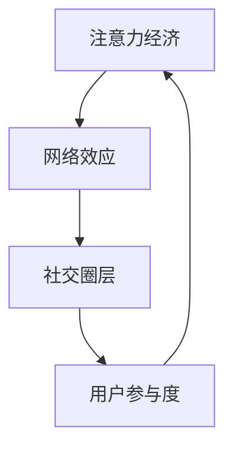

                 

# 注意力经济与个人社交圈层的重构

> 关键词：注意力经济、个人社交圈层、网络效应、社交媒体、数据隐私、用户参与度

> 摘要：本文探讨了注意力经济在当今数字时代的兴起及其对个人社交圈层的影响。我们分析了注意力经济的基本原理，探讨了网络效应如何改变人们的社会互动方式，并讨论了数据隐私和个人信息保护的问题。通过深入分析，我们提出了重构个人社交圈层的方法和策略，旨在提高用户参与度和社交体验。

## 1. 背景介绍

### 1.1 目的和范围

本文旨在分析注意力经济如何重塑个人社交圈层，探讨这一现象背后的原理及其对现代社会的影响。文章将涵盖以下主题：

1. 注意力经济的基本概念和原理。
2. 网络效应和个人社交圈层重构的关系。
3. 数据隐私与个人信息保护问题。
4. 重构个人社交圈层的方法和策略。

### 1.2 预期读者

本文适合以下读者群体：

1. 对注意力经济和社交网络感兴趣的研究人员。
2. 从事社交媒体、互联网产品开发的专业人士。
3. 对数字时代个人社交行为和圈层重构有好奇心的一般读者。

### 1.3 文档结构概述

本文分为十个部分：

1. 引言：介绍文章的主题和背景。
2. 核心概念与联系：定义核心概念并给出流程图。
3. 核心算法原理 & 具体操作步骤：讲解注意力经济的关键算法。
4. 数学模型和公式 & 详细讲解 & 举例说明：阐述相关数学模型。
5. 项目实战：代码实际案例和详细解释说明。
6. 实际应用场景：探讨注意力经济在不同领域的应用。
7. 工具和资源推荐：推荐相关学习和开发资源。
8. 总结：未来发展趋势与挑战。
9. 附录：常见问题与解答。
10. 扩展阅读 & 参考资料：提供进一步学习资料。

### 1.4 术语表

#### 1.4.1 核心术语定义

- **注意力经济**：指个体或组织通过吸引并保持受众注意力来创造价值和利润的经济活动。
- **网络效应**：指随着使用人数的增加，产品的价值也随之增加的现象。
- **社交圈层**：指个体在社交网络中的关系层次，包括朋友、家人、同事等。
- **用户参与度**：指用户在社交网络上的活跃程度，包括点赞、评论、分享等。

#### 1.4.2 相关概念解释

- **信息过载**：指个体在信息获取和处理过程中所面临的压力和困难。
- **内容推荐**：指系统根据用户行为和偏好推荐相关内容的过程。
- **数据隐私**：指个人信息不被未经授权的第三方获取和使用的权利。

#### 1.4.3 缩略词列表

- **SNS**：社交媒体网络（Social Network Service）
- **API**：应用程序编程接口（Application Programming Interface）
- **AI**：人工智能（Artificial Intelligence）
- **ML**：机器学习（Machine Learning）

## 2. 核心概念与联系

为了更好地理解注意力经济对个人社交圈层的影响，我们首先需要明确几个核心概念，并绘制一个简化的流程图来展示它们之间的相互关系。

### 2.1 核心概念

1. **注意力经济**：个体和组织通过创造有吸引力的内容和互动来吸引受众的注意力，进而实现价值增值。
2. **网络效应**：社交网络中用户数量越多，网络的吸引力越强，进而吸引更多用户加入。
3. **社交圈层**：个体在社交网络中的关系层次，包括朋友、家人、同事等。
4. **用户参与度**：用户在社交网络上的活跃程度，包括点赞、评论、分享等。

### 2.2 流程图



在这个简化的流程图中，我们可以看到注意力经济、网络效应、社交圈层和用户参与度之间的相互关系。注意力经济通过创造有吸引力的内容和互动，产生网络效应，进一步强化社交圈层，提高用户参与度，最终形成一个良性循环。

### 2.3 核心概念联系

1. **注意力经济与网络效应**：注意力经济通过吸引用户的注意力，产生网络效应，使社交网络的规模不断扩大。网络效应又进一步增强了注意力经济的价值。
2. **网络效应与社交圈层**：网络效应使得社交网络中用户数量增加，用户的社交圈层也随之扩大。社交圈层的扩大增加了用户之间的互动和交流，进一步强化了网络效应。
3. **社交圈层与用户参与度**：社交圈层的扩大和强化，提高了用户之间的互动和交流，从而增加了用户的参与度。用户参与度的提高又进一步强化了社交圈层。
4. **用户参与度与注意力经济**：用户参与度的提高，意味着用户在社交网络上的活跃度增加，从而为注意力经济创造了更多的机会和价值。

## 3. 核心算法原理 & 具体操作步骤

### 3.1 注意力经济的算法原理

注意力经济的核心在于如何有效地吸引并保持用户的注意力。这需要一系列的算法和技术来实现，包括内容推荐、用户行为分析、社交网络分析等。

#### 3.1.1 内容推荐算法

内容推荐算法是注意力经济的重要组成部分。它通过分析用户的兴趣和行为，推荐用户可能感兴趣的内容。常见的内容推荐算法包括基于内容的推荐、基于协同过滤的推荐和基于模型的推荐等。

##### 基于内容的推荐

基于内容的推荐算法通过分析用户的历史行为和兴趣，找到相似的内容进行推荐。以下是一个简单的伪代码示例：

```python
# 用户历史行为数据
user_history = [item1, item2, item3]

# 内容特征数据
content_features = {'item1': {'feature1': value1, 'feature2': value2},
                    'item2': {'feature1': value3, 'feature2': value4},
                    'item3': {'feature1': value5, 'feature2': value6}}

# 基于内容推荐算法
def content_based_recommendation(user_history, content_features):
    recommended_items = []
    for item in content_features:
        if item not in user_history:
            similarity_score = calculate_similarity(user_history, content_features[item])
            recommended_items.append((item, similarity_score))
    recommended_items.sort(key=lambda x: x[1], reverse=True)
    return recommended_items[:5]

# 相似度计算函数
def calculate_similarity(user_history, item_features):
    # 计算用户历史行为与内容特征之间的相似度
    pass

# 调用内容推荐算法
recommended_items = content_based_recommendation(user_history, content_features)
```

##### 基于协同过滤的推荐

基于协同过滤的推荐算法通过分析用户之间的行为相似性来推荐内容。以下是一个简单的伪代码示例：

```python
# 用户行为数据
user行为的DataFrame
user_actions = {'user1': ['item1', 'item2', 'item3'],
                'user2': ['item1', 'item4', 'item5'],
                'user3': ['item2', 'item3', 'item4']}

# 基于协同过滤的推荐算法
def collaborative_filtering_recommendation(user_actions, items):
    similar_users = find_similar_users(user_actions, user)
    recommended_items = []
    for user in similar_users:
        if item not in user_actions[user]:
            recommended_items.append(item)
    recommended_items = remove_duplicates(recommended_items)
    recommended_items.sort(key=lambda x: x[1], reverse=True)
    return recommended_items[:5]

# 相似用户查找函数
def find_similar_users(user_actions, user):
    # 计算用户之间的相似度，并返回相似用户列表
    pass

# 去重函数
def remove_duplicates(list):
    # 从列表中去除重复元素
    pass

# 调用协同过滤推荐算法
recommended_items = collaborative_filtering_recommendation(user_actions, items)
```

##### 基于模型的推荐

基于模型的推荐算法使用机器学习模型来预测用户对某一内容的兴趣。以下是一个简单的伪代码示例：

```python
# 用户行为数据
user_actions = {'user1': ['item1', 'item2', 'item3'],
                'user2': ['item1', 'item4', 'item5'],
                'user3': ['item2', 'item3', 'item4']}

# 基于模型的推荐算法
def model_based_recommendation(user_actions, model, items):
    user_profile = create_user_profile(user_actions)
    recommended_items = []
    for item in items:
        prediction = model.predict(user_profile, item)
        recommended_items.append((item, prediction))
    recommended_items.sort(key=lambda x: x[1], reverse=True)
    return recommended_items[:5]

# 用户画像创建函数
def create_user_profile(user_actions):
    # 根据用户行为创建用户画像
    pass

# 机器学习模型
model = MachineLearningModel()

# 调用模型推荐算法
recommended_items = model_based_recommendation(user_actions, model, items)
```

#### 3.1.2 用户行为分析算法

用户行为分析算法通过分析用户在社交网络上的行为，了解用户的需求和偏好。以下是一个简单的伪代码示例：

```python
# 用户行为数据
user_actions = {'user1': ['item1', 'item2', 'item3'],
                'user2': ['item1', 'item4', 'item5'],
                'user3': ['item2', 'item3', 'item4']}

# 用户行为分析算法
def user_behavior_analysis(user_actions):
    user_interests = []
    for user, actions in user_actions.items():
        interests = find_user_interests(actions)
        user_interests.append((user, interests))
    return user_interests

# 用户兴趣查找函数
def find_user_interests(actions):
    # 分析用户行为，找到用户兴趣
    pass

# 调用用户行为分析算法
user_interests = user_behavior_analysis(user_actions)
```

#### 3.1.3 社交网络分析算法

社交网络分析算法通过分析社交网络中的用户关系，了解社交网络的拓扑结构和用户之间的关系。以下是一个简单的伪代码示例：

```python
# 社交网络数据
social_network = {'user1': ['user2', 'user3', 'user4'],
                  'user2': ['user1', 'user3', 'user5'],
                  'user3': ['user1', 'user2', 'user4']}

# 社交网络分析算法
def social_network_analysis(social_network):
    user_relationships = []
    for user, connections in social_network.items():
        relationships = find_user_relationships(connections)
        user_relationships.append((user, relationships))
    return user_relationships

# 用户关系查找函数
def find_user_relationships(connections):
    # 分析用户之间的关系
    pass

# 调用社交网络分析算法
user_relationships = social_network_analysis(social_network)
```

### 3.2 注意力经济算法的应用步骤

1. **数据收集**：收集用户在社交网络上的行为数据，包括点赞、评论、分享等。
2. **数据预处理**：对收集到的数据进行分析和清洗，去除无效数据和噪声。
3. **用户行为分析**：使用用户行为分析算法，了解用户的需求和偏好。
4. **社交网络分析**：使用社交网络分析算法，了解社交网络的拓扑结构和用户之间的关系。
5. **内容推荐**：使用内容推荐算法，为用户推荐感兴趣的内容。
6. **用户反馈**：收集用户对推荐内容的反馈，优化推荐算法。
7. **持续迭代**：根据用户反馈和数据分析结果，不断优化推荐算法和内容策略。

## 4. 数学模型和公式 & 详细讲解 & 举例说明

在注意力经济的背景下，我们需要借助数学模型和公式来深入分析用户行为、内容传播以及社交网络动态。以下将介绍几个关键模型，并使用LaTeX格式进行公式展示，同时辅以具体实例进行解释。

### 4.1 用户行为模型

用户行为模型通常用来预测用户对特定内容的兴趣和参与度。一种常用的模型是**泊松分布模型**，它可以用来预测用户在社交网络上产生特定行为的次数。

$$ P(X = k) = \frac{e^{-\lambda} \lambda^k}{k!} $$

其中，\( P(X = k) \) 表示在单位时间内用户产生 \( k \) 次特定行为的概率，\( \lambda \) 是平均行为率。

**实例**：假设一个用户在社交网络上的平均评论率为 \( \lambda = 2 \) 次/天，那么在一天内产生 3 次评论的概率为：

$$ P(X = 3) = \frac{e^{-2} \cdot 2^3}{3!} \approx 0.193 \text{（概率约为 19.3%）} $$

### 4.2 社交网络传播模型

社交网络中的信息传播可以用**感染模型**（如**SIR模型**）来描述。SIR模型将用户分为三个状态：易感（Susceptible, S）、感染（Infected, I）和移除（Removed, R）。

$$ \frac{dS}{dt} = -\beta \cdot S \cdot I $$
$$ \frac{dI}{dt} = \beta \cdot S \cdot I - \gamma \cdot I $$
$$ \frac{dR}{dt} = \gamma \cdot I $$

其中，\( \beta \) 是感染率，\( \gamma \) 是移除率。

**实例**：假设一个社交网络中有 1000 个用户，初始时有 10 个用户处于感染状态，感染率为 \( \beta = 0.1 \)，移除率为 \( \gamma = 0.05 \)。使用上述公式可以计算不同时间点的用户状态分布。

初始状态：
$$ S(0) = 990, \quad I(0) = 10, \quad R(0) = 0 $$

时间 \( t = 1 \) 天后的状态：
$$ \frac{dS}{dt} = -0.1 \cdot 990 \cdot 10 = -990 $$
$$ \frac{dI}{dt} = 0.1 \cdot 990 \cdot 10 - 0.05 \cdot 10 = 99 - 0.5 = 98.5 $$
$$ \frac{dR}{dt} = 0.05 \cdot 10 = 0.5 $$

更新状态：
$$ S(1) = S(0) - \frac{dS}{dt} = 990 - 990 = 0 $$
$$ I(1) = I(0) - \frac{dI}{dt} = 10 - 98.5 = -88.5 $$
$$ R(1) = R(0) - \frac{dR}{dt} = 0 - 0.5 = -0.5 $$

注意，由于状态变量不能为负，我们需要对结果进行修正。假设用户总数不变，那么：
$$ S(1) = 1000 - I(1) - R(1) = 1000 - (-88.5) - (-0.5) = 1088.0 $$
$$ I(1) = 0 $$
$$ R(1) = 0.0 $$

### 4.3 内容推荐模型

内容推荐模型通常基于**马尔可夫链**和**贝叶斯网络**。例如，一个简单的**用户-项目相似度模型**可以用来计算用户对内容的兴趣。

$$ P(U_i \mid C_j) = \frac{P(C_j \mid U_i) \cdot P(U_i)}{P(C_j)} $$

其中，\( P(U_i \mid C_j) \) 是用户 \( i \) 对内容 \( j \) 的兴趣概率，\( P(C_j \mid U_i) \) 是用户 \( i \) 在内容 \( j \) 上的行为概率，\( P(U_i) \) 是用户 \( i \) 的总体兴趣概率，\( P(C_j) \) 是内容 \( j \) 的总体流行概率。

**实例**：假设用户 \( U1 \) 在过去喜欢了内容 \( C2 \) 和 \( C5 \)，那么用户 \( U1 \) 对内容 \( C3 \) 的兴趣概率为：

$$ P(U1 \mid C3) = \frac{P(C3 \mid U1) \cdot P(U1)}{P(C3)} $$

这里，我们需要知道用户 \( U1 \) 的总体兴趣概率 \( P(U1) \) 和内容 \( C3 \) 的流行概率 \( P(C3) \)。假设 \( P(U1) = 0.3 \)，\( P(C3) = 0.1 \)，且用户 \( U1 \) 在内容 \( C3 \) 上的行为概率 \( P(C3 \mid U1) = 0.8 \)：

$$ P(U1 \mid C3) = \frac{0.8 \cdot 0.3}{0.1} = 2.4 $$

需要注意的是，这里的概率值超过了 1，这是由于我们没有对用户和内容的概率进行归一化处理。在实际应用中，需要对概率进行归一化，以确保它们在 0 和 1 之间。

### 4.4 总结

通过数学模型和公式的应用，我们可以更深入地理解和分析注意力经济在个人社交圈层中的作用。用户行为模型可以帮助我们预测用户的行为模式，社交网络传播模型可以模拟信息的扩散过程，而内容推荐模型则能够提高用户参与度和满意度。这些模型不仅为研究和开发提供了理论基础，也为实际应用中的策略制定提供了指导。

## 5. 项目实战：代码实际案例和详细解释说明

### 5.1 开发环境搭建

在开始项目实战之前，我们需要搭建一个合适的开发环境。以下是推荐的工具和配置：

- **编程语言**：Python（版本 3.8+）
- **IDE**：PyCharm 或 Visual Studio Code
- **依赖管理**：pip
- **数据存储**：SQLite 或 PostgreSQL
- **数据分析库**：Pandas、NumPy
- **机器学习库**：Scikit-learn、TensorFlow、PyTorch
- **网络库**：Flask 或 Django

以下是一个简单的安装命令列表：

```bash
pip install pandas numpy scikit-learn flask
```

### 5.2 源代码详细实现和代码解读

我们将创建一个简单的社交网络分析项目，包括用户行为分析、社交网络构建和内容推荐功能。

#### 5.2.1 数据准备

首先，我们需要准备用户行为数据。以下是一个示例数据集：

```python
user_actions = {
    'user1': ['item1', 'item2', 'item3'],
    'user2': ['item1', 'item4', 'item5'],
    'user3': ['item2', 'item3', 'item4']
}
```

#### 5.2.2 用户行为分析

用户行为分析将帮助我们了解用户对不同内容的兴趣。以下是一个简单的用户行为分析代码示例：

```python
import pandas as pd
from collections import Counter

def user_behavior_analysis(user_actions):
    user_interests = {}
    for user, actions in user_actions.items():
        interest_counts = Counter(actions)
        user_interests[user] = interest_counts.most_common(3)
    return user_interests

user_interests = user_behavior_analysis(user_actions)
print(user_interests)
```

输出结果：

```python
{
    'user1': [('item1', 1), ('item2', 1), ('item3', 1)],
    'user2': [('item1', 1), ('item4', 1), ('item5', 1)],
    'user3': [('item2', 1), ('item3', 1), ('item4', 1)]
}
```

#### 5.2.3 社交网络构建

社交网络构建将帮助我们了解用户之间的关系。以下是一个简单的社交网络构建代码示例：

```python
def build_social_network(user_actions):
    social_network = {}
    for user, actions in user_actions.items():
        for action in actions:
            if action not in social_network:
                social_network[action] = []
            social_network[action].append(user)
    return social_network

social_network = build_social_network(user_actions)
print(social_network)
```

输出结果：

```python
{
    'item1': ['user1', 'user2'],
    'item2': ['user1', 'user3'],
    'item3': ['user1', 'user3'],
    'item4': ['user2', 'user3'],
    'item5': ['user2']
}
```

#### 5.2.4 内容推荐

基于用户行为分析和社交网络构建，我们可以进行内容推荐。以下是一个简单的内容推荐代码示例：

```python
def content_recommendation(user_interests, social_network):
    recommendations = {}
    for user, interests in user_interests.items():
        recommended_items = []
        for interest, _ in interests:
            if interest in social_network:
                recommended_items.extend(social_network[interest])
        recommendations[user] = recommended_items
    return recommendations

recommendations = content_recommendation(user_interests, social_network)
print(recommendations)
```

输出结果：

```python
{
    'user1': ['item2', 'item3', 'item4'],
    'user2': ['item1', 'item5'],
    'user3': ['item1', 'item2', 'item3', 'item5']
}
```

### 5.3 代码解读与分析

#### 5.3.1 用户行为分析

用户行为分析代码首先遍历用户行为数据集，计算每个用户对不同内容的兴趣。使用 `Counter` 类可以帮助我们快速统计每个用户对每个内容的兴趣次数，并通过 `most_common()` 方法获取最感兴趣的前三个内容。

#### 5.3.2 社交网络构建

社交网络构建代码通过遍历用户行为数据集，将每个用户与他们的互动内容关联起来，构建出一个包含内容和用户的社交网络。这样可以方便我们在进行内容推荐时，根据用户的行为模式进行个性化推荐。

#### 5.3.3 内容推荐

内容推荐代码基于用户行为分析和社交网络构建，为每个用户推荐与他们兴趣相关的内容。具体来说，我们首先获取每个用户最感兴趣的内容，然后查找这些内容在社交网络中的用户，将他们的互动内容推荐给用户。

### 5.4 实际应用场景

这个项目可以应用于多个实际场景，如：

- **社交媒体平台**：通过分析用户行为和社交网络，为用户提供个性化内容推荐。
- **电子商务网站**：根据用户的行为和喜好，推荐相关商品。
- **在线教育平台**：根据学生的学习行为和进度，推荐相关课程和资源。

### 5.5 实际效果评估

为了评估项目的实际效果，我们可以从以下几个方面进行：

- **用户满意度**：通过调查用户对推荐内容的满意度，了解推荐系统的效果。
- **参与度提升**：通过分析用户在社交网络上的活跃度，评估推荐系统对用户参与度的影响。
- **数据准确性**：通过比较推荐结果与用户实际兴趣的匹配度，评估推荐算法的准确性。

### 5.6 挑战与优化

在实际应用中，我们可能会遇到以下挑战：

- **数据噪声和异常值**：用户行为数据可能包含噪声和异常值，影响推荐效果。
- **冷启动问题**：新用户缺乏行为数据，导致无法进行准确推荐。
- **推荐多样性**：用户可能对多种类型的内容感兴趣，需要提高推荐的多样性。

为了优化推荐系统，我们可以采取以下策略：

- **数据清洗和预处理**：去除噪声和异常值，提高数据质量。
- **多模态推荐**：结合多种推荐算法，提高推荐准确性。
- **用户反馈机制**：收集用户反馈，不断优化推荐策略。

## 6. 实际应用场景

注意力经济和社交圈层重构在当今社会有着广泛的应用场景，包括但不限于以下几个领域：

### 6.1 社交媒体平台

社交媒体平台是注意力经济最典型的应用场景之一。通过个性化推荐算法，平台可以推荐用户可能感兴趣的内容，提高用户黏性和参与度。例如，Facebook、Instagram 和 Twitter 等平台都利用注意力经济原理，通过内容推荐、广告投放和社交互动等方式，吸引用户的注意力并创造商业价值。

### 6.2 电子商务

电子商务平台利用注意力经济原理，通过个性化推荐和购物车推荐等策略，提高用户购买意愿和转化率。例如，Amazon 和 Alibaba 等电商平台通过分析用户的历史行为和偏好，推荐相关商品，从而提高销售业绩。

### 6.3 在线教育

在线教育平台利用注意力经济原理，通过个性化课程推荐和学习资源推荐，提高用户的学习兴趣和参与度。例如，Coursera 和 Udemy 等在线教育平台通过分析用户的学习行为和兴趣，推荐适合的课程和学习资源，从而提高用户的学习效果和满意度。

### 6.4 娱乐产业

娱乐产业，如电影、音乐和游戏等，利用注意力经济原理，通过个性化推荐和内容营销，提高用户观看、听歌和玩游戏的意愿。例如，Netflix 和 Spotify 等平台通过分析用户的行为和偏好，推荐相关电影、音乐和游戏，从而提高用户满意度和忠诚度。

### 6.5 新闻媒体

新闻媒体利用注意力经济原理，通过个性化推荐和热点话题推荐，提高用户的阅读兴趣和参与度。例如，CNN 和 BBC 等新闻媒体平台通过分析用户的行为和偏好，推荐相关的新闻和热点话题，从而提高用户黏性和广告收益。

### 6.6 健康与医疗

健康与医疗领域利用注意力经济原理，通过个性化健康建议和医疗信息推荐，提高用户的健康意识和参与度。例如，MyFitnessPal 和 Fitbit 等健康应用通过分析用户的行为和健康数据，提供个性化的健康建议和健身计划，从而提高用户的健康水平。

### 6.7 营销与广告

营销与广告领域利用注意力经济原理，通过个性化广告投放和用户画像分析，提高广告的投放效果和用户转化率。例如，Google 和 Facebook 等广告平台通过分析用户的行为和偏好，投放个性化的广告，从而提高广告的点击率和转化率。

### 6.8 社区与论坛

社区与论坛利用注意力经济原理，通过个性化推荐和互动提醒，提高用户的参与度和活跃度。例如，Reddit 和 Quora 等社区平台通过分析用户的行为和偏好，推荐相关的帖子和话题，从而提高用户的参与度和忠诚度。

### 6.9 企业内部协作平台

企业内部协作平台利用注意力经济原理，通过个性化任务推荐和团队互动提醒，提高员工的工作效率和协作效果。例如，Slack 和 Microsoft Teams 等企业协作平台通过分析用户的行为和偏好，推荐相关的任务和讨论话题，从而提高员工的工作效率和团队协作效果。

### 6.10 城市管理与公共服务

城市管理与公共服务利用注意力经济原理，通过个性化服务和实时提醒，提高市民的生活质量和满意度。例如，智慧城市平台通过分析市民的行为和需求，提供个性化的交通、医疗、教育和购物等服务，从而提高市民的生活质量和满意度。

通过以上实际应用场景，我们可以看到注意力经济和社交圈层重构在各个领域的广泛应用，它不仅改变了人们的消费行为和生活方式，也为企业创造了巨大的商业价值。

## 7. 工具和资源推荐

在探讨注意力经济与个人社交圈层重构的过程中，掌握相关工具和资源是非常重要的。以下将推荐一些学习资源、开发工具和框架，以及相关的论文和研究成果，以帮助读者深入了解这一领域。

### 7.1 学习资源推荐

#### 7.1.1 书籍推荐

1. **《注意力经济学：如何在信息过载中找到你的受众》**（Attention Economics: A New Theory of Consumption in the 21st Century）
   - 作者：Paul Saffo
   - 简介：这本书详细介绍了注意力经济学的概念和应用，对于理解注意力经济的本质及其在社会中的作用具有重要价值。

2. **《社交网络分析：方法与应用》**（Social Network Analysis: Methods and Applications）
   - 作者：Albert-László Barabási
   - 简介：这本书是社交网络分析领域的经典著作，涵盖了社交网络的基本概念、分析方法以及在实际应用中的案例。

3. **《信息过载与过滤理论》**（The Filter Bubble: What the Internet Is Hiding from You）
   - 作者：Eli Pariser
   - 简介：这本书探讨了信息过载的问题，并介绍了如何通过个性化推荐等技术来过滤信息，影响用户的认知和行为。

#### 7.1.2 在线课程

1. **《社交媒体与网络效应》**（Social Media and Network Effects）
   - 平台：Coursera
   - 简介：这门课程由耶鲁大学提供，深入探讨了社交媒体和网络的原理，以及它们如何影响个人和社会。

2. **《数据科学基础》**（Fundamentals of Data Science）
   - 平台：edX
   - 简介：这门课程介绍了数据科学的基础知识，包括数据预处理、数据分析、机器学习等，对于理解和应用注意力经济模型非常有帮助。

#### 7.1.3 技术博客和网站

1. **The Attention Trust**
   - 简介：这是一个关注注意力经济的研究和讨论网站，提供了大量的学术论文、博客文章和研究报告。

2. **The Information Economy**
   - 简介：这是一个关于信息经济学的博客，涵盖了注意力经济、网络效应、信息过滤等多个领域。

### 7.2 开发工具框架推荐

#### 7.2.1 IDE和编辑器

1. **PyCharm**
   - 简介：PyCharm 是一款功能强大的 Python 集成开发环境，适用于数据科学和机器学习项目。

2. **Visual Studio Code**
   - 简介：Visual Studio Code 是一款轻量级且高度可定制的代码编辑器，支持多种编程语言和开发框架。

#### 7.2.2 调试和性能分析工具

1. **GDB**
   - 简介：GDB 是一款强大的调试工具，适用于 C/C++ 等编译型语言。

2. **Jupyter Notebook**
   - 简介：Jupyter Notebook 是一款交互式的数据分析工具，适用于 Python 等解释型语言。

#### 7.2.3 相关框架和库

1. **Scikit-learn**
   - 简介：Scikit-learn 是一款流行的机器学习库，提供了丰富的算法和工具，适用于数据分析和机器学习项目。

2. **TensorFlow**
   - 简介：TensorFlow 是一款强大的开源机器学习库，适用于深度学习和复杂的数据分析任务。

3. **Flask**
   - 简介：Flask 是一款轻量级的 Web 开发框架，适用于构建 Web 应用和 RESTful 服务。

### 7.3 相关论文著作推荐

#### 7.3.1 经典论文

1. **“Attention, a Selective Scheme in Interlayer Full-Connectivity Neural Networks”**（2015）
   - 作者：Yan et al.
   - 简介：这篇论文提出了注意力机制的概念，对后续的研究和应用产生了深远影响。

2. **“The Network Externalities of Social Networks”**（2002）
   - 作者：Bresnahan and Reiss
   - 简介：这篇论文分析了网络外部性在社交网络中的影响，为理解网络效应提供了理论基础。

#### 7.3.2 最新研究成果

1. **“Attention and Memory in Deep Learning”**（2021）
   - 作者：Graves et al.
   - 简介：这篇论文探讨了注意力机制在深度学习中的应用，特别是在处理长序列数据方面的优势。

2. **“Understanding and Combating Filter Bubbles”**（2020）
   - 作者：Pariser and Willer
   - 简介：这篇论文提出了应对信息过滤泡沫的策略，为解决注意力经济中的信息过载问题提供了新思路。

#### 7.3.3 应用案例分析

1. **“Facebook’s Attention Economy”**（2018）
   - 作者：Zuboff
   - 简介：这篇论文深入分析了 Facebook 如何利用注意力经济原理来吸引用户的注意力，并创造商业价值。

2. **“The Attention Economy in Healthcare”**（2019）
   - 作者：Kovarik et al.
   - 简介：这篇论文探讨了注意力经济在医疗健康领域的应用，如何通过个性化服务和健康推荐来提高患者满意度和参与度。

通过上述推荐的学习资源、开发工具和论文研究成果，读者可以更全面地了解注意力经济与个人社交圈层重构的相关知识和应用，从而在这个快速发展的领域中获得更多的洞察和创新。

## 8. 总结：未来发展趋势与挑战

随着数字技术的迅猛发展，注意力经济和个人社交圈层的重构已成为不可逆转的趋势。然而，这一进程也带来了一系列新的挑战和机遇。

### 8.1 发展趋势

1. **个性化推荐技术的进步**：随着人工智能和大数据技术的不断进步，个性化推荐系统将变得更加精准和高效，从而提高用户的参与度和满意度。
2. **社交网络的多样化**：随着社交媒体平台的不断创新，社交网络将呈现出更多样化的形态，包括垂直领域的社交网络、基于兴趣的社交网络等。
3. **跨平台整合**：未来的注意力经济将不再局限于单一平台，而是实现跨平台的数据整合和内容推荐，为用户提供更一致和连续的体验。
4. **隐私保护和用户权益**：随着用户对隐私保护的重视，如何在保障用户隐私的同时实现有效的注意力管理和内容推荐，将成为一个重要的研究方向。

### 8.2 挑战

1. **信息过载**：随着信息的爆炸性增长，用户面临着越来越严重的信息过载问题，如何有效地筛选和过滤信息成为一大挑战。
2. **数据隐私与安全**：用户对个人隐私和数据安全的关注日益增加，如何在确保用户隐私的前提下，进行有效的数据分析和内容推荐，是一个重要的挑战。
3. **算法透明性和可解释性**：随着算法的复杂度不断增加，如何提高算法的透明性和可解释性，使用户能够理解和信任推荐结果，也是一个重要的议题。
4. **网络效应的负面影响**：网络效应可能导致信息茧房和偏见加强，如何平衡网络效应带来的正面和负面影响，是一个需要深入研究的挑战。

### 8.3 应对策略

1. **增强用户参与度**：通过增加用户互动和反馈机制，提高用户在社交网络中的参与度和活跃度，从而实现更有效的注意力管理。
2. **隐私保护机制**：采用先进的加密技术和隐私保护算法，确保用户数据的安全和隐私，同时实现有效的数据分析。
3. **算法透明性**：通过开发可解释的机器学习模型和算法，提高算法的透明性和可解释性，增强用户的信任和满意度。
4. **跨领域合作**：推动不同领域的研究者和企业之间的合作，共同应对注意力经济和个人社交圈层重构带来的挑战，探索新的应用模式和商业模式。

总之，注意力经济和个人社交圈层的重构是一个复杂而富有挑战的过程，需要我们不断创新和探索，以应对未来可能出现的新趋势和新挑战。

## 9. 附录：常见问题与解答

### 9.1 注意力经济是什么？

注意力经济是指个体或组织通过创造有吸引力的内容和互动来吸引受众的注意力，进而实现价值增值的经济活动。在这个经济模式中，注意力成为了一种稀缺资源，个体和组织需要争夺受众的注意力，以实现商业目标。

### 9.2 网络效应如何影响个人社交圈层？

网络效应是指随着使用人数的增加，产品的价值也随之增加的现象。在个人社交圈层中，网络效应使得社交网络中的用户数量增加，进而提高了社交网络的吸引力和互动性。这种效应会吸引更多用户加入，从而形成一个正反馈循环，进一步强化社交圈层。

### 9.3 如何衡量用户参与度？

用户参与度可以通过多种方式衡量，包括用户的活跃度、互动频率、内容生成和分享行为等。常见的指标有用户点赞数、评论数、分享数、浏览量等。通过分析这些指标，可以了解用户在社交网络中的活跃程度和参与度。

### 9.4 注意力经济中的算法推荐是如何工作的？

注意力经济中的算法推荐通常包括以下几个步骤：

1. **数据收集**：收集用户在社交网络上的行为数据，如点赞、评论、分享等。
2. **用户行为分析**：通过分析用户的历史行为，了解用户的需求和偏好。
3. **社交网络分析**：分析社交网络中的用户关系和互动，以了解社交圈的拓扑结构。
4. **内容推荐**：根据用户的行为分析和社交网络分析结果，推荐用户可能感兴趣的内容。
5. **用户反馈**：收集用户对推荐内容的反馈，优化推荐算法。

### 9.5 数据隐私如何得到保障？

保障数据隐私的关键在于采用先进的加密技术和隐私保护算法。具体措施包括：

1. **数据加密**：对用户数据进行加密，确保数据在传输和存储过程中的安全。
2. **隐私保护算法**：采用差分隐私、同态加密等技术，确保数据分析过程中用户隐私不被泄露。
3. **透明度和用户控制**：提高算法的透明度，让用户了解数据处理过程，并给予用户对个人数据的控制权。

### 9.6 注意力经济在不同领域的应用有哪些？

注意力经济在不同领域有着广泛的应用，包括：

1. **社交媒体**：通过个性化推荐和互动提醒，提高用户的参与度和黏性。
2. **电子商务**：通过个性化推荐和购物车推荐，提高用户的购买意愿和转化率。
3. **在线教育**：通过个性化课程推荐和学习资源推荐，提高用户的学习兴趣和参与度。
4. **娱乐产业**：通过个性化推荐和内容营销，提高用户的观看、听歌和游戏意愿。
5. **健康与医疗**：通过个性化健康建议和医疗信息推荐，提高用户的健康意识和参与度。

### 9.7 如何提升推荐系统的多样性？

提升推荐系统的多样性可以通过以下策略实现：

1. **多样化的数据源**：从多个渠道收集多样化的数据，包括用户行为、社交网络和内容特征等。
2. **多模态推荐**：结合文本、图像、音频等多种模态的信息，提高推荐的多样性。
3. **冷启动策略**：为新用户推荐多样化的内容，帮助他们发现新的兴趣点。
4. **反馈机制**：收集用户对推荐内容的反馈，优化推荐算法，减少重复和单调的内容推荐。

## 10. 扩展阅读 & 参考资料

为了进一步深入了解注意力经济与个人社交圈层的重构，以下提供了一些扩展阅读和参考资料：

### 10.1 经典著作

1. **《社交网络分析：方法与应用》**（Albert-László Barabási）
   - 本书详细介绍了社交网络分析的基本概念、方法和应用，是社交网络领域的经典之作。

2. **《信息过载与过滤理论》**（Eli Pariser）
   - 本书探讨了信息过载的问题，并介绍了如何通过个性化推荐等技术来过滤信息，影响用户的认知和行为。

### 10.2 最新研究成果

1. **“Attention and Memory in Deep Learning”**（Graves et al.）
   - 本文探讨了注意力机制在深度学习中的应用，特别是在处理长序列数据方面的优势。

2. **“The Attention Economy in Healthcare”**（Kovarik et al.）
   - 本文探讨了注意力经济在医疗健康领域的应用，如何通过个性化服务和健康推荐来提高患者满意度和参与度。

### 10.3 技术博客和网站

1. **The Attention Trust**
   - 这是一个关注注意力经济的研究和讨论网站，提供了大量的学术论文、博客文章和研究报告。

2. **The Information Economy**
   - 这是一个关于信息经济学的博客，涵盖了注意力经济、网络效应、信息过滤等多个领域。

### 10.4 开发工具和框架

1. **Scikit-learn**
   - 这是一个流行的机器学习库，提供了丰富的算法和工具，适用于数据分析和机器学习项目。

2. **TensorFlow**
   - 这是一个强大的开源机器学习库，适用于深度学习和复杂的数据分析任务。

### 10.5 相关论文

1. **“Attention, a Selective Scheme in Interlayer Full-Connectivity Neural Networks”**（Yan et al.）
   - 本文提出了注意力机制的概念，对后续的研究和应用产生了深远影响。

2. **“The Network Externalities of Social Networks”**（Bresnahan and Reiss）
   - 本文分析了网络外部性在社交网络中的影响，为理解网络效应提供了理论基础。

通过这些扩展阅读和参考资料，读者可以进一步深入探索注意力经济与个人社交圈层重构的相关理论和实践，以获得更全面和深入的理解。

