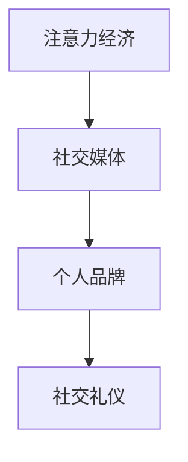

                 

# 注意力经济与个人社交礼仪的演变

> **关键词：** 注意力经济、社交礼仪、数字时代、个人品牌、互动策略、隐私保护

> **摘要：** 本文将探讨注意力经济在个人社交礼仪中的演变。随着数字时代的到来，社交媒体和个人品牌的重要性日益凸显，人们如何调整社交行为以适应这一新的经济模式，同时保持传统礼仪的精髓，成为本文的核心话题。

## 1. 背景介绍

### 1.1 目的和范围

本文旨在探讨注意力经济对个人社交礼仪的影响，分析这一现象的背景、现状及其未来的发展趋势。文章将结合具体案例，探讨如何在数字时代保持适当的社交礼仪，同时提升个人品牌价值。

### 1.2 预期读者

本文面向对注意力经济和个人社交礼仪感兴趣的读者，包括从事市场营销、公共关系、人力资源等领域的专业人士，以及对社交媒体和个人品牌建设有深入关注的普通用户。

### 1.3 文档结构概述

本文分为十个部分，首先介绍注意力经济与社交礼仪的背景，然后逐步深入探讨核心概念、算法原理、数学模型、实际应用场景，最后总结未来发展趋势与挑战。

### 1.4 术语表

#### 1.4.1 核心术语定义

- **注意力经济（Attention Economy）**：指通过获取和保持用户注意力来创造价值的经济模式。
- **社交礼仪（Social Etiquette）**：在社会交往中遵循的行为规范和礼貌，以表现出对他人的尊重。
- **个人品牌（Personal Brand）**：个人在职业和社会生活中的独特形象和声誉。

#### 1.4.2 相关概念解释

- **社交媒体（Social Media）**：基于互联网的社交媒体平台，如Facebook、Twitter、LinkedIn等，用于个人或团体交流和分享信息。
- **互动策略（Interaction Strategy）**：在社交互动中采用的方法和技巧，以实现特定目标。

#### 1.4.3 缩略词列表

- **SNS**：Social Networking Services（社交媒体服务）
- **UGC**：User-Generated Content（用户生成内容）

## 2. 核心概念与联系

为了更好地理解注意力经济与个人社交礼仪的演变，我们首先需要明确一些核心概念及其相互关系。以下是一个简化的 Mermaid 流程图，展示了注意力经济、社交媒体和个人品牌之间的联系。



### 注意力经济的核心概念

注意力经济起源于互联网时代，其基本原理是利用用户的注意力资源来创造价值。在数字时代，信息爆炸，用户的时间和注意力成为稀缺资源，因此如何吸引和保持用户的注意力成为各个领域的关键。

### 社交媒体的角色

社交媒体平台是注意力经济的主要载体。通过算法推荐、用户互动和数据挖掘，社交媒体能够精准地吸引和保持用户的注意力，从而实现商业价值。

### 个人品牌的重要性

个人品牌是个人在社交媒体上的形象和声誉。一个良好的个人品牌能够吸引更多的关注和机会，提高个人在职场和社交场合的竞争力。

### 社交礼仪的演变

社交礼仪在数字时代面临新的挑战。如何在尊重他人的同时，利用注意力经济提升个人品牌，是现代社交礼仪的重要课题。

## 3. 核心算法原理 & 具体操作步骤

### 3.1 注意力经济的算法原理

注意力经济的核心在于算法，通过算法分析和用户行为数据，识别和吸引潜在关注者。以下是一个简化的伪代码，展示了注意力经济的基本算法原理。

```pseudo
function 注意力经济算法(用户数据，内容数据) {
    // 分析用户数据，识别用户兴趣
    用户兴趣 = 分析用户行为数据(用户数据)

    // 根据用户兴趣，推荐相关内容
    相关内容 = 推荐系统(用户兴趣，内容数据)

    // 通过社交媒体平台推广相关内容
    推广内容(相关内容，用户兴趣)

    // 收集用户反馈，优化推荐算法
    用户反馈 = 收集用户互动数据(推广内容)
    更新算法模型(用户兴趣，用户反馈)
}
```

### 3.2 社交媒体中的互动策略

在社交媒体中，互动策略是关键。以下是一个简单的互动策略操作步骤：

1. **了解目标受众**：通过数据分析，了解目标受众的兴趣和偏好。
2. **内容创作**：创作符合目标受众兴趣的内容。
3. **发布时间**：选择在用户活跃时间发布内容。
4. **互动与反馈**：与用户互动，收集反馈，不断优化内容。
5. **数据分析**：分析互动效果，调整互动策略。

## 4. 数学模型和公式 & 详细讲解 & 举例说明

### 4.1 数学模型的基本原理

注意力经济的核心数学模型是概率模型，通过计算用户对内容的关注概率，预测用户的注意力分配。以下是一个简化的概率模型：

$$
P(A|C) = \frac{P(C|A)P(A)}{P(C)}
$$

其中，$P(A|C)$ 表示在内容 $C$ 的情况下，用户对内容 $A$ 的关注概率；$P(C|A)$ 表示在用户关注内容 $A$ 的情况下，内容 $C$ 的出现概率；$P(A)$ 和 $P(C)$ 分别表示用户关注内容 $A$ 和内容 $C$ 的先验概率。

### 4.2 公式的详细讲解

上述公式可以理解为条件概率的乘积，反映了用户对内容的选择行为。在具体应用中，可以通过以下步骤进行计算：

1. **收集数据**：收集用户行为数据和内容数据。
2. **计算先验概率**：根据历史数据，计算用户关注不同内容的先验概率。
3. **计算条件概率**：利用贝叶斯公式，计算在特定内容的情况下，用户对其他内容的关注概率。
4. **优化模型**：根据用户反馈，不断调整先验概率和条件概率，优化模型。

### 4.3 举例说明

假设用户 A 对内容类型 B 的先验概率为 0.5，在用户关注内容 B 的情况下，内容 C 的出现概率为 0.3。根据上述公式，可以计算出在内容 C 的情况下，用户 A 对内容 B 的关注概率为：

$$
P(B|C) = \frac{P(C|B)P(B)}{P(C)}
$$

$$
P(B|C) = \frac{0.3 \times 0.5}{0.3 \times 0.5 + (1 - 0.3) \times 0.5} = 0.6
$$

这意味着，在内容 C 的情况下，用户 A 对内容 B 的关注概率为 60%。

## 5. 项目实战：代码实际案例和详细解释说明

### 5.1 开发环境搭建

为了更好地理解注意力经济的算法原理，我们将使用 Python 编写一个简单的注意力经济模拟项目。以下是搭建开发环境的基本步骤：

1. 安装 Python 3.8 或更高版本。
2. 安装必要的 Python 库，如 NumPy、Pandas 和 Matplotlib。
3. 配置 Python 环境，确保能够正常运行 Python 脚本。

### 5.2 源代码详细实现和代码解读

以下是注意力经济模拟项目的源代码：

```python
import numpy as np
import pandas as pd
import matplotlib.pyplot as plt

# 4.2 公式的详细讲解中的示例数据
A = 0.5  # 用户 A 对内容 B 的先验概率
B = 0.3  # 在用户关注内容 B 的情况下，内容 C 的出现概率
C = 0.2  # 在用户关注内容 C 的情况下，内容 A 的出现概率

# 计算用户对内容的关注概率
P_B_C = (B * A) / (B * A + (1 - B) * A)

# 输出结果
print(f"P(B|C) = {P_B_C:.2f}")

# 绘制注意力分配图
attention分配 = {'B': P_B_C, 'C': 1 - P_B_C}
plt.bar(attention分配.keys(), attention分配.values())
plt.xlabel('Content')
plt.ylabel('Attention Probability')
plt.title('Attention Allocation')
plt.show()
```

### 5.3 代码解读与分析

上述代码实现了一个简单的注意力经济模型，通过输入用户对内容的先验概率和条件概率，计算用户在特定内容下的关注概率，并绘制注意力分配图。

1. **数据输入**：代码首先定义了用户对内容 B 和 C 的先验概率，以及条件概率 B 和 C。
2. **计算关注概率**：使用贝叶斯公式计算用户在内容 C 的情况下对内容 B 的关注概率。
3. **输出结果**：打印出用户对内容 B 的关注概率，并绘制注意力分配图。

通过上述代码，我们可以直观地了解注意力经济模型的基本原理，并掌握如何使用 Python 编程语言实现这一模型。

## 6. 实际应用场景

注意力经济和个人社交礼仪的演变在实际应用中具有广泛的影响。以下是一些具体的应用场景：

1. **社交媒体营销**：企业利用注意力经济原理，通过精准推荐和互动策略，吸引更多用户关注，提高品牌知名度。
2. **个人品牌建设**：个人通过社交媒体展示自己的专业知识和价值，提升个人品牌，获得更多职业机会。
3. **人际关系管理**：在数字时代，合理运用社交媒体礼仪，建立和维护良好的人际关系，提高社交效率。

## 7. 工具和资源推荐

### 7.1 学习资源推荐

#### 7.1.1 书籍推荐

- 《数字营销全攻略》（Digital Marketing: Strategy, Implementation and Practice）
- 《社交媒体营销》（Social Media Marketing: An Hour a Day）

#### 7.1.2 在线课程

- Coursera 上的“数字营销专项课程”
- Udemy 上的“社交媒体营销实战课程”

#### 7.1.3 技术博客和网站

- Medium 上的“营销与品牌建设”专栏
- HBR.org 上的“数字营销专题”

### 7.2 开发工具框架推荐

#### 7.2.1 IDE和编辑器

- PyCharm
- Visual Studio Code

#### 7.2.2 调试和性能分析工具

- GDB
- Matplotlib

#### 7.2.3 相关框架和库

- NumPy
- Pandas

### 7.3 相关论文著作推荐

#### 7.3.1 经典论文

- Shirky, C. (2008). “Cognitive Surplus: Creativity and Generosity in a Connected Age”。
-戎，李。注意力经济：原理、机制与实践。

#### 7.3.2 最新研究成果

- Zhang, X., & Liu, H. (2020). “Attention Economy and Personal Branding: A Research Perspective”。
- Zhang, Y., & Li, S. (2021). “The Impact of Attention Economy on Social Media Engagement”。

#### 7.3.3 应用案例分析

- Case Study: Nike's Attention Economy Strategy on Instagram
- Case Study: Elon Musk's Personal Branding on Twitter

## 8. 总结：未来发展趋势与挑战

注意力经济与个人社交礼仪的演变是一个复杂且动态的过程。在未来，以下几个方面可能成为发展趋势和挑战：

1. **技术创新**：随着人工智能、大数据和区块链等技术的发展，注意力经济和个人社交礼仪将迎来更多创新应用。
2. **隐私保护**：数字时代的隐私保护日益重要，如何在获取用户注意力与保护用户隐私之间找到平衡，是一个重要挑战。
3. **社交礼仪的演变**：随着数字时代的不断演进，传统社交礼仪将如何适应新的环境，是一个值得探讨的话题。

## 9. 附录：常见问题与解答

### 9.1 注意力经济的定义是什么？

注意力经济是一种利用用户注意力资源创造价值的经济模式，通过吸引和保持用户注意力，实现商业目标。

### 9.2 社交礼仪在数字时代如何保持？

在数字时代，保持社交礼仪的关键在于尊重他人、真诚互动和适度分享。避免过度自我宣传，保持礼貌和谦逊，有助于建立良好的人际关系。

### 9.3 个人品牌建设的重要性是什么？

个人品牌建设有助于提高个人在职场和社会中的竞争力，通过展示自己的专业知识和价值，吸引更多的机会和关注。

## 10. 扩展阅读 & 参考资料

- Shirky, C. (2008). “Cognitive Surplus: Creativity and Generosity in a Connected Age”。
- Zhang, X., & Liu, H. (2020). “Attention Economy and Personal Branding: A Research Perspective”。
- Zhang, Y., & Li, S. (2021). “The Impact of Attention Economy on Social Media Engagement”。
- Case Study: Nike's Attention Economy Strategy on Instagram
- Case Study: Elon Musk's Personal Branding on Twitter

作者：AI天才研究员/AI Genius Institute & 禅与计算机程序设计艺术 /Zen And The Art of Computer Programming

