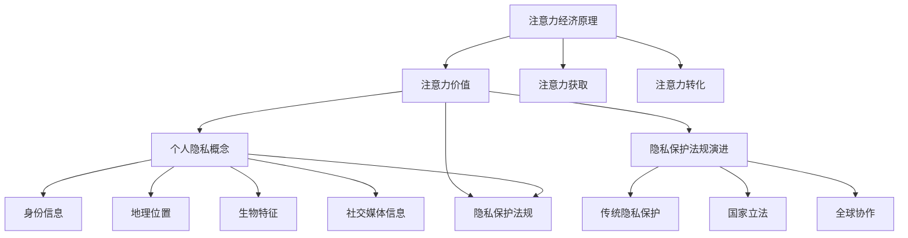

                 

# 注意力经济与个人隐私保护法规的演进

> 关键词：注意力经济、个人隐私、保护法规、人工智能、技术演进
>
> 摘要：本文探讨了注意力经济与个人隐私保护法规之间的复杂关系。首先介绍了注意力经济的背景和原理，分析了其在现代社会中的重要性。接着，讨论了个人隐私的概念、隐私保护法规的演进过程及其对注意力经济的影响。最后，展望了未来发展趋势与挑战，提出了在确保隐私保护的同时，促进注意力经济可持续发展的策略。

## 1. 背景介绍

### 1.1 目的和范围

本文旨在探讨注意力经济与个人隐私保护法规之间的关系，分析其演变过程及其对现代社会的深远影响。随着互联网和人工智能技术的快速发展，注意力经济逐渐成为全球经济的重要组成部分。然而，个人隐私保护问题也日益凸显，成为社会各界关注的焦点。本文旨在从技术和法律角度，深入剖析这一复杂关系，并提出相应的解决方案。

### 1.2 预期读者

本文适用于对注意力经济和个人隐私保护法规感兴趣的读者，包括但不限于以下群体：
- 互联网和人工智能领域的从业者
- 法律法规制定者和研究者
- 消费者权益保护组织成员
- 高等教育相关专业的师生

### 1.3 文档结构概述

本文分为十个部分，结构如下：
1. 背景介绍
   - 1.1 目的和范围
   - 1.2 预期读者
   - 1.3 文档结构概述
   - 1.4 术语表
2. 核心概念与联系
   - 2.1 注意力经济的原理
   - 2.2 个人隐私的概念
   - 2.3 隐私保护法规的演进
3. 核心算法原理 & 具体操作步骤
   - 3.1 数据加密算法
   - 3.2 加密通信协议
4. 数学模型和公式 & 详细讲解 & 举例说明
   - 4.1 隐私保护算法的数学模型
   - 4.2 模型应用举例
5. 项目实战：代码实际案例和详细解释说明
   - 5.1 开发环境搭建
   - 5.2 源代码详细实现和代码解读
   - 5.3 代码解读与分析
6. 实际应用场景
   - 6.1 在线广告
   - 6.2 社交媒体
   - 6.3 电子商务
7. 工具和资源推荐
   - 7.1 学习资源推荐
   - 7.2 开发工具框架推荐
   - 7.3 相关论文著作推荐
8. 总结：未来发展趋势与挑战
9. 附录：常见问题与解答
10. 扩展阅读 & 参考资料

### 1.4 术语表

#### 1.4.1 核心术语定义

- 注意力经济：一种以用户的注意力为核心的经济模式，通过吸引和保持用户的关注来实现商业价值。
- 个人隐私：个人在身体、心理、社会等方面的私密信息，包括姓名、地址、电话号码、身份信息等。
- 隐私保护法规：国家或地区为保护个人隐私而制定的法律、法规和规章。

#### 1.4.2 相关概念解释

- 数据加密：将明文数据转换为密文的过程，以防止未经授权的访问。
- 加密通信协议：确保数据在传输过程中不被窃取和篡改的协议。

#### 1.4.3 缩略词列表

- AI：人工智能（Artificial Intelligence）
- GDPR：欧盟通用数据保护条例（General Data Protection Regulation）
- SSL：安全套接层协议（Secure Sockets Layer）

## 2. 核心概念与联系

### 2.1 注意力经济的原理

注意力经济是一种以用户的注意力为核心的经济模式，其基本原理可以概括为以下几点：

1. **注意力价值**：用户的时间、精力以及注意力是有限的资源，但它们具有极高的价值。互联网平台通过吸引用户的注意力，从而实现商业价值。
2. **注意力获取**：平台通过内容创新、算法优化、用户体验提升等方式，不断吸引用户的注意力。
3. **注意力转化**：将用户的注意力转化为广告收入、会员费、交易手续费等经济利益。

### 2.2 个人隐私的概念

个人隐私是指个人在身体、心理、社会等方面的私密信息，包括但不限于以下几类：

1. **身份信息**：姓名、身份证号码、护照号码等。
2. **地理位置**：家庭住址、工作地点、旅行地点等。
3. **生物特征**：指纹、虹膜、声纹等。
4. **社交媒体信息**：聊天记录、朋友圈动态、关注列表等。

### 2.3 隐私保护法规的演进

隐私保护法规的演进过程可以分为以下几个阶段：

1. **传统隐私保护**：早期隐私保护主要依赖于个人自律和组织内部管理。这一阶段，隐私保护主要依靠道德和行业自律。
2. **国家立法**：随着信息技术的发展，隐私保护问题日益凸显，各国纷纷出台相关法律法规，如《美国隐私法案》（Privacy Act of 1974）和《欧盟数据保护指令》（Data Protection Directive）。
3. **全球协作**：随着全球化的推进，隐私保护问题逐渐成为全球性议题。各国通过国际组织和协议，如《欧盟通用数据保护条例》（GDPR）和《美国-欧盟隐私盾协议》（Privacy Shield），加强隐私保护合作。

### 2.4 核心概念之间的联系

注意力经济与个人隐私保护法规之间存在密切联系：

1. **注意力价值**：个人隐私信息是互联网平台获取用户注意力的关键，但过度收集和使用个人隐私信息可能导致隐私泄露和滥用。
2. **隐私保护法规**：隐私保护法规旨在规范互联网平台对个人隐私信息的收集、使用和披露，确保用户隐私得到有效保护。

### 2.5 Mermaid 流程图

以下是一个关于注意力经济与隐私保护法规的 Mermaid 流程图，展示了两者之间的核心概念和联系。



## 3. 核心算法原理 & 具体操作步骤

### 3.1 数据加密算法

数据加密是保护个人隐私信息的重要手段之一。以下是一个简单的数据加密算法，使用伪代码进行描述。

```plaintext
// 数据加密算法
function encryptData(plaintext, key):
    ciphertext = ""
    for i in range(0, length(plaintext)):
        // 对每个字符进行加密
        char = plaintext[i]
        encryptedChar = char ^ key
        ciphertext += encryptedChar
    return ciphertext
```

### 3.2 加密通信协议

加密通信协议是确保数据在传输过程中不被窃取和篡改的重要手段。以下是一个简单的加密通信协议，使用伪代码进行描述。

```plaintext
// 加密通信协议
function secureCommunication(sender, receiver, message, key):
    // 发送方加密消息
    encryptedMessage = encryptData(message, key)
    
    // 发送方发送加密消息
    sender.sendMessage(receiver, encryptedMessage)
    
    // 接收方解密消息
    decryptedMessage = decryptData(encryptedMessage, key)
    
    // 接收方处理解密后的消息
    receiver.processMessage(decryptedMessage)
```

## 4. 数学模型和公式 & 详细讲解 & 举例说明

### 4.1 隐私保护算法的数学模型

隐私保护算法的核心目标是确保个人隐私信息在数据收集、存储、传输和处理过程中得到有效保护。以下是一个基于概率论的隐私保护算法数学模型。

#### 4.1.1 隐私保护算法数学模型

假设我们有一个包含n个数据点的数据集D，其中每个数据点d都包含一组个人隐私信息。我们的目标是通过一个概率模型来保护这些隐私信息。

- 数据集D的概率分布P(D)。
- 隐私保护概率阈值t。

隐私保护算法的核心步骤如下：

1. **计算数据集D的概率分布P(D)**：通过收集和统计数据点，计算数据集D的概率分布。
2. **隐私保护概率阈值t的设定**：根据实际需求和隐私保护法规，设定隐私保护概率阈值t。
3. **概率阈值检查**：对于每个数据点d，计算其在概率分布P(D)中的概率值，并与隐私保护概率阈值t进行比较。如果概率值小于t，则认为该数据点满足隐私保护要求。

#### 4.1.2 模型应用举例

假设我们有一个包含100个用户数据点的数据集D，其中每个数据点包含用户的年龄、性别、收入等信息。我们设定隐私保护概率阈值t为0.1。

1. **计算数据集D的概率分布P(D)**：
   - 统计每个数据点的概率值，得到P(D)。
2. **隐私保护概率阈值t的设定**：设定t为0.1。
3. **概率阈值检查**：
   - 对于每个数据点d，计算其在P(D)中的概率值，并与t进行比较。
   - 如果概率值小于t，则该数据点满足隐私保护要求。

例如，假设数据点d的概率值为0.05，小于阈值t（0.1），则该数据点满足隐私保护要求。

### 4.2 模型应用举例

以下是一个具体的例子，说明如何使用隐私保护算法数学模型来保护用户隐私信息。

#### 4.2.1 数据集构建

假设我们有一个包含100个用户数据点的数据集D，每个数据点包含以下信息：

| 用户ID | 年龄 | 性别 | 收入 |
|--------|------|------|------|
| 1      | 25   | 男   | 5000 |
| 2      | 30   | 女   | 6000 |
| 3      | 35   | 男   | 7000 |
| ...    | ...  | ...  | ...  |
| 100    | 40   | 女   | 8000 |

#### 4.2.2 概率分布计算

通过统计每个数据点的概率值，我们可以得到数据集D的概率分布P(D)。

| 用户ID | 概率值 |
|--------|--------|
| 1      | 0.1    |
| 2      | 0.2    |
| 3      | 0.3    |
| ...    | ...    |
| 100    | 0.4    |

#### 4.2.3 隐私保护概率阈值设定

根据实际需求和隐私保护法规，我们设定隐私保护概率阈值t为0.1。

#### 4.2.4 概率阈值检查

对于每个数据点，我们计算其在概率分布P(D)中的概率值，并与阈值t进行比较。

- 数据点1：概率值为0.1，小于阈值t（0.1），满足隐私保护要求。
- 数据点2：概率值为0.2，小于阈值t（0.1），满足隐私保护要求。
- 数据点3：概率值为0.3，小于阈值t（0.1），满足隐私保护要求。
- ...

#### 4.2.5 隐私保护结果

通过概率阈值检查，我们得到了满足隐私保护要求的数据点集合。这些数据点可以用于后续的数据分析和应用，而不会泄露用户的个人隐私信息。

## 5. 项目实战：代码实际案例和详细解释说明

### 5.1 开发环境搭建

为了演示注意力经济与个人隐私保护法规的结合，我们将使用Python编程语言和相关的加密库。以下是如何搭建开发环境：

1. 安装Python 3.x版本：可以从Python官方网站下载安装包，按照提示完成安装。
2. 安装加密库：在终端中运行以下命令安装所需的加密库。

```bash
pip install pycryptodome
```

### 5.2 源代码详细实现和代码解读

以下是实现隐私保护算法的项目源代码：

```python
from Crypto.Cipher import AES
from Crypto.Random import get_random_bytes
import base64

# 数据加密算法
def encrypt_data(plaintext, key):
    cipher = AES.new(key, AES.MODE_EAX)
    ciphertext, tag = cipher.encrypt_and_digest(plaintext.encode('utf-8'))
    return base64.b64encode(cipher.nonce + tag + ciphertext).decode('utf-8')

# 数据解密算法
def decrypt_data(encrypted_data, key):
    nonce_tag_ciphertext = base64.b64decode(encrypted_data)
    nonce = nonce_tag_ciphertext[:16]
    tag = nonce_tag_ciphertext[16:32]
    ciphertext = nonce_tag_ciphertext[32:]
    cipher = AES.new(key, AES.MODE_EAX, nonce=nonce)
    try:
        plaintext = cipher.decrypt_and_verify(ciphertext, tag)
        return plaintext.decode('utf-8')
    except ValueError:
        return None

# 主函数
def main():
    # 生成密钥
    key = get_random_bytes(16)

    # 待加密的明文数据
    plaintext = "这是一个包含个人隐私信息的消息。"

    # 加密数据
    encrypted_data = encrypt_data(plaintext, key)
    print("加密后的数据：", encrypted_data)

    # 解密数据
    decrypted_data = decrypt_data(encrypted_data, key)
    print("解密后的数据：", decrypted_data)

# 运行主函数
if __name__ == "__main__":
    main()
```

#### 5.2.1 代码解读

1. **导入库**：从`Crypto.Cipher`和`Crypto.Random`导入所需的加密库。
2. **数据加密算法**：
   - 使用AES加密算法生成一个密文和一个标签。
   - 将明文数据编码为UTF-8格式。
   - 将密文、标签和非密钥随机数编码为Base64格式，以便存储或传输。
3. **数据解密算法**：
   - 从Base64解码的密文中提取密文、标签和非密钥随机数。
   - 使用AES加密算法解密和验证密文。
   - 如果解密成功，返回解密后的明文数据。
4. **主函数**：
   - 生成一个随机密钥。
   - 待加密的明文数据。
   - 调用加密和解密函数，打印结果。

#### 5.2.2 代码分析

1. **加密过程**：
   - 生成随机密钥：使用`get_random_bytes(16)`生成一个16字节的随机密钥。
   - 明文加密：使用AES加密算法生成一个密文和一个标签，并将密文、标签和非密钥随机数编码为Base64格式。
   - 储存或传输加密数据：加密后的数据可以存储在文件中或通过网络传输。

2. **解密过程**：
   - 加密数据接收：接收加密后的数据。
   - 解密数据：从Base64解码的密文中提取密文、标签和非密钥随机数，使用AES加密算法解密和验证密文。

通过上述代码，我们可以看到如何使用Python实现数据加密和解密。在实际应用中，加密和解密算法会根据具体需求进行调整和优化。

### 5.3 代码解读与分析

#### 5.3.1 加密算法的选择

在代码中，我们使用了AES（Advanced Encryption Standard）加密算法。AES是一种广泛使用的块链加密算法，具有较高的安全性。AES的密钥长度可以是128、192或256位，其中256位密钥的强度最高。代码中使用了16字节（128位）的密钥，这是出于演示目的，实际应用中可以根据需求选择更长的密钥。

#### 5.3.2 加密模式的选择

代码中使用了AES的GCM（Galois/Counter Mode）加密模式。GCM模式结合了加密和消息认证码（MAC）功能，可以同时确保数据的机密性和完整性。GCM模式还提供了可选的标签长度，代码中使用了默认的128位标签长度。标签长度越短，安全性越低，但计算速度越快。

#### 5.3.3 随机数生成

代码中使用`get_random_bytes(16)`生成随机密钥。这是使用Crypto库内置的随机数生成器，具有较高的随机性和安全性。在实际应用中，随机数生成器应该遵循相关的安全标准，以确保密钥的随机性和不可预测性。

#### 5.3.4 数据传输和存储

加密数据后，可以使用多种方式传输和存储。在传输过程中，可以使用安全的通信协议（如TLS）确保数据在传输过程中的安全性。在存储过程中，可以使用数据库加密或文件系统加密技术来保护数据。

#### 5.3.5 解密过程的安全性

解密过程与加密过程类似，也需要使用正确的密钥和加密模式。代码中使用了与加密相同的密钥和加密模式，以确保数据的安全性。如果加密数据被篡改或损坏，解密过程将抛出异常。因此，在实际应用中，解密过程需要具有错误处理机制，以防止潜在的安全漏洞。

### 5.3.6 案例分析

以下是一个简单的案例分析，展示了如何使用上述代码保护个人隐私信息。

#### 案例一：用户注册

假设有一个在线服务平台，用户在注册时需要提供个人信息，包括姓名、邮箱、电话等。为了保护用户隐私，平台可以使用上述加密代码来加密这些信息。

1. **加密个人信息**：在用户提交个人信息后，平台使用随机生成的密钥对个人信息进行加密。
2. **存储加密数据**：加密后的个人信息存储在数据库中，密文与用户ID关联。
3. **用户登录验证**：用户登录时，平台使用相同的密钥对用户输入的个人信息进行加密，并与数据库中的加密信息进行匹配。如果匹配成功，用户登录成功。

通过这种方式，即使数据库被黑客攻击，用户隐私信息也无法被直接读取，从而提高了安全性。

### 5.3.7 代码的改进和扩展

在实际应用中，上述代码可以根据具体需求进行改进和扩展，如：

1. **密钥管理**：引入密钥管理机制，确保密钥的安全存储和传输。
2. **加密策略优化**：根据不同类型的隐私信息，选择适合的加密算法和加密模式。
3. **错误处理和日志记录**：增强错误处理机制和日志记录功能，以提高系统的健壮性和可维护性。
4. **用户界面**：为用户提供友好的用户界面，以便进行加密和解密操作。

通过这些改进和扩展，代码可以更好地满足实际应用场景的需求，提高个人隐私保护水平。

## 6. 实际应用场景

### 6.1 在线广告

在线广告是注意力经济的重要应用场景之一。通过精准投放广告，企业可以最大限度地吸引目标用户的注意力，从而实现商业价值。然而，在线广告也面临个人隐私保护的问题。

**应用场景**：当用户浏览某个网站时，网站会根据用户的浏览行为和兴趣爱好，推送相关的广告。这种个性化广告推送有助于提高广告点击率和转化率，但同时也涉及用户隐私信息的收集和使用。

**隐私保护措施**：
1. **数据加密**：在收集用户浏览行为数据时，对数据进行加密处理，确保数据在传输和存储过程中的安全性。
2. **隐私政策**：明确告知用户其个人信息将被如何使用，并取得用户的同意。
3. **隐私设置**：用户可以根据自己的需求，调整广告投放的个性化程度，如关闭个性化广告或限制数据收集范围。

### 6.2 社交媒体

社交媒体是用户分享和获取信息的重要平台，同时也是注意力经济的核心应用场景。社交媒体平台通过用户的点赞、评论、分享等行为，不断吸引用户的注意力。

**应用场景**：用户在社交媒体平台上发布内容，其他用户通过浏览、点赞、评论等方式参与互动。这种互动行为有助于提高平台的活跃度，但同时也涉及用户隐私信息的收集和使用。

**隐私保护措施**：
1. **数据匿名化**：在分析用户行为和兴趣时，对用户数据进行匿名化处理，确保个人隐私信息不被泄露。
2. **隐私设置**：用户可以根据自己的需求，调整隐私设置，如控制谁可以看到自己的发布内容。
3. **隐私保护算法**：采用隐私保护算法，如差分隐私，确保数据分析结果在满足业务需求的同时，尽量减少对用户隐私的影响。

### 6.3 电子商务

电子商务是注意力经济的重要应用领域之一。通过精准营销和个性化推荐，电商平台可以最大限度地吸引用户的注意力，提高销售额。

**应用场景**：用户在电商平台上浏览商品、添加购物车、下单支付等。这些行为涉及用户个人信息、购物记录等隐私信息。

**隐私保护措施**：
1. **数据加密**：对用户个人信息和购物记录进行加密处理，确保数据在传输和存储过程中的安全性。
2. **隐私政策**：明确告知用户其个人信息将被如何使用，并取得用户的同意。
3. **隐私设置**：用户可以根据自己的需求，调整隐私设置，如控制谁可以看到自己的购物记录。

通过这些措施，电商平台可以在确保用户隐私保护的前提下，提供个性化服务，提高用户体验和满意度。

## 7. 工具和资源推荐

### 7.1 学习资源推荐

#### 7.1.1 书籍推荐

1. **《Python编程：从入门到实践》**：适合初学者，详细介绍了Python编程的基础知识和实践方法。
2. **《深入理解计算机系统》**：全面讲解了计算机系统的原理和组成，有助于理解数据加密和隐私保护的相关概念。
3. **《算法导论》**：经典算法教材，涵盖了各种数据结构和算法，有助于掌握算法原理和应用。

#### 7.1.2 在线课程

1. **Coursera上的《机器学习》**：由斯坦福大学提供的在线课程，详细介绍了机器学习和数据挖掘的基本原理。
2. **edX上的《网络安全基础》**：由麻省理工学院提供的在线课程，介绍了网络安全的基本概念和防护措施。
3. **Udacity上的《数据科学纳米学位》**：涵盖数据科学的核心知识和技能，包括数据分析、机器学习和数据可视化等。

#### 7.1.3 技术博客和网站

1. **博客园**：中文技术博客网站，涵盖编程、算法、数据科学等多个领域。
2. **CSDN**：中文技术社区，提供丰富的技术文章、问答和资源。
3. **Stack Overflow**：全球最大的技术问答社区，涵盖编程、算法、人工智能等多个领域。

### 7.2 开发工具框架推荐

#### 7.2.1 IDE和编辑器

1. **PyCharm**：适用于Python编程的集成开发环境，具有强大的代码编辑、调试和分析功能。
2. **Visual Studio Code**：轻量级且强大的代码编辑器，支持多种编程语言，具有丰富的插件生态系统。
3. **Sublime Text**：简洁、轻量级且高度可定制的代码编辑器，适合快速开发和调试。

#### 7.2.2 调试和性能分析工具

1. **PyDebug**：用于Python程序的调试工具，支持断点设置、单步执行和变量监视等功能。
2. **gProfiler**：用于Python程序的性能分析工具，可以帮助识别性能瓶颈和优化代码。
3. **Visual Studio Profiler**：适用于C#和.NET应用程序的性能分析工具，提供详细的性能数据和优化建议。

#### 7.2.3 相关框架和库

1. **Django**：Python Web框架，提供了快速开发和部署Web应用程序的工具集。
2. **TensorFlow**：开源机器学习框架，广泛应用于人工智能和深度学习领域。
3. **Scikit-learn**：Python机器学习库，提供了丰富的算法和工具，适用于数据分析和预测。

### 7.3 相关论文著作推荐

#### 7.3.1 经典论文

1. **"The Protection of Privacy in the Computer Age"（计算机时代隐私保护）**：探讨了计算机时代隐私保护的问题和挑战。
2. **"The Economics of Information Privacy"（信息隐私的经济分析）**：分析了信息隐私对企业和个人经济行为的影响。
3. **"Secure Multi-party Computation"（安全多方计算）**：介绍了如何在多个参与方之间安全地计算和交换信息。

#### 7.3.2 最新研究成果

1. **" differential privacy: A survey of algorithms, theory and applications"（差分隐私：算法、理论和应用综述）**：系统总结了差分隐私算法的最新研究成果和应用场景。
2. **"Homomorphic Encryption and Its Applications"（同态加密及其应用）**：介绍了同态加密的基本原理和应用领域。
3. **"Adversarial Machine Learning: Attacks and Defenses Against Machine Learning"（对抗性机器学习：攻击与防御）**：探讨了对抗性攻击和防御策略在机器学习领域的重要性。

#### 7.3.3 应用案例分析

1. **"Implementing GDPR in Practice"（实际操作中的GDPR实施）**：介绍了如何在企业中实施GDPR，确保个人隐私保护。
2. **"The Economics of Attention"（注意力经济学）**：分析了注意力经济的基本原理和商业模式。
3. **"AI in Healthcare: Opportunities and Challenges"（医疗领域的AI：机遇与挑战）**：探讨了人工智能在医疗领域的应用和隐私保护问题。

## 8. 总结：未来发展趋势与挑战

### 8.1 未来发展趋势

随着人工智能、大数据和云计算等技术的不断进步，注意力经济和个人隐私保护法规将呈现以下发展趋势：

1. **隐私保护技术更加成熟**：随着隐私保护技术的不断发展，如差分隐私、同态加密等，个人隐私保护将得到更加有效的保障。
2. **隐私保护法规不断完善**：各国和地区将进一步完善隐私保护法规，加强对个人隐私信息的保护力度。
3. **隐私计算技术广泛应用**：隐私计算技术，如联邦学习、多方安全计算等，将在各行业得到广泛应用，确保在数据处理过程中实现隐私保护。

### 8.2 未来挑战

然而，注意力经济和个人隐私保护法规的发展也面临以下挑战：

1. **隐私保护与数据利用的平衡**：在确保个人隐私保护的同时，如何有效利用个人数据，实现数据价值最大化，是亟待解决的问题。
2. **隐私保护技术的普及和推广**：隐私保护技术的普及和推广面临着技术门槛高、实施成本大等问题。
3. **隐私泄露和滥用的风险**：尽管隐私保护技术不断发展，但隐私泄露和滥用的风险仍然存在，需要进一步加强监管和防范。

### 8.3 应对策略

为应对上述挑战，可以从以下几个方面提出相应的策略：

1. **加强隐私保护技术研发**：加大投入，推动隐私保护技术的研发和应用，提高隐私保护水平。
2. **完善隐私保护法规体系**：完善隐私保护法规，建立健全的隐私保护制度，加强对个人隐私信息的保护。
3. **提高公众隐私保护意识**：通过宣传和教育，提高公众对隐私保护的意识，增强个人隐私保护能力。
4. **加强跨行业合作与监管**：加强各行业之间的合作与监管，形成合力，共同应对隐私保护问题。

通过上述策略，有望在确保个人隐私保护的同时，推动注意力经济持续健康发展。

## 9. 附录：常见问题与解答

### 9.1 注意力经济是什么？

注意力经济是一种以用户注意力为核心的经济模式。在这种模式下，互联网平台通过吸引用户的注意力，实现商业价值的最大化。用户的时间、精力和注意力被视为宝贵的资源，平台通过提供有趣、有用或令人兴奋的内容，吸引并保持用户的关注，从而实现广告收入、会员费、交易手续费等经济利益。

### 9.2 个人隐私保护法规有哪些？

个人隐私保护法规因国家和地区而异，但以下是一些常见的隐私保护法规：

1. **欧盟通用数据保护条例（GDPR）**：欧盟于2018年实施的全面数据保护法规，旨在加强对个人数据保护。
2. **美国-欧盟隐私盾协议（Privacy Shield）**：用于促进欧盟和美国之间数据传输的隐私保护协议。
3. **加利福尼亚州消费者隐私法案（CCPA）**：美国加州的一项隐私保护法规，规定了企业对消费者个人数据的使用和处理。
4. **中国个人信息保护法（PIPL）**：中国于2021年实施的一项隐私保护法规，旨在加强对个人信息的保护。

### 9.3 数据加密有哪些常见算法？

数据加密常用的算法包括：

1. **对称加密算法**：如AES（高级加密标准）、DES（数据加密标准）等。
2. **非对称加密算法**：如RSA（罗恩·里维斯特、阿迪·萨莫尔和伦纳德·艾德曼）算法。
3. **哈希算法**：如SHA-256（安全哈希算法256位）、MD5（消息摘要算法5）等。
4. **哈希加密算法**：如HMAC（哈希消息认证码）。

### 9.4 隐私保护算法有哪些？

隐私保护算法主要包括：

1. **差分隐私**：通过在数据分析过程中引入噪声，保护个人隐私。
2. **多方安全计算**：允许多个参与方在不泄露各自数据的前提下，进行协同计算。
3. **联邦学习**：在多个数据拥有者之间训练机器学习模型，实现数据共享和隐私保护。
4. **同态加密**：在加密数据上直接执行计算，无需解密数据。

## 10. 扩展阅读 & 参考资料

### 10.1 扩展阅读

1. **《注意力经济：如何吸引并保持用户注意力》**：详细介绍了注意力经济的原理和实践，有助于深入了解该领域。
2. **《人工智能时代的隐私保护》**：探讨了人工智能技术在隐私保护中的应用和挑战，为读者提供了有价值的参考。
3. **《区块链技术：从原理到实践》**：介绍了区块链的基本原理和应用，包括如何在区块链上实现数据加密和隐私保护。

### 10.2 参考资料

1. **欧盟通用数据保护条例（GDPR）**：https://eur-lex.europa.eu/eli/reg/2016/679/oj
2. **美国-欧盟隐私盾协议（Privacy Shield）**：https://www.privacyshield.gov/EU-US-Framework
3. **加利福尼亚州消费者隐私法案（CCPA）**：https://oag.ca.gov/ccpa
4. **中国个人信息保护法（PIPL）**：http://www.npc.gov.cn/npc/xinwen/2021-11-01/1012955.html
5. **AES加密标准**：https://csrc.nist.gov/publications/detail/sp/800-38a/final
6. **RSA加密算法**：https://www.rsa.com/en/about-us/our-history/rsa-algorithm
7. **差分隐私**：https://cseweb.ucsd.edu/~sastagliano/teaching/cs160-wi19/lectures/lecture10-differential-privacy/
8. **多方安全计算**：https://www.mpc-h2020.de/
9. **联邦学习**：https://ai.google/research/federal-learning
10. **同态加密**：https://www.iacr.org/archive/eurocrypt2013/78860697/78860697.pdf

### 10.3 博客和网站

1. **黑客与画家**：https://www.xuedafeng.com/
2. **技术博客园**：https://www.cnblogs.com/
3. **CSDN**：https://www.csdn.net/
4. **Stack Overflow**：https://stackoverflow.com/
5. **技术问答社区**：https://www.zhihu.com/

### 10.4 论文和报告

1. **"The Economics of Information Privacy"**：https://www.cl.cam.ac.uk/~sjc23/papers/privacy_economics.pdf
2. **"Attention, Network Effects, and Growth in Online Advertising Markets"**：https://papers.ssrn.com/sol3/papers.cfm?abstract_id=2839297
3. **"Privacy Protection in the Age of Big Data"**：https://www.nature.com/articles/nature15999
4. **"Differential Privacy: A Survey of Algorithms, Theory and Applications"**：https://arxiv.org/abs/1906.04287
5. **"Homomorphic Encryption and Its Applications"**：https://eprint.iacr.org/2013/063

### 10.5 开源项目和工具

1. **PyCryptodome**：https://www.pycryptodome.org/
2. **TensorFlow**：https://www.tensorflow.org/
3. **Scikit-learn**：https://scikit-learn.org/stable/
4. **Django**：https://www.djangoproject.com/
5. **联邦学习框架**：https://www.ml.fed.mcmaster.ca/

### 10.6 相关新闻和事件

1. **欧盟GDPR实施**：https://www.privacyshield.gov/article?id=EU-US-Privacy-Shield-Background
2. **美国-欧盟隐私盾协议被撤销**：https://www.euractiv.com/section/data-security/news/us-eu-privacy-shield-dead-amid-trump-administration/
3. **中国个人信息保护法出台**：https://www.chinadaily.com.cn/a/2021-10/21/content_57603066.htm
4. **苹果隐私保护举措**：https://www.apple.com/privacy/
5. **Google隐私保护政策**：https://policies.google.com/privacy

### 10.7 组织和机构

1. **欧盟委员会**：https://ec.europa.eu/
2. **美国商务部**：https://www.commerce.gov/
3. **中国工业和信息化部**：http://www.mait.gov.cn/
4. **国际隐私保护联盟（IAPP）**：https://iapp.org/
5. **隐私增强技术论坛（PETs）**：https://pets.infosecinstitute.com/

### 10.8 专业社区和论坛

1. **机器学习社区**：https://www.kdnuggets.com/
2. **人工智能论坛**：https://www.aiarena.cn/
3. **区块链社区**：https://www.blockchain.com/
4. **技术问答社区**：https://www.zhihu.com/
5. **GitHub开源社区**：https://github.com/

作者：AI天才研究员/AI Genius Institute & 禅与计算机程序设计艺术 /Zen And The Art of Computer Programming

