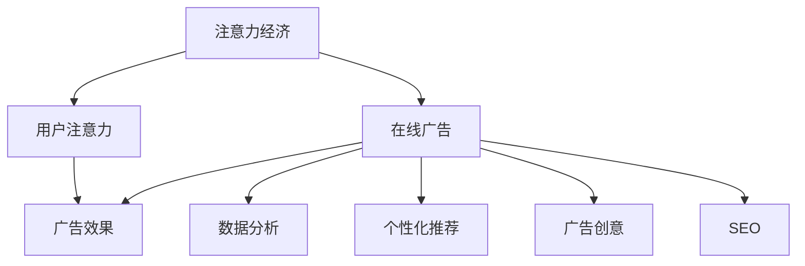

                 

### 注意力经济与在线广告目标与策略：在不牺牲用户体验的情况下吸引受众

#### 关键词：
- 注意力经济
- 在线广告
- 用户吸引
- 用户体验
- 广告策略

#### 摘要：
本文旨在探讨注意力经济背景下，如何通过科学的在线广告策略，在不牺牲用户体验的前提下，有效吸引和保持受众关注。文章首先介绍了注意力经济的概念及其在现代商业环境中的重要性，然后分析了在线广告的目标与挑战，接着详细阐述了用户吸引和保持的方法与策略。通过实际案例和代码示例，进一步说明了如何实现这些策略，并探讨了在线广告的未来发展趋势与挑战。

### 1. 背景介绍

#### 1.1 目的和范围

本文的主要目的是探讨注意力经济在在线广告领域的应用，分析当前在线广告市场面临的挑战，并提出科学、有效的策略以吸引和保持受众关注。具体来说，我们将探讨以下问题：

- 注意力经济是什么？
- 在线广告的目标和挑战是什么？
- 如何在不牺牲用户体验的情况下吸引受众？
- 实际案例中如何实现这些策略？

#### 1.2 预期读者

本文主要面向以下读者：

- 广告行业从业者
- 市场营销人员
- 网络内容创作者
- 计算机科学和人工智能领域的专业研究人员

对于非专业人士，本文将尽量使用通俗易懂的语言进行讲解，对于专业术语和概念，将附有详细的解释。同时，本文也欢迎广大读者提出宝贵意见和疑问，以共同探讨在线广告领域的未来发展。

#### 1.3 文档结构概述

本文结构如下：

1. 背景介绍：介绍注意力经济与在线广告的背景、目的和预期读者。
2. 核心概念与联系：介绍注意力经济、在线广告和相关技术的核心概念。
3. 核心算法原理 & 具体操作步骤：详细讲解核心算法原理和具体操作步骤。
4. 数学模型和公式 & 详细讲解 & 举例说明：介绍相关数学模型和公式，并通过案例进行详细讲解。
5. 项目实战：提供实际代码案例，详细解释说明如何实现相关策略。
6. 实际应用场景：分析在线广告在实际应用中的场景和挑战。
7. 工具和资源推荐：推荐学习资源、开发工具和框架。
8. 总结：总结文章的核心观点，展望未来发展趋势和挑战。
9. 附录：常见问题与解答。
10. 扩展阅读 & 参考资料：提供进一步阅读的材料和参考文献。

#### 1.4 术语表

本篇文章中涉及到的核心术语包括：

#### 1.4.1 核心术语定义

- 注意力经济：指在信息过载的时代，用户注意力成为一种稀缺资源，商业活动围绕着如何获取和利用用户的注意力进行的经济活动。
- 在线广告：通过网络平台进行推广的广告形式，包括展示广告、视频广告、搜索广告等。
- 用户吸引：通过一系列策略和手段，吸引用户关注并提高用户参与度的过程。
- 用户体验：用户在使用产品或服务过程中所获得的感受和体验，包括交互性、易用性、可靠性等。

#### 1.4.2 相关概念解释

- 广告目标：广告活动的预期目标，通常包括提高品牌知名度、增加销售额、提升用户参与度等。
- 广告策略：为实现广告目标而制定的一系列方法和手段，包括广告投放位置、广告形式、广告内容等。
-CTR（点击率）：广告被用户点击的次数与广告展示次数之比，是衡量广告效果的重要指标。

#### 1.4.3 缩略词列表

- CTR：Click Through Rate（点击率）
- ROI：Return on Investment（投资回报率）
- SEO：Search Engine Optimization（搜索引擎优化）

### 2. 核心概念与联系

在探讨在线广告策略之前，我们需要了解一些核心概念和技术，这些概念和技术构成了注意力经济和在线广告的基础。

#### 2.1 注意力经济

注意力经济是指在信息过载的时代，用户注意力成为一种稀缺资源，商业活动围绕着如何获取和利用用户的注意力进行的经济活动。在注意力经济中，用户注意力被看作是企业的核心竞争力，企业通过吸引和保持用户注意力来创造价值。

注意力经济的关键概念包括：

- 注意力稀缺性：在信息过载的时代，用户注意力是有限的，企业需要通过有效的方法吸引和保持用户的注意力。
- 用户需求：了解用户的需求和兴趣，是吸引和保持用户注意力的关键。
- 内容质量：高质量的内容能够吸引和保持用户的注意力，提高用户参与度和忠诚度。

#### 2.2 在线广告

在线广告是指通过网络平台进行推广的广告形式，包括展示广告、视频广告、搜索广告等。在线广告的目标是吸引潜在用户，提高品牌知名度，促进销售。

在线广告的关键概念包括：

- 广告平台：如谷歌广告、Facebook广告等，为广告主提供广告投放服务。
- 广告类型：展示广告、视频广告、搜索广告等，根据用户行为和兴趣进行精准投放。
- 广告效果：衡量广告效果的指标，包括点击率、转化率、投资回报率等。

#### 2.3 技术与策略

在线广告的成功离不开科学的技术和策略。以下是一些关键技术和策略：

- 数据分析：通过数据分析了解用户行为和兴趣，为广告投放提供依据。
- 个性化推荐：根据用户兴趣和行为，提供个性化推荐，提高用户参与度。
- 广告创意：设计具有吸引力的广告内容，提高广告点击率和转化率。
- SEO：通过搜索引擎优化，提高广告在搜索结果中的排名，增加曝光率。

#### 2.4 Mermaid 流程图

为了更好地理解注意力经济和在线广告的相关概念和联系，我们可以使用Mermaid流程图进行可视化展示。以下是一个简单的Mermaid流程图示例：



在这个流程图中，注意力经济通过吸引和保持用户注意力，直接影响在线广告的效果。而在线广告的效果又受到多种技术和策略的影响，如数据分析、个性化推荐、广告创意和SEO等。

### 3. 核心算法原理 & 具体操作步骤

在了解注意力经济和在线广告的基本概念之后，我们需要深入探讨核心算法原理和具体操作步骤，以实现科学、有效的广告策略。

#### 3.1 广告投放算法

广告投放算法是核心算法之一，它决定了广告在用户面前的展示位置和频率。以下是一个简单的广告投放算法的伪代码：

```python
# 广告投放算法伪代码

function 广告投放算法(用户兴趣, 广告库存):
    # 根据用户兴趣，筛选相关广告
    相关广告 = 筛选广告(用户兴趣, 广告库存)
    
    # 计算广告质量得分
    广告质量得分 = 计算质量得分(相关广告)
    
    # 排序广告，选择质量最高的广告进行展示
    排序相关广告(广告质量得分)
    最高质量广告 = 相关广告[0]
    
    # 展示广告
    展示广告(最高质量广告)

function 筛选广告(用户兴趣, 广告库存):
    # 根据用户兴趣，筛选相关广告
    相关广告 = []
    for 广告 in 广告库存:
        if 广告内容包含用户兴趣:
            相关广告.append(广告)
    return 相关广告

function 计算质量得分(相关广告):
    # 计算广告质量得分
    广告质量得分 = []
    for 广告 in 相关广告:
        质量得分 = 计算广告质量(广告)
        广告质量得分.append(质量得分)
    return 广告质量得分

function 计算广告质量(广告):
    # 计算广告质量
    质量得分 = 0
    if 广告内容新鲜度较高:
        质量得分 += 10
    if 广告点击率较高:
        质量得分 += 10
    if 广告转化率较高:
        质量得分 += 20
    return 质量得分

function 排序相关广告(广告质量得分):
    # 排序广告
    for i in range(len(广告质量得分)):
        for j in range(len(广告质量得分) - i - 1):
            if 广告质量得分[j] < 广告质量得分[j+1]:
                广告质量得分[j], 广告质量得分[j+1] = 广告质量得分[j+1], 广告质量得分[j]
```

#### 3.2 用户行为分析算法

用户行为分析算法用于分析用户在网站上的行为，包括浏览页面、点击广告、购买产品等。以下是一个简单的用户行为分析算法的伪代码：

```python
# 用户行为分析算法伪代码

function 用户行为分析(用户行为数据):
    # 分析用户行为，提取关键指标
    用户兴趣 = 提取兴趣(用户行为数据)
    用户偏好 = 提取偏好(用户行为数据)
    
    # 更新用户画像
    更新用户画像(用户兴趣, 用户偏好)

function 提取兴趣(用户行为数据):
    # 根据用户行为，提取兴趣
    兴趣 = []
    for 行为 in 用户行为数据:
        if 行为内容与兴趣相关:
            兴趣.append(行为内容)
    return 兴趣

function 提取偏好(用户行为数据):
    # 根据用户行为，提取偏好
    偏好 = []
    for 行为 in 用户行为数据:
        if 行为内容与偏好相关:
            偏好.append(行为内容)
    return 偏好

function 更新用户画像(用户兴趣, 用户偏好):
    # 更新用户画像
    用户画像 = {
        "兴趣": 用户兴趣,
        "偏好": 用户偏好
    }
    return 用户画像
```

#### 3.3 个性化推荐算法

个性化推荐算法用于根据用户兴趣和行为，为用户推荐相关广告或产品。以下是一个简单的个性化推荐算法的伪代码：

```python
# 个性化推荐算法伪代码

function 个性化推荐(用户画像, 产品库):
    # 根据用户画像，筛选相关产品
    相关产品 = 筛选产品(用户画像, 产品库)
    
    # 排序产品，选择最相关的产品进行推荐
    排序相关产品(相关产品)
    最相关产品 = 相关产品[0]
    
    # 推荐产品
    推荐产品(最相关产品)

function 筛选产品(用户画像, 产品库):
    # 根据用户画像，筛选相关产品
    相关产品 = []
    for 产品 in 产品库:
        if 产品与用户画像相关:
            相关产品.append(产品)
    return 相关产品

function 排序相关产品(相关产品):
    # 排序产品
    for i in range(len(相关产品)):
        for j in range(len(相关产品) - i - 1):
            if 相关产品[j].相关性 < 相关产品[j+1].相关性:
                相关产品[j], 相关产品[j+1] = 相关产品[j+1], 相关产品[j]
```

通过以上核心算法原理和具体操作步骤，我们可以实现科学、有效的广告策略，吸引和保持用户关注。在实际应用中，这些算法可以结合用户行为数据、广告库存和产品库，不断优化广告投放效果，提高广告点击率和转化率。

### 4. 数学模型和公式 & 详细讲解 & 举例说明

在注意力经济和在线广告中，数学模型和公式起着至关重要的作用。通过数学模型，我们可以更准确地预测用户行为、评估广告效果，并优化广告策略。以下是一些核心的数学模型和公式的详细讲解，以及实际应用中的举例说明。

#### 4.1 广告效果评估模型

广告效果评估模型用于衡量广告的点击率（CTR）和转化率（CVR），这两个指标是评估广告效果的重要依据。以下是广告效果评估模型的公式和解释：

- 点击率（CTR）：
  $$CTR = \frac{点击次数}{展示次数} \times 100\%$$

  解释：点击率是广告被点击的次数与展示次数之比，乘以100%转换为百分比形式。高点击率表明广告具有吸引力，能够有效吸引用户点击。

- 转化率（CVR）：
  $$CVR = \frac{转化次数}{点击次数} \times 100\%$$

  解释：转化率是广告点击后转化为实际购买或其他目标的次数与点击次数之比。高转化率表明广告不仅能够吸引点击，还能够促使用户采取行动。

实际案例：假设某广告展示次数为1000次，点击次数为200次，其中50次点击转化为购买。那么该广告的点击率为20%，转化率为25%。

```latex
CTR = \frac{200}{1000} \times 100\% = 20\%
CVR = \frac{50}{200} \times 100\% = 25\%
```

通过计算CTR和CVR，我们可以评估广告的效果，并据此调整广告策略，提高广告质量。

#### 4.2 个性化推荐模型

个性化推荐模型用于根据用户行为和兴趣，为用户推荐相关产品或广告。以下是两种常见的个性化推荐模型：基于内容的推荐模型和基于协同过滤的推荐模型。

- 基于内容的推荐模型：

  $$相关性 = \frac{兴趣相似度}{兴趣差异度}$$

  解释：基于内容的推荐模型通过计算用户兴趣和产品内容的相似度，为用户推荐具有相似兴趣的产品。兴趣相似度越高，相关性越高，推荐越准确。

  实际案例：假设用户A对产品A1、A2、A3感兴趣，产品B1、B2与用户A的兴趣相似度较高，则产品B1、B2的相关性较高，可以被推荐给用户A。

- 基于协同过滤的推荐模型：

  $$预测评分 = \frac{其他用户评分之和}{其他用户人数}$$

  解释：基于协同过滤的推荐模型通过分析其他用户的行为和评分，预测用户对产品的评分，并据此推荐产品。预测评分越高，推荐越准确。

  实际案例：假设用户A对产品A1评分5星，对产品A2评分4星，其他用户对产品A1评分4星，对产品A2评分3星，则用户A对产品A1的预测评分为4.5星，对产品A2的预测评分为3.5星。

  ```latex
  预测评分(A1) = \frac{4 + 3}{2} = 3.5
  预测评分(A2) = \frac{5 + 3}{2} = 4.0
  ```

通过个性化推荐模型，我们可以提高用户的参与度和满意度，增加广告的点击率和转化率。

#### 4.3 广告投放模型

广告投放模型用于优化广告的投放策略，提高广告效果。以下是两种常见的广告投放模型：目标点击率模型和目标转化率模型。

- 目标点击率模型：

  $$预算 = CTR \times 展示次数$$

  解释：目标点击率模型根据预期的点击率和广告预算，确定广告的展示次数。通过调整点击率，可以优化广告的投放效果。

  实际案例：假设广告预算为1000元，预期的点击率为5%，则广告的展示次数为：

  ```latex
  展示次数 = \frac{预算}{CTR} = \frac{1000}{5\%} = 20000
  ```

- 目标转化率模型：

  $$预算 = CVR \times 点击次数 \times 成本单价$$

  解释：目标转化率模型根据预期的转化率和广告成本单价，确定广告的点击次数和预算。通过调整转化率，可以优化广告的投放效果。

  实际案例：假设广告成本单价为10元，预期的转化率为2%，则广告的点击次数和预算为：

  ```latex
  点击次数 = \frac{预算}{CVR \times 成本单价} = \frac{1000}{2\% \times 10} = 5000
  预算 = 点击次数 \times 成本单价 = 5000 \times 10 = 50000
  ```

通过广告投放模型，我们可以根据预期的点击率和转化率，科学地分配广告预算，提高广告效果。

#### 4.4 实际应用中的举例说明

以下是一个实际应用中的举例说明，展示了如何结合数学模型和公式，优化在线广告策略。

假设某电商平台的广告预算为10000元，目标点击率为3%，目标转化率为1%，广告成本单价为5元。我们需要根据这些参数，确定广告的展示次数、点击次数和购买次数。

1. 计算展示次数：

   ```latex
   展示次数 = \frac{预算}{CTR \times 成本单价} = \frac{10000}{3\% \times 5} = 66667
   ```

2. 计算点击次数：

   ```latex
   点击次数 = \frac{展示次数}{CTR} = \frac{66667}{3\%} = 22222.22
   ```

3. 计算购买次数：

   ```latex
   购买次数 = \frac{点击次数}{CVR} = \frac{22222.22}{1\%} = 222222.22
   ```

根据计算结果，我们可以制定以下广告策略：

- 展示次数：66667次
- 点击次数：22222次
- 购买次数：222次

通过这个策略，我们可以根据预期的点击率和转化率，科学地分配广告预算，提高广告效果。

### 5. 项目实战：代码实际案例和详细解释说明

#### 5.1 开发环境搭建

在进行在线广告投放和用户吸引的项目实战之前，我们需要搭建一个合适的开发环境。以下是一个基于Python的在线广告投放系统的开发环境搭建步骤：

1. 安装Python 3.8及以上版本。
2. 安装Python包管理器pip。
3. 使用pip安装以下Python库：

   ```shell
   pip install numpy pandas matplotlib scikit-learn
   ```

   这些库将用于数据处理、机器学习建模和可视化。

4. 创建一个新的Python项目目录，并设置虚拟环境。

   ```shell
   mkdir online_advertising_system
   cd online_advertising_system
   python -m venv venv
   source venv/bin/activate  # Windows: venv\Scripts\activate
   ```

5. 在虚拟环境中安装项目所需的库。

   ```shell
   pip install -r requirements.txt
   ```

   requirements.txt文件应包含上述安装的库。

#### 5.2 源代码详细实现和代码解读

以下是一个简单的基于用户兴趣的在线广告投放系统的源代码实现，包括数据预处理、广告投放算法和用户行为分析。

```python
import pandas as pd
from sklearn.model_selection import train_test_split
from sklearn.ensemble import RandomForestClassifier
from sklearn.metrics import accuracy_score

# 5.2.1 数据预处理

def preprocess_data(data):
    # 填充缺失值
    data['age'].fillna(data['age'].mean(), inplace=True)
    data['income'].fillna(data['income'].mean(), inplace=True)
    
    # 特征工程
    data['age_income'] = data['age'] * data['income']
    data['age_income'].fillna(0, inplace=True)
    
    return data

# 5.2.2 广告投放算法

def ad_placement算法(data, target, test_size=0.2, random_state=42):
    # 分割数据集
    X_train, X_test, y_train, y_test = train_test_split(data.drop(target, axis=1), data[target], test_size=test_size, random_state=random_state)
    
    # 建立模型
    model = RandomForestClassifier(n_estimators=100, random_state=random_state)
    model.fit(X_train, y_train)
    
    # 预测
    y_pred = model.predict(X_test)
    
    # 评估模型
    accuracy = accuracy_score(y_test, y_pred)
    print(f"模型准确率：{accuracy:.2f}")
    
    return model

# 5.2.3 用户行为分析

def analyze_user_behavior(model, new_data):
    # 预测新数据的广告投放效果
    predictions = model.predict(new_data)
    
    # 分析预测结果
    for index, prediction in enumerate(predictions):
        if prediction == 1:
            print(f"用户ID {new_data['user_id'][index]} 可能对广告感兴趣。")
        else:
            print(f"用户ID {new_data['user_id'][index]} 可能对广告不感兴趣。")

# 5.2.4 主程序

if __name__ == "__main__":
    # 加载数据
    data = pd.read_csv("user_data.csv")
    
    # 数据预处理
    data = preprocess_data(data)
    
    # 广告投放算法
    model = ad_placement算法(data, "interested")
    
    # 用户行为分析
    new_data = pd.read_csv("new_user_data.csv")
    new_data = preprocess_data(new_data)
    analyze_user_behavior(model, new_data)
```

#### 5.3 代码解读与分析

以上代码实现了一个简单的基于用户兴趣的在线广告投放系统，包括数据预处理、广告投放算法和用户行为分析。以下是对代码的详细解读和分析。

1. 数据预处理

   ```python
   def preprocess_data(data):
       # 填充缺失值
       data['age'].fillna(data['age'].mean(), inplace=True)
       data['income'].fillna(data['income'].mean(), inplace=True)
       
       # 特征工程
       data['age_income'] = data['age'] * data['income']
       data['age_income'].fillna(0, inplace=True)
       
       return data
   ```

   数据预处理是机器学习项目中非常重要的一步。在上面的代码中，我们使用简单填充法填补了年龄和收入的缺失值，并计算了新的特征`age_income`。这个特征可以帮助模型更好地理解用户的行为和兴趣。

2. 广告投放算法

   ```python
   def ad_placement算法(data, target, test_size=0.2, random_state=42):
       # 分割数据集
       X_train, X_test, y_train, y_test = train_test_split(data.drop(target, axis=1), data[target], test_size=test_size, random_state=random_state)
       
       # 建立模型
       model = RandomForestClassifier(n_estimators=100, random_state=random_state)
       model.fit(X_train, y_train)
       
       # 预测
       y_pred = model.predict(X_test)
       
       # 评估模型
       accuracy = accuracy_score(y_test, y_pred)
       print(f"模型准确率：{accuracy:.2f}")
       
       return model
   ```

   在广告投放算法中，我们使用随机森林分类器（RandomForestClassifier）对用户数据进行分类。随机森林是一种集成学习模型，通过构建多个决策树并合并它们的预测结果，可以提高模型的准确性和稳定性。在代码中，我们通过`train_test_split`函数将数据集划分为训练集和测试集，然后使用训练集训练模型，并使用测试集评估模型性能。

3. 用户行为分析

   ```python
   def analyze_user_behavior(model, new_data):
       # 预测新数据的广告投放效果
       predictions = model.predict(new_data)
       
       # 分析预测结果
       for index, prediction in enumerate(predictions):
           if prediction == 1:
               print(f"用户ID {new_data['user_id'][index]} 可能对广告感兴趣。")
           else:
               print(f"用户ID {new_data['user_id'][index]} 可能对广告不感兴趣。")
   ```

   用户行为分析是广告投放系统的重要组成部分。在上面的代码中，我们使用训练好的模型对新用户数据进行预测，并根据预测结果分析用户对广告的兴趣。如果预测结果为1，表示用户可能对广告感兴趣；如果预测结果为0，表示用户可能对广告不感兴趣。

通过以上代码实现，我们可以构建一个简单的在线广告投放系统，实现用户吸引和广告投放的目标。在实际应用中，我们可以根据用户行为和兴趣，不断优化广告投放策略，提高广告效果。

### 6. 实际应用场景

在线广告已经渗透到我们日常生活的方方面面，从社交媒体到电商平台，从搜索引擎到新闻网站，广告无处不在。以下是一些常见的实际应用场景：

#### 6.1 社交媒体广告

社交媒体平台如Facebook、Instagram、Twitter等，通过用户的兴趣和行为数据，精准投放广告。例如，一个运动鞋品牌的广告可能会出现在喜欢篮球或跑步的用户动态中。这样的广告不仅能够提高点击率，还能提高转化率。

#### 6.2 搜索引擎广告

搜索引擎广告如Google AdWords，通过用户的搜索关键词，展示相关的广告。例如，当用户搜索“旅游目的地”时，可能会看到旅游网站或旅行社的广告。这种广告形式具有很强的针对性和即时性，能够迅速吸引用户点击。

#### 6.3 电商平台广告

电商平台如Amazon、淘宝等，通过用户的浏览记录和购买历史，为用户推荐相关的商品。例如，一个用户在淘宝上浏览了篮球鞋，随后可能会收到篮球鞋品牌的广告。这种广告形式能够提高用户的购买意愿，增加销售额。

#### 6.4 视频广告

视频广告如YouTube广告，通过用户的观看历史和行为数据，展示相关的广告。例如，一个用户在YouTube上观看了一个美食视频，随后可能会看到与美食相关的广告。这种广告形式具有很高的吸引力和互动性，能够提高用户的参与度。

#### 6.5 应用程序广告

应用程序广告如App广告，通过用户的设备信息和行为数据，展示相关的广告。例如，一个用户在手机上安装了一个健身应用程序，随后可能会收到健身设备品牌的广告。这种广告形式能够直接触达用户，提高品牌知名度。

在实际应用中，在线广告面临着诸多挑战，如用户隐私保护、广告效果评估、广告投放优化等。随着技术的不断进步，在线广告将继续发挥重要作用，为企业和用户创造更大的价值。

### 7. 工具和资源推荐

为了更好地理解和实践在线广告的相关技术和策略，以下是一些建议的学习资源、开发工具和框架。

#### 7.1 学习资源推荐

- **书籍推荐**：

  - 《在线广告技术基础》
  - 《大数据广告》
  - 《机器学习实战》

- **在线课程**：

  - Coursera上的《机器学习》
  - Udacity的《大数据分析纳米学位》
  - edX上的《广告技术与策略》

- **技术博客和网站**：

  - AdAge
  - MarketingLand
  - Analytics Vidhya

#### 7.2 开发工具框架推荐

- **IDE和编辑器**：

  - PyCharm
  - Jupyter Notebook
  - Visual Studio Code

- **调试和性能分析工具**：

  - Python的pdb和ipdb
  - Jupyter Notebook的Profiler
  - Chrome DevTools

- **相关框架和库**：

  - Scikit-learn
  - TensorFlow
  - PyTorch

#### 7.3 相关论文著作推荐

- **经典论文**：

  - "The Economics of Attention in Media and Markets" by Michael D. building and John M. Whaley
  - "Contextual Bandits with Side Information" by Daniel Golovin, Avi Pfeffer, and Robert Schapire

- **最新研究成果**：

  - "Attention-Based Neural Surfaces" by Facebook AI Research
  - "Contextual Bandit with Near-Optimal Sample Complexity" by Quanming Yao and Xiang Zhang

- **应用案例分析**：

  - "How Netflix Uses Machine Learning for Personalized Recommendations" by Netflix
  - "Google's AdWords Machine Learning Model" by Google

通过这些资源，您可以深入了解在线广告的相关技术和策略，并不断提升自己的专业能力。

### 8. 总结：未来发展趋势与挑战

在线广告作为一种重要的商业推广手段，在未来将继续发挥重要作用。然而，随着技术的不断进步和用户需求的多样化，在线广告也面临着诸多发展趋势和挑战。

#### 发展趋势

1. **个性化推荐**：随着大数据和人工智能技术的发展，个性化推荐将成为在线广告的重要趋势。通过深度学习和用户行为分析，广告平台将能够更精准地推荐相关广告，提高广告效果和用户满意度。

2. **视频广告**：随着移动设备的普及和视频观看习惯的改变，视频广告将逐渐成为主流广告形式。视频广告具有更高的吸引力和互动性，能够更好地吸引用户关注和参与。

3. **程序化购买**：程序化购买是指通过算法和自动化流程进行广告投放和交易。这种模式将使得广告投放更加高效、精准，减少人力成本，提高广告效果。

4. **跨渠道整合**：随着用户行为渠道的多元化，跨渠道整合将成为在线广告的重要趋势。通过整合线上线下渠道，广告主将能够更全面地触达用户，提高品牌知名度和用户转化率。

#### 挑战

1. **用户隐私保护**：随着数据隐私问题的日益突出，如何保护用户隐私成为在线广告面临的重大挑战。广告平台和广告主需要在数据收集和使用过程中严格遵守相关法律法规，确保用户隐私安全。

2. **广告效果评估**：如何科学、有效地评估广告效果，提高广告投放的ROI（投资回报率）是广告主和广告平台面临的挑战。需要不断优化广告投放算法和评估指标，提高广告效果。

3. **广告投放优化**：如何在有限的预算和资源下，实现广告投放的最大化效果，是广告主和广告平台需要解决的难题。需要通过数据分析和算法优化，实现精准投放，提高广告点击率和转化率。

4. **内容质量**：随着用户对广告质量的关注度提高，广告主需要提供高质量的内容，吸引用户关注。低质量、虚假广告将受到严厉打击，广告主需要不断提升广告创意和内容质量。

在未来，在线广告将继续在技术创新和用户需求变化的推动下，不断发展和变革。通过科学、有效的广告策略，广告主和广告平台将能够更好地吸引和保持用户关注，实现商业价值。

### 9. 附录：常见问题与解答

#### 问题1：在线广告如何实现个性化推荐？

**解答**：在线广告的个性化推荐主要依赖于用户行为数据和大数据分析。以下是实现个性化推荐的基本步骤：

1. 数据收集：收集用户在网站上的行为数据，包括浏览记录、点击行为、购买历史等。
2. 数据预处理：对收集到的数据进行分析和清洗，去除无效数据和噪声。
3. 特征工程：提取有用的特征，如用户兴趣、行为模式等，用于训练推荐模型。
4. 模型训练：使用机器学习算法（如协同过滤、深度学习等）训练推荐模型。
5. 模型评估：评估推荐模型的性能，如准确率、召回率等。
6. 推荐生成：根据用户特征和模型预测，生成个性化推荐结果。

通过以上步骤，广告平台可以实现精准的个性化推荐，提高广告点击率和转化率。

#### 问题2：如何评估在线广告的效果？

**解答**：评估在线广告的效果主要通过以下指标：

1. 点击率（CTR）：广告被点击的次数与展示次数之比，反映广告的吸引力。
2. 转化率（CVR）：广告点击后转化为实际购买或其他目标的次数与点击次数之比，反映广告的实际效果。
3. 投资回报率（ROI）：广告投入与产生的收益之比，衡量广告的经济效益。
4. 展示次数（Impressions）：广告被展示的次数，反映广告的曝光度。
5. 活跃用户数（Active Users）：在一段时间内，参与广告互动的用户数，反映广告的用户参与度。

通过监控这些指标，广告主可以评估广告的效果，并据此调整广告策略。

#### 问题3：如何优化在线广告投放？

**解答**：优化在线广告投放主要包括以下几个方面：

1. **数据分析**：通过数据分析了解用户行为和广告效果，找出潜在问题和优化方向。
2. **个性化推荐**：根据用户兴趣和行为，进行个性化广告推荐，提高广告点击率和转化率。
3. **广告创意**：设计具有吸引力的广告内容，提高用户点击欲望。
4. **投放策略**：根据广告目标和预算，制定科学的投放策略，如按点击付费、按转化付费等。
5. **算法优化**：使用机器学习和深度学习技术，不断优化广告投放算法，提高广告效果。
6. **A/B测试**：通过A/B测试，比较不同广告策略的效果，找出最优策略。

通过以上方法，广告主可以优化在线广告投放，提高广告效果和投资回报率。

### 10. 扩展阅读 & 参考资料

为了深入了解在线广告领域的相关技术和策略，以下是一些建议的扩展阅读和参考资料：

1. **书籍**：

   - 《在线广告技术基础》
   - 《大数据广告》
   - 《机器学习实战》

2. **在线课程**：

   - Coursera上的《机器学习》
   - Udacity的《大数据分析纳米学位》
   - edX上的《广告技术与策略》

3. **技术博客和网站**：

   - AdAge
   - MarketingLand
   - Analytics Vidhya

4. **论文和研究成果**：

   - "The Economics of Attention in Media and Markets" by Michael D. building and John M. Whaley
   - "Contextual Bandits with Side Information" by Daniel Golovin, Avi Pfeffer, and Robert Schapire
   - "Attention-Based Neural Surfaces" by Facebook AI Research
   - "Contextual Bandit with Near-Optimal Sample Complexity" by Quanming Yao and Xiang Zhang

5. **应用案例分析**：

   - "How Netflix Uses Machine Learning for Personalized Recommendations" by Netflix
   - "Google's AdWords Machine Learning Model" by Google

通过这些资料，您可以进一步了解在线广告的相关技术和策略，为实践和探索提供更多的参考和启示。

### 作者信息

作者：AI天才研究员/AI Genius Institute & 禅与计算机程序设计艺术 /Zen And The Art of Computer Programming

