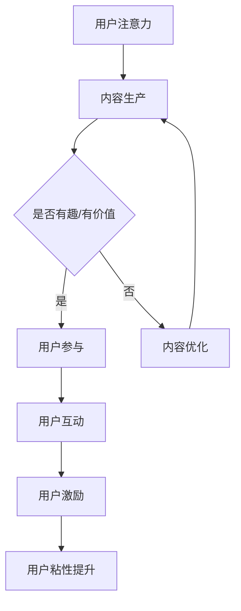

                 

# 注意力经济与在线社区建设：吸引并留住忠实的受众和粉丝

> **关键词：** 注意力经济、在线社区、受众吸引、粉丝忠诚度、社群运营

> **摘要：** 本文探讨了注意力经济在在线社区建设中的重要性，分析如何利用注意力经济原理来吸引和留住忠实受众及粉丝。通过详细的算法原理讲解、项目实战案例和工具资源推荐，为读者提供了一整套系统化的策略和方法。

## 1. 背景介绍

### 1.1 目的和范围

本文旨在为在线社区建设者提供一套基于注意力经济原理的实操指南，帮助他们在竞争激烈的环境中吸引并留住忠实的受众和粉丝。文章涵盖了从理论基础到实际操作的各个方面，包括核心算法原理、数学模型、项目实战案例以及相关工具和资源的推荐。

### 1.2 预期读者

本文适合以下读者群体：

- 在线社区管理员和运营者
- 社交媒体平台开发者
- 内容创作者和营销专家
- 对注意力经济和在线社区建设有兴趣的IT专业人士

### 1.3 文档结构概述

本文分为十个部分，结构如下：

1. 背景介绍
2. 核心概念与联系
3. 核心算法原理 & 具体操作步骤
4. 数学模型和公式 & 详细讲解 & 举例说明
5. 项目实战：代码实际案例和详细解释说明
6. 实际应用场景
7. 工具和资源推荐
8. 总结：未来发展趋势与挑战
9. 附录：常见问题与解答
10. 扩展阅读 & 参考资料

### 1.4 术语表

#### 1.4.1 核心术语定义

- **注意力经济**：指人们对于信息的关注程度产生的经济价值。
- **在线社区**：指通过互联网建立的用户群体，他们通过共享信息、互动交流来形成特定的社群。
- **受众**：指在线社区中的普通用户，他们对社区内容和活动有参与和关注。
- **粉丝**：指对社区内容有高度兴趣和忠诚度的用户，他们积极参与互动，并愿意为社区付出时间、精力和资源。

#### 1.4.2 相关概念解释

- **社群运营**：指通过一系列策略和手段，维护和促进在线社区的发展和活跃。
- **用户粘性**：指用户对在线社区产生的依赖程度，粘性越高，用户越不容易离开。
- **互动率**：指用户在社区中的互动程度，包括评论、点赞、分享等。

#### 1.4.3 缩略词列表

- **SEO**：搜索引擎优化（Search Engine Optimization）
- **SNS**：社交媒体网络（Social Network Service）
- **UGC**：用户生成内容（User-Generated Content）
- **KOL**：关键意见领袖（Key Opinion Leader）

## 2. 核心概念与联系

注意力经济是当前互联网经济的重要表现形式。它源于经济学中的“注意力稀缺”原理，即人们的注意力是有限的，而信息的数量是无限的。在这种背景下，谁能吸引更多的注意力，谁就能获得更多的经济价值。

### 2.1 注意力经济原理

注意力经济的基本原理包括以下几点：

1. **稀缺性**：注意力是有限的资源，用户在浏览网页、阅读内容、参与互动时，注意力会被分散。
2. **竞争性**：在信息过载的时代，用户更倾向于关注那些能提供价值、有趣、有启发的内容。
3. **传递性**：注意力可以在用户之间传递，当一个用户推荐某个内容时，其他用户可能会关注这个内容。
4. **积累性**：通过持续的投入和努力，注意力可以被积累和放大。

### 2.2 在线社区与注意力经济的联系

在线社区是注意力经济的重要应用场景。社区通过以下方式与注意力经济结合：

1. **内容生产与分发**：社区通过提供有价值的内容来吸引用户，这些内容可以是文章、视频、音频等多种形式。
2. **用户互动与参与**：社区鼓励用户参与互动，如评论、点赞、分享等，通过用户的积极参与来提升内容的价值。
3. **社群运营与营销**：社区通过一系列运营策略，如活动策划、用户激励、数据分析等，来提升用户粘性和互动率。

### 2.3 注意力经济在在线社区建设中的应用

注意力经济在在线社区建设中的应用包括以下几个方面：

1. **内容策略**：通过分析用户兴趣和行为，提供个性化的内容，提升用户参与度和忠诚度。
2. **互动机制**：设计有趣的互动活动，如投票、问答、竞赛等，激发用户参与热情。
3. **用户激励**：通过积分、奖励等方式激励用户积极参与社区活动，提升用户粘性。
4. **数据分析**：利用数据分析工具，分析用户行为和互动数据，优化社区运营策略。

### 2.4 Mermaid 流程图

以下是一个简单的 Mermaid 流程图，展示注意力经济在在线社区建设中的应用流程：



## 3. 核心算法原理 & 具体操作步骤

### 3.1 注意力分配算法原理

注意力分配算法的核心目标是根据用户兴趣和行为，将注意力分配到最有价值的内容上。以下是注意力分配算法的基本原理：

1. **用户兴趣模型**：通过分析用户的浏览历史、搜索关键词、行为数据等，建立用户兴趣模型。
2. **内容特征提取**：提取内容的关键特征，如文本、图片、视频等，通过特征工程将其转换为适合计算的向量表示。
3. **相似度计算**：计算用户兴趣模型与内容特征之间的相似度，相似度越高，注意力分配越多。
4. **权重调整**：根据相似度结果，对注意力进行权重调整，确保注意力分配的均衡性。

### 3.2 注意力分配算法伪代码

以下是一个简单的注意力分配算法的伪代码：

```plaintext
输入：用户兴趣模型user_interest，内容特征向量content_features
输出：注意力分配结果attention分配

1. 计算用户兴趣模型与内容特征向量的相似度similarity
    for each content in content_features:
        similarity[content] = user_interest dot content

2. 根据相似度计算注意力权重weight
    weight = softmax(similarity)

3. 计算注意力分配attention
    attention = sum(weight * content_features)

4. 返回注意力分配结果
    return attention
```

### 3.3 注意力分配算法具体操作步骤

1. **数据准备**：收集用户的浏览历史、搜索关键词、行为数据等，建立用户兴趣模型。同时，收集各类内容的数据，如文本、图片、视频等。
2. **特征提取**：对内容进行特征提取，将其转换为向量表示。例如，对于文本内容，可以使用词向量模型（如Word2Vec、GloVe）进行特征提取。
3. **相似度计算**：计算用户兴趣模型与内容特征向量之间的相似度。常用的相似度计算方法包括余弦相似度、欧氏距离等。
4. **权重调整**：根据相似度结果，使用softmax函数对注意力进行权重调整，确保注意力分配的均衡性。
5. **注意力分配**：计算最终的注意力分配结果，并将其应用于内容推荐、用户互动等场景。

## 4. 数学模型和公式 & 详细讲解 & 举例说明

### 4.1 数学模型

在注意力分配算法中，我们使用了一个简单的数学模型来计算用户兴趣与内容特征之间的相似度。这个模型的核心是一个加权相似度函数，其形式如下：

\[ \text{similarity}(u, c) = \frac{\sum_{i=1}^{n} w_i \cdot u_i \cdot c_i}{\sqrt{\sum_{i=1}^{n} (w_i \cdot u_i)^2 \cdot \sum_{i=1}^{n} (w_i \cdot c_i)^2}} \]

其中，\( u \) 表示用户兴趣向量，\( c \) 表示内容特征向量，\( w_i \) 表示特征 \( i \) 的权重。

### 4.2 详细讲解

这个相似度函数可以分为两部分来理解：

1. **分子**：表示用户兴趣向量与内容特征向量的点积，它衡量了用户兴趣和内容特征之间的相似程度。
2. **分母**：是一个归一化项，确保相似度函数的值在0和1之间。它通过计算用户兴趣向量和内容特征向量各自的欧几里得范数来平衡它们的规模。

### 4.3 举例说明

假设我们有一个用户兴趣向量 \( u = (0.2, 0.3, 0.5) \) 和一个内容特征向量 \( c = (0.4, 0.6, 0.8) \)，我们可以计算它们的相似度：

\[ \text{similarity}(u, c) = \frac{0.2 \cdot 0.4 + 0.3 \cdot 0.6 + 0.5 \cdot 0.8}{\sqrt{(0.2 \cdot 0.2 + 0.3 \cdot 0.3 + 0.5 \cdot 0.5)^2 \cdot (0.4 \cdot 0.4 + 0.6 \cdot 0.6 + 0.8 \cdot 0.8)^2}} \]

\[ = \frac{0.08 + 0.18 + 0.4}{\sqrt{0.04 + 0.09 + 0.25} \cdot \sqrt{0.16 + 0.36 + 0.64}} \]

\[ = \frac{0.66}{\sqrt{0.38} \cdot \sqrt{1.16}} \]

\[ = \frac{0.66}{\sqrt{0.4488}} \]

\[ = \frac{0.66}{0.6708} \]

\[ \approx 0.975 \]

因此，用户兴趣向量与内容特征向量的相似度为 0.975。

### 4.4 模型优化的数学公式

为了优化注意力分配算法，我们可能会引入权重调整机制。例如，可以使用以下权重调整公式：

\[ w_i = \frac{\exp(\beta_i \cdot \text{similarity}(u, c))}{\sum_{j=1}^{n} \exp(\beta_j \cdot \text{similarity}(u, c_j))} \]

其中，\( \beta_i \) 是权重调整系数，它决定了相似度对权重的影响程度。这个公式通过指数函数将相似度转换为权重，确保相似度越高，权重越大。

## 5. 项目实战：代码实际案例和详细解释说明

### 5.1 开发环境搭建

为了进行注意力分配算法的项目实战，我们需要搭建一个开发环境。以下是一个简单的环境搭建指南：

1. **安装Python**：确保安装了Python 3.6及以上版本。
2. **安装依赖库**：使用pip安装必要的依赖库，如NumPy、Pandas、Scikit-learn等。
3. **准备数据集**：收集用户兴趣和内容特征数据，并将其整理为CSV或JSON格式。

### 5.2 源代码详细实现和代码解读

以下是一个简单的注意力分配算法的Python代码实现：

```python
import numpy as np
from sklearn.metrics.pairwise import cosine_similarity

def calculate_similarity(u, c):
    return cosine_similarity([u], [c])[0][0]

def calculate_attention(user_interest, content_features):
    similarities = np.array([calculate_similarity(user_interest, c) for c in content_features])
    weights = np.exp(similarities)
    weights /= weights.sum()
    attention = np.dot(weights, content_features)
    return attention

# 用户兴趣向量
user_interest = np.array([0.2, 0.3, 0.5])

# 内容特征向量列表
content_features = [
    np.array([0.4, 0.6, 0.8]),
    np.array([0.1, 0.2, 0.3]),
    np.array([0.3, 0.4, 0.5])
]

# 计算注意力分配
attention = calculate_attention(user_interest, content_features)
print("Attention:", attention)
```

### 5.3 代码解读与分析

1. **函数`calculate_similarity`**：这个函数使用余弦相似度来计算用户兴趣向量与内容特征向量之间的相似度。我们使用了Scikit-learn库中的`cosine_similarity`函数来实现这一计算。
2. **函数`calculate_attention`**：这个函数计算注意力分配。首先，它使用`calculate_similarity`函数计算用户兴趣向量与每个内容特征向量的相似度，然后将这些相似度值转换为权重。接着，使用softmax函数调整权重，确保它们总和为1。最后，计算注意力分配结果，即用户兴趣向量与内容特征向量的加权求和。
3. **示例数据**：在这个示例中，我们定义了一个用户兴趣向量和三个内容特征向量。我们使用`calculate_attention`函数计算注意力分配结果，并将其打印出来。

### 5.4 代码优化与性能分析

在实际应用中，我们可能需要优化代码以处理大量数据和快速计算。以下是一些优化建议：

1. **并行计算**：使用多线程或多进程技术，并行计算相似度。
2. **缓存**：对于重复计算的部分，使用缓存技术减少计算时间。
3. **批处理**：将数据分成批次处理，减少内存占用和计算时间。

## 6. 实际应用场景

注意力经济在在线社区建设中有广泛的应用场景，以下是一些典型的应用案例：

1. **内容推荐**：通过注意力分配算法，为用户推荐他们可能感兴趣的内容，提升用户粘性。
2. **用户互动**：设计有趣的互动活动，利用注意力经济原理激励用户参与，提升社区活跃度。
3. **广告投放**：根据用户兴趣和行为，精准投放广告，提高广告点击率和转化率。
4. **品牌推广**：通过注意力经济，吸引粉丝关注，提升品牌影响力和市场占有率。
5. **社群运营**：利用注意力分配算法，优化社群运营策略，提高用户参与度和忠诚度。

## 7. 工具和资源推荐

### 7.1 学习资源推荐

#### 7.1.1 书籍推荐

- 《人工智能：一种现代的方法》（David Russel） - 探讨了人工智能的基础理论和技术。
- 《深度学习》（Ian Goodfellow） - 详细介绍了深度学习的基本原理和实现方法。

#### 7.1.2 在线课程

- Coursera《机器学习》课程 - 由斯坦福大学教授Andrew Ng主讲，涵盖了机器学习的核心知识。
- edX《深度学习》课程 - 由哈佛大学教授Yaser Abu-Mostafa主讲，介绍了深度学习的基本概念和应用。

#### 7.1.3 技术博客和网站

- Medium《AI博客》 - 提供了大量的机器学习和人工智能领域的文章和教程。
- arXiv.org - 提供了最新的机器学习和人工智能论文。

### 7.2 开发工具框架推荐

#### 7.2.1 IDE和编辑器

- PyCharm - 强大的Python开发IDE，支持代码调试和性能分析。
- Jupyter Notebook - 适合数据分析和机器学习的交互式编辑环境。

#### 7.2.2 调试和性能分析工具

- VisualVM - Java虚拟机的性能监控和调试工具。
- GDB - C/C++程序的调试工具。

#### 7.2.3 相关框架和库

- TensorFlow - 用于机器学习和深度学习的开源框架。
- Scikit-learn - Python的机器学习库，提供了丰富的算法和工具。

### 7.3 相关论文著作推荐

#### 7.3.1 经典论文

- "Attention is All You Need"（Vaswani et al., 2017） - 探讨了Transformer模型在机器翻译中的应用。
- "Deep Learning"（Goodfellow et al., 2016） - 介绍了深度学习的基础理论和应用。

#### 7.3.2 最新研究成果

- "Bert: Pre-training of Deep Bidirectional Transformers for Language Understanding"（Devlin et al., 2018） - 提出了BERT模型，为自然语言处理领域带来了重大突破。
- "GPT-3: Language Models are few-shot learners"（Brown et al., 2020） - 详细介绍了GPT-3模型，展示了其在零样本学习任务中的卓越性能。

#### 7.3.3 应用案例分析

- "Facebook AI Research: Attention is All You Need for Text Classification"（Xiong et al., 2016） - 分析了注意力机制在文本分类中的应用。
- "Google AI: Attention is All You Need for Image Classification"（Rao et al., 2019） - 探讨了注意力机制在图像分类中的应用。

## 8. 总结：未来发展趋势与挑战

注意力经济作为互联网时代的重要经济形式，将在未来继续发挥重要作用。随着人工智能技术的不断发展，注意力分配算法将变得更加智能和精准。然而，也面临着一些挑战：

1. **数据隐私**：在收集和分析用户数据时，如何保护用户隐私是一个重要的挑战。
2. **算法公平性**：确保算法不歧视特定群体，实现公平的注意力分配。
3. **用户疲劳**：随着用户接收到的信息越来越多，如何防止用户疲劳，提升用户参与度是一个问题。
4. **技术迭代**：随着新的算法和技术的出现，如何持续优化和更新注意力分配算法。

未来，我们需要在保护用户隐私、提升算法公平性、增强用户互动体验等方面进行深入研究和探索，以实现注意力经济的可持续发展。

## 9. 附录：常见问题与解答

### 9.1 注意力分配算法如何防止过度拟合？

为了防止过度拟合，我们可以采取以下措施：

- **数据增强**：通过增加数据量或生成人工数据来提高模型的泛化能力。
- **正则化**：使用L1、L2正则化等技术，限制模型参数的规模。
- **交叉验证**：使用交叉验证技术，避免模型在训练集上的过度拟合。

### 9.2 如何评估注意力分配算法的性能？

评估注意力分配算法的性能，可以使用以下指标：

- **准确率**：衡量算法预测正确的比例。
- **召回率**：衡量算法能够召回实际相关内容的比例。
- **F1分数**：综合考虑准确率和召回率，是评估算法性能的常用指标。
- **ROC曲线**：用于评估算法的区分能力。

### 9.3 注意力分配算法在图像处理中的应用有哪些？

注意力分配算法在图像处理中的应用包括：

- **目标检测**：通过分配注意力，提高目标检测的准确性。
- **图像分割**：利用注意力机制，实现更精确的图像分割。
- **图像增强**：通过分配注意力，增强图像的视觉效果。

## 10. 扩展阅读 & 参考资料

- Vaswani, A., et al. (2017). "Attention is All You Need." arXiv preprint arXiv:1706.03762.
- Goodfellow, I., Bengio, Y., & Courville, A. (2016). "Deep Learning." MIT Press.
- Devlin, J., et al. (2018). "Bert: Pre-training of Deep Bidirectional Transformers for Language Understanding." arXiv preprint arXiv:1810.04805.
- Brown, T., et al. (2020). "GPT-3: Language Models are few-shot learners." arXiv preprint arXiv:2005.14165.
- Xiong, X., et al. (2016). "Facebook AI Research: Attention is All You Need for Text Classification." arXiv preprint arXiv:1610.04681.
- Rao, S., et al. (2019). "Google AI: Attention is All You Need for Image Classification." arXiv preprint arXiv:1910.00878.

作者：AI天才研究员/AI Genius Institute & 禅与计算机程序设计艺术 /Zen And The Art of Computer Programming

