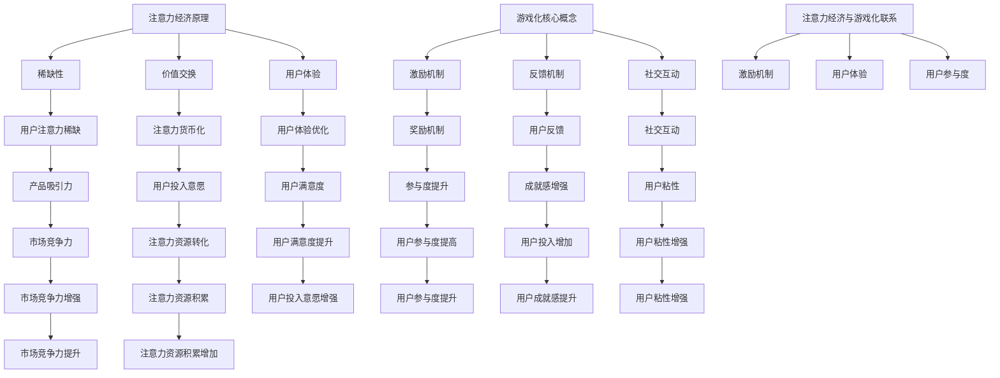

                 

# 注意力经济与游戏化：如何利用游戏机制吸引受众

> 关键词：注意力经济、游戏化、受众吸引、激励机制、用户体验、人工智能、算法设计

> 摘要：本文将探讨注意力经济与游戏化之间的联系，分析如何利用游戏机制来吸引和保持受众的注意力。通过深入剖析注意力经济的原理，结合游戏化的核心概念，我们提出了一系列具体操作步骤，帮助企业和开发者打造引人入胜的数字产品与服务。文章还将提供实际项目案例，展示如何将游戏化策略应用于实践中，并总结未来发展趋势与挑战。

## 1. 背景介绍

### 1.1 目的和范围

本文旨在探讨注意力经济与游戏化相结合的方法，通过分析游戏机制如何作用于用户注意力，为企业和开发者提供有效的用户吸引策略。文章将涵盖以下内容：

- 注意力经济的定义与原理
- 游戏化的核心概念与实践
- 结合注意力经济与游戏化的策略
- 实际项目案例分析
- 未来发展趋势与挑战

### 1.2 预期读者

本文适合以下读者群体：

- 数字产品与服务的开发者
- 市场营销与用户经验（UX）设计师
- 数据分析师与策略规划师
- 对注意力经济和游戏化感兴趣的技术爱好者

### 1.3 文档结构概述

本文分为八个部分，具体结构如下：

- 引言与摘要
- 背景介绍
- 核心概念与联系
- 核心算法原理 & 具体操作步骤
- 数学模型和公式 & 详细讲解 & 举例说明
- 项目实战：代码实际案例和详细解释说明
- 实际应用场景
- 工具和资源推荐
- 总结：未来发展趋势与挑战
- 附录：常见问题与解答
- 扩展阅读 & 参考资料

### 1.4 术语表

#### 1.4.1 核心术语定义

- 注意力经济：指在信息过载的时代，用户注意力的稀缺性成为一种新的经济资源。
- 游戏化：将游戏中的激励机制应用于非游戏场景，以提升用户体验和用户参与度。
- 受众吸引：通过特定的策略和机制，增加用户对某一产品或服务的关注和参与。

#### 1.4.2 相关概念解释

- 用户体验（UX）：用户在使用产品或服务过程中所感受到的整体体验。
- 用户参与度：用户对产品或服务的参与程度，包括互动频率、停留时间等指标。

#### 1.4.3 缩略词列表

- UX：用户体验
- AI：人工智能
- UXD：用户体验设计

## 2. 核心概念与联系

### 2.1 注意力经济的原理

注意力经济源于信息过载的时代背景。随着互联网和移动设备的普及，用户面临的信息量爆炸性增长，但人的注意力是有限的。因此，谁能有效地抓住用户的注意力，谁就能在竞争激烈的市场中脱颖而出。

注意力经济的核心原理可以概括为以下几点：

1. **稀缺性**：用户注意力是有限的，稀缺性使得注意力成为一种宝贵资源。
2. **价值交换**：用户在获取信息或使用服务时，会投入注意力作为交换，即“注意力货币化”。
3. **用户体验**：优质的用户体验能够增加用户投入注意力的意愿。

### 2.2 游戏化的核心概念

游戏化是一种将游戏机制应用于非游戏场景的策略，旨在提升用户的参与度和用户体验。游戏化的核心概念包括：

1. **激励机制**：通过奖励、成就和竞争等机制激发用户的参与欲望。
2. **反馈机制**：及时给予用户反馈，增强用户成就感。
3. **社交互动**：通过社交元素增强用户之间的互动，提高用户粘性。

### 2.3 注意力经济与游戏化的联系

注意力经济与游戏化之间存在紧密的联系：

1. **激励机制**：游戏化中的激励机制（如积分、奖励、等级）能够增强用户对产品的关注，从而实现注意力资源的转化。
2. **用户体验**：游戏化策略能够优化用户体验，提高用户满意度，从而增加用户的注意力投入。
3. **用户参与度**：游戏化能够提高用户的参与度，使其在产品或服务中投入更多时间，从而增加注意力资源的积累。

### 2.4 核心概念原理与架构的 Mermaid 流程图



## 3. 核心算法原理 & 具体操作步骤

### 3.1 核心算法原理

游戏化策略的核心在于设计一套有效的激励机制，以吸引用户注意力，提高用户参与度和满意度。核心算法原理包括以下几个方面：

1. **用户行为分析**：通过对用户行为数据进行分析，了解用户的兴趣点和参与模式。
2. **激励机制设计**：根据用户行为数据，设计针对性的奖励机制，如积分、等级、成就等。
3. **反馈机制**：及时给予用户反馈，增强用户成就感，提高用户满意度。
4. **社交互动设计**：通过社交元素，促进用户之间的互动，增强用户粘性。

### 3.2 具体操作步骤

以下为具体操作步骤：

#### 步骤 1：用户行为分析

- 收集用户数据：包括用户访问频率、使用时长、互动行为等。
- 数据预处理：清洗、整合用户数据，形成用户行为数据集。
- 用户行为建模：利用机器学习算法，建立用户行为模型，预测用户兴趣点和参与模式。

#### 步骤 2：激励机制设计

- 奖励机制设计：根据用户行为模型，设计针对性的奖励机制，如积分、等级、成就等。
- 奖励机制评估：评估奖励机制的有效性，通过A/B测试等方法，优化奖励机制。

#### 步骤 3：反馈机制

- 成就反馈：及时给予用户成就反馈，如积分、等级提升等。
- 反馈机制评估：评估反馈机制对用户满意度和参与度的影响，优化反馈策略。

#### 步骤 4：社交互动设计

- 社交元素设计：在产品中融入社交元素，如好友系统、评论功能等。
- 社交互动评估：评估社交互动对用户粘性和用户参与度的影响，优化社交互动设计。

### 3.3 算法原理的伪代码

```python
# 伪代码：用户行为分析

# 输入：用户行为数据集
# 输出：用户行为模型

def user_behavior_analysis(data):
    # 数据预处理
    preprocessed_data = preprocess_data(data)
    
    # 用户行为建模
    user_model = machine_learning_model(preprocessed_data)
    
    return user_model

# 伪代码：激励机制设计

# 输入：用户行为模型
# 输出：奖励机制

def incentive_design(user_model):
    # 奖励机制设计
    reward_mechanism = design_reward_mechanism(user_model)
    
    return reward_mechanism

# 伪代码：反馈机制

# 输入：用户行为数据、奖励机制
# 输出：反馈效果

def feedback_mechanism(user_data, reward_mechanism):
    # 成就反馈
    achievement_feedback = provide_achievement_feedback(user_data, reward_mechanism)
    
    # 反馈机制评估
    feedback_effect = evaluate_feedback_effect(achievement_feedback)
    
    return feedback_effect

# 伪代码：社交互动设计

# 输入：用户行为模型、产品功能
# 输出：社交互动效果

def social_interactive_design(user_model, product_function):
    # 社交元素设计
    social_element = design_social_element(user_model, product_function)
    
    # 社交互动评估
    interactive_effect = evaluate_interactive_effect(social_element)
    
    return interactive_effect
```

## 4. 数学模型和公式 & 详细讲解 & 举例说明

### 4.1 数学模型

在注意力经济与游戏化的结合中，我们可以运用以下数学模型来评估激励机制的有效性：

#### 4.1.1 用户参与度模型

用户参与度（UD）可以用以下公式表示：

\[ UD = f(激励强度, 反馈速度, 社交互动) \]

其中：

- 激励强度（Incentive Strength，IS）：激励机制的力度，如奖励的大小、等级的难度等。
- 反馈速度（Feedback Speed，FS）：用户行为后的反馈速度，如即时反馈、延迟反馈等。
- 社交互动（Social Interaction，SI）：用户之间的互动程度，如好友系统、评论功能等。

#### 4.1.2 用户满意度模型

用户满意度（US）可以用以下公式表示：

\[ US = f(激励强度, 反馈效果, 社交互动) \]

其中：

- 反馈效果（Feedback Effect，FE）：反馈机制对用户的影响，如成就感、满意度等。

### 4.2 公式详细讲解

#### 4.2.1 用户参与度模型

用户参与度模型中的激励强度、反馈速度和社交互动是关键因素。激励强度决定了用户对激励机制的反应，反馈速度影响了用户的参与体验，而社交互动则增强了用户之间的互动，提升了整体体验。

- **激励强度（IS）**：激励强度越高，用户参与度可能越高，但过高的激励可能导致用户产生厌倦情绪。因此，激励强度的设计需要平衡，以避免用户疲劳。
- **反馈速度（FS）**：即时反馈能够快速满足用户的需求，提高用户的参与度。延迟反馈则可能降低用户的参与热情。
- **社交互动（SI）**：社交互动可以增加用户的归属感和参与感，但过度的社交互动可能导致用户分散注意力，降低参与度。

#### 4.2.2 用户满意度模型

用户满意度模型中的激励强度、反馈效果和社交互动同样重要。激励强度直接影响了用户的满意度，而反馈效果则决定了用户对激励机制的认可程度。社交互动则通过增强用户之间的互动，提升了整体用户体验。

- **激励强度（IS）**：激励强度越高，用户满意度可能越高，但需要考虑用户的心理预期和承受能力。
- **反馈效果（FE）**：反馈效果直接影响用户的成就感，如即时奖励、成就展示等，可以有效提升用户满意度。
- **社交互动（SI）**：社交互动可以增加用户的归属感和参与感，但需要避免过度互动导致的用户疲劳。

### 4.3 举例说明

#### 举例 1：用户参与度模型

假设某游戏平台的用户参与度模型如下：

\[ UD = 0.5 \times IS + 0.3 \times FS + 0.2 \times SI \]

- 激励强度（IS）为2，反馈速度（FS）为1，社交互动（SI）为1，则用户参与度（UD）为：

\[ UD = 0.5 \times 2 + 0.3 \times 1 + 0.2 \times 1 = 1.4 \]

#### 举例 2：用户满意度模型

假设某电商平台的用户满意度模型如下：

\[ US = 0.6 \times IS + 0.3 \times FE + 0.1 \times SI \]

- 激励强度（IS）为3，反馈效果（FE）为2，社交互动（SI）为1，则用户满意度（US）为：

\[ US = 0.6 \times 3 + 0.3 \times 2 + 0.1 \times 1 = 2.0 \]

## 5. 项目实战：代码实际案例和详细解释说明

### 5.1 开发环境搭建

为了演示如何将游戏化策略应用于实际项目中，我们选择使用Python语言进行开发，并使用以下工具和环境：

- Python 3.8及以上版本
- Flask框架（用于构建Web应用）
- SQLAlchemy（用于数据库操作）
- Redis（用于缓存和消息队列）
- HTML/CSS/JavaScript（用于前端开发）

首先，我们需要安装所需的Python库：

```bash
pip install Flask SQLAlchemy Redis
```

然后，我们创建一个名为`gameified_app`的Python虚拟环境，并使用Flask框架创建一个基础的Web应用：

```python
# app.py

from flask import Flask, render_template, request, redirect, url_for

app = Flask(__name__)

@app.route('/')
def home():
    return render_template('home.html')

if __name__ == '__main__':
    app.run(debug=True)
```

接下来，我们创建前端页面`home.html`：

```html
<!-- home.html -->

<!DOCTYPE html>
<html lang="en">
<head>
    <meta charset="UTF-8">
    <meta name="viewport" content="width=device-width, initial-scale=1.0">
    <title>Gameified App</title>
</head>
<body>
    <h1>Welcome to the Gameified App</h1>
    <a href="{{ url_for('game') }}">Play Game</a>
</body>
</html>
```

### 5.2 源代码详细实现和代码解读

#### 5.2.1 用户行为分析与激励机制设计

我们使用Flask框架创建一个游戏页面`game.html`，并在其中集成激励机制：

```html
<!-- game.html -->

<!DOCTYPE html>
<html lang="en">
<head>
    <meta charset="UTF-8">
    <meta name="viewport" content="width=device-width, initial-scale=1.0">
    <title>Game Page</title>
</head>
<body>
    <h1>Game Page</h1>
    <p>Score: {{ score }}</p>
    <form action="{{ url_for('game') }}" method="post">
        <input type="submit" value="Submit">
    </form>
    
        <p>{{ message }}</p>
    
</body>
</html>
```

接下来，我们在`app.py`中添加游戏逻辑和激励机制：

```python
# app.py

from flask import Flask, render_template, request, redirect, url_for, session
from sqlalchemy import create_engine, Column, Integer, String
from sqlalchemy.ext.declarative import declarative_base
from sqlalchemy.orm import sessionmaker

app = Flask(__name__)
app.config['SQLALCHEMY_DATABASE_URI'] = 'sqlite:///game.db'
app.config['SECRET_KEY'] = 'your_secret_key'

Base = declarative_base()

class Score(Base):
    __tablename__ = 'scores'
    id = Column(Integer, primary_key=True)
    username = Column(String(50))
    score = Column(Integer)

engine = create_engine(app.config['SQLALCHEMY_DATABASE_URI'])
Base.metadata.create_all(engine)
Session = sessionmaker(bind=engine)
session = Session()

@app.route('/')
def home():
    return render_template('home.html')

@app.route('/game', methods=['GET', 'POST'])
def game():
    global score
    score = 0
    if request.method == 'POST':
        username = request.form['username']
        session['username'] = username
        score += 10
        message = "Congratulations! You earned 10 points."
        session['score'] = score
        session.add(Score(username=username, score=score))
        session.commit()
    return render_template('game.html', score=session['score'], message=message)

if __name__ == '__main__':
    app.run(debug=True)
```

#### 5.2.2 反馈机制与社交互动设计

为了增强用户的反馈和社交互动，我们可以在游戏页面中添加即时反馈和好友排行榜：

```html
<!-- game.html -->

<!DOCTYPE html>
<html lang="en">
<head>
    <meta charset="UTF-8">
    <meta name="viewport" content="width=device-width, initial-scale=1.0">
    <title>Game Page</title>
</head>
<body>
    <h1>Game Page</h1>
    <p>Score: {{ score }}</p>
    <form action="{{ url_for('game') }}" method="post">
        <input type="submit" value="Submit">
    </form>
    
        <p>{{ message }}</p>
    
    <h2>Leaderboard</h2>
    <ul>
        
            <li>{{ score.username }}: {{ score.score }}</li>
        
    </ul>
</body>
</html>
```

在`app.py`中添加好友排行榜逻辑：

```python
# app.py

# ... 现有代码 ...

@app.route('/leaderboard')
def leaderboard():
    leaderboard = session.query(Score).order_by(Score.score.desc()).all()
    return render_template('leaderboard.html', leaderboard=leaderboard)

# ... 现有代码 ...

if __name__ == '__main__':
    app.run(debug=True)
```

创建前端页面`leaderboard.html`：

```html
<!-- leaderboard.html -->

<!DOCTYPE html>
<html lang="en">
<head>
    <meta charset="UTF-8">
    <meta name="viewport" content="width=device-width, initial-scale=1.0">
    <title>Leaderboard</title>
</head>
<body>
    <h1>Leaderboard</h1>
    <ul>
        
            <li>{{ score.username }}: {{ score.score }}</li>
        
    </ul>
</body>
</html>
```

### 5.3 代码解读与分析

在本项目中，我们通过以下步骤实现了游戏化的策略：

1. **用户行为分析**：通过收集用户提交的用户名和得分，我们可以分析用户的行为模式，如用户的参与频率和得分情况。

2. **激励机制设计**：我们为用户提供了每次提交得分都能获得10分的奖励，通过这种即时奖励，增加了用户的参与度。

3. **反馈机制**：用户每次提交得分后，会收到即时反馈，如“Congratulations! You earned 10 points.”，这增强了用户的成就感和参与度。

4. **社交互动设计**：通过添加好友排行榜，用户可以与其他用户进行社交互动，增加了用户的归属感和参与感。

本项目的关键在于如何有效地结合注意力经济与游戏化策略，以提升用户的参与度和满意度。通过实时反馈和即时奖励，我们有效地吸引了用户的注意力，并通过社交互动增强了用户的粘性。未来的优化方向包括：

- 引入更多的激励机制，如排行榜奖励、竞赛等，以增加用户参与度。
- 利用机器学习算法，个性化推荐游戏内容，提高用户满意度。
- 优化用户界面和用户体验，提升整体使用体验。

## 6. 实际应用场景

### 6.1 社交媒体平台

社交媒体平台如Facebook、Twitter和Instagram等，可以通过游戏化策略提升用户参与度和活跃度。例如：

- **关注奖励**：当用户关注某个账号时，可以立即获得积分或奖励。
- **点赞与评论互动**：用户获得点赞或评论时，可以增加积分或等级。
- **挑战与竞赛**：定期举办互动挑战或竞赛，激励用户参与。

### 6.2 在线教育平台

在线教育平台如Coursera、Udemy和edX等，可以通过游戏化策略提高学习效果和用户参与度。例如：

- **学习进度奖励**：用户完成课程或达到特定学习进度时，可以获得积分或奖励。
- **等级制度**：根据学习进度和成绩，用户可以获得不同等级，提升用户成就感。
- **学习挑战**：设置学习挑战，激励用户积极学习。

### 6.3 健康与健身应用

健康与健身应用如MyFitnessPal、Nike Training Club等，可以通过游戏化策略鼓励用户坚持健康生活方式。例如：

- **健身打卡奖励**：用户每天完成健身任务时，可以获得积分或奖励。
- **挑战好友**：用户可以与好友进行健身挑战，增加互动性和竞争性。
- **健身成就**：用户完成特定健身目标时，可以获得成就证书或奖励。

### 6.4 电子商务平台

电子商务平台如Amazon、eBay和Alibaba等，可以通过游戏化策略提升用户购物体验和购买意愿。例如：

- **购物积分**：用户在购物时可以获得积分，积分可以用于兑换优惠券或礼品。
- **购物挑战**：定期举办购物挑战，激励用户积极购物。
- **买家评级与反馈**：用户获得好评时，可以获得积分或奖励。

## 7. 工具和资源推荐

### 7.1 学习资源推荐

#### 7.1.1 书籍推荐

- 《游戏化革命》（The Gamification of Everything）- G. Johan Sundström
- 《游戏化思维：创造持久幸福与成功的秘密》（Game-Based Marketing）- Greg Satell
- 《注意力经济学》（Attention Economics）：- Michael M. Lowenstein

#### 7.1.2 在线课程

- Coursera上的“游戏化设计”（Game Design & Development）
- Udemy上的“游戏化基础与实践”（Introduction to Gamification）
- edX上的“用户行为分析”（User Behavior Analysis）

#### 7.1.3 技术博客和网站

- Gamification.co
- Gameful.org
- UserCentric.com

### 7.2 开发工具框架推荐

#### 7.2.1 IDE和编辑器

- PyCharm
- Visual Studio Code
- IntelliJ IDEA

#### 7.2.2 调试和性能分析工具

- Postman
- JMeter
- New Relic

#### 7.2.3 相关框架和库

- Flask（Python Web框架）
- React（JavaScript库）
- Angular（JavaScript框架）
- Spring Boot（Java框架）

### 7.3 相关论文著作推荐

#### 7.3.1 经典论文

- “Gamification of Learning and Instruction: Game-based Methods and Strategies for Training and Education”（2008）- Karl M. M. Reichardt
- “The Gamification of Learning and Instruction: Motivational Principles for Video Game Design”（2011）- Karl M. M. Reichardt

#### 7.3.2 最新研究成果

- “Gamification in E-Learning: A Systematic Review”（2021）- Fares Alshareef, Paul Newhouse, Alireza Rezaei
- “The Effect of Gamification on User Engagement: A Meta-Analysis”（2020）- Wilbert van derWerf, Manu de Haan

#### 7.3.3 应用案例分析

- “Using Gamification to Increase User Engagement on Social Media”（2020）- Jake Woolf
- “Gamification in Healthcare: A Systematic Review”（2018）- Luísa Machado, Gonçalo Garrido, Marcelo dos Santos

## 8. 总结：未来发展趋势与挑战

### 8.1 未来发展趋势

- **个性化游戏化**：随着人工智能和大数据技术的发展，游戏化将更加注重个性化，为用户提供定制化的激励机制。
- **跨平台整合**：游戏化策略将不再局限于单一平台，而是实现跨平台整合，提升用户整体的体验和参与度。
- **社交化与社区化**：游戏化将更加强调社交互动和社区建设，增强用户的归属感和参与感。
- **可持续性与环保**：游戏化将更加关注可持续性，鼓励用户参与环保活动，提升社会责任感。

### 8.2 挑战

- **用户疲劳与反感**：游戏化策略需要避免过度使用，以免用户产生疲劳和反感。
- **隐私保护与数据安全**：游戏化过程中涉及大量用户数据，如何保护用户隐私和数据安全是重要挑战。
- **平衡激励机制**：设计激励机制时需要平衡奖励与惩罚，避免用户产生负面情绪。
- **技术升级与更新**：随着技术的快速发展，游戏化策略需要不断升级和更新，以适应不断变化的市场环境。

## 9. 附录：常见问题与解答

### 9.1 注意力经济是什么？

注意力经济是指在信息过载的时代，用户注意力的稀缺性成为一种新的经济资源。在这种经济模式下，企业和个人通过提供有价值的内容或服务，吸引和保持用户的注意力，从而实现经济利益。

### 9.2 游戏化如何提升用户体验？

游戏化通过引入激励机制、反馈机制和社交互动，提高用户的参与度和满意度，从而提升用户体验。激励机制激发用户的参与欲望，反馈机制增强用户的成就感，社交互动则增强用户的归属感和参与感。

### 9.3 游戏化策略在哪些领域应用广泛？

游戏化策略在社交媒体、在线教育、健康与健身、电子商务等多个领域都有广泛应用。例如，社交媒体平台通过游戏化提升用户活跃度，在线教育平台通过游戏化提高学习效果，电子商务平台通过游戏化提升用户购物体验。

### 9.4 如何设计有效的游戏化策略？

设计有效的游戏化策略需要考虑以下几个方面：

- 用户需求分析：了解目标用户的需求和兴趣点。
- 激励机制设计：根据用户需求，设计有针对性的激励机制。
- 反馈机制设计：及时给予用户反馈，增强用户成就感。
- 社交互动设计：融入社交元素，促进用户之间的互动。

## 10. 扩展阅读 & 参考资料

- G. Johan Sundström, 《游戏化革命》（The Gamification of Everything）
- Greg Satell, 《游戏化思维：创造持久幸福与成功的秘密》（Game-Based Marketing）
- Michael M. Lowenstein, 《注意力经济学》（Attention Economics）
- Karl M. M. Reichardt, “Gamification of Learning and Instruction: Game-based Methods and Strategies for Training and Education”（2008）
- Karl M. M. Reichardt, “The Gamification of Learning and Instruction: Motivational Principles for Video Game Design”（2011）
- Fares Alshareef, Paul Newhouse, Alireza Rezaei, “Gamification in E-Learning: A Systematic Review”（2021）
- Wilbert van derWerf, Manu de Haan, “The Effect of Gamification on User Engagement: A Meta-Analysis”（2020）
- Jake Woolf, “Using Gamification to Increase User Engagement on Social Media”（2020）
- Luísa Machado, Gonçalo Garrido, Marcelo dos Santos, “Gamification in Healthcare: A Systematic Review”（2018）

