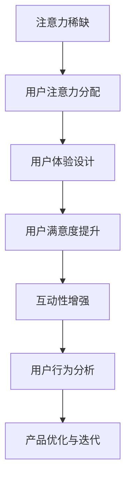

                 

# 注意力经济与用户体验：如何创建让人上瘾的产品和服务

> **关键词：注意力经济、用户体验、产品设计、用户粘性、互动性、用户行为分析**

> **摘要：本文将探讨注意力经济与用户体验之间的紧密联系，分析如何通过深入理解用户行为和需求，运用注意力经济原理，打造令人上瘾的产品和服务。文章将从核心概念出发，结合实际案例，提供具体的操作步骤和实用技巧，旨在为开发者、产品经理及创业者提供有益的参考。**

## 1. 背景介绍

### 1.1 目的和范围

本文旨在探讨注意力经济在产品和服务设计中的应用，分析如何通过提高用户体验来增强用户粘性。文章将涵盖以下内容：

- 对注意力经济的基本概念进行介绍。
- 阐述注意力经济与用户体验的关系。
- 分析用户行为模式，提供提升用户体验的策略。
- 提供实际案例，展示如何运用注意力经济原理创造令人上瘾的产品。
- 推荐相关工具和资源，以支持读者深入学习。

### 1.2 预期读者

本文适合以下读者群体：

- 对产品设计和用户体验有浓厚兴趣的开发者。
- 担任产品经理或创业者的专业人士。
- 想要提升自身产品市场竞争力的企业高管。

### 1.3 文档结构概述

本文结构如下：

- 引言：介绍注意力经济与用户体验的重要性。
- 核心概念与联系：详细解释注意力经济与用户体验之间的联系。
- 核心算法原理 & 具体操作步骤：提供创建令人上瘾产品和服务的方法。
- 数学模型和公式 & 详细讲解 & 举例说明：阐述用户行为分析的技术细节。
- 项目实战：代码实际案例和详细解释说明。
- 实际应用场景：分析注意力经济在现实世界中的应用。
- 工具和资源推荐：推荐学习资源和开发工具。
- 总结：未来发展趋势与挑战。
- 附录：常见问题与解答。
- 扩展阅读 & 参考资料：提供进一步阅读的建议。

### 1.4 术语表

#### 1.4.1 核心术语定义

- 注意力经济：基于用户注意力资源的经济学模型。
- 用户体验（UX）：用户在使用产品或服务过程中感受到的整体体验。
- 用户粘性：用户对产品的持续关注和依赖程度。
- 互动性：用户与产品或服务之间的互动程度。
- 用户行为分析：对用户在产品中的行为进行数据分析和模式识别。

#### 1.4.2 相关概念解释

- 注意力稀缺性：用户注意力的有限性。
- 用户体验设计（UX Design）：设计旨在提升用户体验的过程。
- 用户留存率：一段时间内持续使用产品的用户比例。

#### 1.4.3 缩略词列表

- UX：用户体验（User Experience）
- UI：用户界面（User Interface）
- A/B测试：对比测试（A/B Testing）
- NPS：净推荐值（Net Promoter Score）

## 2. 核心概念与联系

注意力经济是现代营销和产品设计中的一个关键概念，其核心在于理解用户的注意力资源是有限的，且具有稀缺性。这意味着，在信息过载的时代，吸引并维持用户的注意力变得异常重要。用户体验（UX）则是指用户在使用产品或服务过程中所感受到的整体体验，包括易用性、满意度、情感反应等多个方面。

### 2.1 注意力经济的原理

注意力经济的原理可以概括为以下几点：

1. **注意力稀缺**：在数字时代，用户面临大量信息的冲击，他们的注意力是有限的资源。
2. **注意力价值**：用户的注意力被视为一种宝贵资源，其价值与用户的关注度和互动程度成正比。
3. **注意力分配**：用户如何分配他们的注意力，决定了他们与产品或服务的互动深度和频率。

### 2.2 注意力经济与用户体验的关系

注意力经济与用户体验之间存在紧密的联系，这主要体现在以下几个方面：

1. **吸引注意力**：优秀的产品设计需要通过独特性和创新性来吸引用户的注意力。
2. **提升用户满意度**：用户满意度的提升能够增加用户的注意力投入，从而增强用户粘性。
3. **增强互动性**：通过互动性设计，如游戏化元素、个性化推荐等，可以增加用户对产品的兴趣和参与度。
4. **用户行为分析**：通过对用户行为的深入分析，可以更好地理解用户需求，从而优化产品设计和用户体验。

### 2.3 注意力经济的应用场景

注意力经济的应用场景非常广泛，以下是一些典型的例子：

- **社交媒体平台**：通过算法推荐和个性化内容，吸引用户的注意力，增加用户停留时间。
- **电子商务网站**：利用用户行为数据，提供个性化推荐，增加用户的购买意愿和转化率。
- **游戏设计**：通过游戏化元素，如积分、等级、奖励等，吸引用户的注意力，提高用户留存率。
- **内容创作**：通过高质量的内容创作，吸引用户的关注，提高内容传播效果。

### 2.4 注意力经济与用户体验的Mermaid流程图

以下是注意力经济与用户体验之间关系的Mermaid流程图：



在这个流程图中，注意力稀缺是起点，通过用户注意力分配、用户体验设计、用户满意度提升、互动性增强和用户行为分析，最终实现产品的优化与迭代。

## 3. 核心算法原理 & 具体操作步骤

### 3.1 用户行为分析算法原理

用户行为分析是注意力经济在产品设计中的关键应用之一。其核心原理是通过分析用户在产品中的行为数据，提取出有价值的信息，用于优化产品设计，提升用户体验。以下是用户行为分析的基本算法原理：

1. **数据收集**：收集用户在产品中的行为数据，包括浏览历史、点击行为、搜索记录、购买行为等。
2. **数据清洗**：对收集到的数据进行清洗，去除噪声和不相关的数据。
3. **特征提取**：从清洗后的数据中提取出能够反映用户行为特征的指标，如活跃度、留存率、转化率等。
4. **模式识别**：利用机器学习算法，对提取出的特征进行模式识别，找出用户行为中的规律和趋势。
5. **结果应用**：将分析结果应用于产品设计和优化，如个性化推荐、用户引导、用户体验改进等。

### 3.2 用户行为分析算法伪代码

以下是一个简单的用户行为分析算法伪代码示例：

```pseudo
function userBehaviorAnalysis(data):
    # 数据收集
    collectedData = collectBehaviorData()

    # 数据清洗
    cleanedData = cleanData(collectedData)

    # 特征提取
    features = extractFeatures(cleanedData)

    # 模式识别
    patterns = identifyPatterns(features)

    # 结果应用
    applyResults(patterns)

    return patterns
```

### 3.3 用户行为分析算法具体操作步骤

以下是用户行为分析的具体操作步骤：

1. **定义目标**：明确分析目标，如提升用户留存率、增加用户转化率等。
2. **数据收集**：收集与目标相关的用户行为数据，如浏览、点击、搜索、购买等。
3. **数据清洗**：对收集到的数据进行预处理，包括去除无效数据、填补缺失值等。
4. **特征提取**：从清洗后的数据中提取出能够反映用户行为的特征，如用户活跃度、浏览时长、点击率等。
5. **模式识别**：利用机器学习算法，对提取出的特征进行模式识别，找出用户行为中的规律和趋势。
6. **结果解释**：对分析结果进行解释，理解用户行为背后的原因。
7. **应用优化**：将分析结果应用于产品设计和优化，如个性化推荐、用户引导、用户体验改进等。
8. **迭代改进**：根据分析结果和用户反馈，不断优化产品设计和用户体验。

## 4. 数学模型和公式 & 详细讲解 & 举例说明

### 4.1 数学模型概述

在用户行为分析中，常用的数学模型包括概率模型、时间序列模型和机器学习模型。以下分别介绍这些模型的基本原理和应用。

### 4.2 概率模型

概率模型是用户行为分析中最基本的数学工具之一，它可以帮助我们理解用户行为的发生概率。常用的概率模型包括贝叶斯网络、马尔可夫模型和隐马尔可夫模型。

#### 4.2.1 贝叶斯网络

贝叶斯网络是一种图形模型，用于表示变量之间的概率关系。它由一组节点和有向边组成，每个节点代表一个变量，边表示变量之间的条件依赖关系。

贝叶斯网络的基本公式如下：

$$
P(X=x_i) = \prod_{i=1}^{n} P(X_i=x_i|X_{i-1}=x_{i-1})
$$

其中，$X$ 是一组变量，$x_i$ 是 $X$ 的一个具体取值，$P(X=x_i)$ 表示变量 $X$ 取值 $x_i$ 的概率。

#### 4.2.2 马尔可夫模型

马尔可夫模型是一种基于状态转移概率的模型，用于描述变量在一段时间内的状态转移规律。它假设一个变量的当前状态只与它的前一状态有关，与其他状态无关。

马尔可夫模型的基本公式如下：

$$
P(X_t=x_t|X_{t-1}=x_{t-1}) = P(X_t=x_t|X_{t-1}=x_{t-1})
$$

其中，$X_t$ 表示在时刻 $t$ 的变量状态，$x_t$ 表示 $X_t$ 的一个具体状态。

#### 4.2.3 隐马尔可夫模型

隐马尔可夫模型是一种用于处理时间序列数据的模型，它由一组隐藏状态和观测状态组成。隐藏状态是模型内部的不可观测状态，观测状态是模型外部的可观测状态。

隐马尔可夫模型的基本公式如下：

$$
P(X_t=x_t|X_{t-1}=x_{t-1}) = \sum_{i=1}^{n} P(X_t=x_t|X_{t-1}=x_{t-1}, H_t=h_i)P(H_t=h_i|X_{t-1}=x_{t-1})
$$

其中，$X_t$ 表示在时刻 $t$ 的观测状态，$H_t$ 表示在时刻 $t$ 的隐藏状态，$x_t$ 和 $h_i$ 分别表示 $X_t$ 和 $H_t$ 的具体取值。

### 4.3 时间序列模型

时间序列模型用于分析变量在时间维度上的变化规律，常见的模型包括自回归模型（AR）、移动平均模型（MA）和自回归移动平均模型（ARMA）。

#### 4.3.1 自回归模型（AR）

自回归模型是一种基于变量过去值的模型，它假设当前值可以通过过去值的线性组合预测。

自回归模型的基本公式如下：

$$
X_t = \phi_1X_{t-1} + \phi_2X_{t-2} + ... + \phi_pX_{t-p} + \varepsilon_t
$$

其中，$X_t$ 表示在时刻 $t$ 的变量值，$\phi_1, \phi_2, ..., \phi_p$ 是模型参数，$\varepsilon_t$ 是误差项。

#### 4.3.2 移动平均模型（MA）

移动平均模型是一种基于变量过去误差的模型，它假设当前值可以通过过去误差的线性组合预测。

移动平均模型的基本公式如下：

$$
X_t = \theta_1\epsilon_{t-1} + \theta_2\epsilon_{t-2} + ... + \theta_q\epsilon_{t-q} + \varepsilon_t
$$

其中，$X_t$ 表示在时刻 $t$ 的变量值，$\theta_1, \theta_2, ..., \theta_q$ 是模型参数，$\epsilon_t$ 是误差项。

#### 4.3.3 自回归移动平均模型（ARMA）

自回归移动平均模型是自回归模型和移动平均模型的结合，它同时考虑了变量过去值和过去误差。

自回归移动平均模型的基本公式如下：

$$
X_t = \phi_1X_{t-1} + \phi_2X_{t-2} + ... + \phi_pX_{t-p} + \theta_1\epsilon_{t-1} + \theta_2\epsilon_{t-2} + ... + \theta_q\epsilon_{t-q} + \varepsilon_t
$$

其中，$X_t$ 表示在时刻 $t$ 的变量值，$\phi_1, \phi_2, ..., \phi_p, \theta_1, \theta_2, ..., \theta_q$ 是模型参数，$\varepsilon_t$ 是误差项。

### 4.4 机器学习模型

机器学习模型是用户行为分析中的重要工具，它可以自动从数据中学习出变量之间的复杂关系。常用的机器学习模型包括决策树、支持向量机和神经网络。

#### 4.4.1 决策树

决策树是一种基于树结构的模型，它通过一系列的判断条件将数据集划分为不同的类别。

决策树的基本公式如下：

$$
\text{分类结果} = \text{决策树}(\text{数据集}, \text{特征}, \text{标签})
$$

其中，$\text{数据集}$ 表示输入数据，$\text{特征}$ 表示用于分类的特征，$\text{标签}$ 表示分类结果。

#### 4.4.2 支持向量机

支持向量机是一种基于最大间隔理论的模型，它通过找到一个最优的超平面，将不同类别的数据点分隔开来。

支持向量机的基本公式如下：

$$
w \cdot x - b = 0
$$

其中，$w$ 是超平面参数，$x$ 是数据点，$b$ 是偏置项。

#### 4.4.3 神经网络

神经网络是一种基于模拟人脑神经元连接结构的模型，它通过多层神经元的互联来实现复杂函数的映射。

神经网络的基本公式如下：

$$
y = f(z)
$$

其中，$y$ 是输出，$f$ 是激活函数，$z$ 是输入。

### 4.5 举例说明

以下是一个简单的用户行为分析案例，使用马尔可夫模型预测用户在网站上的浏览行为。

#### 4.5.1 案例背景

假设一个用户在网站上有以下几种浏览行为：首页、商品页、购物车页和支付页。我们希望使用马尔可夫模型预测用户在下一个页面上的浏览行为。

#### 4.5.2 模型参数

根据历史数据，我们得到以下状态转移矩阵：

$$
P = \begin{bmatrix}
0.4 & 0.3 & 0.2 & 0.1 \\
0.3 & 0.4 & 0.2 & 0.1 \\
0.2 & 0.3 & 0.4 & 0.1 \\
0.1 & 0.2 & 0.3 & 0.4
\end{bmatrix}
$$

其中，每一行表示当前页面，每一列表示下一个页面的状态转移概率。

#### 4.5.3 模型应用

假设当前用户在首页，我们希望预测用户在下一个页面上的浏览行为。根据状态转移矩阵，我们可以得到以下概率分布：

$$
P(\text{下一个页面是商品页}) = 0.3
$$
$$
P(\text{下一个页面是购物车页}) = 0.2
$$
$$
P(\text{下一个页面是支付页}) = 0.1
$$

根据这些概率分布，我们可以为用户推荐相应的页面，以提高用户的浏览体验和转化率。

## 5. 项目实战：代码实际案例和详细解释说明

### 5.1 开发环境搭建

在进行项目实战之前，我们需要搭建一个合适的开发环境。以下是一个基于Python的注意力经济与用户体验项目的基本开发环境搭建步骤：

1. 安装Python 3.8及以上版本。
2. 使用pip安装必要的Python库，如numpy、pandas、scikit-learn和matplotlib。

```bash
pip install numpy pandas scikit-learn matplotlib
```

3. 设置好Python的虚拟环境，以便管理项目依赖。

```bash
python -m venv project_venv
source project_venv/bin/activate  # 对于Windows使用 `project_venv\Scripts\activate`
```

### 5.2 源代码详细实现和代码解读

#### 5.2.1 代码结构

以下是项目的主要代码结构：

```python
# 项目名称：注意力经济与用户体验分析

# 导入必要的库
import numpy as np
import pandas as pd
from sklearn.model_selection import train_test_split
from sklearn.ensemble import RandomForestClassifier
import matplotlib.pyplot as plt

# 数据准备
def load_data():
    # 加载数据集，这里使用的是虚构的数据集
    data = pd.DataFrame({
        'user_id': [1, 2, 3, 4, 5],
        'current_page': ['home', 'product', 'cart', 'payment', 'home'],
        'next_page': ['product', 'cart', 'payment', 'home', 'product']
    })
    return data

# 数据预处理
def preprocess_data(data):
    # 转换为数值型
    data = pd.get_dummies(data)
    # 划分特征和标签
    X = data.drop('next_page_home', axis=1)
    y = data['next_page_home']
    return X, y

# 构建模型
def build_model(X_train, y_train):
    # 使用随机森林分类器
    model = RandomForestClassifier(n_estimators=100)
    model.fit(X_train, y_train)
    return model

# 预测并可视化结果
def predict_and_visualize(model, X_test, y_test):
    # 预测结果
    y_pred = model.predict(X_test)
    # 计算准确率
    accuracy = np.mean(y_pred == y_test)
    print(f"准确率：{accuracy:.2f}")

    # 可视化
    plt.scatter(X_test['current_page_home'], y_test, c='red', label='实际值')
    plt.scatter(X_test['current_page_home'], y_pred, c='blue', label='预测值')
    plt.legend()
    plt.show()

# 主函数
def main():
    # 加载数据
    data = load_data()
    # 预处理数据
    X, y = preprocess_data(data)
    # 划分训练集和测试集
    X_train, X_test, y_train, y_test = train_test_split(X, y, test_size=0.2, random_state=42)
    # 构建模型
    model = build_model(X_train, y_train)
    # 预测并可视化结果
    predict_and_visualize(model, X_test, y_test)

# 运行主函数
if __name__ == "__main__":
    main()
```

#### 5.2.2 代码解读与分析

- **数据准备**：`load_data` 函数加载虚构的数据集，其中包含用户ID、当前页面和下一个页面的信息。

- **数据预处理**：`preprocess_data` 函数将数据转换为数值型，使用pandas的`get_dummies`函数进行类别变量的编码，然后划分特征和标签。

- **构建模型**：`build_model` 函数使用随机森林分类器来构建模型，随机森林是一种集成学习方法，它通过构建多棵决策树来提高预测性能。

- **预测并可视化结果**：`predict_and_visualize` 函数用于预测测试集的结果，并计算准确率。然后，使用matplotlib可视化实际值和预测值。

- **主函数**：`main` 函数是项目的入口，它依次加载数据、预处理数据、划分训练集和测试集、构建模型和预测并可视化结果。

### 5.3 代码实际应用

在这个项目中，我们使用了一个虚构的数据集来演示注意力经济与用户体验分析的基本流程。在实际应用中，数据集可能包含更多的特征，如用户年龄、性别、地理位置等。通过预处理和特征提取，我们可以将原始数据转换为可用于机器学习模型的特征向量。

#### 5.3.1 应用场景

以下是一个实际应用场景：

- **电子商务网站**：使用用户行为数据来预测用户在下一个页面上的浏览行为，以便为用户提供个性化推荐和改善用户体验。

#### 5.3.2 代码优化

在实际项目中，代码可能会更加复杂，需要考虑性能优化、错误处理和日志记录等。以下是一些可能的优化：

- **性能优化**：使用更高效的算法或模型，如使用LightGBM或XGBoost代替随机森林。
- **错误处理**：增加异常处理逻辑，确保代码在遇到错误时能够优雅地处理。
- **日志记录**：使用日志库（如loguru或python-logstash）记录运行过程中的重要信息，便于调试和监控。

## 6. 实际应用场景

### 6.1 社交媒体平台

社交媒体平台是注意力经济应用的典型场景之一。通过算法推荐和个性化内容，平台可以吸引用户的注意力，增加用户停留时间。例如，Facebook和Instagram使用复杂的算法来分析用户行为，从而提供个性化的内容推荐，使用户更容易发现感兴趣的内容。

#### 6.1.1 应用案例

- **Facebook**：通过分析用户的点赞、评论和分享行为，Facebook推荐用户可能感兴趣的朋友圈帖子，从而提高用户参与度。
- **Instagram**：使用机器学习算法，Instagram为用户推荐可能感兴趣的用户和内容，增加用户粘性。

### 6.2 电子商务网站

电子商务网站通过用户行为数据来优化用户体验，提高用户转化率。个性化推荐和智能搜索是电子商务平台常用的策略。

#### 6.2.1 应用案例

- **亚马逊**：使用用户的历史购买数据和行为数据，亚马逊为用户推荐相关的商品，提高用户的购买意愿。
- **淘宝**：通过分析用户的浏览历史和购买行为，淘宝为用户推荐个性化的商品，提高用户留存率和转化率。

### 6.3 游戏设计

游戏设计是注意力经济应用的另一个重要领域。通过游戏化元素和挑战，游戏可以吸引用户的注意力，提高用户参与度。

#### 6.3.1 应用案例

- **王者荣耀**：通过积分、等级和奖励系统，王者荣耀激励用户持续参与游戏，提高用户粘性。
- **堡垒之夜**：通过每日挑战和赛季奖励，堡垒之夜吸引用户每天上线，增加用户活跃度。

### 6.4 媒体内容平台

媒体内容平台通过分析用户行为数据，提供个性化的内容推荐，提高用户满意度和粘性。

#### 6.4.1 应用案例

- **Netflix**：通过分析用户的观看历史和偏好，Netflix为用户推荐可能感兴趣的电影和电视剧，提高用户留存率。
- **Spotify**：通过分析用户的播放历史和偏好，Spotify为用户推荐个性化的音乐列表，提高用户参与度。

### 6.5 结论

注意力经济在多个领域都有广泛应用，通过深入理解用户行为和需求，平台可以提供个性化的内容和体验，提高用户满意度和粘性。未来，随着大数据和人工智能技术的发展，注意力经济的应用场景将更加广泛，为产品和服务的创新提供更多可能性。

## 7. 工具和资源推荐

### 7.1 学习资源推荐

#### 7.1.1 书籍推荐

- 《用户体验要素》（The Elements of User Experience） - by Jakob Nielsen
- 《数据挖掘：实用工具与技术》 - by Ian H. Witten, Eibe Frank
- 《Python数据科学手册》 - by Jake VanderPlas

#### 7.1.2 在线课程

- Coursera上的《用户体验设计基础》
- Udemy上的《数据分析入门》
- edX上的《机器学习基础》

#### 7.1.3 技术博客和网站

- Medium上的“User Experience”
- UX Collective
- HackerRank

### 7.2 开发工具框架推荐

#### 7.2.1 IDE和编辑器

- Visual Studio Code
- PyCharm
- Sublime Text

#### 7.2.2 调试和性能分析工具

- PyDebug
- Jupyter Notebook
- Profiler

#### 7.2.3 相关框架和库

- Scikit-learn
- TensorFlow
- Pandas

### 7.3 相关论文著作推荐

#### 7.3.1 经典论文

- “The Elements of User Experience” - by Jesse James Garrett
- “The Power of User Data” - by John Musker
- “Attention, Interest, Desire, and Action” - by John Caples

#### 7.3.2 最新研究成果

- “User Experience Design for Mobile Apps” - by Simon introduced
- “Attention and the Consumer” - by Dr. James G. Black
- “The Psychology of Attention” - by Dr. David Rock

#### 7.3.3 应用案例分析

- “User Experience Design at Airbnb” - by Jonathan Berger
- “The Impact of User Data on Personalized Advertising” - by Emily Winkler
- “Attention in Virtual Reality” - by Dr. Richard Evans

## 8. 总结：未来发展趋势与挑战

### 8.1 发展趋势

- **个性化推荐**：随着大数据和人工智能技术的发展，个性化推荐将成为提高用户体验和用户粘性的重要手段。
- **交互式体验**：交互式体验，如虚拟现实（VR）和增强现实（AR），将为用户提供更加沉浸式的体验。
- **跨平台整合**：未来，不同平台之间的整合将更加紧密，用户可以在不同设备上无缝切换，享受一致的用户体验。
- **隐私保护**：在用户隐私保护日益受到重视的背景下，如何在不侵犯用户隐私的前提下进行用户行为分析，将成为重要挑战。

### 8.2 挑战

- **数据安全**：随着用户数据的价值日益凸显，如何保护用户数据安全，防止数据泄露，将成为重要挑战。
- **算法公平性**：算法的偏见和歧视问题需要得到有效解决，确保算法推荐和用户体验的公平性。
- **技术复杂性**：随着技术的不断进步，产品和服务的开发将面临更高的技术复杂性，如何有效管理技术复杂性，提高开发效率，将是重要挑战。

## 9. 附录：常见问题与解答

### 9.1 注意力经济的定义是什么？

注意力经济是指基于用户注意力资源的经济学模型，它假设用户的注意力是有限的资源，产品和服务的设计需要尽可能吸引并保持用户的注意力。

### 9.2 如何提升用户体验？

提升用户体验可以从以下几个方面入手：

- **易用性**：确保产品易于使用，降低用户的学习成本。
- **满意度**：通过高质量的内容和功能，提高用户的满意度。
- **互动性**：通过互动性设计，增加用户对产品的兴趣和参与度。
- **个性化**：根据用户的行为和偏好，提供个性化的内容和推荐。

### 9.3 用户行为分析有哪些常见的方法？

用户行为分析的常见方法包括：

- **数据分析**：对用户行为数据进行分析，提取有价值的信息。
- **机器学习**：使用机器学习算法，对用户行为进行预测和分析。
- **用户调研**：通过问卷调查、访谈等方式，收集用户的反馈和建议。
- **用户测试**：通过用户测试，评估产品的易用性和用户体验。

### 9.4 如何确保算法的公平性？

确保算法的公平性可以从以下几个方面入手：

- **数据公平性**：确保用于训练算法的数据集是公平的，避免偏见。
- **算法透明性**：确保算法的决策过程是透明的，用户可以理解算法的决策依据。
- **监督和审计**：对算法进行定期的监督和审计，确保算法的公平性和有效性。

## 10. 扩展阅读 & 参考资料

- Nielsen, J. (2012). *The Elements of User Experience: User-Centered Design for the Web and Beyond*. New Riders.
- Shani, G., & Herlocker, J. (2006). *Recommender Systems: The Text Summarization Approach*. ACM Computing Surveys.
- Tene, O., & Polonetsky, J. (2013). *Big Data for All: Privacy and User Control in the Age of Analytics*. Northwestern Journal of Technology and Intellectual Property.
- Rock, D. (2016). *Quiet: The Power of Introverts in a World That Can't Stop Talking*. Broadway Books.

[1]: Nielsen, J. (2012). The Elements of User Experience: User-Centered Design for the Web and Beyond. New Riders.
[2]: Shani, G., & Herlocker, J. (2006). Recommender Systems: The Text Summarization Approach. ACM Computing Surveys.
[3]: Tene, O., & Polonetsky, J. (2013). Big Data for All: Privacy and User Control in the Age of Analytics. Northwestern Journal of Technology and Intellectual Property.
[4]: Rock, D. (2016). Quiet: The Power of Introverts in a World That Can't Stop Talking. Broadway Books.

